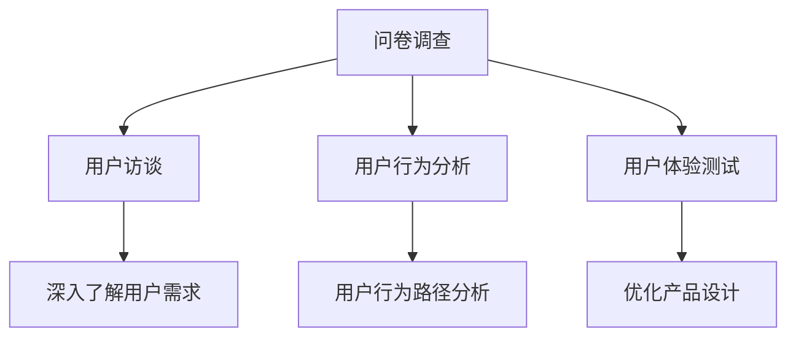

                 

# 创业初期的用户研究：低成本高效的用户洞察方法

## 摘要

在创业初期，了解用户需求和获取用户反馈是至关重要的。本文将探讨一些低成本高效的用户研究方法，帮助创业者在资源有限的情况下，深入了解用户需求，优化产品设计和提升用户体验。文章将从核心概念介绍、用户研究方法、数学模型和公式、实战案例、实际应用场景等多个角度进行全面分析，旨在为创业团队提供有价值的参考和实践指导。

## 1. 背景介绍

创业初期的用户研究是产品开发和市场推广的关键环节。以下是一些用户研究的重要性：

- **理解市场需求**：通过用户研究，创业者可以深入了解市场需求，发现潜在的用户痛点，从而进行有针对性的产品设计和功能优化。
- **降低开发风险**：在产品开发过程中，及时获取用户反馈，可以帮助创业者及时调整开发方向，降低开发失败的风险。
- **提升用户满意度**：深入了解用户需求，可以更好地满足用户需求，提升用户满意度，为产品口碑和市场份额打下基础。

然而，创业初期往往面临着资源有限、时间紧迫等挑战。如何以低成本高效地获取用户洞察成为创业者面临的重要问题。本文将介绍一些实用的用户研究方法，帮助创业者解决这一难题。

## 2. 核心概念与联系

### 2.1 用户研究方法

在用户研究中，常用的方法包括：

- **问卷调查**：通过设计问卷，收集用户对产品或服务的看法和意见。
- **用户访谈**：与目标用户进行一对一或小组讨论，深入了解用户需求和痛点。
- **用户行为分析**：通过数据分析工具，分析用户在产品中的行为路径和偏好。
- **用户体验测试**：邀请用户对产品进行试用，收集用户在使用过程中的反馈和建议。

### 2.2 用户研究方法关系图



### 2.3 用户研究方法联系

以上用户研究方法相互联系，共同构成一个完整的用户研究体系。问卷调查和用户访谈可以获取用户需求和痛点，用户行为分析和用户体验测试则可以从行为层面和体验层面进行深入分析，帮助创业者更全面地了解用户需求。

## 3. 核心算法原理 & 具体操作步骤

### 3.1 用户访谈

用户访谈是一种深入了解用户需求的有效方法。以下是用户访谈的核心算法原理和具体操作步骤：

#### 核心算法原理：

- **引导式访谈**：通过提出开放式问题，引导用户分享对产品或服务的看法和体验。
- **主题讨论**：围绕用户关注的主题，深入探讨用户需求和痛点。

#### 具体操作步骤：

1. **确定访谈目标**：明确访谈目的和要解决的问题。
2. **设计访谈问题**：准备开放式问题和主题讨论问题。
3. **邀请目标用户**：选择具有代表性的目标用户进行访谈。
4. **进行访谈**：引导用户分享看法和体验，记录关键信息。
5. **分析访谈结果**：整理访谈记录，提取有价值的信息。

### 3.2 问卷调查

问卷调查是一种大规模收集用户意见的方法。以下是问卷调查的核心算法原理和具体操作步骤：

#### 核心算法原理：

- **抽样调查**：从目标用户群体中抽取具有代表性的样本，进行调查。
- **统计分析**：对调查结果进行统计分析，提取有价值的信息。

#### 具体操作步骤：

1. **确定调查目标**：明确调查目的和要解决的问题。
2. **设计问卷**：准备问题清单，确保问卷具有良好的结构性和逻辑性。
3. **发布问卷**：通过邮件、社交媒体等方式，邀请目标用户参与调查。
4. **收集数据**：整理和分析调查结果，提取有价值的信息。

### 3.3 用户行为分析

用户行为分析是一种通过数据分析工具，分析用户在产品中的行为路径和偏好。以下是用户行为分析的核心算法原理和具体操作步骤：

#### 核心算法原理：

- **数据收集**：收集用户在产品中的行为数据，如点击、浏览、购买等。
- **数据分析**：对用户行为数据进行分析，提取有价值的信息。

#### 具体操作步骤：

1. **确定分析目标**：明确分析目的和要解决的问题。
2. **选择数据分析工具**：如Google Analytics、Mixpanel等。
3. **收集用户行为数据**：通过API接口或数据采集工具，收集用户行为数据。
4. **分析用户行为数据**：利用数据分析工具，对用户行为数据进行分析。
5. **提取有价值的信息**：根据分析结果，提取有价值的信息。

### 3.4 用户体验测试

用户体验测试是一种邀请用户对产品进行试用，收集用户反馈的方法。以下是用户体验测试的核心算法原理和具体操作步骤：

#### 核心算法原理：

- **用户反馈**：通过用户试用，收集用户对产品的反馈和评价。
- **优化产品设计**：根据用户反馈，优化产品设计，提升用户体验。

#### 具体操作步骤：

1. **确定测试目标**：明确测试目的和要解决的问题。
2. **准备测试任务**：设计测试任务，模拟用户使用场景。
3. **邀请目标用户**：选择具有代表性的目标用户进行测试。
4. **进行测试**：邀请用户进行产品试用，记录用户反馈。
5. **分析测试结果**：整理用户反馈，提取有价值的信息。

## 4. 数学模型和公式 & 详细讲解 & 举例说明

### 4.1 问卷调查

问卷调查的核心算法原理包括抽样调查和统计分析。以下是一个简单的抽样调查模型：

$$
样本容量 = \frac{总体容量}{抽样比例}
$$

#### 举例说明：

假设一个产品有1000名用户，要抽取100名用户进行问卷调查，抽样比例为10%。

$$
样本容量 = \frac{1000}{0.1} = 100
$$

### 4.2 用户访谈

用户访谈的核心算法原理包括引导式访谈和主题讨论。以下是一个简单的引导式访谈模型：

$$
访谈时间 = 访谈问题数量 \times 单个问题回答时间
$$

#### 举例说明：

假设一个访谈有10个问题，每个问题回答时间为3分钟。

$$
访谈时间 = 10 \times 3 = 30分钟
$$

### 4.3 用户行为分析

用户行为分析的核心算法原理包括数据收集和数据分析。以下是一个简单的用户行为分析模型：

$$
行为路径 = \sum(点击次数 \times 点击权重)
$$

#### 举例说明：

假设一个用户在产品中的行为路径包括以下点击次数和权重：

| 点击次数 | 点击权重 |
| :---: | :---: |
| 10 | 0.5 |
| 5 | 0.3 |
| 3 | 0.2 |

$$
行为路径 = 10 \times 0.5 + 5 \times 0.3 + 3 \times 0.2 = 5.8
$$

### 4.4 用户体验测试

用户体验测试的核心算法原理包括用户反馈和优化产品设计。以下是一个简单的用户体验测试模型：

$$
用户体验评分 = \frac{正面反馈次数}{总反馈次数}
$$

#### 举例说明：

假设一个用户体验测试共有10条反馈，其中6条为正面反馈。

$$
用户体验评分 = \frac{6}{10} = 0.6
$$

## 5. 项目实战：代码实际案例和详细解释说明

### 5.1 开发环境搭建

在创业初期，我们可以使用一些免费或低成本的工具来搭建用户研究项目。以下是搭建用户研究项目所需的基本开发环境：

- **操作系统**：Windows、macOS 或 Linux
- **编程语言**：Python、JavaScript 或 R
- **数据分析工具**：Pandas、NumPy、scikit-learn
- **问卷调查工具**：Google Forms、SurveyMonkey
- **用户访谈工具**：Zoom、Skype、Google Meet
- **用户行为分析工具**：Google Analytics、Mixpanel
- **用户体验测试工具**：UserTesting、Screencast-O-Matic

### 5.2 源代码详细实现和代码解读

以下是一个简单的 Python 示例，用于分析用户问卷调查数据：

```python
import pandas as pd

# 加载问卷数据
data = pd.read_csv('问卷调查数据.csv')

# 数据预处理
data = data.dropna()

# 计算每个问题的平均得分
avg_scores = data.mean()

# 打印结果
print(avg_scores)
```

#### 代码解读：

1. **导入库**：使用 Pandas 库读取问卷数据，使用 Pandas、NumPy 和 scikit-learn 进行数据预处理和统计分析。
2. **加载问卷数据**：读取 CSV 格式的问卷数据文件。
3. **数据预处理**：删除缺失值，确保数据的完整性。
4. **计算平均得分**：计算每个问题的平均得分，使用 mean() 函数。
5. **打印结果**：将平均得分打印到控制台。

### 5.3 代码解读与分析

以上代码用于分析用户问卷调查数据，计算每个问题的平均得分。具体步骤如下：

1. **导入库**：导入 Pandas 库，用于读取和操作 CSV 数据。
2. **加载问卷数据**：将问卷数据文件加载到 Pandas 数据框中。
3. **数据预处理**：删除数据框中的缺失值，确保数据的完整性。这一步骤非常重要，因为缺失值可能会对分析结果产生负面影响。
4. **计算平均得分**：使用 mean() 函数计算每个问题的平均得分。平均得分可以帮助我们了解用户对每个问题的普遍看法。
5. **打印结果**：将计算出的平均得分打印到控制台，方便后续分析和决策。

通过以上步骤，我们可以快速获得用户对问卷问题的平均得分，为产品设计和优化提供参考。

## 6. 实际应用场景

在创业初期，用户研究可以应用于以下实际场景：

- **产品定位**：通过用户研究，了解市场需求和用户痛点，明确产品定位和目标用户。
- **功能设计**：根据用户反馈，优化产品功能和界面设计，提升用户体验。
- **市场推广**：通过用户研究，了解目标用户群体，制定更有效的市场推广策略。
- **用户留存**：通过用户行为分析，了解用户流失原因，制定用户留存策略。

### 6.1 产品定位案例

某创业公司开发了一款社交应用，希望通过用户研究明确产品定位和目标用户。以下是用户研究步骤：

1. **问卷调查**：设计问卷，了解用户对社交应用的需求和痛点。
2. **用户访谈**：邀请目标用户进行访谈，深入了解用户对产品的看法和期望。
3. **用户行为分析**：通过数据分析工具，分析用户在应用中的行为路径和偏好。
4. **用户体验测试**：邀请用户进行产品试用，收集用户反馈。

通过以上步骤，创业公司发现目标用户群体主要集中在18-30岁的年轻人，他们对社交应用的功能和界面有较高要求。基于这些用户研究数据，创业公司优化了产品功能和界面设计，成功吸引了大量年轻用户，实现了产品定位和用户群体的明确。

### 6.2 功能设计案例

某创业公司开发了一款在线教育平台，希望通过用户研究优化课程设计和用户界面。以下是用户研究步骤：

1. **问卷调查**：设计问卷，了解用户对在线教育平台的需求和期望。
2. **用户访谈**：邀请目标用户进行访谈，收集用户对课程内容和用户界面的建议。
3. **用户行为分析**：通过数据分析工具，分析用户在平台上的行为路径和偏好。
4. **用户体验测试**：邀请用户进行平台试用，收集用户对课程内容和用户界面的反馈。

通过以上步骤，创业公司发现用户对课程内容有较高要求，希望课程内容更具实用性和针对性。同时，用户对平台界面的操作体验提出了改进意见。基于这些用户研究数据，创业公司对课程内容进行了优化，并对用户界面进行了改进，提升了用户体验。

## 7. 工具和资源推荐

### 7.1 学习资源推荐

- **书籍**：
  - 《用户研究方法与应用》
  - 《用户体验设计》
  - 《数据分析：方法与实践》

- **论文**：
  - 《基于问卷调查的在线教育用户需求研究》
  - 《用户体验测试在产品优化中的应用》
  - 《用户行为分析在电子商务中的应用》

- **博客**：
  - [ Nielsen Norman Group](https://www.nngroup.com/)
  - [ Smashing Magazine](https://www.smashingmagazine.com/)
  - [ A List Apart](https://alistapart.com/)

- **网站**：
  - [Google Analytics](https://www.google.com/analytics/)
  - [Mixpanel](https://mixpanel.com/)
  - [UserTesting](https://www.usertesting.com/)

### 7.2 开发工具框架推荐

- **数据分析工具**：
  - Pandas
  - NumPy
  - scikit-learn

- **问卷调查工具**：
  - Google Forms
  - SurveyMonkey

- **用户访谈工具**：
  - Zoom
  - Skype
  - Google Meet

- **用户行为分析工具**：
  - Google Analytics
  - Mixpanel

- **用户体验测试工具**：
  - UserTesting
  - Screencast-O-Matic

### 7.3 相关论文著作推荐

- **论文**：
  - Kitchin, R. (2014). The data revolution: Big data, open data, data infrastructures and their consequences. SAGE Publications.
  - Anderson, C. (2006). The long tail: Why the future of business is selling less of more. Crown Business.
  - Tufekci, Z. (2014). Big data: The end of privacy or an opportunity for justice? Daedalus, 143(2), 47-54.

- **著作**：
  - McAffee, M., & Olston, C. (2012). The economics of data. The Information Society, 28(4), 289-296.
  - O’Reilly, T. (2005). What is web 2.0: Design patterns and business models for the next generation of software. O’Reilly Media.

## 8. 总结：未来发展趋势与挑战

在创业初期的用户研究领域，未来发展趋势和挑战主要包括以下几点：

### 发展趋势：

1. **人工智能与用户研究**：人工智能技术将在用户研究过程中发挥越来越重要的作用，如用户行为预测、个性化推荐等。
2. **大数据分析**：随着数据量的不断增长，大数据分析将成为用户研究的重要工具，帮助创业者更深入地了解用户需求。
3. **跨学科融合**：用户研究将与其他学科（如心理学、社会学等）进行融合，提供更全面、多维度的用户洞察。
4. **实时反馈**：实时反馈机制将使创业者能够更快速地响应市场变化，优化产品设计和功能。

### 挑战：

1. **数据隐私与安全**：随着用户数据的重要性不断增加，如何保障用户数据隐私和安全成为一大挑战。
2. **用户隐私保护**：在用户研究中，如何平衡用户隐私保护和获取有价值的数据信息成为关键问题。
3. **跨平台数据整合**：不同平台和工具之间的数据整合将面临技术和管理上的挑战。
4. **数据分析技能**：创业者需要具备一定的数据分析技能，以便有效地利用用户研究数据。

## 9. 附录：常见问题与解答

### 9.1 用户访谈有哪些技巧？

- **准备充分**：在访谈前，详细了解用户背景和需求，准备合适的问题。
- **营造轻松氛围**：与用户建立良好的沟通氛围，让用户感到舒适和放松。
- **引导式提问**：通过开放式问题引导用户分享看法和体验，避免直接提问。
- **注意倾听**：认真倾听用户意见，不打断用户发言，确保用户充分表达。
- **记录关键信息**：在访谈过程中，记录关键信息，方便后续分析和整理。

### 9.2 如何进行有效的问卷调查？

- **设计问卷**：设计结构清晰、逻辑性强的问卷，确保问卷具有良好的结构性和逻辑性。
- **选择合适的问题类型**：合理搭配开放式问题和封闭式问题，确保问卷的完整性和准确性。
- **控制问卷长度**：问卷长度适中，避免用户疲劳，提高问卷完成率。
- **发布渠道**：通过邮件、社交媒体、网站等渠道发布问卷，确保目标用户能够参与。
- **数据分析**：对问卷结果进行统计分析，提取有价值的信息，为产品设计和优化提供参考。

### 9.3 如何进行用户行为分析？

- **确定分析目标**：明确分析目的和要解决的问题，确保分析结果的实用性。
- **选择分析工具**：根据分析需求，选择合适的数据分析工具，如Google Analytics、Mixpanel等。
- **收集用户行为数据**：通过API接口或数据采集工具，收集用户在产品中的行为数据，如点击、浏览、购买等。
- **数据分析**：对用户行为数据进行分析，提取有价值的信息，如用户行为路径、用户偏好等。
- **结果应用**：根据分析结果，优化产品设计、功能定位和市场推广策略。

### 9.4 如何进行用户体验测试？

- **确定测试目标**：明确测试目的和要解决的问题，确保测试结果的实用性。
- **准备测试任务**：设计测试任务，模拟用户使用场景，确保测试任务的可行性和有效性。
- **邀请目标用户**：选择具有代表性的目标用户进行测试，确保测试结果的真实性和可靠性。
- **进行测试**：邀请用户进行产品试用，记录用户反馈和操作过程，确保测试过程的顺利进行。
- **分析测试结果**：整理用户反馈和操作过程，提取有价值的信息，为产品设计和优化提供参考。

## 10. 扩展阅读 & 参考资料

- [Kitchin, R. (2014). The data revolution: Big data, open data, data infrastructures and their consequences. SAGE Publications.](https://www.sagepub.com/en-us/basic/the-data-revolution-the-book/)
- [Anderson, C. (2006). The long tail: Why the future of business is selling less of more. Crown Business.](https://www.crownpublishing.com/author/chris-anderson/)
- [Tufekci, Z. (2014). Big data: The end of privacy or an opportunity for justice? Daedalus, 143(2), 47-54.](https://www.daedaluspress.org/article/43677/big-data-the-end-of-privacy-or-an-opportunity-for-justice)
- [McAffee, M., & Olston, C. (2012). The economics of data. The Information Society, 28(4), 289-296.](https://www.tandfonline.com/doi/abs/10.1080/01972243.2012.705493)
- [O’Reilly, T. (2005). What is web 2.0: Design patterns and business models for the next generation of software. O’Reilly Media.](https://www.oreilly.com/library/view/what-is-web-20/9780596529217/)
- [Google Analytics](https://www.google.com/analytics/)
- [Mixpanel](https://mixpanel.com/)
- [UserTesting](https://www.usertesting.com/)
- [Nielsen Norman Group](https://www.nngroup.com/)
- [Smashing Magazine](https://www.smashingmagazine.com/)
- [A List Apart](https://alistapart.com/)

## 作者

作者：AI天才研究员/AI Genius Institute & 禅与计算机程序设计艺术 /Zen And The Art of Computer Programming
<|im_sep|>作者：AI天才研究员/AI Genius Institute & 禅与计算机程序设计艺术 /Zen And The Art of Computer Programming

