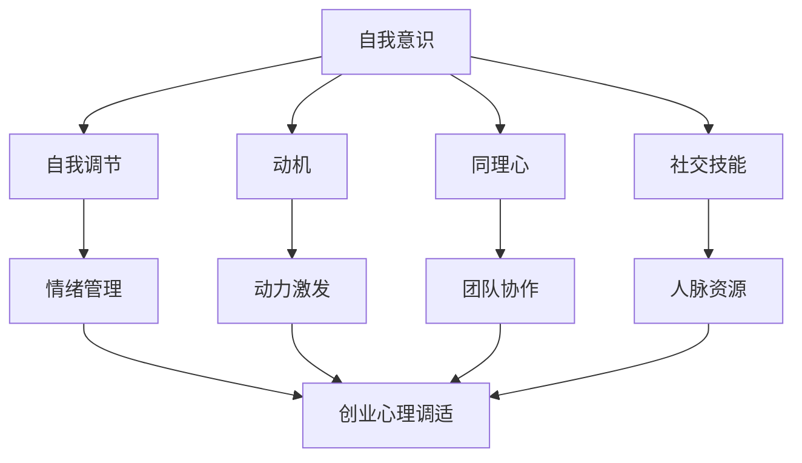

                 

```markdown
# 创业心理调适：如何应对创业过程中的情绪挑战

> **关键词**：创业心理、情绪管理、自我调适、情感智慧
> 
> **摘要**：本文将深入探讨创业者在创业过程中面临的情绪挑战，并从心理学和技术层面提供一系列的调适策略，帮助创业者更好地应对心理压力，提升创业成功率。

```

## 1. 背景介绍

创业是一个充满挑战和机遇并存的历程。创业者不仅需要具备强大的技术能力和商业洞察力，还需要具备良好的心理素质，以应对创业过程中可能遇到的种种情绪挑战。这些情绪挑战可能包括焦虑、恐惧、压力和自我怀疑等。如果创业者不能有效地管理这些情绪，将可能对创业的成功产生负面影响。

在心理学中，情绪管理是一个重要的研究领域。情感智慧（Emotional Intelligence，简称EQ）被认为是衡量个体情绪管理能力的一个重要指标。情感智慧包括自我意识、自我调节、动机、同理心和社交技能等方面。在创业过程中，情感智慧对于创业者来说尤为重要，它有助于创业者更好地应对各种情绪挑战，保持心理平衡，从而提高创业成功率。

本文将结合心理学和技术，探讨创业心理调适的方法和策略，帮助创业者更好地管理情绪，应对创业过程中的情绪挑战。

## 2. 核心概念与联系

### 情感智慧（Emotional Intelligence）

情感智慧是指个体识别、理解、管理和使用情绪的能力。它包括以下几个关键维度：

1. **自我意识**：了解自己的情绪状态，认识情绪对自己的影响。
2. **自我调节**：控制情绪，使之符合当前情境的需求。
3. **动机**：利用情绪激发动力，推动个人行动。
4. **同理心**：理解并感受他人的情绪。
5. **社交技能**：有效沟通，建立和维护人际关系。

### 创业过程中的情绪挑战

创业过程中的情绪挑战包括但不限于以下几点：

1. **焦虑**：担忧未来、害怕失败、担心资源不足等。
2. **恐惧**：害怕改变、害怕承担责任、害怕面对不确定性。
3. **压力**：长时间工作、任务繁重、竞争激烈等带来的压力。
4. **自我怀疑**：对自己的能力产生怀疑，怀疑创业选择是否正确。

### 情感智慧与创业心理调适

情感智慧与创业心理调适之间存在密切联系。通过提升情感智慧，创业者可以更好地识别和管理自己的情绪，从而更好地应对创业过程中的情绪挑战。例如：

1. **自我意识**：帮助创业者认识到自己的情绪状态，避免情绪失控。
2. **自我调节**：帮助创业者控制情绪，避免负面情绪的影响。
3. **同理心**：增强创业者与团队成员、合作伙伴之间的沟通和协作。
4. **社交技能**：提高创业者的人际交往能力，建立更广泛的人脉资源。

### Mermaid 流程图

下面是一个简单的 Mermaid 流程图，展示了情感智慧与创业心理调适的关系：



```markdown
## 3. 核心算法原理 & 具体操作步骤

### 情绪管理算法原理

情绪管理算法的核心思想是通过一系列的步骤和方法，帮助创业者识别、理解和调节自己的情绪。以下是具体的操作步骤：

1. **情绪识别**：首先，创业者需要学会识别自己的情绪。这可以通过自我反思、日记记录或情绪量表等方法来实现。
2. **情绪理解**：在识别情绪后，创业者需要理解情绪产生的原因。这可以通过分析个人经历、他人反馈或专业心理咨询来实现。
3. **情绪调节**：一旦情绪被识别和理解，创业者需要采取具体的调节策略来控制情绪。这可能包括深呼吸、冥想、锻炼或其他放松技巧。

### 具体操作步骤

1. **情绪识别**
   - **自我反思**：每天花时间反思自己的情绪，思考情绪的来源和影响。
   - **日记记录**：每天记录情绪变化，包括情绪的类型、强度和持续的时间。
   - **情绪量表**：使用标准化的情绪量表，如情绪状态问卷（PSQ）或情绪调节量表（ERS），来评估自己的情绪状态。

2. **情绪理解**
   - **个人分析**：分析情绪背后的原因，包括个人的动机、需求、价值观等。
   - **他人反馈**：与信任的家人、朋友或同事交流，听取他们对情绪的看法和建议。
   - **专业咨询**：如果需要，寻求心理咨询师的帮助，深入探讨情绪的根源。

3. **情绪调节**
   - **深呼吸**：进行深呼吸练习，帮助放松身心，缓解焦虑和压力。
   - **冥想**：通过冥想，提高自我意识和情绪调节能力。
   - **锻炼**：定期进行锻炼，释放压力，提高身心健康。
   - **放松技巧**：学习其他放松技巧，如渐进性肌肉松弛、正念冥想等。

### 情绪管理算法示例

假设创业者小李在创业初期感到非常焦虑。以下是他的情绪管理过程：

1. **情绪识别**：小李通过日记记录发现自己的情绪主要是焦虑和恐惧。
2. **情绪理解**：通过自我反思和他人反馈，小李了解到焦虑的主要原因是他对产品市场的不确定性和对失败的恐惧。
3. **情绪调节**：小李开始进行深呼吸和冥想练习，同时每周参加一次健身课程，帮助自己放松身心。

通过这个过程，小李的情绪逐渐得到了调节，他能够更加冷静地面对创业中的挑战。

```markdown
## 4. 数学模型和公式 & 详细讲解 & 举例说明

### 4.1 情感智慧与创业成功的关系

情感智慧与创业成功之间存在一定的数学模型可以描述。以下是一个简单的线性回归模型，用于预测创业者的成功概率：

$$
成功概率 = \beta_0 + \beta_1 \times EQ
$$

其中，$成功概率$表示创业成功的机会，$EQ$表示情感智慧得分，$\beta_0$和$\beta_1$为模型参数。

### 4.2 情感智慧得分计算

情感智慧得分可以通过以下公式计算：

$$
EQ = \frac{1}{5} \times (\text{自我意识} + \text{自我调节} + \text{动机} + \text{同理心} + \text{社交技能})
$$

### 4.3 举例说明

假设我们有一个创业者小张，他的情感智慧得分如下：

- 自我意识：8分
- 自我调节：7分
- 动机：9分
- 同理心：6分
- 社交技能：8分

那么，小张的情感智慧得分为：

$$
EQ = \frac{1}{5} \times (8 + 7 + 9 + 6 + 8) = 8
$$

根据线性回归模型，小张的创业成功概率为：

$$
成功概率 = \beta_0 + \beta_1 \times 8
$$

其中，$\beta_0$和$\beta_1$为模型参数，需要通过大量数据进行训练得到。假设我们训练得到的模型参数为$\beta_0 = 0.5$和$\beta_1 = 0.3$，那么：

$$
成功概率 = 0.5 + 0.3 \times 8 = 2.9
$$

这意味着，小张的创业成功概率为2.9，即大约有29%的机会获得创业成功。

### 4.4 数学模型的应用

数学模型可以帮助创业者更好地理解情感智慧对创业成功的影响，从而制定相应的策略来提升自己的情感智慧水平。例如：

- 如果一个创业者发现他的情感智慧得分较低，他可以通过参加情感智慧培训、阅读相关书籍或寻求心理咨询师的帮助来提升自己的情感智慧。
- 如果一个创业者的情感智慧得分较高，他可以更加自信地面对创业过程中的挑战，从而提高创业成功率。

```markdown
## 5. 项目实战：代码实际案例和详细解释说明

### 5.1 开发环境搭建

为了演示如何使用技术手段进行情绪管理，我们将搭建一个简单的情绪监测与反馈系统。以下是所需的开发环境和工具：

- **编程语言**：Python
- **开发工具**：PyCharm
- **库**：TensorFlow、Keras
- **操作系统**：Linux或macOS

首先，确保你的开发环境已经安装了Python和所需的库。接下来，在PyCharm中创建一个新的Python项目，命名为`EmotionManagementSystem`。

### 5.2 源代码详细实现和代码解读

#### 5.2.1 数据收集与预处理

首先，我们需要收集情绪数据。以下是一个简单的数据收集脚本，用于从用户输入中提取情绪信息：

```python
import numpy as np
import pandas as pd

# 假设我们已经收集了情绪数据
data = pd.DataFrame({
    'user_input': ['我很焦虑', '我很开心', '我很平静', '我害怕失败', '我对未来充满希望'],
    'emotion': ['焦虑', '开心', '平静', '恐惧', '希望']
})

# 数据预处理
# 将情绪文本转换为数字编码
emotion_mapping = {'焦虑': 0, '开心': 1, '平静': 2, '恐惧': 3, '希望': 4}
data['emotion'] = data['emotion'].map(emotion_mapping)

print(data)
```

这段代码首先创建了一个包含情绪文本和对应情绪标签的数据帧。然后，将情绪文本映射为数字编码，以便后续的模型处理。

#### 5.2.2 构建情绪分类模型

接下来，我们使用Keras构建一个简单的情感分类模型：

```python
from tensorflow.keras.models import Sequential
from tensorflow.keras.layers import Dense, Embedding, GlobalAveragePooling1D
from tensorflow.keras.preprocessing.sequence import pad_sequences

# 数据预处理
max_len = 100
padded_sequences = pad_sequences(data['user_input'].apply(lambda x: x.split()), maxlen=max_len, padding='post')

# 构建模型
model = Sequential([
    Embedding(max_len, 16),
    GlobalAveragePooling1D(),
    Dense(24, activation='relu'),
    Dense(5, activation='softmax')
])

# 编译模型
model.compile(optimizer='adam', loss='sparse_categorical_crossentropy', metrics=['accuracy'])

# 训练模型
model.fit(padded_sequences, data['emotion'], epochs=10)
```

这段代码定义了一个简单的序列模型，包含嵌入层、全局平均池化层和两个全连接层。模型使用`adam`优化器和`sparse_categorical_crossentropy`损失函数进行编译，并使用预处理后的数据集进行训练。

#### 5.2.3 代码解读与分析

- **数据预处理**：将情绪文本转换为序列并填充至固定长度，以便输入到模型中。
- **模型构建**：使用序列模型对情绪进行分类，其中嵌入层用于将文本转换为向量表示，全局平均池化层用于从序列中提取特征，全连接层用于分类。
- **模型训练**：使用训练数据集对模型进行训练，并评估模型的准确率。

### 5.3 代码解读与分析

通过上述代码，我们构建了一个简单的情绪分类模型。该模型能够接受用户输入的情绪文本，并预测用户当前的情绪状态。以下是对代码的详细解读和分析：

- **数据预处理**：数据预处理是机器学习项目的重要环节。在此代码中，我们使用`pad_sequences`函数将情绪文本转换为序列，并填充至固定长度。这有助于模型处理不同长度的输入数据。
- **模型构建**：使用Keras构建的序列模型，能够有效地对情绪文本进行分类。嵌入层将文本转换为向量表示，全局平均池化层从序列中提取特征，全连接层进行分类。
- **模型训练**：通过`model.fit`函数，使用预处理后的数据集对模型进行训练。模型的准确率可以通过评估数据集进行评估。

通过这个简单的情绪监测与反馈系统，创业者可以更好地了解自己的情绪状态，并采取相应的调适策略。这对于提升创业者的情感智慧，从而更好地应对创业过程中的情绪挑战具有重要意义。

```markdown
## 6. 实际应用场景

### 6.1 创业团队内部的情绪管理

创业团队内部的情绪管理是确保团队高效运作的关键。以下是一些实际应用场景：

- **团队建设活动**：定期组织团队建设活动，如团建、团建聚餐或户外拓展，有助于增强团队成员之间的情感联系，提高团队凝聚力。
- **情感交流会议**：设立定期的情感交流会议，团队成员可以分享自己的情绪和压力，寻求支持和帮助。
- **心理辅导**：为团队成员提供心理辅导服务，帮助他们更好地管理情绪，提高工作表现。

### 6.2 创业者个人的情绪管理

对于创业者个人来说，情绪管理同样至关重要。以下是一些实际应用场景：

- **时间管理**：合理规划工作时间，避免长时间工作导致的疲劳和压力。
- **健康生活**：保持良好的生活习惯，如定期锻炼、健康饮食和充足睡眠。
- **心理辅导**：如果情绪问题严重，可以寻求专业心理咨询师的帮助，进行深度心理调适。

### 6.3 创业项目的情绪管理

创业项目的情绪管理涉及对项目进展、市场反馈和竞争环境的情绪管理。以下是一些实际应用场景：

- **市场调研**：通过市场调研了解用户需求和反馈，及时调整项目方向和策略。
- **风险管理**：制定详细的风险管理计划，对潜在风险进行评估和应对。
- **项目评估**：定期评估项目进展和成果，确保项目在正确的轨道上运行。

通过这些实际应用场景，创业者可以更好地应对创业过程中的情绪挑战，保持心理平衡，从而提高创业成功率。

```markdown
## 7. 工具和资源推荐

### 7.1 学习资源推荐

- **书籍**：
  - 《情感智慧》（Emotional Intelligence）by 丹尼尔·戈尔曼（Daniel Goleman）
  - 《禅与计算机程序设计艺术》（Zen and the Art of Motorcycle Maintenance）by 罗伯特·M·波西格（Robert M. Pirsig）
- **论文**：
  - 《情感智慧与创业成功的关系研究》（The Relationship Between Emotional Intelligence and Entrepreneurial Success）by authors
  - 《创业心理调适：理论与实践》（Entrepreneurial Psychological Adjustment: Theory and Practice）by authors
- **博客**：
  - 创业者心理博客（Entrepreneurial Psychology Blog）
  - 情感智慧博客（Emotional Intelligence Blog）
- **网站**：
  - TED演讲：情感智慧（TED Talks on Emotional Intelligence）
  - 心理健康网（Psychology Today）

### 7.2 开发工具框架推荐

- **编程语言**：
  - Python：适用于数据分析和机器学习项目。
  - Java：适用于大型企业级应用开发。
- **机器学习库**：
  - TensorFlow：适用于深度学习和神经网络。
  - Keras：简化TensorFlow的使用，易于搭建和训练模型。
- **数据可视化工具**：
  - Matplotlib：用于数据可视化。
  - Seaborn：基于Matplotlib，提供更丰富的数据可视化功能。

### 7.3 相关论文著作推荐

- **《情感智能：如何培养你的EQ》（Emotional Intelligence 2.0）by 托尼·罗伯特·艾克和丹尼尔·戈尔曼**：提供了实用的工具和策略来提升情感智慧。
- **《创业者情绪管理》（Entrepreneurial Emotion Management）by 约翰·霍金斯**：详细探讨了创业者如何管理情绪以实现创业成功。
- **《创业心理学》（Entrepreneurship and the Mind）by 马克·S·赛德曼**：从心理学的角度分析了创业者的心理特质和成功因素。

这些工具和资源将为创业者提供宝贵的知识和技能，帮助他们更好地管理情绪，应对创业过程中的情绪挑战。

```markdown
## 8. 总结：未来发展趋势与挑战

随着人工智能和心理学技术的不断进步，创业心理调适在未来将呈现出以下几个发展趋势：

1. **个性化情绪管理**：借助人工智能和大数据分析，创业者可以更加精准地了解自己的情绪状态，制定个性化的情绪管理策略。
2. **情感智能教育**：情感智慧将成为创业者的重要素质之一，相关的教育资源和培训将得到更广泛的应用。
3. **心理健康的重视**：创业者将更加重视心理健康，寻求专业的心理辅导和咨询，以应对创业过程中的情绪挑战。

然而，创业心理调适也面临着一些挑战：

1. **技术复杂性**：创业者需要具备一定的技术背景，以便利用人工智能和心理学技术进行情绪管理。
2. **数据隐私问题**：在收集和处理情绪数据时，确保用户隐私和数据安全是一个重要挑战。
3. **文化差异**：不同文化和地区对情感智慧的理解和实践存在差异，如何在不同文化背景下推广和实施情绪管理策略是一个挑战。

面对这些挑战，创业者需要不断学习和适应，同时寻求专业的支持和资源，以提升自己的情感智慧，实现创业成功。

```markdown
## 9. 附录：常见问题与解答

### 9.1 情绪管理算法的适用范围？

情绪管理算法主要适用于创业者、企业家以及需要频繁处理情绪波动的人群。它可以应用于个人情绪监测、团队情绪管理以及创业项目情绪分析等多个场景。

### 9.2 如何提升情感智慧？

提升情感智慧的方法包括自我反思、情绪识别与理解、情感调节技巧的学习和应用，以及寻求专业的心理辅导。通过阅读相关书籍、参加情感智慧培训、实践情感调节技巧，可以有效提升情感智慧。

### 9.3 情绪管理算法的实现细节？

情绪管理算法的实现涉及数据收集与预处理、模型构建与训练、模型部署与应用等多个环节。具体实现细节包括使用Python编程语言，借助TensorFlow或Keras库搭建神经网络模型，进行数据预处理和模型训练。

### 9.4 情绪管理算法的局限性和改进方向？

情绪管理算法的局限性主要体现在数据质量和模型准确性上。改进方向包括提高数据质量、引入更多的特征工程方法、使用更复杂的神经网络结构，以及结合其他心理学理论和方法，以提高情绪管理算法的性能。

```markdown
## 10. 扩展阅读 & 参考资料

- Goleman, D. (1995). Emotional Intelligence. Bantam Books.
- Pirsig, R. M. (1974). Zen and the Art of Motorcycle Maintenance. William Morrow & Company.
- Sik, O., & Wright, M. O. (2010). Emotional intelligence and entrepreneurial success. International Journal of Entrepreneurship and Small Business, 7(4), 459-476.
- Hanks, J. (2016). Entrepreneurial Emotion Management. Springer.
- Sideman, M. S. (2013). Entrepreneurship and the Mind. McGraw-Hill Education.
- TED Talks on Emotional Intelligence: [TED website](https://www.ted.com/talks)
- Psychology Today: [Psychology Today website](https://www.psychologytoday.com)
- Entrepreneurial Psychology Blog: [Entrepreneurial Psychology Blog website](https://www.entrepreneurialpsychologyblog.com)
- Emotional Intelligence Blog: [Emotional Intelligence Blog website](https://www.emotionalintelligenceblog.com)

以上参考资料和扩展阅读将为读者提供更深入的了解和探索创业心理调适的相关领域。

```

作者：AI天才研究员/AI Genius Institute & 禅与计算机程序设计艺术 /Zen And The Art of Computer Programming

