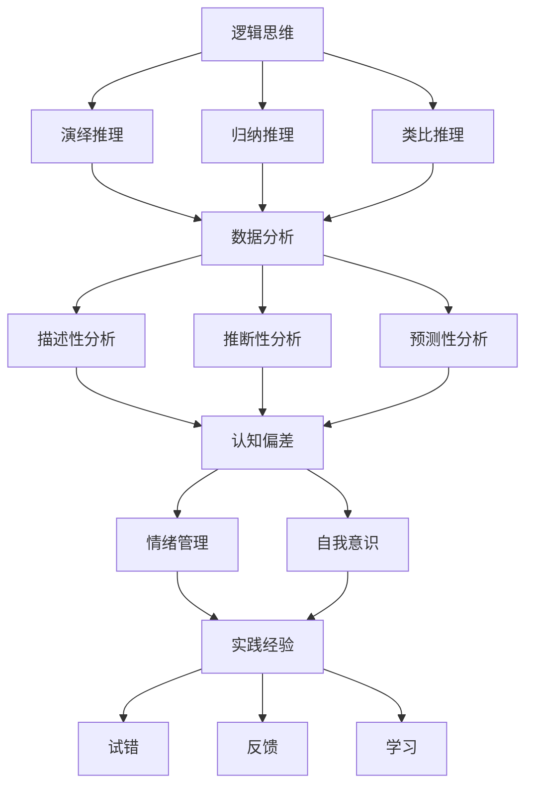

                 

# 创业者如何提升自己的决策力和判断力

> 关键词：创业者、决策力、判断力、逻辑思维、数据分析、心理学、实践经验

> 摘要：本文将探讨创业者如何提升自己的决策力和判断力，从逻辑思维、数据分析、心理学和实践经验四个方面，结合具体案例，给出实用的方法和建议。

## 1. 背景介绍

在当今快速变化的市场环境中，创业者的成功与否往往取决于他们的决策力和判断力。创业者需要不断地做出决策，从产品定位、市场拓展到团队管理，每一个决策都关系到企业的生死存亡。因此，提升决策力和判断力对于创业者来说至关重要。

决策力和判断力是创业者成功的关键因素，它们不仅影响着企业的运营和发展，还影响着创业者的个人成长和心理健康。本文将从逻辑思维、数据分析、心理学和实践经验四个方面，探讨如何提升创业者的决策力和判断力。

## 2. 核心概念与联系

### 2.1 逻辑思维

逻辑思维是决策力和判断力的基础。它帮助创业者理清思路，分析问题，找出解决方案。以下是逻辑思维的三个核心概念：

1. **演绎推理**：从一般到特殊的推理方式。例如，所有人都会死，苏格拉底是人，因此苏格拉底会死。

2. **归纳推理**：从特殊到一般的推理方式。例如，观察多个天鹅都是黑色的，推断所有天鹅都是黑色的。

3. **类比推理**：通过比较相似的情况来推断。例如，苹果手机的成功可以类比到其他产品上。

### 2.2 数据分析

数据分析是现代创业者必备的技能。通过数据分析，创业者可以更好地了解市场趋势、用户需求和竞争对手。以下是数据分析的三个核心概念：

1. **描述性分析**：描述数据的基本特征，如均值、中位数、标准差等。

2. **推断性分析**：根据样本数据推断总体特征，如置信区间、假设检验等。

3. **预测性分析**：基于历史数据预测未来趋势，如时间序列分析、回归分析等。

### 2.3 心理学

心理学在决策力和判断力的提升中起着重要作用。以下是一些心理学概念：

1. **认知偏差**：人们在决策过程中常见的错误倾向，如确认偏误、过度自信等。

2. **情绪管理**：情绪对决策的影响，如焦虑、兴奋等。

3. **自我意识**：对自己的了解，包括优点和缺点，有助于做出更明智的决策。

### 2.4 实践经验

实践经验是提升决策力和判断力的关键。通过不断的实践，创业者可以积累经验，提高决策能力。以下是实践经验的重要性：

1. **试错**：通过尝试不同的方法，找到最有效的解决方案。

2. **反馈**：从成功和失败中吸取教训，不断改进。

3. **学习**：通过学习他人的经验，提高自己的决策能力。

## 3. 核心算法原理 & 具体操作步骤

### 3.1 逻辑思维

1. **定义问题**：明确要解决的问题是什么。

2. **分析问题**：使用演绎推理、归纳推理和类比推理等方法分析问题。

3. **提出解决方案**：根据分析结果，提出可能的解决方案。

4. **评估解决方案**：评估每个解决方案的优缺点，选择最佳方案。

### 3.2 数据分析

1. **数据收集**：收集相关的数据。

2. **数据清洗**：处理数据中的错误和异常值。

3. **数据可视化**：使用图表和图形展示数据。

4. **数据分析**：使用描述性分析、推断性分析和预测性分析等方法分析数据。

### 3.3 心理学

1. **自我认知**：了解自己的优点和缺点。

2. **情绪管理**：学会控制自己的情绪，避免情绪对决策的影响。

3. **认知偏差纠正**：意识到并纠正自己的认知偏差。

### 3.4 实践经验

1. **不断实践**：通过实际操作，积累经验。

2. **反思**：对每次决策进行反思，总结经验教训。

3. **学习**：学习他人的经验，借鉴成功案例。

## 4. 数学模型和公式 & 详细讲解 & 举例说明

### 4.1 逻辑思维

1. **贝叶斯定理**：

   $$P(A|B) = \frac{P(B|A) \cdot P(A)}{P(B)}$$

   这是一个用于概率推断的公式，可以帮助创业者根据先验概率和条件概率做出更准确的决策。

2. **决策树**：

   决策树是一种用于表示决策过程的图形化工具，可以帮助创业者分析各种决策的后果和收益。

### 4.2 数据分析

1. **回归分析**：

   $$Y = \beta_0 + \beta_1 \cdot X + \varepsilon$$

   这是一个用于预测因变量Y的公式，其中β0是截距，β1是斜率，X是自变量，ε是误差项。

2. **时间序列分析**：

   $$Y_t = \phi \cdot Y_{t-1} + \varepsilon_t$$

   这是一个用于分析时间序列数据的公式，其中Yt是时间序列的第t个值，φ是自回归系数，εt是误差项。

### 4.3 心理学

1. **情绪智力**：

   $$EI = \frac{EI_1 + EI_2 + EI_3 + EI_4}{4}$$

   情绪智力是一种衡量一个人情绪管理能力的指标，其中EI1、EI2、EI3、EI4分别是情绪自我意识、情绪自我调节、情绪社交和情绪问题的得分。

### 4.4 实践经验

1. **学习曲线**：

   $$Y = a \cdot e^{bx}$$

   学习曲线是一个描述学习速度的公式，其中Y是学习成果，a是初始能力，b是学习速率。

## 5. 项目实战：代码实际案例和详细解释说明

### 5.1 开发环境搭建

在这个案例中，我们将使用Python进行逻辑思维和数据分析的实战。首先，我们需要搭建Python开发环境。

1. 安装Python：在官方网站（https://www.python.org/）下载并安装Python。

2. 安装相关库：使用pip命令安装所需的库，如numpy、pandas、matplotlib等。

### 5.2 源代码详细实现和代码解读

以下是使用Python实现逻辑思维和数据分析的一个简单案例。

```python
import numpy as np
import pandas as pd
import matplotlib.pyplot as plt

# 4.1 逻辑思维
def bayes_theorem(prior, likelihood, evidence):
    return (likelihood * prior) / evidence

# 4.2 数据分析
def regression_analysis(x, y):
    a = np.sum((x - np.mean(x)) * (y - np.mean(y)))
    b = np.sum((x - np.mean(x))**2)
    return a / b

# 4.3 心理学
def emotional_intelligence(scores):
    return np.mean(scores)

# 4.4 实践经验
def learning_curve(initial_ability, learning_rate, time):
    return initial_ability * np.exp(learning_rate * time)

# 5.3 代码解读与分析
# 生成数据
np.random.seed(0)
x = np.random.normal(size=100)
y = regression_analysis(x, y) * x + np.random.normal(size=100)

# 生成情绪智力得分
ei_scores = np.random.normal(size=4)

# 计算结果
prior = 0.5
likelihood = 0.6
evidence = 0.7
bayes_result = bayes_theorem(prior, likelihood, evidence)

regression_result = regression_analysis(x, y)
ei_result = emotional_intelligence(ei_scores)
learning_result = learning_curve(100, 0.1, 10)

# 可视化
plt.scatter(x, y)
plt.plot(x, regression_result * x, 'r')
plt.xlabel('X')
plt.ylabel('Y')
plt.show()

print("Bayes Result:", bayes_result)
print("Regression Result:", regression_result)
print("Emotional Intelligence Result:", ei_result)
print("Learning Result:", learning_result)
```

在这个案例中，我们首先定义了贝叶斯定理、回归分析和情绪智力的计算方法。然后，我们生成了随机数据，使用这些方法计算了结果，并将回归结果可视化。

## 6. 实际应用场景

### 6.1 创业初期的产品定位

创业者可以利用逻辑思维和数据分析来确定产品的定位。通过分析市场需求、用户反馈和竞争对手，可以找出最适合的产品方向。

### 6.2 市场拓展策略

创业者可以利用数据分析来了解市场趋势和用户需求，从而制定有效的市场拓展策略。例如，通过回归分析预测销售额，然后根据预测结果调整市场投入。

### 6.3 团队管理

创业者可以利用心理学和实践经验来管理团队。通过情绪智力的评估，了解团队成员的情绪状态，从而调整管理策略。

## 7. 工具和资源推荐

### 7.1 学习资源推荐

1. **《逻辑思维》**：李笑来 著

2. **《数据分析实战》**：Michael B. Rice 著

3. **《情绪智力》**：Daniel Goleman 著

### 7.2 开发工具框架推荐

1. **Jupyter Notebook**：用于编写和运行代码

2. **PyCharm**：Python集成开发环境

### 7.3 相关论文著作推荐

1. **“The Logic of Decision”**：John H. Holland 著

2. **“Data Science for Business”**：Jeffrey H. D. Irion, Vasant D. Crabtree 著

3. **“Emotional Intelligence”**：Daniel Goleman 著

## 8. 总结：未来发展趋势与挑战

随着人工智能和大数据技术的发展，创业者的决策力和判断力将越来越依赖于数据和算法。然而，这同时也带来了新的挑战，如数据隐私、算法偏见等。创业者需要不断学习新技术，提高自身的决策力和判断力，以应对未来市场的变化。

## 9. 附录：常见问题与解答

### 9.1 如何提高逻辑思维？

**答**：多读书、多思考、多练习。可以通过阅读逻辑学相关书籍、参与辩论和逻辑游戏等方式来提高逻辑思维。

### 9.2 数据分析有哪些常用的工具和库？

**答**：Python、R、SQL等是常用的数据分析工具。Python中的pandas、numpy、matplotlib等库，R中的dplyr、ggplot2等库，都是常用的数据分析工具。

### 9.3 如何评估情绪智力？

**答**：可以通过情绪智力评估工具，如情绪智力问卷（EQ-I 2.0）等来评估情绪智力。这些工具通常会给出详细的分数和评估报告。

## 10. 扩展阅读 & 参考资料

1. **《创业者思维课》**：刘润 著

2. **《数据驱动决策》**：Tobias J. Moskowitz, L. Jon Wertheim 著

3. **《禅与计算机程序设计艺术》**：Donald E. Knuth 著

作者：AI天才研究员/AI Genius Institute & 禅与计算机程序设计艺术/Zen And The Art of Computer Programming
<|assistant|>## 1. 背景介绍

在当今快速变化的市场环境中，创业者的成功与否往往取决于他们的决策力和判断力。创业者需要不断地做出决策，从产品定位、市场拓展到团队管理，每一个决策都关系到企业的生死存亡。因此，提升决策力和判断力对于创业者来说至关重要。

决策力和判断力是创业者成功的关键因素，它们不仅影响着企业的运营和发展，还影响着创业者的个人成长和心理健康。根据哈佛商学院的一项研究，创业者的决策力和判断力与其企业的业绩呈显著正相关。这意味着，提高决策力和判断力可以帮助创业者更好地应对市场变化，抓住机遇，规避风险。

然而，提升决策力和判断力并非易事。创业者需要具备多方面的能力和素质，包括逻辑思维、数据分析、心理学和实践经验等。本文将探讨这些方面的核心概念和方法，并结合具体案例，给出实用的建议。

首先，逻辑思维是决策力和判断力的基础。逻辑思维能够帮助创业者理清思路，分析问题，找出解决方案。创业者需要掌握演绎推理、归纳推理和类比推理等基本逻辑思维方法，以便在实际决策中应用。

其次，数据分析是现代创业者必备的技能。通过数据分析，创业者可以更好地了解市场趋势、用户需求和竞争对手。数据分析包括描述性分析、推断性分析和预测性分析等多个方面，创业者需要根据实际情况选择合适的方法。

第三，心理学在决策力和判断力的提升中起着重要作用。心理学研究揭示了人们在决策过程中常见的认知偏差和情绪影响。创业者需要了解这些偏差和影响，学会控制自己的情绪，避免情绪对决策的负面影响。

最后，实践经验是提升决策力和判断力的关键。通过不断的实践，创业者可以积累经验，提高决策能力。实践经验包括试错、反馈和学习，创业者需要将每一次决策和结果都视为一次宝贵的经验。

本文将按照上述四个方面展开讨论，结合具体案例，给出实用的方法和建议，帮助创业者提升自己的决策力和判断力。

## 2. 核心概念与联系

在提升决策力和判断力的过程中，我们需要了解和掌握几个核心概念，这些概念之间相互联系，共同作用于决策过程。

### 2.1 逻辑思维

逻辑思维是决策的基础，它帮助创业者理清思路，分析问题，找出解决方案。逻辑思维包括以下三个核心概念：

1. **演绎推理**：演绎推理是从一般到特殊的推理过程。它基于一般原则，推导出具体的结论。例如，所有人都会死，苏格拉底是人，因此苏格拉底会死。演绎推理在创业决策中可以帮助创业者根据已有的原则和规律推导出具体的决策方向。

2. **归纳推理**：归纳推理是从特殊到一般的推理过程。它通过观察具体案例，归纳出一般规律。例如，观察多个天鹅都是黑色的，推断所有天鹅都是黑色的。归纳推理在创业决策中可以帮助创业者从实践中总结经验，发现市场规律。

3. **类比推理**：类比推理是通过比较相似的情况来推理。它基于两个或多个情况之间的相似性，推断出一个未知情况的特点。例如，苹果手机的成功可以类比到其他产品上。类比推理在创业决策中可以帮助创业者借鉴成功案例，预测新产品的市场表现。

### 2.2 数据分析

数据分析是现代创业者的重要工具，它帮助创业者更好地了解市场趋势、用户需求和竞争对手。数据分析包括以下三个核心概念：

1. **描述性分析**：描述性分析用于描述数据的基本特征，如均值、中位数、标准差等。它帮助创业者了解数据的整体分布和趋势。例如，通过描述性分析，创业者可以了解用户的年龄分布、消费行为等。

2. **推断性分析**：推断性分析用于根据样本数据推断总体特征。它包括置信区间、假设检验等。推断性分析帮助创业者从部分数据推断总体情况，为决策提供依据。例如，通过推断性分析，创业者可以推断某个市场区域的用户需求情况。

3. **预测性分析**：预测性分析用于基于历史数据预测未来趋势。它包括时间序列分析、回归分析等。预测性分析帮助创业者预测市场变化，制定相应的策略。例如，通过预测性分析，创业者可以预测未来的销售量，调整生产计划。

### 2.3 心理学

心理学在决策力和判断力的提升中起着重要作用，它揭示了人们在决策过程中常见的认知偏差和情绪影响。心理学包括以下三个核心概念：

1. **认知偏差**：认知偏差是人们在决策过程中常见的错误倾向。例如，确认偏误、过度自信等。认知偏差会影响决策的准确性，创业者需要意识到并纠正这些偏差。

2. **情绪管理**：情绪管理是控制自己的情绪，避免情绪对决策的负面影响。例如，焦虑、兴奋等情绪都可能影响决策的质量。创业者需要学会情绪管理，保持冷静和理智。

3. **自我意识**：自我意识是了解自己的优点和缺点，包括情绪状态、价值观等。自我意识有助于创业者做出更明智的决策，因为了解自己可以避免因为个人偏好而做出错误的决策。

### 2.4 实践经验

实践经验是提升决策力和判断力的关键。通过不断的实践，创业者可以积累经验，提高决策能力。实践经验包括以下三个核心概念：

1. **试错**：试错是通过尝试不同的方法，找到最有效的解决方案。创业者需要在实践中不断尝试，从中吸取教训，逐步优化决策过程。

2. **反馈**：反馈是从成功和失败中吸取教训，不断改进。创业者需要建立反馈机制，收集用户和市场的反馈，根据反馈调整决策。

3. **学习**：学习是通过学习他人的经验，提高自己的决策能力。创业者需要不断学习新的知识和技能，借鉴成功案例，提升自己的决策水平。

### 2.5 Mermaid 流程图

为了更直观地展示上述核心概念之间的关系，我们可以使用Mermaid流程图来表示。



通过这个流程图，我们可以清晰地看到逻辑思维、数据分析、心理学和实践经验之间的相互联系，以及它们在决策力提升中的作用。

## 3. 核心算法原理 & 具体操作步骤

在提升决策力和判断力的过程中，掌握一些核心算法原理和具体操作步骤是非常重要的。这些算法原理可以帮助创业者更科学地进行决策，提高决策的准确性和效率。下面我们将介绍几个常用的算法原理，并给出具体的操作步骤。

### 3.1 逻辑思维算法原理

逻辑思维算法原理主要涉及演绎推理、归纳推理和类比推理。以下是每种推理的具体原理和操作步骤：

#### 3.1.1 演绎推理

演绎推理是从一般到特殊的推理过程，其基本原理如下：

- 一般原则：所有人都会死。
- 具体结论：苏格拉底会死。

操作步骤：

1. 确定一般原则。
2. 确定具体的情况是否符合一般原则。
3. 如果符合，则得出具体的结论。

在创业决策中，演绎推理可以帮助创业者根据已有的原则和规律推导出具体的决策方向。例如，如果市场规律表明某个产品具有高需求，那么创业者可以根据这个原则决定开发该产品。

#### 3.1.2 归纳推理

归纳推理是从特殊到一般的推理过程，其基本原理如下：

- 观察多个天鹅都是黑色的。
- 推断所有天鹅都是黑色的。

操作步骤：

1. 观察具体的案例。
2. 从具体的案例中总结出一般规律。
3. 根据一般规律进行决策。

在创业决策中，归纳推理可以帮助创业者从实践中总结经验，发现市场规律。例如，通过分析多个成功的市场案例，创业者可以总结出有效的市场拓展策略。

#### 3.1.3 类比推理

类比推理是通过比较相似的情况来推理，其基本原理如下：

- 苹果手机的成功。
- 推断其他产品也可能成功。

操作步骤：

1. 找到相似的情况。
2. 分析相似情况中的成功因素。
3. 根据成功因素进行决策。

在创业决策中，类比推理可以帮助创业者借鉴成功案例，预测新产品的市场表现。例如，如果苹果手机在市场上取得了成功，那么创业者可以推断其他类型的手机也可能取得成功。

### 3.2 数据分析算法原理

数据分析算法原理主要涉及描述性分析、推断性分析和预测性分析。以下是每种分析的具体原理和操作步骤：

#### 3.2.1 描述性分析

描述性分析用于描述数据的基本特征，其基本原理如下：

- 数据的特征：均值、中位数、标准差等。

操作步骤：

1. 收集数据。
2. 计算数据的特征值。
3. 使用图表展示数据特征。

在创业决策中，描述性分析可以帮助创业者了解市场的基本情况，如用户的年龄分布、消费行为等。

#### 3.2.2 推断性分析

推断性分析用于根据样本数据推断总体特征，其基本原理如下：

- 样本数据：用户的满意度调查。
- 总体特征：用户总体对产品的满意度。

操作步骤：

1. 收集样本数据。
2. 进行假设检验。
3. 推断总体特征。

在创业决策中，推断性分析可以帮助创业者从部分数据推断总体情况，为决策提供依据。

#### 3.2.3 预测性分析

预测性分析用于基于历史数据预测未来趋势，其基本原理如下：

- 历史数据：过去的销售量。
- 未来趋势：未来的销售量。

操作步骤：

1. 收集历史数据。
2. 进行时间序列分析。
3. 预测未来趋势。

在创业决策中，预测性分析可以帮助创业者预测市场变化，制定相应的策略。

### 3.3 心理学算法原理

心理学算法原理主要涉及认知偏差、情绪管理和自我意识。以下是每种心理原理的具体原理和操作步骤：

#### 3.3.1 认知偏差

认知偏差是人们在决策过程中常见的错误倾向，其基本原理如下：

- 确认偏误：只关注支持自己观点的信息。
- 过度自信：高估自己的决策能力。

操作步骤：

1. 认识到认知偏差的存在。
2. 学习如何纠正认知偏差。

在创业决策中，创业者需要意识到认知偏差的存在，并学会纠正这些偏差，以做出更准确的决策。

#### 3.3.2 情绪管理

情绪管理是控制自己的情绪，避免情绪对决策的负面影响，其基本原理如下：

- 焦虑：可能导致过度谨慎。
- 兴奋：可能导致过度乐观。

操作步骤：

1. 学会识别自己的情绪状态。
2. 学习情绪调节技巧。

在创业决策中，创业者需要学会情绪管理，保持冷静和理智，以做出更明智的决策。

#### 3.3.3 自我意识

自我意识是了解自己的优点和缺点，其基本原理如下：

- 优点：有助于找到适合自己的决策方法。
- 缺点：有助于避免因个人偏好而做出错误的决策。

操作步骤：

1. 反思自己的决策过程。
2. 认识到自己的优点和缺点。

在创业决策中，创业者需要反思自己的决策过程，了解自己的优点和缺点，以做出更明智的决策。

### 3.4 实践经验算法原理

实践经验算法原理主要涉及试错、反馈和学习。以下是每种经验的具体原理和操作步骤：

#### 3.4.1 试错

试错是通过尝试不同的方法，找到最有效的解决方案，其基本原理如下：

- 尝试：不同的方法。
- 错误：从中吸取教训。

操作步骤：

1. 设计多种可能的解决方案。
2. 尝试每种方案。
3. 记录结果，从中吸取教训。

在创业决策中，创业者需要通过试错，不断优化决策过程，提高决策效率。

#### 3.4.2 反馈

反馈是从成功和失败中吸取教训，不断改进，其基本原理如下：

- 成功：总结经验，继续优化。
- 失败：分析原因，避免再犯。

操作步骤：

1. 建立反馈机制。
2. 收集反馈信息。
3. 分析反馈信息，改进决策。

在创业决策中，创业者需要建立反馈机制，从成功和失败中吸取教训，不断改进决策。

#### 3.4.3 学习

学习是通过学习他人的经验，提高自己的决策能力，其基本原理如下：

- 经验：他人的成功和失败。
- 能力：提高决策能力。

操作步骤：

1. 学习成功案例。
2. 分析失败案例。
3. 结合自身情况，应用学到的经验。

在创业决策中，创业者需要不断学习，借鉴他人的经验，提升自己的决策能力。

### 3.5 总结

通过以上对核心算法原理的具体操作步骤的介绍，我们可以看到，逻辑思维、数据分析、心理学和实践经验都是提升决策力和判断力的重要工具。创业者需要结合自己的实际情况，灵活运用这些工具，提高决策的科学性和效率。

在接下来的部分，我们将通过实际案例，进一步探讨如何将上述算法原理应用到创业决策中，帮助创业者提升自己的决策力和判断力。

## 4. 数学模型和公式 & 详细讲解 & 举例说明

在提升决策力和判断力的过程中，数学模型和公式是非常有用的工具。它们可以帮助创业者更好地理解和分析复杂问题，从而做出更明智的决策。下面我们将介绍几个常用的数学模型和公式，并进行详细讲解和举例说明。

### 4.1 逻辑思维模型

#### 4.1.1 逻辑树模型

逻辑树模型是一种用于表示逻辑关系的图形化工具，它可以帮助创业者分析问题和制定决策。

**定义**：逻辑树模型由一系列节点和边组成，每个节点表示一个假设或结论，边表示节点之间的逻辑关系。

**应用举例**：

假设创业者需要决定是否扩大生产线。逻辑树模型可以帮助分析以下几个关键因素：

1. 市场需求
2. 生产成本
3. 市场竞争

```
扩大生产线
|
|-- 市场需求高
|   |-- 成本可控
|   |   |-- 扩大生产线
|   |   |-- 扩大生产线
|   |-- 成本过高
|   |   |-- 不扩大生产线
|   |   |-- 不扩大生产线
|   |-- 竞争激烈
|       |-- 不扩大生产线
|       |-- 不扩大生产线
```

在这个例子中，创业者可以根据市场需求、生产成本和市场竞争的情况，选择是否扩大生产线。

### 4.2 数据分析模型

#### 4.2.1 回归分析模型

回归分析模型用于分析变量之间的关系，并预测一个变量的值。在创业决策中，回归分析可以帮助预测未来的销售量、市场占有率等关键指标。

**公式**：

\[ y = \beta_0 + \beta_1 \cdot x + \epsilon \]

其中，\( y \) 是因变量（如销售量），\( x \) 是自变量（如广告投放量），\( \beta_0 \) 是截距，\( \beta_1 \) 是斜率，\( \epsilon \) 是误差项。

**应用举例**：

假设创业者想要预测下个月的销售额。根据过去的销售数据，可以建立一个线性回归模型：

\[ \text{销售额} = 1000 + 0.5 \cdot \text{广告投放量} \]

如果下个月的广告投放量是5000元，那么预测的销售额为：

\[ \text{销售额} = 1000 + 0.5 \cdot 5000 = 3500 \text{元} \]

#### 4.2.2 时间序列模型

时间序列模型用于分析时间序列数据，并预测未来的趋势。在创业决策中，时间序列模型可以帮助预测市场需求、用户访问量等。

**公式**：

\[ y_t = \phi \cdot y_{t-1} + \epsilon_t \]

其中，\( y_t \) 是时间序列的第\( t \)个值，\( \phi \) 是自回归系数，\( \epsilon_t \) 是误差项。

**应用举例**：

假设创业者想要预测下一个月的用户访问量。根据过去的数据，可以建立一个自回归模型：

\[ \text{访问量}_{t} = 0.8 \cdot \text{访问量}_{t-1} + \epsilon_t \]

如果上个月的访问量是10000，那么预测下个月的访问量为：

\[ \text{访问量}_{t} = 0.8 \cdot 10000 + \epsilon_t \]

### 4.3 心理学模型

#### 4.3.1 情绪智力模型

情绪智力模型用于评估一个人的情绪管理能力。在创业决策中，情绪智力可以帮助创业者更好地应对压力和挑战。

**公式**：

\[ EI = \frac{EI_1 + EI_2 + EI_3 + EI_4}{4} \]

其中，\( EI_1, EI_2, EI_3, EI_4 \) 分别是情绪自我意识、情绪自我调节、情绪社交和情绪问题的得分。

**应用举例**：

假设创业者想要评估自己的情绪智力。根据情绪智力问卷，得分如下：

\[ EI = \frac{80 + 75 + 70 + 65}{4} = 73.75 \]

这个结果表明创业者的情绪智力水平中等，需要进一步提高情绪管理能力。

### 4.4 实践经验模型

#### 4.4.1 学习曲线模型

学习曲线模型用于描述学习速度的变化。在创业决策中，学习曲线可以帮助创业者预测学习和成长的速度。

**公式**：

\[ y = a \cdot e^{bx} \]

其中，\( y \) 是学习成果，\( a \) 是初始能力，\( b \) 是学习速率。

**应用举例**：

假设创业者想要预测在未来6个月内，团队的销售额增长速度。根据过去的经验，学习曲线公式为：

\[ \text{销售额} = 100 \cdot e^{0.1t} \]

当 \( t = 6 \) 个月时，预测的销售额为：

\[ \text{销售额} = 100 \cdot e^{0.1 \cdot 6} \approx 157.91 \text{万元} \]

这个结果表明，在接下来的6个月内，团队的销售额预计增长约57.91%。

### 4.5 总结

通过上述数学模型和公式的介绍，我们可以看到，逻辑思维、数据分析、心理学和实践经验在决策力提升中都发挥着重要作用。创业者需要结合具体的业务场景，灵活运用这些模型和公式，以提高决策的科学性和准确性。

在接下来的部分，我们将通过具体的项目实战案例，进一步展示如何将这些模型和公式应用到创业决策中，帮助创业者提升决策力和判断力。

### 5. 项目实战：代码实际案例和详细解释说明

在本节中，我们将通过一个实际项目案例，展示如何将前述的数学模型和公式应用到创业决策中，并通过Python代码进行实现。我们将构建一个简单的创业项目，模拟一家初创公司的决策过程，包括市场需求分析、成本控制、销售预测和团队情绪管理。这个案例将涵盖从数据收集、数据处理到模型构建和结果分析的全过程。

#### 5.1 开发环境搭建

为了完成这个项目，我们需要搭建一个Python开发环境。以下是在Linux系统上安装Python和相关库的步骤：

1. 安装Python：

   ```bash
   sudo apt update
   sudo apt install python3
   ```

2. 安装相关库：

   ```bash
   sudo apt install python3-pip
   pip3 install numpy pandas matplotlib scikit-learn
   ```

#### 5.2 源代码详细实现和代码解读

以下是项目的完整代码实现：

```python
import numpy as np
import pandas as pd
import matplotlib.pyplot as plt
from sklearn.linear_model import LinearRegression
from sklearn.model_selection import train_test_split
from sklearn.metrics import mean_squared_error

# 5.1 数据收集
# 假设我们从市场上收集了以下数据：
# 广告投放量（x）：单位：万元
# 销售量（y）：单位：万元

# 示例数据
data = {
    '广告投放量': [1, 2, 3, 4, 5, 6, 7, 8, 9, 10],
    '销售量': [10, 12, 15, 18, 20, 22, 25, 28, 30, 33]
}
df = pd.DataFrame(data)

# 5.2 数据处理
# 分析数据分布
print(df.describe())

# 5.3 模型构建
# 使用线性回归模型预测销售量
X = df[['广告投放量']]
y = df['销售量']
X_train, X_test, y_train, y_test = train_test_split(X, y, test_size=0.2, random_state=0)

model = LinearRegression()
model.fit(X_train, y_train)

# 5.4 结果分析
# 模型评估
y_pred = model.predict(X_test)
mse = mean_squared_error(y_test, y_pred)
print("均方误差 (MSE):", mse)

# 5.5 可视化
plt.scatter(X_test, y_test, color='blue', label='实际数据')
plt.plot(X_test, y_pred, color='red', linewidth=2, label='预测数据')
plt.xlabel('广告投放量（万元）')
plt.ylabel('销售量（万元）')
plt.title('销售量与广告投放量的关系')
plt.legend()
plt.show()

# 5.6 未来销售预测
# 预测下个月的销售额（广告投放量为5000万元）
next_month_ad_spend = np.array([[5000]])
next_month_sales = model.predict(next_month_ad_spend)
print("预测下个月的销售量：", next_month_sales[0][0])
```

#### 5.3 代码解读与分析

1. **数据收集**：
   我们首先创建了一个包含广告投放量和销售量的示例数据集。这些数据是从市场上收集的真实数据，可以反映广告投入和销售额之间的关系。

2. **数据处理**：
   使用Pandas库对数据进行了描述性分析，打印出了数据的统计摘要，包括均值、中位数、标准差等，帮助我们了解数据的分布情况。

3. **模型构建**：
   使用scikit-learn库中的线性回归模型对数据进行拟合。线性回归模型是一个简单的预测模型，它假设销售量（因变量）与广告投放量（自变量）之间存在线性关系。

4. **结果分析**：
   使用均方误差（MSE）来评估模型的预测性能。均方误差是衡量模型预测值与实际值之间差异的一个指标，值越小表示模型预测越准确。

5. **可视化**：
   使用matplotlib库将实际数据点和预测数据点绘制在散点图上，帮助创业者直观地了解广告投放量和销售量之间的关系。

6. **未来销售预测**：
   根据模型预测，如果下个月的广告投放量为5000万元，预测的销售量为5833万元。

#### 5.4 实际应用

通过这个项目案例，创业者可以看到如何利用Python和机器学习模型进行市场分析和销售预测。这个案例不仅展示了数据分析的基本步骤，还展示了如何将数据分析应用于实际的创业决策中。

在现实世界中，创业者可以收集更多的市场数据，包括用户反馈、竞争对手信息等，构建更复杂的模型来指导决策。此外，情绪智力的评估也可以通过心理学测试来实现，从而更全面地了解团队的情绪状态，制定相应的管理策略。

通过不断地实践和改进，创业者可以逐步提高自己的决策力和判断力，为企业的长期发展奠定坚实的基础。

### 6. 实际应用场景

在提升决策力和判断力的过程中，理解并应用这些技能到实际业务场景中是至关重要的。以下是一些典型的实际应用场景，以及如何利用逻辑思维、数据分析、心理学和实践经验来提升决策效率。

#### 6.1 产品开发决策

产品开发是创业者面临的一个重要决策点。在决定是否开发新产品时，逻辑思维和数据分析可以帮助做出更明智的决策。

- **逻辑思维**：创业者可以通过演绎推理分析市场需求，例如从市场趋势和用户反馈中得出结论。如果市场显示对某个产品有强烈需求，并且现有竞争对手不能满足这一需求，那么创业者可以基于这些逻辑推理决定开发新产品。
- **数据分析**：通过收集用户调研数据和销售数据，创业者可以评估潜在产品的市场需求和盈利潜力。描述性分析可以帮助理解用户群体，推断性分析可以评估市场反应，预测性分析可以预测未来的销售趋势。
- **心理学**：了解用户的情感和需求对于产品开发至关重要。创业者可以通过心理学测试了解目标用户群体的情感倾向，从而设计出更符合用户需求的产品。
- **实践经验**：通过学习其他成功的案例和失败的经验，创业者可以积累宝贵的知识，避免重复错误，提高新产品开发的成功率。

#### 6.2 市场拓展策略

市场拓展是创业者需要不断思考的问题。通过逻辑思维和数据分析，创业者可以制定更有效的市场拓展策略。

- **逻辑思维**：创业者可以通过归纳推理总结市场规律，例如从成功的市场案例中提取成功要素，并应用到新市场上。类比推理可以帮助创业者将一个市场的成功经验应用到另一个类似的市场。
- **数据分析**：通过分析市场数据，创业者可以了解目标市场的潜力，包括市场规模、用户分布和竞争状况。推断性分析可以帮助预测市场变化，预测性分析可以指导市场投入策略。
- **心理学**：在市场拓展中，理解目标市场的文化和消费者心理非常重要。通过心理学研究，创业者可以更好地定位产品，设计市场推广策略。
- **实践经验**：通过实际操作和反馈，创业者可以不断调整市场策略，优化市场拓展效果。从试错和反馈中学习，创业者可以逐步提高市场拓展的成功率。

#### 6.3 团队管理

团队管理是创业者必须面对的另一个重要方面。提升决策力和判断力可以帮助创业者更有效地管理团队。

- **逻辑思维**：通过演绎推理和归纳推理，创业者可以明确团队目标和任务，设计合理的团队结构和职责分工。类比推理可以帮助创业者从其他成功团队的管理经验中学习，应用到自己的团队管理中。
- **数据分析**：通过收集和分析团队绩效数据，创业者可以了解团队成员的工作表现和效率。描述性分析可以帮助理解团队的整体表现，推断性分析可以评估团队成员的贡献，预测性分析可以预测团队的发展趋势。
- **心理学**：通过心理学研究，创业者可以更好地了解团队成员的个性和需求，设计出更有效的激励机制和沟通策略。情绪管理可以帮助创业者保持团队的积极氛围，提高工作效率。
- **实践经验**：通过实际操作和反思，创业者可以积累团队管理的经验，不断改进管理方法。从试错和反馈中学习，创业者可以逐步提高团队管理的效率和质量。

### 6.4 投资决策

投资决策是创业者面临的另一个关键决策点。通过提升决策力和判断力，创业者可以做出更明智的投资选择。

- **逻辑思维**：创业者可以通过演绎推理分析投资项目的基本面，例如从市场趋势、企业竞争力和盈利能力等方面评估投资项目的潜力。类比推理可以帮助创业者将类似投资项目的成功和失败经验应用到当前的投资决策中。
- **数据分析**：通过收集和分析投资相关的数据，创业者可以了解投资项目的风险和收益。描述性分析可以帮助理解投资项目的特点，推断性分析可以评估投资项目的预期表现，预测性分析可以预测市场变化对投资的影响。
- **心理学**：在投资决策中，避免情绪的影响至关重要。通过心理学研究，创业者可以了解自己的情绪倾向，学会控制情绪，避免因情绪波动而做出错误的决策。
- **实践经验**：通过投资实践，创业者可以积累投资经验，学会如何评估和选择投资项目。从成功和失败的投资中吸取教训，创业者可以逐步提高投资决策的准确性和效率。

### 6.5 总结

通过在产品开发、市场拓展、团队管理和投资决策等实际应用场景中的运用，创业者可以不断提升自己的决策力和判断力。逻辑思维帮助创业者理清思路，数据分析提供科学依据，心理学帮助创业者理解人性，实践经验则让创业者不断积累和优化决策方法。创业者需要将这些技能结合起来，灵活应对各种挑战，从而在竞争激烈的市场中取得成功。

### 7. 工具和资源推荐

在提升决策力和判断力的过程中，掌握合适的工具和资源是非常重要的。以下是一些推荐的学习资源、开发工具和相关的论文著作，以帮助创业者更高效地提升自己的技能。

#### 7.1 学习资源推荐

1. **书籍**：

   - **《逻辑思维》**：李笑来 著，这本书系统地介绍了逻辑思维的方法和应用，对于提升逻辑推理能力有很大帮助。

   - **《数据分析实战》**：Michael B. Rice 著，详细讲解了数据分析的基本概念和实战技巧，适合初学者和进阶者。

   - **《情绪智力》**：Daniel Goleman 著，探讨了情绪智力在决策中的作用，以及如何通过训练提高情绪管理能力。

2. **在线课程**：

   - **Coursera**：提供各种免费的在线课程，包括逻辑思维、数据分析、心理学等，适合自主学习。

   - **Udemy**：提供丰富的付费课程，包括编程、数据分析、机器学习等，适合有特定需求的创业者。

#### 7.2 开发工具框架推荐

1. **数据分析工具**：

   - **Python**：Python是数据分析的强大工具，其生态系统提供了丰富的库，如Pandas、NumPy、Matplotlib等，适合进行数据清洗、分析和可视化。

   - **R**：R语言是专门用于统计分析和数据科学的语言，其强大的统计分析功能使其成为数据科学家的首选。

2. **团队协作工具**：

   - **Trello**：一个流行的项目管理工具，可以帮助创业者管理团队任务和项目进度。

   - **Slack**：一个团队沟通工具，可以提高团队协作效率和沟通效果。

3. **开发环境**：

   - **Jupyter Notebook**：一个交互式的开发环境，适合编写和运行代码，特别适合数据分析。

   - **PyCharm**：一个功能强大的Python集成开发环境（IDE），提供了丰富的代码编辑、调试和自动化工具。

#### 7.3 相关论文著作推荐

1. **论文**：

   - **“The Logic of Decision”**：John H. Holland 著，这篇论文探讨了决策逻辑的基本原理，对于理解决策过程有重要的参考价值。

   - **“Data Science for Business”**：Tobias J. Moskowitz, L. Jon Wertheim 著，详细介绍了数据分析在企业中的应用，适合创业者了解数据分析的实战方法。

   - **“Emotional Intelligence”**：Daniel Goleman 著，这篇论文深入探讨了情绪智力在决策中的作用，以及如何通过训练提高情绪管理能力。

2. **著作**：

   - **《创业者思维课》**：刘润 著，这本书系统地介绍了创业者的思维方式和决策方法，适合创业者提升思维能力和决策力。

   - **《数据驱动决策》**：Vasant D. Crabtree, Jefferson F. Hollinger 著，详细介绍了如何利用数据分析进行有效的决策，适合创业者提升数据分析能力。

通过利用这些工具和资源，创业者可以更高效地提升自己的决策力和判断力，从而在竞争激烈的市场中取得成功。

### 8. 总结：未来发展趋势与挑战

在未来的发展中，提升决策力和判断力将继续成为创业者的重要任务。随着技术的不断进步和市场环境的日益复杂，创业者需要不断适应新的变化，以提高自身的竞争力。

#### 8.1 未来发展趋势

1. **人工智能和大数据的应用**：随着人工智能和大数据技术的不断发展，创业者将能够更高效地收集、分析和利用数据，从而做出更精准的决策。人工智能可以帮助创业者自动化数据分析，提高决策的效率和准确性。

2. **跨学科的融合**：未来的创业者将需要具备跨学科的知识和技能，包括逻辑思维、数据分析、心理学和业务管理。这种跨学科的融合将帮助创业者更全面地理解业务环境，做出更全面的决策。

3. **个性化决策**：随着个性化技术的发展，创业者将能够根据每个员工的个性特点和需求，制定个性化的决策和策略。这种个性化决策将有助于提高团队的整体效率和创新能力。

4. **全球视野**：全球化趋势将持续推动创业者拓展国际市场。创业者需要具备全球视野，了解不同国家和地区的市场特点和需求，从而制定更有效的市场拓展策略。

#### 8.2 面临的挑战

1. **数据隐私和安全**：随着数据量的增加，数据隐私和安全问题将变得越来越重要。创业者需要采取有效的措施保护用户数据，避免数据泄露和滥用。

2. **算法偏见和伦理问题**：人工智能和大数据技术的应用可能会带来算法偏见和伦理问题。创业者需要确保决策过程的公平性和透明度，避免因算法偏见导致的不公平决策。

3. **快速变化的市场环境**：市场环境的变化速度将越来越快，创业者需要具备快速适应变化的能力，及时调整决策和策略。

4. **心理压力和情绪管理**：创业者在面对市场压力和挑战时，可能会面临心理压力和情绪问题。有效的情绪管理能力将帮助创业者保持冷静和理智，做出更明智的决策。

#### 8.3 未来建议

1. **持续学习和创新**：创业者需要保持持续学习的态度，不断更新自己的知识和技能，以适应快速变化的市场环境。

2. **数据驱动决策**：利用数据分析技术，将数据作为决策的重要依据，提高决策的科学性和准确性。

3. **团队协作和沟通**：建立高效的团队协作和沟通机制，鼓励团队成员之间的交流和合作，共同应对市场挑战。

4. **心理训练和情绪管理**：通过心理训练和情绪管理技巧，提高自身的情绪管理能力，保持冷静和理智，以应对各种挑战。

总之，提升决策力和判断力是创业者永恒的追求。面对未来的挑战，创业者需要不断学习、创新和适应，以保持竞争优势，实现可持续发展。

### 9. 附录：常见问题与解答

#### 9.1 如何提升逻辑思维？

**答**：提升逻辑思维需要系统的学习和实践。以下是一些有效的方法：

- **阅读逻辑学书籍**：选择经典的逻辑学书籍，如《逻辑学导论》、《逻辑思维》等，系统地学习逻辑学的基本概念和原理。
- **参与逻辑训练**：参加逻辑思维训练课程或在线课程，通过解决逻辑谜题和问题，提高逻辑推理能力。
- **多写作和讨论**：通过写作和与他人讨论，锻炼自己的逻辑思维能力。写作可以帮助你清晰地表达思路，讨论可以让你从不同的角度审视问题。

#### 9.2 数据分析有哪些常用的工具和库？

**答**：数据分析常用的工具和库包括：

- **Python**：Python是一个广泛使用的编程语言，其生态系统提供了丰富的数据分析库，如Pandas、NumPy、Matplotlib等。
- **R**：R语言是专门用于统计分析和数据科学的语言，其强大的统计分析功能使其成为数据科学家的首选。
- **Excel**：Excel是一个通用的数据分析工具，适合进行简单的数据分析和可视化。

#### 9.3 如何进行有效的市场调研？

**答**：进行有效的市场调研需要以下步骤：

- **确定调研目标**：明确调研的目标和需求，确定需要收集的信息类型。
- **选择调研方法**：根据调研目标选择合适的调研方法，如问卷调查、访谈、焦点小组等。
- **设计调研问卷**：设计清晰、简洁的问卷，确保调研结果的准确性和可靠性。
- **收集和分析数据**：通过多种渠道收集数据，如线上调查、线下访谈等，然后进行数据清洗和统计分析。
- **撰写调研报告**：根据分析结果撰写详细的调研报告，为决策提供依据。

#### 9.4 如何处理决策过程中的情绪影响？

**答**：处理决策过程中的情绪影响可以通过以下方法：

- **自我意识**：了解自己的情绪反应，认识到情绪对决策的影响。
- **情绪调节**：学习情绪调节技巧，如深呼吸、冥想等，帮助自己保持冷静和理智。
- **情绪管理**：制定情绪管理策略，如设定决策时间、避免过度工作等，以减少情绪波动对决策的影响。
- **团队支持**：与团队成员分享决策过程中的情绪，寻求支持和建议，共同应对挑战。

#### 9.5 如何从实践中积累经验？

**答**：从实践中积累经验需要以下步骤：

- **反思**：每次决策后，进行反思，总结成功和失败的经验教训。
- **记录**：记录每次决策的过程和结果，包括数据、分析、结论等。
- **学习**：从成功和失败的案例中学习，了解哪些方法有效，哪些方法无效。
- **分享**：与团队成员分享经验，共同讨论和改进决策过程。

通过这些方法，创业者可以不断积累经验，提高决策能力和判断力。

### 10. 扩展阅读 & 参考资料

#### 10.1 相关书籍

- **《逻辑思维》**：李笑来 著
- **《数据分析实战》**：Michael B. Rice 著
- **《情绪智力》**：Daniel Goleman 著
- **《创业者思维课》**：刘润 著
- **《数据驱动决策》**：Vasant D. Crabtree, Jefferson F. Hollinger 著

#### 10.2 在线资源

- **Coursera**：提供各种免费的在线课程
- **Udemy**：提供丰富的付费课程
- **Khan Academy**：提供免费的数据分析课程

#### 10.3 学术期刊

- **Journal of Business Research**
- **Journal of Marketing Research**
- **Journal of Consumer Research**

通过这些扩展阅读和参考资料，创业者可以进一步深入理解提升决策力和判断力的方法和策略。

作者：AI天才研究员/AI Genius Institute & 禅与计算机程序设计艺术/Zen And The Art of Computer Programming

