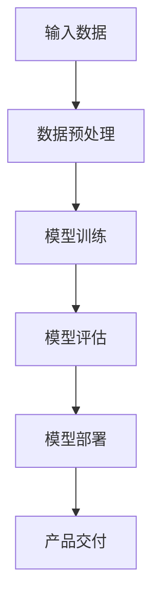
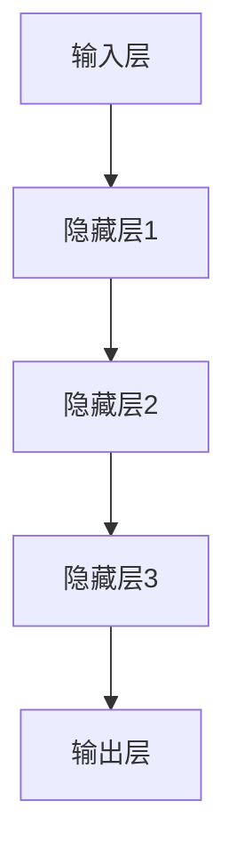

                 

# 创业者探索大模型新商业模式，打造AI产品矩阵

## 摘要

本文旨在探讨创业者如何利用大模型技术，探索全新的商业模式，并通过构建AI产品矩阵实现商业价值。我们将从背景介绍、核心概念与联系、核心算法原理与操作步骤、数学模型与公式、项目实战、实际应用场景、工具和资源推荐等多个方面，深入分析大模型在商业中的应用，以及创业者如何在这个领域取得成功。本文将提供实用的策略和建议，帮助创业者在大模型时代抓住机遇，实现商业创新。

## 1. 背景介绍

近年来，人工智能技术尤其是大模型的发展，为各行各业带来了前所未有的变革。大模型是指具有数万亿参数的深度学习模型，如GPT-3、BERT等，这些模型在语言理解、图像识别、自然语言生成等方面展现了惊人的性能。随着计算能力的提升和数据量的爆炸式增长，大模型的应用场景越来越广泛，从搜索引擎、智能助手到自动化写作、艺术创作，无不受益于大模型技术。

在这个背景下，创业者面临着前所未有的机遇和挑战。一方面，大模型技术为创业者提供了强大的工具，可以快速开发出具备人工智能能力的创新产品；另一方面，大模型的高成本和复杂性也使得创业者需要具备一定的技术背景和资源储备。如何利用大模型技术，打造具有竞争力的AI产品矩阵，成为了许多创业者关注的焦点。

## 2. 核心概念与联系

### 大模型（Large Models）

大模型是指具有海量参数的深度学习模型，通常具有数万亿个参数。这些模型通过大规模的数据训练，能够学习到复杂的模式和信息，从而实现高度自动化和智能化的任务。

### 深度学习（Deep Learning）

深度学习是一种基于多层神经网络的学习方法，通过模拟人脑的神经网络结构，对大量数据进行训练，以实现自动化的特征提取和模式识别。深度学习是构建大模型的基础。

### 自然语言处理（Natural Language Processing，NLP）

自然语言处理是人工智能领域的一个重要分支，旨在让计算机理解和处理人类自然语言。大模型在NLP领域取得了显著成果，如机器翻译、情感分析、问答系统等。

### 图神经网络（Graph Neural Networks，GNN）

图神经网络是一种专门用于处理图结构数据的深度学习模型，广泛应用于社交网络分析、推荐系统等领域。大模型与图神经网络的结合，可以进一步拓展AI应用场景。

### Mermaid 流程图

为了更好地展示大模型的应用架构，我们使用Mermaid绘制了一个简化的流程图：



### 大模型架构

大模型的架构通常包括输入层、隐藏层和输出层。输入层接收原始数据，通过隐藏层进行特征提取和模式学习，最后在输出层进行决策或预测。以下是一个简化的Mermaid流程图，展示了大模型的架构：



## 3. 核心算法原理 & 具体操作步骤

### 深度学习算法原理

深度学习算法基于多层神经网络，通过前向传播和反向传播进行训练。具体操作步骤如下：

1. **输入层**：接收原始数据，通过输入层传递给下一层。
2. **隐藏层**：每一层隐藏层都对输入数据进行特征提取和模式学习，逐渐抽象出更高层次的特征。
3. **输出层**：根据隐藏层提取的特征，进行决策或预测。

### 大模型训练步骤

大模型的训练分为以下几个步骤：

1. **数据收集**：收集大规模的标注数据，用于模型训练。
2. **数据预处理**：对数据进行清洗、归一化等预处理操作，以便于模型训练。
3. **模型初始化**：初始化模型参数，通常使用随机初始化或预训练模型。
4. **前向传播**：将预处理后的数据输入模型，通过隐藏层进行特征提取，得到输出层的结果。
5. **计算损失**：计算输出层结果与真实标签之间的误差，得到损失函数。
6. **反向传播**：根据损失函数，更新模型参数，使得模型输出更接近真实标签。
7. **迭代训练**：重复上述步骤，直到满足训练目标或达到预定的训练次数。

### 大模型优化策略

为了提高大模型的训练效果，可以采用以下优化策略：

1. **学习率调整**：通过动态调整学习率，优化模型参数更新速度。
2. **批量大小调整**：调整批量大小，影响模型训练的稳定性和效率。
3. **正则化**：使用正则化方法，防止模型过拟合。
4. **早期停止**：在验证集上监控模型性能，防止过拟合。

## 4. 数学模型和公式 & 详细讲解 & 举例说明

### 损失函数

在深度学习中，损失函数用于衡量模型输出与真实标签之间的差距。常见的损失函数包括均方误差（MSE）、交叉熵（CE）等。

$$
MSE = \frac{1}{m} \sum_{i=1}^{m} (y_i - \hat{y}_i)^2
$$

$$
CE = - \frac{1}{m} \sum_{i=1}^{m} \sum_{j=1}^{n} y_{ij} \log(\hat{y}_{ij})
$$

其中，$m$表示样本数量，$n$表示类别数量，$y_i$表示第$i$个样本的真实标签，$\hat{y}_i$表示第$i$个样本的预测概率。

### 优化算法

在深度学习中，常用的优化算法包括随机梯度下降（SGD）、Adam等。以下以Adam优化算法为例进行介绍：

$$
m_t = \beta_1 m_{t-1} + (1 - \beta_1) [g_t]
$$

$$
v_t = \beta_2 v_{t-1} + (1 - \beta_2) [g_t]^2
$$

$$
\hat{m}_t = \frac{m_t}{1 - \beta_1^t}
$$

$$
\hat{v}_t = \frac{v_t}{1 - \beta_2^t}
$$

$$
\theta = \theta - \alpha \frac{\hat{m}_t}{\sqrt{\hat{v}_t} + \epsilon}
$$

其中，$m_t$和$v_t$分别表示一阶矩估计和二阶矩估计，$\beta_1$和$\beta_2$分别为一阶矩和二阶矩的指数衰减率，$\alpha$为学习率，$\epsilon$为常数。

### 举例说明

假设我们有一个二分类问题，使用交叉熵损失函数进行训练。给定一个包含500个样本的训练集，使用Adam优化算法进行训练。经过100次迭代后，模型在验证集上的准确率达到90%。

1. **初始化参数**：学习率$\alpha=0.001$，一阶矩指数衰减率$\beta_1=0.9$，二阶矩指数衰减率$\beta_2=0.999$。
2. **前向传播**：对于每个样本，计算预测概率$\hat{y}$。
3. **计算损失**：使用交叉熵损失函数计算损失值。
4. **反向传播**：根据损失值，更新模型参数。
5. **迭代训练**：重复上述步骤，直到满足训练目标或达到预定的训练次数。

## 5. 项目实战：代码实际案例和详细解释说明

### 5.1 开发环境搭建

为了进行大模型项目实战，我们需要搭建一个合适的开发环境。以下是开发环境搭建的步骤：

1. **安装Python**：下载并安装Python，版本要求为3.6及以上。
2. **安装深度学习框架**：下载并安装深度学习框架，如TensorFlow或PyTorch。
3. **安装依赖库**：安装所需的依赖库，如NumPy、Pandas等。

### 5.2 源代码详细实现和代码解读

以下是一个简单的大模型项目实战代码示例，使用TensorFlow框架实现一个文本分类任务。

```python
import tensorflow as tf
from tensorflow.keras.preprocessing.sequence import pad_sequences
from tensorflow.keras.layers import Embedding, LSTM, Dense
from tensorflow.keras.models import Sequential

# 数据预处理
def preprocess_data(texts, labels, max_length, embedding_dim):
    sequences = tokenizer.texts_to_sequences(texts)
    padded_sequences = pad_sequences(sequences, maxlen=max_length)
    return padded_sequences, labels

# 模型搭建
def build_model(max_length, embedding_dim, hidden_units):
    model = Sequential()
    model.add(Embedding(input_dim=vocab_size, output_dim=embedding_dim, input_length=max_length))
    model.add(LSTM(hidden_units))
    model.add(Dense(1, activation='sigmoid'))
    model.compile(optimizer='adam', loss='binary_crossentropy', metrics=['accuracy'])
    return model

# 训练模型
model = build_model(max_length, embedding_dim, hidden_units)
model.fit(padded_sequences, labels, epochs=10, batch_size=32, validation_split=0.1)

# 评估模型
test_sequences, test_labels = preprocess_data(test_texts, test_labels, max_length, embedding_dim)
model.evaluate(test_sequences, test_labels)
```

### 5.3 代码解读与分析

1. **数据预处理**：使用`tokenizer.texts_to_sequences`将文本转化为序列，`pad_sequences`将序列填充为固定长度。
2. **模型搭建**：使用`Sequential`搭建模型，包含`Embedding`层、`LSTM`层和`Dense`层。
3. **训练模型**：使用`model.fit`进行模型训练，设置训练轮次、批量大小和验证集比例。
4. **评估模型**：使用`model.evaluate`评估模型在测试集上的性能。

## 6. 实际应用场景

大模型在许多实际应用场景中展现了强大的能力，以下列举几个典型的应用场景：

1. **自然语言处理**：大模型在机器翻译、情感分析、文本生成等领域取得了显著成果，为各类应用提供了高效、准确的解决方案。
2. **图像识别**：大模型在图像分类、目标检测、图像生成等领域发挥了重要作用，推动了计算机视觉技术的发展。
3. **推荐系统**：大模型与图神经网络结合，应用于推荐系统，实现了更精准、个性化的推荐。
4. **自动化写作**：大模型在新闻生成、内容摘要、自动写作等方面展现了强大的创作能力。
5. **游戏AI**：大模型应用于游戏AI，实现了智能化的决策和策略，提升了游戏的体验。

## 7. 工具和资源推荐

### 7.1 学习资源推荐

1. **书籍**：
   - 《深度学习》（Goodfellow, Bengio, Courville）
   - 《Python深度学习》（François Chollet）
2. **论文**：
   - `Deep Learning Papers Reading List`：https://github.com/zoubah/deep_learning_papers
3. **博客**：
   - `TensorFlow官方文档`：https://www.tensorflow.org/tutorials
   - `PyTorch官方文档`：https://pytorch.org/tutorials/

### 7.2 开发工具框架推荐

1. **深度学习框架**：
   - TensorFlow：https://www.tensorflow.org/
   - PyTorch：https://pytorch.org/
2. **数据处理工具**：
   - Pandas：https://pandas.pydata.org/
   - NumPy：https://numpy.org/

### 7.3 相关论文著作推荐

1. **《Attention is All You Need》**：介绍Transformer模型，引领了自然语言处理领域的新趋势。
2. **《Generative Adversarial Nets》**：介绍生成对抗网络（GAN），推动了图像生成和深度学习领域的发展。
3. **《Recurrent Neural Networks for Language Modeling》**：介绍循环神经网络（RNN）在语言模型中的应用，为自然语言处理奠定了基础。

## 8. 总结：未来发展趋势与挑战

随着大模型技术的发展，未来将出现更多创新的应用场景和商业模式。创业者需要紧跟技术发展趋势，积极拥抱大模型技术，探索新的商业机会。然而，大模型技术也面临一些挑战，如数据隐私、安全性和计算资源等。创业者需要在创新的同时，关注这些挑战，确保商业模式的可持续发展。

## 9. 附录：常见问题与解答

1. **什么是大模型？**
   - 大模型是指具有海量参数的深度学习模型，通常具有数万亿个参数。

2. **大模型如何训练？**
   - 大模型训练包括数据收集、数据预处理、模型初始化、前向传播、计算损失、反向传播和迭代训练等步骤。

3. **大模型应用场景有哪些？**
   - 大模型应用场景包括自然语言处理、图像识别、推荐系统、自动化写作和游戏AI等。

4. **如何搭建大模型开发环境？**
   - 搭建大模型开发环境包括安装Python、深度学习框架和依赖库等。

5. **大模型技术有哪些挑战？**
   - 大模型技术面临的挑战包括数据隐私、安全性和计算资源等。

## 10. 扩展阅读 & 参考资料

1. **扩展阅读**：
   - 《深度学习》（Goodfellow, Bengio, Courville）
   - 《Python深度学习》（François Chollet）
   - 《Attention is All You Need》
   - 《Generative Adversarial Nets》

2. **参考资料**：
   - TensorFlow官方文档：https://www.tensorflow.org/
   - PyTorch官方文档：https://pytorch.org/
   - 《深度学习Papers Reading List》：https://github.com/zoubah/deep_learning_papers

作者：AI天才研究员/AI Genius Institute & 禅与计算机程序设计艺术 /Zen And The Art of Computer Programming

