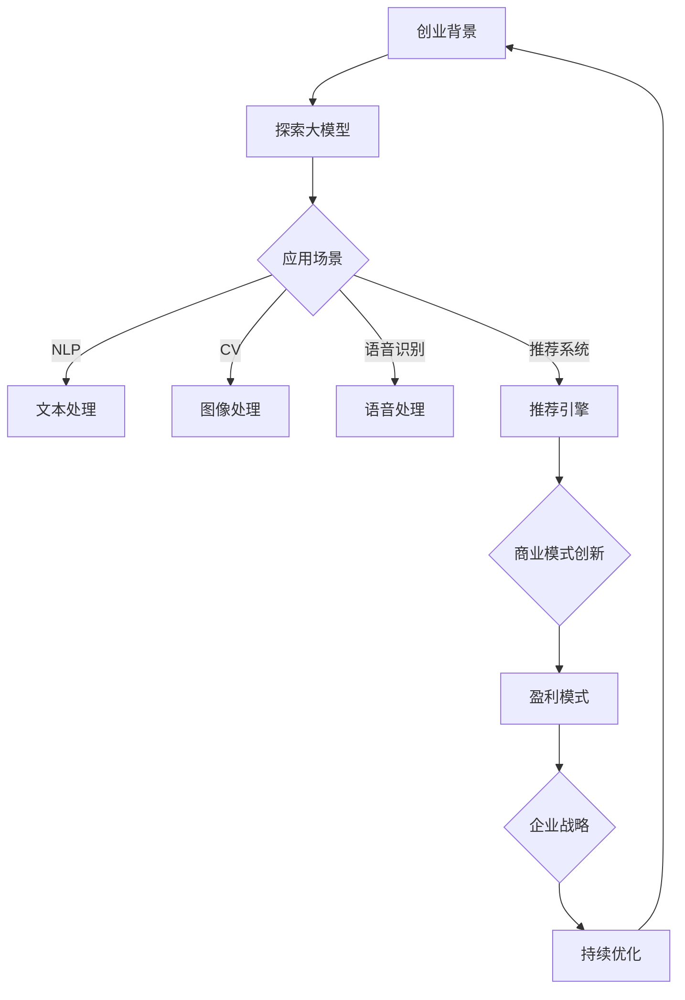

                 

# 创业者探索大模型新商业模式，打造AI产品矩阵

> **关键词**：大模型，商业模式，AI产品矩阵，创业

> **摘要**：本文将探讨创业者如何利用大模型技术，探索并构建新的商业模式，从而打造一个具有竞争力的AI产品矩阵。通过对大模型的基本概念、应用场景、构建方法以及未来发展趋势的深入分析，为创业者提供切实可行的操作指南。

## 1. 背景介绍

在过去的几十年里，人工智能（AI）技术经历了飞速的发展。特别是近年来，深度学习算法的突破和大数据技术的应用，使得大模型（Large Models）在多个领域取得了显著的成果。从自然语言处理（NLP）到计算机视觉（CV）、从语音识别到机器翻译，大模型的应用场景越来越广泛。

随着技术的不断进步，大模型的训练和优化成本也在逐渐降低。这使得越来越多的创业者看到了AI技术的巨大潜力，并将其视为企业发展的重要战略方向。然而，如何在竞争激烈的市场中，利用大模型构建具有竞争力的商业模式，成为众多创业者亟待解决的问题。

本文将从以下几个方面展开讨论：

1. 大模型的基本概念与架构。
2. 大模型在AI产品中的应用场景。
3. 创业者如何利用大模型构建商业模式。
4. 大模型技术的未来发展趋势与挑战。

希望通过本文的阐述，能够为创业者提供一些有益的启示和操作指南。

## 2. 核心概念与联系

### 2.1 大模型的基本概念

大模型（Large Models）是指具有数十亿、数百亿甚至千亿参数规模的深度学习模型。这些模型通常通过大量数据进行训练，以实现较高的性能和泛化能力。

大模型的主要特点如下：

- 参数规模庞大：大模型的参数数量通常在数百万到数十亿之间，远超传统小型模型。
- 训练数据丰富：大模型需要大量的训练数据来保证模型的性能和泛化能力。
- 网络结构复杂：大模型通常采用深度神经网络（DNN）、变换器（Transformer）等复杂的网络结构。
- 计算资源需求高：大模型的训练和推理需要大量的计算资源，包括GPU、TPU等。

### 2.2 大模型在AI产品中的应用场景

大模型在AI产品中具有广泛的应用场景，以下列举几种常见应用：

- **自然语言处理（NLP）**：大模型在文本分类、机器翻译、问答系统、文本生成等方面具有显著优势。例如，BERT、GPT等模型在NLP任务中取得了突破性的成果。
- **计算机视觉（CV）**：大模型在图像分类、目标检测、图像生成等方面具有强大的能力。例如，ResNet、DenseNet等模型在CV任务中表现优异。
- **语音识别**：大模型在语音识别任务中具有高度的准确性和效率。例如，WaveNet、Transformer等模型在语音识别领域取得了显著成果。
- **推荐系统**：大模型在用户画像、商品推荐等方面具有强大的能力。例如，DeepFM、xDeepFM等模型在推荐系统中表现出色。

### 2.3 大模型与商业模式的联系

大模型与商业模式之间的联系主要体现在以下几个方面：

- **提高产品竞争力**：大模型技术可以提高AI产品的性能和泛化能力，从而增强产品在市场上的竞争力。
- **降低开发成本**：大模型技术的应用可以降低开发成本，缩短产品开发周期，提高企业盈利能力。
- **创新商业模式**：大模型技术的应用可以为创业者提供更多的创新机会，探索新的商业模式，如订阅制、平台化等。
- **数据驱动**：大模型技术的应用可以更好地挖掘和分析数据，为企业提供更精准的商业决策支持。

### 2.4 Mermaid 流程图

以下是一个简单的Mermaid流程图，展示大模型在商业模式中的应用：



## 3. 核心算法原理 & 具体操作步骤

### 3.1 核心算法原理

大模型的核心算法主要基于深度学习和变换器（Transformer）架构。以下分别介绍这两种算法的基本原理。

#### 3.1.1 深度学习算法

深度学习算法是一种基于多层神经网络（Neural Network）的机器学习技术。其基本原理是通过多层次的非线性变换，将输入数据映射到输出结果。

深度学习算法主要包括以下几个关键组件：

- **神经网络结构**：深度学习算法采用多层神经网络结构，每一层网络对输入数据进行处理和变换。
- **激活函数**：激活函数用于引入非线性变换，使模型具有更好的表现能力。
- **损失函数**：损失函数用于评估模型的预测结果与真实结果之间的差距，指导模型优化过程。
- **优化算法**：优化算法用于调整模型的参数，以最小化损失函数。

#### 3.1.2 变换器（Transformer）架构

变换器（Transformer）架构是深度学习领域的一种创新性结构，首次提出于2017年的论文《Attention Is All You Need》。它采用注意力机制（Attention Mechanism）来处理序列数据，具有以下特点：

- **多头注意力**：变换器通过多个头（Head）对序列数据进行不同的权重分配，从而提高模型的表示能力。
- **自注意力**：变换器采用自注意力机制，使模型能够在序列数据中捕捉长距离依赖关系。
- **前馈神经网络**：变换器在注意力机制之后，接入两个简单的全连接神经网络（Feed-Forward Neural Network），对输入数据进行进一步处理。

### 3.2 具体操作步骤

以下是利用大模型构建AI产品的具体操作步骤：

#### 3.2.1 数据准备

1. **数据收集**：收集与目标应用场景相关的数据，如文本、图像、语音等。
2. **数据预处理**：对收集到的数据进行清洗、标注和格式化，以满足模型训练的需求。

#### 3.2.2 模型训练

1. **模型选择**：根据应用场景选择合适的模型架构，如BERT、GPT、ResNet等。
2. **模型配置**：配置模型参数，如学习率、批次大小、迭代次数等。
3. **模型训练**：使用训练数据进行模型训练，通过优化算法调整模型参数，使模型在验证集上表现最佳。

#### 3.2.3 模型评估

1. **评估指标**：根据应用场景选择合适的评估指标，如准确率、召回率、F1值等。
2. **模型调优**：根据评估结果对模型进行调优，以提高模型性能。

#### 3.2.4 模型部署

1. **模型推理**：将训练好的模型部署到生产环境中，进行实时推理和预测。
2. **性能监控**：监控模型在生产环境中的性能，及时发现并解决潜在问题。

## 4. 数学模型和公式 & 详细讲解 & 举例说明

### 4.1 深度学习数学模型

深度学习模型的核心是多层神经网络，其数学模型可以表示为：

\[ y = f(z) \]

其中：

- \( y \) 是模型的输出。
- \( z \) 是模型的输入。
- \( f \) 是激活函数。

#### 4.1.1 激活函数

常见的激活函数包括：

- **Sigmoid函数**：

\[ \sigma(z) = \frac{1}{1 + e^{-z}} \]

- **ReLU函数**：

\[ \text{ReLU}(z) = \max(0, z) \]

- **Tanh函数**：

\[ \text{Tanh}(z) = \frac{e^z - e^{-z}}{e^z + e^{-z}} \]

#### 4.1.2 损失函数

常见的损失函数包括：

- **均方误差（MSE）**：

\[ \text{MSE}(y, \hat{y}) = \frac{1}{n} \sum_{i=1}^{n} (y_i - \hat{y}_i)^2 \]

- **交叉熵（Cross-Entropy）**：

\[ \text{Cross-Entropy}(y, \hat{y}) = -\sum_{i=1}^{n} y_i \log(\hat{y}_i) \]

#### 4.1.3 优化算法

常见的优化算法包括：

- **梯度下降（Gradient Descent）**：

\[ \theta = \theta - \alpha \cdot \nabla_{\theta} J(\theta) \]

其中：

- \( \theta \) 是模型参数。
- \( \alpha \) 是学习率。
- \( J(\theta) \) 是损失函数。

### 4.2 变换器架构数学模型

变换器架构的数学模型可以表示为：

\[ \text{Output} = \text{Transformer}( \text{Input}, \text{Key}, \text{Value}) \]

其中：

- **Input**：输入序列。
- **Key**：键序列。
- **Value**：值序列。
- **Transformer**：变换器模型。

变换器模型包括以下几个关键组件：

- **多头注意力（Multi-Head Attention）**：

\[ \text{Attention}(Q, K, V) = \text{softmax}\left(\frac{QK^T}{\sqrt{d_k}}\right)V \]

其中：

- \( Q \) 是查询序列。
- \( K \) 是键序列。
- \( V \) 是值序列。
- \( d_k \) 是键序列的维度。

- **自注意力（Self-Attention）**：

\[ \text{Self-Attention}(X) = \text{Attention}(X, X, X) \]

其中：

- \( X \) 是输入序列。

### 4.3 举例说明

#### 4.3.1 均方误差（MSE）的例子

假设有一个简单的线性回归模型，用于预测房价。模型的输出 \( \hat{y} \) 是预测的房价，真实房价为 \( y \)。我们可以使用均方误差（MSE）来评估模型的性能：

\[ \text{MSE}(y, \hat{y}) = \frac{1}{n} \sum_{i=1}^{n} (y_i - \hat{y}_i)^2 \]

例如，对于三组数据：

- \( y_1 = 200, \hat{y}_1 = 220 \)
- \( y_2 = 250, \hat{y}_2 = 240 \)
- \( y_3 = 300, \hat{y}_3 = 280 \)

计算MSE：

\[ \text{MSE} = \frac{1}{3}[(200-220)^2 + (250-240)^2 + (300-280)^2] = 50 \]

#### 4.3.2 多头注意力（Multi-Head Attention）的例子

假设有一个文本序列 \( X = [x_1, x_2, x_3] \)，我们使用多头注意力来计算其注意力得分。

- **Key**：\( K = [k_1, k_2, k_3] \)
- **Value**：\( V = [v_1, v_2, v_3] \)

设置头数为2，即 \( h = 2 \)。

第一头：

\[ Q = [q_1, q_2, q_3] = X \]

\[ \text{Attention}(Q, K, V) = \text{softmax}\left(\frac{QK^T}{\sqrt{d_k}}\right)V \]

\[ A_1 = \text{softmax}\left(\frac{[q_1, q_2, q_3][k_1, k_2, k_3]^T}{\sqrt{d_k}}\right)V \]

第二头：

\[ Q = [q_1, q_2, q_3] = X \]

\[ \text{Attention}(Q, K, V) = \text{softmax}\left(\frac{QK^T}{\sqrt{d_k}}\right)V \]

\[ A_2 = \text{softmax}\left(\frac{[q_1, q_2, q_3][k_1, k_2, k_3]^T}{\sqrt{d_k}}\right)V \]

最终输出：

\[ \text{Output} = \text{Concat}(A_1, A_2) \]

## 5. 项目实战：代码实际案例和详细解释说明

### 5.1 开发环境搭建

在开始实际案例之前，我们需要搭建一个适合训练和部署大模型的开发环境。以下是使用Python和PyTorch搭建开发环境的步骤：

1. **安装Python**：确保安装了Python 3.8或更高版本。

2. **安装PyTorch**：打开命令行，执行以下命令：

   ```shell
   pip install torch torchvision
   ```

3. **验证安装**：在Python环境中，执行以下代码，检查PyTorch是否成功安装：

   ```python
   import torch
   print(torch.__version__)
   ```

### 5.2 源代码详细实现和代码解读

下面我们以一个简单的文本分类任务为例，展示如何使用PyTorch和变换器（Transformer）架构训练一个文本分类模型。

#### 5.2.1 数据准备

首先，我们需要准备用于训练的数据集。这里使用的是常见的文本分类数据集——IMDb电影评论数据集。

1. **下载数据集**：访问[IMDb数据集官方网站](http://ai.stanford.edu/~amaas/data/sentiment/)，下载并解压数据集。

2. **数据预处理**：将文本数据进行清洗、分词和编码，生成模型输入。

   ```python
   import os
   import re
   import nltk
   from torchtext.datasets import IMDb
   from torchtext.data import Field
   
   nltk.download('punkt')
   
   def preprocess_text(text):
       text = text.lower()
       text = re.sub(r"[^a-zA-Z0-9]", " ", text)
       return nltk.word_tokenize(text)
   
   TEXT = Field(tokenize=preprocess_text, lower=True)
   train_data, test_data = IMDb.splits(TEXT)
   ```

#### 5.2.2 模型定义

接下来，我们定义一个简单的文本分类模型，基于变换器（Transformer）架构。

```python
import torch
import torch.nn as nn
from torch.nn import TransformerEncoder, TransformerEncoderLayer

class TextClassifier(nn.Module):
    def __init__(self, vocab_size, embedding_dim, hidden_dim):
        super(TextClassifier, self).__init__()
        self.embedding = nn.Embedding(vocab_size, embedding_dim)
        self.transformer_encoder = TransformerEncoder(TransformerEncoderLayer(embedding_dim, nhead=4), 2)
        self.fc = nn.Linear(embedding_dim, 1)
        
    def forward(self, text):
        embedded = self.embedding(text)
        output = self.transformer_encoder(embedded)
        output = self.fc(output[-1, :, :])
        return output
```

#### 5.2.3 模型训练

1. **数据加载**：

   ```python
   from torchtext.data import Iterator
   
   BATCH_SIZE = 32
   train_iter = Iterator(train_data, batch_size=BATCH_SIZE, shuffle=True)
   test_iter = Iterator(test_data, batch_size=BATCH_SIZE, shuffle=False)
   ```

2. **模型训练**：

   ```python
   EPOCHS = 10
   LEARNING_RATE = 0.001
   
   model = TextClassifier(len(TEXT.vocab), embedding_dim=100, hidden_dim=200)
   criterion = nn.BCEWithLogitsLoss()
   optimizer = torch.optim.Adam(model.parameters(), lr=LEARNING_RATE)
   
   for epoch in range(EPOCHS):
       model.train()
       for batch in train_iter:
           optimizer.zero_grad()
           predictions = model(batch.text).squeeze(1)
           loss = criterion(predictions, batch.label)
           loss.backward()
           optimizer.step()
   
       model.eval()
       with torch.no_grad():
           correct = 0
           total = 0
           for batch in test_iter:
               predictions = model(batch.text).squeeze(1)
               total += batch.label.size(0)
               correct += (predictions > 0.5).eq(batch.label).sum().item()
   
       print(f"Epoch {epoch+1}, Loss: {loss.item()}, Accuracy: {100 * correct / total}%")
   ```

### 5.3 代码解读与分析

#### 5.3.1 数据准备

1. **下载数据集**：从官方网站下载IMDb数据集，包含训练集和测试集。

2. **数据预处理**：将文本数据进行清洗、分词和编码，生成模型输入。

#### 5.3.2 模型定义

1. **嵌入层（Embedding Layer）**：将单词编码为向量，用于输入变换器。

2. **变换器编码器（Transformer Encoder）**：采用变换器编码器处理序列数据，捕获长距离依赖关系。

3. **全连接层（Fully Connected Layer）**：将变换器编码器的输出映射到分类结果。

#### 5.3.3 模型训练

1. **数据加载**：使用Iterator类加载训练集和测试集。

2. **模型训练**：使用Adam优化器和BCEWithLogitsLoss损失函数进行模型训练。

3. **模型评估**：在测试集上评估模型性能，计算准确率。

## 6. 实际应用场景

大模型在AI产品中的应用场景非常广泛，以下列举几种常见的应用场景：

### 6.1 自然语言处理（NLP）

大模型在自然语言处理领域具有显著优势，可以用于文本分类、机器翻译、问答系统、文本生成等任务。

- **文本分类**：例如，使用BERT模型对社交媒体评论进行情感分类，帮助企业了解用户情感倾向。
- **机器翻译**：例如，使用GPT模型实现高质量的自然语言翻译，如谷歌翻译。
- **问答系统**：例如，使用基于变换器的模型构建智能客服系统，为用户提供实时回答。

### 6.2 计算机视觉（CV）

大模型在计算机视觉领域可以用于图像分类、目标检测、图像生成等任务。

- **图像分类**：例如，使用ResNet模型对图像进行分类，识别图像中的物体。
- **目标检测**：例如，使用YOLO模型实现实时目标检测，用于自动驾驶、安防监控等领域。
- **图像生成**：例如，使用生成对抗网络（GAN）生成高质量的艺术作品、动漫角色等。

### 6.3 语音识别

大模型在语音识别领域可以用于语音转文字、语音合成等任务。

- **语音转文字**：例如，使用WaveNet模型实现高精度的语音转文字，如苹果的Siri。
- **语音合成**：例如，使用Tacotron模型实现自然流畅的语音合成，如谷歌的Google Assistant。

### 6.4 推荐系统

大模型在推荐系统领域可以用于用户画像、商品推荐等任务。

- **用户画像**：例如，使用深度学习算法构建用户画像，用于精准推荐。
- **商品推荐**：例如，使用深度学习模型实现基于内容的推荐和协同过滤推荐。

## 7. 工具和资源推荐

### 7.1 学习资源推荐

1. **书籍**：

   - 《深度学习》（Goodfellow, Bengio, Courville）  
   - 《Python深度学习》（François Chollet）  
   - 《Transformer：从零开始实现》（李沐）

2. **论文**：

   - 《Attention Is All You Need》（Vaswani et al., 2017）  
   - 《BERT: Pre-training of Deep Bidirectional Transformers for Language Understanding》（Devlin et al., 2018）  
   - 《Generative Adversarial Networks》（Goodfellow et al., 2014）

3. **博客**：

   - [PyTorch官方文档](https://pytorch.org/tutorials/)  
   - [TensorFlow官方文档](https://www.tensorflow.org/tutorials/)  
   - [Keras官方文档](https://keras.io/tutorials/)

4. **网站**：

   - [Google AI](https://ai.google/)  
   - [Facebook AI](https://ai.facebook.com/)  
   - [DeepMind](https://www.deepmind.com/)

### 7.2 开发工具框架推荐

1. **深度学习框架**：

   - PyTorch：适用于快速原型设计和模型训练。  
   - TensorFlow：适用于大规模生产环境中的模型训练和部署。  
   - Keras：适用于快速构建和训练深度学习模型。

2. **数据处理工具**：

   - Pandas：适用于数据清洗、预处理和分析。  
   - NumPy：适用于数值计算和数据处理。  
   - Scikit-learn：适用于机器学习算法的实现和应用。

3. **版本控制工具**：

   - Git：适用于代码版本控制和团队协作。  
   - GitHub：适用于代码托管和社区交流。

## 8. 总结：未来发展趋势与挑战

大模型技术在AI领域取得了显著的成果，为创业者提供了丰富的创新机会。然而，随着模型规模的不断扩大，大模型技术也面临着诸多挑战。

### 8.1 发展趋势

1. **模型规模扩大**：随着计算能力和数据资源的提升，大模型将继续向更大的参数规模和更强的性能发展。

2. **跨模态学习**：未来大模型将实现跨模态学习，如将文本、图像、语音等多种数据类型进行整合，提高模型的应用价值。

3. **自动化模型训练**：随着AI技术的发展，自动化模型训练（AutoML）将进一步提高模型训练的效率和质量。

4. **低功耗模型**：为满足移动设备和物联网等场景的需求，低功耗大模型将成为研究热点。

### 8.2 挑战

1. **计算资源需求**：大模型训练和推理需要大量的计算资源，如何高效利用计算资源将成为关键问题。

2. **数据隐私和安全**：大模型在训练和推理过程中涉及大量数据，如何保障数据隐私和安全是亟待解决的问题。

3. **可解释性和透明性**：大模型的决策过程往往难以解释，如何提高模型的可解释性和透明性是当前研究的热点。

4. **伦理和社会影响**：大模型技术的发展可能带来伦理和社会影响，如就业、隐私、偏见等问题。

## 9. 附录：常见问题与解答

### 9.1 大模型与深度学习的关系

大模型是深度学习的一种表现形式，深度学习是一种基于多层神经网络进行数据建模的方法。大模型通常具有较大的参数规模和较强的泛化能力，而深度学习则强调多层神经网络的构建和优化。

### 9.2 大模型训练和推理的区别

大模型训练是指使用大量数据进行模型参数的优化，使模型在特定任务上取得较好的性能。大模型推理是指在训练完成后，使用模型对新数据进行预测或分类。

### 9.3 大模型的计算资源需求

大模型训练和推理需要大量的计算资源，特别是GPU、TPU等专用硬件。在实际应用中，需要根据模型的规模和性能要求选择合适的计算资源。

### 9.4 大模型与人工智能的区别

大模型是人工智能的一种技术手段，人工智能是指利用计算机模拟人类智能的学科。大模型技术可以提高AI产品的性能和泛化能力，但人工智能还包括知识表示、推理、机器学习等多个方面。

## 10. 扩展阅读 & 参考资料

1. **书籍**：

   - 《深度学习》（Goodfellow, Bengio, Courville）  
   - 《Python深度学习》（François Chollet）  
   - 《Transformer：从零开始实现》（李沐）

2. **论文**：

   - 《Attention Is All You Need》（Vaswani et al., 2017）  
   - 《BERT: Pre-training of Deep Bidirectional Transformers for Language Understanding》（Devlin et al., 2018）  
   - 《Generative Adversarial Networks》（Goodfellow et al., 2014）

3. **博客**：

   - [PyTorch官方文档](https://pytorch.org/tutorials/)  
   - [TensorFlow官方文档](https://www.tensorflow.org/tutorials/)  
   - [Keras官方文档](https://keras.io/tutorials/)

4. **网站**：

   - [Google AI](https://ai.google/)  
   - [Facebook AI](https://ai.facebook.com/)  
   - [DeepMind](https://www.deepmind.com/)

5. **在线课程**：

   - [吴恩达深度学习课程](https://www.deeplearning.ai/)  
   - [斯坦福深度学习课程](https://web.stanford.edu/class/cs231n/)  
   - [李沐深度学习课程](https://nlp.stanford.edu/~socherru/teaching/)

