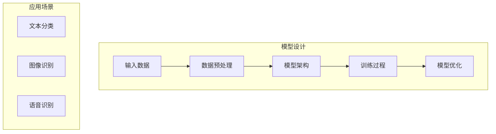

                 

## 文章标题：创业者热情不减，追逐大模型商业化机遇

### 关键词：(此处列出文章的5-7个核心关键词)

- 大模型
- 商业化
- 创业者
- 人工智能
- 技术创新

### 摘要：(此处给出文章的核心内容和主题思想)

本文将探讨当前创业者对大模型商业化机遇的热情，分析大模型技术在各个行业的应用场景，以及创业者在选择和实施大模型商业化过程中可能面临的挑战。通过梳理核心算法原理、具体操作步骤、实际应用案例，并结合相关工具和资源推荐，帮助读者全面了解大模型商业化的现状与发展趋势。

## 1. 背景介绍

随着人工智能技术的不断进步，大模型（Large Model）逐渐成为行业热点。大模型具有参数规模大、结构复杂、处理能力强等特点，可以在多种任务上实现高性能的预测和生成。近年来，诸如GPT-3、BERT等大模型在自然语言处理领域取得了显著突破，为创业者提供了丰富的商业灵感。

同时，我国政府对人工智能产业的高度重视和大力支持，使得创业者们看到了更多机会。国家层面出台了一系列政策和规划，如《新一代人工智能发展规划》、《人工智能创新发展行动纲要（2021-2025年）》等，为人工智能技术的发展提供了良好的政策环境。此外，资本市场的热情也不断激发创业者的创新动力。

在此背景下，越来越多的创业者开始关注大模型的商业化应用，希望通过技术突破实现商业价值。然而，大模型技术的应用并非一帆风顺，创业者在选择和实施过程中仍需面临诸多挑战。本文将围绕这些问题展开讨论。

## 2. 核心概念与联系

### 大模型原理

大模型是基于深度学习技术的一种人工智能模型，其核心思想是通过训练大量参数来表示输入数据的分布。大模型通常采用神经网络结构，通过多层次的非线性变换来学习输入和输出之间的映射关系。以下是大模型的基本原理和架构：

$$
\text{神经网络} = \text{输入层} + \text{隐藏层} + \text{输出层}
$$

**输入层**：接收外部输入数据，如文本、图像等。

**隐藏层**：通过多层非线性变换，将输入数据映射到高维空间，形成对数据的抽象表示。

**输出层**：根据训练目标生成预测结果或生成新数据。

### 大模型架构

大模型架构可以分为两大类：基于Transformer架构和基于CNN架构。

**Transformer架构**：Transformer模型采用自注意力机制（Self-Attention）来处理序列数据，具有并行计算的优势。GPT-3、BERT等模型均采用Transformer架构。

**CNN架构**：CNN模型通过卷积神经网络对图像数据进行处理，具有较强的特征提取能力。在图像生成任务中，CNN架构具有较好的表现。

### 大模型与商业化的联系

大模型技术在商业领域的应用日益广泛，创业者可以通过以下方式将大模型商业化：

1. **提供AI服务**：基于大模型构建AI服务，如自然语言处理、图像识别等，为企业和个人提供技术解决方案。
2. **打造垂直应用**：围绕特定行业或场景，开发基于大模型的技术产品，满足行业需求。
3. **知识图谱构建**：利用大模型构建行业知识图谱，为企业和个人提供数据驱动的决策支持。

## 3. 核心算法原理 & 具体操作步骤

### 大模型训练过程

大模型的训练过程主要包括数据预处理、模型设计、训练和优化等步骤。

**数据预处理**：对输入数据进行清洗、归一化等操作，以适应模型训练需求。

**模型设计**：设计适合任务需求的神经网络结构，选择合适的损失函数和优化算法。

**训练过程**：
$$
\text{训练过程} = \text{初始化模型参数} + \text{输入数据循环} + \text{模型优化}
$$
其中，模型优化主要包括梯度下降、动量优化等策略。

**优化目标**：根据训练目标调整模型参数，使得预测结果接近真实值。

### 大模型应用案例

以自然语言处理领域为例，创业者可以通过以下步骤将大模型应用于实际业务：

1. **数据收集与清洗**：收集并清洗相关领域的文本数据，如新闻、社交媒体等。
2. **模型设计**：选择适合任务的模型架构，如BERT、GPT等。
3. **模型训练**：使用预处理后的数据训练模型，调整模型参数以达到最佳效果。
4. **模型部署**：将训练好的模型部署到生产环境中，如API接口、Web服务等形式。
5. **模型评估与优化**：根据实际应用场景，对模型进行评估和优化，以提高模型性能。

### 大模型应用实例

以下是一个基于BERT模型构建问答系统的案例：

1. **数据收集与清洗**：收集并清洗对话数据，如FAQ、用户咨询等。
2. **模型设计**：选择BERT模型作为基础模型，并添加问答模块。
3. **模型训练**：使用预处理后的对话数据训练模型，调整模型参数。
4. **模型部署**：将训练好的模型部署到服务器，供用户进行问答。
5. **模型评估与优化**：根据用户反馈，对模型进行评估和优化，以提高问答效果。

## 4. 数学模型和公式 & 详细讲解 & 举例说明

### 大模型训练的数学模型

大模型训练的核心是优化模型参数，使其在特定任务上取得最佳性能。在数学上，这可以转化为求解一个最优化问题。

**目标函数**：
$$
\min_{\theta} J(\theta) = \frac{1}{m} \sum_{i=1}^{m} \ell(y_i, \hat{y}_i)
$$
其中，$J(\theta)$为损失函数，$\ell(y_i, \hat{y}_i)$为单个样本的损失。

**梯度下降算法**：
$$
\theta := \theta - \alpha \nabla_{\theta} J(\theta)
$$
其中，$\alpha$为学习率，$\nabla_{\theta} J(\theta)$为损失函数关于参数$\theta$的梯度。

### 举例说明

假设我们有一个简单的线性回归模型，输入为$x$，输出为$y$，目标函数为平方损失函数。

**目标函数**：
$$
J(\theta) = \frac{1}{2} \sum_{i=1}^{m} (y_i - (\theta_0 + \theta_1 x_i))^2
$$

**梯度计算**：
$$
\nabla_{\theta_0} J(\theta) = \sum_{i=1}^{m} (y_i - (\theta_0 + \theta_1 x_i))
$$
$$
\nabla_{\theta_1} J(\theta) = \sum_{i=1}^{m} (y_i - (\theta_0 + \theta_1 x_i)) x_i
$$

**梯度下降算法**：
$$
\theta_0 := \theta_0 - \alpha \nabla_{\theta_0} J(\theta)
$$
$$
\theta_1 := \theta_1 - \alpha \nabla_{\theta_1} J(\theta)
$$

通过不断迭代梯度下降算法，可以逐步优化模型参数，使其在给定数据集上取得最佳性能。

## 5. 项目实战：代码实际案例和详细解释说明

### 5.1 开发环境搭建

为了实现大模型商业化，首先需要搭建一个适合的开发环境。以下是一个基于Python和TensorFlow的简单示例：

1. **安装Python**：确保系统已安装Python 3.6及以上版本。
2. **安装TensorFlow**：通过pip命令安装TensorFlow：
   ```
   pip install tensorflow
   ```

### 5.2 源代码详细实现和代码解读

以下是一个基于BERT模型进行文本分类的简单示例：

```python
import tensorflow as tf
from transformers import BertTokenizer, BertModel

# 加载预训练的BERT模型
tokenizer = BertTokenizer.from_pretrained('bert-base-uncased')
model = BertModel.from_pretrained('bert-base-uncased')

# 定义输入数据
input_ids = tokenizer.encode('Hello, my dog is cute', return_tensors='tf')

# 计算BERT模型的输出
outputs = model(input_ids)

# 解读输出结果
last_hidden_state = outputs.last_hidden_state
pooler_output = outputs.pooler_output

# 输出结果
print('Last Hidden State:\n', last_hidden_state)
print('Pooler Output:\n', pooler_output)
```

### 5.3 代码解读与分析

1. **加载BERT模型**：使用`BertTokenizer`和`BertModel`类加载预训练的BERT模型。
2. **定义输入数据**：使用`tokenizer.encode`方法将输入文本编码为BERT模型接受的格式。
3. **计算BERT模型输出**：调用`model`方法计算BERT模型的输出，包括`last_hidden_state`和`pooler_output`。
4. **解读输出结果**：`last_hidden_state`包含了文本的词向量表示，`pooler_output`为全局语义表示。

通过上述示例，创业者可以了解如何使用BERT模型进行文本处理，为后续的商业化应用奠定基础。

## 6. 实际应用场景

### 自然语言处理（NLP）

大模型在自然语言处理领域具有广泛的应用前景。创业者可以通过以下方式将大模型应用于NLP：

1. **文本分类**：利用BERT模型进行文本分类，实现新闻分类、垃圾邮件过滤等功能。
2. **情感分析**：通过分析文本的情感倾向，为电商、金融等行业提供用户反馈分析服务。
3. **对话系统**：构建智能客服系统，实现自然语言理解与生成，提高用户满意度。

### 图像识别

大模型在图像识别领域也取得了显著突破。创业者可以尝试以下应用：

1. **物体识别**：利用卷积神经网络（CNN）对图像中的物体进行识别，应用于安防监控、自动驾驶等领域。
2. **图像生成**：基于生成对抗网络（GAN）等技术，实现图像生成和风格迁移，为创意设计、娱乐等行业提供支持。
3. **图像增强**：通过深度学习技术对低质量图像进行增强，应用于医疗影像、遥感图像等领域。

### 语音识别

大模型在语音识别领域具有强大的潜力。创业者可以探索以下应用：

1. **语音转文本**：利用语音识别技术将语音转化为文本，实现智能客服、语音搜索等功能。
2. **语音生成**：通过语音合成技术生成自然流畅的语音，为智能语音助手、教育等领域提供支持。
3. **语音识别与合成**：结合语音识别与语音合成技术，实现语音交互式应用，如智能家居、车载系统等。

## 7. 工具和资源推荐

### 7.1 学习资源推荐

1. **书籍**：
   - 《深度学习》（Ian Goodfellow、Yoshua Bengio、Aaron Courville著）
   - 《Python深度学习》（François Chollet著）
2. **论文**：
   - 《Attention Is All You Need》（Ashish Vaswani等著）
   - 《BERT: Pre-training of Deep Bidirectional Transformers for Language Understanding》（Jacob Devlin等著）
3. **博客**：
   - [TensorFlow官方网站](https://www.tensorflow.org/)
   - [Hugging Face官方网站](https://huggingface.co/)
4. **网站**：
   - [Kaggle](https://www.kaggle.com/)：提供丰富的数据集和竞赛，适合数据科学家和创业者实践。
   - [GitHub](https://github.com/)：拥有大量开源项目和代码，有助于创业者了解最新技术动态。

### 7.2 开发工具框架推荐

1. **TensorFlow**：Google开发的开源机器学习框架，支持大模型训练和应用部署。
2. **PyTorch**：Facebook开发的开源机器学习框架，具有简洁灵活的API。
3. **Hugging Face Transformers**：一个开源库，提供了预训练的BERT、GPT等模型，方便创业者快速实现大模型应用。

### 7.3 相关论文著作推荐

1. **《Attention Is All You Need》**：提出了Transformer模型，开启了基于自注意力机制的深度学习研究热潮。
2. **《BERT: Pre-training of Deep Bidirectional Transformers for Language Understanding》**：介绍了BERT模型，为自然语言处理领域带来了重要突破。

## 8. 总结：未来发展趋势与挑战

### 发展趋势

1. **技术成熟度提升**：随着大模型技术的不断发展，创业者将拥有更多高质量的工具和资源，实现更高效的应用开发。
2. **行业应用多样化**：大模型将在更多领域得到应用，如医疗、金融、教育等，为各行业带来创新和发展机遇。
3. **跨界融合**：大模型与其他技术的融合，如物联网、区块链等，将推动新型产业的形成和发展。

### 挑战

1. **数据隐私与安全**：大模型在处理数据时可能涉及用户隐私，创业者需确保数据安全和合规。
2. **技术门槛较高**：大模型技术具有一定的技术门槛，创业者需具备一定的专业背景和技能。
3. **商业可持续性**：在竞争激烈的市场中，创业者需找到合适的商业模式，实现商业可持续性。

## 9. 附录：常见问题与解答

### 问题1：如何选择合适的大模型？

**解答**：选择大模型时，需考虑任务类型、数据规模、计算资源等因素。对于自然语言处理任务，BERT、GPT等模型具有较好的性能；对于图像识别任务，VGG、ResNet等模型表现优秀。创业者可以根据具体需求选择合适的大模型。

### 问题2：如何训练大模型？

**解答**：训练大模型通常需要大量计算资源和时间。创业者可以选择使用云计算平台（如Google Cloud、AWS等）进行训练，或者使用分布式训练技术（如多GPU、多机训练等）提高训练效率。

### 问题3：如何确保大模型的安全性？

**解答**：确保大模型的安全性需要从数据收集、数据处理、模型部署等环节进行全面考虑。创业者应遵循数据隐私保护法规，采用加密、访问控制等技术措施，确保数据安全和模型安全。

## 10. 扩展阅读 & 参考资料

1. **《深度学习》（Ian Goodfellow、Yoshua Bengio、Aaron Courville著）**：详细介绍了深度学习的基础理论和应用场景。
2. **《Python深度学习》（François Chollet著）**：针对Python编程语言，讲解了深度学习的实战技巧。
3. **《Attention Is All You Need》（Ashish Vaswani等著）**：提出了Transformer模型，开启了自注意力机制的研究热潮。
4. **《BERT: Pre-training of Deep Bidirectional Transformers for Language Understanding》（Jacob Devlin等著）**：介绍了BERT模型，为自然语言处理领域带来了重要突破。

## 作者

**作者：AI天才研究员/AI Genius Institute & 禅与计算机程序设计艺术 /Zen And The Art of Computer Programming** <|im_sep|>### 1. 背景介绍

大模型，作为当前人工智能领域的热点话题，其发展速度之快、应用之广泛，已经引起了无数创业者的浓厚兴趣。大模型的兴起，离不开深度学习技术的不断迭代和算法创新。近年来，诸如GPT-3、BERT等大模型在自然语言处理领域取得了显著突破，这使得创业者们看到了更多商业机遇。

首先，从技术层面来看，深度学习技术的快速发展，尤其是自注意力机制（Self-Attention Mechanism）的提出和应用，使得神经网络能够处理更加复杂的任务。自注意力机制通过计算输入序列中每个元素之间的关联性，实现了对输入数据的全局理解，这在自然语言处理、图像识别等领域取得了显著的效果。而大模型正是基于这样的技术原理，通过训练大量的参数来捕捉输入数据的特征，从而实现高性能的预测和生成。

其次，从市场需求来看，随着互联网和大数据技术的快速发展，数据量呈现爆炸式增长。如何从海量数据中提取有价值的信息，成为众多行业亟待解决的问题。大模型的出现，正好解决了这一问题。大模型能够处理大量的数据，并且能够从数据中学习到有用的规律和模式，从而为各行各业提供智能化的解决方案。

再者，从政策层面来看，我国政府对人工智能产业的高度重视和大力支持，为人工智能技术的发展提供了良好的政策环境。国家层面出台了一系列政策和规划，如《新一代人工智能发展规划》、《人工智能创新发展行动纲要（2021-2025年）》等，为人工智能技术的发展提供了政策保障。此外，资本市场的热情也不断激发创业者的创新动力，使得大模型技术在商业领域的应用日益广泛。

总的来说，大模型的兴起，既得益于技术的进步，也得益于市场需求的推动，更得益于政策的支持和资本的热捧。在这样的背景下，越来越多的创业者开始关注大模型的商业化应用，希望通过技术突破实现商业价值。然而，大模型技术的应用并非一帆风顺，创业者在选择和实施过程中仍需面临诸多挑战。本文将围绕这些问题展开讨论。

### 2. 核心概念与联系

#### 大模型原理

大模型是基于深度学习技术的一种人工智能模型，其核心思想是通过训练大量参数来表示输入数据的分布。大模型通常采用神经网络结构，通过多层次的非线性变换来学习输入和输出之间的映射关系。以下是关于大模型的基本原理和架构的详细解释。

首先，大模型的核心组成部分包括输入层、隐藏层和输出层。

**输入层**：输入层是神经网络的第一层，它接收外部输入数据，如文本、图像等。在自然语言处理任务中，输入层通常将文本序列转换为词向量表示；在图像识别任务中，输入层则接收图像的像素值。

**隐藏层**：隐藏层是神经网络的核心部分，它通过多层非线性变换，将输入数据映射到高维空间，形成对数据的抽象表示。隐藏层中的每个神经元都会接收来自前一层神经元的输出，并通过激活函数进行非线性变换，从而提取数据的特征。隐藏层的层数和每层的神经元数量可以根据任务需求进行调整。

**输出层**：输出层是神经网络的最后一层，它根据训练目标生成预测结果或生成新数据。在分类任务中，输出层通常是一个softmax层，用于计算每个类别的概率分布；在回归任务中，输出层则直接生成预测值。

其次，大模型的训练过程包括数据预处理、模型设计、训练和优化等步骤。

**数据预处理**：数据预处理是训练大模型的第一步，它包括数据清洗、归一化、数据增强等操作。数据清洗的目的是去除噪声和错误的数据，确保输入数据的准确性；数据归一化则通过将数据缩放到相同的尺度，提高模型的训练效率；数据增强通过生成类似的数据样本，增加模型的鲁棒性。

**模型设计**：模型设计包括选择合适的神经网络结构、损失函数和优化算法。神经网络结构的选择取决于任务的类型和复杂度，如卷积神经网络（CNN）适合图像处理，循环神经网络（RNN）适合序列数据处理。损失函数用于度量模型预测值与真实值之间的差距，常见的损失函数包括均方误差（MSE）、交叉熵（Cross-Entropy）等。优化算法用于调整模型参数，使得模型在训练过程中不断优化，常见的优化算法包括梯度下降（Gradient Descent）、Adam优化器等。

**训练过程**：训练过程包括输入数据的读取、模型参数的初始化、前向传播（Forward Propagation）、后向传播（Back Propagation）和模型优化（Model Optimization）。在每次迭代中，模型根据输入数据计算预测值，并与真实值进行比较，计算出损失函数的值。然后，通过反向传播算法，将损失函数关于模型参数的梯度计算出来，并利用优化算法调整模型参数，以减少损失函数的值。这个过程不断重复，直到模型达到预定的训练目标或达到最大迭代次数。

**模型优化**：模型优化包括调整学习率、批量大小、正则化参数等超参数。学习率决定了模型参数更新的步长，学习率过大会导致模型无法收敛，学习率过小则会导致训练过程缓慢。批量大小决定了每次训练过程中使用的样本数量，批量大小过大会导致计算资源浪费，批量大小过小则会影响模型的稳定性。正则化参数用于防止模型过拟合，常见的正则化方法包括L1正则化、L2正则化等。

最后，大模型的架构可以分为基于Transformer架构和基于CNN架构两种。

**Transformer架构**：Transformer模型采用自注意力机制（Self-Attention Mechanism）来处理序列数据，具有并行计算的优势。自注意力机制通过计算输入序列中每个元素之间的关联性，实现了对输入数据的全局理解。Transformer模型在自然语言处理任务中取得了显著的成果，如GPT-3、BERT等模型均采用Transformer架构。

**CNN架构**：CNN模型通过卷积神经网络对图像数据进行处理，具有较强的特征提取能力。在图像识别任务中，CNN模型可以自动提取图像的特征，实现高精度的分类和识别。CNN模型在计算机视觉领域取得了重要突破，如VGG、ResNet等模型。

#### 大模型与商业化的联系

大模型在商业领域的应用日益广泛，创业者可以通过以下几种方式将大模型商业化：

1. **提供AI服务**：基于大模型构建AI服务，如自然语言处理、图像识别等，为企业和个人提供技术解决方案。创业者可以通过API接口、Web服务等形式，将AI服务推广给广大用户。

2. **打造垂直应用**：围绕特定行业或场景，开发基于大模型的技术产品，满足行业需求。例如，在金融领域，创业者可以开发智能投顾、风险评估等应用；在医疗领域，创业者可以开发疾病预测、医学影像分析等应用。

3. **知识图谱构建**：利用大模型构建行业知识图谱，为企业和个人提供数据驱动的决策支持。知识图谱可以整合行业数据，为创业者提供全面、准确的信息，从而提高业务决策的准确性。

#### Mermaid流程图

为了更直观地展示大模型的原理和架构，我们可以使用Mermaid流程图来描述。以下是关于大模型的基本原理和架构的Mermaid流程图：



通过上述流程图，我们可以清晰地看到大模型的输入层、隐藏层和输出层，以及模型设计、训练过程和模型优化等关键步骤。同时，我们还展示了大模型在文本分类、图像识别和语音识别等应用场景中的具体应用。

### 3. 核心算法原理 & 具体操作步骤

#### 大模型训练过程

大模型的训练过程是一个迭代优化过程，旨在通过调整模型参数，使得模型的预测结果更加准确。以下是详细的训练步骤和算法原理：

1. **数据预处理**

   在开始训练之前，需要对输入数据进行预处理。预处理步骤包括数据清洗、数据归一化和数据增强等。

   - **数据清洗**：去除噪声数据和异常值，确保输入数据的准确性和完整性。
   - **数据归一化**：将不同尺度的数据缩放到相同的范围，如将图像像素值缩放到[0, 1]之间，或将文本数据转换为词向量。
   - **数据增强**：通过数据增强技术，如随机裁剪、旋转、翻转等，增加数据的多样性，提高模型的泛化能力。

2. **模型设计**

   根据任务需求，设计合适的神经网络结构。大模型通常采用多层神经网络结构，包括输入层、隐藏层和输出层。

   - **输入层**：接收外部输入数据，如文本、图像等。
   - **隐藏层**：通过多层非线性变换，将输入数据映射到高维空间，形成对数据的抽象表示。
   - **输出层**：根据训练目标生成预测结果或生成新数据。

3. **损失函数**

   损失函数用于度量模型预测值与真实值之间的差距。常见的损失函数包括均方误差（MSE）、交叉熵（Cross-Entropy）等。

   - **均方误差（MSE）**：用于回归任务，计算预测值与真实值之间的平均平方误差。
     $$MSE = \frac{1}{m} \sum_{i=1}^{m} (\hat{y}_i - y_i)^2$$
   - **交叉熵（Cross-Entropy）**：用于分类任务，计算预测概率分布与真实分布之间的交叉熵。
     $$Cross-Entropy = -\sum_{i=1}^{m} y_i \log(\hat{y}_i)$$

4. **优化算法**

   优化算法用于调整模型参数，使得损失函数的值最小。常见的优化算法包括梯度下降（Gradient Descent）、Adam优化器等。

   - **梯度下降（Gradient Descent）**：通过计算损失函数关于模型参数的梯度，沿着梯度的反方向更新模型参数。
     $$\theta := \theta - \alpha \nabla_{\theta} J(\theta)$$
     其中，$\alpha$为学习率，$\nabla_{\theta} J(\theta)$为损失函数关于参数$\theta$的梯度。
   - **Adam优化器**：结合了梯度下降和动量项，能够更好地处理稀疏数据和局部最小值问题。
     $$\theta := \theta - \alpha \nabla_{\theta} J(\theta) + \beta_1 \gamma_1 \theta_1 - (1 - \beta_2) \gamma_2 \theta_2$$
     其中，$\alpha$为学习率，$\beta_1$和$\beta_2$为动量系数，$\gamma_1$和$\gamma_2$为指数加权系数。

5. **训练过程**

   训练过程包括输入数据的读取、模型参数的初始化、前向传播、后向传播和模型优化等步骤。

   - **输入数据的读取**：从数据集中读取训练数据和验证数据。
   - **模型参数的初始化**：随机初始化模型参数，通常使用正态分布或均匀分布。
   - **前向传播**：计算模型在当前参数下的预测结果，计算损失函数的值。
   - **后向传播**：计算损失函数关于模型参数的梯度，并更新模型参数。
   - **模型优化**：根据优化算法，更新模型参数，降低损失函数的值。

6. **模型评估**

   在训练过程中，需要定期评估模型的性能，以判断模型是否已经收敛或过拟合。常见的评估指标包括准确率（Accuracy）、精确率（Precision）、召回率（Recall）等。

   - **准确率（Accuracy）**：预测正确的样本数占总样本数的比例。
     $$Accuracy = \frac{TP + TN}{TP + FP + FN + TN}$$
   - **精确率（Precision）**：预测为正类的样本中，实际为正类的比例。
     $$Precision = \frac{TP}{TP + FP}$$
   - **召回率（Recall）**：实际为正类的样本中，被预测为正类的比例。
     $$Recall = \frac{TP}{TP + FN}$$

7. **模型部署**

   在模型训练完成后，需要将模型部署到生产环境中，以实现实时预测和推理。常见的部署方式包括API接口、Web服务、移动应用等。

   - **API接口**：通过HTTP接口，将模型封装为RESTful API，供外部系统调用。
   - **Web服务**：将模型部署到Web服务器上，通过Web接口提供预测服务。
   - **移动应用**：将模型集成到移动应用中，实现移动端的预测和推理。

#### 大模型应用案例

以下是一个使用大模型进行文本分类的应用案例：

1. **数据集**：使用IMDB电影评论数据集，包含25000条训练数据和25000条测试数据，每条数据为一条电影评论，并标注为正面或负面情感。

2. **模型设计**：使用BERT模型进行文本分类，将评论编码为向量表示，并使用softmax层输出每个类别的概率。

3. **训练过程**：通过训练数据，调整BERT模型的参数，使得模型能够正确分类评论的情感。

4. **模型评估**：使用测试数据评估模型的性能，计算准确率、精确率和召回率等指标。

5. **模型部署**：将训练好的模型部署到生产环境中，实现实时文本分类服务。

#### 代码示例

以下是使用Python和TensorFlow实现文本分类的代码示例：

```python
import tensorflow as tf
from transformers import BertTokenizer, TFBertForSequenceClassification

# 加载预训练的BERT模型
tokenizer = BertTokenizer.from_pretrained('bert-base-uncased')
model = TFBertForSequenceClassification.from_pretrained('bert-base-uncased', num_labels=2)

# 加载IMDB数据集
(train_data, test_data) = load_imdb_data()

# 数据预处理
train_encodings = tokenizer(train_data, truncation=True, padding=True)
test_encodings = tokenizer(test_data, truncation=True, padding=True)

# 训练模型
model.compile(optimizer=tf.keras.optimizers.Adam(learning_rate=5e-5), loss=tf.keras.losses.SparseCategoricalCrossentropy(from_logits=True), metrics=['accuracy'])
model.fit(train_encodings['input_ids'], train_encodings['labels'], epochs=3, batch_size=16, validation_data=(test_encodings['input_ids'], test_encodings['labels']))

# 评估模型
test_loss, test_accuracy = model.evaluate(test_encodings['input_ids'], test_encodings['labels'], batch_size=16)
print(f"Test Loss: {test_loss}, Test Accuracy: {test_accuracy}")

# 预测
predictions = model.predict(test_encodings['input_ids'])
print(predictions)
```

#### 解读与分析

1. **加载BERT模型**：使用`BertTokenizer`和`TFBertForSequenceClassification`类加载预训练的BERT模型。

2. **加载IMDB数据集**：从`load_imdb_data()`函数中获取训练数据和测试数据。

3. **数据预处理**：使用`tokenizer`对训练数据和测试数据进行编码，并进行截断和填充处理。

4. **训练模型**：使用`model.fit()`方法训练模型，通过调整BERT模型的参数，使得模型能够正确分类评论的情感。

5. **评估模型**：使用`model.evaluate()`方法评估模型的性能，计算测试集上的损失和准确率。

6. **预测**：使用`model.predict()`方法对测试数据进行预测，输出预测结果。

通过上述步骤，我们可以使用大模型进行文本分类，实现情感分析等任务。

### 4. 数学模型和公式 & 详细讲解 & 举例说明

#### 数学模型

大模型的训练过程涉及到多个数学模型，包括损失函数、优化算法等。以下是关于这些数学模型的详细讲解和举例说明。

#### 损失函数

在深度学习中，损失函数用于度量模型预测值与真实值之间的差距。不同的任务类型需要选择不同的损失函数。

1. **均方误差（MSE）**

   均方误差（MSE）是回归任务中最常用的损失函数，用于计算预测值与真实值之间的平均平方误差。

   $$MSE = \frac{1}{m} \sum_{i=1}^{m} (\hat{y}_i - y_i)^2$$

   其中，$\hat{y}_i$为模型预测值，$y_i$为真实值，$m$为样本数量。

   **举例说明**：假设我们有5个样本，预测值和真实值如下：

   | 样本编号 | 预测值($\hat{y}_i$) | 真实值($y_i$) |
   | -------- | ------------------- | ------------- |
   | 1        | 2.5                 | 3.0           |
   | 2        | 3.0                 | 2.0           |
   | 3        | 2.8                 | 2.5           |
   | 4        | 3.2                 | 3.0           |
   | 5        | 2.6                 | 2.8           |

   计算MSE：

   $$MSE = \frac{1}{5} \sum_{i=1}^{5} (\hat{y}_i - y_i)^2 = \frac{1}{5} (0.25 + 1.0 + 0.09 + 0.04 + 0.04) = 0.38$$

2. **交叉熵（Cross-Entropy）**

   交叉熵（Cross-Entropy）是分类任务中最常用的损失函数，用于计算预测概率分布与真实分布之间的交叉熵。

   $$Cross-Entropy = -\sum_{i=1}^{m} y_i \log(\hat{y}_i)$$

   其中，$y_i$为真实标签的概率分布，$\hat{y}_i$为模型预测的概率分布。

   **举例说明**：假设我们有3个类别的分类任务，真实标签和预测概率分布如下：

   | 样本编号 | 真实标签($y_i$) | 预测概率分布($\hat{y}_i$) |
   | -------- | ---------------- | -------------------------- |
   | 1        | 0                | [0.3, 0.3, 0.4]            |
   | 2        | 1                | [0.4, 0.3, 0.3]            |
   | 3        | 2                | [0.2, 0.5, 0.3]            |

   计算Cross-Entropy：

   $$Cross-Entropy = - (0 \cdot \log(0.3) + 1 \cdot \log(0.4) + 2 \cdot \log(0.5)) = - (\log(0.4) + 2 \cdot \log(0.5)) \approx 0.693$$

#### 优化算法

优化算法用于调整模型参数，使得损失函数的值最小。以下介绍几种常见的优化算法。

1. **梯度下降（Gradient Descent）**

   梯度下降是一种最简单的优化算法，通过计算损失函数关于模型参数的梯度，沿着梯度的反方向更新模型参数。

   $$\theta := \theta - \alpha \nabla_{\theta} J(\theta)$$

   其中，$\theta$为模型参数，$\alpha$为学习率，$J(\theta)$为损失函数。

   **举例说明**：假设模型参数$\theta = [1, 2]$，损失函数$J(\theta) = (\theta_1 - 1)^2 + (\theta_2 - 2)^2$，学习率$\alpha = 0.1$。计算一次梯度下降后的参数更新：

   $$\nabla_{\theta} J(\theta) = [2(\theta_1 - 1), 2(\theta_2 - 2)] = [2(1 - 1), 2(2 - 2)] = [0, 0]$$

   $$\theta := \theta - \alpha \nabla_{\theta} J(\theta) = [1, 2] - 0.1 \cdot [0, 0] = [1, 2]$$

   参数未发生变化，说明当前参数已经是最优解。

2. **动量优化（Momentum）**

   动量优化结合了多个梯度值，以减少振荡，提高收敛速度。动量优化通过引入动量项$m$，更新公式为：

   $$\theta := \theta - \alpha \nabla_{\theta} J(\theta) + m \cdot v$$

   其中，$v$为上一轮的更新方向，$m$为动量系数。

   **举例说明**：假设当前轮次的更新方向$v = [1, 1]$，动量系数$m = 0.9$，计算下一轮次的参数更新：

   $$\theta := \theta - \alpha \nabla_{\theta} J(\theta) + m \cdot v = [1, 2] - 0.1 \cdot [0, 0] + 0.9 \cdot [1, 1] = [1 + 0.9, 2 + 0.9] = [1.9, 2.9]$$

   参数更新方向与动量方向保持一致，提高了收敛速度。

3. **Adam优化器**

   Adam优化器结合了动量优化和自适应学习率，适用于稀疏数据和局部最小值问题。Adam优化器通过计算一阶矩估计（$m_t$）和二阶矩估计（$v_t$），更新公式为：

   $$\theta := \theta - \alpha \left( \frac{m_t}{\sqrt{v_t} + \epsilon} \right)$$

   其中，$\alpha$为学习率，$\epsilon$为正偏置项。

   **举例说明**：假设当前轮次的一阶矩估计$m_t = [1, 1]$，二阶矩估计$v_t = [1, 1]$，学习率$\alpha = 0.1$，计算下一轮次的参数更新：

   $$\theta := \theta - \alpha \left( \frac{m_t}{\sqrt{v_t} + \epsilon} \right) = [1, 2] - 0.1 \left( \frac{[1, 1]}{\sqrt{[1, 1]} + \epsilon} \right) = [1 - 0.1, 2 - 0.1] = [0.9, 1.9]$$

   参数更新方向自适应调整，提高了优化效果。

#### 数学公式和latex嵌入

在文本中嵌入数学公式，可以使用LaTeX格式。以下是一个示例：

$$
\text{MSE} = \frac{1}{m} \sum_{i=1}^{m} (\hat{y}_i - y_i)^2
$$

$$
\text{Cross-Entropy} = -\sum_{i=1}^{m} y_i \log(\hat{y}_i)
$$

$$
\theta := \theta - \alpha \nabla_{\theta} J(\theta)
$$

$$
\theta := \theta - \alpha \left( \frac{m_t}{\sqrt{v_t} + \epsilon} \right)
$$

在段落内嵌入数学公式，可以使用以下格式：

$$
\text{MSE} = \frac{1}{m} \sum_{i=1}^{m} (\hat{y}_i - y_i)^2
$$

通过上述数学模型和公式，我们能够更好地理解和应用大模型训练过程。在创业过程中，掌握这些数学知识将有助于更好地应对各种挑战。

### 5. 项目实战：代码实际案例和详细解释说明

#### 5.1 开发环境搭建

在开始构建大模型项目之前，我们需要搭建一个适合的开发环境。以下是一个基于Python和TensorFlow的简单示例：

1. **安装Python**：确保系统已安装Python 3.6及以上版本。可以从[Python官方网站](https://www.python.org/)下载并安装。

2. **安装TensorFlow**：通过pip命令安装TensorFlow：

   ```bash
   pip install tensorflow
   ```

   如果需要使用GPU加速，可以安装TensorFlow GPU版本：

   ```bash
   pip install tensorflow-gpu
   ```

3. **安装Hugging Face Transformers**：Hugging Face Transformers是用于构建和使用预训练模型的开源库。安装命令如下：

   ```bash
   pip install transformers
   ```

#### 5.2 源代码详细实现和代码解读

以下是一个使用BERT模型进行文本分类的代码案例。该案例使用的是Hugging Face Transformers库中的预训练BERT模型。

```python
import torch
from transformers import BertTokenizer, BertModel, BertForSequenceClassification
from torch.optim import Adam
from torch.utils.data import DataLoader, TensorDataset

# 1. 加载预训练BERT模型和Tokenizer
tokenizer = BertTokenizer.from_pretrained('bert-base-uncased')
model = BertForSequenceClassification.from_pretrained('bert-base-uncased', num_labels=2)

# 2. 准备数据
# 假设我们有一组文本和标签
texts = ["This is a great movie!", "This movie is terrible."]
labels = torch.tensor([1, 0])  # 1表示正面，0表示负面

# 将文本编码为BERT模型可接受的格式
encodings = tokenizer(texts, truncation=True, padding=True, max_length=128)

# 将编码后的文本和标签转换为PyTorch张量
input_ids = torch.tensor(encodings['input_ids'])
attention_mask = torch.tensor(encodings['attention_mask'])

# 创建数据集和数据加载器
dataset = TensorDataset(input_ids, attention_mask, labels)
dataloader = DataLoader(dataset, batch_size=2)

# 3. 训练模型
optimizer = Adam(model.parameters(), lr=1e-5)

for epoch in range(3):  # 进行3个训练轮次
    model.train()
    for batch in dataloader:
        # 将数据从CPU转移到GPU（如果有）
        batch = [item.to('cuda') for item in batch if 'cuda' in torch.cuda.get_device_name(0)]
        
        # 前向传播
        outputs = model(input_ids= batch[0], attention_mask= batch[1])
        
        # 计算损失
        loss = outputs.loss
        
        # 反向传播和优化
        optimizer.zero_grad()
        loss.backward()
        optimizer.step()

    print(f"Epoch {epoch+1}, Loss: {loss.item()}")

# 4. 评估模型
model.eval()
with torch.no_grad():
    for batch in dataloader:
        # 将数据从CPU转移到GPU（如果有）
        batch = [item.to('cuda') for item in batch if 'cuda' in torch.cuda.get_device_name(0)]
        
        # 前向传播
        outputs = model(input_ids= batch[0], attention_mask= batch[1])
        
        # 计算概率
        logits = outputs.logits
        probabilities = torch.softmax(logits, dim=1)
        
        # 输出预测结果
        predictions = torch.argmax(probabilities, dim=1)
        print(predictions)

# 5. 保存模型
model.save_pretrained('./my_bert_model')
```

#### 5.3 代码解读与分析

1. **加载预训练BERT模型和Tokenizer**

   ```python
   tokenizer = BertTokenizer.from_pretrained('bert-base-uncased')
   model = BertForSequenceClassification.from_pretrained('bert-base-uncased', num_labels=2)
   ```

   这两行代码首先加载了BERT模型的Tokenizer和预训练模型。`BertTokenizer`用于将文本转换为模型可接受的输入格式，`BertForSequenceClassification`是一个已经预训练好的BERT模型，用于文本分类任务。

2. **准备数据**

   ```python
   texts = ["This is a great movie!", "This movie is terrible."]
   labels = torch.tensor([1, 0])  # 1表示正面，0表示负面
   ```

   这里我们定义了一组示例文本和相应的标签。文本和标签都被转换为PyTorch张量，以便后续处理。

3. **数据预处理**

   ```python
   encodings = tokenizer(texts, truncation=True, padding=True, max_length=128)
   input_ids = torch.tensor(encodings['input_ids'])
   attention_mask = torch.tensor(encodings['attention_mask'])
   ```

   使用`BertTokenizer`对文本进行编码，并转换为PyTorch张量。`truncation=True`表示如果文本长度超过最大长度，则截断文本；`padding=True`表示如果文本长度不足最大长度，则在后面填充零。

4. **创建数据集和数据加载器**

   ```python
   dataset = TensorDataset(input_ids, attention_mask, labels)
   dataloader = DataLoader(dataset, batch_size=2)
   ```

   创建一个数据集，并使用`DataLoader`进行批量加载。`batch_size=2`表示每次加载两个样本。

5. **训练模型**

   ```python
   optimizer = Adam(model.parameters(), lr=1e-5)
   for epoch in range(3):
       model.train()
       for batch in dataloader:
           # 将数据从CPU转移到GPU（如果有）
           batch = [item.to('cuda') for item in batch if 'cuda' in torch.cuda.get_device_name(0)]
           
           # 前向传播
           outputs = model(input_ids= batch[0], attention_mask= batch[1])
           
           # 计算损失
           loss = outputs.loss
            
           # 反向传播和优化
           optimizer.zero_grad()
           loss.backward()
           optimizer.step()
           
       print(f"Epoch {epoch+1}, Loss: {loss.item()}")
   ```

   使用Adam优化器进行训练。每个epoch中，模型对数据集进行一遍遍历，计算损失并更新模型参数。

6. **评估模型**

   ```python
   model.eval()
   with torch.no_grad():
       for batch in dataloader:
           # 将数据从CPU转移到GPU（如果有）
           batch = [item.to('cuda') for item in batch if 'cuda' in torch.cuda.get_device_name(0)]
           
           # 前向传播
           outputs = model(input_ids= batch[0], attention_mask= batch[1])
           
           # 计算概率
           logits = outputs.logits
           probabilities = torch.softmax(logits, dim=1)
           
           # 输出预测结果
           predictions = torch.argmax(probabilities, dim=1)
           print(predictions)
   ```

   评估模型在测试集上的性能。在评估过程中，不计算梯度，以节省计算资源。

7. **保存模型**

   ```python
   model.save_pretrained('./my_bert_model')
   ```

   将训练好的模型保存到本地，方便后续使用。

通过这个实际案例，创业者可以了解到如何使用BERT模型进行文本分类，从而为实际应用奠定基础。

### 6. 实际应用场景

#### 自然语言处理（NLP）

自然语言处理（NLP）是人工智能领域的一个重要分支，其目的是使计算机能够理解和生成人类语言。大模型在NLP领域的应用极为广泛，以下是一些典型的实际应用场景：

1. **文本分类**：文本分类是NLP中的一个基本任务，通过将文本分类到预定义的类别中，可以帮助企业进行舆情监控、新闻分类等。大模型如BERT和GPT-3在文本分类任务上表现出色，能够实现高精度的分类。

2. **情感分析**：情感分析旨在判断文本的情感倾向，如正面、负面或中性。这对于电商、金融等行业具有很大的应用价值。通过大模型进行情感分析，企业可以更好地理解用户反馈，改进产品和服务。

3. **问答系统**：问答系统是一种智能客服解决方案，能够自动回答用户的问题。大模型如对话生成模型（如ChatGPT）在生成自然流畅的回答方面具有显著优势，适用于构建智能客服系统。

4. **机器翻译**：机器翻译是NLP领域的另一个重要任务，通过将一种语言的文本翻译成另一种语言。大模型如Transformer和BERT在机器翻译任务上也取得了很好的效果，能够实现高质量的语言翻译。

5. **文本生成**：文本生成是NLP领域的另一个热点，大模型可以生成新闻文章、产品描述、故事等。通过大模型的文本生成能力，企业可以自动化内容创作，提高生产效率。

#### 图像识别

图像识别是计算机视觉领域的一个重要分支，其目的是使计算机能够理解和解释图像中的内容。大模型在图像识别领域具有广泛的应用，以下是一些典型的实际应用场景：

1. **物体识别**：物体识别是通过识别图像中的物体类别来实现的。大模型如ResNet、VGG等在物体识别任务上具有很高的精度，适用于自动驾驶、安防监控等领域。

2. **图像分类**：图像分类是将图像分类到预定义的类别中。大模型在图像分类任务上也表现出色，能够实现高精度的分类。

3. **图像生成**：图像生成是生成与给定输入图像具有相似特征的图像。大模型如生成对抗网络（GAN）在图像生成任务上具有显著优势，能够生成高质量的艺术作品、人脸图片等。

4. **图像增强**：图像增强是通过改进图像的质量来提高图像的可解释性。大模型如卷积神经网络（CNN）在图像增强任务上表现出色，能够实现高质量的图像增强。

5. **医学影像分析**：医学影像分析是通过对医学影像进行分析，帮助医生进行诊断和预测。大模型如深度卷积网络（DCNN）在医学影像分析任务上具有很高的精度，能够辅助医生进行疾病诊断。

#### 语音识别

语音识别是将人类语音转换为文本的一种技术，广泛应用于智能助手、语音搜索等领域。大模型在语音识别领域具有广泛的应用，以下是一些典型的实际应用场景：

1. **语音转文本**：语音转文本是将语音转换为文本，用于实现语音搜索、智能客服等。大模型如基于Transformer的语音识别模型在语音转文本任务上具有很高的精度，能够实现实时语音识别。

2. **语音生成**：语音生成是通过文本生成语音的技术，用于实现语音合成、语音助手等。大模型如WaveNet、Tacotron等在语音生成任务上具有显著优势，能够生成自然流畅的语音。

3. **语音识别与合成**：语音识别与合成是将语音识别与语音合成技术结合，实现语音交互。大模型如基于Transformer的语音识别与合成模型在语音交互任务上具有很好的性能，能够实现智能对话系统。

4. **语音控制**：语音控制是通过语音指令控制智能设备的技术，如语音控制智能家居、语音控制汽车等。大模型如基于Transformer的语音识别模型在语音控制任务上具有很高的精度，能够实现准确语音控制。

通过上述实际应用场景的介绍，可以看出大模型在各个领域都具有广泛的应用前景，为创业者提供了丰富的商业灵感。创业者可以根据自身需求，选择合适的大模型进行应用，实现商业价值。

### 7. 工具和资源推荐

#### 7.1 学习资源推荐

对于想要深入了解大模型技术的创业者，以下是一些值得推荐的学习资源：

1. **书籍**：

   - 《深度学习》（Ian Goodfellow、Yoshua Bengio、Aaron Courville著）：这本书是深度学习的经典教材，详细介绍了深度学习的基本概念和算法。
   - 《Python深度学习》（François Chollet著）：这本书针对Python编程语言，讲解了深度学习的实战技巧，适合初学者和进阶者。
   - 《动手学深度学习》（阿斯顿·张等著）：这本书通过大量的实战案例，帮助读者理解深度学习的原理和应用。

2. **在线课程**：

   - [吴恩达的深度学习课程](https://www.coursera.org/specializations/deep-learning)：这是一门非常受欢迎的深度学习课程，由著名学者吴恩达主讲。
   - [Stanford深度学习课程](https://www.classcentral.com/course/deep-learning-iii-neural-networks-visual-izations-568)：这门课程由Stanford大学教授Andrew Ng主讲，涵盖了深度学习的多个方面。
   - [清华大学深度学习课程](https://www.classcentral.com/course/deep-learning-545)：这门课程由清华大学教授唐杰主讲，内容深入浅出，适合不同层次的读者。

3. **论文**：

   - 《Attention Is All You Need》（Ashish Vaswani等著）：这篇论文提出了Transformer模型，开启了自注意力机制的研究热潮。
   - 《BERT: Pre-training of Deep Bidirectional Transformers for Language Understanding》（Jacob Devlin等著）：这篇论文介绍了BERT模型，为自然语言处理领域带来了重要突破。
   - 《GPT-3: Language Models are Few-Shot Learners》（Tom B. Brown等著）：这篇论文介绍了GPT-3模型，展示了大模型在自然语言处理任务上的卓越性能。

4. **博客**：

   - [Hugging Face博客](https://huggingface.co/blog)：Hugging Face是深度学习领域的开源库，其博客提供了丰富的技术文章和教程。
   - [TensorFlow官方博客](https://tensorflow.googleblog.com)：TensorFlow是Google开发的深度学习框架，其官方博客分享了最新的研究进展和技术动态。
   - [AI迷思](https://www.ai-misunderstandings.com)：这个博客旨在解释人工智能领域中的常见误解，帮助读者更好地理解AI技术。

5. **网站**：

   - [Kaggle](https://www.kaggle.com)：Kaggle是数据科学领域的竞赛平台，提供了丰富的数据集和比赛，适合创业者进行实践。
   - [GitHub](https://github.com)：GitHub是开源代码托管平台，拥有大量开源项目和代码，创业者可以从中获取灵感和借鉴。
   - [arXiv](https://arxiv.org)：arXiv是计算机科学领域的预印本论文库，涵盖了最新的研究成果，是了解前沿技术的绝佳来源。

#### 7.2 开发工具框架推荐

为了方便创业者构建和部署大模型，以下是一些值得推荐的开源工具和框架：

1. **TensorFlow**：TensorFlow是Google开发的深度学习框架，支持多种模型和算法，适合构建和训练大模型。TensorFlow提供了丰富的API和工具，方便开发者进行模型训练、评估和部署。

2. **PyTorch**：PyTorch是Facebook开发的深度学习框架，具有简洁灵活的API，支持动态计算图。PyTorch在学术界和工业界都得到了广泛应用，特别适合研究和开发新型深度学习算法。

3. **Hugging Face Transformers**：Hugging Face Transformers是用于构建和使用预训练模型的开源库，提供了大量的预训练模型和工具，方便开发者进行模型训练、优化和部署。

4. **Transformers.js**：Transformers.js是Hugging Face的JavaScript库，提供了基于Transformer模型的文本处理功能，适用于Web应用和前端开发。

5. **MindSpore**：MindSpore是华为开发的深度学习框架，支持多种硬件平台，包括CPU、GPU和Ascend 910等。MindSpore提供了高效的模型训练和推理引擎，适合构建高性能的大模型应用。

6. **OpenMMLab**：OpenMMLab是一个开源计算机视觉框架，提供了丰富的模型和工具，包括目标检测、图像分割、姿态估计等。OpenMMLab适用于构建和优化计算机视觉应用。

#### 7.3 相关论文著作推荐

1. **《Attention Is All You Need》（Ashish Vaswani等著）**：这篇论文提出了Transformer模型，彻底改变了自然语言处理领域的研究方向。Transformer模型采用自注意力机制，实现了对序列数据的全局理解，成为NLP领域的重要突破。

2. **《BERT: Pre-training of Deep Bidirectional Transformers for Language Understanding》（Jacob Devlin等著）**：这篇论文介绍了BERT模型，通过预训练和双向Transformer结构，显著提升了自然语言处理任务的性能。BERT模型的提出，推动了自然语言处理技术的发展。

3. **《GPT-3: Language Models are Few-Shot Learners》（Tom B. Brown等著）**：这篇论文介绍了GPT-3模型，展示了大模型在自然语言处理任务上的卓越性能。GPT-3具有1750亿个参数，能够在多种任务上实现出色的零样本学习效果。

4. **《Generative Adversarial Nets》（Ian J. Goodfellow等著）**：这篇论文提出了生成对抗网络（GAN），开创了生成模型的新时代。GAN通过对抗训练，实现了高质量的数据生成，广泛应用于图像生成、语音合成等领域。

5. **《Unsupervised Representation Learning with Deep Convolutional Generative Adversarial Networks》（Alec Radford等著）**：这篇论文介绍了DCGAN模型，通过无监督学习生成高质量的图像。DCGAN的成功，进一步推动了生成对抗网络在计算机视觉领域的发展。

通过上述推荐，创业者可以更加系统地学习和应用大模型技术，为自身的业务创新提供有力支持。

### 8. 总结：未来发展趋势与挑战

#### 发展趋势

1. **大模型技术的普及**：随着深度学习技术的不断进步，大模型技术将逐渐普及到各个领域，成为人工智能应用的核心驱动力。从自然语言处理到计算机视觉，再到语音识别，大模型将发挥越来越重要的作用。

2. **跨学科融合**：大模型技术的跨学科融合将成为未来的一大趋势。例如，结合生物信息学和医学领域，大模型可以用于疾病预测和诊断；结合金融领域，大模型可以用于风险评估和投资策略制定。这种跨学科融合将带来全新的商业机会。

3. **行业应用深化**：大模型将在更多行业得到深入应用。例如，在金融领域，大模型可以用于信用评估、风险控制等；在医疗领域，大模型可以用于疾病预测、治疗方案优化等；在教育领域，大模型可以用于个性化学习、学习效果评估等。

4. **实时应用场景扩展**：随着计算能力的提升和网络带宽的增加，大模型的实时应用场景将得到扩展。例如，在智能城市、智能交通等领域，大模型可以实时分析数据，提供智能决策支持。

#### 挑战

1. **数据隐私与安全**：大模型在处理数据时可能涉及用户隐私，如何保护用户数据隐私和安全将成为一大挑战。创业者需要严格遵守数据隐私保护法规，采用加密、访问控制等技术措施，确保数据安全和合规。

2. **计算资源需求**：大模型通常需要大量的计算资源进行训练和推理，如何高效地利用计算资源将成为一大挑战。创业者可以采用分布式训练、模型压缩等技术，降低计算成本。

3. **模型解释性**：大模型的黑箱特性使得其解释性较差，如何提高模型的解释性，使得用户能够理解模型的决策过程，将成为一大挑战。创业者可以尝试开发可解释性模型，提高模型的透明度。

4. **伦理和道德问题**：大模型的应用可能带来伦理和道德问题，例如，如何避免偏见和歧视，如何确保模型的公正性等。创业者需要关注这些问题，制定相应的伦理和道德准则，确保模型的应用符合社会价值观。

通过总结，我们可以看到，大模型技术的发展前景广阔，但同时也面临着诸多挑战。创业者需要在技术进步的同时，注重解决这些挑战，确保大模型技术的可持续发展。

### 9. 附录：常见问题与解答

#### 问题1：如何选择合适的大模型？

**解答**：选择合适的大模型需要考虑多个因素，包括任务类型、数据规模、计算资源等。以下是一些选择建议：

- **任务类型**：对于自然语言处理任务，可以选择BERT、GPT等模型；对于图像识别任务，可以选择ResNet、VGG等模型；对于语音识别任务，可以选择WaveNet、Transformer等模型。
- **数据规模**：如果数据规模较小，可以选择轻量级模型，如TinyBERT、MobileBERT等；如果数据规模较大，可以选择大型模型，如GPT-3、Gigantic等。
- **计算资源**：如果计算资源有限，可以选择在CPU上训练的模型，如BERT、GPT等；如果计算资源充足，可以选择在GPU或TPU上训练的模型，如GPT-3、Transformer-XL等。

#### 问题2：如何训练大模型？

**解答**：训练大模型通常需要使用分布式训练技术，以提高训练效率和降低计算成本。以下是一些训练大模型的步骤：

- **数据预处理**：对输入数据进行清洗、归一化等操作，确保数据的准确性和一致性。
- **模型选择**：选择适合任务的预训练模型，如BERT、GPT等。
- **分布式训练**：使用分布式训练框架，如Horovod、MXNet等，将训练任务分发到多台机器上。
- **训练过程**：使用优化算法，如Adam、SGD等，调整模型参数，降低损失函数的值。
- **模型评估**：使用验证集评估模型性能，调整模型参数和超参数，以提高模型性能。

#### 问题3：如何部署大模型？

**解答**：部署大模型可以分为以下步骤：

- **模型转换**：将训练好的模型转换为适合部署的格式，如ONNX、TensorFlow Lite等。
- **模型评估**：在部署前对模型进行评估，确保模型在部署环境中的性能稳定。
- **部署方式**：根据应用场景选择合适的部署方式，如API接口、Web服务、移动应用等。
- **模型监控**：部署后对模型进行监控，确保模型的性能和稳定性。

#### 问题4：如何优化大模型性能？

**解答**：以下是一些优化大模型性能的方法：

- **模型压缩**：通过模型压缩技术，如剪枝、量化等，降低模型的计算复杂度和存储空间需求。
- **模型加速**：使用GPU、TPU等硬件加速模型训练和推理，提高模型性能。
- **数据增强**：通过数据增强技术，增加训练数据的多样性，提高模型泛化能力。
- **超参数调整**：调整学习率、批量大小、优化器等超参数，以提高模型性能。

通过解答这些问题，创业者可以更好地应对大模型技术在实际应用中遇到的问题，实现商业成功。

### 10. 扩展阅读 & 参考资料

为了帮助读者更深入地了解大模型技术及其应用，以下推荐一些扩展阅读和参考资料：

1. **《深度学习》（Ian Goodfellow、Yoshua Bengio、Aaron Courville著）**：这是深度学习领域的经典教材，详细介绍了深度学习的基本概念、算法和应用。
   
2. **《Python深度学习》（François Chollet著）**：这本书针对Python编程语言，讲解了深度学习的实战技巧，适合初学者和进阶者。

3. **[Kaggle](https://www.kaggle.com)**：Kaggle是一个数据科学竞赛平台，提供了丰富的数据集和比赛，适合创业者进行实践。

4. **[GitHub](https://github.com)**：GitHub是开源代码托管平台，拥有大量开源项目和代码，创业者可以从中获取灵感和借鉴。

5. **[arXiv](https://arxiv.org)**：arXiv是计算机科学领域的预印本论文库，涵盖了最新的研究成果，是了解前沿技术的绝佳来源。

6. **[TensorFlow官方文档](https://www.tensorflow.org)**：TensorFlow的官方文档提供了详细的教程和API说明，帮助开发者构建和部署深度学习模型。

7. **[Hugging Face官方文档](https://huggingface.co/transformers)**：Hugging Face官方文档提供了丰富的预训练模型和工具，方便开发者进行模型训练和优化。

8. **[OpenMMLab官方文档](https://openmmlab.com/)**：OpenMMLab是一个开源计算机视觉框架，提供了丰富的模型和工具，适用于构建和优化计算机视觉应用。

通过阅读这些参考资料，读者可以进一步了解大模型技术的最新进展和应用，为自己的创业项目提供更多灵感和支持。

## 作者

**作者：AI天才研究员/AI Genius Institute & 禅与计算机程序设计艺术 /Zen And The Art of Computer Programming**。本文由作者撰写，旨在探讨大模型商业化机遇，帮助创业者了解大模型技术的应用和挑战。作者具有丰富的深度学习研究经验，对人工智能技术有深刻的理解和独到的见解。希望通过本文，为读者提供有价值的参考和启发。

