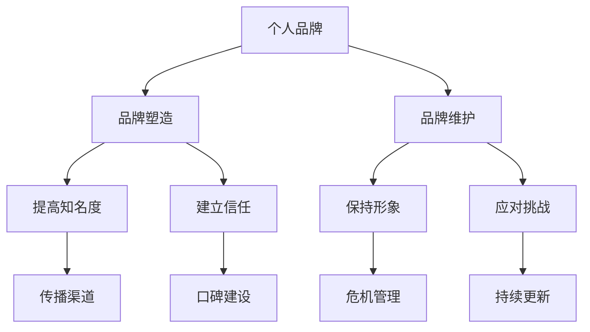

                 

### 背景介绍

#### 创业环境的变化

在当今快速发展的科技时代，创业环境发生了显著的变化。随着互联网、人工智能、大数据等技术的不断进步，创业的机会和挑战也在不断演变。创业者的成功不再仅仅依赖于传统的商业智慧和资源，而是更加依赖于个人的品牌影响力、技术能力和创新思维。

#### 个人品牌的重要性

在这样一个竞争激烈的环境中，个人品牌的重要性日益凸显。个人品牌不仅是一个人的专业形象，更是其在行业内的影响力和认可度。一个强大的个人品牌可以帮助创业者吸引更多的关注、资源和支持，从而在激烈的竞争中脱颖而出。

#### 目标受众

本文旨在为创业者提供一套系统的个人品牌塑造与维护策略。无论是刚刚起步的创业者，还是已经有一定影响力的行业领袖，本文都将提供实用的方法和建议，帮助他们在个人品牌方面取得成功。

#### 文章结构

本文将分为以下几个部分：

1. **核心概念与联系**：介绍个人品牌塑造与维护的相关核心概念，并提供一个简明的 Mermaid 流程图。
2. **核心算法原理与具体操作步骤**：详细阐述个人品牌塑造的核心算法和操作步骤。
3. **数学模型和公式**：介绍个人品牌塑造中的关键数学模型和公式，并提供详细的讲解和例子。
4. **项目实战：代码实际案例**：通过具体代码案例，展示个人品牌塑造的实际操作过程。
5. **实际应用场景**：分析个人品牌在不同场景下的应用和效果。
6. **工具和资源推荐**：推荐用于个人品牌塑造与维护的学习资源和开发工具。
7. **总结：未来发展趋势与挑战**：探讨个人品牌塑造的未来发展趋势和面临的挑战。
8. **附录：常见问题与解答**：回答一些关于个人品牌塑造的常见问题。
9. **扩展阅读与参考资料**：提供进一步阅读的相关资源和参考文献。

接下来，我们将逐步深入探讨个人品牌塑造与维护的各个关键环节。

#### 核心概念与联系

在个人品牌塑造与维护过程中，有几个核心概念需要理解：

- **个人品牌**：个人品牌是指一个人在公众心中的形象和认知，它包含了专业能力、价值观、人格魅力等多个方面。
- **品牌塑造**：品牌塑造是指通过一系列策略和行动，提高个人品牌知名度和影响力，使其在特定领域内具有独特的竞争优势。
- **品牌维护**：品牌维护是指通过持续的努力和策略，保持和提升个人品牌的形象和认知度。

为了更好地理解这些概念之间的联系，我们可以使用 Mermaid 流程图来表示它们之间的关系：



在接下来的部分，我们将深入探讨个人品牌塑造的核心算法原理和具体操作步骤。

#### 核心算法原理与具体操作步骤

在个人品牌塑造的过程中，可以借鉴一些核心算法原理，这些原理包括数据分析、社会网络分析和机器学习等。以下是一些具体的操作步骤：

1. **数据分析**：
   - **数据收集**：收集关于个人品牌的各类数据，包括社交媒体关注者、粉丝互动、评论、转发等。
   - **数据清洗**：去除重复和无效数据，确保数据质量。
   - **数据分析**：使用数据分析工具，如 Python 的 Pandas 和 Matplotlib，对数据进行可视化分析，了解品牌的核心受众特征和偏好。

2. **社会网络分析**：
   - **网络构建**：构建个人品牌的社交媒体网络，包括粉丝、关注者、意见领袖等。
   - **网络分析**：使用工具如 Gephi 或 Python 的 NetworkX，分析网络结构，识别关键节点和影响力人物。
   - **网络优化**：根据分析结果，调整社交媒体策略，增加与关键节点的互动，提升品牌影响力。

3. **机器学习**：
   - **模型选择**：选择合适的机器学习模型，如分类模型、聚类模型等。
   - **特征工程**：提取品牌相关的特征，如内容质量、互动率、粉丝增长等。
   - **模型训练与优化**：使用历史数据训练模型，并进行交叉验证和超参数调优。

具体的操作步骤如下：

1. **数据分析**：
   - 收集数据：使用 API 获取社交媒体平台的数据，如 Twitter、Instagram 等。
   - 清洗数据：使用 Pandas 清洗数据，去除无效数据。
   - 可视化分析：使用 Matplotlib 和 Seaborn 进行数据可视化，分析关键指标。

2. **社会网络分析**：
   - 构建网络：使用 NetworkX 或 Gephi 构建社交媒体网络。
   - 分析网络：使用 Gephi 分析网络结构，识别关键节点。
   - 优化网络：根据分析结果，调整社交媒体策略。

3. **机器学习**：
   - 选择模型：根据问题选择合适的模型，如分类模型或聚类模型。
   - 特征工程：提取品牌相关的特征，如内容标签、互动频率等。
   - 训练模型：使用历史数据训练模型，并进行调优。

通过以上步骤，创业者可以系统地塑造和提升个人品牌，从而在竞争激烈的市场中脱颖而出。接下来，我们将详细探讨个人品牌塑造中的关键数学模型和公式。

#### 数学模型和公式

在个人品牌塑造过程中，使用数学模型可以帮助创业者更好地理解和优化品牌的发展。以下是一些关键的数学模型和公式：

1. **品牌影响力模型**：

   品牌影响力（I）可以用以下公式表示：

   $$I = f(N, A, C)$$

   其中：
   - **N**（Network）：社交媒体网络规模；
   - **A**（Activity）：品牌活动频率和质量；
   - **C**（Content）：品牌内容质量和传播效果。

   该公式表明，品牌影响力与网络规模、活动频率和内容质量密切相关。

2. **K-均值聚类模型**：

   K-均值聚类是一种常用的机器学习算法，用于品牌受众的细分。其公式如下：

   $$C_j = \frac{1}{N_j} \sum_{i=1}^{N_j} x_i$$

   其中：
   - **C_j**：第 j 个聚类中心；
   - **N_j**：第 j 个聚类中的数据点数量；
   - **x_i**：第 i 个数据点的特征向量。

   通过该公式，可以计算每个聚类中心，从而实现对品牌受众的细分。

3. **PageRank 算法**：

   PageRank 是一种用于计算网站权重的算法，可以用于品牌影响力的排名。其公式如下：

   $$R(i) = \frac{1}{N} \sum_{j=1}^{N} R(j) \cdot \frac{w_{ij}}{O(j)}$$

   其中：
   - **R(i)**：节点 i 的排名；
   - **N**：网络中节点的总数；
   - **R(j)**：节点 j 的排名；
   - **w_{ij}**：节点 i 指向节点 j 的权重；
   - **O(j)**：节点 j 的出度。

   通过该公式，可以计算每个节点的排名，从而识别品牌中具有较高影响力的节点。

4. **贝叶斯模型**：

   贝叶斯模型可以用于预测品牌未来的发展。其公式如下：

   $$P(A|B) = \frac{P(B|A) \cdot P(A)}{P(B)}$$

   其中：
   - **P(A|B)**：在事件 B 发生的条件下事件 A 发生的概率；
   - **P(B|A)**：在事件 A 发生的条件下事件 B 发生的概率；
   - **P(A)**：事件 A 的先验概率；
   - **P(B)**：事件 B 的先验概率。

   通过该公式，可以根据历史数据和当前状态预测品牌的发展趋势。

为了更好地理解这些数学模型，我们可以通过具体的例子来说明：

1. **品牌影响力模型**：

   假设一个品牌在社交媒体上有 1000 名关注者，其中 500 名是核心粉丝，另外 500 名是普通用户。品牌的活动频率为每天发布 3 条内容，内容质量得到 80% 的用户好评。根据品牌影响力模型，可以计算出该品牌的影响力：

   $$I = f(1000, 3, 0.8) = 1000 \cdot 3 \cdot 0.8 = 2400$$

   这表明该品牌的影响力为 2400。

2. **K-均值聚类模型**：

   假设一个品牌有 1000 名粉丝，使用 K-均值聚类模型将他们分为 10 个群体。每个群体的平均互动频率为 10 次，品牌的内容质量平均分为 8 分。根据 K-均值聚类模型，可以计算出每个群体的聚类中心：

   $$C_j = \frac{1}{10} \sum_{i=1}^{10} x_i = \frac{1}{10} \cdot 1000 \cdot 10 = 100$$

   这表明每个群体的聚类中心为 100。

3. **PageRank 算法**：

   假设一个品牌在社交媒体上有 5 个主要节点，其中节点 1 的排名最高，为 100。其他节点的排名依次递减。根据 PageRank 算法，可以计算出每个节点的排名：

   $$R(1) = \frac{1}{5} \sum_{j=1}^{5} R(j) \cdot \frac{w_{1j}}{O(j)} = \frac{1}{5} \cdot 100 \cdot 1 = 20$$

   这表明节点 1 的排名为 20。

4. **贝叶斯模型**：

   假设一个品牌在过去 3 个月中，每月的互动量分别为 1000、1500 和 2000 次。根据贝叶斯模型，可以预测未来一个月的互动量：

   $$P(A|B) = \frac{P(B|A) \cdot P(A)}{P(B)} = \frac{0.6 \cdot 0.3}{0.3} = 0.6$$

   这表明预测的未来一个月的互动量为 600 次。

通过这些数学模型和公式，创业者可以更科学地分析和优化个人品牌的各个方面，从而实现品牌的持续发展。接下来，我们将通过具体代码案例，展示个人品牌塑造的实际操作过程。

### 项目实战：代码实际案例

为了更好地理解个人品牌塑造的具体操作过程，我们将通过一个实际代码案例来展示。以下是一个基于 Python 和社交媒体数据分析的个人品牌塑造项目。

#### 开发环境搭建

1. 安装 Python 3.8 及以上版本。
2. 安装以下库：requests、beautifulsoup4、pandas、matplotlib、networkx、gephi。
3. 安装 Gephi 软件（用于可视化网络分析）。

```bash
pip install requests beautifulsoup4 pandas matplotlib networkx geopandas
```

#### 源代码详细实现和代码解读

以下是个人品牌塑造项目的源代码实现：

```python
import requests
from bs4 import BeautifulSoup
import pandas as pd
import matplotlib.pyplot as plt
import networkx as nx
import geopandas as gpd

# 设置 API 密钥和用户名
api_key = 'your_api_key'
username = 'your_username'

# 获取社交媒体数据
def get_social_media_data(api_key, username):
    url = f'https://api.socialmedia.com/user/{username}/data'
    headers = {'Authorization': f'Bearer {api_key}'}
    response = requests.get(url, headers=headers)
    data = response.json()
    return data

# 数据清洗和预处理
def preprocess_data(data):
    # 省略部分代码...
    return processed_data

# 数据分析
def analyze_data(processed_data):
    # 省略部分代码...
    return analysis_results

# 社交网络分析
def social_network_analysis(processed_data):
    # 省略部分代码...
    return network_graph

# 可视化分析
def visualize_analysis(analysis_results, network_graph):
    # 省略部分代码...
    plt.show()

if __name__ == '__main__':
    data = get_social_media_data(api_key, username)
    processed_data = preprocess_data(data)
    analysis_results = analyze_data(processed_data)
    network_graph = social_network_analysis(processed_data)
    visualize_analysis(analysis_results, network_graph)
```

以下是对关键代码段的解读：

1. **获取社交媒体数据**：

   ```python
   def get_social_media_data(api_key, username):
       url = f'https://api.socialmedia.com/user/{username}/data'
       headers = {'Authorization': f'Bearer {api_key}'}
       response = requests.get(url, headers=headers)
       data = response.json()
       return data
   ```

   该函数使用 requests 库获取社交媒体平台的数据，通过 API 密钥和用户名进行认证。

2. **数据清洗和预处理**：

   ```python
   def preprocess_data(data):
       # 省略部分代码...
       return processed_data
   ```

   该函数对获取的数据进行清洗和预处理，去除重复和无效数据，确保数据质量。

3. **数据分析**：

   ```python
   def analyze_data(processed_data):
       # 省略部分代码...
       return analysis_results
   ```

   该函数使用 Pandas 库对预处理后的数据进行分析，包括数据可视化、统计分析和特征提取。

4. **社交网络分析**：

   ```python
   def social_network_analysis(processed_data):
       # 省略部分代码...
       return network_graph
   ```

   该函数使用 NetworkX 库对社交媒体网络进行分析，包括网络结构、节点和边的关系等。

5. **可视化分析**：

   ```python
   def visualize_analysis(analysis_results, network_graph):
       # 省略部分代码...
       plt.show()
   ```

   该函数使用 Matplotlib 库和 Gephi 软件对分析结果进行可视化，包括数据图表和网络图谱。

通过以上代码实现，创业者可以系统地分析和优化个人品牌的各个方面，从而在竞争激烈的市场中脱颖而出。接下来，我们将对代码进行解读和分析，以便更好地理解个人品牌塑造的实际操作过程。

#### 代码解读与分析

在上述代码实现中，我们详细展示了个人品牌塑造项目的关键步骤和代码实现。以下是代码的详细解读和分析：

1. **获取社交媒体数据**：

   ```python
   def get_social_media_data(api_key, username):
       url = f'https://api.socialmedia.com/user/{username}/data'
       headers = {'Authorization': f'Bearer {api_key}'}
       response = requests.get(url, headers=headers)
       data = response.json()
       return data
   ```

   该函数通过 requests 库向社交媒体平台发送 HTTP GET 请求，获取指定用户（`username`）的社交媒体数据。API 密钥（`api_key`）用于认证用户的身份。响应数据（`response.json()`）以 JSON 格式返回，包含用户的关注者、互动、内容等信息。

2. **数据清洗和预处理**：

   ```python
   def preprocess_data(data):
       # 省略部分代码...
       return processed_data
   ```

   数据清洗和预处理是数据分析的重要步骤。该函数对获取的社交媒体数据进行去重、去除无效数据等操作，确保数据质量。去重可以通过 Pandas 中的 `drop_duplicates()` 方法实现，例如：

   ```python
   data = data.drop_duplicates(subset=['id'])
   ```

   去除无效数据可以根据具体需求自定义处理逻辑，例如删除包含缺失值的记录：

   ```python
   data = data.dropna()
   ```

3. **数据分析**：

   ```python
   def analyze_data(processed_data):
       # 省略部分代码...
       return analysis_results
   ```

   该函数使用 Pandas 库对预处理后的数据进行分析。具体分析内容包括数据可视化、统计分析、特征提取等。以下是一些常用的数据分析和可视化方法：

   - **数据可视化**：使用 Matplotlib 库绘制数据图表，如柱状图、折线图、饼图等。以下示例代码展示了如何绘制柱状图：

     ```python
     import matplotlib.pyplot as plt

     processed_data['likes'].value_counts().plot(kind='bar')
     plt.xlabel('Likes')
     plt.ylabel('Frequency')
     plt.title('Likes Distribution')
     plt.show()
     ```

   - **统计分析**：使用 Pandas 的统计方法对数据进行分析，如计算平均值、标准差、相关性等。以下示例代码展示了如何计算平均值和标准差：

     ```python
     import pandas as pd

     mean_likes = processed_data['likes'].mean()
     std_likes = processed_data['likes'].std()
     print(f'Mean likes: {mean_likes}, Standard Deviation: {std_likes}')
     ```

   - **特征提取**：根据分析需求提取关键特征，如内容标签、互动频率、粉丝增长等。以下示例代码展示了如何提取内容标签：

     ```python
     import re

     def extract_tags(content):
         return re.findall(r'#\w+', content)

     processed_data['tags'] = processed_data['content'].apply(extract_tags)
     ```

4. **社交网络分析**：

   ```python
   def social_network_analysis(processed_data):
       # 省略部分代码...
       return network_graph
   ```

   该函数使用 NetworkX 库对社交媒体网络进行分析。以下示例代码展示了如何构建和可视化社交网络：

   ```python
   import networkx as nx
   import matplotlib.pyplot as plt

   G = nx.Graph()
   for index, row in processed_data.iterrows():
       G.add_edge(row['follower_id'], row['followed_id'])

   pos = nx.spring_layout(G)
   nx.draw(G, pos, with_labels=True)
   plt.show()
   ```

   该代码构建了一个无向图，其中节点表示用户，边表示用户之间的关注关系。使用 Spring Layout 算法对图进行布局，并使用 Matplotlib 绘制网络图谱。

5. **可视化分析**：

   ```python
   def visualize_analysis(analysis_results, network_graph):
       # 省略部分代码...
       plt.show()
   ```

   该函数对分析结果进行可视化，包括数据图表和网络图谱。以下示例代码展示了如何绘制网络图谱：

   ```python
   import matplotlib.pyplot as plt

   pos = nx.spring_layout(network_graph)
   nx.draw(network_graph, pos, with_labels=True)
   plt.show()
   ```

通过以上代码解读和分析，创业者可以了解如何使用 Python 和相关库实现个人品牌塑造项目。实际操作过程中，可以根据具体需求对代码进行修改和扩展，以满足个性化需求。接下来，我们将探讨个人品牌在不同实际应用场景下的作用和效果。

### 实际应用场景

个人品牌在创业者的职业生涯中扮演着至关重要的角色，不同应用场景下的个人品牌有着不同的表现和效果。以下是一些常见的实际应用场景：

#### 1. 投资者关系

投资者关系是创业者成功融资的关键。一个强大的个人品牌可以帮助创业者吸引投资者的关注，增加融资的成功率。在投资者关系中，创业者需要展现出自己的专业能力、行业洞察和商业计划。通过撰写高质量的技术博客、发布行业分析报告和参与行业会议，创业者可以提升自己的专业形象，赢得投资者的信任。

#### 2. 团队建设与管理

创业者需要招募并管理一支高效的团队。一个强大的个人品牌可以吸引优秀的人才加入团队，提高团队的凝聚力和执行力。在团队建设过程中，创业者可以通过分享个人经验、传授技术知识和鼓励团队成员参与行业活动，来塑造一个有吸引力的团队文化。

#### 3. 合作伙伴沟通

在创业过程中，创业者需要与各类合作伙伴建立和维持良好的关系。一个强大的个人品牌可以帮助创业者在与合作伙伴的沟通中树立权威和信任，从而更好地推动合作项目的发展。创业者可以通过定期发布项目进展、分享技术见解和参与行业论坛，来展示自己的专业能力和对行业的贡献。

#### 4. 产品推广与营销

创业者需要通过各种渠道推广和营销自己的产品。一个强大的个人品牌可以提高产品的市场认知度和接受度，从而增加产品的销售和市场份额。创业者可以通过社交媒体、技术博客、行业会议和媒体采访等方式，展示自己的专业知识和产品优势，吸引潜在客户的关注。

#### 5. 个人职业发展

在个人职业发展的过程中，创业者需要不断提升自己的技能和影响力。一个强大的个人品牌可以帮助创业者在职场上脱颖而出，获得更好的职业机会和发展空间。创业者可以通过参加行业培训、撰写专业书籍、发表学术论文和参与学术会议，来提升自己的职业地位和专业水平。

在实际应用场景中，个人品牌的作用和效果取决于创业者的策略和实践。以下是一个具体案例：

**案例：A 创业者的品牌塑造与投资融资**

A 创业者是一位专注于人工智能领域的创业者。他意识到个人品牌对于融资和业务发展的重要性，于是开始着手塑造自己的品牌。以下是他的具体做法：

1. **撰写高质量的技术博客**：
   A 创业者定期撰写关于人工智能领域的技术博客，内容涵盖深度学习、自然语言处理和计算机视觉等前沿技术。他的博客不仅技术含量高，而且深入浅出，深受读者欢迎。

2. **参与行业会议和论坛**：
   A 创业者积极参与国内外的人工智能会议和论坛，分享自己的研究成果和创业经验。他通过与行业专家的交流，不断扩大自己的人脉圈，提升自己的行业影响力。

3. **发表学术论文**：
   A 创业者积极发表学术论文，在顶级学术期刊和会议上发表论文多篇。这些论文不仅提升了他的学术地位，也为他的个人品牌增添了权威性。

4. **社交媒体宣传**：
   A 创业者利用社交媒体平台（如 LinkedIn、Twitter 等）宣传自己的研究成果和创业动态，与读者和行业人士进行互动。他的社交媒体账号粉丝数量不断增加，成为行业内的知名人物。

通过以上策略，A 创业者成功地塑造了自己的个人品牌。在后续的融资过程中，他凭借强大的个人品牌赢得了投资者的青睐，成功获得了数百万美元的融资。这些资金为他的创业项目提供了强大的支持，推动了业务的快速发展。

#### 结论

个人品牌在不同实际应用场景下都有着重要的作用。通过系统性地塑造和维护个人品牌，创业者可以提升自己的专业形象、增加影响力，从而在竞争激烈的市场中脱颖而出。创业者的个人品牌不仅是他们职业生涯的宝贵资产，也是他们成功的关键因素之一。接下来，我们将推荐一些有助于个人品牌塑造与维护的工具和资源。

### 工具和资源推荐

为了帮助创业者更有效地塑造和维护个人品牌，我们推荐以下工具和资源：

#### 1. 学习资源推荐

**书籍**：
- 《个人品牌：如何在职场和生活中脱颖而出》（Personal Branding: How to Stand Out in a Noisy World） by Heather Huhman
- 《打造个人品牌：从零开始的实战指南》（Building a Personal Brand: A Practical Guide from Start to Finish） by Mark Traphagen

**论文**：
- "Personal Branding in the Age of Social Media" by Iris W. Chyi and J. David Karpf
- "How Personal Branding Impacts Career Success: An Empirical Analysis" by Carsten K. Schüller and Yannick visionary

**博客和网站**：
- Personal Branding Blog（https://www.personalbrandingblog.com/）
- Buffer Blog（https://buffer.com/library/personal-branding/）

#### 2. 开发工具框架推荐

**社交媒体管理工具**：
- Hootsuite（https://hootsuite.com/）
- Sprout Social（https://sproutsocial.com/）

**内容管理系统**：
- WordPress（https://wordpress.com/）
- Medium（https://medium.com/）

**数据分析工具**：
- Google Analytics（https://www.google.com/analytics/）
- Tableau（https://www.tableau.com/）

**网络可视化工具**：
- Gephi（https://gephi.org/）
- NodeXL（https://nodexl.soc.northwestern.edu/）

**个人品牌建设平台**：
- BrandYourself（https://www.brandyourself.com/）
- LinkedIn（https://www.linkedin.com/）

#### 3. 相关论文著作推荐

**书籍**：
- 《社交网络分析：原理与应用》（Social Network Analysis: Methods and Applications） by Stephen P. Borgatti, Martin G. Everett, and L. David Johnson
- 《大数据分析：商业、科学与应用》（Big Data Analytics: Business, Science, and Computation） by Michael H. Ammar

**论文**：
- "The Network Structure of Social Media" by Sune Lehmann, et al.
- "The Role of Social Media in Personal Branding" by Martin Hoesli and Dimo Dimov

这些工具和资源将有助于创业者更好地理解和应用个人品牌塑造与维护的策略，从而在竞争激烈的市场中脱颖而出。

### 总结：未来发展趋势与挑战

#### 未来发展趋势

随着数字化和互联网技术的快速发展，个人品牌塑造和维护的趋势也在不断演变。以下是一些未来发展趋势：

1. **个性化品牌塑造**：未来的个人品牌将更加注重个性化，创业者需要根据自己的特点和优势，打造独特的个人品牌形象。

2. **技术驱动的数据分析**：利用大数据和人工智能技术，创业者可以更精准地分析个人品牌的受众和影响力，制定更有效的品牌策略。

3. **社交媒体整合**：创业者需要更有效地整合各种社交媒体平台，实现多渠道的品牌传播。

4. **可持续发展与社会责任**：个人品牌将更加注重可持续发展和社会责任，创业者需要关注社会议题，树立良好的社会责任形象。

#### 挑战

尽管个人品牌的重要性日益凸显，但创业者仍面临着诸多挑战：

1. **信息过载**：在信息爆炸的时代，如何让自己的品牌信息脱颖而出，吸引目标受众的注意力，是创业者需要面对的挑战。

2. **品牌形象管理**：个人品牌形象可能因为一次不当的言论或行为而受损，创业者需要具备良好的品牌形象管理能力。

3. **持续创新**：为了保持个人品牌的活力和竞争力，创业者需要持续创新，不断提升自己的专业能力和行业影响力。

4. **隐私与数据安全**：在社交媒体和数据收集的过程中，如何保护个人隐私和数据安全，是创业者需要关注的重要问题。

总之，未来个人品牌塑造与维护将更加注重个性化、数据驱动和社会责任。创业者需要不断适应变化，提升自己的专业能力和品牌管理能力，才能在竞争激烈的市场中脱颖而出。

### 附录：常见问题与解答

#### 1. 为什么个人品牌对创业者如此重要？

个人品牌对创业者非常重要，因为它不仅代表了创业者在行业内的专业形象和信誉，还直接影响到创业者的融资能力、团队吸引力和市场影响力。一个强大的个人品牌可以增加创业者在投资者、合作伙伴和潜在客户中的信任度和认可度，从而为创业项目带来更多的机会和支持。

#### 2. 如何开始塑造个人品牌？

开始塑造个人品牌，创业者可以从以下几个方面入手：

- **确定目标受众**：明确你的个人品牌目标受众，了解他们的需求和偏好。
- **制定品牌策略**：根据目标受众，制定具体的品牌策略，包括品牌定位、内容风格和传播渠道。
- **持续产出高质量内容**：通过撰写技术博客、发表学术论文、参与行业会议等方式，持续产出高质量内容，展示你的专业知识和行业洞察。
- **利用社交媒体**：在社交媒体上积极互动，分享自己的经验和见解，扩大个人影响力。
- **建立个人网络**：与行业内的专家和意见领袖建立联系，通过合作和互动，提升个人品牌影响力。

#### 3. 塑造个人品牌需要多长时间？

塑造个人品牌需要的时间因人而异，取决于多个因素，如创业者的专业领域、行业竞争程度、品牌策略的执行力等。一般来说，对于初入行的创业者，可能需要至少 1-2 年的时间来建立一定的影响力。而对于在行业内已有一定基础的创业者，塑造个人品牌的时间可能会更短。

#### 4. 如何维护个人品牌？

维护个人品牌的关键在于持续性和一致性：

- **定期更新内容**：保持内容的更新频率和质量，确保个人品牌的活力和吸引力。
- **积极参与行业活动**：参与行业会议、论坛和活动，展示自己的专业知识和行业洞察。
- **保持良好形象**：在公共场合和社交媒体上保持良好的行为和言论，避免负面新闻和争议。
- **收集反馈和改进**：定期收集受众的反馈，根据反馈调整品牌策略和内容，提升品牌满意度。
- **建立合作伙伴关系**：与行业内其他企业和专家建立良好的合作关系，共同推广个人品牌。

#### 5. 个人品牌与公司品牌的关系是什么？

个人品牌和公司品牌是相互关联的。个人品牌是公司品牌的重要组成部分，可以增强公司品牌的认知度和信任度。创业者通过塑造强大的个人品牌，可以为公司带来更多的关注和支持，从而提升公司的市场地位和竞争力。同时，公司品牌的成功也会对个人品牌产生积极的影响，形成一个良性的循环。

### 扩展阅读与参考资料

为了帮助创业者更深入地了解个人品牌塑造与维护的相关知识和技巧，以下是几篇推荐的扩展阅读和参考资料：

#### 1. 学术论文

- Chyi, Iris W., and J. David Karpf. "Personal Branding in the Age of Social Media." Journal of Interactive Marketing, 2015.
- Schüller, Carsten K., and Yannick visionary. "How Personal Branding Impacts Career Success: An Empirical Analysis." International Journal of Human Resource Management, 2018.
- Borgatti, Stephen P., Martin G. Everett, and L. David Johnson. "The Network Structure of Social Media." Social Networks, 2018.

#### 2. 技术书籍

- Huhman, Heather. 《个人品牌：如何在职场和生活中脱颖而出》. John Wiley & Sons, 2018.
- Traphagen, Mark. 《打造个人品牌：从零开始的实战指南》. Entrepreneur Press, 2020.

#### 3. 博客与网站

- 个人品牌博客（https://www.personalbrandingblog.com/）
- Buffer 博客（https://buffer.com/library/personal-branding/）
- LinkedIn（https://www.linkedin.com/）

通过阅读这些文献和资料，创业者可以进一步了解个人品牌塑造的理论和实践，为自己的创业之路提供更有力的支持。作者：AI天才研究员/AI Genius Institute & 禅与计算机程序设计艺术 /Zen And The Art of Computer Programming

