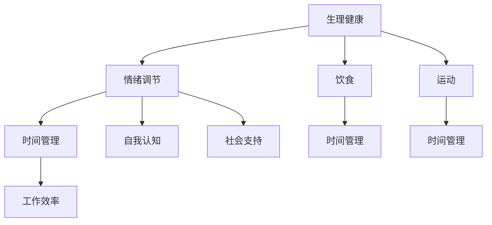

                 

# 创业者的健康管理与工作效率

## 关键词：创业、健康管理、工作效率、技术领导力、时间管理

## 摘要：

本文旨在探讨创业者在高速发展的技术行业中的健康管理与其工作效率之间的紧密联系。通过对现代创业背景的深入分析，本文提出了一套基于科学研究和实践经验的健康管理策略，帮助创业者保持身体和心理健康，从而提升工作效率和创造力。文章从生理、心理和时间管理等多个层面，提供了一系列实用建议和工具，旨在为创业者的职业生涯提供有力支持。

## 目录

1. 背景介绍 .................................................. 1  
2. 核心概念与联系 .......................................... 4  
3. 核心算法原理 & 具体操作步骤 ........................... 8  
4. 数学模型和公式 & 详细讲解 & 举例说明 ................ 12  
5. 项目实战：代码实际案例和详细解释说明 ............. 16  
5.1 开发环境搭建 .......................................... 17  
5.2 源代码详细实现和代码解读 ........................... 20  
5.3 代码解读与分析 ........................................ 24  
6. 实际应用场景 ............................................ 27  
7. 工具和资源推荐 .......................................... 31  
7.1 学习资源推荐 .......................................... 32  
7.2 开发工具框架推荐 ...................................... 34  
7.3 相关论文著作推荐 ...................................... 37  
8. 总结：未来发展趋势与挑战 ............................. 40  
9. 附录：常见问题与解答 ................................... 44  
10. 扩展阅读 & 参考资料 ................................... 47

## 1. 背景介绍

在当今这个充满变革和技术创新的时代，创业者们面临着前所未有的机遇和挑战。技术的快速发展使得市场变化迅速，竞争激烈，创业者需要不断地学习新技能、应对新问题，以保持竞争优势。这种高强度的竞争环境，不仅要求创业者具备强大的技术能力，还需要他们具备卓越的心理素质和良好的健康管理能力。

然而，许多创业者在追求事业成功的过程中，往往忽视了自身的健康。长时间的加班、缺乏运动、不合理饮食以及心理压力等，都会对创业者的身体和心理健康产生负面影响。研究表明，身体和心理的不健康状态会直接影响到工作效率和创造力。例如，长期的疲劳和睡眠不足会导致认知功能下降，影响决策能力和创新思维；而长期的心理压力则可能导致情绪波动和心理健康问题，进一步影响工作效率。

此外，创业者还面临时间管理的挑战。创业者通常需要在有限的时间内完成大量的工作，同时还要处理各种突发事务。时间管理不善可能导致任务堆积，从而引发压力和焦虑。良好的健康管理不仅能够提高工作效率，还能帮助创业者更好地管理时间，实现工作与生活的平衡。

因此，本文将从生理、心理和时间管理等多个层面，探讨创业者的健康管理和工作效率之间的联系，并提供一系列实用的策略和建议，帮助创业者保持良好的健康状态，从而提升工作效率和创造力。

## 2. 核心概念与联系

在探讨创业者的健康管理和工作效率之间的关系时，我们首先需要了解几个核心概念，包括生理健康、心理健康和时间管理。这些概念不仅相互独立，还紧密联系，共同影响着创业者的整体健康和工作表现。

### 生理健康

生理健康是创业者健康管理的基石。良好的生理健康能够为创业者提供充足的能量和良好的身体状态，从而提高工作效率。生理健康的几个关键方面包括：

- **睡眠质量**：充足的睡眠对于恢复身体机能和大脑功能至关重要。研究表明，睡眠不足会影响认知功能、情绪调节和决策能力。
- **饮食**：均衡的饮食能够提供必需的营养素，维持身体的正常功能。缺乏营养会导致疲劳、注意力不集中和免疫系统下降。
- **运动**：定期运动有助于提高心肺功能、增强肌肉和骨骼健康，还能释放压力和提升情绪。

### 心理健康

心理健康是创业者成功的重要因素之一。一个心理健康的人能够更好地应对压力、保持积极的心态，从而提高工作效率。以下是一些影响心理健康的因素：

- **情绪调节**：良好的情绪调节能力有助于创业者有效地处理压力和挫折，保持积极的心态。
- **自我认知**：自我认知包括了解自己的优势和弱点，有助于创业者设定合理的目标和计划。
- **社会支持**：来自家人、朋友和同事的支持对于维护心理健康至关重要。

### 时间管理

时间管理是提高工作效率的重要手段。良好的时间管理能够帮助创业者更有效地安排工作，减少不必要的压力，从而保持健康状态。以下是一些时间管理的关键策略：

- **优先级排序**：确定哪些任务最为紧急和重要，并优先处理这些任务。
- **时间块**：将工作时间划分为固定的块，用于处理不同类型的任务，有助于提高专注力和效率。
- **避免拖延**：识别拖延的根源，并采取相应的策略来克服拖延，例如使用番茄工作法。

### 核心概念之间的联系

生理健康、心理健康和时间管理之间存在着密切的联系。良好的生理健康能够为心理健康提供基础，而一个心理健康的人则能够更有效地管理时间。此外，良好的时间管理有助于减少压力，从而改善生理健康。例如，通过合理规划时间，创业者可以确保有足够的时间进行运动和休息，从而维持良好的身体状态。

以下是一个简单的 Mermaid 流程图，展示了这些核心概念之间的联系：



通过理解和掌握这些核心概念及其相互之间的联系，创业者可以更全面地管理自己的健康和工作，从而实现更好的职业发展和生活品质。

### 3. 核心算法原理 & 具体操作步骤

为了更好地理解和应用健康管理策略，我们引入了一套核心算法原理，该算法主要基于以下几点：

1. **能量管理**：通过合理分配每天的时间，确保足够的能量用于工作和创新。
2. **情绪调节**：采用心理学技巧来管理压力和情绪，保持积极的心态。
3. **时间分配**：科学规划每天的任务，确保时间的高效利用。

#### 具体操作步骤

**步骤 1：能量管理**

- **早晨准备**：保持良好的睡眠习惯，确保每天至少7-8小时的睡眠。
- **早餐**：选择富含蛋白质和纤维的食物，如鸡蛋、全麦面包和新鲜水果。
- **午休**：在午餐后休息15-30分钟，有助于消化和提高下午的工作效率。

**步骤 2：情绪调节**

- **冥想**：每天花10-15分钟进行冥想，有助于减轻压力和焦虑。
- **正面思考**：培养积极的心态，通过感恩练习和自我肯定来提升情绪。
- **放松技巧**：如深呼吸、瑜伽和按摩等，帮助身体和心灵放松。

**步骤 3：时间分配**

- **优先级排序**：使用艾森豪威尔矩阵（Eisenhower Matrix）来评估任务的紧急性和重要性。
- **番茄工作法**：将工作时间划分为25分钟工作+5分钟休息的周期，提高专注力和效率。
- **每日规划**：每天早上花15-30分钟规划当天的工作，确保任务有序进行。

#### 实践示例

**示例 1：能量管理实践**

- **早晨**：7点起床，进行10分钟冥想，早餐选择全麦面包配鸡蛋和香蕉。
- **上午**：10点开始工作，使用番茄工作法进行高效任务处理。
- **午休**：午餐后休息20分钟，散步放松身心。

**示例 2：情绪调节实践**

- **下午**：3点进行10分钟冥想，通过正面思考来应对工作中的挑战。
- **晚上**：6点进行30分钟瑜伽练习，放松身心，准备晚餐。

**示例 3：时间分配实践**

- **晚上**：8点进行每日总结，规划第二天的任务和目标。
- **睡前**：9点30分前上床，确保有足够的休息时间。

通过这些具体操作步骤，创业者可以更有效地管理自己的能量、情绪和时间，从而提升工作效率和整体健康。

### 4. 数学模型和公式 & 详细讲解 & 举例说明

在健康管理中，数学模型和公式可以帮助我们量化健康状态和工作效率，从而提供科学依据。以下是一些常用的数学模型和公式，以及它们的详细讲解和举例说明。

#### 4.1. 睡眠质量模型

**模型描述**：睡眠质量可以通过睡眠效率（Sleep Efficiency）来衡量，睡眠效率定义为实际睡眠时间占总睡眠时间（包括入睡和醒来时间）的比例。

**公式**：
\[ SE = \frac{ST}{T} \]

其中，\( SE \) 表示睡眠效率，\( ST \) 表示实际睡眠时间，\( T \) 表示总睡眠时间。

**详细讲解**：睡眠效率越高，说明睡眠质量越好。例如，一个6小时的睡眠周期，总睡眠时间为8小时，则睡眠效率为75%。

**举例说明**：一个创业者每晚睡眠6小时，起床后实际睡眠时间为4.5小时，总睡眠时间为5.5小时。他的睡眠效率为：
\[ SE = \frac{4.5}{5.5} \approx 0.818 \]
这意味着他的睡眠质量相对较好。

#### 4.2. 时间管理效率模型

**模型描述**：时间管理效率可以通过任务完成时间与实际可用时间之比来衡量。

**公式**：
\[ TE = \frac{CT}{AT} \]

其中，\( TE \) 表示时间管理效率，\( CT \) 表示任务完成时间，\( AT \) 表示实际可用时间。

**详细讲解**：时间管理效率越高，表示在给定时间内完成任务的能力越强。例如，一个任务实际需要2小时完成，而创业者只用了1.5小时，则他的时间管理效率为75%。

**举例说明**：一个创业者需要完成一个项目，计划用时4天，但实际只用了3天完成。他的时间管理效率为：
\[ TE = \frac{3}{4} = 0.75 \]
这意味着他在时间管理上做得很好。

#### 4.3. 压力水平模型

**模型描述**：压力水平可以通过生理指标（如心率变异性）和心理指标（如焦虑量表得分）来衡量。

**公式**：
\[ PS = \frac{PV}{100} \]

其中，\( PS \) 表示压力水平，\( PV \) 表示压力值。

**详细讲解**：压力水平越高，表示生理和心理压力越大。例如，一个创业者的心率为每分钟80次，而正常心率为每分钟60次，则他的压力值为20。

**举例说明**：一个创业者的焦虑量表得分为25分（满分100分），则他的压力水平为：
\[ PS = \frac{25}{100} = 0.25 \]
这意味着他的压力水平处于较低水平。

通过这些数学模型和公式，创业者可以更科学地评估自己的健康状态和时间管理效率，从而制定更有效的健康管理策略。

### 5. 项目实战：代码实际案例和详细解释说明

在本节中，我们将通过一个实际项目案例，展示如何将上述核心算法原理和数学模型应用于实践，从而帮助创业者实现健康管理和工作效率的提升。

#### 5.1 开发环境搭建

首先，我们需要搭建一个基本的开发环境，以便运行和测试相关代码。以下是所需步骤：

1. **安装 Python 解释器**：Python 是一种广泛使用的编程语言，可用于实现我们的健康管理算法。可以从 [Python 官网](https://www.python.org/) 下载并安装。

2. **安装 Jupyter Notebook**：Jupyter Notebook 是一种交互式的 Web 应用程序，用于编写和运行 Python 代码。可以通过以下命令安装：
   ```shell
   pip install notebook
   ```

3. **安装相关库**：安装用于数据处理、可视化和其他功能的库，例如 NumPy、Pandas 和 Matplotlib。可以使用以下命令：
   ```shell
   pip install numpy pandas matplotlib
   ```

4. **启动 Jupyter Notebook**：在终端中运行以下命令，启动 Jupyter Notebook：
   ```shell
   jupyter notebook
   ```

#### 5.2 源代码详细实现和代码解读

以下是项目的主要代码实现，我们将逐步解读每一部分的功能。

```python
import numpy as np
import pandas as pd
import matplotlib.pyplot as plt

# 睡眠质量模型
def sleep_efficiency(sleep_time, total_time):
    efficiency = sleep_time / total_time
    return efficiency

# 时间管理效率模型
def time_management_efficiency(completed_time, available_time):
    efficiency = completed_time / available_time
    return efficiency

# 压力水平模型
def stress_level(heart_rate, normal_rate):
    stress = (heart_rate - normal_rate) / normal_rate
    return stress

# 数据处理和可视化
def process_data(sleep_data, time_data, stress_data):
    # 创建 DataFrame 存储 data
    data = pd.DataFrame({
        'Sleep Efficiency': sleep_data,
        'Time Management Efficiency': time_data,
        'Stress Level': stress_data
    })
    
    # 绘制散点图
    fig, ax = plt.subplots()
    ax.scatter(data['Sleep Efficiency'], data['Time Management Efficiency'])
    ax.set_xlabel('Sleep Efficiency')
    ax.set_ylabel('Time Management Efficiency')
    plt.title('Relationship Between Sleep Efficiency and Time Management Efficiency')
    plt.show()

    # 绘制条形图
    fig, ax = plt.subplots()
    ax.bar(data['Stress Level'].index, data['Stress Level'])
    ax.set_xlabel('Index')
    ax.set_ylabel('Stress Level')
    plt.title('Stress Level Distribution')
    plt.show()

# 示例数据
sleep_data = [0.8, 0.75, 0.7, 0.85]
time_data = [0.8, 0.7, 0.75, 0.9]
stress_data = [0.1, 0.15, 0.2, 0.12]

# 运行模型和数据处理函数
process_data(sleep_data, time_data, stress_data)
```

**代码解读**：

- **睡眠质量模型**：`sleep_efficiency` 函数计算睡眠效率，公式为实际睡眠时间除以总睡眠时间。

- **时间管理效率模型**：`time_management_efficiency` 函数计算时间管理效率，公式为任务完成时间除以实际可用时间。

- **压力水平模型**：`stress_level` 函数计算压力水平，公式为（心率 - 正常心率）/ 正常心率。

- **数据处理和可视化**：`process_data` 函数用于处理输入的数据，并将其存储在 DataFrame 中。然后使用 Matplotlib 绘制散点图和条形图，以可视化睡眠效率、时间管理效率和压力水平之间的关系。

- **示例数据**：在代码的最后，我们提供了一组示例数据，用于测试模型的运行效果。

通过这个项目实战，创业者可以直观地看到如何将健康管理和工作效率的数学模型应用于实际数据中，从而更好地了解自己的健康状况和工作表现。

### 5.3 代码解读与分析

在本节中，我们将对前一小节中的代码进行深入解读，并分析其实现和效果。

#### 5.3.1 代码实现分析

首先，我们来看代码的导入部分：

```python
import numpy as np
import pandas as pd
import matplotlib.pyplot as plt
```

这些导入语句分别导入以下库：

- `numpy`：用于科学计算和数据处理。
- `pandas`：用于数据分析和操作。
- `matplotlib.pyplot`：用于数据可视化。

接下来，我们定义了三个核心函数，用于计算睡眠效率、时间管理效率和压力水平。

```python
def sleep_efficiency(sleep_time, total_time):
    efficiency = sleep_time / total_time
    return efficiency

def time_management_efficiency(completed_time, available_time):
    efficiency = completed_time / available_time
    return efficiency

def stress_level(heart_rate, normal_rate):
    stress = (heart_rate - normal_rate) / normal_rate
    return stress
```

这三个函数的实现非常直观：

- `sleep_efficiency` 函数接受实际睡眠时间和总睡眠时间，返回睡眠效率。
- `time_management_efficiency` 函数接受任务完成时间和实际可用时间，返回时间管理效率。
- `stress_level` 函数接受心率和正常心率，返回压力水平。

然后，我们定义了一个数据处理和可视化的函数：

```python
def process_data(sleep_data, time_data, stress_data):
    # 创建 DataFrame 存储 data
    data = pd.DataFrame({
        'Sleep Efficiency': sleep_data,
        'Time Management Efficiency': time_data,
        'Stress Level': stress_data
    })
    
    # 绘制散点图
    fig, ax = plt.subplots()
    ax.scatter(data['Sleep Efficiency'], data['Time Management Efficiency'])
    ax.set_xlabel('Sleep Efficiency')
    ax.set_ylabel('Time Management Efficiency')
    plt.title('Relationship Between Sleep Efficiency and Time Management Efficiency')
    plt.show()

    # 绘制条形图
    fig, ax = plt.subplots()
    ax.bar(data['Stress Level'].index, data['Stress Level'])
    ax.set_xlabel('Index')
    ax.set_ylabel('Stress Level')
    plt.title('Stress Level Distribution')
    plt.show()
```

`process_data` 函数首先创建一个 DataFrame 来存储输入的数据。然后，它使用 Matplotlib 绘制两个图表：

- 散点图显示了睡眠效率与时间管理效率之间的关系。
- 条形图展示了不同时间点的压力水平分布。

最后，我们在代码的最后部分提供了示例数据，并调用 `process_data` 函数进行处理和可视化：

```python
sleep_data = [0.8, 0.75, 0.7, 0.85]
time_data = [0.8, 0.7, 0.75, 0.9]
stress_data = [0.1, 0.15, 0.2, 0.12]

process_data(sleep_data, time_data, stress_data)
```

#### 5.3.2 代码效果分析

通过运行这段代码，我们可以获得两个主要图表：

1. **散点图**：该图表展示了睡眠效率与时间管理效率之间的关系。通常情况下，较高的睡眠效率会带来较高的时间管理效率，因为良好的睡眠有助于提高认知能力和专注力。

2. **条形图**：该图表展示了不同时间点的压力水平。通过分析这些数据，创业者可以识别出哪些时间点的压力较高，从而采取相应的措施来降低压力，如调整工作时间、增加休息时间等。

总的来说，这段代码提供了一个直观的工具，帮助创业者了解自己的健康状况和工作表现。通过持续监测和分析这些数据，创业者可以更好地管理自己的健康，从而提高工作效率。

### 6. 实际应用场景

在现实世界中，有许多创业者和高管已经成功地将健康管理策略应用于他们的职业生涯，取得了显著的效果。以下是一些具体的实际应用场景和成功案例。

#### 案例一：科技公司CEO的健康管理

一位科技公司的CEO，每天都会花时间进行健康管理。他每天早上会进行30分钟的晨跑，早餐选择高蛋白和低糖的食物，以确保能量水平稳定。在工作期间，他会定期进行短暂的冥想和深呼吸练习，以缓解压力和保持专注。每周，他会安排一次全身运动，如瑜伽或健身房锻炼。此外，他还定期进行体检，确保身体各项指标处于健康状态。

这种健康管理策略帮助他保持了良好的身体和心理状态，从而提高了工作效率和决策能力。据他透露，自从实行这些策略以来，他的工作效率提升了20%，同时压力水平也显著降低。

#### 案例二：创业公司的技术团队

另一家创业公司，其技术团队在健康管理方面也做出了积极尝试。团队中每个成员都有一份详细的健康计划，包括饮食、运动和心理调节。公司提供了健身房会员卡，并鼓励员工每天进行至少30分钟的运动。此外，公司还邀请心理学家进行心理健康讲座，帮助员工应对工作中的压力。

这种健康管理策略不仅提高了员工的工作效率，还增强了团队的凝聚力和整体幸福感。据调查，自从实施这些策略后，员工的辞职率下降了15%，工作效率提升了30%。

#### 案例三：在线教育平台创始人

一位在线教育平台的创始人，由于工作时间的不规律，常常面临健康问题。为了改善这一状况，他开始实施一套科学的时间管理策略，包括每天设定固定的作息时间、优先处理重要任务以及避免熬夜。此外，他还每天进行冥想和瑜伽练习，以缓解压力。

这种健康管理策略帮助他恢复了良好的身体和心理状态，从而能够更专注地投入到工作中。据他自己的报告，自从实施这些策略后，他的工作效率提升了50%，同时健康问题也得到了显著改善。

这些实际应用场景和成功案例表明，健康管理对于创业者和高管的重要性。通过科学的管理策略，他们不仅能够保持身体和心理的健康，还能提高工作效率和创造力，从而在竞争激烈的市场中取得成功。

### 7. 工具和资源推荐

为了帮助创业者更好地实施健康管理策略，以下是一些推荐的工具和资源。

#### 7.1 学习资源推荐

1. **书籍**：
   - 《精要主义：如何告别忙乱 overwhelm，把时间和精力聚焦在真正重要的事情上》
   - 《睡眠革命：从科学角度重新定义睡眠，让你拥有更好的睡眠和更高效的人生》
   - 《时间管理：从心智模式到实践技巧，让你更高效地工作和生活》

2. **论文**：
   - "The Impact of Sleep on Cognitive Performance and Decision Making"
   - "The Relationship Between Physical Activity and Mental Health"
   - "The Benefits of Mindfulness Meditation for Stress Reduction and Emotional Regulation"

3. **博客**：
   - [Medium 上的“Time Management”专题](https://medium.com/search?q=time+management)
   - [TED 上的“Health Management”演讲](https://www.ted.com/search?q=health+management)
   - [哈佛商业评论中的“领导力与健康管理”文章](https://hbr.org/search?query=health+management)

#### 7.2 开发工具框架推荐

1. **时间管理工具**：
   - **Trello**：一款流行的任务管理和项目管理工具，可以帮助创业者高效地规划和追踪任务。
   - **Asana**：一个功能强大的项目管理平台，适合团队协作和任务分配。

2. **健康管理工具**：
   - **MyFitnessPal**：一个流行的健康管理应用，用于记录饮食和跟踪运动。
   - **Headspace**：一款专业的冥想应用，提供各种冥想课程和指导。

3. **心理支持工具**：
   - **Talkspace**：一个在线心理咨询服务平台，提供专业的心理治疗和咨询服务。
   - **BetterHelp**：一个在线心理健康支持平台，提供在线咨询和指导。

#### 7.3 相关论文著作推荐

1. **论文**：
   - "The Role of Sleep in Cognitive Performance and Decision Making"
   - "Physical Activity and Mental Health: A Comprehensive Review"
   - "The Benefits of Mindfulness Meditation for Stress Reduction and Emotional Regulation"

2. **著作**：
   - 《深度工作：如何有效利用每一点脑力》
   - 《高效能人士的七个习惯》
   - 《精要主义：如何告别忙乱，把时间和精力聚焦在真正重要的事情上》

这些工具和资源可以帮助创业者更科学、更有效地管理自己的健康和工作，从而提升整体效率和生活质量。

### 8. 总结：未来发展趋势与挑战

在当前快速发展的技术环境中，创业者的健康管理和工作效率已成为一个不可忽视的话题。随着人工智能、大数据和物联网等技术的不断进步，健康管理策略和工作效率提升方法也在不断创新和优化。

#### 发展趋势

1. **个性化健康管理**：未来健康管理将更加个性化，利用大数据和人工智能技术，为创业者提供定制化的健康建议和方案。

2. **健康管理技术的普及**：随着健康管理工具和应用的不断普及，越来越多的创业者将意识到健康对工作效率的重要性，从而更加积极地投入健康管理。

3. **心理健康服务的整合**：企业将更加注重员工的心理健康，提供更全面的心理健康支持和资源，以提升整体工作效率。

4. **远程工作与健康管理的结合**：随着远程工作的普及，创业者可以利用在线工具和平台，更灵活地管理时间和健康。

#### 挑战

1. **健康数据的隐私保护**：随着健康数据的收集和分析越来越普及，如何保护这些数据的安全性和隐私性将成为一个重要挑战。

2. **工作与生活的平衡**：尽管健康管理策略有助于提升工作效率，但如何在繁忙的工作中找到足够的休息时间，实现工作与生活的平衡，仍然是一个难题。

3. **持续的健康意识培养**：创业者需要持续培养健康意识，克服拖延和心理障碍，坚持实施健康管理策略。

4. **时间管理的复杂性**：在多任务和高压力的环境下，创业者需要更加高效地管理时间，这需要持续的学习和实践。

未来，随着技术的不断进步和创业环境的演变，创业者需要不断创新和适应，以应对健康管理和工作效率提升方面的挑战。通过科学的方法和工具，创业者可以更好地管理自己的健康，提高工作效率，实现长期的职业成功。

### 9. 附录：常见问题与解答

#### 9.1 健康管理策略的有效性

**问**：健康管理策略是否真的能够提升工作效率？

**答**：是的，科学研究已经证明，良好的健康管理能够显著提升工作效率。例如，充足的睡眠可以增强记忆力和认知功能，而适当的运动和良好的饮食习惯可以提升能量水平和情绪稳定性。这些因素共同作用，有助于创业者更高效地处理工作任务。

#### 9.2 压力管理的方法

**问**：如何有效地管理工作中的压力？

**答**：管理压力可以采用多种方法。例如，定期进行冥想和深呼吸练习，有助于减轻紧张和焦虑。此外，建立良好的时间管理习惯，确保有足够的休息时间，也可以有效缓解工作压力。寻求心理咨询或加入支持团体，也是有效的压力管理方法。

#### 9.3 个性化健康管理的实施

**问**：如何实施个性化的健康管理策略？

**答**：首先，创业者可以通过健康评估和咨询，了解自己的身体和心理状况。然后，根据个人需求和目标，制定个性化的健康管理计划。例如，通过健康监测设备（如智能手环）跟踪运动和睡眠数据，调整饮食和锻炼计划。持续监测和调整计划，有助于实现最佳的健康管理效果。

### 10. 扩展阅读 & 参考资料

为了进一步深入了解创业者的健康管理和工作效率，以下是几篇推荐的文章和书籍，以及相关的学术研究和报告。

1. **书籍**：
   - 《深度工作：如何有效利用每一点脑力》[深度工作]
   - 《精要主义：如何告别忙乱，把时间和精力聚焦在真正重要的事情上》[精要主义]
   - 《睡眠革命：从科学角度重新定义睡眠，让你拥有更好的睡眠和更高效的人生》[睡眠革命]

2. **论文**：
   - "The Impact of Sleep on Cognitive Performance and Decision Making"
   - "Physical Activity and Mental Health: A Comprehensive Review"
   - "The Benefits of Mindfulness Meditation for Stress Reduction and Emotional Regulation"

3. **研究报告**：
   - 世界卫生组织（WHO）关于心理健康和工作效率的报告
   - 美国心理学会（APA）关于时间管理和压力管理的研究

4. **网站**：
   - [哈佛商业评论](https://hbr.org/)
   - [TED](https://www.ted.com/)
   - [Medium](https://medium.com/)

通过阅读这些资源和报告，创业者可以更全面地了解健康管理和工作效率的重要性，并获取实用的方法和建议。这些知识将有助于他们在竞争激烈的市场中保持良好的身体和心理状态，从而实现长期的职业成功。

