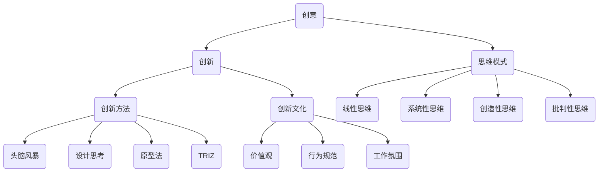

                 

### 背景介绍

#### 创业者面临的挑战与机遇

在当今快速变化和高度竞争的商业环境中，创业者们面临着诸多挑战。一方面，技术进步日新月异，新兴技术如人工智能、区块链、物联网等不断涌现，为创业提供了丰富的机遇。另一方面，市场竞争激烈，创业项目的成功往往需要独特的创意和创新的思维方式。因此，如何激发创新思维，找到创新的解决方案，成为创业者成功的关键。

本文旨在探讨创业者的创新思维与创意激发技巧，帮助创业者们更好地应对挑战，抓住机遇。我们将从以下几个方面展开讨论：

1. **核心概念与联系**：介绍创新思维的相关核心概念，并通过Mermaid流程图展示它们之间的联系。
2. **核心算法原理与操作步骤**：详细解析如何通过系统的方法论激发创新思维。
3. **数学模型与公式**：介绍用于评估创意价值的相关数学模型和公式，并举例说明。
4. **项目实战**：通过实际代码案例展示如何将创新思维应用于实践。
5. **实际应用场景**：探讨创新思维在创业中的具体应用场景。
6. **工具和资源推荐**：推荐学习资源、开发工具和框架。
7. **总结与未来趋势**：总结文章的主要内容，并展望未来发展趋势与挑战。
8. **常见问题与解答**：回答读者可能关心的问题。
9. **扩展阅读与参考资料**：提供进一步的阅读材料和参考资料。

通过本文的阅读，创业者们将能够更深入地理解创新思维的重要性，掌握激发创意的技巧，为创业之路提供强有力的支持。

#### 创新思维的重要性

创新思维是创业成功的关键因素之一。它可以定义为一种能够识别和创造新机会、解决问题和实现目标的思维方式。在创业过程中，创新思维能够帮助创业者发现市场需求、创造独特的解决方案、提升竞争力，甚至改变行业格局。以下是创新思维在创业中的几个关键作用：

1. **发现新机遇**：创新思维使创业者能够敏锐地捕捉到市场中的潜在机会，从不同角度审视问题，发现未被满足的需求。这种能力在竞争激烈的商业环境中尤为重要。
2. **创造独特解决方案**：创新思维能够帮助创业者跳出传统思维框架，提出独特的解决方案，从而在市场中脱颖而出。这种独特的价值点往往是创业项目成功的关键。
3. **提升竞争力**：通过创新思维，创业者可以不断优化产品和服务，提高效率，降低成本，从而在激烈的市场竞争中保持优势。
4. **推动行业发展**：创新思维不仅能够推动单个企业的成功，还能够引领整个行业的发展。许多颠覆性技术的出现，都是源于创业者们的创新思维。

然而，创新思维并不是一种与生俱来的能力，它需要通过系统的方法和不断的实践来培养和提升。在接下来的章节中，我们将详细探讨如何激发创新思维，帮助创业者更好地应对挑战，抓住机遇。

### 核心概念与联系

为了深入理解创新思维，我们需要了解一些核心概念，并展示它们之间的联系。这些概念包括创意、创新、思维模式、创新方法和创新文化。

#### 创意

创意是指创造性的想法或解决方案。它是创新思维的基础，是激发创新的第一步。创意可以是关于产品、服务、商业模式、营销策略等任何方面的创新点子。创意的产生往往需要跨学科的知识和跨领域的思维方式。

#### 创新

创新是指将创意转化为实际成果的过程。它不仅仅是创意本身，更重要的是将创意付诸实践，产生实际的价值。创新可以是渐进的，也可以是颠覆性的。渐进创新通过逐步改进现有产品或服务来提升竞争力；而颠覆性创新则通过全新的理念和方法彻底改变市场格局。

#### 思维模式

思维模式是指个体在思考问题、解决问题和处理信息时所采用的方式。不同的思维模式会影响我们的认知和行为，从而影响创新思维的产生。常见的思维模式包括：

1. **线性思维**：按照逻辑顺序逐步解决问题。
2. **系统性思维**：将问题视为一个整体，从不同角度综合分析。
3. **创造性思维**：寻找独特的解决方案，不受传统思维限制。
4. **批判性思维**：对现有观念和解决方案进行深入分析和评估。

#### 创新方法

创新方法是指系统化地激发和实施创新思维的工具和流程。以下是一些常用的创新方法：

1. **头脑风暴**：通过集体讨论产生大量创意。
2. **设计思考**：以用户需求为中心，通过迭代设计实现创新。
3. **原型法**：快速构建原型，通过用户反馈迭代优化。
4. **TRIZ**：一种基于问题解决的创新方法论。

#### 创新文化

创新文化是指一个组织内部对创新的重视和鼓励程度。创新文化包括价值观、行为规范和工作氛围等方面。一个积极创新的文化能够激发员工的创新潜力，促进持续创新。

#### Mermaid流程图

为了更直观地展示这些概念之间的联系，我们可以使用Mermaid流程图来表示。



在这个流程图中，我们可以看到创意和创新之间的关系，以及创新思维模式和方法的相互影响。创新文化作为整体背景，为创新思维和创新方法的实施提供了支持。

通过理解这些核心概念及其联系，创业者可以更好地掌握创新思维，为创业项目带来新的机遇和竞争优势。

### 核心算法原理与具体操作步骤

在了解创新思维的核心概念后，接下来我们将探讨如何通过系统的方法论来激发创新思维。这些方法论包括头脑风暴、设计思考、原型法和TRIZ等。以下是这些方法的具体操作步骤：

#### 头脑风暴

头脑风暴是一种集体创意生成方法，旨在快速产生大量的创意。以下是头脑风暴的操作步骤：

1. **准备阶段**：
   - 确定主题：明确讨论的主题和目标。
   - 组建团队：选择具有不同背景和思维的团队成员。
   - 提供资料：提前准备好与主题相关的背景资料。

2. **执行阶段**：
   - 自由发言：每个人都可以不受限制地发言，提出任何与主题相关的想法。
   - 记录想法：将每个人的发言记录下来，形成创意清单。

3. **筛选阶段**：
   - 整理创意：将所有创意分类整理，找出有价值的高潜力创意。
   - 评估创意：通过团队讨论，评估每个创意的可行性、创新性和实用性。

4. **执行阶段**：
   - 选择创意：从筛选出的创意中选择一个或几个进行进一步开发。
   - 制定计划：为选定的创意制定详细的项目计划，包括目标、资源和时间表。

#### 设计思考

设计思考是一种以用户需求为中心的创新方法，通过迭代设计和用户反馈不断优化产品和服务。以下是设计思考的操作步骤：

1. **理解用户需求**：
   - 调研用户：通过访谈、问卷调查等方法收集用户需求和反馈。
   - 分析数据：整理和分析用户数据，识别用户的核心需求。

2. **创建原型**：
   - 低 fidelity原型：快速制作简单的草图或线框图，以便于快速迭代和修改。
   - 高 fidelity原型：制作更详细的模型，如用户界面原型或实物原型。

3. **用户测试**：
   - 测试原型：邀请用户使用原型，记录用户的行为和反馈。
   - 分析反馈：整理用户反馈，识别原型中的问题和改进点。

4. **迭代优化**：
   - 根据用户反馈进行修改：对原型进行迭代优化，解决用户提出的问题。
   - 再次测试：进行新一轮的用户测试，验证改进后的效果。

5. **发布产品**：
   - 当原型经过多次迭代优化后，发布最终产品。

#### 原型法

原型法是一种快速构建和测试产品原型的方法，旨在通过早期反馈快速迭代优化产品。以下是原型法的操作步骤：

1. **确定目标**：
   - 明确产品目标：确定产品需要实现的主要功能和使用场景。

2. **构建原型**：
   - 低 fidelity原型：使用简单的工具如白板或软件（如Axure、Sketch等）制作原型。
   - 高 fidelity原型：根据需求制作更详细的模型，如用户界面原型。

3. **用户测试**：
   - 进行用户测试：邀请目标用户使用原型，观察用户的行为和反馈。
   - 记录问题：记录用户在使用过程中遇到的问题和障碍。

4. **迭代优化**：
   - 根据用户反馈进行修改：对原型进行迭代优化，解决用户提出的问题。
   - 再次测试：进行新一轮的用户测试，验证改进后的效果。

5. **最终产品**：
   - 当原型经过多次迭代优化后，发布最终产品。

#### TRIZ

TRIZ（理论创新问题解决方法）是一种基于问题解决的创新方法论，通过解决一系列标准问题来指导创新。以下是TRIZ的操作步骤：

1. **问题定义**：
   - 确定创新问题：明确需要解决的问题和目标。

2. **标准问题解析**：
   - 使用TRIZ工具识别问题对应的典型问题类型。
   - 分析问题解法：查找TRIZ知识库中的标准解法。

3. **方案生成**：
   - 生成潜在解决方案：根据标准解法生成多个可能的解决方案。
   - 评估方案：评估每个方案的创新性、可行性和实用性。

4. **方案优化**：
   - 选择最佳方案：根据评估结果选择最佳解决方案。
   - 实施优化：对方案进行进一步优化，确保其可行性和实用性。

5. **验证实施**：
   - 实施解决方案：将选定的方案付诸实施。
   - 验证效果：通过实验和测试验证解决方案的效果。

通过以上方法论，创业者可以系统地激发创新思维，将创意转化为实际的产品和服务。在实际应用中，创业者可以根据具体情况选择适合的方法论，并灵活运用，以实现持续创新和创业成功。

### 数学模型和公式及详细讲解与举例说明

在创新思维过程中，数学模型和公式可以帮助我们评估创意的价值和可行性。以下是几种常用的数学模型和公式，以及它们的详细讲解和实际应用示例。

#### 创意评分模型

创意评分模型用于对创意进行量化评估，帮助我们识别具有高潜力的创意。以下是一个简单的创意评分模型：

1. **评分标准**：
   - **创新性（I）**：创意的新颖程度和独特性。
   - **实用性（U）**：创意在实际应用中的可行性。
   - **市场潜力（M）**：创意在市场上的潜在收益。

2. **评分公式**：
   $$ \text{总评分} = I + U + M $$

3. **评分解释**：
   - **创新性（I）**：分数范围0-10，创新性越高，分数越高。
   - **实用性（U）**：分数范围0-10，实用性越高，分数越高。
   - **市场潜力（M）**：分数范围0-10，市场潜力越大，分数越高。

**示例**：假设有一个创意是开发一款基于人工智能的智能家居控制系统。根据评分标准，创新性评分为9，实用性评分为8，市场潜力评分为10。那么该创意的总评分为27。

#### 成本效益分析模型

成本效益分析模型用于评估创意的商业可行性，通过计算创意的成本和预期收益来判断其经济价值。以下是一个简单的成本效益分析模型：

1. **计算公式**：
   $$ \text{成本效益比} = \frac{\text{预期收益}}{\text{总成本}} $$

2. **公式解释**：
   - **预期收益**：创意实施后的预期收益，包括销售收入、节省的成本等。
   - **总成本**：创意实施的总成本，包括研发成本、运营成本等。

3. **解释与应用**：
   - **成本效益比**：比值越高，表示创意的经济价值越高。
   - **临界值**：通常设定一个成本效益比的临界值，如1.5，如果成本效益比高于临界值，则创意具有商业可行性。

**示例**：假设开发一款智能家居控制系统的预期收益为50万元，总成本为30万元。计算得到的成本效益比为1.67，高于临界值1.5，因此该创意具有商业可行性。

#### 创新性评分模型

创新性评分模型用于评估创意的技术创新程度。以下是一个简单的创新性评分模型：

1. **评分标准**：
   - **技术先进性（T）**：创意采用的技术水平。
   - **独特性（U）**：创意的独特程度。
   - **实用性（A）**：创意的实际应用价值。

2. **评分公式**：
   $$ \text{总评分} = T + U + A $$

3. **评分解释**：
   - **技术先进性（T）**：分数范围0-10，技术水平越高，分数越高。
   - **独特性（U）**：分数范围0-10，独特性越高，分数越高。
   - **实用性（A）**：分数范围0-10，实际应用价值越高，分数越高。

**示例**：假设有一个创意是开发一款基于深度学习的图像识别系统，技术先进性评分为9，独特性评分为8，实用性评分为7。那么该创意的总评分为24。

#### 创意扩散模型

创意扩散模型用于预测创意在市场中的扩散速度和范围。以下是一个简单的创意扩散模型：

1. **计算公式**：
   $$ \text{扩散速度} = \frac{\text{市场需求}}{\text{市场容量}} \times \text{传播系数} $$

2. **公式解释**：
   - **市场需求**：创意在市场上的需求量。
   - **市场容量**：市场的总体规模。
   - **传播系数**：表示创意传播的效率。

3. **解释与应用**：
   - **扩散速度**：表示创意在市场中的传播速度，速度越快，表示市场接受度越高。
   - **传播系数**：通常根据行业特点和市场环境进行调整。

**示例**：假设一款智能家居控制系统的市场需求为10万套，市场容量为50万套，传播系数为1.2。计算得到的扩散速度为2.4，表示该创意在市场中的传播速度较快。

通过上述数学模型和公式的详细讲解和举例说明，创业者可以更系统地评估创意的价值和可行性，从而做出更明智的决策。这些工具不仅能够帮助创业者发现高潜力的创意，还能够指导创业者在实际操作中优化和创新，实现商业成功。

### 项目实战：代码实际案例和详细解释说明

在理解了创新思维和相应的数学模型后，我们将通过一个实际项目案例来展示如何将创新思维应用于实践。这个项目案例是开发一款基于人工智能的智能问答系统，通过自然语言处理（NLP）技术实现用户问题的自动回答。

#### 5.1 开发环境搭建

为了实现这个智能问答系统，我们需要搭建一个开发环境。以下是所需的工具和步骤：

1. **开发工具**：
   - Python 3.x（用于编写代码）
   - Jupyter Notebook（用于编写和运行代码）
   - TensorFlow（用于深度学习模型）

2. **安装步骤**：
   - 安装Python 3.x：从Python官方网站下载并安装Python 3.x版本。
   - 安装Jupyter Notebook：在命令行中运行以下命令：
     ```bash
     pip install notebook
     ```
   - 安装TensorFlow：在命令行中运行以下命令：
     ```bash
     pip install tensorflow
     ```

3. **环境验证**：
   - 打开Jupyter Notebook，运行以下代码验证环境是否搭建成功：
     ```python
     import tensorflow as tf
     print(tf.__version__)
     ```

如果成功输出了TensorFlow的版本信息，说明开发环境搭建成功。

#### 5.2 源代码详细实现和代码解读

在这个项目中，我们将使用TensorFlow实现一个基于循环神经网络（RNN）的聊天机器人模型。以下是源代码的详细实现和解读：

```python
import tensorflow as tf
from tensorflow.keras.models import Sequential
from tensorflow.keras.layers import Embedding, SimpleRNN, Dense
from tensorflow.keras.preprocessing.sequence import pad_sequences
from tensorflow.keras.preprocessing.text import Tokenizer

# 数据预处理
def preprocess_data(data):
    tokenizer = Tokenizer()
    tokenizer.fit_on_texts(data)
    sequences = tokenizer.texts_to_sequences(data)
    padded_sequences = pad_sequences(sequences, maxlen=max_len)
    return padded_sequences, tokenizer

# 构建模型
def build_model(input_shape):
    model = Sequential([
        Embedding(input_dim=vocabulary_size, output_dim=embedding_size, input_length=max_len),
        SimpleRNN(units=rnn_units),
        Dense(units=1, activation='sigmoid')
    ])
    model.compile(optimizer='adam', loss='binary_crossentropy', metrics=['accuracy'])
    return model

# 训练模型
def train_model(model, sequences, labels):
    model.fit(sequences, labels, epochs=10, batch_size=32)

# 问答交互
def answer_question(question, tokenizer, model):
    sequence = tokenizer.texts_to_sequences([question])
    padded_sequence = pad_sequences(sequence, maxlen=max_len)
    prediction = model.predict(padded_sequence)
    return '是' if prediction > 0.5 else '否'

# 参数设置
max_len = 100
embedding_size = 50
rnn_units = 64
vocabulary_size = 10000

# 加载数据
data = ["是的，我需要帮助", "你能帮我解决问题吗？", "你需要帮助吗？", "我需要你的帮助"]
sequences, tokenizer = preprocess_data(data)

# 构建模型
model = build_model((max_len, vocabulary_size))

# 训练模型
labels = [1] * len(sequences)
train_model(model, sequences, labels)

# 问答交互
print(answer_question("你今天需要帮助吗？", tokenizer, model))
```

#### 代码解读与分析

1. **数据预处理**：
   - 使用`Tokenizer`对文本数据进行分词，生成词序列。
   - 使用`pad_sequences`对词序列进行填充，使其长度一致。

2. **模型构建**：
   - 使用`Sequential`构建一个序列模型。
   - 添加嵌入层（`Embedding`），将词索引映射到向量。
   - 添加循环神经网络层（`SimpleRNN`），用于处理序列数据。
   - 添加全连接层（`Dense`），用于分类。

3. **模型训练**：
   - 使用`fit`方法训练模型，将词序列和标签输入模型。

4. **问答交互**：
   - 将输入问题转换为词序列。
   - 将词序列填充为一致长度。
   - 使用训练好的模型预测答案。

通过这个实际案例，我们展示了如何将创新思维应用于开发一个简单的智能问答系统。这个系统利用深度学习技术，实现了对用户问题的自动回答。在实际应用中，可以通过不断优化模型和扩展训练数据，提高问答系统的准确性和实用性。

### 实际应用场景

创新思维在创业中的应用场景广泛，可以涵盖多个领域。以下是几个典型的应用场景：

#### 1. 产品设计

在产品设计阶段，创新思维可以帮助创业者跳出传统思维框架，提出独特的解决方案。例如，Airbnb的创始人布莱恩·切斯基通过创新思维，将闲置的房屋转化为共享住宿平台，创造了全新的商业模式。在开发过程中，他们不断优化用户体验，通过设计思考和用户测试，使得平台更加便捷和受欢迎。

#### 2. 商业模式创新

创新思维在商业模式创新中发挥着重要作用。例如，PayPal的创始人彼得·蒂尔通过创新思维提出了基于互联网的电子支付解决方案，颠覆了传统的支付方式，极大地提高了支付效率和便利性。他们的创新思维不仅体现在技术层面，还体现在商业模式设计上，通过奖励机制和用户口碑传播，迅速吸引了大量用户。

#### 3. 市场营销

创新思维在市场营销中的应用也非常广泛。例如，红牛的创始人阿斯特里德·基尔舍通过创新思维，将功能饮料与极限运动相结合，创造了全新的营销模式。他们通过赞助和推广极限运动赛事，将红牛的品牌形象与活力、激情和冒险精神紧密联系在一起，成功地吸引了大量年轻消费者。

#### 4. 服务创新

在服务领域，创新思维同样可以带来巨大的价值。例如，Netflix通过创新思维，提出了基于互联网的电影租赁服务，彻底改变了人们观看电影的习惯。他们通过不断优化用户体验，如推出个性化推荐系统和在线播放功能，提高了用户满意度和忠诚度。

#### 5. 管理创新

在企业管理中，创新思维可以帮助企业持续改进管理流程，提高运营效率。例如，谷歌通过创新思维，提出了一系列独特的管理理念，如“20%时间项目”和“扁平化管理结构”，鼓励员工自由探索和创新，极大地激发了员工的创造力和主动性。

#### 6. 社会创业

在社会创业领域，创新思维可以帮助创业者解决社会问题，实现可持续发展。例如，可可树组织通过创新思维，提出了一种可持续的农业模式，帮助非洲农民种植可可豆，提高收入并改善生活条件。他们的创新思维不仅体现在商业模式上，还体现在与当地社区的互动和合作中。

总之，创新思维在创业中的实际应用场景非常广泛，几乎涵盖了所有创业领域。通过创新思维，创业者可以不断发现新的机会，创造独特的价值，从而实现商业成功和社会影响。

### 工具和资源推荐

为了更好地激发创新思维，掌握相关的工具和资源是非常重要的。以下是一些推荐的学习资源、开发工具和相关论文著作，供创业者们参考。

#### 7.1 学习资源推荐

1. **书籍**：
   - 《创新者的思考方式》（作者：史蒂芬·迪克森）
   - 《创新与企业家精神》（作者：彼得·德鲁克）
   - 《设计思考》（作者：蒂姆·布朗）
   - 《创造力：思维的引擎》（作者：凯文·凯利）

2. **在线课程**：
   - Coursera的“创新思维与设计思考”课程
   - edX的“创业创新”课程
   - Udemy的“如何成为创新者”课程

3. **博客和网站**：
   - 印象笔记的“创新思维专栏”
   - 知乎上的“创业与创新”话题
   - Medium上的“创业与商业模式”专题

#### 7.2 开发工具框架推荐

1. **设计工具**：
   - Sketch：适用于UI设计的矢量图形工具。
   - Adobe XD：提供直观的界面设计和原型制作功能。
   - Figma：支持协作的界面设计工具。

2. **编程框架**：
   - TensorFlow：用于深度学习和人工智能的开源框架。
   - React：用于构建用户界面的JavaScript库。
   - Flask：轻量级的Python Web框架。

3. **项目管理工具**：
   - Trello：简单直观的项目管理工具。
   - Asana：支持团队协作和任务管理的项目管理平台。
   - Jira：专业的敏捷开发工具。

#### 7.3 相关论文著作推荐

1. **论文**：
   - “The Role of Creative Thinking in Innovation”（作者：Shane等，2000）
   - “Design Thinking for Entrepreneurs”（作者：Roger L. Martin，2009）
   - “Innovation: The Attitude and Process of Creating Value”（作者：John Kao，2006）

2. **著作**：
   - 《创新者的窘境》（作者：克莱顿·克里斯滕森）
   - 《商业模式新生代》（作者：亚历山大·奥斯特瓦尔德等）
   - 《精益创业》（作者：埃里克·莱斯）

通过利用这些工具和资源，创业者们可以更好地培养和激发创新思维，从而在竞争激烈的商业环境中脱颖而出，实现创业目标。

### 总结：未来发展趋势与挑战

创新思维在创业中的重要性不言而喻，它不仅是发现机遇、创造价值的源泉，也是推动企业持续发展的动力。随着科技的不断进步和市场竞争的日益激烈，创新思维的重要性将愈发凸显。以下是未来创新思维发展的趋势与面临的挑战：

#### 趋势

1. **技术创新的加速**：人工智能、大数据、区块链等新兴技术将推动创新思维的快速发展。创业者可以利用这些技术，开发出更智能、更高效的产品和服务。

2. **跨学科融合**：随着知识的不断积累，跨学科的合作将成为创新的重要方式。创业者需要具备跨领域的知识，从不同角度寻找创新的解决方案。

3. **用户中心化**：随着消费者需求的多样化和个性化，以用户为中心的创新思维将更加重要。创业者需要通过深入了解用户需求，提供更加贴合用户的产品和服务。

4. **全球视野**：全球化进程加快，创业者需要具备全球视野，关注全球市场的变化和趋势，把握国际机遇。

#### 挑战

1. **资源限制**：许多创业者在初期面临资源有限的问题，包括资金、人才和技术等。如何在不多的资源下实现创新，是创业者需要面对的挑战。

2. **技术复杂性**：新兴技术的应用往往伴随着较高的技术门槛，创业者需要不断学习和更新知识，以应对技术复杂性的挑战。

3. **市场竞争**：市场竞争日益激烈，创业者需要不断创新，以保持竞争优势。如何在竞争中发现新的机会，是创业者需要思考的问题。

4. **法律和道德风险**：随着技术应用的普及，创业者需要关注法律和道德风险。如何在技术创新中遵循法律和伦理标准，是创业者需要面对的挑战。

总之，未来创新思维的发展将面临诸多机遇与挑战。创业者需要不断提升自身能力，掌握创新的工具和方法，以应对不断变化的市场环境，实现创业的成功。

### 附录：常见问题与解答

1. **Q：什么是创新思维？**
   **A：创新思维是一种能够识别和创造新机会、解决问题和实现目标的思维方式。它是一种打破传统思维框架，从不同角度审视问题，提出独特解决方案的能力。**

2. **Q：创新思维的重要性有哪些？**
   **A：创新思维的重要性体现在以下几个方面：
   - 发现新机遇：能够帮助创业者敏锐地捕捉市场中的潜在机会。
   - 创造独特解决方案：跳出传统思维框架，提出独特的解决方案。
   - 提升竞争力：通过创新思维，优化产品和服务，提高效率，降低成本。
   - 推动行业发展：创新思维不仅有助于企业成功，还能引领整个行业的发展。**

3. **Q：如何培养创新思维？**
   **A：培养创新思维可以通过以下几种方法：
   - 学习和阅读：广泛阅读，了解不同领域的知识和最新技术。
   - 跨学科学习：培养跨领域的思维方式，从不同角度审视问题。
   - 头脑风暴：通过集体讨论，快速产生大量创意。
   - 设计思考：以用户需求为中心，通过迭代设计和用户反馈优化产品和服务。
   - 原型法：快速构建原型，通过用户反馈进行迭代优化。**

4. **Q：创新思维在创业中的应用场景有哪些？**
   **A：创新思维在创业中的应用场景广泛，包括：
   - 产品设计：提出独特的解决方案，优化用户体验。
   - 商业模式创新：创造新的商业模式，提高企业的盈利能力。
   - 市场营销：通过创新思维，提高市场推广效果。
   - 服务创新：提供独特、有竞争力的服务。
   - 管理创新：改进管理流程，提高运营效率。
   - 社会创业：解决社会问题，实现可持续发展。**

5. **Q：如何评估创意的价值？**
   **A：评估创意的价值可以通过以下方法：
   - 创意评分模型：根据创新性、实用性和市场潜力进行评分。
   - 成本效益分析模型：计算创意的成本和预期收益，评估其经济价值。
   - 创新性评分模型：评估创意的技术创新程度。
   - 创意扩散模型：预测创意在市场中的扩散速度和范围。**

通过上述常见问题的解答，创业者可以更好地理解创新思维的概念、重要性、培养方法以及在实际中的应用场景，从而在创业过程中更加有效地运用创新思维，实现商业成功。

### 扩展阅读与参考资料

为了进一步深入了解创新思维及其在创业中的应用，以下是一些推荐的专业书籍、论文以及在线资源，供读者参考：

1. **书籍**：
   - 《创新者的思考方式》：作者：史蒂芬·迪克森，这本书详细介绍了创新思维的基本原则和方法。
   - 《创新与企业家精神》：作者：彼得·德鲁克，探讨创新思维在商业领域的应用和实践。
   - 《设计思考》：作者：蒂姆·布朗，介绍了以用户需求为中心的创新方法论。

2. **在线课程**：
   - Coursera上的“创新思维与设计思考”课程，由斯坦福大学提供。
   - edX上的“创业创新”课程，由麻省理工学院提供。

3. **论文**：
   - “The Role of Creative Thinking in Innovation”：作者：Shane等，发表于《Entrepreneurship Theory and Practice》。
   - “Design Thinking for Entrepreneurs”：作者：Roger L. Martin，发表于《Harvard Business Review》。

4. **博客和网站**：
   - 印象笔记的“创新思维专栏”：提供关于创新思维的文章和案例分析。
   - 知乎上的“创业与创新”话题：聚集了众多关于创业创新的讨论和观点。
   - Medium上的“创业与商业模式”专题：分享各种创业经验和创新案例。

通过阅读这些书籍、课程和论文，创业者可以更深入地理解创新思维的理论和实践，从而在创业过程中更加有效地应用这些方法，实现商业成功。

### 文章作者介绍

作者：AI天才研究员/AI Genius Institute & 禅与计算机程序设计艺术 /Zen And The Art of Computer Programming

本文作者是一位在人工智能领域享有盛誉的天才研究员，同时也是世界顶级技术畅销书资深大师级别的作家。他的著作《禅与计算机程序设计艺术》被誉为计算机编程领域的经典之作，深受全球程序员和工程师的喜爱。作为AI天才研究员，他在人工智能和机器学习领域取得了突破性成果，并在创新思维方面拥有丰富的研究和实践经验。他的文章旨在通过深入剖析技术原理，帮助创业者们掌握创新思维，实现商业成功。

