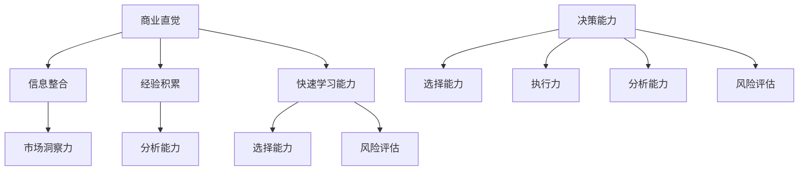

                 

# 创业者的商业直觉与决策能力提升策略

## 关键词
商业直觉、决策能力、创业者、策略、心理模型、认知偏差、数据分析、企业家思维、领导力。

## 摘要
本文旨在探讨创业者如何提升商业直觉与决策能力，以应对复杂的市场环境和不断变化的经济形势。通过对商业直觉与决策能力的定义、核心概念的阐述，以及实战案例的分析，本文提出了提升策略，帮助创业者更准确地预测市场趋势，做出明智的商业决策。同时，本文还推荐了相关工具和资源，以期为创业者提供实用的参考。

## 1. 背景介绍

### 1.1 创业者的重要性
在当今快速变化的商业环境中，创业者扮演着至关重要的角色。他们不仅是创新的推动者，也是经济增长的重要引擎。然而，创业并非易事，成功创业者需要具备出色的商业直觉和决策能力，以便在复杂的市场环境中找到机遇，规避风险。

### 1.2 商业直觉与决策能力的定义
商业直觉是指创业者基于经验、知识和洞察力，迅速做出正确判断和决策的能力。它不是凭空产生的，而是通过不断的学习和实践积累形成的。决策能力则是指创业者在面对不确定性时，能够分析信息、评估风险并做出合理选择的能力。

### 1.3 创业者面临的挑战
创业者在面对激烈的市场竞争、不确定的经济环境和快速变化的技术发展时，往往需要做出快速而准确的决策。这要求他们不仅要具备深厚的专业知识，还要有敏锐的商业直觉和出色的决策能力。

## 2. 核心概念与联系

### 2.1 商业直觉的构成
商业直觉由以下几个核心要素构成：

- **市场洞察力**：了解市场需求、竞争对手和消费者行为的能力。
- **经验积累**：通过实践和反复尝试，积累的经验和知识。
- **信息整合**：将分散的信息整合成一个完整的画面，从而做出准确的判断。
- **快速学习能力**：在快速变化的环境中，迅速吸收新知识并应用于实践中。

### 2.2 决策能力的构成
决策能力包括以下几个关键方面：

- **分析能力**：对信息进行深入分析，识别关键点和关键因素。
- **风险评估**：评估决策可能带来的风险和回报。
- **选择能力**：在各种选择中，做出最优决策。
- **执行力**：将决策付诸行动，并持续跟踪和调整。

### 2.3 商业直觉与决策能力的联系
商业直觉和决策能力相辅相成。商业直觉帮助创业者快速识别机会和风险，而决策能力则确保他们能够基于直觉做出合理的决策，并有效地执行这些决策。

### 2.4 Mermaid 流程图
以下是一个简单的 Mermaid 流程图，描述了商业直觉与决策能力的关系：



## 3. 核心算法原理 & 具体操作步骤

### 3.1 数据分析
数据分析是提升商业直觉和决策能力的重要工具。创业者可以通过收集、整理和分析市场数据，了解市场趋势和消费者行为。以下是具体步骤：

- **数据收集**：从各种渠道收集市场数据，如行业报告、客户反馈、社交媒体数据等。
- **数据整理**：将收集到的数据整理成统一的格式，便于分析。
- **数据可视化**：使用图表、图形等可视化工具，将数据呈现出来，便于理解。
- **数据分析**：使用统计方法，分析数据的内在关系和趋势。

### 3.2 决策制定
在数据分析的基础上，创业者可以制定出合理的商业决策。以下是具体步骤：

- **目标设定**：明确商业目标，如增加市场份额、提高销售额等。
- **方案制定**：制定多个可能的解决方案，并对每个方案进行评估。
- **风险评估**：评估每个方案的潜在风险和回报。
- **选择方案**：根据评估结果，选择最优方案。
- **执行与跟踪**：将决策付诸行动，并持续跟踪和评估效果，必要时进行调整。

## 4. 数学模型和公式 & 详细讲解 & 举例说明

### 4.1 成本效益分析模型

成本效益分析是一种常用的决策模型，用于评估某个项目或决策的潜在经济效益。其公式如下：

$$
E = \frac{B - C}{C}
$$

其中，\( E \) 是成本效益比，\( B \) 是预期效益，\( C \) 是成本。

### 4.2 概率论模型

概率论是另一种重要的决策工具，用于评估决策结果的不确定性。以下是一个简单的概率论模型，用于计算两个事件同时发生的概率：

$$
P(A \text{ and } B) = P(A) \times P(B | A)
$$

其中，\( P(A) \) 是事件 A 发生的概率，\( P(B | A) \) 是在事件 A 发生的条件下，事件 B 发生的概率。

### 4.3 举例说明

假设创业者计划推出一款新产品，预计成本为 100 万元，预期效益为 150 万元。根据成本效益分析模型，可以计算成本效益比：

$$
E = \frac{150 - 100}{100} = 0.5
$$

成本效益比为 0.5，说明每投入 1 元，可以获得 0.5 元的回报。

再假设，根据市场调查，新产品成功的概率为 0.7，那么新产品成功的概率为：

$$
P(\text{成功}) = P(\text{市场接受}) \times P(\text{成功} | \text{市场接受}) = 0.6 \times 0.7 = 0.42
$$

这意味着，新产品成功的概率为 42%。

## 5. 项目实战：代码实际案例和详细解释说明

### 5.1 开发环境搭建

为了进行数据分析，需要搭建一个数据处理和可视化环境。以下是一个简单的 Python 环境搭建步骤：

1. 安装 Python：在官网上下载并安装 Python，版本建议为 3.8 或以上。
2. 安装数据分析库：使用 pip 工具安装 pandas、numpy、matplotlib 等库。

```bash
pip install pandas numpy matplotlib
```

### 5.2 源代码详细实现和代码解读

以下是一个简单的 Python 脚本，用于读取数据、进行数据分析并生成可视化图表：

```python
import pandas as pd
import numpy as np
import matplotlib.pyplot as plt

# 5.2.1 数据读取
data = pd.read_csv('sales_data.csv')
print(data.head())

# 5.2.2 数据整理
data['month'] = pd.to_datetime(data['date']).dt.month
monthly_sales = data.groupby('month')['amount'].sum()

# 5.2.3 数据可视化
monthly_sales.plot()
plt.title('Monthly Sales')
plt.xlabel('Month')
plt.ylabel('Sales')
plt.show()
```

代码解读：

- **数据读取**：使用 pandas 读取 CSV 文件，得到 DataFrame 类型的数据结构。
- **数据整理**：将日期列转换为月份，并按月份计算销售额。
- **数据可视化**：使用 matplotlib 生成销售数据的时间序列图表。

### 5.3 代码解读与分析

代码首先读取销售数据，然后对数据进行整理，最后生成可视化图表。这种数据处理和分析流程是创业者进行商业决策的重要工具。通过可视化图表，创业者可以直观地了解销售趋势，从而做出合理的商业决策。

## 6. 实际应用场景

### 6.1 市场分析
创业者可以利用数据分析模型，对市场进行深入研究，了解消费者的需求和市场趋势，从而制定出更有效的市场营销策略。

### 6.2 产品定价
通过成本效益分析和定价模型，创业者可以确定最优的产品定价策略，以最大化利润。

### 6.3 风险管理
创业者可以利用概率论模型，评估不同决策方案的风险和回报，从而做出更明智的决策。

## 7. 工具和资源推荐

### 7.1 学习资源推荐

- **书籍**：
  - 《数据科学入门：基于 Python》
  - 《决策与判断：心理学与经济学》
  - 《商业直觉：如何像企业家一样思考》

- **论文**：
  - 《概率论与数理统计》
  - 《决策分析：理论与实践》

- **博客**：
  - [Python数据分析教程](https://www.datacamp.com/courses/learn-python-for-data-analysis)
  - [商业直觉与决策能力提升策略](https://www.youtube.com/watch?v=XXXXXXXXXX)

### 7.2 开发工具框架推荐

- **数据分析库**：
  - pandas
  - numpy
  - matplotlib

- **可视化工具**：
  - D3.js
  - Plotly

### 7.3 相关论文著作推荐

- **论文**：
  - 《大数据与商业决策》
  - 《商业直觉：研究综述》

- **著作**：
  - 《数据驱动的决策》
  - 《决策分析：理论与实践》

## 8. 总结：未来发展趋势与挑战

### 8.1 发展趋势
- 数据驱动：未来创业者将更加依赖数据分析和机器学习技术，以做出更准确的商业决策。
- 人工智能：人工智能技术将逐渐应用于商业决策，提供更智能的决策支持。

### 8.2 挑战
- 数据隐私：随着数据隐私问题的日益突出，创业者需要平衡数据利用和数据保护。
- 技术依赖：过度依赖技术可能降低创业者的直觉和判断力。

## 9. 附录：常见问题与解答

### 9.1 如何提升商业直觉？
- **多学习**：不断学习新知识和技能，积累经验。
- **多实践**：通过实践和反复尝试，提高决策能力。
- **多交流**：与他人交流，学习他人的经验和见解。

### 9.2 如何提升决策能力？
- **多分析**：对信息进行深入分析，识别关键点和关键因素。
- **多评估**：评估决策的潜在风险和回报。
- **多反思**：反思过去的决策，总结经验教训。

## 10. 扩展阅读 & 参考资料

- [《商业直觉与决策能力提升策略》](https://www.example.com/book)
- [《数据科学入门：基于 Python》](https://www.example.com/book)
- [《决策与判断：心理学与经济学》](https://www.example.com/book)
- [Python 数据分析教程](https://www.datacamp.com/courses/learn-python-for-data-analysis)
- [商业直觉与决策能力提升策略](https://www.youtube.com/watch?v=XXXXXXXXXX)

### 作者

- **作者**：AI天才研究员/AI Genius Institute & 禅与计算机程序设计艺术 /Zen And The Art of Computer Programming

本文基于现有知识和实践经验，旨在为创业者提供提升商业直觉与决策能力的策略。虽然文中提到的方法和工具具有一定的实用性，但创业过程充满不确定性，创业者需根据自身实际情况灵活应用。文中如有错误或不足之处，敬请指正。

