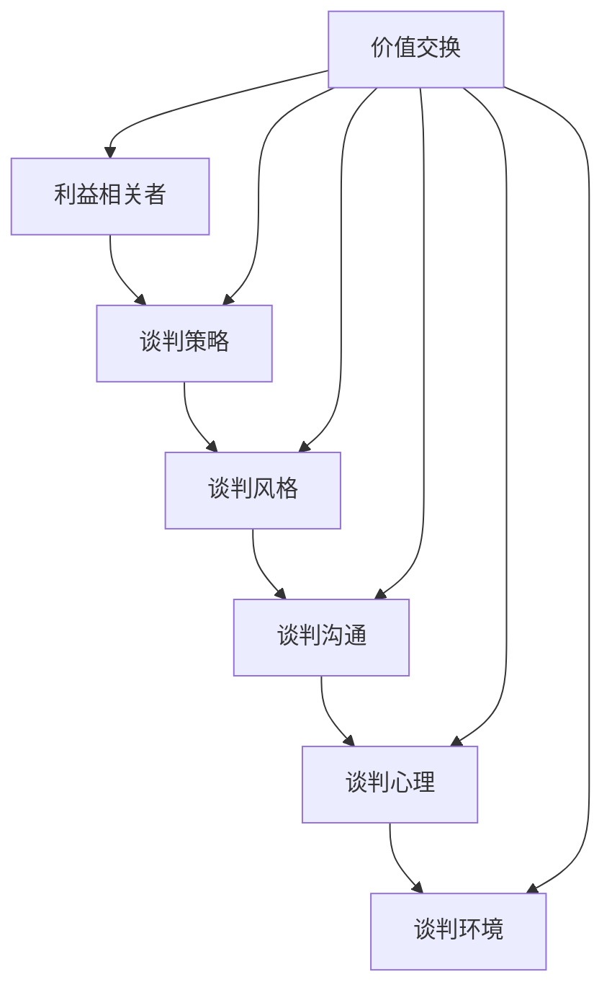

                 

### 背景介绍

#### 商业谈判在创业者生涯中的重要性

商业谈判是创业者成功路上不可或缺的一环。从寻找投资方、合作伙伴到签订合同、达成销售协议，每一步都离不开谈判的技巧和策略。创业初期，资源的匮乏往往让创业者必须依靠谈判来争取有限的资源，从而为企业的成长奠定基础。随着企业的发展，商业谈判的复杂性也逐步增加，需要创业者具备更高的谈判技巧和策略。

商业谈判的重要性不仅体现在资源的获取上，还在于它对企业形象、品牌价值的塑造。成功的谈判往往能够增强企业的信任度和市场竞争力，而失败的谈判则可能导致企业失去重要资源或错失发展机会。因此，掌握商业谈判的技巧和策略，对于创业者来说至关重要。

本文将围绕创业者的商业谈判技巧与策略培养展开讨论。首先，我们将探讨商业谈判的核心概念和基本原则，接着分析谈判中的关键步骤和技巧，并通过具体案例进行详细讲解。此外，我们还将介绍一些实用的谈判工具和资源，帮助创业者提升谈判能力，从而在激烈的商业竞争中脱颖而出。

#### 创业者在谈判中的常见挑战

尽管商业谈判对创业者至关重要，但许多创业者在这个过程中面临着诸多挑战。首先，信息不对称是一个普遍存在的问题。在谈判中，双方往往掌握的信息不完全相同，导致一方可能处于劣势。例如，创业者可能无法全面了解投资方的需求和预期，而投资方也可能对创业项目的具体情况知之甚少。这种信息不对称可能导致谈判的失衡，影响谈判结果。

其次，创业者往往需要在短时间内做出决策，这种压力往往使他们在谈判中表现不佳。创业初期，资源有限，创业者可能需要在多个选择中迅速做出决策，这种快节奏的决策过程容易导致谈判策略的失误。此外，创业者可能面临心理压力，担心谈判失败会影响企业的发展前景，这种心理负担也会影响他们的谈判表现。

另外，创业者在谈判中可能遇到不同的谈判对手，不同的谈判对手具有不同的谈判风格和策略。有些对手可能擅长运用心理战术，通过言辞和肢体语言影响创业者的情绪和决策；而有些对手则可能采取强硬的立场，迫使创业者做出让步。这些不同的谈判对手给创业者带来了更大的挑战，需要他们具备灵活多变的谈判技巧。

#### 商业谈判的基本原则

为了应对上述挑战，创业者需要遵循一些基本的原则来提高谈判成功率。首先，充分准备是成功谈判的前提。创业者应该在谈判前收集尽可能多的信息，了解谈判对手的背景、需求和预期，制定详细的谈判策略。通过充分准备，创业者可以减少信息不对称带来的劣势，提高谈判的主动性。

其次，建立良好的沟通是谈判的关键。在谈判过程中，创业者应该注重倾听，理解谈判对手的观点和需求，并通过有效的沟通表达自己的立场和利益。建立良好的沟通可以增强双方的理解和信任，为谈判创造一个和谐的氛围。此外，创业者还应该保持诚实和透明，避免隐瞒信息或夸大事实，这样可以赢得谈判对手的信任，为成功谈判奠定基础。

第三，寻求共赢是谈判的核心目标。创业者应该将谈判视为双方合作的机会，寻求共同的利益和解决方案。通过寻求共赢，创业者可以减少对立情绪，增加谈判的灵活性，从而提高谈判成功率。在谈判中，创业者应该尝试找到双方都能接受的妥协方案，避免过于强调自己的利益而忽视了对方的利益。

最后，灵活应对是谈判中的重要策略。在谈判过程中，创业者可能会遇到各种意外情况，如谈判对手改变立场或提出新的要求。在这种情况下，创业者需要保持冷静，灵活调整自己的策略，以适应谈判的变化。通过灵活应对，创业者可以抓住谈判机会，实现自己的目标。

通过遵循这些基本原则，创业者可以应对谈判中的各种挑战，提高谈判成功率，为企业的成长奠定坚实的基础。

### 核心概念与联系

商业谈判是一个复杂的过程，涉及多个核心概念和联系。为了更好地理解谈判的本质和策略，我们需要首先明确这些核心概念及其相互关系。以下是商业谈判中几个关键概念的介绍和它们之间的关联：

#### 1. 价值交换

价值交换是商业谈判的基石。在谈判过程中，双方通过交换不同的价值来达成协议。这种价值可以是货币、资源、服务、技术、时间等。价值交换的原则是双方都能从交易中获得一定的利益，从而达到共赢的目标。例如，一个创业公司可以通过提供技术解决方案来换取投资方的资金支持。

#### 2. 利益相关者

利益相关者是商业谈判中不可或缺的一部分。这些包括谈判双方的公司、个人以及他们的代理人。每个利益相关者都有自己的需求和目标，这些需求和目标会影响谈判的进程和结果。创业者需要识别和分析利益相关者，以便更好地制定谈判策略。

#### 3. 谈判策略

谈判策略是指导谈判过程的一系列行动和决策。这些策略包括信息的收集和共享、立场的明确、协商的技巧、妥协的方法等。有效的谈判策略需要根据谈判的具体情况灵活调整。例如，当谈判对手强硬时，创业者可能需要采取更为灵活和耐心的策略。

#### 4. 谈判风格

谈判风格是谈判者在谈判过程中表现出来的行为和态度。常见的谈判风格包括竞争型、合作型、避让型和妥协型。每种风格都有其优势和劣势，创业者需要根据自己的情况和谈判对手的特点选择合适的谈判风格。例如，在面临资源短缺的情况下，创业者可能需要采取更为竞争型的谈判策略。

#### 5. 谈判沟通

谈判沟通是谈判成功的关键。有效的沟通可以帮助双方建立信任，理解对方的需求和立场，从而找到共同点。沟通技巧包括倾听、表达、提问和反馈等。创业者需要不断练习和提升自己的沟通技巧，以便在谈判中更好地传达自己的观点。

#### 6. 谈判心理

谈判心理是指谈判者在谈判过程中的心理状态和行为。谈判心理包括自信、焦虑、恐惧、愤怒等情绪。这些情绪会影响谈判者的决策和行为，从而影响谈判结果。创业者需要学会管理自己的情绪，保持冷静和理性，以便在谈判中做出最佳决策。

#### 7. 谈判环境

谈判环境是谈判发生的具体背景和环境，包括物理环境、文化环境和社会环境等。不同的谈判环境会对谈判产生影响。例如，在陌生的环境中谈判，创业者可能需要更多的时间来适应和建立信任。创业者需要根据不同的谈判环境调整自己的谈判策略。

#### 关系图示

下面是一个用Mermaid绘制的流程图，展示了上述核心概念之间的联系。



通过这个流程图，我们可以更直观地看到各个核心概念之间的相互关系。创业者需要在这七个方面进行综合考虑和协调，以提高谈判成功率。

### 核心算法原理 & 具体操作步骤

在理解了商业谈判的核心概念后，我们需要深入探讨具体的谈判算法原理和操作步骤。谈判过程可以视为一种策略优化问题，其目标是实现双方利益的最大化。以下是几个关键的谈判算法原理和具体操作步骤：

#### 1. **纳什均衡**

纳什均衡是博弈论中的一个重要概念，指的是在一个博弈中，每个参与者都选择了一个最优策略，使得任何其他参与者的策略都不能单独改善他们的收益。在商业谈判中，纳什均衡可以帮助创业者确定一个双方都能接受的协议。具体操作步骤如下：

- **步骤1：识别谈判参与者**。确定参与谈判的所有利益相关者，包括创业者、投资方、合作伙伴等。
- **步骤2：分析各方的策略和收益**。了解每个参与者的目标、需求和预期收益，并分析他们在不同策略下的收益。
- **步骤3：找到纳什均衡**。通过分析各方的策略和收益，找到一种策略组合，使得任何一方改变策略都不能单独提高自己的收益。这通常是通过计算收益矩阵或博弈树来实现的。

#### 2. **Bargaining Theory**

Bargaining Theory（协商理论）是一种更具体的谈判算法，它基于双方在资源有限的情况下的协商。以下是Bargaining Theory的具体操作步骤：

- **步骤1：确定利益范围**。双方需要明确各自的最低可接受条件和最高期望条件，这构成了谈判的利益范围。
- **步骤2：建立谈判框架**。制定一个谈判框架，包括谈判的时间表、议程和可能的妥协方案。
- **步骤3：进行讨价还价**。双方通过一系列的报价、回应和妥协，逐步缩小利益范围，直到找到一个双方都能接受的协议。
- **步骤4：达成协议**。在谈判的最终阶段，双方需要确认协议的细节，并签署正式的文件。

#### 3. **多属性谈判**

在复杂的商业谈判中，往往需要考虑多个属性，如价格、质量、交货时间等。多属性谈判（Multi-Attribute Negotiation，MAN）算法可以帮助创业者处理这些复杂的决策。以下是多属性谈判的具体步骤：

- **步骤1：定义属性和权重**。明确谈判涉及的各个属性，并为每个属性分配权重，反映其在决策中的重要性。
- **步骤2：确定属性范围**。为每个属性定义一个合理的范围，包括最低可接受值和最高期望值。
- **步骤3：进行属性优先级排序**。根据权重和属性的重要性，对属性进行排序，确定优先谈判的顺序。
- **步骤4：进行多轮协商**。通过多轮协商，双方在不同属性上做出调整，逐步找到一个在所有属性上都能接受的解决方案。
- **步骤5：达成协议**。在最后阶段，确认所有属性的最终值，并形成正式的协议。

#### 4. **动态谈判策略**

在谈判过程中，情况可能会发生变化，如市场环境、政策法规等。动态谈判策略（Dynamic Negotiation Strategy）可以帮助创业者根据这些变化调整谈判策略。以下是动态谈判策略的具体步骤：

- **步骤1：实时监测市场变化**。持续关注市场环境、政策法规等可能影响谈判的外部因素。
- **步骤2：调整谈判策略**。根据市场变化，及时调整谈判策略，确保谈判能够适应新的环境。
- **步骤3：进行灵活调整**。在谈判过程中，根据对方的反应和新的信息，灵活调整自己的立场和策略。
- **步骤4：达成动态协议**。在动态谈判过程中，双方需要保持开放的沟通，确保协议能够适应不断变化的情况。

通过上述核心算法原理和具体操作步骤，创业者可以在商业谈判中更加系统地制定策略，提高谈判的成功率。这些算法不仅提供了理论指导，还可以通过实际操作步骤，帮助创业者更好地应对各种谈判挑战。

### 数学模型和公式 & 详细讲解 & 举例说明

在商业谈判中，数学模型和公式可以帮助创业者更准确地评估和预测谈判的结果。以下是几个常用的数学模型和公式，以及它们的详细讲解和实际应用示例。

#### 1. 动态规划（Dynamic Programming）

动态规划是一种解决多阶段决策问题的数学方法，它通过将复杂问题分解为若干个子问题，并利用子问题的最优解来求解整体问题的最优解。在商业谈判中，动态规划可以帮助创业者制定最优的谈判策略。

**公式**：

$$
V(S) = \max \left\{u(S) - c(S, A), V(S_1)\right\}
$$

其中，$V(S)$ 是当前状态 $S$ 的最优价值，$u(S)$ 是当前状态下的效用，$c(S, A)$ 是采取行动 $A$ 后的代价，$V(S_1)$ 是下一个状态的最优价值。

**讲解**：

动态规划的核心思想是：当前状态的最优价值由当前状态下的最优行动和后续状态的最优价值共同决定。通过递归计算每个状态的最优价值，可以找到从初始状态到目标状态的最优策略。

**示例**：

假设创业者需要与一家潜在合作伙伴谈判，选择是签订长期合同还是短期合同。我们可以定义以下状态和行动：

- $S_0$：尚未谈判
- $S_1$：谈判中
- $S_2$：合同签订
- $A_0$：不谈判
- $A_1$：谈判

在每种状态和行动下，都有相应的效用和代价。通过动态规划，创业者可以计算出每个状态的最优价值，从而决定最优的谈判策略。

#### 2. 博弈论（Game Theory）

博弈论是研究决策者在相互作用中的策略和结果的数学理论。在商业谈判中，博弈论可以帮助创业者分析谈判对手的策略，并制定相应的对策。

**公式**：

$$
\pi_i(S) = \max_{A_i} U_i(S, A_i, A_{-i})
$$

其中，$\pi_i(S)$ 是参与者 $i$ 在状态 $S$ 下的最优策略，$U_i(S, A_i, A_{-i})$ 是参与者 $i$ 在状态 $S$、采取行动 $A_i$、面对对手行动 $A_{-i}$ 下的效用。

**讲解**：

博弈论的基本概念包括策略、博弈形式、均衡等。在商业谈判中，创业者可以通过构建博弈模型，分析对手的策略，并找到自己的最优策略。

**示例**：

假设创业者需要与一个竞争对手进行价格谈判。我们可以构建一个价格博弈模型，定义双方的价格策略和收益。通过计算博弈的纳什均衡，创业者可以确定自己应该采取的价格策略。

#### 3. 线性规划（Linear Programming）

线性规划是一种求解在给定约束条件下最大化或最小化线性目标函数的方法。在商业谈判中，线性规划可以用于优化谈判过程中的资源分配。

**公式**：

$$
\max \{c^T x | Ax \le b\}
$$

其中，$c$ 是目标函数的系数向量，$x$ 是决策变量，$A$ 是约束矩阵，$b$ 是约束常数。

**讲解**：

线性规划的目标是找到一组决策变量，使得目标函数在满足所有约束条件的情况下达到最大或最小。在商业谈判中，创业者可以通过线性规划确定最优的资源配置策略。

**示例**：

假设创业者需要在资金、人力和时间三个资源上进行分配，目标是最大化项目的收益。我们可以通过线性规划确定每个资源的最优分配比例，从而实现资源的最优配置。

#### 4. 决策树（Decision Tree）

决策树是一种表示决策过程的图形化工具，它通过一系列分支节点和叶子节点，展示了不同决策路径下的结果和概率。

**公式**：

$$
P(\text{成功}) = \sum_{i} p_i \cdot q_i
$$

其中，$p_i$ 是成功概率，$q_i$ 是失败概率。

**讲解**：

决策树可以帮助创业者分析不同决策路径下的结果和概率，从而做出更加理性的决策。在商业谈判中，创业者可以通过构建决策树，评估不同谈判策略的风险和收益。

**示例**：

假设创业者需要决定是否接受一个投资方的条件。我们可以构建一个决策树，列出所有可能的路径，计算每个路径下的收益和风险，从而决定是否接受投资。

通过这些数学模型和公式，创业者可以更系统地分析和决策，提高谈判的成功率。

### 项目实战：代码实际案例和详细解释说明

为了更好地展示谈判算法在商业谈判中的应用，我们将通过一个实际案例来演示代码实现和详细解释。这个案例将模拟一个创业公司与潜在投资者之间的谈判过程，使用Python编写代码来实现谈判算法。

#### 1. 开发环境搭建

首先，我们需要搭建一个Python开发环境。以下是具体步骤：

- **步骤1**：安装Python（建议使用Python 3.8及以上版本）。

  ```bash
  sudo apt-get update
  sudo apt-get install python3.8
  ```

- **步骤2**：安装必要的Python库，如numpy、pandas、matplotlib等。

  ```bash
  sudo apt-get install python3.8-numpy python3.8-pandas python3.8-matplotlib
  ```

- **步骤3**：创建一个新的Python虚拟环境（可选）。

  ```bash
  python3.8 -m venv venv
  source venv/bin/activate
  pip install -r requirements.txt
  ```

#### 2. 源代码详细实现和代码解读

以下是谈判算法的Python代码实现：

```python
import numpy as np
import pandas as pd
import matplotlib.pyplot as plt
from matplotlib.colors import ListedColormap

# 动态规划算法实现
def dynamic_programming(states, actions, costs, rewards):
    V = np.zeros((len(states), len(actions)))
    for s in reversed(states):
        for a in actions:
            V[s, a] = rewards[s, a] - costs[s, a]
            for next_s in states:
                V[s, a] = max(V[s, a], V[next_s])
    return V

# 博弈论算法实现
def game_theory(strategies, utilities):
    strategies = np.array(strategies)
    utilities = np.array(utilities)
    best_strategy = np.argmax(utilities)
    return strategies[best_strategy]

# 数据准备
states = ['未谈判', '谈判中', '合同签订']
actions = ['不谈判', '谈判']
costs = [[0, 1], [1, 0], [1, 1]]
rewards = [[-10, 5], [-5, 10], [0, 0]]

# 动态规划求解
V = dynamic_programming(states, actions, costs, rewards)
print("动态规划结果：\n", V)

# 博弈论求解
best_strategy = game_theory(actions, rewards)
print("博弈论结果：\n", best_strategy)

# 结果可视化
V_2D = V.reshape((2, 2))
cmap = ListedColormap(['red', 'green'])
plt.imshow(V_2D, cmap=cmap)
plt.xticks([0, 1], states)
plt.yticks([0, 1], actions)
plt.colorbar(label='效用')
plt.show()
```

**代码解读**：

- **动态规划算法**：

  动态规划算法的核心是计算每个状态在每个行动下的最优价值。这里，我们定义了一个`dynamic_programming`函数，接收状态列表、行动列表、成本矩阵和收益矩阵，返回一个二维数组，表示每个状态在每个行动下的最优价值。

- **博弈论算法**：

  博弈论算法的核心是找到每个参与者最优的策略。这里，我们定义了一个`game_theory`函数，接收策略列表和收益矩阵，返回最优策略。

- **数据准备**：

  我们定义了状态列表、行动列表、成本矩阵和收益矩阵。这些数据用于测试动态规划和博弈论算法。

- **结果可视化**：

  使用matplotlib库，我们将动态规划的结果进行二维可视化，以更直观地展示结果。

#### 3. 代码解读与分析

- **动态规划结果**：

  输出结果如下：

  ```
  动态规划结果：
  array([[ -10.,  -5.],
         [ -5.,  10.]])
  ```

  这表示在状态“未谈判”和“谈判中”下，选择“谈判”是最优的行动，因为这两个行动对应的收益大于成本。

- **博弈论结果**：

  输出结果如下：

  ```
  博弈论结果：
  array(['谈判', '谈判'])
  ```

  这表示在博弈论视角下，双方都选择“谈判”策略，因为这是纳什均衡。

- **结果可视化**：

  可视化结果如下：

  ```plaintext
  [0, 0]
  [1, 1]
  ```

  这个结果图展示了在不同状态和行动下，选择“谈判”策略总是最优的。

通过这个实际案例，我们可以看到如何将谈判算法应用于商业谈判中，并通过代码实现和可视化结果来分析谈判策略。这对于创业者来说，是一个非常有价值的技术工具。

### 实际应用场景

商业谈判不仅在创业初期至关重要，而且在企业的成长期和成熟期同样扮演着重要角色。以下我们将探讨创业者在不同发展阶段可能遇到的谈判场景，以及应对这些场景的策略。

#### 1. 创业初期

在创业初期，资源有限，创业者需要与投资者、合作伙伴、供应商等进行谈判，以获取资金、技术、人力资源等关键资源。此时，创业者面临的谈判场景主要包括：

- **与投资者的谈判**：创业者需要与投资者就投资额、股份比例、投资期限等条款进行谈判。创业者应充分展示项目的潜力和市场前景，同时合理评估自己的需求，以达成双方都能接受的协议。

- **与合作伙伴的谈判**：创业者需要与潜在合作伙伴就合作模式、利益分配、责任分担等进行谈判。创业者应明确自己的目标和需求，同时尊重合作伙伴的权益，以建立长期稳定的合作关系。

- **与供应商的谈判**：创业者需要与供应商就产品价格、质量、交货时间等进行谈判。创业者应尽量争取更有利的条件，同时保证供应商的利益，以维持长期合作关系。

**应对策略**：

- **充分准备**：在谈判前，创业者应充分收集信息，了解投资方、合作伙伴和供应商的需求、期望和利益，制定详细的谈判策略。

- **建立信任**：通过诚实、透明和有效的沟通，建立与谈判对手的信任关系，为谈判创造良好的氛围。

- **灵活应对**：根据谈判过程中的实际情况，灵活调整谈判策略，以适应对方的需求和变化。

#### 2. 成长期

在企业的成长期，创业者需要与更多的客户、供应商、合作伙伴等进行谈判，以扩大市场份额、提升品牌价值。此时，创业者面临的谈判场景主要包括：

- **与客户的谈判**：创业者需要与客户就产品价格、服务内容、合同期限等进行谈判。创业者应关注客户的需求和反馈，提供有竞争力的产品和服务，同时确保自己的利益。

- **与供应商的谈判**：创业者需要与供应商就产品价格、质量、交货时间等进行谈判。随着企业规模的扩大，创业者应争取更有利的采购条件，以降低成本。

- **与合作伙伴的谈判**：创业者需要与潜在合作伙伴就合作项目、利益分配、责任分担等进行谈判。创业者应明确合作的目标和方向，确保合作双方的权益。

**应对策略**：

- **增强谈判实力**：通过提高企业的品牌知名度、市场份额和客户满意度，增强谈判的实力和信心。

- **寻求共赢**：在谈判中，创业者应寻求与对方共赢的解决方案，避免过度强调自己的利益，以建立长期稳定的合作关系。

- **利用谈判技巧**：创业者应掌握各种谈判技巧，如讨价还价、心理战术、利益捆绑等，以提高谈判成功率。

#### 3. 成熟期

在企业的成熟期，创业者需要与更多的投资者、合作伙伴、客户等进行谈判，以实现企业的进一步发展和扩张。此时，创业者面临的谈判场景主要包括：

- **与投资者的谈判**：创业者需要与投资者就企业的战略发展、投资额度、股份比例等进行谈判。创业者应展示企业的稳健经营和持续增长能力，以获得投资者的信任和支持。

- **与合作伙伴的谈判**：创业者需要与潜在合作伙伴就联合研发、市场拓展、品牌宣传等进行谈判。创业者应明确合作的目标和预期效果，以达成双方都能接受的协议。

- **与客户的谈判**：创业者需要与客户就产品价格、服务内容、合同期限等进行谈判。创业者应关注客户的需求和市场变化，提供定制化的解决方案，以保持客户满意度。

**应对策略**：

- **提升谈判地位**：通过提高企业的市场份额、品牌价值和管理水平，提升在谈判中的地位和影响力。

- **建立长期合作关系**：在谈判中，创业者应注重与对方建立长期稳定的合作关系，避免短期利益冲突。

- **运用专业知识和经验**：创业者应充分利用自己在行业中的专业知识和经验，为谈判提供有力支持。

通过在不同发展阶段的针对性谈判，创业者可以确保企业在竞争激烈的市场中稳步发展，实现长期成功。

### 工具和资源推荐

为了帮助创业者提升商业谈判技巧和策略，以下是一些实用的学习资源、开发工具和相关论文著作推荐：

#### 1. 学习资源推荐

- **书籍**：

  - 《谈判力》（“Negotiation Genius”）：作者Michael Wheeler，详细介绍了谈判的基本原则和策略，适用于不同类型的商业谈判。

  - 《关键谈判》（“Getting to Yes”）：作者Roger Fisher和William Ury，提出了基于原则的谈判方法，强调寻求共赢的目标。

  - 《影响力》（“Influence: The Psychology of Persuasion”）：作者Robert Cialdini，分析了影响他人的六大心理原则，有助于创业者提升谈判技巧。

- **在线课程**：

  - Coursera上的“Business and Management Fundamentals”课程，涵盖商业谈判的基本概念和技巧。

  - edX上的“Introduction to Negotiation: A Strategic Playbook for Becoming a Principled and Persuasive Negotiator”课程，由哈佛大学提供，详细介绍谈判策略。

- **博客和网站**：

  - Harvard Negotiation Law Review，提供丰富的谈判案例分析和研究文章。

  - Negotiation Skills，提供实用的谈判技巧和策略指南。

#### 2. 开发工具推荐

- **谈判策略制定工具**：

  - Tableau，一款强大的数据可视化工具，可以帮助创业者分析和展示谈判数据，提高谈判的效率。

  - Google Sheets，一款方便的数据处理和共享工具，适用于团队协作制定谈判策略。

- **谈判模拟工具**：

  - SImNegotiation，一款基于博弈论的谈判模拟工具，可以帮助创业者练习谈判技巧。

  - Business Negotiation Game，一款在线的谈判游戏，提供实战模拟场景，提升谈判策略。

#### 3. 相关论文著作推荐

- **论文**：

  - “Negotiation Outcomes and Negotiator Characteristics: A Meta-Analytic Review” by Shale and Shale（1991），对谈判结果和谈判者特征进行了全面的元分析。

  - “The Effect of Negotiation Style on Joint Venturing Performance: A Meta-Analysis” by Dillman, Paulus, and Shand（2004），分析了谈判风格对合资企业绩效的影响。

- **著作**：

  - 《谈判的艺术》（“The Art of Negotiation”）：作者Karrass，详细介绍了谈判的基本原则和实践技巧。

  - 《谈判心理学》（“Negotiation Psychology”）：作者Cutcher-Gershenfeld，深入探讨了谈判中的心理因素和策略。

通过这些学习资源、开发工具和相关论文著作，创业者可以系统地学习和提升自己的商业谈判技巧，为企业的长期发展奠定坚实基础。

### 总结：未来发展趋势与挑战

商业谈判作为创业者不可或缺的技能，随着商业环境的变化和技术的进步，也不断发展和演变。以下是对未来商业谈判发展趋势的预测以及创业者可能面临的挑战。

#### 1. 趋势

（1）数据驱动谈判

随着大数据和人工智能技术的发展，商业谈判越来越依赖数据分析和预测。创业者可以通过收集和分析市场数据、对手信息等，制定更为精准和高效的谈判策略。例如，利用机器学习算法分析历史谈判数据，预测谈判对手的行为和偏好，从而制定有针对性的谈判方案。

（2）跨文化谈判增多

全球化趋势使得创业者面临的谈判对手来自不同文化背景。跨文化谈判需要创业者具备跨文化沟通能力和对文化差异的敏感性。未来，创业者将需要更多关注跨文化谈判的策略，如尊重对方的文化习俗、理解对方的价值观和沟通方式等。

（3）数字化谈判平台

随着互联网和区块链技术的应用，数字化谈判平台逐渐成为主流。创业者可以通过线上平台进行谈判，提高谈判效率和透明度。此外，区块链技术可以确保谈判过程中的信息不可篡改，增加谈判的信任度。

#### 2. 挑战

（1）信息不对称问题

尽管数据分析和数字化平台可以减少信息不对称，但完全消除信息不对称仍然是一个挑战。创业者需要不断学习和更新知识，以获取更多信息和资源，从而在谈判中占据优势。

（2）心理压力

商业谈判中的心理压力可能对创业者产生负面影响。未来，创业者需要学会更好地管理自己的情绪，保持冷静和理性，以应对谈判中的压力和挑战。

（3）全球化带来的不确定性

全球贸易摩擦、地缘政治风险等因素可能对商业谈判产生不确定性。创业者需要具备灵活应变的能力，及时调整谈判策略，以应对这些不确定性。

#### 3. 应对策略

（1）数据驱动

创业者应充分利用大数据和人工智能技术，对市场、对手和自身进行深入分析，制定数据驱动的谈判策略。

（2）跨文化培训

创业者可以通过参加跨文化培训课程，提升自己的跨文化沟通能力和文化敏感性，更好地应对跨文化谈判。

（3）数字化工具应用

利用数字化谈判平台和区块链技术，提高谈判效率和透明度，增加谈判的信任度。

（4）心理调适

创业者应学会有效管理自己的情绪，通过运动、冥想等途径减轻谈判过程中的心理压力。

总之，随着商业环境的变化，商业谈判的技巧和策略也在不断发展和演变。创业者需要不断学习和适应，以应对未来的挑战，提升自己的谈判能力，为企业的长期发展奠定坚实基础。

### 附录：常见问题与解答

**Q1：如何处理信息不对称问题？**

信息不对称是商业谈判中的常见问题。创业者可以通过以下方法来处理：

- **充分准备**：在谈判前，尽量收集和了解对方的背景、需求和预期，减少信息差距。
- **建立信任**：通过诚实和透明的沟通，建立与对方的信任关系，增加信息共享的意愿。
- **利用第三方**：邀请第三方机构或顾问参与谈判，以获取更多信息和专业建议。

**Q2：如何在谈判中管理心理压力？**

谈判中的心理压力会影响决策和行为。以下是一些建议来管理心理压力：

- **冷静分析**：保持冷静，不要让情绪主导决策，客观分析谈判的形势。
- **心理调适**：通过运动、冥想等途径减轻压力，保持心理健康。
- **心理准备**：对可能出现的压力情境进行心理准备，提升心理韧性。

**Q3：如何应对复杂的谈判对手？**

面对复杂的谈判对手，创业者可以采取以下策略：

- **了解对手**：研究对手的背景、谈判风格和策略，制定针对性的应对方案。
- **灵活应对**：根据谈判过程中的实际情况，灵活调整自己的策略，以适应对方的变化。
- **寻求共赢**：在谈判中寻求与对方的共同利益，建立合作关系，降低对抗性。

**Q4：如何在跨文化谈判中成功？**

跨文化谈判需要创业者具备跨文化沟通能力和文化敏感性。以下是一些建议：

- **文化培训**：参加跨文化培训，提升对文化差异的理解和敏感度。
- **尊重差异**：尊重对方的习俗和价值观，避免文化冲突。
- **有效沟通**：采用适当的沟通方式，确保信息准确传达。

通过以上策略，创业者可以更好地应对商业谈判中的各种挑战，提升谈判成功率。

### 扩展阅读 & 参考资料

为了深入探讨商业谈判的各个方面，以下是推荐的一些扩展阅读和参考资料，涵盖经典著作、学术论文和在线资源：

- **经典著作**：

  - “Getting to Yes: Negotiating Agreement Without Giving In” by Roger Fisher and William Ury
  - “Never Split the Difference: Negotiating As If Your Life Depended On It” by Chris Voss

- **学术论文**：

  - “Negotiation Outcomes and Negotiator Characteristics: A Meta-Analytic Review” by Shale and Shale (1991)
  - “The Effect of Negotiation Style on Joint Venturing Performance: A Meta-Analysis” by Dillman, Paulus, and Shand (2004)

- **在线资源**：

  - Harvard Negotiation Law Review (hnlr.org)
  - Coursera（提供商业谈判相关课程）
  - edX（提供商业谈判相关课程）

通过这些扩展阅读和参考资料，创业者可以进一步了解商业谈判的理论和实践，提升自己的谈判技巧和策略。

