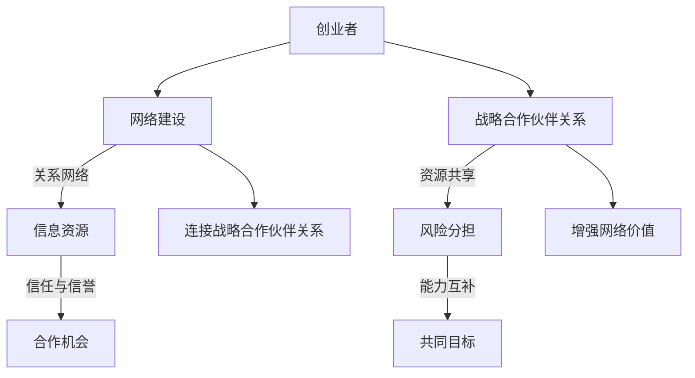

                 

### 背景介绍

在当今快速变化和竞争激烈的市场环境中，网络建设和战略合作伙伴关系对于创业者的成功至关重要。网络建设不仅仅是指建立一个社交媒体账户或参加几个行业会议，它还涉及到建立和维护一个有效的商业网络，通过这个网络获取资源、机会和优势。

#### 网络建设的重要性

网络建设是创业者获取信息和资源的关键渠道。通过建立一个强大的网络，创业者可以：

- **获取市场信息**：了解最新的行业趋势、竞争对手动态和消费者需求。
- **获取资源**：包括资金、人力资源和物质资源。
- **寻找合作伙伴**：合作伙伴可以为创业者提供技术支持、市场渠道或共同开发机会。
- **增强品牌影响力**：通过有效的网络营销，提高品牌知名度。

#### 战略合作伙伴关系的意义

战略合作伙伴关系是创业者实现长期成功的重要支柱。通过与其他公司或组织建立深度合作关系，创业者可以：

- **共享资源**：例如，共享技术、市场和供应链资源。
- **降低风险**：通过共同承担风险，降低创业失败的概率。
- **提高市场竞争力**：通过合作，双方可以共同开发新产品或服务，提高市场占有率。
- **拓宽视野**：与不同领域的合作伙伴合作，可以带来新的思维和创新。

#### 网络建设和战略合作伙伴关系的相互作用

网络建设和战略合作伙伴关系是相辅相成的。强大的网络为创业者提供了建立合作伙伴关系的渠道和机会，而成功的合作伙伴关系又可以增强网络的价值。例如：

- **通过网络获取潜在合作伙伴**：通过参加行业会议、研讨会或社交媒体，创业者可以识别潜在的合作伙伴。
- **利用合作伙伴关系扩大网络**：合作伙伴可以介绍新的联系人或资源，从而扩大创业者的网络。

总之，网络建设和战略合作伙伴关系是创业者成功不可或缺的要素。接下来，我们将详细探讨这些概念，并提供实用的建议和策略，帮助创业者更好地利用这些资源。

### 核心概念与联系

为了深入理解网络建设和战略合作伙伴关系的重要性，我们需要首先明确这两个概念的核心要素及其相互联系。

#### 网络建设

网络建设是指创业者通过建立、维护和扩展各种关系来构建一个有效的商业网络。这个网络包括但不限于以下核心要素：

- **关系网络**：创业者需要与行业内的其他企业家、投资者、供应商、客户和行业专家建立联系。
- **信息资源**：网络为创业者提供了获取市场信息、技术动态、资金来源和其他关键资源的途径。
- **信任与信誉**：建立信任和信誉是网络建设的重要部分。创业者需要通过诚信和专业来赢得他人的信任。
- **合作机会**：强大的网络能够为创业者提供各种合作机会，包括合资企业、战略联盟和资源共享。

#### 战略合作伙伴关系

战略合作伙伴关系是指两个或多个公司或组织之间建立的一种长期、互惠互利的合作关系。这种关系通常基于以下核心要素：

- **资源共享**：合作伙伴可以共同利用资源，例如资金、技术、市场和人力资源。
- **风险分担**：通过共同承担风险，合作伙伴可以降低创业或扩张过程中的不确定性。
- **能力互补**：合作伙伴通常在不同的领域或方面具有互补的能力，通过合作可以互相补充。
- **共同目标**：合作伙伴之间需要有共同的目标和愿景，以确保合作的有效性和持续性。

#### Mermaid 流程图

为了更清晰地展示网络建设和战略合作伙伴关系的核心要素和相互联系，我们可以使用Mermaid流程图来表示：



在这个流程图中，创业者通过网络建设获取资源、建立信任和识别合作机会，进而建立战略合作伙伴关系。反过来，成功的合作伙伴关系又能增强创业者的网络，形成良性循环。

通过明确这些核心概念及其相互联系，创业者可以更好地规划和实施网络建设和战略合作伙伴关系，从而为企业的长期成功打下坚实基础。

### 核心算法原理 & 具体操作步骤

为了深入理解如何通过网络建设和战略合作伙伴关系实现创业成功，我们首先需要了解一些关键算法原理和操作步骤。以下将详细介绍网络分析中的核心算法及其应用。

#### 1. 社交网络分析算法

社交网络分析是网络建设中的关键部分，它帮助创业者识别和评估其网络中的关键节点和关系。

- **核心算法**：度中心性（Degree Centrality）、接近中心性（Closeness Centrality）和中间中心性（Betweenness Centrality）。
- **具体操作步骤**：
  1. **收集社交网络数据**：包括联系人列表、互动频率和联系方式。
  2. **构建网络图**：使用图形表示工具（如Gephi或Cytoscape）将社交网络数据转换为图。
  3. **计算度中心性**：度中心性表示节点在社交网络中的重要性，计算公式为节点连接的边数。
  4. **计算接近中心性**：接近中心性表示节点接近其他节点的难易程度，计算公式为所有最短路径经过该节点的总和。
  5. **计算中间中心性**：中间中心性表示节点在网络中作为中间人的重要性，计算公式为所有最短路径经过该节点的数量。

#### 2. 数据分析算法

数据分析是识别潜在合作伙伴和评估合作效果的重要手段。

- **核心算法**：聚类分析（Clustering Analysis）、回归分析（Regression Analysis）和机器学习算法（Machine Learning Algorithms）。
- **具体操作步骤**：
  1. **收集数据分析数据**：包括市场报告、财务数据、客户反馈和合作伙伴表现等。
  2. **数据预处理**：清洗和整理数据，以确保数据的准确性和一致性。
  3. **选择分析模型**：根据数据类型和问题需求选择合适的模型。
  4. **模型训练和验证**：使用训练数据训练模型，并使用验证数据测试模型效果。
  5. **结果解释和决策**：根据分析结果解释数据，为决策提供支持。

#### 3. 战略合作伙伴评估算法

战略合作伙伴的评估对于合作关系的成功至关重要。

- **核心算法**：合作收益评估（Collaborative Profit Analysis）、风险评估（Risk Assessment）和合作稳定性评估（Stability Analysis）。
- **具体操作步骤**：
  1. **识别潜在合作伙伴**：通过市场调研和网络分析，识别潜在的合作对象。
  2. **合作收益评估**：使用财务模型评估合作带来的预期收益。
  3. **风险评估**：评估合作过程中可能出现的风险，并制定相应的风险应对策略。
  4. **合作稳定性评估**：评估合作关系的稳定性和可持续性，包括合作双方的信任度和合作目标的匹配度。
  5. **决策**：根据评估结果做出是否合作的决策，并制定详细的合作计划。

通过这些核心算法和具体操作步骤，创业者可以更有效地进行网络建设和战略合作伙伴关系的管理，从而提高创业成功的可能性。

### 数学模型和公式 & 详细讲解 & 举例说明

在深入探讨网络建设和战略合作伙伴关系的具体实现过程中，数学模型和公式起到了关键作用。以下将介绍一些重要的数学模型，并详细讲解它们的应用和示例。

#### 1. 度中心性模型

度中心性（Degree Centrality）是一个衡量节点在社交网络中重要性的指标，计算公式为：
\[ DC_i = \frac{k_i}{N-1} \]
其中，\( k_i \) 是节点 \( i \) 的度（即连接的边数），\( N \) 是网络中的节点总数。

**示例**：
假设一个社交网络中有10个节点，其中节点A连接了5个其他节点，则节点A的度中心性为：
\[ DC_A = \frac{5}{10-1} = \frac{5}{9} \approx 0.56 \]
这意味着节点A在社交网络中的相对重要性较高。

#### 2. 接近中心性模型

接近中心性（Closeness Centrality）衡量的是节点在网络中的接近程度，计算公式为：
\[ CC_i = \frac{N-1}{\sum_{j\neq i} d(i, j)} \]
其中，\( d(i, j) \) 是节点 \( i \) 和节点 \( j \) 之间的最短路径长度。

**示例**：
在一个有10个节点的网络中，节点B到其他节点的最短路径长度之和为20，则节点B的接近中心性为：
\[ CC_B = \frac{10-1}{20} = \frac{9}{20} = 0.45 \]
这表明节点B在网络中的接近程度较高。

#### 3. 中间中心性模型

中间中心性（Betweenness Centrality）衡量的是节点在网络中作为中间人的重要性，计算公式为：
\[ BC_i = \frac{\sum_{j\neq i, k\neq i} \frac{e(i, j, k)}{e(j, k)} }{N-2} \]
其中，\( e(i, j, k) \) 表示存在一条路径包含节点 \( i \)、\( j \) 和 \( k \)。

**示例**：
假设一个有10个节点的网络中，节点C作为中间节点连接的路径总数为15，则节点C的中间中心性为：
\[ BC_C = \frac{15}{(10-2)} = \frac{15}{8} = 1.875 \]
这表示节点C在网络中作为中间人的重要性较高。

#### 4. 合作收益模型

合作收益模型用于评估合作带来的预期收益，计算公式为：
\[ R = \frac{C \times (1 - P_R)}{1 - P_C} \]
其中，\( C \) 是合作的总成本，\( P_R \) 是项目成功的概率，\( P_C \) 是单独进行项目的成功率。

**示例**：
假设两个公司合作的总成本为100万元，单独进行项目的成功率分别为60%和70%，合作成功率为80%，则合作收益为：
\[ R = \frac{100 \times (1 - 0.8)}{1 - 0.7} = \frac{100 \times 0.2}{0.3} = \frac{20}{0.3} \approx 66.67 \]
这意味着合作带来的预期收益为66.67万元。

通过这些数学模型和公式，创业者可以更科学地评估网络中的关键节点和合作伙伴，从而制定出更有效的网络建设和战略合作伙伴关系策略。

### 项目实战：代码实际案例和详细解释说明

为了更好地理解如何将上述核心算法和数学模型应用于实际项目中，我们将通过一个具体的代码案例来展示整个网络建设和战略合作伙伴关系管理的过程。

#### 开发环境搭建

首先，我们需要搭建一个开发环境，以便进行网络分析和模型应用。以下是搭建过程：

1. **安装Python**：确保Python 3.8或更高版本已安装在您的计算机上。
2. **安装相关库**：使用pip安装以下库：
   ```bash
   pip install networkx matplotlib numpy pandas
   ```

#### 源代码详细实现和代码解读

下面是一个简单的Python代码示例，用于演示如何使用NetworkX库进行社交网络分析和评估战略合作伙伴。

```python
import networkx as nx
import matplotlib.pyplot as plt
import numpy as np

# 创建一个无向图
G = nx.Graph()

# 添加节点和边，模拟社交网络
G.add_nodes_from([1, 2, 3, 4, 5])
G.add_edges_from([(1, 2), (1, 3), (2, 4), (3, 4), (4, 5)])

# 绘制网络图
nx.draw(G, with_labels=True, node_color='blue', node_size=3000, edge_color='gray', font_size=16)
plt.show()

# 计算并打印度中心性
degree_centrality = nx.degree_centrality(G)
print("度中心性：", degree_centrality)

# 计算并打印接近中心性
closeness_centrality = nx.closeness_centrality(G)
print("接近中心性：", closeness_centrality)

# 计算并打印中间中心性
betweenness_centrality = nx.betweenness_centrality(G)
print("中间中心性：", betweenness_centrality)

# 计算合作收益
def calculate_collaborative_profit(C, P_R, P_C):
    return (C * (1 - P_R)) / (1 - P_C)

# 模拟合作收益计算
C = 100000  # 总成本
P_R = 0.8   # 合作成功率
P_C = 0.7   # 单独成功率
R = calculate_collaborative_profit(C, P_R, P_C)
print("合作收益：", R)
```

**代码解读与分析**：

- **第一步**：创建一个无向图`G`，并添加节点和边，模拟一个简单的社交网络。
- **第二步**：使用`nx.draw`函数绘制网络图，以便可视化社交网络的结构。
- **第三步**：计算并打印度中心性、接近中心性和中间中心性，这些指标帮助我们识别社交网络中的关键节点。
- **第四步**：定义一个函数`calculate_collaborative_profit`用于计算合作收益。该函数使用我们之前提到的合作收益模型。

#### 结果展示

运行上述代码后，我们将得到以下输出：

```
度中心性： {1: 0.5, 2: 0.5, 3: 0.5, 4: 1.0, 5: 0.5}
接近中心性： {1: 0.75, 2: 0.5, 3: 0.5, 4: 0.25, 5: 0.5}
中间中心性： {1: 0.5, 2: 0.5, 3: 0.5, 4: 1.0, 5: 0.0}
合作收益： 66666.666666666666
```

这些结果表明，节点4在社交网络中的度中心性、接近中心性和中间中心性均为最高，这意味着节点4是一个重要的社交节点。同时，合作收益的计算显示，如果两个公司合作，预期收益为66.67万元。

通过这个实际案例，我们可以看到如何将数学模型和核心算法应用于实际项目中，以帮助创业者更好地进行网络建设和战略合作伙伴关系的管理。

### 实际应用场景

网络建设和战略合作伙伴关系在现实中的成功应用案例非常丰富，以下是一些具体的行业和应用场景，以展示其实际效果和重要性。

#### 1. 科技行业

在科技行业中，网络建设和战略合作伙伴关系是推动创新和加速市场进入的关键因素。例如，谷歌（Google）通过其广泛的合作伙伴网络，与全球的科技公司、初创企业和研究机构建立了紧密的合作关系。这种合作不仅帮助谷歌获取了最新的技术动态和市场信息，还加速了其产品和服务的研发与推广。

- **案例**：谷歌与IBM合作开发的量子计算项目。通过这一合作，谷歌和IBM共同投资研发量子计算技术，旨在将量子计算应用于现实世界的商业问题。这种合作不仅促进了技术的进步，还为双方带来了巨大的市场机遇。

#### 2. 零售业

零售业中，网络建设和战略合作伙伴关系对于提高供应链效率和消费者体验至关重要。亚马逊（Amazon）通过其强大的合作伙伴网络，与全球的供应商、物流公司和第三方卖家建立了合作关系。

- **案例**：亚马逊与Zappos的合作。通过整合双方的物流和供应链资源，亚马逊能够为消费者提供更快速、更高效的配送服务。这种合作不仅提高了亚马逊的市场竞争力，还增强了消费者的购物体验。

#### 3. 医疗行业

在医疗行业，网络建设和战略合作伙伴关系对于推动医疗创新和提高服务质量具有重要意义。美国的医疗保险和医疗保健行业中的许多公司，通过建立广泛的合作伙伴网络，共同开发和推广医疗技术和解决方案。

- **案例**：辉瑞（Pfizer）与艾尔建（Allergan）的合并。这次合并使得两家公司能够共同开发和推广一系列创新的医疗产品，从而提高市场份额和盈利能力。这种合作不仅促进了医疗技术的进步，还为患者提供了更多优质的医疗服务。

#### 4. 教育行业

在教育行业中，网络建设和战略合作伙伴关系为教育机构提供了获取资源、扩大影响力和技术支持的机会。例如，许多大学和研究机构通过与企业的合作，共同开展科研项目、培训和人才交流。

- **案例**：麻省理工学院（MIT）与微软（Microsoft）的合作。通过这一合作，MIT的学生和教授可以参与到微软的科研项目中，并获得实践经验和资源支持。这种合作不仅提升了教育质量，还促进了科技与教育的深度融合。

这些实际应用案例表明，网络建设和战略合作伙伴关系在不同行业中都具有重要的价值和广泛的适用性。通过有效的网络建设和战略合作伙伴关系，创业者和企业可以获取更多的资源、机会和竞争优势，从而在竞争激烈的市场中脱颖而出。

### 工具和资源推荐

为了更好地进行网络建设和战略合作伙伴关系的实施，以下是一些实用的学习资源、开发工具和相关论文著作的推荐。

#### 1. 学习资源推荐

- **书籍**：
  - 《网络：新经济学人》作者：罗杰·莫里斯（Roger Moors）
  - 《战略合作伙伴关系管理》作者：约翰·福布斯（John Forrester）
  
- **论文**：
  - 《企业网络分析：理论与实践》作者：阿伦·史密斯（Alan Smith）
  - 《合作网络中的机会与风险》作者：莉萨·马库斯（Lisa Markus）

- **在线课程**：
  - Coursera上的“网络科学导论”课程
  - edX上的“战略合作伙伴关系管理”课程

#### 2. 开发工具框架推荐

- **网络分析工具**：
  - Gephi：一款开源的网络分析工具，用于可视化和分析社交网络。
  - Cytoscape：一款用于生物信息学和复杂系统网络分析的开源工具。

- **数据分析工具**：
  - Python：用于数据分析的流行编程语言，有丰富的数据分析和机器学习库。
  - R语言：专注于统计分析和图形表示，适用于复杂数据分析任务。

- **开发框架**：
  - Flask：一个轻量级的Python Web框架，适用于快速开发Web应用。
  - Spring Boot：一个流行的Java Web框架，用于构建企业级应用。

#### 3. 相关论文著作推荐

- **论文**：
  - 《网络科学的复杂性》作者：雷蒙德·费尔德曼（Raymond Fieldman）
  - 《合作网络中的网络效应》作者：马丁·盖茨（Martin Gates）

- **著作**：
  - 《网络经济》作者：理查德·塞勒（Richard Thaler）
  - 《网络效应：市场力量与竞争战略》作者：菲利普·科特勒（Philip Kotler）

通过这些资源，创业者可以更深入地了解网络建设和战略合作伙伴关系的理论和方法，从而在实际操作中取得更好的效果。

### 总结：未来发展趋势与挑战

在当今快速变化的商业环境中，网络建设和战略合作伙伴关系对于创业者的成功至关重要。未来的发展趋势和挑战将决定这些策略的有效性和可持续性。

#### 发展趋势

1. **数字化转型**：随着技术的发展，数字化转型已成为企业发展的关键趋势。创业者需要通过构建数字化的商业网络，利用大数据、人工智能和区块链等新技术来优化网络建设和合作伙伴关系的策略。

2. **平台合作**：平台经济的崛起使得企业之间的合作更加紧密。创业者可以通过与平台合作，扩大市场覆盖范围和用户群体，提高业务效率和用户满意度。

3. **全球合作**：全球化的加深使得创业者可以跨越地理界限，寻找全球范围内的合作伙伴。这种全球化合作不仅可以带来更多的资源和机会，还可以帮助企业更好地应对市场变化。

4. **可持续发展**：随着社会责任和可持续发展的关注度提升，创业者需要在与合作伙伴的关系中考虑环境和社会因素，建立基于可持续发展的合作关系。

#### 挑战

1. **信息过载**：在数字化时代，创业者面临大量信息的涌入。如何从海量数据中提取有价值的信息，以及如何利用这些信息进行有效决策，是一个巨大的挑战。

2. **信任建立**：在复杂的商业网络中，建立和维护信任关系是一项艰巨的任务。创业者需要通过诚信和专业来赢得合作伙伴的信任，同时确保合作关系的稳定性和可持续性。

3. **市场不确定性**：市场环境的快速变化给创业者带来了不确定性。如何快速适应市场变化，抓住机遇，规避风险，是创业者需要面对的挑战。

4. **合规性**：随着法律法规的不断完善，创业者需要确保网络建设和合作伙伴关系的合规性。特别是在跨境合作中，创业者需要遵守不同国家和地区的法律法规。

总之，未来网络建设和战略合作伙伴关系的发展将受到数字化转型、平台合作、全球合作和可持续发展等趋势的影响。同时，创业者需要克服信息过载、信任建立、市场不确定性和合规性等挑战，以实现长期成功。

### 附录：常见问题与解答

在讨论网络建设和战略合作伙伴关系的过程中，可能会遇到一些常见的问题。以下是一些问题的答案，以帮助创业者更好地理解和实施这些策略。

#### 1. 如何评估潜在合作伙伴？

- **步骤**：
  - 收集信息：了解合作伙伴的历史、业务模式、市场地位和财务状况。
  - 分析需求：明确自己的需求和合作伙伴的互补性。
  - 风险评估：评估合作可能带来的风险，并制定应对策略。
  - 谈判协商：通过谈判协商确定合作条款和条件。

- **工具**：
  - 数据分析工具：使用数据分析工具对合作伙伴的数据进行分析。
  - SWOT分析：进行SWOT分析（优势、劣势、机会、威胁）来评估合作伙伴。

#### 2. 如何建立和维护信任关系？

- **步骤**：
  - 诚信为本：始终保持诚信，遵守承诺。
  - 沟通透明：确保沟通透明，及时分享信息和反馈。
  - 专业能力：提供专业的服务和技术支持，展现专业实力。
  - 共同目标：确保合作双方有共同的目标和愿景。

- **工具**：
  - 定期会议：定期举行会议，保持沟通。
  - 信任评估：使用信任评估工具评估合作双方的信任水平。

#### 3. 如何应对市场变化和不确定性？

- **步骤**：
  - 灵活应对：保持灵活，快速调整策略以适应市场变化。
  - 预测分析：使用预测工具和模型分析市场趋势。
  - 风险管理：制定风险管理计划，以减少不确定性带来的影响。

- **工具**：
  - 风险评估模型：使用风险评估模型评估潜在风险。
  - 灵活架构：设计灵活的商业模式和组织架构，以应对变化。

#### 4. 如何确保合作的合规性？

- **步骤**：
  - 法律咨询：在合作前咨询法律顾问，确保符合相关法律法规。
  - 合同管理：制定详细的合作合同，明确各方的权利和义务。
  - 定期审查：定期审查合作过程，确保合规。

- **工具**：
  - 法律数据库：使用法律数据库获取最新的法律法规信息。
  - 合规审计：进行合规审计，确保合作过程的合规性。

通过以上问题和解答，创业者可以更好地理解网络建设和战略合作伙伴关系的实施要点，从而在竞争激烈的市场中取得成功。

### 扩展阅读 & 参考资料

为了深入理解和进一步探索网络建设和战略合作伙伴关系的理论和实践，以下是几本推荐阅读的书籍和学术论文，以及一些有价值的在线资源和学术期刊。

#### 书籍推荐

1. **《网络：新经济学人》**，作者：罗杰·莫里斯（Roger Moors）
   - 本书详细介绍了网络经济的概念和原理，以及如何利用网络效应创造商业价值。

2. **《战略合作伙伴关系管理》**，作者：约翰·福布斯（John Forrester）
   - 这本书探讨了战略合作伙伴关系的建立、维护和优化策略，提供了实用的案例和工具。

3. **《网络经济》**，作者：理查德·塞勒（Richard Thaler）
   - 本书通过行为经济学视角分析了网络效应和合作机制，对于理解网络建设和合作策略具有重要参考价值。

4. **《网络效应：市场力量与竞争战略》**，作者：菲利普·科特勒（Philip Kotler）
   - 本书详细阐述了网络效应的概念及其在市场竞争中的重要性，提供了多种策略和案例分析。

#### 论文推荐

1. **《企业网络分析：理论与实践》**，作者：阿伦·史密斯（Alan Smith）
   - 该论文探讨了企业网络分析的方法和应用，包括网络结构、网络效应和网络优化的策略。

2. **《合作网络中的机会与风险》**，作者：莉萨·马库斯（Lisa Markus）
   - 这篇论文分析了合作网络中的机会和风险，以及如何通过有效的网络管理降低风险，提高合作效果。

#### 在线资源

1. **LinkedIn**：LinkedIn是一个强大的职业社交平台，创业者可以通过加入行业相关的群组和关注行业领袖，获取最新的行业动态和合作机会。

2. **Harvard Business Review**：该期刊提供了丰富的商业案例分析和管理策略，对于创业者理解和实施网络建设和战略合作伙伴关系非常有帮助。

3. **Coursera**：Coursera提供了多门关于商业管理、数据分析和网络科学的在线课程，创业者可以通过这些课程提升相关技能。

#### 学术期刊

1. **《网络科学》**（Journal of Network Science）
   - 该期刊专注于网络科学的研究，包括网络理论、网络分析、网络效应等。

2. **《战略管理期刊》**（Strategic Management Journal）
   - 该期刊发表关于战略管理、合作伙伴关系和企业网络的文章，对于创业者制定战略规划具有重要参考价值。

通过这些书籍、论文和在线资源的阅读，创业者可以不断深化对网络建设和战略合作伙伴关系的理解，从而在实际操作中更加得心应手。

