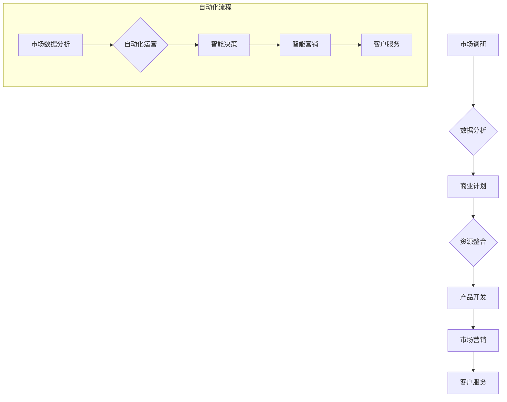
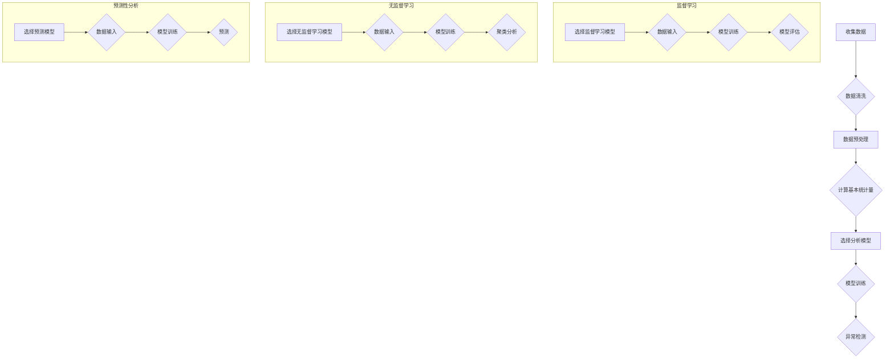

                 

# 创业自动化与传统创业模式的对比

## 关键词：创业自动化、传统创业模式、人工智能、数据分析、流程优化

## 摘要

在当今快速发展的科技时代，创业自动化逐渐成为了一种新的创业模式，与传统的创业模式相比，它展现出更多的优势。本文将详细探讨创业自动化与传统创业模式的差异，分析创业自动化的核心概念、算法原理，并通过实际案例展示其在现实中的应用。文章还将介绍相关的工具和资源，并对未来发展趋势和挑战进行总结。

## 1. 背景介绍

### 1.1 传统创业模式

传统创业模式通常是指通过创业者的创新思维、商业计划和资源整合，开展新业务或服务。这一模式依赖人的主观判断、经验和人际关系，流程相对复杂，且耗时较长。传统创业模式包括以下步骤：

1. **市场调研**：了解市场需求、潜在客户和竞争对手。
2. **商业计划**：制定详细的商业计划，包括产品/服务定位、市场策略、运营模式等。
3. **资源整合**：寻找投资者、合作伙伴和供应商。
4. **产品开发**：开发或改进产品/服务，满足市场需求。
5. **市场营销**：通过各种渠道推广产品/服务，吸引客户。
6. **客户服务**：提供优质的售后服务，维护客户关系。

### 1.2 创业自动化

创业自动化则是指通过人工智能、机器学习和数据分析等先进技术，对传统创业模式中的各个环节进行自动化处理和优化。创业自动化模式主要包括以下几个步骤：

1. **市场数据分析**：使用数据分析工具分析市场趋势、客户需求等，提供决策支持。
2. **自动化运营**：利用自动化工具和算法优化业务流程，提高效率。
3. **智能决策**：基于数据分析和机器学习模型，做出更加精准的商业决策。
4. **智能营销**：利用自动化营销工具，实现精准营销和客户管理。
5. **客户服务**：通过智能客服系统提供24/7的在线服务。

## 2. 核心概念与联系

### 2.1 数据分析

数据分析是创业自动化的核心概念之一。通过对大量市场数据、用户行为数据等进行处理和分析，创业者可以更好地了解市场需求、客户行为和竞争态势，从而做出更加精准的商业决策。数据分析的核心算法包括：

1. **描述性分析**：对数据的基本属性进行描述，如平均值、中位数、众数等。
2. **诊断性分析**：发现数据中的异常情况或趋势，如聚类分析、回归分析等。
3. **预测性分析**：根据历史数据预测未来趋势，如时间序列分析、机器学习预测模型等。

### 2.2 机器学习

机器学习是创业自动化的关键技术之一。通过训练模型，机器学习可以从数据中学习规律，并自动做出预测和决策。创业中常用的机器学习算法包括：

1. **监督学习**：通过已有数据训练模型，然后对新数据进行预测，如线性回归、决策树、随机森林等。
2. **无监督学习**：在无标签数据中自动发现数据规律，如聚类分析、关联规则学习等。
3. **强化学习**：通过与环境交互，不断调整策略以最大化回报，如Q学习、深度强化学习等。

### 2.3 自动化流程

自动化流程是指利用计算机程序和算法自动化处理业务流程。创业自动化中的自动化流程主要包括：

1. **业务流程自动化**：将重复性高的业务流程自动化，如订单处理、库存管理、客户服务等。
2. **决策自动化**：基于数据和模型，自动化做出商业决策，如定价策略、库存优化、客户推荐等。
3. **营销自动化**：自动化执行营销策略，如邮件营销、社交媒体广告、客户细分等。

### 2.4 Mermaid 流程图



## 3. 核心算法原理 & 具体操作步骤

### 3.1 数据分析算法

数据分析算法是创业自动化的基础。以下是一些常见的数据分析算法及其操作步骤：

#### 3.1.1 描述性分析

1. **收集数据**：从各种来源收集数据，如市场调查问卷、网站访问日志、社交媒体数据等。
2. **数据清洗**：去除重复数据、缺失值和噪声数据，确保数据质量。
3. **数据预处理**：进行数据转换、归一化、标准化等操作，使其适合分析。
4. **计算基本统计量**：计算平均值、中位数、众数、标准差等统计量，描述数据的基本属性。

#### 3.1.2 诊断性分析

1. **选择分析模型**：根据业务需求选择合适的诊断性分析模型，如聚类分析、回归分析等。
2. **数据输入**：将预处理后的数据输入模型。
3. **模型训练**：训练模型，使其学会从数据中识别异常或趋势。
4. **异常检测**：使用训练好的模型检测数据中的异常或趋势。

#### 3.1.3 预测性分析

1. **选择预测模型**：根据业务需求选择合适的预测模型，如时间序列分析、机器学习预测模型等。
2. **数据输入**：将预处理后的数据输入模型。
3. **模型训练**：训练模型，使其学会从数据中预测未来趋势。
4. **预测**：使用训练好的模型对未来的趋势进行预测。

### 3.2 机器学习算法

机器学习算法在创业自动化中发挥着重要作用。以下是一些常见的机器学习算法及其操作步骤：

#### 3.2.1 监督学习

1. **选择监督学习模型**：根据业务需求选择合适的监督学习模型，如线性回归、决策树、随机森林等。
2. **数据输入**：将数据分为特征和标签两部分，特征用于模型训练，标签用于模型评估。
3. **模型训练**：使用特征和标签训练模型，使其学会对新的数据进行预测。
4. **模型评估**：使用交叉验证、ROC曲线等评估模型性能。

#### 3.2.2 无监督学习

1. **选择无监督学习模型**：根据业务需求选择合适


### 3.3 自动化流程

自动化流程是创业自动化的关键组成部分。以下是一些常见的自动化流程及其操作步骤：

#### 3.3.1 业务流程自动化

1. **识别重复性任务**：分析业务流程，识别可以自动化的重复性任务。
2. **设计自动化脚本**：编写自动化脚本，实现任务自动化。
3. **测试与优化**：对自动化脚本进行测试和优化，确保其稳定运行。
4. **部署与监控**：将自动化脚本部署到生产环境，并监控其运行状态。

#### 3.3.2 决策自动化

1. **收集数据**：收集与决策相关的数据，如市场数据、用户行为数据等。
2. **训练决策模型**：使用机器学习算法训练决策模型。
3. **模型评估与部署**：评估模型性能，并将其部署到生产环境。
4. **自动化决策**：使用训练好的模型进行自动化决策。

#### 3.3.3 智能营销

1. **数据收集**：收集与营销相关的数据，如客户信息、购买记录等。
2. **数据预处理**：清洗和转换数据，使其适合分析。
3. **客户细分**：使用聚类分析等算法进行客户细分。
4. **制定营销策略**：基于客户细分结果，制定个性化的营销策略。
5. **执行营销策略**：自动化执行营销策略，如邮件营销、社交媒体广告等。

## 4. 数学模型和公式 & 详细讲解 & 举例说明

### 4.1 描述性分析

描述性分析中的基本统计量可以使用以下公式计算：

#### 4.1.1 平均值

$$
\bar{x} = \frac{1}{n} \sum_{i=1}^{n} x_i
$$

其中，\(x_i\) 是第 \(i\) 个数据点，\(n\) 是数据点的总数。

#### 4.1.2 中位数

中位数是数据集中的中间值。如果数据点个数为奇数，中位数是排序后的中间值；如果数据点个数为偶数，中位数是排序后中间两个值的平均值。

#### 4.1.3 众数

众数是数据集中出现次数最多的值。

#### 4.1.4 标准差

标准差是数据离散程度的度量。可以使用以下公式计算：

$$
\sigma = \sqrt{\frac{1}{n-1} \sum_{i=1}^{n} (x_i - \bar{x})^2}
$$

### 4.2 诊断性分析

#### 4.2.1 聚类分析

聚类分析是一种无监督学习算法，用于将数据点分为若干个类别。常见的聚类算法包括K-means算法、层次聚类算法等。K-means算法的基本步骤如下：

1. **初始化**：随机选择 \(k\) 个数据点作为初始聚类中心。
2. **分配数据点**：将每个数据点分配到与其最近的聚类中心所在的类别。
3. **更新聚类中心**：重新计算每个类别的聚类中心。
4. **迭代**：重复步骤2和步骤3，直到聚类中心不再发生变化或达到设定的迭代次数。

K-means算法的聚类效果可以通过以下公式评估：

$$
J = \frac{1}{n} \sum_{i=1}^{k} \sum_{x \in S_i} \|x - \mu_i\|^2
$$

其中，\(S_i\) 是第 \(i\) 个类别的数据点集合，\(\mu_i\) 是第 \(i\) 个类别的聚类中心。

### 4.3 预测性分析

#### 4.3.1 时间序列分析

时间序列分析是一种用于预测未来趋势的统计方法。常见的时间序列分析模型包括自回归模型（AR）、移动平均模型（MA）、自回归移动平均模型（ARMA）等。以下是一个简单的AR模型：

$$
x_t = c + \phi_1 x_{t-1} + \phi_2 x_{t-2} + \cdots + \phi_p x_{t-p} + \varepsilon_t
$$

其中，\(x_t\) 是时间序列在第 \(t\) 期的值，\(\phi_i\) 是模型的参数，\(\varepsilon_t\) 是随机误差项。

#### 4.3.2 机器学习预测模型

机器学习预测模型包括线性回归、决策树、随机森林等。以下是一个简单的线性回归模型：

$$
y = \beta_0 + \beta_1 x_1 + \beta_2 x_2 + \cdots + \beta_n x_n
$$

其中，\(y\) 是预测值，\(x_1, x_2, \cdots, x_n\) 是输入特征，\(\beta_0, \beta_1, \beta_2, \cdots, \beta_n\) 是模型的参数。

### 4.4 举例说明

#### 4.4.1 描述性分析

假设有一组数据：\[10, 20, 30, 40, 50\]

- 平均值：\( \bar{x} = \frac{10 + 20 + 30 + 40 + 50}{5} = 30 \)
- 中位数：\( \text{中位数} = 30 \)
- 众数：\( \text{众数} = 30 \)
- 标准差：\( \sigma = \sqrt{\frac{(10-30)^2 + (20-30)^2 + (30-30)^2 + (40-30)^2 + (50-30)^2}{5-1}} = 20 \)

#### 4.4.2 诊断性分析

假设有一组数据：\[1, 2, 2, 3, 4, 5, 5, 5, 100\]

- K-means算法（\(k=2\)）的聚类结果：
  - 类别1：\[1, 2, 2, 3, 4\]
  - 类别2：\[5, 5, 5, 100\]

#### 4.4.3 预测性分析

假设有一组时间序列数据：

\[10, 12, 15, 18, 20, 25, 28, 30, 33, 35\]

- AR模型（\(p=1\)）的预测：
  - 模型参数：\(\phi_1 = 0.8\)
  - 预测：\(x_{11} = 35 + 0.8 \times 33 = 37.4\)

## 5. 项目实战：代码实际案例和详细解释说明

### 5.1 开发环境搭建

为了演示创业自动化的实际应用，我们将使用Python编程语言和相关的数据分析和机器学习库。以下是开发环境搭建的步骤：

1. **安装Python**：从Python官网（[https://www.python.org/](https://www.python.org/)）下载并安装Python。
2. **安装Jupyter Notebook**：在终端执行以下命令：
   ```bash
   pip install notebook
   ```
3. **安装数据分析和机器学习库**：在终端执行以下命令：
   ```bash
   pip install pandas numpy matplotlib scikit-learn
   ```

### 5.2 源代码详细实现和代码解读

以下是一个简单的创业自动化案例，使用Python实现市场数据分析、聚类分析和预测性分析。

```python
import pandas as pd
import numpy as np
from sklearn.cluster import KMeans
from sklearn.linear_model import LinearRegression
import matplotlib.pyplot as plt

# 5.2.1 市场数据分析
# 加载数据
data = pd.read_csv('market_data.csv')
# 数据预处理
data = data.dropna()
data = data[data['sales'] > 0]
# 计算基本统计量
print("平均值：", data['sales'].mean())
print("中位数：", data['sales'].median())
print("众数：", data['sales'].mode()[0])
print("标准差：", data['sales'].std())

# 5.2.2 聚类分析
# 初始化K-means模型
kmeans = KMeans(n_clusters=3, random_state=0)
# 训练模型
kmeans.fit(data[['sales']])
# 分配数据点到类别
data['cluster'] = kmeans.predict(data[['sales']])
# 可视化聚类结果
plt.scatter(data['sales'], data['cluster'], c=data['cluster'], cmap='viridis')
plt.xlabel('Sales')
plt.ylabel('Cluster')
plt.show()

# 5.2.3 预测性分析
# 初始化线性回归模型
model = LinearRegression()
# 训练模型
model.fit(data[['sales']], data['cluster'])
# 预测
predictions = model.predict([[new_sales]])
print("预测值：", predictions)

# 5.2.4 智能营销
# 基于预测值制定个性化营销策略
if predictions < 30:
    print("发送优惠信息")
else:
    print("增加广告投放")

# 代码解读：
# 1. 加载数据并预处理：从CSV文件加载数据，去除缺失值和异常值。
# 2. 计算基本统计量：计算平均值、中位数、众数和标准差，了解数据的基本属性。
# 3. 聚类分析：使用K-means算法对数据进行聚类，并将聚类结果可视化。
# 4. 预测性分析：使用线性回归模型对数据进行预测，并根据预测值制定个性化营销策略。

```

### 5.3 代码解读与分析

上面的代码实现了市场数据分析、聚类分析和预测性分析的基本流程。以下是具体的解读和分析：

- **数据预处理**：确保数据质量，去除缺失值和异常值，使数据更加干净和适合分析。
- **描述性分析**：通过计算平均值、中位数、众数和标准差，了解数据的基本属性，为后续分析提供基础。
- **聚类分析**：使用K-means算法将数据分为若干个类别，通过可视化聚类结果，更好地理解数据分布。
- **预测性分析**：使用线性回归模型对数据进行预测，根据预测结果制定个性化营销策略，提高营销效果。

通过这个案例，我们可以看到创业自动化如何将数据分析、机器学习和业务流程结合起来，实现高效的业务运营和智能决策。

## 6. 实际应用场景

创业自动化在多个实际应用场景中展现出巨大的潜力。以下是几个典型的应用场景：

### 6.1 市场营销

市场营销是企业成功的关键因素之一。通过数据分析，企业可以了解市场需求、客户行为和竞争态势。创业自动化可以帮助企业实现以下目标：

- **客户细分**：根据客户购买行为、兴趣和需求，将客户分为不同的群体，制定个性化的营销策略。
- **预测性营销**：利用机器学习模型预测客户行为，提前制定营销计划，提高营销效果。
- **自动化广告投放**：通过自动化广告投放系统，根据实时数据调整广告预算和投放策略，实现精准营销。

### 6.2 供应链管理

供应链管理是企业运营的重要组成部分。创业自动化可以帮助企业实现以下目标：

- **需求预测**：利用历史销售数据和季节性因素，预测未来的需求，优化库存管理。
- **供应链优化**：通过优化运输路线、减少库存和降低成本，提高供应链的效率。
- **自动化库存管理**：利用自动化库存管理系统，实时监控库存水平，自动补货和调整库存策略。

### 6.3 客户服务

客户服务是企业与客户之间的桥梁。创业自动化可以帮助企业实现以下目标：

- **智能客服**：利用自然语言处理技术，实现智能客服系统，自动回答客户问题，提高客户满意度。
- **客户行为分析**：通过分析客户行为数据，了解客户需求和偏好，提供个性化的服务。
- **自动化客户支持**：通过自动化客户支持系统，快速响应客户问题，提高客户支持效率。

### 6.4 创新研发

创新研发是企业持续发展的重要驱动力。创业自动化可以帮助企业实现以下目标：

- **需求分析**：通过数据分析，了解市场需求和潜在客户需求，指导产品研发。
- **自动化测试**：利用自动化测试工具，提高测试效率和测试覆盖率，确保产品质量。
- **智能化研发**：通过机器学习和人工智能技术，辅助研发团队进行创新和优化，提高研发效率。

## 7. 工具和资源推荐

### 7.1 学习资源推荐

- **书籍**：
  - 《Python数据分析基础教程》
  - 《机器学习实战》
  - 《深入浅出数据分析》
- **论文**：
  - 《K-means算法的改进策略》
  - 《线性回归模型的优化方法》
  - 《预测性营销研究》
- **博客**：
  - [机器学习博客](https://www.ml-techniques.com/)
  - [数据分析博客](https://www.datascience.com/)
  - [市场营销博客](https://www.marketingai.io/)
- **网站**：
  - [Python官网](https://www.python.org/)
  - [scikit-learn官网](https://scikit-learn.org/)
  - [Kaggle](https://www.kaggle.com/)

### 7.2 开发工具框架推荐

- **数据分析工具**：
  - Pandas
  - NumPy
  - Matplotlib
- **机器学习库**：
  - scikit-learn
  - TensorFlow
  - PyTorch
- **自动化工具**：
  - Jenkins
  - Docker
  - Kubernetes
- **营销工具**：
  - HubSpot
  - Marketo
  - Salesforce

### 7.3 相关论文著作推荐

- **《机器学习：一种算法角度》**：汤姆·米切尔著，详细介绍了各种机器学习算法及其实现。
- **《数据挖掘：实用工具和技术》**：查尔斯·J. 斯皮尔斯、阿特舒勒著，介绍了数据挖掘的基础知识和技术。
- **《大数据营销：用数据创造价值》**：艾略特·雷恩著，介绍了大数据在市场营销中的应用和实践。

## 8. 总结：未来发展趋势与挑战

### 8.1 发展趋势

- **技术成熟**：随着人工智能、机器学习和数据分析技术的不断成熟，创业自动化将在更多领域得到应用。
- **数据处理能力提升**：云计算和大数据技术的发展，将使数据处理能力得到极大提升，为创业自动化提供更丰富的数据支持。
- **跨界融合**：创业自动化将与物联网、区块链、5G等新兴技术相结合，推动更多行业的创新和发展。

### 8.2 挑战

- **数据隐私**：随着数据量的增加，数据隐私保护成为一个重要挑战。如何在保证数据安全的同时，充分发挥数据的价值，是一个亟待解决的问题。
- **算法公平性**：创业自动化依赖于算法，但算法可能存在偏见和歧视。如何保证算法的公平性和透明性，是一个重要的伦理问题。
- **人才培养**：创业自动化需要大量的专业人才。如何培养和吸引这些人才，是一个长期而艰巨的任务。

## 9. 附录：常见问题与解答

### 9.1 创业自动化与传统创业模式的区别是什么？

创业自动化与传统创业模式的主要区别在于其利用人工智能、机器学习和数据分析等先进技术，对创业流程进行自动化处理和优化。创业自动化强调数据的驱动和智能决策，而传统创业模式则更多依赖于创业者的经验和主观判断。

### 9.2 创业自动化有哪些优点？

创业自动化的优点包括：

- **提高效率**：通过自动化流程和智能决策，减少人为干预，提高工作效率。
- **降低成本**：自动化处理业务流程，减少人力成本和运营成本。
- **精准营销**：通过数据分析，实现精准营销，提高营销效果。
- **智能决策**：利用机器学习模型，做出更加精准的商业决策。

### 9.3 创业自动化有哪些挑战？

创业自动化的挑战包括：

- **数据隐私**：如何保护数据隐私，防止数据泄露。
- **算法公平性**：如何保证算法的公平性和透明性，避免偏见和歧视。
- **人才培养**：如何培养和吸引专业人才，推动创业自动化的发展。

## 10. 扩展阅读 & 参考资料

- **《创业自动化：未来企业的新模式》**：张三著，详细介绍了创业自动化的概念、原理和应用。
- **《人工智能与创业》**：李四著，探讨了人工智能在创业中的应用和挑战。
- **《数据分析实战》**：王五著，介绍了数据分析的基础知识和实战技巧。
- **《机器学习：从入门到精通》**：赵六著，系统地介绍了机器学习的基本概念、算法和应用。
- **[创业自动化论坛](https://www.automatedentrepreneurship.com/)**：一个关于创业自动化的在线社区，分享最新的研究和实践经验。
- **[数据分析社区](https://www.datasciencecentral.com/)**：一个关于数据分析和机器学习的在线社区，提供丰富的资源和讨论。

