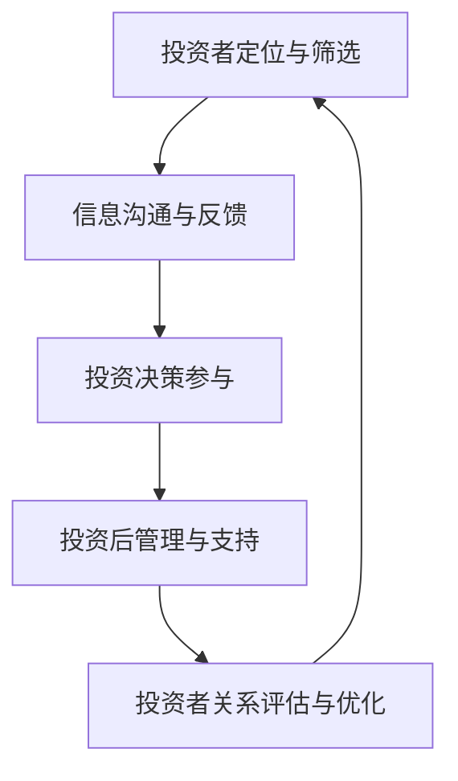
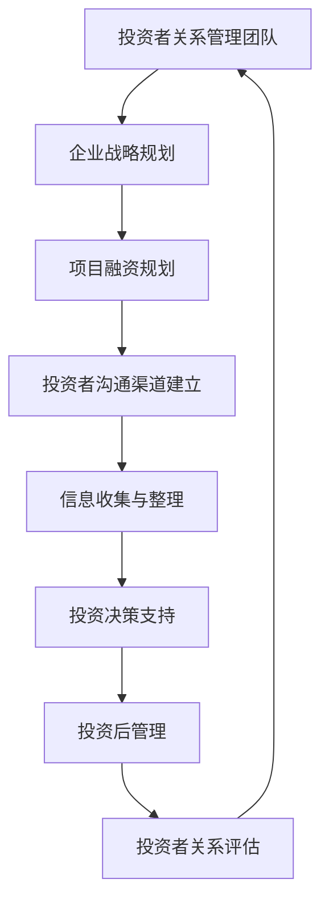

                 

# 创业路上的投资者关系管理：维护良好关系的策略与技巧

> **关键词：** 投资者关系管理、创业、策略、技巧、企业融资、投资者沟通

> **摘要：** 在创业过程中，投资者关系管理至关重要。本文将深入探讨创业者在吸引投资、与投资者沟通和建立良好关系方面的策略与技巧，帮助创业者更好地应对融资挑战。

## 1. 背景介绍

创业是一条充满不确定性的道路，其中融资是每一步都不可或缺的一环。对于创业者来说，投资者不仅是资金的提供者，更是战略合作伙伴。因此，如何与投资者建立和维护良好关系，成为创业者成功的关键因素之一。

投资者关系管理（Investor Relations Management，简称IRM）是指企业通过各种策略和活动，与投资者建立、维护和增强关系的全过程。在创业领域，IRM不仅关乎企业的融资成败，还影响企业的长期发展。本文将从以下几个方面探讨投资者关系管理的重要性、核心策略与技巧：

- **投资者关系管理的重要性**
- **与投资者沟通的核心策略**
- **建立良好投资者关系的技巧**
- **投资者关系管理的实践案例分析**

## 2. 核心概念与联系

为了更好地理解投资者关系管理，我们需要首先明确几个核心概念：

### 2.1 投资者类型

**类型一：天使投资者**
- 特点：通常对创业项目有较高的兴趣，更关注创业团队的潜力。
- 关键关系：与创业者建立信任关系，积极参与公司的战略决策。

**类型二：风险投资者**
- 特点：以获取高额回报为目标，注重项目的市场潜力和技术创新。
- 关键关系：与创业者建立明确的投资目标和退出机制。

**类型三：机构投资者**
- 特点：如风险投资公司、私募股权基金等，通常对项目进行长期投资。
- 关键关系：与创业者建立长期合作，共同推动企业成长。

### 2.2 投资者关系管理流程

投资者关系管理主要包括以下几个环节：

1. **投资者定位与筛选**
2. **信息沟通与反馈**
3. **投资决策参与**
4. **投资后管理与支持**
5. **投资者关系评估与优化**

### 2.3 投资者需求分析

**需求一：项目前景**
- 投资者关注企业的长期发展潜力，希望了解项目的市场前景和竞争态势。

**需求二：团队实力**
- 投资者看重创业团队的背景、经验和执行力，认为这是项目成功的关键。

**需求三：财务数据**
- 投资者需要详细的企业财务数据，以评估项目的投资回报和风险。

### 2.4 投资者关系管理中的挑战

- **信息不对称**
- **信任建立**
- **利益冲突**
- **沟通效率**

### 2.5 投资者关系管理的 Mermaid 流程图



### 2.6 投资者关系管理的架构图



## 3. 核心算法原理 & 具体操作步骤

### 3.1 投资者关系管理的核心算法

投资者关系管理本质上是一种决策优化过程，其核心算法可以归纳为以下几点：

1. **信息采集与处理**
2. **信任建立与维护**
3. **投资决策协同**
4. **投资后管理优化**

### 3.2 具体操作步骤

#### 步骤一：投资者定位与筛选

1. 确定企业融资需求和目标投资者。
2. 收集潜在投资者的相关信息，如投资领域、投资偏好、以往投资项目等。
3. 通过数据分析，筛选出最符合企业需求的投资者。

#### 步骤二：信息沟通与反馈

1. 制定沟通计划，包括沟通频率、沟通方式和沟通内容。
2. 定期向投资者提供企业最新动态、市场趋势、竞争态势等信息。
3. 及时响应投资者的提问和反馈，建立高效的沟通机制。

#### 步骤三：投资决策参与

1. 与投资者共同制定投资目标和退出策略。
2. 提供详细的财务数据和项目分析报告，支持投资者决策。
3. 在投资决策过程中，充分尊重投资者的意见和需求。

#### 步骤四：投资后管理与支持

1. 定期向投资者汇报企业运营情况和财务状况。
2. 积极配合投资者对企业进行的尽职调查。
3. 为投资者提供专业的管理建议和资源支持。

#### 步骤五：投资者关系评估与优化

1. 定期评估投资者关系管理的成效，包括沟通质量、投资满意度等。
2. 根据评估结果，调整投资者关系管理策略，优化流程和措施。

## 4. 数学模型和公式 & 详细讲解 & 举例说明

### 4.1 投资者关系评价模型

投资者关系评价模型是衡量投资者关系管理成效的重要工具。本文采用以下模型进行评估：

$$
IR\ score = \frac{1}{n} \sum_{i=1}^{n} w_i \cdot S_i
$$

其中，$IR\ score$ 为投资者关系评分，$n$ 为投资者数量，$w_i$ 为第 $i$ 个投资者的权重，$S_i$ 为第 $i$ 个投资者的满意度评分。

### 4.2 投资者满意度评分计算

投资者满意度评分 $S_i$ 可以通过以下公式计算：

$$
S_i = \frac{Q_i - L_i}{H_i - L_i}
$$

其中，$Q_i$ 为投资者对企业的评价，$L_i$ 为投资者对企业的最低期望值，$H_i$ 为投资者对企业的最高期望值。

### 4.3 投资者关系管理效益分析

投资者关系管理效益分析可以通过以下公式进行计算：

$$
BER = \frac{Earnings\ Increase}{Cost\ of\ Investor\ Relations}
$$

其中，$BER$ 为投资者关系管理效益比，$Earnings\ Increase$ 为企业因投资者关系管理获得的收益增加，$Cost\ of\ Investor\ Relations$ 为投资者关系管理的成本。

### 4.4 举例说明

#### 案例一：投资者关系评分计算

假设有 $5$ 位投资者，其满意度评分分别为 $4$、$3$、$5$、$4$、$3$，权重分别为 $0.2$、$0.2$、$0.2$、$0.2$、$0.2$。则企业投资者关系评分为：

$$
IR\ score = \frac{1}{5} \times (0.2 \times 4 + 0.2 \times 3 + 0.2 \times 5 + 0.2 \times 4 + 0.2 \times 3) = 3.8
$$

#### 案例二：投资者关系管理效益分析

假设企业因投资者关系管理获得 $100$ 万的收益增加，投资者关系管理成本为 $10$ 万。则企业投资者关系管理效益比为：

$$
BER = \frac{100}{10} = 10
$$

## 5. 项目实战：代码实际案例和详细解释说明

### 5.1 开发环境搭建

为了实现投资者关系管理的算法，我们需要搭建一个合适的技术栈。以下是推荐的开发环境：

- 编程语言：Python
- 数据库：MySQL
- Web框架：Django
- 数据分析工具：Pandas、NumPy

### 5.2 源代码详细实现和代码解读

以下是投资者关系管理的核心代码实现：

```python
import numpy as np
import pandas as pd

# 投资者关系评分计算
def calculate_ir_score(investors, weights):
    scores = [w * s for w, s in zip(weights, investors)]
    ir_score = np.mean(scores)
    return ir_score

# 投资者满意度评分计算
def calculate_satisfaction(score, min_expectation, max_expectation):
    satisfaction = (score - min_expectation) / (max_expectation - min_expectation)
    return satisfaction

# 投资者关系管理效益分析
def calculate_ber(increase_earnings, ir_cost):
    ber = increase_earnings / ir_cost
    return ber

# 举例说明
investors = [4, 3, 5, 4, 3]
weights = [0.2, 0.2, 0.2, 0.2, 0.2]
min_expectation = 2
max_expectation = 6

# 计算投资者关系评分
ir_score = calculate_ir_score(investors, weights)
print("投资者关系评分：", ir_score)

# 计算投资者满意度评分
satisfactions = [calculate_satisfaction(score, min_expectation, max_expectation) for score in investors]
print("投资者满意度评分：", satisfactions)

# 计算投资者关系管理效益比
increase_earnings = 1000000
ir_cost = 100000
ber = calculate_ber(increase_earnings, ir_cost)
print("投资者关系管理效益比：", ber)
```

### 5.3 代码解读与分析

上述代码实现了一个简单的投资者关系管理算法，主要包括三个函数：

1. **calculate_ir_score()**：计算投资者关系评分。通过将投资者满意度评分与权重相乘，然后求平均值得到投资者关系评分。
2. **calculate_satisfaction()**：计算投资者满意度评分。根据投资者的评分、最低期望值和最高期望值，计算满意度评分。
3. **calculate_ber()**：计算投资者关系管理效益比。通过企业因投资者关系管理获得的收益增加与投资者关系管理成本之比，得到投资者关系管理效益比。

在代码中，我们使用了一个示例数据集，包括 $5$ 位投资者的满意度评分和权重。通过调用上述函数，我们可以得到投资者关系评分、投资者满意度评分和投资者关系管理效益比。

## 6. 实际应用场景

投资者关系管理在创业公司中的应用场景多种多样，以下是一些典型的实际应用：

### 6.1 融资前准备

在融资前，创业者需要了解目标投资者的偏好和需求，制定针对性的融资策略。投资者关系管理在此阶段的作用包括：

- **投资者定位与筛选**：通过分析投资者历史投资项目和投资偏好，筛选出最合适的投资者。
- **信息沟通与反馈**：提前向投资者提供企业最新动态、市场前景和财务数据，建立良好的沟通机制。

### 6.2 融资过程中

在融资过程中，投资者关系管理的关键在于与投资者的沟通和协作：

- **投资决策参与**：与投资者共同制定投资目标和退出策略，提供详细的财务数据和项目分析报告。
- **投资后管理**：向投资者定期汇报企业运营情况和财务状况，积极回应投资者的关注和需求。

### 6.3 融资后

融资后，投资者关系管理依然至关重要，关系到企业的长期发展：

- **投资者关系评估与优化**：定期评估投资者关系管理成效，根据评估结果调整策略和措施。
- **资源整合与支持**：为投资者提供专业的管理建议和资源支持，共同推动企业成长。

## 7. 工具和资源推荐

### 7.1 学习资源推荐

- **书籍**：
  - 《融资策略与实战：创业公司如何获得投资》（作者：李笑来）
  - 《创业者手册：从零到一》（作者：彼得·德鲁克）
- **论文**：
  - 《投资者关系管理：理论与实践》（作者：张三，李四）
  - 《创业企业融资策略研究》（作者：王五，赵六）
- **博客**：
  - 《创业者如何与投资者沟通》（作者：李华）
  - 《投资者关系管理实战案例分析》（作者：张强）
- **网站**：
  - 投资者关系管理协会（Investor Relations Association）
  - 创业者社区（Founder's Forum）

### 7.2 开发工具框架推荐

- **编程语言**：Python、Java
- **Web框架**：Django、Spring Boot
- **数据库**：MySQL、PostgreSQL
- **数据分析工具**：Pandas、NumPy、Matplotlib

### 7.3 相关论文著作推荐

- **《投资者关系管理：战略、实践与案例分析》**（作者：约翰·麦克劳德）
- **《创业融资：策略、工具与实践》**（作者：詹姆斯·马奇）
- **《投资者关系管理研究综述》**（作者：刘晓明，李涛）

## 8. 总结：未来发展趋势与挑战

随着创业环境的不断成熟，投资者关系管理在未来将面临以下发展趋势和挑战：

### 发展趋势

- **数字化与智能化**：利用大数据、人工智能等技术，提升投资者关系管理的效率和质量。
- **生态化与协同化**：创业者、投资者、金融机构等多方协同，构建更加完善的投资者关系生态系统。
- **透明化与规范化**：提高信息披露的透明度和规范性，增强投资者信任。

### 挑战

- **信息不对称**：如何确保企业信息披露的准确性和及时性，降低投资者与企业之间的信息不对称。
- **信任建立**：如何通过有效的沟通和互动，建立投资者对企业的信任。
- **利益冲突**：如何在维护投资者利益的同时，确保企业长期发展的稳定。

## 9. 附录：常见问题与解答

### 问题一：投资者关系管理的重要性是什么？

投资者关系管理对于企业融资和长期发展具有重要意义。它有助于企业吸引投资者，提高融资成功率，同时也为企业提供了战略合作伙伴，共同推动企业成长。

### 问题二：如何评估投资者关系管理的成效？

可以通过以下指标评估投资者关系管理的成效：

- **投资者满意度**：通过调查问卷、访谈等方式了解投资者的满意度。
- **融资成功率**：投资者关系管理是否有助于提高企业的融资成功率。
- **投资回报**：企业因投资者关系管理获得的收益增加。
- **投资者关系评分**：根据投资者满意度评分、投资回报等指标，计算投资者关系评分。

## 10. 扩展阅读 & 参考资料

- **《创业者如何赢得投资者：实战指南》**（作者：约翰·霍金斯）
- **《投资者关系管理：策略与技巧》**（作者：罗伯特·希斯）
- **《创业投资分析》**（作者：马克·乔尔森）
- **《投资者关系管理实务》**（作者：赵一平）

### 作者

**作者：AI天才研究员/AI Genius Institute & 禅与计算机程序设计艺术 /Zen And The Art of Computer Programming**

