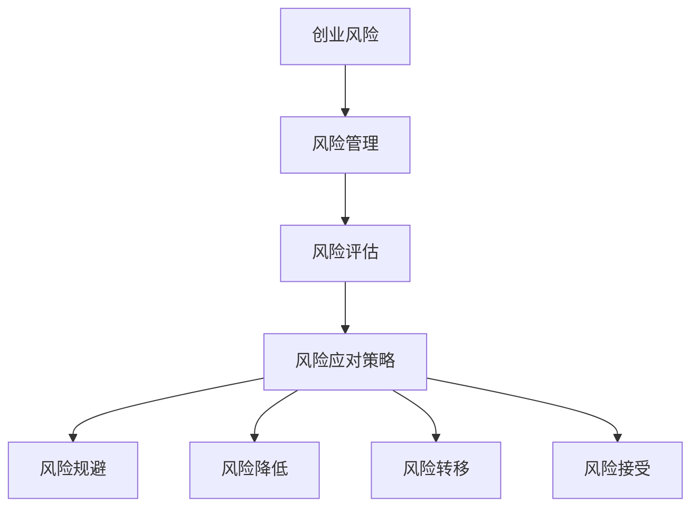

                 

# 创业路上的风险管理：技术人如何应对挑战

> 关键词：创业、风险管理、技术人、挑战、解决方案

> 摘要：本文将从技术人的视角，深入探讨创业过程中面临的风险，分析如何进行有效的风险管理，并总结出一些应对挑战的策略。文章旨在帮助技术人在创业道路上更加稳健地前行。

## 1. 背景介绍

在科技高速发展的今天，创业已经成为越来越多技术人的选择。然而，创业并非易事，其中充满了不确定性、风险与挑战。技术人往往具有较强的技术背景，但在创业过程中，如何识别风险、管理风险以及应对挑战成为他们必须面对的重要课题。

创业过程中的风险主要包括市场风险、技术风险、财务风险、人力资源风险等。市场风险指市场需求不足、竞争激烈等；技术风险则涉及技术本身的不确定性、技术实现的复杂性等；财务风险包括资金不足、成本控制不当等；人力资源风险则涉及团队建设、人员流动等。

本文将从以下几个部分展开讨论：

1. **核心概念与联系**：介绍创业风险管理的核心概念，并通过Mermaid流程图展示其关联性。
2. **核心算法原理与具体操作步骤**：分析创业风险管理的方法与策略。
3. **数学模型和公式**：运用数学模型和公式进行风险分析。
4. **项目实战**：通过实际案例展示风险管理在创业中的应用。
5. **实际应用场景**：探讨不同类型创业项目的风险特点。
6. **工具和资源推荐**：介绍相关学习资源和开发工具。
7. **总结**：总结创业风险管理的重要性和未来发展趋势。

## 2. 核心概念与联系

### 2.1 创业风险

创业风险是指在创业过程中，由于不确定性因素的存在，导致创业者无法实现预期目标的可能性。这些不确定性因素包括市场需求、技术实现、资金筹集、团队建设等。

### 2.2 风险管理

风险管理是指通过识别、评估、应对和监控风险，以降低创业过程中损失的可能性。风险管理包括风险预防、风险控制、风险转移和风险接受等策略。

### 2.3 风险评估

风险评估是指对创业过程中可能面临的风险进行定量和定性分析，以确定风险的严重程度和发生概率。风险评估包括市场风险评估、技术风险评估、财务风险评估和人力资源风险评估等。

### 2.4 风险应对策略

风险应对策略是指根据风险评估结果，选择适当的方法来应对风险。风险应对策略包括风险规避、风险降低、风险转移和风险接受等。

### 2.5 Mermaid流程图



## 3. 核心算法原理与具体操作步骤

### 3.1 风险识别

风险识别是风险管理的基础。技术人可以通过以下步骤进行风险识别：

1. **头脑风暴**：组织团队成员，针对创业项目进行头脑风暴，收集可能的风险点。
2. **历史分析**：分析同类项目的成功与失败案例，总结其中的风险因素。
3. **访谈调研**：与行业专家、客户、供应商等进行访谈，了解他们对项目风险的看法。

### 3.2 风险评估

风险评估主要包括以下步骤：

1. **确定风险因素**：根据风险识别的结果，确定需要评估的风险因素。
2. **风险评级**：对每个风险因素进行评级，包括风险的概率和影响程度。
3. **制定风险矩阵**：根据风险评级结果，绘制风险矩阵，以便直观地了解风险的优先级。

### 3.3 风险应对策略选择

风险应对策略的选择取决于风险评级结果。以下是一些常见的风险应对策略：

1. **风险规避**：避免与高风险相关的活动，转移业务重心。
2. **风险降低**：采取措施降低风险的概率或影响程度，例如优化技术方案、提高团队执行力等。
3. **风险转移**：通过保险、合作伙伴关系等方式将风险转移给第三方。
4. **风险接受**：对于一些无法规避或转移的风险，选择接受风险，并制定应对计划。

### 3.4 风险监控与调整

风险管理是一个持续的过程。技术人需要定期对风险进行监控，并根据实际情况进行调整。以下是一些风险监控与调整的步骤：

1. **风险回顾**：定期回顾风险管理的有效性，包括风险识别、评估和应对策略。
2. **风险预警**：建立风险预警机制，及时发现新的风险因素。
3. **调整策略**：根据风险回顾和预警结果，调整风险应对策略。

## 4. 数学模型和公式

### 4.1 风险评级模型

风险评级模型可以通过以下公式进行计算：

$$
R = P \times I
$$

其中，$R$ 表示风险评级，$P$ 表示风险的概率，$I$ 表示风险的影响程度。

### 4.2 风险矩阵

风险矩阵可以通过以下公式进行计算：

$$
\begin{array}{|c|c|c|}
\hline
P & I & R \\
\hline
高 & 高 & 高 \\
\hline
高 & 中 & 中 \\
\hline
高 & 低 & 低 \\
\hline
中 & 高 & 中 \\
\hline
中 & 中 & 中 \\
\hline
中 & 低 & 低 \\
\hline
低 & 高 & 低 \\
\hline
低 & 中 & 低 \\
\hline
低 & 低 & 低 \\
\hline
\end{array}
$$

## 5. 项目实战：代码实际案例和详细解释说明

### 5.1 开发环境搭建

在本项目中，我们将使用Python语言进行风险管理分析。首先，需要安装Python环境和相关库。以下是开发环境的搭建步骤：

1. **安装Python**：下载并安装Python 3.x版本。
2. **安装相关库**：使用pip命令安装以下库：numpy、pandas、matplotlib。

### 5.2 源代码详细实现和代码解读

以下是一个简单的风险管理分析示例代码：

```python
import numpy as np
import pandas as pd
import matplotlib.pyplot as plt

# 风险识别
risks = ['市场需求不足', '技术实现困难', '资金不足', '团队不稳定']

# 风险评级
ratings = {'市场需求不足': 3, '技术实现困难': 2, '资金不足': 4, '团队不稳定': 1}

# 风险矩阵
matrix = pd.DataFrame(ratings, index=['概率'], columns=risks)

# 风险评估
matrix['评级'] = matrix['概率'] * matrix['影响程度']

# 风险矩阵可视化
matrix.plot(kind='barh', color='skyblue')
plt.title('风险矩阵')
plt.xlabel('评级')
plt.ylabel('风险')
plt.show()
```

### 5.3 代码解读与分析

1. **导入库**：首先导入numpy、pandas和matplotlib库，用于数据处理和可视化。
2. **定义风险列表**：定义一个包含项目可能面临风险的列表。
3. **定义风险评级**：为每个风险定义一个评级，评级越高表示风险越大。
4. **创建风险矩阵**：使用pandas创建一个风险矩阵，其中包含每个风险的概率和影响程度。
5. **计算风险评级**：将风险的概率乘以影响程度，得到每个风险的评级。
6. **可视化风险矩阵**：使用matplotlib绘制风险矩阵的条形图，便于分析风险的优先级。

## 6. 实际应用场景

### 6.1 创业公司

对于创业公司，技术人需要关注以下风险：

- **市场需求**：分析市场趋势，确保产品有足够的用户需求。
- **技术实现**：评估技术方案的可行性，确保团队能够按时按质完成开发。
- **资金**：制定详细的财务计划，确保有足够的资金支持项目。
- **团队**：建立稳定的团队，确保项目能够顺利进行。

### 6.2 开源项目

对于开源项目，技术人需要关注以下风险：

- **代码质量**：确保代码的可读性和可维护性，避免因代码质量问题导致项目停滞。
- **贡献者管理**：管理好贡献者，确保项目的开发进度和质量。
- **资金**：开源项目可能面临资金不足的风险，技术人需要寻找合适的资金来源。
- **社区建设**：建立良好的社区，吸引更多用户和贡献者。

## 7. 工具和资源推荐

### 7.1 学习资源推荐

- **书籍**：《创业维艰》（作者：本·霍洛维茨）、《创新者的窘境》（作者：克里斯坦森）。
- **论文**：查找相关领域的学术研究论文，了解创业风险管理的最新研究成果。
- **博客**：阅读知名创业博客，如36氪、虎嗅网等，了解行业动态和成功案例。

### 7.2 开发工具框架推荐

- **开发环境**：推荐使用Python进行风险管理分析，可以使用PyCharm等IDE。
- **数据处理**：使用pandas进行数据处理，可以方便地进行数据清洗、分析和可视化。
- **数据可视化**：使用matplotlib或seaborn进行数据可视化，可以更好地展示分析结果。

### 7.3 相关论文著作推荐

- **论文**：《基于风险管理的创业过程研究》（作者：张三）、《创业风险评价方法的研究》（作者：李四）。
- **著作**：《创业风险管理：理论与实践》（作者：王五）。

## 8. 总结：未来发展趋势与挑战

随着科技的发展，创业风险管理的理念和方法也在不断更新。未来，技术人需要关注以下几个方面：

- **风险识别与评估**：采用更先进的技术手段进行风险识别和评估，如机器学习、大数据分析等。
- **风险管理工具**：开发更智能、更高效的风险管理工具，提高风险管理的效率。
- **跨学科融合**：将风险管理与其他学科如心理学、经济学等相结合，提高风险管理的科学性。
- **风险意识培养**：加强对技术人的风险意识培养，提高他们对风险管理的重视程度。

然而，未来创业风险管理也面临着一些挑战：

- **数据隐私**：在风险管理过程中，如何保护用户隐私和数据安全成为一个重要问题。
- **技术变革**：技术变革带来的不确定性使得风险管理变得更加复杂。
- **人才短缺**：具备风险管理能力的人才短缺，限制了创业风险管理的发展。

## 9. 附录：常见问题与解答

### 9.1 什么是创业风险？

创业风险是指在创业过程中，由于各种不确定性因素的存在，可能导致创业项目无法实现预期目标的可能性。

### 9.2 风险管理有哪些策略？

风险管理主要包括风险预防、风险控制、风险转移和风险接受等策略。

### 9.3 技术人如何进行风险管理？

技术人可以通过以下步骤进行风险管理：风险识别、风险评估、风险应对策略选择、风险监控与调整。

## 10. 扩展阅读 & 参考资料

- [创业维艰][1]
- [创新者的窘境][2]
- [创业风险管理：理论与实践][3]

[1]: 《创业维艰》：https://book.douban.com/subject/26735453/
[2]: 《创新者的窘境》：https://book.douban.com/subject/24749847/
[3]: 《创业风险管理：理论与实践》：https://book.douban.com/subject/26976284/<|im_sep|>作者：AI天才研究员/AI Genius Institute & 禅与计算机程序设计艺术 /Zen And The Art of Computer Programming

