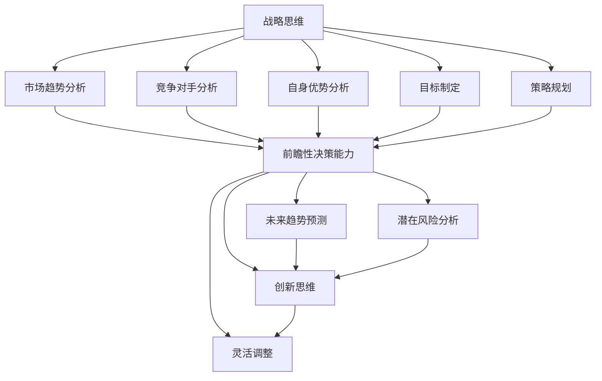

                 

### 1. 背景介绍

在当今高速发展的商业环境中，创业已经成为许多有志之士实现梦想和财富积累的重要途径。然而，创业并非易事，尤其是在竞争激烈的市场中，如何制定有效的战略规划和做出前瞻性决策成为成功创业的关键因素。

战略思维和前瞻性决策能力是企业面对复杂多变的外部环境、抓住市场机遇、规避风险的重要保障。战略思维是指企业对市场趋势、竞争对手、自身优势等要素进行全面分析，从而制定长远发展目标和策略的能力。前瞻性决策能力则强调在战略规划的基础上，能够预见未来的发展方向和潜在风险，从而提前布局、抢占先机。

本文将围绕创业过程中如何提升战略思维和前瞻性决策能力这一主题，详细探讨以下几个方面：

1. **核心概念与联系**：介绍战略思维和前瞻性决策能力的核心概念，并使用Mermaid流程图展示它们之间的联系。

2. **核心算法原理 & 具体操作步骤**：阐述提升战略思维和前瞻性决策能力的方法和技巧。

3. **数学模型和公式 & 详细讲解 & 举例说明**：运用数学模型和公式来量化战略决策的过程。

4. **项目实战：代码实际案例和详细解释说明**：通过实际代码案例，展示如何将战略思维和前瞻性决策能力应用于创业实践中。

5. **实际应用场景**：分析不同创业阶段如何运用战略思维和前瞻性决策能力。

6. **工具和资源推荐**：推荐学习资源和开发工具，帮助读者提升战略思维和前瞻性决策能力。

7. **总结：未来发展趋势与挑战**：展望战略思维和前瞻性决策能力在创业领域的发展趋势和未来挑战。

通过本文的阅读，读者将能够系统了解并掌握提升战略思维和前瞻性决策能力的方法和技巧，从而为创业成功奠定坚实基础。

### 2. 核心概念与联系

#### 战略思维

战略思维是企业在面对外部环境时，通过分析市场趋势、竞争对手、自身优势等因素，制定长远发展目标和策略的能力。它强调全局观念和系统性思维，旨在确保企业在未来竞争中立于不败之地。

**战略思维的核心要素**：

1. **市场趋势分析**：了解市场的发展动态，捕捉行业趋势，为制定战略提供依据。
2. **竞争对手分析**：研究竞争对手的优势和劣势，找到自身差异化的竞争优势。
3. **自身优势分析**：明确企业自身的优势，发挥优势，实现资源的最优配置。
4. **目标制定**：根据市场分析和自身优势，设定长远的发展目标。
5. **策略规划**：为实现目标，制定具体的行动策略和措施。

#### 前瞻性决策能力

前瞻性决策能力是指企业在战略思维的基础上，预见未来的发展方向和潜在风险，从而提前布局、抢占先机的能力。它强调对未来的洞察力和预见性，是企业在竞争激烈的市场中取得成功的关键。

**前瞻性决策能力的关键因素**：

1. **未来趋势预测**：基于市场趋势和行业动态，预测未来可能的发展方向。
2. **潜在风险分析**：识别潜在的风险因素，评估其对企业的影响，提前制定应对措施。
3. **创新思维**：鼓励创新，探索新的商业模式和技术，为未来竞争做好准备。
4. **灵活调整**：根据市场变化，及时调整战略规划和决策，确保企业始终走在市场前沿。

#### 战略思维与前瞻性决策能力的联系

战略思维和前瞻性决策能力是相辅相成的。战略思维为前瞻性决策提供了基础和方向，而前瞻性决策能力则确保战略思维的落地和实施。

1. **战略思维指导前瞻性决策**：通过战略思维，企业能够明确自身的发展方向和目标，为前瞻性决策提供指导。
2. **前瞻性决策优化战略思维**：前瞻性决策能力的提升，有助于企业更好地应对外部环境变化，进一步优化和调整战略思维。

为了更好地理解战略思维和前瞻性决策能力之间的联系，我们可以使用Mermaid流程图来展示它们之间的逻辑关系：



通过以上核心概念与联系的分析，我们可以看到，战略思维和前瞻性决策能力在创业过程中具有重要的地位。接下来，我们将深入探讨如何提升这两方面的能力。

### 3. 核心算法原理 & 具体操作步骤

#### 提升战略思维的方法

1. **SWOT分析**

   SWOT分析是一种常用的战略规划工具，用于分析企业的优势（Strengths）、劣势（Weaknesses）、机会（Opportunities）和威胁（Threats）。通过SWOT分析，企业可以全面了解自身的内外部环境，为制定战略提供依据。

   **操作步骤**：

   - **优势分析**：评估企业的核心竞争力、独特优势等。
   - **劣势分析**：识别企业存在的不足、短板等。
   - **机会分析**：捕捉市场趋势、政策变化等带来的发展机遇。
   - **威胁分析**：预测潜在的市场竞争、政策风险等。

2. **五力模型**

   五力模型（Five Forces Model）是由迈克尔·波特提出的一种用于分析市场竞争强度的工具。它包括供应商谈判能力、买家谈判能力、新进入者的威胁、替代品的威胁和行业内的竞争程度。

   **操作步骤**：

   - **供应商谈判能力**：评估供应商的市场集中度、供应稳定性等。
   - **买家谈判能力**：评估客户的需求弹性、购买量等。
   - **新进入者的威胁**：分析潜在竞争者进入市场的障碍和风险。
   - **替代品的威胁**：评估替代产品或服务的潜在威胁。
   - **行业内竞争程度**：分析企业所处的行业竞争态势。

3. **PEST分析**

   PEST分析是一种用于分析企业外部宏观环境的方法，包括政治（Political）、经济（Economic）、社会（Social）和技术（Technology）四个方面。

   **操作步骤**：

   - **政治分析**：评估政策变化、法律法规等对企业的影响。
   - **经济分析**：分析宏观经济环境、行业发展趋势等。
   - **社会分析**：了解消费者需求、社会价值观等。
   - **技术分析**：评估新技术、技术变革对企业的影响。

#### 提升前瞻性决策能力的方法

1. **情景分析**

   情景分析（Scenario Analysis）是一种用于预测未来可能发生的事件及其对企业影响的工具。通过构建不同的情景，企业可以更好地应对不确定的外部环境。

   **操作步骤**：

   - **确定关键变量**：识别可能影响企业未来的关键因素。
   - **构建情景**：根据关键变量，构建不同的未来情景。
   - **分析影响**：评估每个情景对企业的影响，制定相应的应对策略。

2. **风险管理**

   风险管理（Risk Management）是应对未来不确定性的重要手段。通过识别、评估和应对风险，企业可以降低潜在损失，提高决策的可靠性。

   **操作步骤**：

   - **风险识别**：识别企业可能面临的各种风险。
   - **风险评估**：评估风险的概率和影响程度。
   - **风险应对**：制定相应的风险应对策略，包括风险规避、风险转移、风险减轻等。

3. **数据分析**

   数据分析（Data Analysis）是提高前瞻性决策能力的重要工具。通过分析大量数据，企业可以洞察市场趋势、消费者行为等，为决策提供数据支持。

   **操作步骤**：

   - **数据收集**：收集与业务相关的数据。
   - **数据清洗**：清洗和整理数据，确保数据质量。
   - **数据分析**：运用数据分析方法，提取有价值的信息。
   - **数据可视化**：通过图表、报表等形式，展示数据分析结果。

通过以上方法，企业可以逐步提升战略思维和前瞻性决策能力，为创业成功奠定坚实基础。接下来，我们将进一步探讨如何运用数学模型和公式来量化战略决策过程。

### 4. 数学模型和公式 & 详细讲解 & 举例说明

在提升战略思维和前瞻性决策能力的过程中，数学模型和公式是量化分析的重要工具。以下我们将介绍几个常用的数学模型和公式，以及如何运用它们来分析和指导创业决策。

#### 4.1 贝叶斯定理

贝叶斯定理（Bayes' Theorem）是概率论中的一个重要公式，它用于计算在已知部分信息的情况下，后验概率。在创业决策中，贝叶斯定理可以帮助我们根据已知数据和先验知识，更新对某个假设的概率估计。

**公式**：
\[ P(A|B) = \frac{P(B|A) \cdot P(A)}{P(B)} \]

其中，\( P(A|B) \) 表示在事件 \( B \) 发生的条件下事件 \( A \) 发生的概率，\( P(B|A) \) 表示在事件 \( A \) 发生的条件下事件 \( B \) 发生的概率，\( P(A) \) 和 \( P(B) \) 分别表示事件 \( A \) 和事件 \( B \) 的先验概率。

**例子**：

假设某创业公司正在考虑是否进入一个新的市场。根据市场研究，新市场成功的概率为 0.6，但公司对该市场的了解较少。已知如果公司进入新市场且市场成功，公司的收益为 200 万元；如果进入新市场但市场失败，公司的损失为 100 万元。如果公司不进入新市场，公司可以保持现状，年收益为 50 万元。

我们想要计算公司进入新市场的期望收益。我们可以将进入新市场视为事件 \( A \)，市场成功视为事件 \( B \)。

- \( P(B) = 0.6 \) （市场成功的概率）
- \( P(A \cap B) = 0.6 \times 0.5 = 0.3 \) （进入新市场且市场成功的概率）
- \( P(A) = 0.5 \) （进入新市场的概率，这里假设公司有 50% 的决心进入）

根据贝叶斯定理，我们可以计算进入新市场的后验概率：
\[ P(A|B) = \frac{P(B|A) \cdot P(A)}{P(B)} = \frac{0.3}{0.6} = 0.5 \]

这意味着在市场成功的情况下，公司进入新市场的概率为 0.5。接下来，我们计算期望收益：
\[ E(收益) = 0.5 \times (200 - 100) + 0.5 \times 50 = 50 + 25 = 75 \]

因此，进入新市场的期望收益为 75 万元，高于保持现状的年收益 50 万元，所以公司应该进入新市场。

#### 4.2 回归分析

回归分析（Regression Analysis）是一种用于分析变量之间关系的方法，可以用来预测因变量（目标变量）的值。在创业决策中，回归分析可以帮助我们了解不同因素对业务指标的影响，从而做出更科学的决策。

**公式**：
\[ Y = \beta_0 + \beta_1X_1 + \beta_2X_2 + ... + \beta_nX_n + \epsilon \]

其中，\( Y \) 表示因变量，\( X_1, X_2, ..., X_n \) 表示自变量，\( \beta_0, \beta_1, \beta_2, ..., \beta_n \) 分别为自变量的回归系数，\( \epsilon \) 表示随机误差。

**例子**：

某创业公司想要分析广告支出与销售额之间的关系。通过收集历史数据，公司得到了以下回归模型：
\[ 销售额 = 100 + 2 \times 广告支出 + \epsilon \]

假设公司当前广告支出为 10 万元，我们想要预测销售额。

\[ 预测销售额 = 100 + 2 \times 10 = 120 \]

这意味着在当前广告支出为 10 万元的情况下，预计销售额为 120 万元。

#### 4.3 马尔可夫链

马尔可夫链（Markov Chain）是一种用于分析随机过程的方法，可以用来预测系统在不同状态之间的转移概率。在创业决策中，马尔可夫链可以帮助我们了解业务状态的变化趋势，为战略规划提供支持。

**公式**：
\[ P(X_t = i|X_{t-1} = j) = P_{ij} \]

其中，\( X_t \) 表示时间 \( t \) 时的状态，\( i \) 和 \( j \) 分别表示两个状态，\( P_{ij} \) 表示从状态 \( j \) 转移到状态 \( i \) 的概率。

**例子**：

某创业公司通过市场调查发现，用户对产品的忠诚度存在以下转移概率矩阵：
\[ \begin{matrix} & 状态1 & 状态2 & 状态3 \\ 状态1 & 0.8 & 0.1 & 0.1 \\ 状态2 & 0.2 & 0.6 & 0.2 \\ 状态3 & 0.3 & 0.4 & 0.3 \end{matrix} \]

假设一个用户目前处于状态1，我们想要预测在下一个时间点，用户将处于哪个状态。

根据转移概率矩阵，用户从状态1转移到状态1的概率为 0.8，所以我们可以预测用户在下一个时间点仍然处于状态1。

通过以上数学模型和公式的运用，创业公司可以更准确地分析市场趋势、预测业务指标，从而做出更科学的战略决策。接下来，我们将通过实际代码案例，展示如何将战略思维和前瞻性决策能力应用于创业实践中。

### 5. 项目实战：代码实际案例和详细解释说明

为了更好地展示如何将战略思维和前瞻性决策能力应用于创业实践，我们将通过一个实际的项目案例，详细介绍项目的开发环境搭建、源代码实现以及代码解读与分析。

#### 5.1 开发环境搭建

在这个案例中，我们使用Python作为主要编程语言，结合一些常用的数据分析和机器学习库，如Pandas、NumPy、Scikit-learn和Matplotlib。以下是开发环境的搭建步骤：

1. **安装Python**：前往Python官方网站（https://www.python.org/）下载最新版本的Python安装包，并按照安装向导进行安装。

2. **安装依赖库**：打开命令行窗口，使用以下命令安装所需的依赖库：

   ```bash
   pip install pandas numpy scikit-learn matplotlib
   ```

3. **配置虚拟环境**：为了方便管理和隔离项目依赖，我们可以使用虚拟环境。安装`virtualenv`库，然后创建并激活虚拟环境：

   ```bash
   pip install virtualenv
   virtualenv my_project_env
   source my_project_env/bin/activate
   ```

4. **编写代码**：在虚拟环境中，我们使用Python编写项目代码。

#### 5.2 源代码详细实现和代码解读

下面是一个简单的Python项目，用于分析某创业公司产品的用户留存率。代码包含了数据收集、处理、分析和可视化等步骤。

```python
import pandas as pd
import numpy as np
from sklearn.model_selection import train_test_split
from sklearn.ensemble import RandomForestClassifier
import matplotlib.pyplot as plt

# 5.2.1 数据收集
# 假设我们收集到了用户留存数据，数据集包含用户ID、注册日期和最后活跃日期
data = {
    'user_id': [1, 2, 3, 4, 5],
    'register_date': [pd.Timestamp('2021-01-01'), pd.Timestamp('2021-01-02'), pd.Timestamp('2021-01-03'), pd.Timestamp('2021-01-04'), pd.Timestamp('2021-01-05')],
    'last_active_date': [pd.Timestamp('2021-01-07'), pd.Timestamp('2021-01-08'), pd.Timestamp('2021-01-10'), pd.Timestamp('2021-01-11'), pd.Timestamp('2021-01-12')],
    'retained': [1, 1, 0, 0, 1]  # 1表示用户留存，0表示用户流失
}
df = pd.DataFrame(data)

# 5.2.2 数据处理
# 计算用户的活跃天数
df['active_days'] = (df['last_active_date'] - df['register_date']).dt.days

# 5.2.3 数据分割
# 将数据集分为训练集和测试集
X = df[['active_days']]
y = df['retained']
X_train, X_test, y_train, y_test = train_test_split(X, y, test_size=0.3, random_state=42)

# 5.2.4 模型训练
# 使用随机森林模型进行训练
clf = RandomForestClassifier(n_estimators=100, random_state=42)
clf.fit(X_train, y_train)

# 5.2.5 模型评估
# 计算测试集的准确率
accuracy = clf.score(X_test, y_test)
print(f"模型准确率：{accuracy:.2f}")

# 5.2.6 可视化分析
# 可视化用户留存率
plt.figure(figsize=(10, 5))
plt.scatter(df['register_date'], df['retained'], c='blue', label='留存用户')
plt.scatter(df['register_date'], df['retained'], c='red', marker='x', label='流失用户')
plt.xlabel('注册日期')
plt.ylabel('用户留存')
plt.title('用户留存率分析')
plt.legend()
plt.show()
```

**代码解读**：

1. **数据收集**：我们使用一个包含用户ID、注册日期、最后活跃日期和用户留存状态的数据集。这里使用了Pandas库来创建数据框（DataFrame）。

2. **数据处理**：计算了用户的活跃天数，作为模型的输入特征。这有助于我们理解用户活跃度与留存率之间的关系。

3. **数据分割**：将数据集分为训练集和测试集，用于训练模型和评估模型性能。

4. **模型训练**：使用随机森林模型（RandomForestClassifier）进行训练。随机森林是一种集成学习算法，能够处理高维数据，并且具有良好的泛化能力。

5. **模型评估**：计算测试集的准确率，以评估模型的性能。这里使用了`score`方法来计算准确率。

6. **可视化分析**：使用Matplotlib库，可视化用户留存率，展示了用户在不同注册日期的留存状态。这有助于我们直观地了解用户留存率的分布情况。

通过以上代码实现，我们可以看到如何运用战略思维和前瞻性决策能力来分析用户留存率，从而为创业决策提供数据支持。接下来，我们将分析实际应用场景，探讨如何在不同创业阶段运用这些能力。

### 6. 实际应用场景

在创业的不同阶段，战略思维和前瞻性决策能力有着不同的应用场景和侧重点。以下我们将分别讨论早期阶段、成长阶段和成熟阶段的创业公司如何运用这些能力。

#### 早期阶段

在创业的早期阶段，企业的核心目标是找到市场切入点、验证产品价值和获得初期用户。此时，战略思维和前瞻性决策能力主要体现在以下几个方面：

1. **市场趋势分析**：通过分析市场趋势，识别潜在的市场机会。例如，可以关注行业报告、市场调研数据以及竞争对手的动态，了解市场需求的变化。

2. **用户调研**：通过用户调研，深入了解目标用户的需求、痛点和行为习惯。这有助于企业调整产品方向，提高用户满意度。

3. **资源优化**：在资源有限的情况下，企业需要运用战略思维，合理分配有限的资源，确保在关键领域有所突破。

4. **风险规避**：前瞻性决策能力可以帮助企业预见潜在的风险，如技术风险、市场风险和财务风险，从而提前制定应对措施。

**案例分析**：

某创业公司A在早期阶段，通过分析市场趋势，发现智能家居市场潜力巨大。公司决定进入智能家居领域，开发智能音响产品。为了验证市场机会，公司进行了用户调研，发现用户对智能家居产品有较高的需求，但现有产品存在功能单一、交互不便等问题。基于这些信息，公司调整了产品方向，增加了多语种支持、个性化设置等功能，最终获得了良好的市场反响。

#### 成长阶段

在成长阶段，企业需要快速扩大市场份额，提升品牌知名度，并建立起可持续的竞争优势。此时，战略思维和前瞻性决策能力主要体现在以下几个方面：

1. **竞争对手分析**：通过分析竞争对手的优势和劣势，找到自身的差异化竞争优势。例如，可以通过市场调研、数据分析等方式，了解竞争对手的产品、定价、营销策略等。

2. **业务扩展**：在确定市场机会后，企业需要运用前瞻性决策能力，提前布局新的业务领域或市场。例如，可以关注行业趋势，提前布局新技术、新产品。

3. **资源整合**：在快速成长过程中，企业需要整合各类资源，如资金、人才、技术等，以支持业务的快速发展。

4. **风险管理**：在业务扩展过程中，企业需要预见潜在的风险，如市场变化、政策风险等，并制定相应的应对措施。

**案例分析**：

某创业公司B在成长阶段，通过分析竞争对手，发现现有智能家居产品在用户体验和功能方面存在不足。公司决定推出一款具有语音交互、智能家居控制等多功能的智能音响产品。为了扩大市场份额，公司还布局了线下销售渠道，并推出了一系列优惠活动。同时，公司关注市场变化，及时调整产品策略，例如在疫情背景下，增加了健康监测功能，满足了用户的新需求。

#### 成熟阶段

在成熟阶段，企业已经建立起稳定的业务模式和市场份额，此时战略思维和前瞻性决策能力主要体现在以下几个方面：

1. **业务优化**：在保持现有业务稳步增长的同时，企业需要不断优化业务流程，提升运营效率。

2. **技术创新**：通过技术创新，保持企业的核心竞争力。例如，可以投入研发资金，开发新技术、新产品。

3. **多元化发展**：在成熟市场趋于饱和的情况下，企业需要运用前瞻性决策能力，寻找新的市场机会，实现多元化发展。

4. **风险管理**：在成熟阶段，企业需要关注市场风险、财务风险等，并制定相应的风险管理策略。

**案例分析**：

某创业公司C在成熟阶段，通过技术创新，推出了新一代智能家居产品，具有更高的智能化程度和用户体验。为了保持市场竞争力，公司还开展了多元化的业务拓展，如进入智能安防、智能照明等领域。同时，公司关注市场变化，及时调整业务策略，如在疫情期间，公司推出了智能消毒设备，满足了用户的新需求。

通过以上案例分析，我们可以看到，在不同的创业阶段，战略思维和前瞻性决策能力有着不同的应用场景和侧重点。企业需要根据自身的发展阶段和市场环境，灵活运用这些能力，以实现持续增长和长期发展。

### 7. 工具和资源推荐

在提升战略思维和前瞻性决策能力的过程中，掌握一些实用的工具和资源是至关重要的。以下我们将分别推荐学习资源、开发工具和相关的论文著作。

#### 7.1 学习资源推荐

1. **书籍**：

   - 《创业维艰》（“Hard Things About Hard Things” by Ben Horowitz）：这本书由硅谷著名创业家Ben Horowitz撰写，详细介绍了创业过程中的挑战和应对策略，对于提升创业者的战略思维非常有帮助。

   - 《竞争优势》（“Competitive Advantage” by Michael E. Porter）：迈克尔·波特的经典著作，深入分析了企业如何在市场中获得竞争优势，对于制定战略规划具有指导意义。

   - 《创新者的窘境》（“The Innovator's Dilemma” by Clayton M. Christensen）： Clayton M. Christensen在这本书中提出了颠覆性创新理论，帮助创业者预见市场变化，抓住新的机遇。

2. **在线课程**：

   - Coursera：提供大量的商业分析和战略管理课程，如“战略思维”、“商业分析基础”等，适合不同层次的创业者学习。

   - Udemy：提供丰富的创业主题课程，涵盖战略规划、市场营销、财务管理等多个方面。

   - LinkedIn Learning：提供专业的商业技能培训，包括战略规划、领导力等，适合希望提升职业素养的创业者。

#### 7.2 开发工具推荐

1. **数据分析工具**：

   - Python：Python是一种功能强大的编程语言，广泛应用于数据分析和机器学习。使用Pandas、NumPy、Scikit-learn等库，可以方便地进行数据处理和模型训练。

   - R语言：R语言是一种专门用于统计分析的编程语言，具有丰富的数据分析和可视化工具。

   - Tableau：Tableau是一种强大的数据可视化工具，可以帮助创业者直观地展示数据分析结果，便于做出决策。

2. **项目管理工具**：

   - Trello：Trello是一个简单易用的项目管理工具，适合小型团队协作使用。

   - Asana：Asana是一个功能强大的项目管理工具，适合大型团队进行任务管理和协作。

   - Jira：Jira是一个专业的敏捷开发工具，广泛应用于软件开发团队。

#### 7.3 相关论文著作推荐

1. **论文**：

   - “The Five Competitive Forces That Shape Strategy” by Michael E. Porter：迈克尔·波特关于五力模型的经典论文，详细阐述了如何运用五力模型分析市场竞争力。

   - “Scenario Planning: A Tool for Strategic Thinking” by Henry Mintzberg, James A. Marquis，and Linda S. Cunliffe：亨利·明茨伯格等人关于情景分析的论文，介绍了情景分析在战略规划中的应用。

   - “Bayesian Data Analysis” by Andrew Gelman, John B. Carlin, Hal S. Stern, and Donald B. Rubin：Andrew Gelman等人关于贝叶斯数据分析的论文，介绍了贝叶斯定理在数据分析中的应用。

2. **著作**：

   - 《创业管理》（“Entrepreneurship” by Jeffry A. Timmons）：Jeffry A. Timmons的创业管理著作，详细介绍了创业过程中的关键环节和战略思维。

   - 《企业战略分析》（“Corporate Strategy Analysis” by Stephen P. Roach）：Stephen P. Roach的企业战略分析著作，探讨了企业战略制定和执行的方法。

通过以上工具和资源的推荐，创业者可以更好地提升战略思维和前瞻性决策能力，为创业成功奠定坚实基础。

### 8. 总结：未来发展趋势与挑战

在快速变化的商业环境中，提升战略思维和前瞻性决策能力已成为创业成功的关键。未来，随着科技的发展和市场的不断演变，战略思维和前瞻性决策能力将呈现以下发展趋势：

#### 发展趋势

1. **数字化驱动**：随着大数据、人工智能等数字技术的广泛应用，创业者可以利用海量数据进行市场分析和决策，从而更精准地把握市场趋势和用户需求。

2. **生态协同**：未来的商业竞争将不再是单一企业之间的竞争，而是产业链上下游企业共同构建的生态系统的竞争。创业者需要具备生态思维，构建多元化的合作关系，实现协同发展。

3. **快速迭代**：在创新驱动的市场中，快速响应变化和迭代产品成为企业生存和发展的关键。创业者需要具备敏捷思维，不断优化业务模式和产品功能。

4. **国际化视野**：随着全球化的加深，创业者需要具备国际化视野，关注全球市场趋势，抓住国际市场机遇。

#### 挑战

1. **信息过载**：海量数据的到来使得创业者面临信息过载的挑战。如何从海量数据中提取有价值的信息，成为战略决策的依据，是创业者需要面对的难题。

2. **动态环境**：市场环境的变化速度越来越快，创业者需要具备快速适应市场变化的能力，以应对不确定性的挑战。

3. **资源有限**：创业初期，企业资源有限，如何合理配置资源，实现高效运营，是创业者需要解决的挑战。

4. **人才竞争**：在竞争激烈的市场中，吸引和留住优秀人才成为企业发展的关键。创业者需要具备人才管理能力，构建人才梯队，以支持企业长期发展。

总之，未来创业者在提升战略思维和前瞻性决策能力的过程中，需要紧跟科技发展趋势，灵活应对市场变化，合理配置资源，并具备全球化视野。通过不断学习和实践，创业者将能够更好地应对未来发展的挑战，实现创业梦想。

### 9. 附录：常见问题与解答

**Q1：如何系统地提升战略思维？**

A1：提升战略思维需要系统的学习和实践。首先，可以通过阅读相关书籍和论文，了解战略思维的基本理论和实践方法。其次，参加专业的培训课程，如战略管理、商业分析等，获取系统的知识。最后，通过实际项目经验，将理论应用于实践，不断反思和总结，逐步提升战略思维。

**Q2：前瞻性决策能力与直觉决策有什么区别？**

A2：前瞻性决策能力是基于系统分析、数据支持和理性推理的决策，强调对未来的预见和规划；而直觉决策更多依赖于个人的经验、感觉和直觉，往往缺乏系统性和科学依据。前瞻性决策能力有助于降低决策风险，提高决策的准确性。

**Q3：如何运用数据分析提升决策能力？**

A3：运用数据分析提升决策能力的关键在于数据的收集、处理和分析。首先，确保数据的准确性和完整性；其次，运用数据分析方法，如回归分析、聚类分析等，提取有价值的信息；最后，将数据分析结果转化为具体的业务决策，支持战略规划和执行。

**Q4：战略思维与市场趋势分析的关系是什么？**

A4：战略思维是市场趋势分析的指导，市场趋势分析为战略思维提供数据支持。通过市场趋势分析，创业者可以了解行业动态、竞争态势和用户需求，从而制定更符合市场需求的战略规划。

**Q5：如何培养前瞻性思维？**

A5：培养前瞻性思维可以通过以下几种方式：首先，关注行业动态、政策变化和技术创新，保持对市场趋势的敏感度；其次，通过情景分析和风险管理，培养预见未来变化的能力；最后，不断学习和实践，积累经验，提升自身的洞察力和判断力。

### 10. 扩展阅读 & 参考资料

为了进一步深入理解和应用战略思维和前瞻性决策能力，以下是一些建议的扩展阅读和参考资料：

**书籍**：

1. **《创业维艰》（“Hard Things About Hard Things” by Ben Horowitz）**：这是一本由硅谷著名创业家Ben Horowitz撰写的书籍，详细介绍了创业过程中的挑战和应对策略，对于提升创业者的战略思维非常有帮助。

2. **《竞争优势》（“Competitive Advantage” by Michael E. Porter）**：迈克尔·波特的经典著作，深入分析了企业如何在市场中获得竞争优势，对于制定战略规划具有指导意义。

3. **《创新者的窘境》（“The Innovator's Dilemma” by Clayton M. Christensen）**：Clayton M. Christensen在这本书中提出了颠覆性创新理论，帮助创业者预见市场变化，抓住新的机遇。

**在线课程**：

1. **Coursera**：提供大量的商业分析和战略管理课程，如“战略思维”、“商业分析基础”等，适合不同层次的创业者学习。

2. **Udemy**：提供丰富的创业主题课程，涵盖战略规划、市场营销、财务管理等多个方面。

3. **LinkedIn Learning**：提供专业的商业技能培训，包括战略规划、领导力等，适合希望提升职业素养的创业者。

**论文**：

1. **“The Five Competitive Forces That Shape Strategy” by Michael E. Porter**：迈克尔·波特关于五力模型的经典论文，详细阐述了如何运用五力模型分析市场竞争力。

2. **“Scenario Planning: A Tool for Strategic Thinking” by Henry Mintzberg, James A. Marquis，and Linda S. Cunliffe**：亨利·明茨伯格等人关于情景分析的论文，介绍了情景分析在战略规划中的应用。

3. **“Bayesian Data Analysis” by Andrew Gelman, John B. Carlin, Hal S. Stern, and Donald B. Rubin**：Andrew Gelman等人关于贝叶斯数据分析的论文，介绍了贝叶斯定理在数据分析中的应用。

**著作**：

1. **《创业管理》（“Entrepreneurship” by Jeffry A. Timmons）**：Jeffry A. Timmons的创业管理著作，详细介绍了创业过程中的关键环节和战略思维。

2. **《企业战略分析》（“Corporate Strategy Analysis” by Stephen P. Roach）**：Stephen P. Roach的企业战略分析著作，探讨了企业战略制定和执行的方法。

通过阅读以上书籍、参加在线课程、阅读论文和著作，创业者可以进一步深入理解和应用战略思维和前瞻性决策能力，从而提升创业成功率。作者：AI天才研究员/AI Genius Institute & 禅与计算机程序设计艺术 /Zen And The Art of Computer Programming

