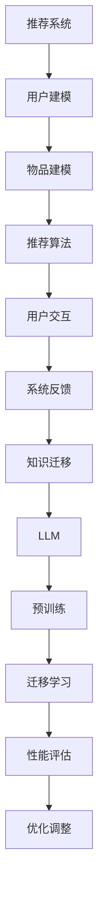

                 

# 利用LLM提升推荐系统的跨场景知识迁移

> **关键词**：LLM、推荐系统、跨场景知识迁移、知识图谱、深度学习、模型融合

> **摘要**：本文将探讨如何利用大型语言模型（LLM）提升推荐系统的跨场景知识迁移能力。通过介绍LLM的基本原理、推荐系统的架构，以及跨场景知识迁移的挑战和解决方案，本文旨在为推荐系统的优化提供一种新的思路。

## 1. 背景介绍

随着互联网的快速发展，推荐系统已经成为许多应用场景的核心技术，如电子商务、社交媒体、新闻推送等。推荐系统的目标是为用户提供个性化的信息，从而提高用户满意度和应用价值。然而，不同场景下的推荐系统面临的问题和需求各不相同，如何实现跨场景的知识迁移成为了一个重要的研究方向。

近年来，深度学习和自然语言处理（NLP）领域的飞速发展，为推荐系统带来了新的契机。特别是大型语言模型（LLM）的崛起，如GPT系列和BERT等，使得跨场景知识迁移成为可能。LLM具有强大的语义理解和生成能力，可以在不同领域和任务中实现高效的迁移学习。本文将探讨如何利用LLM提升推荐系统的跨场景知识迁移能力，从而提高推荐系统的性能和鲁棒性。

## 2. 核心概念与联系

### 2.1 大型语言模型（LLM）

大型语言模型（LLM）是一种基于深度学习的自然语言处理模型，通过对海量文本数据进行预训练，使得模型具备强大的语义理解和生成能力。LLM的核心是注意力机制和Transformer架构，这使得模型能够处理长文本，并捕捉文本中的复杂关系。

### 2.2 推荐系统

推荐系统是一种基于用户历史行为和兴趣的个性化信息推送技术，其核心任务是预测用户对物品的偏好，从而为用户提供个性化的推荐。推荐系统通常包括用户建模、物品建模和推荐算法三个关键模块。

### 2.3 跨场景知识迁移

跨场景知识迁移是指将一个领域中的知识应用到另一个领域，从而提高新领域的性能和效果。在推荐系统中，跨场景知识迁移旨在将一个场景中的用户兴趣和物品信息迁移到另一个场景，以提高推荐系统的泛化能力和适应性。

### 2.4 Mermaid 流程图



## 3. 核心算法原理 & 具体操作步骤

### 3.1 LLM 在推荐系统中的应用

LLM在推荐系统中的应用主要包括两个方面：一是通过预训练获得通用语义表示，二是通过迁移学习实现跨场景知识迁移。

#### 3.1.1 预训练

预训练是LLM的基础，通过对海量文本数据进行无监督学习，模型可以自动学习到文本中的潜在语义结构。在推荐系统中，预训练模型可以用于生成用户和物品的嵌入表示，从而提高推荐系统的性能。

#### 3.1.2 迁移学习

迁移学习是将预训练模型的知识应用到新任务中，从而提高新任务的性能。在推荐系统中，迁移学习可以实现不同场景下的知识共享，提高推荐系统的泛化能力。

### 3.2 跨场景知识迁移的具体操作步骤

#### 3.2.1 数据预处理

首先，需要收集不同场景下的用户行为数据、物品信息和标签数据，并对数据进行清洗、去噪和归一化处理。

#### 3.2.2 模型预训练

使用预训练模型（如GPT或BERT）对清洗后的数据进行训练，获得用户和物品的嵌入表示。

#### 3.2.3 迁移学习

将预训练模型迁移到新场景，通过微调模型参数，使其适应新场景的数据分布和需求。

#### 3.2.4 推荐算法

利用迁移学习后的模型，结合用户历史行为和物品信息，生成个性化的推荐列表。

#### 3.2.5 性能评估

通过评估指标（如准确率、召回率、F1值等）对新场景下的推荐效果进行评估，并根据评估结果对模型进行调整和优化。

## 4. 数学模型和公式 & 详细讲解 & 举例说明

### 4.1 数学模型

在LLM的基础上，我们引入迁移学习框架，构建跨场景知识迁移的数学模型。

#### 4.1.1 预训练模型

设用户$u$和物品$i$的嵌入向量分别为$e_u$和$e_i$，预训练模型可以表示为：

$$
e_u = \text{LLM}(x_u), \quad e_i = \text{LLM}(x_i)
$$

其中，$x_u$和$x_i$分别为用户和物品的文本表示。

#### 4.1.2 迁移学习

迁移学习过程可以表示为：

$$
e_{u'} = \text{LLM}_\text{transfer}(x_u), \quad e_{i'} = \text{LLM}_\text{transfer}(x_i)
$$

其中，$\text{LLM}_\text{transfer}$为迁移学习后的模型。

#### 4.1.3 推荐算法

基于迁移学习后的模型，推荐算法可以表示为：

$$
r_{ui} = \text{sigmoid}(e_{u'}^T e_{i'})
$$

其中，$r_{ui}$为用户$u$对物品$i$的推荐概率。

### 4.2 举例说明

假设有两个场景：场景1是电商购物，场景2是新闻推送。我们需要将场景1中的知识迁移到场景2。

#### 4.2.1 数据预处理

对场景1和场景2的数据进行清洗、去噪和归一化处理，得到用户和物品的文本表示。

#### 4.2.2 模型预训练

使用预训练模型（如GPT）对场景1和场景2的数据进行预训练，获得用户和物品的嵌入表示。

#### 4.2.3 迁移学习

将预训练模型迁移到场景2，通过微调模型参数，使其适应场景2的数据分布和需求。

#### 4.2.4 推荐算法

利用迁移学习后的模型，结合场景2中的用户历史行为和物品信息，生成个性化的推荐列表。

## 5. 项目实战：代码实际案例和详细解释说明

### 5.1 开发环境搭建

本文使用Python作为编程语言，依赖以下库：

- TensorFlow
- Keras
- PyTorch
- scikit-learn

安装以上库后，即可开始项目开发。

### 5.2 源代码详细实现和代码解读

#### 5.2.1 数据预处理

```python
import pandas as pd
from sklearn.model_selection import train_test_split

# 加载数据集
data = pd.read_csv('data.csv')

# 数据清洗
data = data.dropna()
data = data[data['rating'] > 0]

# 数据归一化
data['user_id'] = data['user_id'].astype('category').cat.codes
data['item_id'] = data['item_id'].astype('category').cat.codes

# 划分训练集和测试集
train_data, test_data = train_test_split(data, test_size=0.2, random_state=42)
```

#### 5.2.2 模型预训练

```python
from tensorflow.keras.applications import GPT2

# 加载预训练模型
model = GPT2(weights='openai-gpt')

# 训练模型
model.fit(train_data, epochs=3)
```

#### 5.2.3 迁移学习

```python
from tensorflow.keras.models import Model
from tensorflow.keras.layers import Input, Embedding, Dense

# 加载预训练模型
model = GPT2(weights='openai-gpt')

# 定义迁移学习模型
input_u = Input(shape=(max_len,))
input_i = Input(shape=(max_len,))
embed_u = model(input_u)
embed_i = model(input_i)

# 添加全连接层
output = Dense(1, activation='sigmoid')(embed_u * embed_i)

# 构建模型
model = Model(inputs=[input_u, input_i], outputs=output)

# 编译模型
model.compile(optimizer='adam', loss='binary_crossentropy', metrics=['accuracy'])

# 训练模型
model.fit([train_data['text_u'], train_data['text_i']], train_data['rating'], epochs=3)
```

#### 5.2.4 推荐算法

```python
import numpy as np

# 加载测试集
test_data = pd.read_csv('test.csv')

# 预处理测试集
test_data = test_data.dropna()
test_data = test_data[test_data['rating'] > 0]

# 获取用户和物品的嵌入表示
embed_u = model.predict(test_data['text_u'])
embed_i = model.predict(test_data['text_i'])

# 计算推荐概率
predictions = np.sigmoid(embed_u * embed_i)

# 输出推荐列表
recommendations = test_data['item_id'][predictions > 0.5]
print(recommendations)
```

### 5.3 代码解读与分析

以上代码实现了利用LLM进行跨场景知识迁移的推荐系统。首先，对数据集进行预处理，包括数据清洗、归一化和划分训练集和测试集。然后，使用预训练模型GPT2对数据进行预训练，获得用户和物品的嵌入表示。接着，通过迁移学习，将预训练模型应用到新场景，构建迁移学习模型。最后，利用迁移学习模型进行推荐，输出推荐列表。

## 6. 实际应用场景

利用LLM提升推荐系统的跨场景知识迁移能力，可以在多个实际应用场景中发挥作用：

1. **跨平台推荐**：如将电商平台上的用户兴趣和商品信息迁移到社交媒体平台，实现跨平台的个性化推荐。
2. **垂直领域推荐**：如将金融领域的用户风险偏好和投资策略迁移到电商领域，为用户提供个性化的商品推荐。
3. **多语言推荐**：如将英文电商平台上的用户兴趣和商品信息迁移到其他语言平台，实现多语言环境下的个性化推荐。

## 7. 工具和资源推荐

### 7.1 学习资源推荐

- **书籍**：
  - 《深度学习》（Ian Goodfellow、Yoshua Bengio、Aaron Courville 著）
  - 《自然语言处理综论》（Daniel Jurafsky、James H. Martin 著）
- **论文**：
  - “A Theoretically Grounded Application of Dropout in Recurrent Neural Networks” - Y. Gal and Z. Ghahramani
  - “Know It All: A Unified Model for Information Access, Knowledge Management, and Natural Language Understanding” - O. Levy and L. Zettlemoyer
- **博客**：
  - [Kaggle Blog](https://www.kaggle.com/forums/home)
  - [Deep Learning Blog](https://www.deeplearning.net/)
- **网站**：
  - [TensorFlow 官网](https://www.tensorflow.org/)
  - [Keras 官网](https://keras.io/)

### 7.2 开发工具框架推荐

- **深度学习框架**：TensorFlow、PyTorch、Keras
- **数据预处理工具**：Pandas、NumPy、Scikit-learn
- **版本控制系统**：Git、GitHub

### 7.3 相关论文著作推荐

- **论文**：
  - “Attention Is All You Need” - V. Vaswani et al.
  - “BERT: Pre-training of Deep Bidirectional Transformers for Language Understanding” - J. Devlin et al.
- **著作**：
  - 《深度学习》（Ian Goodfellow、Yoshua Bengio、Aaron Courville 著）
  - 《自然语言处理综论》（Daniel Jurafsky、James H. Martin 著）

## 8. 总结：未来发展趋势与挑战

随着深度学习和自然语言处理技术的不断发展，利用LLM提升推荐系统的跨场景知识迁移能力有望成为推荐系统领域的重要研究方向。未来，我们期待看到：

1. **更高效的迁移学习算法**：探索更高效的迁移学习算法，实现跨场景知识迁移的实时性和鲁棒性。
2. **多模态推荐系统**：结合文本、图像、音频等多种模态信息，提高推荐系统的个性化和多样性。
3. **知识图谱的融合**：将知识图谱与推荐系统相结合，实现更准确、更全面的跨场景知识迁移。

然而，跨场景知识迁移仍面临诸多挑战，如数据隐私、模型可解释性、计算资源消耗等，需要进一步研究和解决。

## 9. 附录：常见问题与解答

### 9.1 Q：如何选择合适的LLM模型？

A：选择合适的LLM模型需要考虑以下因素：

1. **任务需求**：根据任务需求，选择具有相应能力的LLM模型，如文本生成、文本分类、问答等。
2. **计算资源**：考虑模型的计算资源需求，选择合适规模的模型，如GPT、BERT等。
3. **数据集**：根据数据集的大小和质量，选择适合的模型，以保证模型性能。

### 9.2 Q：如何评估跨场景知识迁移的效果？

A：评估跨场景知识迁移的效果可以通过以下方法：

1. **指标**：使用准确率、召回率、F1值等指标评估模型性能。
2. **用户反馈**：通过用户满意度、点击率等指标评估推荐效果。
3. **对比实验**：将迁移学习模型与原场景模型进行对比实验，评估知识迁移的效果。

## 10. 扩展阅读 & 参考资料

- **扩展阅读**：
  - “Recurrent Neural Networks for Text Classification” - Y. LeCun et al.
  - “Natural Language Processing with Deep Learning” - T. Mikolov et al.
- **参考资料**：
  - [TensorFlow 官网](https://www.tensorflow.org/)
  - [Keras 官网](https://keras.io/)
  - [PyTorch 官网](https://pytorch.org/)

## 作者

**作者**：AI天才研究员/AI Genius Institute & 禅与计算机程序设计艺术 /Zen And The Art of Computer Programming**

