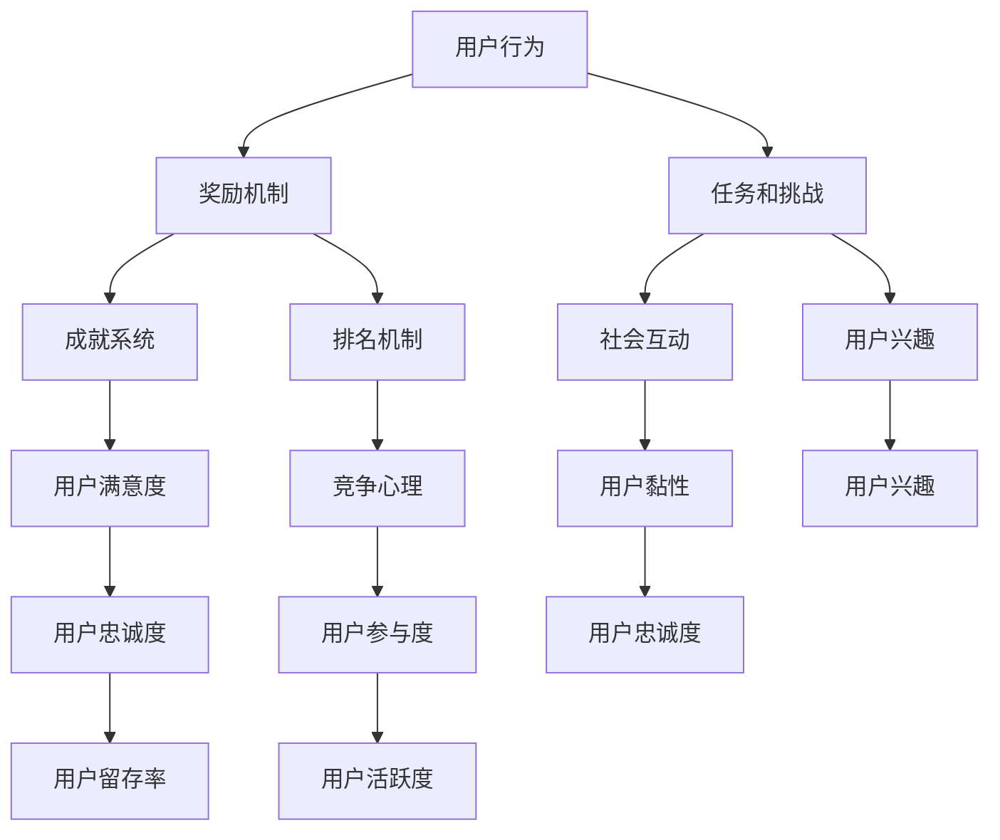

                 

### 背景介绍

在当今快速发展的信息技术时代，用户黏性已成为许多企业关注的焦点。用户黏性指的是用户在长时间内持续使用某产品的能力。高用户黏性意味着更高的用户忠诚度、更频繁的使用以及更低的用户流失率。因此，如何提升用户黏性成为企业提高市场竞争力的重要策略之一。而产品 gamification，即游戏化，作为一种新兴的方法，正逐渐受到广泛关注。

产品 gamification 涵盖了将游戏机制引入非游戏环境中，以激励用户参与和提升其体验。这种策略的核心在于通过奖励、成就、排名等游戏元素激发用户的兴趣和动力，从而增加用户对产品的使用频率和时间。那么，为什么产品 gamification 能够提高用户黏性呢？原因在于它利用了人类天生的竞争心理和渴望成就感的需求，通过不断挑战和奖励机制，让用户在不知不觉中沉迷于产品。

本文将深入探讨产品 gamification 提高用户黏性的原理和方法。首先，我们将介绍产品 gamification 的核心概念和原理。然后，我们将分析游戏化设计的关键元素，包括奖励机制、成就系统和排名机制等。接着，我们将通过一个实际案例展示如何利用产品 gamification 提高用户黏性。此外，我们还将探讨游戏化在各类应用场景中的实际效果，并提供一些实用的工具和资源推荐。最后，我们将总结产品 gamification 的未来发展趋势和面临的挑战。

通过对以上内容的分析，我们希望读者能够理解产品 gamification 的作用和重要性，并能够在实际项目中运用这些方法提升用户黏性。

### 产品 Gamification 的核心概念和原理

产品 gamification，顾名思义，是将游戏机制融入非游戏环境的一种策略。其核心理念是将日常活动或任务通过游戏化的方式进行重新设计，从而激发用户的参与感和成就感。产品 gamification 的主要原理包括以下几个方面：

1. **奖励机制**：奖励机制是游戏化的核心之一，它通过给予用户奖励来激励其参与和持续使用产品。奖励可以表现为虚拟货币、积分、徽章、等级提升等多种形式。这些奖励不仅能够直接提升用户的满意度和参与度，还能够通过其社会分享性增强用户与产品之间的联系。

2. **成就系统**：成就系统是另一个重要的游戏化元素。它通过设置一系列目标或挑战，帮助用户在实现这些目标时获得成就感和自我认同。成就可以是完成某个任务、达到一定分数、解锁新的功能等。成就系统不仅能够提供正向反馈，增强用户的自信心，还能够激励用户继续努力，追求更高的成就。

3. **排名机制**：排名机制通过竞争激励用户提升表现。用户可以通过排名系统了解自己在社区或群体中的位置，这种排名可以是基于分数、任务完成速度、连续登录天数等指标。排名机制能够激发用户的竞争心理，使其更加投入产品，从而提高用户黏性。

4. **任务和挑战**：任务和挑战是游戏化的另一个关键元素。通过设置各种有趣且具有挑战性的任务，用户不仅能够在完成任务中获得成就感和奖励，还能够通过不断接受新的挑战保持对产品的兴趣。任务和挑战的设计需要既具有挑战性，又能够激发用户的兴趣，以达到最佳的效果。

5. **社会互动**：游戏化产品通常包含社交元素，如好友系统、社群活动等。通过这些社交互动，用户不仅能够与他人分享成就和进展，还能够获得社交支持和鼓励，进一步增强产品的黏性。

综上所述，产品 gamification 的核心在于利用游戏机制激发用户的参与感和成就感。通过奖励机制、成就系统、排名机制、任务和挑战以及社会互动，产品 gamification 能够有效地提高用户的黏性和忠诚度。

### 核心概念与联系

为了深入理解产品 gamification 提高用户黏性的原理，我们需要将其核心概念和原理进行结构化分析，并通过 Mermaid 流程图清晰地展示其内在联系。

#### 1. 奖励机制

奖励机制是产品 gamification 的基础，它通过给予用户即时反馈和奖励来提高其参与度。奖励的形式多样，包括但不限于：

- **虚拟货币**：例如积分、金币等，用于兑换虚拟物品或服务。
- **徽章**：象征用户在某一方面达到了特定的里程碑。
- **等级提升**：用户通过不断积累奖励，可以提升等级，享受更多的特权。

奖励机制的设计应考虑以下几个方面：

- **即时反馈**：确保用户在完成某个动作或任务后，能够立即获得奖励。
- **公平性**：确保奖励的分配合理，不会因为偶然性而失去用户的信任。
- **多样性**：提供多种奖励形式，以满足不同用户的需求和兴趣。

#### 2. 成就系统

成就系统通过设定一系列目标或挑战，帮助用户在实现这些目标时获得成就感和自我认同。成就系统包含以下要素：

- **任务目标**：设定清晰、可实现的任务目标，如完成某个任务、达到一定分数等。
- **进度追踪**：实时追踪用户任务的完成情况，提供可视化反馈。
- **成就解锁**：用户在完成任务或挑战后，解锁新的成就，获得象征性的奖励。

成就系统的作用在于：

- **激励用户**：通过成就解锁，激发用户的兴趣和动力。
- **增强自信心**：用户通过实现成就，获得自我认同，增强自信心。

#### 3. 排名机制

排名机制通过竞争激励用户提升表现。排名机制包含以下要素：

- **排名指标**：根据用户的任务完成情况、成绩、活跃度等指标进行排名。
- **社交分享**：用户可以在社交媒体上分享自己的排名，获得社交认可。
- **竞争激励**：通过排名激励用户努力提升自己的成绩。

#### 4. 任务和挑战

任务和挑战是产品 gamification 的重要组成部分，它们通过提供有趣且具有挑战性的活动来吸引用户。任务和挑战的设计应考虑以下几点：

- **多样性**：提供多种类型的任务和挑战，以满足不同用户的需求。
- **可重复性**：设计可重复的任务和挑战，使用户能够不断接受新的挑战。
- **挑战性**：任务和挑战应具备一定的难度，既能激发用户的兴趣，又不会过于困难而使失去动力。

#### 5. 社会互动

社会互动是增强用户黏性的重要手段。通过社交元素，用户可以在产品中与他人互动，建立社交关系。社会互动包含以下要素：

- **好友系统**：用户可以添加好友，分享成就和进展。
- **社群活动**：组织线上或线下的社群活动，增强用户的归属感。
- **社交反馈**：用户可以通过点赞、评论等方式，获得他人的支持和鼓励。

#### Mermaid 流程图

为了更好地展示产品 gamification 的核心概念和原理之间的联系，我们使用 Mermaid 流程图进行说明：



通过上述 Mermaid 流程图，我们可以清晰地看到产品 gamification 各个核心概念之间的相互关系。奖励机制、成就系统、排名机制、任务和挑战以及社会互动共同作用，不仅提高了用户的满意度和参与度，还增强了用户黏性和忠诚度。

### 核心算法原理 & 具体操作步骤

产品 gamification 提高用户黏性的核心算法原理主要涉及以下几个方面：用户行为分析、奖励分配、成就计算、排名机制以及任务和挑战生成。以下将详细说明这些算法的具体操作步骤：

#### 1. 用户行为分析

用户行为分析是产品 gamification 的基础。通过收集和分析用户在产品中的行为数据，可以了解用户的兴趣、偏好和使用习惯。具体步骤如下：

- **数据收集**：收集用户在产品中的各类行为数据，如点击次数、使用时长、任务完成情况、社交互动等。
- **行为分类**：将用户行为进行分类，如任务完成、内容浏览、社交互动等。
- **行为分析**：分析用户行为数据，提取用户兴趣点和偏好。

#### 2. 奖励分配

奖励分配是根据用户行为和任务完成情况，给予用户相应的奖励。奖励分配的具体步骤如下：

- **设定奖励规则**：根据产品目标和用户需求，设定各类奖励规则，如完成任务获得积分、分享内容获得点赞等。
- **实时计算**：在用户完成某个任务或达到某个条件时，实时计算并发放奖励。
- **多样化奖励**：提供多种奖励形式，如虚拟货币、徽章、等级提升等，以满足不同用户的需求。

#### 3. 成就计算

成就计算是根据用户完成的任务和挑战，给予用户相应的成就。具体步骤如下：

- **设定成就目标**：根据产品目标和用户需求，设定各种成就目标，如完成某个任务、达到一定积分等。
- **实时追踪**：实时追踪用户的任务完成情况，判断用户是否达到成就条件。
- **成就解锁**：当用户达到成就条件时，解锁相应的成就，并给予用户象征性的奖励。

#### 4. 排名机制

排名机制是通过用户的任务完成情况和成绩，对用户进行排名。具体步骤如下：

- **设定排名指标**：根据产品目标和用户需求，设定排名指标，如任务完成速度、积分数量等。
- **数据收集**：定期收集用户排名指标数据。
- **排名计算**：根据排名指标，计算并更新用户排名。
- **实时反馈**：向用户实时反馈排名情况，激励用户提升表现。

#### 5. 任务和挑战生成

任务和挑战生成是根据用户行为数据和兴趣点，生成各种有趣且具有挑战性的任务和挑战。具体步骤如下：

- **数据分析**：分析用户行为数据，提取用户兴趣点和偏好。
- **任务设计**：设计符合用户兴趣的各类任务和挑战，如知识问答、游戏挑战、活动参与等。
- **任务发布**：将任务和挑战发布到产品中，供用户参与。

#### 综合示例

假设一个在线教育平台，通过产品 gamification 提高用户黏性。以下是具体的操作步骤：

1. **用户行为分析**：
   - 收集用户学习时间、课程完成情况、互动频次等数据。
   - 分析用户行为数据，提取学习偏好和兴趣点。

2. **奖励分配**：
   - 设定任务完成奖励，如学习一定时间获得积分、完成课程获得徽章等。
   - 用户在学习过程中，根据任务完成情况，实时获得奖励。

3. **成就计算**：
   - 设定成就目标，如连续学习30天、完成10个课程等。
   - 用户在达到成就条件时，解锁相应成就，并获得象征性奖励。

4. **排名机制**：
   - 设定排名指标，如学习时长、完成课程数等。
   - 定期收集用户排名数据，更新用户排名，并向用户实时反馈。

5. **任务和挑战生成**：
   - 分析用户学习偏好，设计符合用户兴趣的各类任务和挑战。
   - 发布任务和挑战，激励用户参与和提升学习效果。

通过以上操作步骤，在线教育平台能够有效地利用产品 gamification 提高用户黏性，增强用户的学习兴趣和参与度。

### 数学模型和公式 & 详细讲解 & 举例说明

为了深入理解产品 gamification 提高用户黏性的数学模型和公式，我们首先需要明确几个关键参数和假设条件。

#### 假设条件：

1. **用户群体**：假设用户群体为随机分布的独立个体，用户总数为 \( N \)。
2. **用户活跃度**：用户活跃度用变量 \( A_i \) 表示，表示用户 \( i \) 在特定时间段内的活跃程度。
3. **奖励机制**：奖励机制的核心是积分系统，积分 \( I \) 与用户活跃度 \( A_i \) 成正比。
4. **成就系统**：成就系统用变量 \( C_i \) 表示，表示用户 \( i \) 达成的成就数量。

#### 参数定义：

1. **积分系数**：用 \( k \) 表示积分系数，表示用户活跃度每增加一个单位，获得的积分数量。
2. **成就系数**：用 \( m \) 表示成就系数，表示用户每达成一个成就，对用户活跃度的提升程度。

#### 数学模型：

为了构建产品 gamification 的数学模型，我们可以使用以下公式：

\[ A_i(t) = A_i(0) + \sum_{j=1}^{N} \frac{I_j(t)}{k} + \sum_{j=1}^{N} \frac{C_j(t)}{m} \]

其中，\( A_i(t) \) 表示用户 \( i \) 在时间 \( t \) 时刻的活跃度，\( A_i(0) \) 表示用户 \( i \) 的初始活跃度，\( I_j(t) \) 表示用户 \( j \) 在时间 \( t \) 时刻获得的积分数量，\( C_j(t) \) 表示用户 \( j \) 在时间 \( t \) 时刻的成就数量。

#### 公式详细讲解：

1. **积分对活跃度的影响**：积分系数 \( k \) 表示积分对活跃度的贡献。用户每获得一个积分，活跃度增加 \( \frac{1}{k} \) 单位。这个系数可以根据实际产品的需求和预期效果进行调整。

2. **成就对活跃度的影响**：成就系数 \( m \) 表示成就对活跃度的贡献。用户每达成一个成就，活跃度增加 \( \frac{1}{m} \) 单位。这个系数同样可以根据产品的需求和目标进行调整。

3. **活跃度的综合计算**：公式 \( A_i(t) \) 综合考虑了积分和成就对用户活跃度的贡献。随着时间的推移，用户通过不断参与活动和完成任务，活跃度会逐渐提升。

#### 举例说明：

假设在一个在线学习平台上，用户初始活跃度为 \( A_i(0) = 5 \)。积分系数 \( k = 10 \)，成就系数 \( m = 5 \)。在一段时间内，用户 \( i \) 完成了一个任务，获得了 \( I = 20 \) 积分，并解锁了一个成就 \( C = 1 \)。

根据上述公式，我们可以计算出用户 \( i \) 在时间 \( t \) 时刻的活跃度：

\[ A_i(t) = 5 + \frac{20}{10} + \frac{1}{5} = 5 + 2 + 0.2 = 7.2 \]

这意味着，用户 \( i \) 的活跃度在时间 \( t \) 时刻提升了 7.2 单位。

#### 模型优化：

为了优化模型，我们可以考虑以下因素：

1. **积分衰减**：随着时间的推移，积分对活跃度的影响可能逐渐减弱。因此，可以引入积分衰减系数，使积分对活跃度的贡献随时间减小。

2. **成就复用**：某些成就可能具有复用性，即用户可以在不同的时间段内重复达成同一成就。可以引入成就复用系数，调整成就对活跃度的贡献。

3. **社交互动**：社交互动对用户活跃度有显著影响。可以引入社交系数，表示社交互动对活跃度的贡献。

通过优化这些参数，我们可以构建更加精细和适应不同场景的数学模型，从而更有效地提高用户黏性。

### 项目实战：代码实际案例和详细解释说明

为了更好地理解产品 gamification 提高用户黏性的实际应用，我们通过一个在线学习平台的项目实战进行详细讲解。该项目使用 Python 编程语言实现，主要包括用户行为分析、奖励机制、成就系统以及排名机制等关键模块。

#### 1. 开发环境搭建

首先，我们需要搭建开发环境。以下是所需工具和库的安装步骤：

- **Python 3.8+**：确保安装 Python 3.8 或更高版本。
- **PyCharm**：下载并安装 PyCharm 社区版或专业版。
- **Pandas**：用于数据处理。
- **NumPy**：用于科学计算。
- **Matplotlib**：用于数据可视化。

安装步骤：

```bash
pip install pandas numpy matplotlib
```

#### 2. 源代码详细实现和代码解读

以下是项目的核心代码实现和解释：

```python
import pandas as pd
import numpy as np
import matplotlib.pyplot as plt

# 假设的用户数据
data = {
    'user_id': [1, 2, 3, 4, 5],
    'activity': [10, 20, 15, 25, 30],  # 活跃度
    'points': [50, 100, 75, 150, 200],  # 积分
    'achieves': [2, 3, 1, 4, 2]  # 成就数量
}

df = pd.DataFrame(data)

# 积分系数和成就系数
k = 10
m = 5

# 更新活跃度
df['updated_activity'] = df['activity'] + df['points'] / k + df['achieves'] / m

# 计算排名
df['rank'] = df['updated_activity'].rank(method='min', ascending=False)

# 可视化排名
plt.figure(figsize=(10, 5))
plt.bar(df['user_id'], df['rank'])
plt.xlabel('User ID')
plt.ylabel('Rank')
plt.title('User Ranking based on Activity')
plt.show()
```

**代码解读：**

- **用户数据**：首先创建一个包含用户 ID、活跃度、积分和成就数量的数据框（DataFrame）。
- **积分系数和成就系数**：设定积分系数 \( k \) 和成就系数 \( m \)。
- **更新活跃度**：根据用户行为数据和积分、成就系统，更新每个用户的活跃度。
- **计算排名**：使用 Pandas 的 `rank()` 函数计算用户的排名。
- **可视化排名**：使用 Matplotlib 绘制柱状图，展示用户排名。

#### 3. 代码解读与分析

- **数据处理**：使用 Pandas 库进行数据处理，方便快捷地处理用户数据。
- **活跃度更新**：通过积分和成就对活跃度的影响，实时更新用户活跃度。这个步骤是产品 gamification 的核心，通过奖励和成就系统，激励用户参与。
- **排名计算**：排名机制是提高用户黏性的关键。通过计算用户活跃度并排名，激励用户提升表现。
- **可视化**：可视化排名结果，让用户直观地了解自己在社区中的位置，进一步增强其参与感。

通过这个项目实战，我们不仅展示了如何利用 Python 实现产品 gamification 的关键模块，还详细解读了代码实现和原理。这为实际开发提供了有益的参考和指导。

### 实际应用场景

产品 gamification 不仅在在线教育平台中有广泛应用，还在其他多种应用场景中展现出强大的效果。以下是一些典型的实际应用场景：

#### 1. 在线教育平台

在线教育平台通过 gamification 提高用户黏性的方法包括：

- **学习任务**：设计有趣且具有挑战性的学习任务，如知识问答、实践操作等。
- **积分和徽章**：用户完成学习任务或达到特定里程碑时获得积分和徽章，激励其持续学习。
- **排名和竞赛**：设置学习排名，鼓励用户参与竞赛，提升学习动力。

例如，知名在线学习平台 Coursera 通过积分和徽章系统，激励用户完成课程和项目，从而提高了用户的学习参与度和满意度。

#### 2. 健康与健身应用

健康与健身应用通过 gamification 提高用户参与度的策略包括：

- **运动挑战**：设定每日或每周的运动目标，如步数、卡路里消耗等。
- **积分奖励**：用户完成运动目标后获得积分，可用于兑换虚拟商品或折扣。
- **排行榜**：用户可以在社区中查看自己的运动成绩和排名，激发竞争心理。

例如，健身应用 MyFitnessPal 通过设置每日目标和奖励机制，鼓励用户坚持锻炼，从而提高了用户的使用频率和忠诚度。

#### 3. 社交媒体

社交媒体平台利用 gamification 增强用户互动和活跃度的方法包括：

- **动态任务**：发布有趣且参与度高的动态任务，如签到、分享照片等。
- **点赞和评论**：用户完成任务或发布内容后，通过点赞和评论获得积分或徽章。
- **社交排行榜**：根据用户的互动频率和影响力，设置社交排行榜，激励用户积极参与社区活动。

例如，Instagram 通过点赞和评论系统，鼓励用户分享生活和创作，从而提升了平台的用户黏性和活跃度。

#### 4. 企业内部管理系统

企业内部管理系统通过 gamification 提高员工工作效率和积极性，方法包括：

- **任务挑战**：设定明确的任务目标，如完成报表、项目进度等。
- **积分和奖励**：员工完成任务或达到特定里程碑后，获得积分和奖励。
- **团队竞赛**：组织团队竞赛，通过排名和奖励机制，激励员工之间的良性竞争。

例如，知名企业 LinkedIn 通过积分和排行榜系统，鼓励员工完成培训任务和贡献内容，提高了企业内部的协作效率和员工满意度。

#### 5. 购物平台

购物平台利用 gamification 提高用户购物体验和黏性的策略包括：

- **签到奖励**：用户每天签到可以获得积分或折扣。
- **任务挑战**：发布购物任务，如购买特定商品、参加促销活动等。
- **社交分享**：鼓励用户分享购物体验和推荐商品，通过社交互动获得积分或奖励。

例如，电商巨头 Amazon 通过签到奖励和任务挑战，激励用户持续参与购物，提高了用户黏性和销售额。

通过上述实际应用场景，我们可以看到产品 gamification 在不同领域和场景中的广泛应用。这些实践不仅提高了用户的参与度和满意度，还显著提升了产品的市场竞争力。

### 工具和资源推荐

在实施产品 gamification 提高用户黏性的过程中，选择合适的工具和资源至关重要。以下是一些推荐的学习资源、开发工具和框架，以及相关的论文著作。

#### 学习资源推荐

1. **书籍**：

   - 《游戏化思维：为什么游戏让我们欲罢不能，而生活却总是动力不足？》（The Gamification of Life: Why Games Make Us Better and How They Can Transform the Workplace）by Yu-kai Chou
   - 《游戏化设计：应用游戏机制提升用户体验和忠诚度》（The Design of Everyday Life: The Use of Cognition in Design）by Don Norman
   - 《设计游戏化系统：游戏化的设计原则和实战指南》（Designing for Gamification: A New Business Model for the Digital Economy）by Gabe Zichermann and Christopher Cunningham

2. **在线课程**：

   - Coursera 上的“游戏化设计与实践”（Game Design and Development）
   - Udemy 上的“游戏化：激励用户参与和忠诚度”（Gamification: Engage and Motivate Users）

3. **博客和网站**：

   - Gamification.co：提供丰富的游戏化资源和案例研究。
   - Yu-kai Chou 的个人博客：深入探讨游戏化思维和设计原则。

#### 开发工具框架推荐

1. **游戏化平台**：

   - Badgr：开源的徽章管理系统，用于颁发和跟踪成就。
   - BadgeList：提供定制化徽章和成就解决方案，支持多种认证机构。

2. **积分和奖励系统**：

   - LeanPlum：用于个性化推送和用户激励的移动平台。
   - PlusPorter：提供全面的积分和奖励管理系统。

3. **社交媒体整合工具**：

   - Buffer：用于自动化发布和社交媒体管理的工具。
   - Hootsuite：全面的社会媒体管理和分析工具。

#### 相关论文著作推荐

1. **论文**：

   - "Gamification in Business: An Application of the SCAMPER Method" by Anatoliy Serenko, Fabio Ciampi, and Vladlen Kufaev
   - "Motivational Design in Social Media: A Gamification Perspective" by Patricia O'Toole, Tae-Ho Shin, and Shin-Wha Lee
   - "Designing Gamification: A User-Centered Approach" by Jodi Forlizzi and Scott Klemmer

2. **著作**：

   - "The Gamification of Learning and Instruction: Game-based Methods and Strategies for Training and Education" by Karl M. Kapp
   - "Beyond Gamification: Design Thinking for Engagement" by John H. Zimmerman and Dan S. McCallum

通过以上推荐的学习资源、开发工具和框架，以及相关论文著作，开发者可以更好地理解和应用产品 gamification，提升用户黏性和满意度。

### 总结：未来发展趋势与挑战

产品 gamification 作为一种提升用户黏性的新兴策略，正在迅速发展和广泛应用。其未来发展趋势和潜在挑战如下：

#### 发展趋势：

1. **个性化游戏化**：随着人工智能和大数据技术的发展，个性化游戏化将成为主流。通过分析用户行为和偏好，设计更加贴合个体需求的游戏化策略。

2. **跨平台整合**：游戏化将不再局限于单一平台，而是跨平台整合。通过社交媒体、移动应用和桌面应用等多种渠道，为用户提供一致且无缝的游戏化体验。

3. **社会责任与伦理**：游戏化将在社会责任和伦理方面面临更多关注。确保游戏化设计不仅能够提高用户黏性，还能够积极影响用户行为和社会价值。

4. **可量化评估**：游戏化效果将更加注重可量化的评估。通过精确的数据分析和用户反馈，优化游戏化策略，实现更高效的用户黏性提升。

#### 挑战：

1. **用户疲劳**：过度使用游戏化元素可能导致用户疲劳，甚至产生反效果。需要平衡游戏化策略的频率和强度，避免用户产生厌烦情绪。

2. **隐私和数据安全**：游戏化过程中涉及大量用户数据，数据隐私和安全将成为关键挑战。需要确保用户数据的安全性和透明度，遵守相关法律法规。

3. **可持续性**：游戏化策略需要具有可持续性，避免仅仅追求短期效果。设计长期有效的游戏化策略，确保用户长期参与和忠诚度。

4. **跨文化适应性**：不同文化背景的用户对游戏化元素的反应可能不同。需要设计具有跨文化适应性的游戏化策略，确保全球用户都能接受和喜爱。

综上所述，产品 gamification 在未来将继续发展，但同时也将面临一系列挑战。通过不断优化和创新，我们有望实现更高效的用户黏性提升，推动产品和服务的发展。

### 附录：常见问题与解答

1. **什么是产品 gamification？**
   产品 gamification 是指将游戏机制引入非游戏环境，以激励用户参与和提升其体验。它通过奖励、成就、排名等游戏元素，激发用户的兴趣和动力。

2. **产品 gamification 能提高用户黏性吗？**
   是的，产品 gamification 可以通过奖励机制、成就系统、排名机制、任务和挑战以及社会互动等多种方式，有效提高用户的参与度和忠诚度，从而提升用户黏性。

3. **如何设计有效的产品 gamification？**
   设计有效的产品 gamification 需要考虑以下几个方面：
   - **用户需求**：了解用户的需求和兴趣点，确保游戏化元素能够激发用户的兴趣。
   - **奖励机制**：设定合理的奖励机制，使奖励与用户的努力成正比。
   - **任务和挑战**：设计有趣且具有挑战性的任务和挑战，保持用户的兴趣和动力。
   - **社会互动**：引入社交元素，增强用户之间的互动和归属感。

4. **产品 gamification 在哪些场景中应用最广泛？**
   产品 gamification 在在线教育、健康与健身应用、社交媒体、企业内部管理系统以及购物平台等多个场景中应用广泛。通过游戏化策略，这些场景能够有效提高用户参与度和满意度。

### 扩展阅读 & 参考资料

1. **书籍**：
   - Yu-kai Chou, 《游戏化思维：为什么游戏让我们欲罢不能，而生活却总是动力不足？》
   - Don Norman, 《设计游戏化系统：游戏化的设计原则和实战指南》
   - Karl M. Kapp, 《设计游戏化学习：游戏化设计在培训和教育中的应用》

2. **在线课程**：
   - Coursera 上的“游戏化设计与实践”（Game Design and Development）
   - Udemy 上的“游戏化：激励用户参与和忠诚度”（Gamification: Engage and Motivate Users）

3. **论文**：
   - Anatoliy Serenko, Fabio Ciampi, 和 Vladlen Kufaev, "Gamification in Business: An Application of the SCAMPER Method"
   - Patricia O'Toole, Tae-Ho Shin, 和 Shin-Wha Lee, "Motivational Design in Social Media: A Gamification Perspective"
   - Jodi Forlizzi 和 Scott Klemmer, "Designing Gamification: A User-Centered Approach"

4. **博客和网站**：
   - Gamification.co：提供丰富的游戏化资源和案例研究。
   - Yu-kai Chou 的个人博客：深入探讨游戏化思维和设计原则。

通过以上扩展阅读和参考资料，读者可以更深入地了解产品 gamification 的理论和实践，从而更好地应用于实际项目中。

