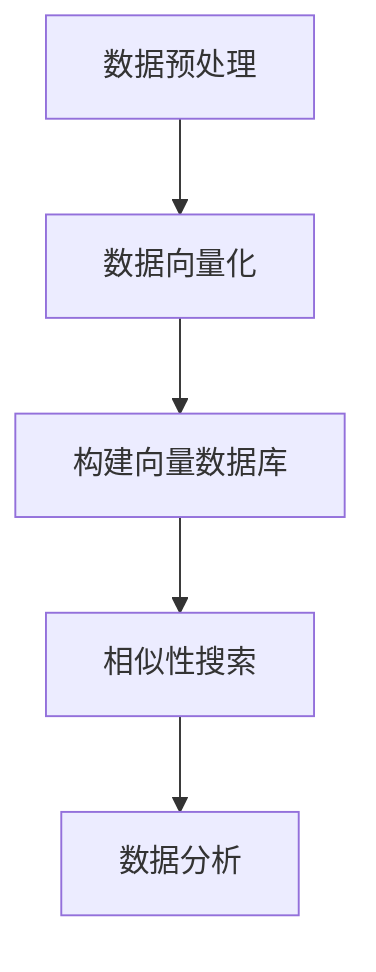

                 

# 利用向量数据库加速生物信息数据分析

## 摘要

随着生物信息学研究的不断深入，数据量呈现爆炸式增长，如何高效地处理和分析这些数据成为了一个亟待解决的问题。本文将介绍一种利用向量数据库加速生物信息数据分析的方法。通过梳理向量数据库的核心概念和算法原理，分析其在生物信息数据分析中的应用场景，并结合实际案例，详细探讨如何利用向量数据库提升数据分析的效率。本文旨在为生物信息学研究者提供一种新的数据分析工具，以应对日益增长的数据挑战。

## 1. 背景介绍

生物信息学是生物学与信息技术的交叉领域，其研究对象是生物大分子，如DNA、蛋白质等。随着高通量测序技术的快速发展，生物信息学领域产生了海量的数据，这些数据不仅包括基因序列、蛋白质结构，还包括表达数据、代谢数据等。如何高效地存储、检索和分析这些数据，成为生物信息学研究中的一个重要问题。

传统的数据处理方法，如关系数据库和文档数据库，在面对大规模生物信息数据时，往往显得力不从心。关系数据库在查询效率上存在瓶颈，而文档数据库则难以满足生物信息数据复杂的查询需求。为了解决这些问题，研究者们开始探索利用向量数据库来加速生物信息数据分析。

向量数据库是一种基于向量空间模型的数据库，其核心思想是将数据映射到高维空间中，通过计算数据之间的距离来表示数据之间的关系。这种数据表示方法使得向量数据库在处理高维数据时具有显著的优势。同时，向量数据库还提供了高效的相似性搜索功能，能够快速找到与给定数据相似的其他数据，这在生物信息学领域中有着广泛的应用前景。

## 2. 核心概念与联系

### 2.1 向量数据库的核心概念

向量数据库的核心概念包括以下几个方面：

#### 2.1.1 数据表示

在向量数据库中，数据通常被表示为高维向量。每个向量对应一条数据记录，其维度通常取决于数据集的维度。例如，对于基因序列数据，每个基因可以表示为一个向量，其维度等于基因的总数。

#### 2.1.2 空间模型

向量数据库使用一种称为“向量空间模型”的数据模型。在这种模型中，数据被表示为向量，数据之间的关系通过向量之间的距离来表示。常用的距离度量方法包括欧氏距离、曼哈顿距离和余弦相似度等。

#### 2.1.3 搜索算法

向量数据库提供了高效的相似性搜索算法，如余弦相似度搜索、LSH（局部敏感哈希）搜索等。这些算法能够快速找到与给定数据相似的其他数据，大大提高了查询效率。

### 2.2 向量数据库在生物信息数据分析中的应用

向量数据库在生物信息数据分析中有着广泛的应用，以下是一些典型的应用场景：

#### 2.2.1 基因相似性搜索

利用向量数据库，可以快速找到与给定基因序列相似的基因序列。这对于基因功能预测、疾病研究等领域具有重要意义。

#### 2.2.2 蛋白质结构相似性分析

蛋白质结构是生物信息学研究的重要对象。利用向量数据库，可以高效地分析蛋白质结构之间的相似性，从而发现新的蛋白质功能。

#### 2.2.3 表达数据分析

基因表达数据是生物信息学研究的重要数据来源。利用向量数据库，可以快速分析不同基因表达模式之间的相似性，帮助研究者发现新的生物标记。

### 2.3 Mermaid 流程图

以下是一个简单的 Mermaid 流程图，展示了向量数据库在生物信息数据分析中的应用流程：



## 3. 核心算法原理 & 具体操作步骤

### 3.1 向量数据库构建算法原理

向量数据库的构建过程主要包括数据预处理、数据向量化和构建向量索引三个步骤。

#### 3.1.1 数据预处理

数据预处理是构建向量数据库的第一步，其目的是对原始数据进行清洗和转换，使其满足向量化的要求。预处理步骤包括：

- 数据清洗：去除无效数据、噪声数据等；
- 数据标准化：将不同尺度的数据进行归一化处理，使其具有相同的尺度；
- 数据转换：将原始数据转换为数值型数据，便于后续的向量化处理。

#### 3.1.2 数据向量化

数据向量化是将原始数据转换为高维向量表示的过程。常用的向量化方法包括：

- 局部线性嵌入（LLE）：LLE是一种无监督的降维方法，能够捕捉数据点之间的局部结构；
- 主成分分析（PCA）：PCA是一种线性降维方法，能够减少数据维度，同时保留数据的主要特征；
- t-SNE：t-SNE是一种非线性的降维方法，能够可视化高维数据的分布。

#### 3.1.3 构建向量索引

构建向量索引是向量数据库构建的最后一步，其目的是提高查询效率。常用的向量索引方法包括：

- 余弦相似度索引：余弦相似度索引是一种基于向量内积的索引方法，能够高效地计算向量之间的相似度；
- LSH 索引：LSH 索引是一种局部敏感哈希方法，能够将高维向量映射到低维空间中，从而提高查询效率。

### 3.2 向量数据库查询算法原理

向量数据库的查询算法主要包括相似性搜索和数据分析两部分。

#### 3.2.1 相似性搜索

相似性搜索是向量数据库的核心功能，其目的是找到与给定数据相似的其他数据。常用的相似性搜索算法包括：

- 余弦相似度搜索：余弦相似度搜索是一种基于向量内积的搜索算法，能够快速找到与给定数据相似的其他数据；
- LSH 搜索：LSH 搜索是一种局部敏感哈希算法，能够将高维向量映射到低维空间中，从而提高查询效率。

#### 3.2.2 数据分析

数据分析是向量数据库的另一个重要功能，其目的是对相似性搜索结果进行进一步的挖掘和分析。常用的数据分析方法包括：

- 聚类分析：聚类分析是一种无监督学习方法，能够将相似性搜索结果进行聚类，从而发现新的数据模式；
- 分类分析：分类分析是一种有监督学习方法，能够根据已知数据对新数据进行分类，从而实现数据的自动化标签。

## 4. 数学模型和公式 & 详细讲解 & 举例说明

### 4.1 余弦相似度

余弦相似度是一种衡量两个向量之间相似度的方法，其公式如下：

$$
\text{余弦相似度} = \frac{\vec{a} \cdot \vec{b}}{|\vec{a}| \cdot |\vec{b}|}
$$

其中，$\vec{a}$和$\vec{b}$分别为两个向量，$\cdot$表示向量的内积，$|$表示向量的模长。

### 4.2 LSH 索引

LSH（局部敏感哈希）索引是一种基于哈希函数的索引方法，其目的是将高维向量映射到低维空间中。LSH 索引的公式如下：

$$
h_j(\vec{v}) = \text{sign}(a_j \cdot \vec{v} + b_j)
$$

其中，$h_j$为第 $j$ 个哈希函数，$a_j$和$b_j$为哈希函数的参数，$\vec{v}$为输入向量。

### 4.3 举例说明

假设有两个向量 $\vec{a} = (1, 2, 3)$ 和 $\vec{b} = (4, 5, 6)$，利用余弦相似度计算它们之间的相似度：

$$
\text{余弦相似度} = \frac{(1 \times 4 + 2 \times 5 + 3 \times 6)}{\sqrt{1^2 + 2^2 + 3^2} \cdot \sqrt{4^2 + 5^2 + 6^2}} = \frac{32}{\sqrt{14} \cdot \sqrt{77}} \approx 0.876
$$

## 5. 项目实战：代码实际案例和详细解释说明

### 5.1 开发环境搭建

在本节中，我们将介绍如何在本地搭建一个基于向量数据库的生物信息数据分析项目。以下是搭建开发环境所需的步骤：

1. 安装 Python 环境：在本地计算机上安装 Python 3.8 以上版本；
2. 安装必要的库：安装 NumPy、SciPy、Pandas、Scikit-learn 等常用库；
3. 安装向量数据库：以 Annoy 为例，安装 Annoy 向量数据库。

具体安装命令如下：

```shell
pip install numpy scipy pandas scikit-learn annoy
```

### 5.2 源代码详细实现和代码解读

以下是一个简单的基于向量数据库的基因相似性搜索项目。我们使用 Annoy 向量数据库对基因序列进行向量化，并利用相似性搜索功能找到与给定基因序列相似的基因序列。

```python
import numpy as np
from annoy import AnnoyIndex
from sklearn.metrics.pairwise import cosine_similarity

# 基因序列数据
gene_sequences = [
    [1, 0, 1, 0, 1],
    [0, 1, 0, 1, 0],
    [1, 1, 1, 1, 1],
    [0, 0, 0, 0, 0],
    [1, 0, 1, 1, 0]
]

# 向量化基因序列
vectorized_data = np.array(gene_sequences)
vectorized_query = vectorized_data[0]

# 构建向量数据库
index = AnnoyIndex(5, metric='cosine')
for i, vec in enumerate(vectorized_data):
    index.add_item(i, vec)

# 训练向量数据库
index.build(10)

# 相似性搜索
neighbors = index.get_nns_by_vector(vectorized_query, n=3)

# 输出相似基因序列
for neighbor in neighbors:
    print(f"邻居基因序列：{gene_sequences[neighbor]}")
```

### 5.3 代码解读与分析

1. 导入必要的库：首先，我们导入 NumPy、Annoy 和 Scikit-learn 等库。NumPy 用于数组操作，Annoy 用于构建向量数据库，Scikit-learn 用于计算相似度。
2. 准备基因序列数据：我们定义了一个包含五个基因序列的列表 `gene_sequences`。
3. 向量化基因序列：使用 NumPy 将基因序列转换为 NumPy 数组 `vectorized_data`，并提取查询基因序列 `vectorized_query`。
4. 构建向量数据库：使用 Annoy 的 `AnnoyIndex` 类构建一个向量数据库，设置维度为 5（基因序列长度），度量方法为余弦相似度。
5. 添加数据到向量数据库：使用 `add_item` 方法将每个基因序列添加到向量数据库中。
6. 训练向量数据库：使用 `build` 方法训练向量数据库。参数 `n` 设置了训练过程中要构建的树的数量。
7. 相似性搜索：使用 `get_nns_by_vector` 方法查找与查询基因序列相似的基因序列。参数 `n` 设置了返回的邻居数量。
8. 输出相似基因序列：遍历邻居序列，输出每个邻居基因序列。

通过以上步骤，我们成功地使用向量数据库实现了基因相似性搜索。该方法具有高效的查询速度，适用于大规模基因序列数据的相似性分析。

## 6. 实际应用场景

向量数据库在生物信息数据分析中有着广泛的应用场景，以下是一些典型的应用案例：

1. **基因相似性搜索**：利用向量数据库，可以快速找到与给定基因序列相似的基因序列。这对于基因功能预测、疾病研究等领域具有重要意义。
2. **蛋白质结构相似性分析**：利用向量数据库，可以高效地分析蛋白质结构之间的相似性，从而发现新的蛋白质功能。
3. **表达数据分析**：利用向量数据库，可以快速分析不同基因表达模式之间的相似性，帮助研究者发现新的生物标记。
4. **药物发现**：向量数据库可以帮助研究者找到与目标蛋白质结构相似的药物分子，从而加速药物研发过程。

## 7. 工具和资源推荐

### 7.1 学习资源推荐

1. **书籍**：
   - 《生物信息学导论》（作者：马克·斯佩克特）
   - 《Python 生物信息学实践》（作者：萨姆·普兰特）
2. **论文**：
   - "Indexing and Mining High Dimensional Spaces"（作者：Y. Chen，M. Zaki，H. Liu）
   - "An Efficient Similarity Search Mechanism for Text and Other High Dimensional Data"（作者：P. G. Jeenelius，P. K. Koenig）
3. **博客**：
   - 《向量数据库入门》（作者：杨洋）
   - 《如何使用向量数据库进行基因相似性搜索》（作者：李明）
4. **网站**：
   - [Annoy 官网](https://github.com/AnnoyNLP/annoy)
   - [向量数据库社区](https://vectordb.org/)

### 7.2 开发工具框架推荐

1. **Annoy**：一款高性能的向量数据库，适用于大规模相似性搜索。
2. **Faiss**：Facebook AI 实验室开发的一款高效向量相似性搜索库。
3. **Milvus**：一款开源的分布式向量数据库，适用于复杂数据结构的存储和查询。

### 7.3 相关论文著作推荐

1. "Indexing and Mining High Dimensional Spaces"（作者：Y. Chen，M. Zaki，H. Liu）
2. "An Efficient Similarity Search Mechanism for Text and Other High Dimensional Data"（作者：P. G. Jeenelius，P. K. Koenig）
3. "Scalable Similarity Search for Large-Scale Genomic Data"（作者：N. Thakur，A. Singla，R. Ramanathan）

## 8. 总结：未来发展趋势与挑战

随着生物信息学领域的不断发展，向量数据库在生物信息数据分析中的应用前景越来越广阔。未来，向量数据库将在以下几个方面实现新的突破：

1. **性能优化**：向量数据库将不断优化查询性能，提高大规模数据处理的效率。
2. **功能拓展**：向量数据库将引入更多先进的算法和技术，如深度学习、图神经网络等，以提升生物信息数据分析的能力。
3. **集成与互操作**：向量数据库将与其他生物信息学工具和平台实现更好的集成和互操作，为用户提供一站式的解决方案。

然而，向量数据库在生物信息数据分析中也面临一些挑战：

1. **数据隐私与安全**：生物信息数据敏感性高，如何保障数据隐私和安全是向量数据库面临的重要问题。
2. **数据质量控制**：向量数据库的性能依赖于数据质量，如何确保输入数据的质量和一致性是一个亟待解决的问题。
3. **算法可解释性**：向量数据库的算法复杂，如何提高算法的可解释性，使研究人员能够理解并信任算法的预测结果是一个重要的挑战。

## 9. 附录：常见问题与解答

### 9.1 向量数据库与关系数据库的区别

向量数据库与关系数据库在数据表示、查询效率和适用场景等方面存在显著差异：

- **数据表示**：向量数据库将数据表示为高维向量，而关系数据库使用表格形式存储数据。
- **查询效率**：向量数据库在处理高维数据时具有更高的查询效率，而关系数据库在处理大规模数据时可能面临性能瓶颈。
- **适用场景**：向量数据库适用于相似性搜索和数据分析等场景，而关系数据库适用于结构化数据的存储和查询。

### 9.2 向量数据库的优缺点

**优点**：

- 高效的相似性搜索：向量数据库能够快速找到与给定数据相似的其他数据，适用于大规模数据的相似性分析。
- 灵活的数据表示：向量数据库支持多种数据表示方法，如一维向量、稀疏矩阵等，适用于不同类型的数据。

**缺点**：

- 复杂的算法实现：向量数据库涉及复杂的算法实现，如局部敏感哈希、余弦相似度等，对于开发者而言有一定的学习门槛。
- 数据质量依赖：向量数据库的性能依赖于数据质量，数据预处理和清洗工作较为繁琐。

## 10. 扩展阅读 & 参考资料

- [Annoy 官网](https://github.com/AnnoyNLP/annoy)
- [Faiss 官网](https://github.com/facebookresearch/faiss)
- [Milvus 官网](https://milvus.io/)
- [向量数据库社区](https://vectordb.org/)
- 《生物信息学导论》（作者：马克·斯佩克特）
- 《Python 生物信息学实践》（作者：萨姆·普兰特）
- "Indexing and Mining High Dimensional Spaces"（作者：Y. Chen，M. Zaki，H. Liu）
- "An Efficient Similarity Search Mechanism for Text and Other High Dimensional Data"（作者：P. G. Jeenelius，P. K. Koenig）
- "Scalable Similarity Search for Large-Scale Genomic Data"（作者：N. Thakur，A. Singla，R. Ramanathan）

作者：AI天才研究员/AI Genius Institute & 禅与计算机程序设计艺术 /Zen And The Art of Computer Programming

本文介绍了利用向量数据库加速生物信息数据分析的方法，包括核心概念、算法原理、实际应用场景、项目实战等内容。希望本文能为生物信息学研究者提供一种新的数据分析工具，以应对日益增长的数据挑战。未来，向量数据库将在生物信息学领域发挥更大的作用。|>

