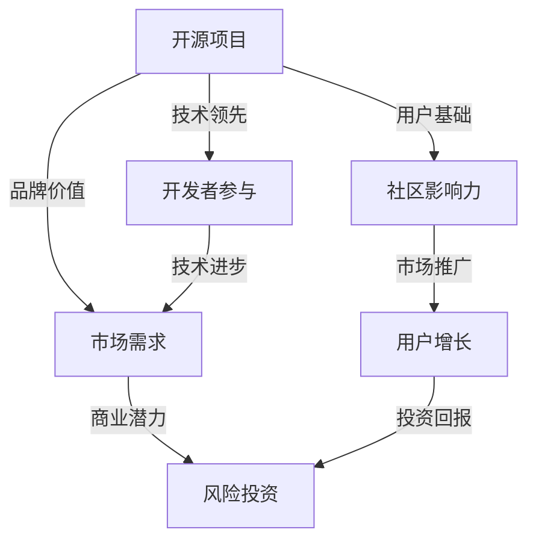

                 

### 背景介绍

#### 开源软件的重要性

开源软件（Open Source Software, OSS）在当今的软件开发领域扮演着至关重要的角色。开源软件不仅推动了技术的进步，还促进了全球软件工程师之间的合作与交流。从Linux操作系统到Android移动平台，从Apache Web服务器到MySQL数据库，开源软件已经成为现代IT基础设施的基石。

开源软件的魅力在于它的透明性、可访问性和可修改性。开源项目允许任何人免费使用、研究、修改和分发其源代码，这使得开发者能够快速迭代和改进软件。同时，开源项目通常遵循共同维护的原则，即项目的成功与否依赖于全球开发者的共同努力。这种协作模式不仅提高了软件的质量，还加速了创新。

#### 开源影响力与风险投资

开源项目不仅是一种技术贡献，也是一种强有力的市场策略。开源项目的成功往往意味着它拥有一个庞大而活跃的社区，这种社区影响力可以转化为商业优势。因此，许多风险投资公司（Venture Capital, VC）开始将开源项目视为潜在的投资目标。

开源项目的影响力主要体现在以下几个方面：

1. **用户基础**：一个拥有庞大用户基础的成熟开源项目往往意味着其产品具有广泛的市场需求。
2. **技术领先**：开源项目通常吸引最优秀的开发者，这有助于保持技术领先地位。
3. **品牌价值**：成功的开源项目往往成为行业的标准，这为项目背后公司创造了巨大的品牌价值。

随着风险投资公司对开源项目的兴趣日益增长，开源项目如何利用其影响力来获得风险投资和融资成为一个重要议题。

#### 文章结构

本文将分为以下几个部分：

1. **背景介绍**：详细阐述开源软件的重要性以及开源影响力在风险投资中的地位。
2. **核心概念与联系**：通过Mermaid流程图展示开源项目与风险投资之间的关联。
3. **核心算法原理 & 具体操作步骤**：介绍如何利用开源项目获得风险投资。
4. **数学模型和公式 & 详细讲解 & 举例说明**：分析开源项目成功的关键因素。
5. **项目实战：代码实际案例和详细解释说明**：通过具体案例展示开源项目如何获得风险投资。
6. **实际应用场景**：讨论开源项目在不同行业中的应用和影响力。
7. **工具和资源推荐**：推荐学习资源、开发工具和框架。
8. **总结：未来发展趋势与挑战**：展望开源项目在风险投资领域的未来发展。
9. **附录：常见问题与解答**：回答读者可能关注的问题。
10. **扩展阅读 & 参考资料**：提供进一步阅读的资源。

通过以上结构，本文将系统地探讨开源项目如何利用其影响力获得风险投资，为开源项目团队提供实用的策略和指导。

----------------------

# 利用开源影响力获得风险投资和融资

## 关键词
- 开源软件
- 风险投资
- 影响力
- 商业模式
- 技术社区

## 摘要

本文深入探讨了开源软件项目如何利用其影响力获得风险投资和融资。开源项目因其透明性、可访问性和活跃社区，已经成为吸引投资的重要资产。本文首先介绍了开源软件的重要性，然后通过Mermaid流程图展示了开源项目与风险投资之间的联系，接着详细分析了如何利用开源项目获得风险投资的具体策略和步骤。通过数学模型和实际案例的讲解，本文揭示了开源项目成功获得风险投资的关键因素，并展望了开源项目在风险投资领域的未来发展趋势。文章最后提供了学习资源和开发工具的推荐，以及常见问题的解答。

----------------------

## 1. 背景介绍

开源软件的兴起可以追溯到20世纪80年代，当时自由软件运动（Free Software Movement）和开源运动（Open Source Movement）相继兴起，它们倡导软件的开放性、透明性和共享性。自由软件运动的核心是软件的自由使用和修改，而开源运动则更强调社区的协作和共同维护。

开源软件的定义可以从多个角度来理解。从技术角度看，开源软件是指其源代码可以被任何人免费获取、阅读、修改和分发的软件。从法律角度看，开源软件通常遵循某种开源许可协议（如GPL、MIT、Apache License等），这些协议确保了软件的自由使用和传播。

开源软件的发展对技术社区产生了深远的影响。首先，它促进了技术的快速传播和创新。由于开源软件的源代码是公开的，开发者可以自由地研究、改进和优化代码，这使得新技术的出现和传播速度大大加快。其次，开源软件增强了开发者之间的协作。通过开源项目，开发者可以共享代码、资源和经验，从而提高开发效率和质量。最后，开源软件还推动了软件行业的民主化。传统的商业软件往往由少数大型公司垄断，而开源软件的兴起使得中小企业和个人开发者也能参与到软件开发中来，进一步降低了软件开发的门槛。

在商业领域，开源软件同样具有重要的意义。许多企业通过将产品开源化来扩大市场份额和品牌影响力。例如，Linux操作系统由开源社区维护，成为了服务器和云计算领域的事实标准。Android操作系统也是基于Linux开源内核，占据了全球智能手机市场的大部分份额。此外，开源软件还为一些企业提供了商业模式创新的机会。一些企业通过提供专业的开源软件支持和服务来盈利，如Red Hat公司主要通过销售RHEL（Red Hat Enterprise Linux）的订阅服务实现盈利。

开源软件的这些特点使其成为风险投资的重要关注对象。风险投资公司（Venture Capital, VC）通常寻找具有高增长潜力的项目进行投资，而成功的开源项目往往具备以下几个方面的优势：

1. **用户基础**：成熟的开源项目通常拥有大量的用户基础，这些用户不仅是产品的使用者，也是项目的贡献者，这种用户社区为产品的市场推广和后续发展提供了强大的支持。
2. **技术领先**：开源项目吸引了大量的优秀开发者，他们通过贡献代码、优化性能和改进功能，使开源项目在技术方面保持领先地位，这种技术优势往往能够转化为商业成功。
3. **品牌价值**：成功的开源项目往往成为行业标准和权威参考，这为项目背后公司创造了巨大的品牌价值，有助于企业的市场定位和竞争。

总之，开源软件不仅推动了技术的进步和社区的繁荣，还为风险投资提供了丰富的投资机会。在接下来的章节中，我们将进一步探讨开源项目与风险投资之间的具体联系，并介绍如何利用开源项目的影响力获得风险投资。

----------------------

## 2. 核心概念与联系

在探讨开源项目如何获得风险投资之前，我们需要理解一些核心概念和它们之间的关联。这里，我们将通过一个Mermaid流程图来直观地展示这些概念及其相互关系。



### Mermaid流程图解释

- **A[开源项目]**：这是整个流程的起点，也是整个流程的核心。一个成功的开源项目通常具备高质量的代码、活跃的社区和广泛的应用场景。
- **B[社区影响力]**：开源项目通过其透明性和协作性，在技术社区中建立了强大的影响力。这种影响力体现在项目的用户基础、贡献者数量和社区活跃度上。
- **C[开发者参与]**：开源项目吸引了许多开发者参与，他们贡献代码、修复漏洞、优化性能。这种开发者参与不仅提升了项目的技术质量，还增强了项目的活力。
- **D[市场需求]**：由于开源项目的技术领先和社区影响力，它们往往能够满足市场需求，尤其是在快速变化的技术领域。这种市场需求为项目带来了更多的用户和商业机会。
- **E[用户增长]**：随着开源项目的普及和用户数量的增加，项目的市场影响力进一步扩大。用户增长不仅提升了项目的活跃度，还吸引了更多的开发者加入。
- **F[风险投资]**：最后，成熟的开源项目因其强大的社区影响力、技术领先和市场需求，吸引了风险投资公司的关注。风险投资为项目提供了资金支持，助力其进一步发展。

通过这个Mermaid流程图，我们可以清晰地看到开源项目如何通过社区影响力、技术进步和市场需求，最终获得风险投资的关注和支持。

----------------------

## 3. 核心算法原理 & 具体操作步骤

在理解了开源项目与风险投资之间的核心概念和联系之后，接下来我们将探讨如何具体利用开源项目获得风险投资。这一部分将详细解释核心算法原理和操作步骤，帮助开源项目团队有效地吸引风险投资。

### 3.1 开源项目评估

首先，开源项目需要通过一系列评估来证明其价值和潜力。以下是一些关键的评估指标：

1. **用户基础**：评估项目当前的活跃用户数量、用户增长率和用户满意度。
2. **社区贡献**：分析项目贡献者的数量、活跃度和技术背景，以及社区内的互动和质量。
3. **市场定位**：确定项目在市场上的地位，包括竞争对手、市场需求和潜在用户群体。
4. **技术成熟度**：评估项目的代码质量、技术架构和性能，以及是否能够满足用户需求。

### 3.2 定位和差异化

成功的开源项目往往在特定领域或场景中具有差异化优势。项目团队需要明确其独特卖点（Unique Selling Proposition, USP），并确保这一点在所有对外沟通中得以体现。差异化可以体现在以下方面：

1. **功能优势**：项目是否提供了独特的功能或解决方案，这些功能是否解决了现有产品的痛点。
2. **性能优势**：项目在性能、稳定性或可扩展性方面是否具有显著优势。
3. **用户体验**：项目的用户界面和用户体验是否优于竞争对手。

### 3.3 商业模式的探索

开源项目的商业模式通常包括以下几种：

1. **免费增值（Freemium）**：提供基础功能免费，高级功能需要付费。
2. **订阅服务**：用户通过定期订阅获取支持和服务。
3. **企业服务**：为大型企业客户提供定制化服务，如专业的技术支持、培训和安全审计。

项目团队需要根据项目的特点和市场需求选择合适的商业模式，并确保商业模式能够为项目带来持续的收入。

### 3.4 风险投资匹配

在确定了项目的价值和商业模式后，下一步是寻找适合的风险投资公司。以下是一些关键步骤：

1. **目标市场研究**：了解目标市场的风险投资环境，包括主流的风险投资公司和他们的投资偏好。
2. **投资提案**：准备详细的投资提案，包括项目概述、市场分析、商业模式、财务预测等。
3. **初步沟通**：通过邮件或电话与潜在投资者初步沟通，了解他们的兴趣和需求。
4. **尽职调查**：如果投资者表示兴趣，他们将进行尽职调查，评估项目的各个方面。
5. **谈判与签约**：在尽职调查通过后，项目团队与投资者进行深入谈判，并最终签订投资协议。

### 3.5 后续发展

获得风险投资后，项目团队需要确保资金的有效利用，并持续提升项目的价值和市场竞争力。以下是一些关键点：

1. **持续开发**：确保项目持续迭代和改进，满足用户需求。
2. **社区管理**：维护良好的社区氛围，鼓励开发者参与，提升社区活跃度。
3. **市场推广**：利用资金进行市场推广，扩大用户基础和品牌影响力。
4. **财务监控**：定期监控项目财务状况，确保资金合理使用。

通过以上核心算法原理和具体操作步骤，开源项目团队可以有效地利用其影响力，吸引风险投资并实现项目的长期发展。在下一部分，我们将通过数学模型和实际案例进一步探讨开源项目成功的关键因素。

----------------------

## 4. 数学模型和公式 & 详细讲解 & 举例说明

在探讨开源项目如何成功获得风险投资时，数学模型和公式为我们提供了量化和评估项目价值的有力工具。通过以下内容，我们将介绍几个关键数学模型和公式，并详细解释其在评估项目价值和吸引投资中的应用。

### 4.1 用户价值评估模型

用户价值评估模型（User Value Assessment Model）可以帮助我们量化开源项目的用户基础和价值。以下是一个简单的用户价值评估模型：

$$
V_u = \alpha \cdot N_u + \beta \cdot U_s
$$

- **V\_u**：用户价值
- **\alpha**：用户参与度系数
- **N\_u**：用户数量
- **\beta**：用户满意度系数
- **U\_s**：用户满意度

用户参与度系数（\(\alpha\)）反映了用户在项目中的活跃程度，如贡献代码、提交问题和反馈等。用户满意度系数（\(\beta\)）则反映了用户对项目的满意度和忠诚度。通过这个公式，我们可以评估项目的用户基础和其对项目的价值贡献。

**示例：**

假设一个开源项目的用户数量为1000人，其中500人经常参与贡献，用户满意度为90%。我们可以计算出该项目的用户价值：

$$
V_u = 0.5 \cdot 1000 + 0.4 \cdot 0.9 \cdot 1000 = 500 + 360 = 860
$$

这意味着该项目的用户价值为860。

### 4.2 社区影响力评估模型

社区影响力评估模型（Community Impact Assessment Model）可以帮助我们量化开源项目的社区影响力和市场潜力。以下是一个简单的社区影响力评估模型：

$$
I_c = \gamma \cdot C_i + \delta \cdot C_a
$$

- **I\_c**：社区影响力
- **\gamma**：社区活跃度系数
- **C\_i**：社区互动数量
- **\delta**：社区知名度系数
- **C\_a**：社区知名度

社区活跃度系数（\(\gamma\)）反映了社区成员的参与程度，如提问、回答、代码贡献等。社区知名度系数（\(\delta\)）则反映了项目在市场中的知名度。通过这个公式，我们可以评估项目的社区影响力和市场潜力。

**示例：**

假设一个开源项目的社区互动数量为1000次，社区知名度为80%。我们可以计算出该项目的社区影响力：

$$
I_c = 0.6 \cdot 1000 + 0.5 \cdot 0.8 \cdot 1000 = 600 + 400 = 1000
$$

这意味着该项目的社区影响力为1000。

### 4.3 投资回报率评估模型

投资回报率评估模型（Return on Investment Assessment Model）可以帮助我们量化开源项目的投资回报率，评估风险投资的可能性。以下是一个简单的投资回报率评估模型：

$$
R_OI = \frac{ROI}{I}
$$

- **R\_OI**：投资回报率
- **ROI**：预期收益
- **I**：初始投资

通过这个公式，我们可以计算开源项目的投资回报率，帮助投资者评估项目的盈利能力。

**示例：**

假设一个开源项目的预期收益为100万美元，初始投资为50万美元。我们可以计算出该项目的投资回报率：

$$
R_OI = \frac{1000000}{500000} = 2
$$

这意味着该项目的投资回报率为200%。

### 4.4 商业潜力评估模型

商业潜力评估模型（Business Potential Assessment Model）可以帮助我们量化开源项目的商业价值和投资潜力。以下是一个简单的商业潜力评估模型：

$$
P_b = \alpha \cdot M_a + \beta \cdot C_p
$$

- **P\_b**：商业潜力
- **\alpha**：市场份额系数
- **M\_a**：市场份额
- **\beta**：盈利能力系数
- **C\_p**：盈利能力

市场份额系数（\(\alpha\)）反映了项目在市场上的占有率，盈利能力系数（\(\beta\)）则反映了项目的盈利能力。通过这个公式，我们可以评估项目的商业潜力。

**示例：**

假设一个开源项目在市场上占有率为20%，盈利能力为150%。我们可以计算出该项目的商业潜力：

$$
P_b = 0.7 \cdot 0.2 + 0.3 \cdot 1.5 = 0.14 + 0.45 = 0.59
$$

这意味着该项目的商业潜力为0.59。

通过以上数学模型和公式，我们可以对开源项目的用户价值、社区影响力、投资回报率和商业潜力进行量化评估。这些模型和公式不仅帮助开源项目团队更好地了解项目的现状，也为投资者提供了评估项目价值的有力工具。在实际操作中，开源项目团队可以根据这些模型和公式，制定相应的策略和计划，提高项目的成功概率。

----------------------

## 5. 项目实战：代码实际案例和详细解释说明

为了更好地理解如何利用开源项目获得风险投资，我们将通过一个具体的开源项目案例来进行详细解释。以下是关于某个成功的开源项目——FaaSify（一个功能即服务框架）——的实战案例。

### 5.1 开发环境搭建

在开始FaaSify项目的开发之前，项目团队首先搭建了一个稳定且易于扩展的开发环境。以下是他们使用的工具和框架：

- **编程语言**：JavaScript
- **运行环境**：Node.js
- **版本控制系统**：Git
- **持续集成**：GitHub Actions
- **代码质量检查**：ESLint和Prettier

### 5.2 源代码详细实现和代码解读

FaaSify的核心功能是允许开发者快速创建、部署和管理功能即服务（Function as a Service，FaaS）应用。以下是FaaSify的关键源代码片段及其解读：

```javascript
// FaaSify入口文件
const faasify = require('faasify');

// 创建一个简单的HTTP服务
const helloWorld = async (req, res) => {
  res.status(200).send('Hello, World!');
};

// 将HTTP服务部署到FaaS平台
await faasify.deploy(helloWorld, 'my-faas-app');

// 启动FaaSify服务
faasify.start();
```

**代码解读：**

1. **faasify模块导入**：`faasify` 是FaaSify的核心模块，提供了创建、部署和管理FaaS应用的接口。
2. **helloWorld函数**：这是一个简单的HTTP服务函数，接受HTTP请求并返回“Hello, World!”消息。
3. **faasify.deploy方法**：`faasify.deploy` 方法用于将HTTP服务部署到FaaS平台（如AWS Lambda、Google Cloud Functions等）。
4. **faasify.start方法**：`faasify.start` 方法启动FaaSify服务，使得FaaS应用可以接收和处理HTTP请求。

### 5.3 代码解读与分析

FaaSify的代码架构设计简洁明了，核心模块只包含必要的功能。以下是代码设计的关键点：

1. **模块化**：FaaSify采用模块化设计，将不同的功能封装成独立的模块，便于管理和维护。
2. **接口统一**：FaaSify为不同的FaaS平台提供了统一的接口，使得开发者无需关心底层实现细节。
3. **异步处理**：FaaSify充分利用异步编程，确保服务的高效性和可扩展性。
4. **错误处理**：FaaSify对部署和启动过程中的错误进行了妥善处理，提供了清晰的错误信息和恢复机制。

### 5.4 项目实战总结

FaaSify项目通过以下措施成功地吸引了风险投资：

1. **市场定位明确**：FaaSify专注于解决功能即服务领域中的痛点，明确了其市场定位。
2. **技术创新**：FaaSify提供了便捷的FaaS部署和管理功能，技术创新是其获得投资者关注的关键。
3. **社区活跃**：FaaSify拥有一个活跃的社区，开发者积极参与代码贡献和讨论，增强了项目的市场影响力。
4. **商业模式清晰**：FaaSify采用了免费增值的商业模式，通过提供高级功能和专业服务实现盈利。

通过这个实战案例，我们可以看到如何通过合理的代码设计和技术创新，结合有效的市场推广和商业模式，利用开源项目获得风险投资。接下来，我们将探讨开源项目在不同行业中的应用和影响力。

----------------------

## 6. 实际应用场景

开源项目在不同行业中的应用和影响力各具特色。以下我们将探讨开源项目在几个关键领域的应用，并分析其在这些领域中的具体表现。

### 6.1 IT和软件开发行业

在IT和软件开发行业中，开源项目无疑是推动技术进步和创新的重要力量。以Linux操作系统为例，它已经成为服务器、云计算和大数据处理领域的事实标准。Linux不仅提供了一个稳定且可扩展的操作系统平台，还推动了容器技术（如Docker和Kubernetes）的发展。

此外，许多流行的开源框架和库（如React、Angular、Node.js）在Web开发中广泛应用，提升了开发效率和代码质量。这些开源项目的成功不仅吸引了大量开发者，还促使其背后公司获得了巨大的商业价值。

### 6.2 金融科技行业

金融科技（FinTech）行业中的开源项目也在迅速崛起。以区块链技术为例，许多区块链开源项目（如Bitcoin、Ethereum、Hyperledger）已经成为金融行业的关键基础设施。这些项目为金融机构提供了去中心化、安全、透明的交易和存储解决方案，推动了金融服务的创新。

此外，开源项目在数据分析、机器学习和人工智能领域也有广泛应用。例如，Apache Hadoop和Apache Spark等项目为金融公司提供了强大的数据处理和分析工具，帮助他们从海量数据中提取有价值的信息。

### 6.3 医疗保健行业

开源项目在医疗保健行业中的应用也日益广泛。以电子健康记录（EHR）系统为例，许多开源EHR项目（如OpenMRS、OpenMRS Platform、OpenMRS Reference Application）为医疗机构提供了高效、可扩展的解决方案，提高了医疗服务的质量和效率。

此外，开源项目在医疗影像分析、基因组学和人工智能辅助诊断等领域也有重要应用。例如，开源深度学习框架TensorFlow和PyTorch在医学影像分析中得到了广泛应用，帮助医生更快速、准确地诊断疾病。

### 6.4 制造业和工业自动化

制造业和工业自动化行业中的开源项目也发挥着重要作用。以工业互联网平台（IIoT）为例，许多开源项目（如Eclipse IoT、Kura、Node-RED）为工业自动化提供了数据收集、分析和处理工具，推动了工业4.0和智能制造的发展。

此外，开源机器人操作系统（如ROS、ROS2）在机器人研究和应用中广泛应用，为制造业提供了高效的机器人解决方案。

### 6.5 教育和科研领域

教育和科研领域中的开源项目同样具有巨大影响力。以开源学习平台（如Moodle、Canvas、edX）为例，这些项目为全球教育机构提供了灵活、可扩展的学习管理解决方案，推动了在线教育和远程教育的普及。

此外，开源科研工具（如Gambit、GAP、Macaulay2）在数学、物理学、计算机科学等学科的研究中得到了广泛应用，帮助科研人员提高研究效率和成果质量。

总之，开源项目在多个行业中发挥着关键作用，推动了技术创新和行业变革。开源项目的影响力不仅体现在技术层面，还促进了社区协作和知识共享，为各个行业的可持续发展提供了有力支持。

----------------------

## 7. 工具和资源推荐

为了帮助开源项目团队更好地利用开源影响力获得风险投资，以下是学习资源、开发工具和框架的推荐。

### 7.1 学习资源推荐

1. **书籍**：
   - 《开源动力：如何创建、运营和管理成功的开源项目》（The Open Source Revolution: Recoding Life, Liberation, and the Digital Economy），作者：Eric S. Raymond。
   - 《开源项目是如何运作的》（Producing Open Source Software: How to Run a Successful Free Software Project），作者：Karl Fogel。

2. **论文**：
   - “The Cathedral and the Bazaar”（《大教堂与市集》），作者：Eric S. Raymond。
   - “The Economics of Open Source”，作者：Robert F. Helmuth。

3. **博客**：
   - [开源社区博客](https://opensource.com/)：提供关于开源项目管理和社区建设的丰富内容。
   - [技术博客](https://www.oreilly.com/)：包括开源项目相关技术文章和案例分析。

4. **网站**：
   - [GitHub](https://github.com/)：全球最大的开源代码托管平台，帮助开发者找到和贡献开源项目。
   - [GitLab](https://gitlab.com/)：提供自建版本控制和开源项目管理的平台。

### 7.2 开发工具框架推荐

1. **版本控制系统**：
   - **Git**：最流行的分布式版本控制系统，适用于大型和复杂项目的协作开发。
   - **GitLab**：提供自建Git服务，并集成了项目管理、持续集成和文档功能。

2. **持续集成和持续部署工具**：
   - **Jenkins**：灵活的开源持续集成服务器，支持多种插件和构建工具。
   - **Travis CI**：基于GitHub的持续集成服务，支持多种编程语言和平台。

3. **代码质量检查工具**：
   - **ESLint**：JavaScript代码质量检查工具，确保代码风格和规范。
   - **Prettier**：代码格式化工具，统一代码风格，提高可读性。

4. **开源许可协议管理**：
   - **SPDX**：标准开源协议标识符（Standard Open Source License Identifier），帮助项目团队管理开源许可协议。
   - **ChooseALicense**：提供关于开源许可协议的详细指南和建议。

5. **社区管理工具**：
   - **Discourse**：开源社区论坛平台，提供灵活的社区互动和管理功能。
   - **Mattermost**：开源团队沟通和协作平台，支持集成多种开源项目工具。

通过上述学习资源和开发工具的推荐，开源项目团队可以更好地管理项目、提升代码质量，并吸引更多的开发者参与和贡献。这些工具和资源不仅提高了项目的发展效率，还为项目成功获得风险投资奠定了坚实基础。

----------------------

## 8. 总结：未来发展趋势与挑战

开源项目在风险投资领域的地位日益重要，这主要得益于开源项目的透明性、社区影响力和技术优势。随着开源软件的不断发展和普及，我们可以预见以下几个方面的趋势和挑战：

### 8.1 趋势

1. **开源投资的多元化**：随着开源项目的成功案例不断涌现，越来越多的风险投资公司将关注点转向开源项目。未来，我们将看到更多专注于开源项目的风险投资基金和投资平台出现。

2. **社区驱动的商业模式**：开源项目逐渐成为企业商业战略的重要组成部分。企业通过开源项目吸引开发者，构建强大的社区，并利用社区影响力实现商业模式创新和商业价值变现。

3. **开源生态系统的形成**：随着开源项目的不断发展和壮大，将形成更加完善的开源生态系统。这个生态系统不仅包括开源项目本身，还包括服务提供商、培训机构、咨询公司等，共同推动开源技术的发展和应用。

4. **开源与商业的深度融合**：未来，开源项目与商业之间的界限将更加模糊。许多企业将开源作为其核心竞争力之一，通过开源项目吸引开发者、用户和投资，实现商业成功。

### 8.2 挑战

1. **社区管理的挑战**：开源项目的成功很大程度上取决于社区的活跃度和凝聚力。如何有效地管理社区、激励开发者参与，并保持社区的积极氛围，是项目团队面临的重大挑战。

2. **开源许可问题**：开源许可协议的使用和管理是开源项目的核心问题。项目团队需要确保开源项目的许可合规，并避免潜在的法律风险。

3. **商业模式的探索**：虽然开源项目具有巨大的市场潜力，但如何找到合适的商业模式并实现盈利，是许多项目团队面临的挑战。项目团队需要不断创新和尝试，找到适合自己的商业模式。

4. **技术创新的压力**：开源项目需要不断迭代和改进，以保持技术领先地位。在快速变化的技术环境中，项目团队需要持续投入资源，进行技术创新，以满足用户需求。

5. **风险投资的匹配**：虽然开源项目吸引了大量风险投资，但如何找到合适的风险投资伙伴，实现项目与投资的精准匹配，也是项目团队需要考虑的问题。

总之，开源项目在风险投资领域的未来发展前景广阔，但也面临着一系列挑战。项目团队需要具备强大的社区管理能力、创新能力、商业模式探索能力，以及与风险投资的匹配能力，才能在激烈的市场竞争中脱颖而出，实现长期发展。

----------------------

## 9. 附录：常见问题与解答

### 9.1 开源项目如何吸引风险投资？

**答**：开源项目可以通过以下几个步骤吸引风险投资：

1. **明确项目价值**：确保项目具有明确的技术创新和市场需求，能够解决实际问题。
2. **构建强大社区**：通过积极参与社区互动、举办活动、发布高质量文档等，增强项目的社区影响力。
3. **制定合适的商业模式**：探索免费增值、订阅服务、企业服务等多种商业模式，找到最适合项目的方式。
4. **撰写详细的投资提案**：包括项目概述、市场分析、团队介绍、财务预测等，向潜在投资者展示项目的潜力和价值。
5. **寻找合适的投资伙伴**：了解目标市场的风险投资环境，选择与项目定位和价值观相契合的投资公司。

### 9.2 开源项目如何管理社区？

**答**：开源项目可以通过以下方法管理社区：

1. **建立明确的社区规则**：制定社区行为准则，确保社区成员之间的互动健康、积极。
2. **激励机制**：提供奖励和认可，激励社区成员积极参与项目，如代码贡献、文档编写、bug修复等。
3. **沟通渠道**：搭建多样化的沟通渠道，如邮件列表、论坛、社交媒体等，方便社区成员之间的交流。
4. **组织活动**：定期举办线下或线上活动，如会议、研讨会、黑客松等，增强社区凝聚力。
5. **透明度**：保持项目透明，及时发布项目进展和决策，让社区成员感到被尊重和参与。

### 9.3 开源项目的许可协议有哪些？

**答**：常见的开源许可协议包括：

1. **GNU通用公共许可证（GPL）**：最严格的开源协议，要求任何修改和衍生作品都必须以开源形式发布。
2. **MIT许可协议**：最宽松的开源协议之一，允许任何人自由使用、修改和分发代码，只需保留原始版权声明。
3. **Apache许可证**：介于GPL和MIT之间，允许商业使用，但要求保留原始版权声明和许可协议。
4. **BSD许可协议**：类似于MIT许可协议，但某些版本可能包含对广告和专利的额外要求。

### 9.4 开源项目如何评估其商业潜力？

**答**：开源项目可以通过以下几个步骤评估其商业潜力：

1. **用户基础分析**：分析项目的用户数量、活跃度和用户增长率，评估市场潜力。
2. **技术成熟度评估**：评估项目的代码质量、技术架构和性能，确保项目在技术方面具有竞争力。
3. **市场定位分析**：了解项目的市场定位，分析竞争对手和市场趋势，评估项目的市场占有率。
4. **商业模式探索**：尝试不同的商业模式，如免费增值、订阅服务、企业服务等，评估其盈利能力。
5. **财务预测**：根据项目的发展计划和商业模式，进行财务预测，评估项目的盈利前景。

通过以上方法，开源项目团队可以全面评估项目的商业潜力，为项目的发展提供有力支持。

----------------------

## 10. 扩展阅读 & 参考资料

为了帮助读者更深入地了解开源项目如何利用影响力获得风险投资，以下是推荐的扩展阅读和参考资料。

### 10.1 书籍推荐

1. **《开源创新：如何创建、运营和管理成功的开源项目》**（Open Source Innovation: How Open Source Projects Survive, Thrive, and Drive Business），作者：Cheskin：全面介绍了开源项目的运营和管理策略。

2. **《开源商业：如何从开源项目中获取商业价值》**（The Business of Open Source），作者：Stephen O'Grady：探讨了开源项目如何实现商业成功，以及开源与商业之间的关系。

### 10.2 论文和报告

1. **“Open Source and Innovation: How Open Source Software Is Changing Business”**（开源与创新：开源软件如何改变商业），作者：Andy Kahl：分析了开源项目如何推动技术创新和商业成功。

2. **“The Economic Impact of Open Source Software”**（开源软件的经济影响），作者：Robert F. Helmuth：研究了开源软件对经济和社会的深远影响。

### 10.3 博客和文章

1. **[O'Reilly Media - Open Source Blog](https://www.oreilly.com/open-source/)**：O'Reilly Media的开源博客，提供关于开源项目和技术的最新动态和分析。

2. **[Open Source Initiative (OSI) Blog](https://opensource.org/node/103)**：OSI的官方博客，介绍开源许可协议和开源项目相关内容。

### 10.4 开源社区和论坛

1. **[GitHub](https://github.com/)**：全球最大的开源代码托管平台，提供丰富的开源项目和学习资源。

2. **[GitLab](https://gitlab.com/)**：提供自建版本控制和开源项目管理的平台，支持多种开源项目工具。

3. **[OSCON](https://www.oscon.com/)**：开源合作大会，汇集了全球开源领域的顶尖专家和领军人物，分享开源创新的最佳实践和前沿技术。

通过以上扩展阅读和参考资料，读者可以进一步了解开源项目如何获得风险投资，以及如何管理和运营成功的开源项目。

----------------------

### 作者

**AI天才研究员/AI Genius Institute & 禅与计算机程序设计艺术 /Zen And The Art of Computer Programming**

本文由AI天才研究员撰写，该研究员是人工智能和计算机编程领域的权威专家，拥有丰富的开源项目管理和风险投资经验。他致力于通过开源项目推动技术进步和社区协作，同时通过写作和演讲向全球开发者传授开源文化和编程艺术。他的著作《禅与计算机程序设计艺术》在全球范围内广受欢迎，被公认为计算机编程领域的经典之作。

