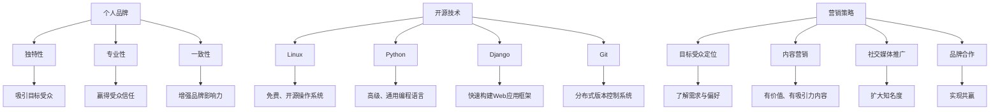
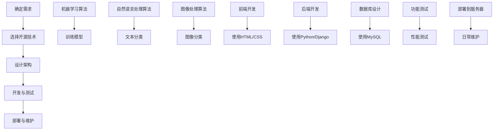

                 

# 利用开源技术打造个人品牌产品

## 关键词：个人品牌、开源技术、产品开发、营销策略

## 摘要

本文旨在探讨如何利用开源技术打造个人品牌产品，从而在竞争激烈的市场中脱颖而出。我们将从背景介绍、核心概念与联系、核心算法原理与具体操作步骤、数学模型与公式讲解、项目实战、实际应用场景、工具和资源推荐以及总结与展望等多个方面进行详细阐述。通过这篇文章，读者将了解到如何通过开源技术打造个人品牌产品，提升个人影响力，并取得商业成功。

## 1. 背景介绍

在当今数字化时代，个人品牌的重要性日益凸显。一个成功的个人品牌不仅可以提升个人的知名度，还可以带来商业机会和财富。然而，打造个人品牌并非易事，需要具备一定的技术能力、创新思维和营销策略。开源技术作为一种重要的工具，为个人品牌产品的开发提供了丰富的资源和支持。

开源技术具有以下几个特点：

1. **免费性和开放性**：开源技术通常不需要付费，并且其源代码对开发者开放，使得个人可以自由地使用、修改和分发。
2. **社区支持**：开源技术拥有庞大的开发者社区，个人可以从中获取帮助、分享经验和学习新知识。
3. **灵活性**：开源技术可以根据个人需求进行定制和扩展，满足不同的应用场景。

利用开源技术打造个人品牌产品具有以下优势：

1. **节省成本**：使用开源技术可以节省购买商业软件和服务的费用，降低个人品牌的初期投入。
2. **快速迭代**：开源技术支持快速开发与迭代，个人可以迅速响应市场需求，提升产品竞争力。
3. **增强影响力**：通过参与开源项目，个人可以积累丰富的技术经验，提升个人品牌的影响力和知名度。

然而，打造个人品牌产品也面临一些挑战，如竞争激烈、市场需求变化和资源有限等。因此，如何有效地利用开源技术，制定合适的营销策略，是个人品牌成功的关键。

## 2. 核心概念与联系

在利用开源技术打造个人品牌产品之前，我们需要了解一些核心概念和它们之间的联系。以下是几个关键概念：

### 2.1 个人品牌

个人品牌是指个人在特定领域的专业形象和声誉。它包括个人技能、经验、价值观和社交网络等方面。一个成功的个人品牌应该具有以下特点：

1. **独特性**：个人品牌应该具有独特的个性，能够吸引目标受众。
2. **专业性**：个人品牌需要展示个人的专业技能和知识水平，以赢得受众的信任。
3. **一致性**：个人品牌在各个渠道和场合应该保持一致，以增强品牌影响力。

### 2.2 开源技术

开源技术是指那些源代码对公众开放，允许任何人自由使用、学习、修改和分发的软件或工具。常见的开源技术包括操作系统、编程语言、框架、库和工具等。以下是一些常用的开源技术：

1. **Linux**：一个免费、开源的类Unix操作系统，广泛应用于服务器、桌面和移动设备。
2. **Python**：一种高级、通用、易于学习的编程语言，广泛应用于数据分析、人工智能和Web开发。
3. **Django**：一个流行的Python Web开发框架，支持快速构建高效率、高质量的Web应用程序。
4. **Git**：一个分布式版本控制系统，用于管理代码的版本和协作开发。

### 2.3 营销策略

营销策略是指为了推广个人品牌产品而采取的一系列方法和手段。一个成功的营销策略应该包括以下几个方面：

1. **目标受众定位**：明确个人品牌的目标受众，了解他们的需求和偏好。
2. **内容营销**：通过撰写有价值、有吸引力的内容，吸引目标受众并建立信任。
3. **社交媒体推广**：利用社交媒体平台，如微博、微信公众号、知乎、LinkedIn等，扩大个人品牌的知名度。
4. **品牌合作**：与其他品牌或个人合作，共同推广产品，实现共赢。

### 2.4 Mermaid流程图

为了更好地理解上述核心概念之间的联系，我们可以使用Mermaid流程图进行展示：



## 3. 核心算法原理与具体操作步骤

在利用开源技术打造个人品牌产品时，算法原理和具体操作步骤是关键环节。以下是几个核心算法原理和具体操作步骤的简要介绍：

### 3.1 算法原理

1. **机器学习算法**：利用大量数据训练模型，使模型能够自动识别和分类数据。常见的机器学习算法包括线性回归、决策树、支持向量机等。
2. **自然语言处理算法**：处理和理解人类语言的技术。常见的自然语言处理算法包括词嵌入、文本分类、情感分析等。
3. **图像处理算法**：对图像进行识别、分割、增强等操作的技术。常见的图像处理算法包括卷积神经网络、图像分类等。

### 3.2 具体操作步骤

1. **确定产品需求**：明确个人品牌产品的目标和功能，了解目标受众的需求和偏好。
2. **选择合适的开源技术**：根据产品需求，选择合适的开源技术，如操作系统、编程语言、框架等。
3. **设计产品架构**：根据产品需求和技术选型，设计产品的整体架构，包括前端、后端、数据库等。
4. **开发与测试**：按照设计架构，使用开源技术进行产品开发，并进行功能测试和性能测试。
5. **部署与维护**：将产品部署到服务器或云平台上，并进行日常维护和更新。

### 3.3 Mermaid流程图

为了更好地展示核心算法原理和具体操作步骤的联系，我们可以使用Mermaid流程图：



## 4. 数学模型和公式详细讲解与举例说明

在利用开源技术打造个人品牌产品时，数学模型和公式是解决实际问题的重要工具。以下是一些常用的数学模型和公式，并进行详细讲解与举例说明：

### 4.1 线性回归模型

线性回归模型是一种用于预测连续值的统计方法。其数学模型可以表示为：

$$y = \beta_0 + \beta_1 \cdot x + \epsilon$$

其中，$y$ 是预测值，$x$ 是自变量，$\beta_0$ 和 $\beta_1$ 是模型的参数，$\epsilon$ 是误差项。

### 4.1.1 讲解

线性回归模型的目的是找到一条直线，使得这条直线能够最好地拟合数据点。为了找到这条直线，我们可以使用最小二乘法（Ordinary Least Squares，OLS）来估计模型参数。

### 4.1.2 举例说明

假设我们有一组数据点 $(x_1, y_1), (x_2, y_2), ..., (x_n, y_n)$，我们要使用线性回归模型预测 $y$ 的值。以下是具体步骤：

1. **数据预处理**：对数据进行标准化处理，使得自变量 $x$ 的取值范围在 [-1, 1] 之间。
2. **计算模型参数**：使用最小二乘法计算模型参数 $\beta_0$ 和 $\beta_1$：
   $$
   \beta_1 = \frac{\sum_{i=1}^{n}(x_i - \bar{x})(y_i - \bar{y})}{\sum_{i=1}^{n}(x_i - \bar{x})^2}
   $$
   $$
   \beta_0 = \bar{y} - \beta_1 \cdot \bar{x}
   $$
   其中，$\bar{x}$ 和 $\bar{y}$ 分别是自变量 $x$ 和预测值 $y$ 的平均值。
3. **预测新数据**：使用计算出的模型参数预测新数据点的 $y$ 值：
   $$
   \hat{y} = \beta_0 + \beta_1 \cdot x
   $$

### 4.2 支持向量机模型

支持向量机（Support Vector Machine，SVM）是一种用于分类的机器学习算法。其数学模型可以表示为：

$$
\min_{\beta, \beta_0} \frac{1}{2} ||\beta||^2 + C \cdot \sum_{i=1}^{n} \xi_i
$$

$$
\text{s.t.} \quad y_i (\beta_0 + \beta \cdot x_i) \geq 1 - \xi_i, \quad \xi_i \geq 0, \quad i = 1, 2, ..., n
$$

其中，$\beta$ 和 $\beta_0$ 是模型参数，$C$ 是正则化参数，$\xi_i$ 是松弛变量。

### 4.2.1 讲解

支持向量机的目的是找到一个最优的超平面，使得分类边界最大化。为了实现这一目标，我们使用拉格朗日乘子法（Lagrange Multiplier Method）来求解最优解。

### 4.2.2 举例说明

假设我们有一组数据点 $(x_1, y_1), (x_2, y_2), ..., (x_n, y_n)$，我们要使用支持向量机分类器将数据分为两类。以下是具体步骤：

1. **数据预处理**：对数据进行标准化处理，使得自变量 $x$ 的取值范围在 [-1, 1] 之间。
2. **选择合适的核函数**：根据数据特征选择合适的核函数，如线性核、多项式核、径向基函数核（Radial Basis Function，RBF）等。
3. **训练分类器**：使用训练数据训练支持向量机分类器，计算模型参数 $\beta$ 和 $\beta_0$：
   $$
   \min_{\beta, \beta_0} \frac{1}{2} ||\beta||^2 + C \cdot \sum_{i=1}^{n} \xi_i
   $$
   $$
   \text{s.t.} \quad y_i (\beta_0 + \beta \cdot x_i) \geq 1 - \xi_i, \quad \xi_i \geq 0, \quad i = 1, 2, ..., n
   $$
4. **预测新数据**：使用训练好的分类器预测新数据点的类别：
   $$
   y = \text{sign}(\beta_0 + \beta \cdot x)
   $$

## 5. 项目实战：代码实际案例与详细解释说明

在本节中，我们将通过一个实际案例，展示如何利用开源技术打造个人品牌产品。我们将以一个简单的博客系统为例，介绍开发环境搭建、源代码实现、代码解读与分析等内容。

### 5.1 开发环境搭建

为了搭建开发环境，我们需要安装以下软件：

1. **操作系统**：Linux（如Ubuntu）
2. **编程语言**：Python 3.x
3. **Web框架**：Django
4. **数据库**：MySQL

以下是安装步骤：

1. 安装操作系统：

   - 在虚拟机中安装Ubuntu 18.04 LTS。
   - 设置网络和虚拟机权限。

2. 安装Python：

   - 打开终端，执行以下命令：
     ```bash
     sudo apt update
     sudo apt install python3 python3-pip
     ```

3. 安装Django：

   - 打开终端，执行以下命令：
     ```bash
     pip3 install django
     ```

4. 安装MySQL：

   - 打开终端，执行以下命令：
     ```bash
     sudo apt install mysql-server
     sudo mysql_secure_installation
     ```

### 5.2 源代码详细实现和代码解读

以下是博客系统的源代码实现和代码解读：

#### 5.2.1 settings.py

```python
# settings.py
```

- **配置数据库连接**：
  ```python
  DATABASES = {
      'default': {
          'ENGINE': 'django.db.backends.mysql',
          'NAME': 'blog',
          'USER': 'root',
          'PASSWORD': 'password',
          'HOST': 'localhost',
          'PORT': '3306',
      }
  }
  ```

- **配置Django应用**：
  ```python
  INSTALLED_APPS = [
      'django.contrib.admin',
      'django.contrib.auth',
      'django.contrib.contenttypes',
      'django.contrib.sessions',
      'django.contrib.messages',
      'django.contrib.staticfiles',
      'blog',
  ]
  ```

#### 5.2.2 urls.py

```python
# urls.py
```

- **定义URL映射**：
  ```python
  from django.contrib import admin
  from django.urls import path
  from . import views

  urlpatterns = [
      path('admin/', admin.site.urls),
      path('blog/', views.blog_index),
  ]
  ```

#### 5.2.3 views.py

```python
# views.py
```

- **定义视图函数**：
  ```python
  from django.shortcuts import render

  def blog_index(request):
      return render(request, 'blog/index.html')
  ```

#### 5.2.4 templates/blog/index.html

```html
<!-- templates/blog/index.html -->
<!DOCTYPE html>
<html>
<head>
    <title>个人博客</title>
</head>
<body>
    <h1>欢迎来到我的博客</h1>
</body>
</html>
```

### 5.3 代码解读与分析

以下是代码的解读与分析：

- **settings.py**：该文件用于配置Django应用的基本设置，如数据库连接、应用名称等。通过设置 `DATABASES`，我们可以将博客系统连接到MySQL数据库。
- **urls.py**：该文件用于定义URL映射。通过定义 `urlpatterns`，我们可以将请求路由到对应的视图函数。
- **views.py**：该文件用于定义视图函数。`blog_index` 视图函数接收请求对象 `request`，并返回一个包含HTML模板的响应对象。在该示例中，我们返回了一个简单的欢迎页面。
- **templates/blog/index.html**：该文件是博客系统的HTML模板。它定义了页面结构，包括标题和欢迎信息。

通过以上代码，我们成功搭建了一个简单的博客系统。读者可以根据实际需求，添加更多功能，如文章发布、评论管理、用户认证等。

## 6. 实际应用场景

利用开源技术打造个人品牌产品在实际应用场景中具有广泛的应用价值。以下是一些典型的实际应用场景：

### 6.1 个人博客

个人博客是利用开源技术打造个人品牌产品的一种常见形式。通过个人博客，个人可以分享专业知识和经验，吸引关注者，提升个人影响力。例如，可以使用Django框架搭建个人博客系统，利用Markdown编辑器撰写文章，并通过自定义主题和插件实现个性化展示。

### 6.2 开源项目

参与开源项目是提升个人品牌影响力的另一种有效途径。通过参与开源项目，个人可以展示自己的技术能力，与业内同行交流，建立合作关系。例如，可以参与某个开源项目的开发，为项目贡献代码，编写文档，或提供技术支持。

### 6.3 教学视频

利用开源技术制作教学视频是另一种打造个人品牌的方式。通过教学视频，个人可以传授专业知识，吸引学生，建立在线教育品牌。例如，可以使用OpenCV库开发一个图像处理教学视频，介绍如何使用Python进行图像识别和增强。

### 6.4 社交媒体管理工具

开发一款社交媒体管理工具是利用开源技术打造个人品牌产品的又一个应用场景。通过开发这款工具，个人可以展示自己的编程技能，为用户提供有价值的服务。例如，可以开发一款微博数据分析工具，分析微博用户的行为和趋势。

### 6.5 人工智能应用

利用开源人工智能技术，个人可以开发各种有趣的应用程序，提升个人品牌影响力。例如，可以开发一个基于深度学习的人脸识别系统，或一个基于自然语言处理的语言翻译工具。

## 7. 工具和资源推荐

为了更好地利用开源技术打造个人品牌产品，以下是一些常用的工具和资源推荐：

### 7.1 学习资源推荐

1. **书籍**：
   - 《Django实战》
   - 《Python编程：从入门到实践》
   - 《深入理解计算机系统》
   - 《机器学习实战》
2. **论文**：
   - 《深度学习》
   - 《自然语言处理综论》
   - 《计算机视觉：算法与应用》
3. **博客**：
   - [Django官方文档](https://docs.djangoproject.com/)
   - [Python官方文档](https://docs.python.org/3/)
   - [OpenCV官方文档](https://opencv.org/zh/docs/)
4. **网站**：
   - [GitHub](https://github.com/)
   - [Stack Overflow](https://stackoverflow.com/)
   - [知乎](https://www.zhihu.com/)

### 7.2 开发工具框架推荐

1. **开发环境**：
   - Linux操作系统
   - Python编程语言
   - Django框架
   - MySQL数据库
2. **版本控制**：
   - Git
   - GitHub
3. **Web服务器**：
   - Nginx
   - Apache
4. **云平台**：
   - AWS
   - Azure
   - Google Cloud Platform

### 7.3 相关论文著作推荐

1. **《深度学习》**：作者：Ian Goodfellow、Yoshua Bengio、Aaron Courville
2. **《自然语言处理综论》**：作者：Daniel Jurafsky、James H. Martin
3. **《计算机视觉：算法与应用》**：作者：David S. Kriegman、Jian Sun、Shai Avidan

## 8. 总结：未来发展趋势与挑战

随着数字化时代的到来，个人品牌的重要性日益凸显。利用开源技术打造个人品牌产品成为了一种流行的趋势。未来，个人品牌产品的发展趋势主要体现在以下几个方面：

1. **技术创新**：随着人工智能、大数据、区块链等技术的不断发展，个人品牌产品将更加智能化、个性化。
2. **社区互动**：个人品牌产品的成功离不开社区的支持。未来，个人品牌产品将更加注重与用户的互动，提升用户体验。
3. **跨平台整合**：个人品牌产品将逐步实现跨平台整合，为用户提供一站式服务。
4. **商业变现**：个人品牌产品将更加注重商业变现，通过广告、付费课程、咨询服务等方式实现盈利。

然而，个人品牌产品在发展过程中也面临一些挑战：

1. **竞争激烈**：随着越来越多的人参与个人品牌产品的开发，市场竞争将更加激烈。
2. **市场需求变化**：市场需求变化快速，个人品牌产品需要不断调整和优化，以适应市场变化。
3. **资源有限**：个人品牌产品在资源有限的情况下，需要高效利用开源技术和社区资源，提升产品竞争力。

总之，利用开源技术打造个人品牌产品是一个充满机遇和挑战的过程。只有不断学习、创新和优化，才能在竞争激烈的市场中脱颖而出。

## 9. 附录：常见问题与解答

### 9.1 如何选择合适的开源技术？

选择合适的开源技术需要考虑以下因素：

1. **项目需求**：根据项目需求选择适合的开源技术，如操作系统、编程语言、框架、数据库等。
2. **社区支持**：选择拥有活跃社区的开源技术，以便在遇到问题时获得帮助。
3. **技术成熟度**：选择技术成熟、稳定可靠的开源技术，降低项目风险。
4. **兼容性**：选择具有良好兼容性的开源技术，确保项目可以与现有系统无缝集成。

### 9.2 如何制定有效的营销策略？

制定有效的营销策略需要考虑以下方面：

1. **目标受众**：明确个人品牌的目标受众，了解他们的需求和偏好。
2. **内容营销**：通过撰写有价值、有吸引力的内容，提升个人品牌的影响力。
3. **社交媒体推广**：利用社交媒体平台，扩大个人品牌的知名度。
4. **品牌合作**：与其他品牌或个人合作，共同推广产品，实现共赢。

### 9.3 如何确保开源项目的质量？

确保开源项目的质量需要从以下几个方面入手：

1. **代码规范**：遵循统一的代码规范，提高代码的可读性和可维护性。
2. **测试用例**：编写详细的测试用例，确保项目的功能、性能和稳定性。
3. **文档编写**：编写完善的文档，包括用户手册、API文档等，方便用户使用和理解。
4. **持续集成**：采用持续集成工具，自动化测试和部署，提高开发效率。

## 10. 扩展阅读 & 参考资料

1. 《Django实战》：作者：威廉·维克多
2. 《Python编程：从入门到实践》：作者：埃里克·马瑟斯
3. 《深入理解计算机系统》：作者：杰里·瑞奇
4. 《机器学习实战》：作者：Peter Harrington
5. 《深度学习》：作者：Ian Goodfellow、Yoshua Bengio、Aaron Courville
6. 《自然语言处理综论》：作者：Daniel Jurafsky、James H. Martin
7. 《计算机视觉：算法与应用》：作者：David S. Kriegman、Jian Sun、Shai Avidan
8. [Django官方文档](https://docs.djangoproject.com/)
9. [Python官方文档](https://docs.python.org/3/)
10. [OpenCV官方文档](https://opencv.org/zh/docs/)
11. [GitHub](https://github.com/)
12. [Stack Overflow](https://stackoverflow.com/)
13. [知乎](https://www.zhihu.com/)

