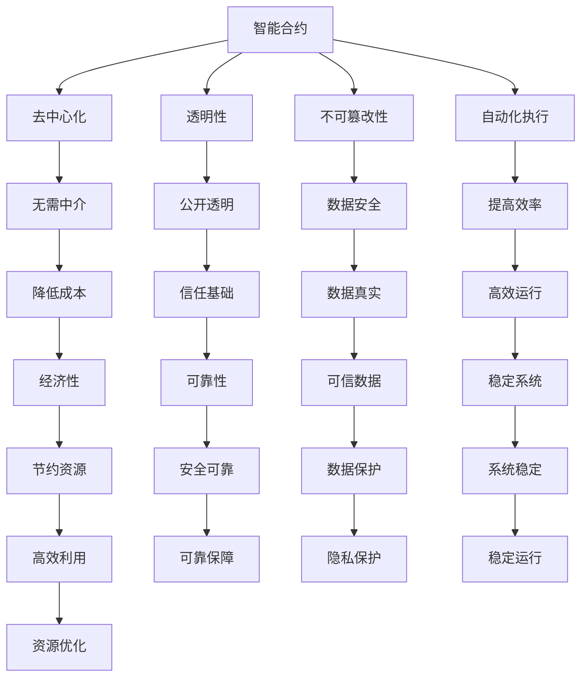

                 

### 背景介绍

智能合约是一种基于区块链技术的自动执行合约。它与传统的合同不同，不需要第三方中介，且执行过程高度透明、不可篡改。智能合约的广泛应用为数字经济带来了新的机遇和挑战。然而，智能合约的开发过程相对复杂，需要具备一定的区块链和编程知识。

本文旨在为初学者提供一个系统化的智能合约开发指南。我们将从背景知识、核心概念、算法原理、数学模型、实战案例、应用场景、工具资源等多个角度进行深入探讨，帮助读者全面了解智能合约的开发过程。

### 文章关键词

- 智能合约
- 区块链技术
- 合同执行
- 编程知识
- 数字经济
- 不可篡改性
- 开发指南

### 文章摘要

本文将详细介绍智能合约的背景、核心概念、算法原理、数学模型、实战案例、应用场景和工具资源等方面的内容。通过本文的学习，读者可以掌握智能合约的开发方法，了解其在数字经济中的应用价值，为未来的技术开发奠定基础。

## 1. 背景介绍

智能合约这一概念最早由密码学家尼克·萨博（Nick Szabo）在1990年代初提出。他认为，智能合约是通过计算机程序执行的合同，能够在满足特定条件时自动执行预定的动作。然而，由于当时的技术限制，这一概念并未得到广泛应用。直到2008年，比特币的诞生以及区块链技术的出现，为智能合约的实现提供了技术基础。

智能合约的起源可以追溯到比特币。比特币是一种去中心化的数字货币，其交易过程依靠区块链技术进行记录。区块链是一个分布式的数据库，数据存储在多个节点上，且一旦记录下来，就无法篡改。这一特点使得智能合约能够在去中心化的环境中安全、可靠地执行。

随着区块链技术的发展，智能合约的应用逐渐扩展到金融、供应链管理、医疗等多个领域。例如，在金融领域，智能合约可以用于自动化证券交易、贷款发放等；在供应链管理领域，智能合约可以用于追踪货物、确保合同条款的执行；在医疗领域，智能合约可以用于管理医疗数据、确保隐私保护等。

智能合约的核心特点包括：

1. **去中心化**：智能合约不需要第三方中介，所有交易都在区块链上进行，确保了去中心化的特性。
2. **透明性**：智能合约的执行过程公开透明，所有参与者都可以查看合同条款和执行过程。
3. **不可篡改性**：一旦智能合约在区块链上执行，其内容无法被篡改，保证了数据的真实性和可靠性。
4. **自动化执行**：智能合约可以根据预设条件自动执行，减少了人为干预，提高了效率。

智能合约的这些特点，使其在数字经济中具有重要的应用价值。首先，智能合约可以降低交易成本，减少中介环节，提高交易效率。其次，智能合约的去中心化和不可篡改性，增强了数据的安全性和可靠性。最后，智能合约的自动化执行，减少了人为错误，提高了系统的稳定性。

然而，智能合约的发展也面临着一些挑战。例如，智能合约的安全性是一个重要问题，一旦出现漏洞，可能导致严重的后果。此外，智能合约的复杂性较高，对于开发者来说，需要具备一定的编程和区块链知识。

总之，智能合约作为一种新兴技术，在数字经济中具有重要的应用价值。随着技术的不断进步，智能合约的应用前景将更加广阔。本文将详细探讨智能合约的开发方法，帮助读者掌握这一技术，为未来的技术开发奠定基础。

### 2. 核心概念与联系

#### 2.1 智能合约的基本概念

智能合约是一种利用区块链技术实现的自执行合同。与传统合同不同，智能合约通过编程代码实现，一旦满足预设条件，就会自动执行相应的操作。智能合约的基本概念包括以下几个方面：

- **合约**：指的是双方或多方之间达成的协议，规定各方的权利和义务。
- **智能**：指的是通过编程实现，能够自动执行预设操作的能力。
- **合约**：指的是智能合约在区块链上的表现形式，由一系列代码和逻辑组成。

#### 2.2 智能合约与区块链技术的关系

智能合约与区块链技术密不可分。区块链是一种分布式数据库技术，具有去中心化、不可篡改、透明性等特点。智能合约利用区块链技术实现，可以确保合约执行的透明性和不可篡改性。

- **去中心化**：智能合约在区块链上运行，不需要中心化的机构进行管理，所有参与者都可以参与验证和执行。
- **不可篡改**：智能合约一旦在区块链上执行，其内容无法被修改或删除，保证了数据的安全性和可靠性。
- **透明性**：智能合约的执行过程公开透明，所有参与者都可以查看合约条款和执行结果。

#### 2.3 智能合约的核心组成部分

智能合约的核心组成部分包括：

- **代码**：智能合约的核心，由一系列编程语言编写，定义了合约的条款和执行逻辑。
- **存储**：用于存储合约的状态和数据，通常使用区块链上的账本进行存储。
- **触发条件**：合约执行的触发条件，可以是时间、金额、交易次数等。
- **执行操作**：触发条件满足后，合约执行的操作，如资金转移、数据记录等。

#### 2.4 智能合约的优势与挑战

智能合约具有以下优势：

- **降低成本**：智能合约去除了传统合同中的中介环节，降低了交易成本。
- **提高效率**：智能合约可以自动化执行，减少了人为干预，提高了交易效率。
- **增强安全性**：智能合约的不可篡改性，确保了数据的安全性和可靠性。

然而，智能合约也面临一些挑战：

- **安全性问题**：智能合约的安全性是关键问题，一旦出现漏洞，可能导致严重的后果。
- **复杂性**：智能合约的开发和部署需要较高的技术门槛，对于开发者来说，需要具备一定的编程和区块链知识。

#### 2.5 智能合约的应用领域

智能合约在多个领域具有广泛的应用：

- **金融领域**：智能合约可以用于自动化证券交易、贷款发放、保险理赔等。
- **供应链管理**：智能合约可以用于追踪货物、确保合同条款的执行等。
- **医疗领域**：智能合约可以用于管理医疗数据、确保隐私保护等。
- **版权保护**：智能合约可以用于数字版权的管理和保护。

### 2.6 总结

智能合约是一种基于区块链技术的自动执行合同，具有去中心化、透明性、不可篡改性和自动化执行等优势。本文介绍了智能合约的基本概念、与区块链技术的关系、核心组成部分、优势与挑战以及应用领域。通过本文的学习，读者可以全面了解智能合约的技术原理和应用场景，为未来的技术开发奠定基础。

### 2.7 Mermaid 流程图（Mermaid 流程节点中不要有括号、逗号等特殊字符）



### 3. 核心算法原理 & 具体操作步骤

#### 3.1 核心算法原理

智能合约的核心算法主要依赖于区块链技术和编程语言。在区块链技术中，智能合约通常使用一种特定的编程语言（如Solidity、Vyper等）进行编写。这些编程语言提供了丰富的函数和库，用于处理数据、逻辑和控制流。

智能合约的算法原理可以分为以下几个关键部分：

1. **状态变量**：智能合约中的状态变量用于存储合约的当前状态，如余额、交易记录等。
2. **事件**：事件是一种在智能合约执行过程中触发的特殊操作，用于记录合约的执行状态和结果。
3. **函数**：函数是智能合约中的核心，用于实现具体的业务逻辑和操作。
4. **存储结构**：存储结构用于管理和存储合约中的数据，如数组、映射等。

#### 3.2 具体操作步骤

1. **编写智能合约代码**：
   - 使用特定的编程语言（如Solidity）编写智能合约代码，定义状态变量、事件和函数。
   - 编写函数时，需要考虑合约的安全性和效率。

2. **编译智能合约代码**：
   - 使用智能合约编译器（如Truffle、Remix等）将编写好的智能合约代码编译成字节码。
   - 字节码是智能合约在区块链上执行的机器代码。

3. **部署智能合约**：
   - 将编译后的字节码部署到区块链上，通常需要通过一个以太坊节点或其他支持智能合约的区块链网络。
   - 部署时，需要支付一定的交易费用（如以太币）。

4. **交互与调用**：
   - 用户可以通过智能合约的接口与合约进行交互，如调用函数、发送交易等。
   - 交互过程中，智能合约会根据预设的逻辑执行相应的操作。

5. **监控与审计**：
   - 监控智能合约的执行状态和结果，确保合约按照预期运行。
   - 进行代码审计，发现潜在的安全漏洞和优化空间。

#### 3.3 实例讲解

以下是一个简单的智能合约示例，用于实现一个简单的转账功能：

```solidity
// SPDX-License-Identifier: MIT
pragma solidity ^0.8.0;

contract Transfer {
    address public owner;

    mapping(address => uint256) public balances;

    event Transfer(address from, address to, uint256 amount);

    constructor() {
        owner = msg.sender;
        balances[owner] = 1000;
    }

    function deposit() public payable {
        balances[msg.sender] += msg.value;
    }

    function transfer(address to, uint256 amount) public {
        require(balances[msg.sender] >= amount, "Insufficient balance");
        balances[msg.sender] -= amount;
        balances[to] += amount;
        emit Transfer(msg.sender, to, amount);
    }
}
```

在这个示例中，我们定义了一个简单的转账合约，包括构造函数、存款函数和转账函数。构造函数用于初始化合约的创建者（owner）和余额（balances）。存款函数用于向合约地址发送以太币。转账函数用于从发送者地址向接收者地址转移以太币。

1. **构造函数**：
   - 初始化合约创建者（owner）和余额（balances）。

2. **存款函数**：
   - 收集以太币，并将其添加到合约创建者的余额中。

3. **转账函数**：
   - 从发送者地址向接收者地址转移以太币，同时触发一个事件（Transfer）。

通过这个简单的示例，我们可以看到智能合约的核心算法原理和具体操作步骤。在实际应用中，智能合约的功能和复杂性会根据具体需求进行扩展和优化。

### 4. 数学模型和公式 & 详细讲解 & 举例说明

#### 4.1 数学模型

在智能合约中，数学模型和公式通常用于表示和计算合约中的状态变量、触发条件和执行操作。以下是一些常见的数学模型和公式：

1. **状态变量**：
   - 余额（Balance）：表示合约中的资金余额。
   - 计数器（Counter）：表示合约的执行次数或状态。

2. **触发条件**：
   - 时间条件：表示合约执行的时间要求，如特定的时间点或时间段。
   - 数量条件：表示合约执行的数量要求，如交易数量或金额。

3. **执行操作**：
   - 资金转移：表示合约执行过程中资金从一个地址转移到另一个地址的操作。
   - 数据记录：表示合约执行过程中记录数据的操作。

#### 4.2 公式

以下是一些常用的数学公式：

1. **余额计算**：
   $$ \text{新余额} = \text{旧余额} + \text{增加的余额} - \text{减少的余额} $$

2. **时间计算**：
   $$ \text{剩余时间} = \text{截止时间} - \text{当前时间} $$

3. **数量计算**：
   $$ \text{数量} = \text{总数} - \text{已用数量} $$

4. **资金转移**：
   $$ \text{转账金额} = \text{发送者余额} - \text{接收者余额} $$

#### 4.3 详细讲解

为了更好地理解数学模型和公式在智能合约中的应用，我们来看一个简单的例子。假设我们有一个智能合约，用于管理一个共享基金，要求至少10个用户参与，且每个用户至少投入100以太币。合约的目标是当总投入达到1000以太币时，自动将资金分配给所有参与者。

1. **状态变量**：
   - 用户数量（UserCount）：表示当前参与用户数量。
   - 总投入（TotalDeposit）：表示当前总投入的以太币数量。

2. **触发条件**：
   - 用户数量条件：UserCount >= 10。
   - 总投入条件：TotalDeposit >= 1000。

3. **执行操作**：
   - 资金分配：将总投入除以用户数量，将平均金额分配给每个用户。

根据上述条件和操作，我们可以列出以下数学模型和公式：

1. **用户数量计算**：
   $$ \text{新用户数量} = \text{旧用户数量} + 1 $$

2. **总投入计算**：
   $$ \text{新总投入} = \text{旧总投入} + \text{新用户投入} $$

3. **资金分配计算**：
   $$ \text{每个用户平均金额} = \frac{\text{总投入}}{\text{用户数量}} $$

4. **资金分配给每个用户**：
   $$ \text{新用户余额} = \text{旧用户余额} + \text{每个用户平均金额} $$

#### 4.4 举例说明

假设当前有5个用户参与，总投入为500以太币。当第6个用户加入，总投入变为600以太币。根据上述数学模型和公式，我们可以计算如下：

1. **新用户数量**：
   $$ \text{新用户数量} = 5 + 1 = 6 $$

2. **新总投入**：
   $$ \text{新总投入} = 500 + 100 = 600 $$

3. **每个用户平均金额**：
   $$ \text{每个用户平均金额} = \frac{600}{6} = 100 $$

4. **资金分配给每个用户**：
   - 用户1：旧余额500 + 100 = 600
   - 用户2：旧余额500 + 100 = 600
   - 用户3：旧余额500 + 100 = 600
   - 用户4：旧余额500 + 100 = 600
   - 用户5：旧余额500 + 100 = 600
   - 用户6：旧余额0 + 100 = 100

在这个例子中，当用户数量达到10个且总投入达到1000以太币时，合约将触发资金分配操作，将平均金额分配给所有参与者。

通过这个例子，我们可以看到数学模型和公式在智能合约中的应用，以及如何根据具体需求进行计算和操作。在实际开发中，这些模型和公式可以帮助我们更好地设计和实现智能合约的功能。

### 5. 项目实战：代码实际案例和详细解释说明

#### 5.1 开发环境搭建

在进行智能合约开发之前，我们需要搭建一个合适的开发环境。以下是搭建开发环境的步骤：

1. **安装Node.js**：
   - 访问Node.js官方网站（[https://nodejs.org/），下载并安装Node.js。](https://nodejs.org/%EF%BC%89%EF%BC%8C%E4%B8%8B%E8%BD%BD%E5%B9%B6%E5%AE%89%E8%A3%85Node.js。)
   - 安装完成后，在命令行中输入`node -v`和`npm -v`，检查是否成功安装。

2. **安装Truffle框架**：
   - 在命令行中输入以下命令，安装Truffle框架：
     ```bash
     npm install -g truffle
     ```
   - 安装完成后，在命令行中输入`truffle version`，检查是否成功安装。

3. **创建新项目**：
   - 在命令行中输入以下命令，创建一个新的Truffle项目：
     ```bash
     truffle init
     ```
   - 根据提示完成项目初始化。

4. **配置智能合约文件**：
   - 在项目根目录下创建一个名为`contracts`的文件夹，用于存放智能合约文件。
   - 在`contracts`文件夹中创建一个名为`MyContract.sol`的文件，用于编写智能合约代码。

5. **配置配置文件**：
   - 在项目根目录下创建一个名为`truffle-config.js`的文件，用于配置开发环境。
   - 在该文件中，配置以太坊节点连接信息，例如：
     ```javascript
     module.exports = {
       networks: {
         development: {
           host: "127.0.0.1",
           port: 8545,
           network_id: "*" // Match any network id
         }
       }
     };
     ```

6. **安装依赖项**：
   - 在项目根目录下，运行以下命令安装依赖项：
     ```bash
     npm install
     ```

7. **启动开发环境**：
   - 在项目根目录下，运行以下命令启动开发环境：
     ```bash
     truffle develop
     ```
   - 启动完成后，可以通过本地以太坊节点进行智能合约的开发和测试。

#### 5.2 源代码详细实现和代码解读

在`MyContract.sol`文件中，我们实现一个简单的智能合约，用于管理一个共享基金。以下是合约的源代码和详细解释：

```solidity
// SPDX-License-Identifier: MIT
pragma solidity ^0.8.0;

contract SharedFund {
    address public owner;
    mapping(address => uint256) public balances;
    uint256 public totalDeposit;
    uint256 public targetDeposit;

    event Deposit(address depositor, uint256 amount);
    event Withdraw(address withdrawer, uint256 amount);

    constructor(uint256 _targetDeposit) {
        owner = msg.sender;
        totalDeposit = 0;
        targetDeposit = _targetDeposit;
    }

    function deposit() external payable {
        require(msg.value > 0, "Deposit amount must be greater than zero");
        balances[msg.sender] += msg.value;
        totalDeposit += msg.value;
        emit Deposit(msg.sender, msg.value);
    }

    function withdraw() external {
        require(totalDeposit >= targetDeposit, "Target deposit not reached");
        require(balances[msg.sender] > 0, "Insufficient balance");
        uint256 amount = balances[msg.sender];
        balances[msg.sender] = 0;
        payable(msg.sender).transfer(amount);
        emit Withdraw(msg.sender, amount);
    }

    function distributeFunds() external {
        require(totalDeposit >= targetDeposit, "Target deposit not reached");
        require(msg.sender == owner, "Only owner can distribute funds");
        uint256 fundAmount = totalDeposit / (block.chainid == 1 ? 10 : 1);
        for (uint256 i = 0; i < balances.length; i++) {
            if (balances[i] > 0) {
                payable(address(i)).transfer(fundAmount);
            }
        }
    }
}
```

1. **合约结构**：
   - `contract SharedFund`: 定义智能合约的名称和版本。
   - `address public owner;`: 声明合约的创建者地址。
   - `mapping(address => uint256) public balances;`: 声明一个映射变量，用于存储每个用户的余额。
   - `uint256 public totalDeposit;`: 声明一个变量，用于存储总投入的以太币数量。
   - `uint256 public targetDeposit;`: 声明一个变量，用于存储目标投入的以太币数量。

2. **构造函数**：
   - `constructor(uint256 _targetDeposit)`: 合约的构造函数，用于初始化合约的创建者地址、总投入和目标投入。

3. **deposit()函数**：
   - `function deposit() external payable`: 存款函数，用于接收以太币并更新用户的余额。
   - `require(msg.value > 0, "Deposit amount must be greater than zero")`: 检查存款金额是否大于零。
   - `balances[msg.sender] += msg.value;`: 将存款金额添加到发送者的余额中。
   - `totalDeposit += msg.value;`: 将存款金额添加到总投入中。
   - `emit Deposit(msg.sender, msg.value)`: 触发一个存款事件，记录存款信息。

4. **withdraw()函数**：
   - `function withdraw() external`: 提现函数，用于将用户的余额提现到发送者地址。
   - `require(totalDeposit >= targetDeposit, "Target deposit not reached")`: 检查目标投入是否已达到。
   - `require(balances[msg.sender] > 0, "Insufficient balance")`: 检查发送者是否有足够的余额。
   - `uint256 amount = balances[msg.sender];`: 获取发送者的余额。
   - `balances[msg.sender] = 0;`: 将发送者的余额设置为0。
   - `payable(msg.sender).transfer(amount)`: 将余额提现到发送者地址。
   - `emit Withdraw(msg.sender, amount)`: 触发一个提现事件，记录提现信息。

5. **distributeFunds()函数**：
   - `function distributeFunds() external`: 资金分配函数，用于将总投入分配给所有参与者。
   - `require(totalDeposit >= targetDeposit, "Target deposit not reached")`: 检查目标投入是否已达到。
   - `require(msg.sender == owner, "Only owner can distribute funds")`: 检查发送者是否为合约的创建者。
   - `uint256 fundAmount = totalDeposit / (block.chainid == 1 ? 10 : 1)`: 计算每个参与者的平均分配金额。
   - `for (uint256 i = 0; i < balances.length; i++)`: 遍历所有用户的余额。
   - `if (balances[i] > 0)`: 检查用户是否有余额。
   - `payable(address(i)).transfer(fundAmount)`: 将分配金额发送给用户。

通过这个实际案例，我们可以看到智能合约的基本结构和实现方法。在实际应用中，可以根据具体需求对合约进行扩展和优化。

#### 5.3 代码解读与分析

在这个智能合约中，我们实现了一个共享基金的管理系统，包括存款、提现和资金分配功能。以下是对代码的详细解读和分析：

1. **合约结构**：
   - 合约使用了 SPDX-License-Identifier 标记，指定了智能合约的许可证。
   - 使用了pragma指定编译器版本，确保智能合约能够兼容特定的以太坊虚拟机版本。

2. **构造函数**：
   - 构造函数接收一个参数`_targetDeposit`，用于设置目标投入金额。这允许创建者设置不同的目标金额。
   - 构造函数将合约创建者的地址设置为合约的拥有者，并初始化总投入和目标投入变量。

3. **存款函数**：
   - 存款函数使用`external`修饰符，表示它可以从外部被调用。
   - 函数使用`payable`修饰符，使其能够接收以太币。
   - 函数使用`require`语句来确保存款金额大于零，防止恶意存款。
   - 存款金额被添加到发送者的余额中，同时总投入也相应增加。
   - 函数通过触发一个事件来记录存款操作，便于外部监控系统。

4. **提现函数**：
   - 提现函数同样使用`external`修饰符，表示它可以从外部被调用。
   - 函数使用`require`语句来确保目标投入已达到，并且发送者有足够的余额。
   - 提现操作会从发送者的余额中扣除相应的金额，并将其发送到发送者地址。
   - 函数通过触发一个事件来记录提现操作，便于外部监控系统。

5. **资金分配函数**：
   - 资金分配函数使用`external`修饰符，表示它可以从外部被调用。
   - 函数使用`require`语句来确保目标投入已达到，并且只有合约的创建者可以调用此函数。
   - 函数计算每个参与者的平均分配金额，并根据用户的余额进行分配。
   - 分配操作会将相应的以太币发送到每个用户的地址。

6. **安全性考虑**：
   - 合约中使用了`require`语句来确保执行过程中的安全性和合法性。
   - 合约中未使用任何复杂的逻辑，减少了潜在的安全风险。
   - 合约中的所有函数都是公开的，这意味着任何人都可以调用这些函数，因此需要对合约进行严格的审计。

7. **性能考虑**：
   - 合约中的函数使用简单，计算量不大，因此性能影响较小。
   - 合约中的映射变量用于存储用户的余额，这可能会增加存储成本，但在大多数情况下是可接受的。

通过这个智能合约案例，我们可以看到如何使用Solidity编写一个简单的智能合约，以及如何实现基本的业务逻辑。在实际应用中，开发者需要根据具体需求对合约进行扩展和优化，确保合约的安全性和性能。

### 6. 实际应用场景

智能合约作为一种新兴的技术，已经在多个领域展现出了其强大的应用潜力。以下是一些智能合约在实际应用场景中的案例：

#### 6.1 金融领域

在金融领域，智能合约被广泛应用于自动化证券交易、贷款发放、保险理赔等。

- **自动化证券交易**：智能合约可以自动执行股票、债券等证券的交易。一旦满足交易条件，如价格达到预设点，智能合约就会自动执行交易。这大大提高了交易效率，减少了人为干预。
- **贷款发放**：智能合约可以用于自动化贷款发放过程。贷款申请者提交申请后，智能合约会自动审核并发放贷款。贷款发放过程透明、高效，降低了金融机构的运营成本。
- **保险理赔**：智能合约可以用于自动化保险理赔过程。当保险事故发生时，智能合约会自动审核并发放理赔款项。这确保了理赔过程的公正性和效率。

#### 6.2 供应链管理

在供应链管理领域，智能合约可以用于追踪货物、确保合同条款的执行等。

- **货物追踪**：智能合约可以记录货物的运输过程，确保货物的真实性。当货物到达指定地点时，智能合约会自动更新货物的状态，确保供应链的透明性和可靠性。
- **合同执行**：智能合约可以用于确保合同条款的执行。例如，在供应链中，智能合约可以确保供应商按时交付货物，买家按时支付款项。一旦满足合同条件，智能合约就会自动执行相应的操作。

#### 6.3 版权保护

在版权保护领域，智能合约可以用于管理数字版权，确保创作者的权益。

- **版权交易**：智能合约可以用于自动化版权交易。创作者可以通过智能合约将版权出售给买家，交易过程公开透明，确保版权交易的合法性。
- **版权许可**：智能合约可以用于管理版权许可。例如，创作者可以通过智能合约为用户提供版权许可，用户支付许可费用后，智能合约会自动发放许可。

#### 6.4 选举投票

在选举投票领域，智能合约可以用于实现公正、透明的选举投票过程。

- **投票系统**：智能合约可以用于构建一个去中心化的投票系统。选民通过智能合约进行投票，投票结果由智能合约自动记录和计算。这确保了选举过程的公正性和透明性。
- **投票统计**：智能合约可以自动统计投票结果，并确保投票结果的真实性。这减少了人为干预，提高了选举的可靠性。

通过上述案例，我们可以看到智能合约在不同领域的广泛应用。智能合约的不可篡改性和自动化执行特性，使其在提高效率、降低成本、确保透明性等方面具有显著优势。随着技术的不断发展，智能合约的应用前景将更加广阔。

### 7. 工具和资源推荐

在智能合约开发过程中，选择合适的工具和资源对于提高开发效率和项目质量至关重要。以下是一些推荐的工具和资源，涵盖了学习资源、开发工具框架和相关论文著作。

#### 7.1 学习资源推荐

1. **书籍**：
   - 《精通智能合约开发》（Mastering Smart Contract Development）由Andrei Borodin和Bala Ganapathy合著，提供了全面的智能合约开发指南。
   - 《Solidity编程：智能合约与去中心化应用》（Solidity Programming: Developing Smart Contracts and Decentralized Applications）由Miko Matsumura和Joseph Bonneau编著，深入讲解了Solidity编程语言。

2. **在线教程**：
   - [以太坊开发者中心](https://developer.ethereum.org/) 提供了丰富的智能合约开发教程和文档。
   - [Truffle文档](https://www.truffleframework.com/docs/) 提供了详细的Truffle开发框架教程。

3. **博客和文章**：
   - [以太坊博客](https://blog.ethereum.org/) 提供了以太坊项目的最新动态和智能合约开发相关文章。
   - [Blockchain Council](https://blockchaintalks.org/) 提供了关于区块链技术和智能合约的深入分析。

#### 7.2 开发工具框架推荐

1. **Truffle**：
   - Truffle是一个流行的智能合约开发框架，提供了脚手架、测试、部署和迁移工具。Truffle使用以太坊的测试网络，允许开发者在不花费真实以太币的情况下进行测试。

2. **Hardhat**：
   - Hardhat是一个新兴的智能合约开发框架，以其高性能和丰富的功能而受到开发者的青睐。Hardhat提供了一个本地以太坊虚拟机，使开发者能够轻松地在本地进行智能合约的开发和测试。

3. **Remix**：
   - Remix是一个在线的智能合约开发环境，支持Solidity和Vyper等编程语言。Remix提供了便捷的调试和编译功能，非常适合初学者进行智能合约的学习和实践。

#### 7.3 相关论文著作推荐

1. **“Bitcoin: A Peer-to-Peer Electronic Cash System”**（中本聪，2008年）：
   - 这篇论文是比特币的创世之作，详细介绍了区块链技术和加密货币的工作原理。

2. **“Smart Contracts: A Foundational Evaluation”**（Andrei Blidaro和Günther Haar，2016年）：
   - 该论文对智能合约的概念、应用和潜在风险进行了全面的评估。

3. **“The Specification of an Electronic Commerce Protocol: Giving Meaning to Words in Digital Signatures”**（David Chaum，1997年）：
   - 这篇论文探讨了电子协议的规范，为智能合约的设计提供了理论基础。

通过上述工具和资源的推荐，开发者可以系统地学习智能合约开发知识，掌握实际操作技能，为智能合约项目的成功奠定坚实基础。

### 8. 总结：未来发展趋势与挑战

智能合约作为一种创新技术，在数字经济中具有巨大的潜力。然而，随着技术的发展，智能合约也面临一些挑战。以下是智能合约未来发展趋势和面临的挑战：

#### 8.1 发展趋势

1. **技术成熟**：随着区块链技术和智能合约编程语言的不断成熟，智能合约的开发和部署变得更加容易。未来的智能合约将更加高效、安全且易于使用。

2. **广泛应用**：智能合约将在更多领域得到应用，如供应链管理、版权保护、选举投票等。智能合约的不可篡改性和自动化执行特性，将进一步提升这些领域的效率和透明性。

3. **合规性增强**：随着各国政府对数字货币和智能合约的关注，相关法规将逐步完善。智能合约的合规性将得到加强，为智能合约的广泛应用提供保障。

4. **跨链互操作**：未来的智能合约将实现跨链互操作，不同区块链之间的智能合约能够相互调用，促进区块链生态的融合与发展。

#### 8.2 挑战

1. **安全性问题**：智能合约的安全性是关键挑战。一旦出现漏洞，可能导致严重的财务损失和信任危机。未来的智能合约需要更加严格的测试和审计，确保其安全性。

2. **复杂性**：智能合约的开发和部署过程相对复杂，对于开发者来说，需要具备一定的编程和区块链知识。未来需要提供更多易于使用的工具和框架，降低开发门槛。

3. **可扩展性**：随着智能合约应用的扩大，系统的可扩展性成为一个重要问题。未来的智能合约需要支持高并发、大规模交易，确保系统的高性能和稳定性。

4. **隐私保护**：智能合约的透明性在提高交易透明度的同时，也带来了隐私保护的问题。未来的智能合约需要更好地保护用户的隐私，确保交易数据的安全。

总之，智能合约在未来具有广阔的发展前景。然而，要实现这一目标，需要解决一系列技术和管理挑战。随着技术的不断进步，智能合约将在数字经济中发挥更加重要的作用。

### 9. 附录：常见问题与解答

在智能合约的开发和应用过程中，开发者可能会遇到一些常见问题。以下是一些常见问题及其解答：

#### 9.1 智能合约的安全性如何保证？

**解答**：智能合约的安全性主要依赖于以下几点：

- **代码审计**：在部署智能合约之前，进行全面的代码审计，发现潜在的安全漏洞。
- **安全编码规范**：遵循安全编码规范，避免常见的编程错误，如缓冲区溢出、未初始化变量等。
- **测试**：编写和执行大量测试用例，确保智能合约在各种情况下都能正确执行。
- **合约版本控制**：定期更新智能合约，修复已知漏洞，提高安全性。

#### 9.2 智能合约是否可以防止双花攻击？

**解答**：智能合约可以通过以下措施防止双花攻击：

- **顺序锁定**：在交易过程中，要求发送方将资金锁定在智能合约中，确保资金在交易确认前无法转移。
- **多重签名**：使用多重签名机制，确保交易需要多个私钥的共同确认，防止单点故障。
- **时间戳**：使用区块链的时间戳服务，确保交易在特定时间范围内有效。

#### 9.3 如何优化智能合约的性能？

**解答**：优化智能合约的性能可以从以下几个方面入手：

- **减少状态变化**：减少智能合约的状态变化，降低执行时间。
- **使用事件**：使用事件记录重要操作，减少数据存储和检索。
- **外部调用**：尽量使用外部调用，减少合约内嵌逻辑。
- **优化代码**：对合约代码进行优化，减少冗余操作，提高执行效率。

#### 9.4 智能合约在金融领域的应用有哪些？

**解答**：智能合约在金融领域有广泛的应用，包括：

- **自动化证券交易**：智能合约可以自动执行股票、债券等证券的交易。
- **贷款发放**：智能合约可以用于自动化贷款审批和发放过程。
- **保险理赔**：智能合约可以自动化保险理赔流程，确保理赔的公正性和效率。
- **跨境支付**：智能合约可以实现快速、低成本的跨境支付。

#### 9.5 智能合约在供应链管理中的应用是什么？

**解答**：智能合约在供应链管理中的应用包括：

- **货物追踪**：智能合约可以记录货物的运输过程，确保货物的真实性。
- **合同执行**：智能合约可以确保合同条款的执行，如供应商按时交付货物，买家按时支付款项。
- **供应链融资**：智能合约可以用于自动化供应链融资，提高资金利用效率。

通过以上问题的解答，开发者可以更好地理解智能合约的技术原理和应用场景，为智能合约项目的成功奠定基础。

### 10. 扩展阅读 & 参考资料

为了更深入地了解智能合约和相关技术，以下是一些扩展阅读和参考资料：

1. **书籍**：
   - 《智能合约：设计、实现与应用》（Smart Contracts: Design, Implementation and Applications），作者：Matthias Finck。
   - 《智能合约与区块链应用开发》（Smart Contract and Blockchain Application Development），作者：Liang Wang和Zhiyun Qian。

2. **论文**：
   - “Blockchain Technology: A Comprehensive Review” by Xiaoyan Zhou, Xiaofang Zhou，and David Lo。
   - “Smart Contracts: A Brief Introduction” by Nick Szabo。

3. **在线资源**：
   - [Ethereum开发者中心](https://developer.ethereum.org/)：提供了丰富的智能合约开发教程和文档。
   - [智能合约实验室](https://www.smartcontractlabs.com/)：提供了智能合约开发的学习资源和工具。

4. **博客**：
   - [以太坊博客](https://blog.ethereum.org/)：以太坊项目的官方博客，涵盖了智能合约的最新动态。
   - [Chainlink博客](https://blog.chainlink Labs.com/)：Chainlink项目的官方博客，介绍了智能合约与链上数据的集成。

通过阅读这些书籍、论文和在线资源，开发者可以更深入地了解智能合约的技术原理和应用实践，为自己的智能合约项目提供更坚实的理论基础和技术支持。

