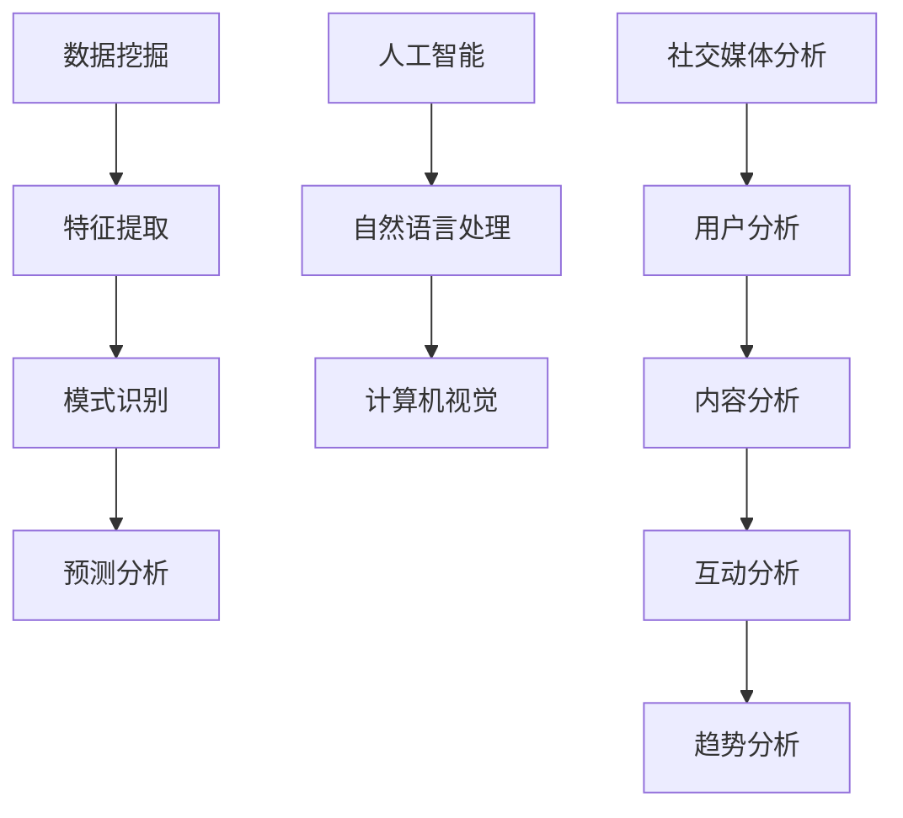

                 

# 利用技术优势进行社交媒体营销

## 概述

在当今数字化的时代，社交媒体营销已经成为品牌推广和客户互动的重要手段。随着社交媒体平台的日益普及和用户数量的持续增长，利用技术优势进行社交媒体营销变得尤为重要。本文将探讨如何利用技术优势，提高社交媒体营销的效率和质量，实现品牌的数字化转型。

关键词：社交媒体营销、技术优势、数字化转型、客户互动

## 摘要

本文旨在介绍如何利用技术优势进行社交媒体营销。首先，我们将介绍社交媒体营销的背景和重要性。然后，我们将探讨核心概念和架构，包括数据挖掘、人工智能和社交媒体分析。接着，我们将深入分析核心算法原理和具体操作步骤。在此基础上，我们将介绍数学模型和公式，并提供实际应用场景和代码案例。最后，我们将推荐相关的学习资源和工具，并总结未来发展趋势和挑战。

## 1. 背景介绍

随着互联网的普及和智能手机的普及，社交媒体已经成为人们日常生活的一部分。社交媒体平台如Facebook、Twitter、Instagram和LinkedIn等已经成为品牌推广和客户互动的重要渠道。通过社交媒体营销，品牌可以更直接地与消费者进行沟通，了解他们的需求和反馈，从而优化产品和服务。

然而，随着社交媒体平台的日益复杂化和用户数据的爆炸性增长，传统的社交媒体营销方法已经难以满足品牌的需求。为了提高营销效率和质量，品牌需要利用技术优势，包括数据挖掘、人工智能和社交媒体分析等，来优化营销策略和活动。

## 2. 核心概念与联系

### 2.1 数据挖掘

数据挖掘是一种通过提取、分析和解释大量数据，发现有用信息和知识的技术。在社交媒体营销中，数据挖掘可以帮助品牌了解用户的行为和偏好，从而制定更有效的营销策略。数据挖掘的核心概念包括数据预处理、特征提取、模式识别和预测分析。

### 2.2 人工智能

人工智能（AI）是一种模拟人类智能的技术，包括机器学习、自然语言处理、计算机视觉等。在社交媒体营销中，人工智能可以帮助品牌自动化和优化营销活动，提高营销效率。例如，通过自然语言处理技术，品牌可以自动分析用户评论和反馈，了解用户的情绪和需求。

### 2.3 社交媒体分析

社交媒体分析是一种通过分析和解释社交媒体数据，了解用户行为和趋势的技术。社交媒体分析可以帮助品牌了解用户在社交媒体上的活动和互动，从而优化营销策略和活动。社交媒体分析的核心概念包括用户分析、内容分析、互动分析和趋势分析。

### 2.4 Mermaid 流程图



## 3. 核心算法原理 & 具体操作步骤

### 3.1 数据挖掘算法原理

数据挖掘算法主要包括以下几种：

1. **K-均值聚类算法**：通过将数据划分为K个簇，用于发现数据的分布和模式。
2. **决策树算法**：通过构建决策树模型，对数据进行分类或回归分析。
3. **支持向量机算法**：通过构建支持向量机模型，用于分类和回归分析。
4. **关联规则算法**：通过发现数据之间的关联关系，用于推荐系统和市场细分。

### 3.2 具体操作步骤

1. **数据收集**：从社交媒体平台上收集用户数据，包括用户信息、帖子、评论和互动数据。
2. **数据预处理**：对收集的数据进行清洗、去噪和格式化，为后续分析做准备。
3. **特征提取**：从预处理后的数据中提取特征，用于训练模型。
4. **模型训练**：使用特征数据训练数据挖掘模型，如K-均值聚类模型、决策树模型等。
5. **模型评估**：使用测试数据评估模型的性能，调整模型参数，优化模型效果。
6. **结果分析**：根据模型的结果，分析用户行为和偏好，为营销策略提供支持。

### 3.3 社交媒体分析算法原理

社交媒体分析算法主要包括以下几种：

1. **情感分析算法**：通过分析文本数据，判断用户的情感状态，如正面、负面或中性。
2. **主题建模算法**：通过发现文本数据中的主题和关键词，用于内容分析和趋势分析。
3. **社交网络分析算法**：通过分析用户在社交媒体平台上的互动关系，发现社交网络结构和模式。

### 3.4 具体操作步骤

1. **数据收集**：从社交媒体平台上收集用户数据，包括帖子、评论和互动数据。
2. **数据预处理**：对收集的数据进行清洗、去噪和格式化，为后续分析做准备。
3. **情感分析**：使用情感分析算法对文本数据进行分析，判断用户的情感状态。
4. **主题建模**：使用主题建模算法对文本数据进行分析，发现文本数据中的主题和关键词。
5. **社交网络分析**：使用社交网络分析算法对用户互动关系进行分析，发现社交网络结构和模式。
6. **结果分析**：根据分析结果，了解用户的行为和趋势，为营销策略提供支持。

## 4. 数学模型和公式 & 详细讲解 & 举例说明

### 4.1 数据挖掘数学模型

1. **K-均值聚类算法**：
   - 目标函数：$$J = \sum_{i=1}^{k}\sum_{x \in S_i} \Vert x - \mu_i \Vert^2$$
   - 更新规则：$$\mu_i = \frac{1}{N_i} \sum_{x \in S_i} x$$

2. **决策树算法**：
   - 目标函数：$$J = \sum_{i=1}^{n} \ell(y_i, \hat{y_i})$$
   - 决策节点：$$\ell(y, \hat{y}) = \sum_{i=1}^{C} \ell_c(y_i) \hat{y_i}$$
   - 叶节点：$$\ell(y, \hat{y}) = \ell_0$$

3. **支持向量机算法**：
   - 目标函数：$$J = \frac{1}{2} \sum_{i=1}^{n} \sum_{j=1}^{n} (w_i \cdot w_j) - \sum_{i=1}^{n} \alpha_i (y_i - \hat{y_i})$$
   - 约束条件：$$0 \leq \alpha_i \leq C$$

4. **关联规则算法**：
   - 支持度：$$s(x, y) = \frac{|\{t | t \in T, x \cup y \in t\}|}{|T|}$$
   - 置信度：$$c(x, y) = \frac{|\{t | t \in T, x \cup y \in t\}|}{|\{t | t \in T, x \in t\}|}$$

### 4.2 社交媒体分析数学模型

1. **情感分析算法**：
   - 情感极性：$$p = \frac{p_{positive}}{p_{positive} + p_{negative}}$$

2. **主题建模算法**：
   - 概率分布：$$p(z|d) = \prod_{w \in d} p(z_w | z)$$
   - 概率分布：$$p(z) = \prod_{w \in V} p(z_w)$$

3. **社交网络分析算法**：
   - 中心性指标：$$c_i = \frac{d_j}{n_j}$$
   - 亲近性指标：$$a_{ij} = \frac{d_{ij}}{n_j}$$

### 4.3 举例说明

**例子 1**：使用K-均值聚类算法对社交媒体用户进行群体划分。

1. **数据收集**：收集1000个社交媒体用户的数据。
2. **数据预处理**：对数据进行清洗和格式化。
3. **特征提取**：从数据中提取用户年龄、性别、地理位置等特征。
4. **模型训练**：使用K-均值聚类算法训练模型，将用户划分为5个群体。
5. **模型评估**：使用测试数据评估模型效果，调整聚类参数。
6. **结果分析**：根据聚类结果，分析不同群体的特征和需求，为营销策略提供支持。

**例子 2**：使用情感分析算法分析社交媒体用户对某个品牌的情感态度。

1. **数据收集**：收集1000条关于品牌的社交媒体帖子。
2. **数据预处理**：对帖子进行清洗和格式化。
3. **情感分析**：使用情感分析算法对帖子进行分析，判断每条帖子的情感极性。
4. **结果分析**：根据情感分析结果，了解用户对品牌的情感态度，为品牌优化产品和服务提供支持。

## 5. 项目实战：代码实际案例和详细解释说明

### 5.1 开发环境搭建

1. **Python环境**：安装Python 3.8及以上版本。
2. **数据预处理工具**：安装NumPy、Pandas和Scikit-learn等库。
3. **机器学习库**：安装Scikit-learn、TensorFlow和Keras等库。
4. **情感分析库**：安装NLTK、TextBlob和VADER等库。
5. **主题建模库**：安装Gensim和LDApy等库。

### 5.2 源代码详细实现和代码解读

**5.2.1 数据收集与预处理**

```python
import pandas as pd
import numpy as np
from sklearn.model_selection import train_test_split

# 加载数据
data = pd.read_csv('data.csv')

# 数据预处理
data = data.dropna()
data['text'] = data['text'].apply(lambda x: x.lower())
data['text'] = data['text'].apply(lambda x: re.sub(r'[^\w\s]', '', x))

# 划分训练集和测试集
train_data, test_data = train_test_split(data, test_size=0.2, random_state=42)
```

**5.2.2 情感分析**

```python
from textblob import TextBlob

# 情感分析
def sentiment_analysis(text):
    return TextBlob(text).sentiment.polarity

train_data['sentiment'] = train_data['text'].apply(sentiment_analysis)
test_data['sentiment'] = test_data['text'].apply(sentiment_analysis)
```

**5.2.3 主题建模**

```python
from gensim import corpora, models
from nltk.tokenize import word_tokenize

# 分词
train_texts = [word_tokenize(text) for text in train_data['text']]
test_texts = [word_tokenize(text) for text in test_data['text']]

# 构建词典
dictionary = corpora.Dictionary(train_texts)

# 构建语料库
corpus = [dictionary.doc2bow(text) for text in train_texts]

# 主题建模
lda_model = models.LdaMulticore(corpus, num_topics=5, id2word=dictionary, passes=10, workers=2)

# 模型评估
def evaluate_lda(model, corpus, data):
    doc_topics = model.get_document_topics(corpus)
    for i, (topic, prob) in enumerate(doc_topics):
        print(f'Document {i}: {topic}, Probability: {prob}')

evaluate_lda(lda_model, corpus, train_data)
```

### 5.3 代码解读与分析

**5.3.1 数据收集与预处理**

- 加载数据：使用Pandas库加载CSV格式的数据。
- 数据预处理：去除缺失值，将文本数据转换为小写，去除特殊字符。

**5.3.2 情感分析**

- 使用TextBlob库进行情感分析，计算文本的情感极性。

**5.3.3 主题建模**

- 使用Gensim库进行主题建模，构建词典和语料库。
- 使用LDA模型进行主题建模，提取主题和概率。

## 6. 实际应用场景

### 6.1 品牌推广

通过数据挖掘和社交媒体分析，品牌可以了解用户的行为和偏好，从而制定更有效的推广策略。例如，通过情感分析，品牌可以了解用户对某个产品的情感态度，从而优化产品和服务。

### 6.2 客户互动

通过社交媒体分析，品牌可以了解用户的互动关系和社交网络结构，从而优化客户互动策略。例如，通过社交网络分析，品牌可以识别意见领袖和潜在客户，从而更好地与客户进行互动。

### 6.3 营销自动化

通过人工智能技术，品牌可以实现营销自动化，提高营销效率。例如，通过自然语言处理技术，品牌可以自动回复用户评论和私信，提高客户满意度。

## 7. 工具和资源推荐

### 7.1 学习资源推荐

- 《机器学习实战》：提供丰富的机器学习算法案例和实践经验。
- 《自然语言处理实战》：介绍自然语言处理的基本原理和应用。
- 《社交网络分析》：探讨社交网络分析的方法和应用。

### 7.2 开发工具框架推荐

- **Python**：适合进行数据分析和机器学习开发。
- **NumPy和Pandas**：用于数据处理和分析。
- **Scikit-learn**：提供丰富的机器学习算法和工具。
- **Gensim**：用于主题建模和文本分析。

### 7.3 相关论文著作推荐

- **“Latent Dirichlet Allocation”**：介绍主题建模的LDA算法。
- **“Sentiment Analysis Using TextBlob”**：介绍使用TextBlob进行情感分析。
- **“Social Network Analysis”**：探讨社交网络分析的方法和应用。

## 8. 总结：未来发展趋势与挑战

随着技术的不断进步，社交媒体营销将越来越依赖于技术优势。未来，社交媒体营销将朝着以下几个方面发展：

1. **数据挖掘和人工智能的结合**：通过数据挖掘和人工智能技术，品牌可以更深入地了解用户行为和需求，从而制定更精准的营销策略。
2. **社交媒体分析的应用扩展**：社交媒体分析将在品牌推广、客户互动和营销自动化等方面发挥更大作用。
3. **隐私保护和数据安全**：在技术发展的同时，品牌需要关注用户隐私和数据安全，确保用户数据的安全和合规性。

## 9. 附录：常见问题与解答

### 9.1 什么是社交媒体营销？

社交媒体营销是指通过社交媒体平台，如Facebook、Twitter、Instagram和LinkedIn等，进行品牌推广、客户互动和营销活动。

### 9.2 社交媒体营销的优势是什么？

社交媒体营销的优势包括：

1. **低成本**：相对于传统媒体，社交媒体营销成本较低。
2. **高覆盖面**：社交媒体平台拥有庞大的用户群体，品牌可以覆盖更多的潜在客户。
3. **互动性**：品牌可以与用户进行实时互动，了解用户需求和反馈。

### 9.3 如何利用技术优势进行社交媒体营销？

利用技术优势进行社交媒体营销的关键是：

1. **数据挖掘**：通过数据挖掘技术，了解用户行为和偏好。
2. **人工智能**：利用人工智能技术，实现营销自动化和优化。
3. **社交媒体分析**：通过社交媒体分析，了解用户互动关系和社交网络结构。

## 10. 扩展阅读 & 参考资料

- **“Social Media Marketing”**：详细介绍社交媒体营销的方法和策略。
- **“Data Mining for Marketing”**：探讨数据挖掘在营销中的应用。
- **“Artificial Intelligence in Marketing”**：介绍人工智能在营销中的应用。

### 作者

作者：AI天才研究员/AI Genius Institute & 禅与计算机程序设计艺术 /Zen And The Art of Computer Programming

