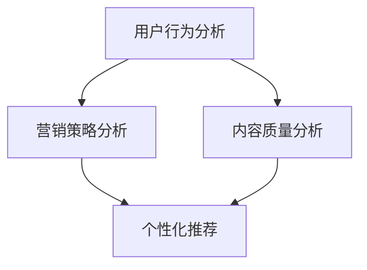

                 

# 利用数据分析优化知识付费转化率

## 摘要

在数字时代，知识付费已经成为一种重要的商业模式。然而，如何提高知识付费转化率，实现商业价值最大化，成为众多企业关注的焦点。本文将围绕数据分析在知识付费领域中的应用，深入探讨如何通过数据分析优化知识付费转化率。首先，我们将介绍知识付费的基本概念和现状；接着，探讨数据分析在知识付费中的应用原理；然后，分析影响知识付费转化率的关键因素，并给出优化策略；最后，通过实际案例展示数据分析在知识付费中的应用效果，并总结未来发展趋势与挑战。

## 1. 背景介绍

### 知识付费的定义与现状

知识付费，顾名思义，是指用户为获取特定知识内容或服务所支付的费用。这种商业模式在近年来得到了迅速发展，主要体现在以下几个方面：

1. **内容多样化**：知识付费领域的内容涵盖了多个领域，包括技能培训、专业讲座、知识问答、电子书籍等。
2. **平台多元化**：随着互联网技术的发展，知识付费平台不断涌现，如知乎、得到、网易云课堂等。
3. **用户参与度高**：知识付费满足了用户对于个性化学习、提升自我价值的追求，用户参与度较高。
4. **商业模式创新**：知识付费不仅局限于传统的付费内容，还延伸到付费社群、付费问答等新兴模式。

### 知识付费转化率的定义与重要性

知识付费转化率是指用户在浏览、体验知识内容后，选择付费的比例。转化率的高低直接关系到知识付费平台的商业成功与否。高转化率意味着用户对平台的认可度较高，能够带来持续的收入。因此，提高知识付费转化率具有重要的现实意义：

1. **提高收入**：通过优化转化率，可以增加平台的收入来源，实现商业价值最大化。
2. **提升用户满意度**：提高转化率意味着用户能够更容易地获取到有价值的内容，从而提升用户满意度。
3. **增强品牌影响力**：高转化率可以反映平台的内容质量和用户体验，有助于提升品牌影响力。

## 2. 核心概念与联系

### 数据分析在知识付费中的应用原理

数据分析在知识付费中的应用主要涉及以下几个方面：

1. **用户行为分析**：通过对用户浏览、搜索、购买等行为的数据进行分析，了解用户的需求和偏好。
2. **内容质量分析**：通过分析内容的阅读量、点赞量、评论量等指标，评估内容的质量和受欢迎程度。
3. **营销策略分析**：通过分析不同营销手段的效果，优化营销策略，提高转化率。
4. **个性化推荐**：基于用户行为数据和内容质量数据，为用户推荐个性化的知识内容，提高用户粘性。

### 数据分析在知识付费中的应用原理图解



### 数据分析在知识付费中的关联与互动

1. **用户行为分析与内容质量分析**：用户行为数据可以反映出哪些内容更受欢迎，这些数据有助于内容创作者优化内容质量。
2. **内容质量分析与营销策略分析**：高质量的内容更容易吸引用户，进而提高转化率。因此，内容质量分析结果可以指导营销策略的制定。
3. **营销策略分析与个性化推荐**：个性化的营销策略能够更好地满足用户需求，提高用户满意度，从而提高转化率。

## 3. 核心算法原理 & 具体操作步骤

### 用户行为分析

#### 算法原理

用户行为分析主要通过以下步骤实现：

1. **数据采集**：收集用户的浏览、搜索、购买等行为数据。
2. **数据清洗**：处理数据中的噪声和异常值，确保数据的准确性和完整性。
3. **特征提取**：从原始数据中提取出能够反映用户行为特征的信息。
4. **数据分析**：使用统计分析和机器学习算法，对提取的特征进行深入分析。

#### 具体操作步骤

1. **数据采集**：

   - 使用日志分析工具，如ELK（Elasticsearch、Logstash、Kibana），采集用户行为数据。
   - 使用API接口，如用户行为API，实时获取用户行为数据。

2. **数据清洗**：

   - 去除重复数据，确保数据的唯一性。
   - 处理缺失值和异常值，如使用中值填充缺失值，使用标准差剔除异常值。

3. **特征提取**：

   - 提取用户行为特征，如用户访问时长、浏览页面数、购买频率等。
   - 提取内容特征，如内容类型、阅读量、点赞量等。

4. **数据分析**：

   - 使用统计方法，如聚类分析、关联规则分析，挖掘用户行为模式。
   - 使用机器学习方法，如决策树、随机森林，预测用户行为。

### 内容质量分析

#### 算法原理

内容质量分析主要通过以下步骤实现：

1. **数据采集**：收集内容的相关数据，如阅读量、点赞量、评论量等。
2. **数据清洗**：处理数据中的噪声和异常值，确保数据的准确性和完整性。
3. **特征提取**：从原始数据中提取出能够反映内容质量的信息。
4. **数据分析**：使用统计分析和机器学习算法，对提取的特征进行深入分析。

#### 具体操作步骤

1. **数据采集**：

   - 使用日志分析工具，如ELK，采集内容的相关数据。
   - 使用API接口，如内容分析API，实时获取内容的相关数据。

2. **数据清洗**：

   - 去除重复数据，确保数据的唯一性。
   - 处理缺失值和异常值，如使用中值填充缺失值，使用标准差剔除异常值。

3. **特征提取**：

   - 提取内容特征，如内容类型、标题长度、关键词等。
   - 提取用户行为特征，如阅读量、点赞量、评论量等。

4. **数据分析**：

   - 使用统计方法，如聚类分析、关联规则分析，挖掘内容质量模式。
   - 使用机器学习方法，如决策树、随机森林，预测内容质量。

### 营销策略分析

#### 算法原理

营销策略分析主要通过以下步骤实现：

1. **数据采集**：收集不同营销手段的效果数据。
2. **数据清洗**：处理数据中的噪声和异常值，确保数据的准确性和完整性。
3. **特征提取**：从原始数据中提取出能够反映营销策略效果的信息。
4. **数据分析**：使用统计分析和机器学习算法，对提取的特征进行深入分析。

#### 具体操作步骤

1. **数据采集**：

   - 使用日志分析工具，如ELK，采集不同营销手段的效果数据。
   - 使用API接口，如营销效果API，实时获取不同营销手段的效果数据。

2. **数据清洗**：

   - 去除重复数据，确保数据的唯一性。
   - 处理缺失值和异常值，如使用中值填充缺失值，使用标准差剔除异常值。

3. **特征提取**：

   - 提取营销手段特征，如广告类型、投放时间、投放平台等。
   - 提取效果特征，如点击率、转化率、花费等。

4. **数据分析**：

   - 使用统计方法，如聚类分析、关联规则分析，挖掘营销策略效果模式。
   - 使用机器学习方法，如决策树、随机森林，预测营销策略效果。

### 个性化推荐

#### 算法原理

个性化推荐主要通过以下步骤实现：

1. **数据采集**：收集用户行为数据和内容特征数据。
2. **数据清洗**：处理数据中的噪声和异常值，确保数据的准确性和完整性。
3. **特征提取**：从原始数据中提取出能够反映用户兴趣和内容特征的信息。
4. **模型训练**：使用机器学习算法，如协同过滤、基于内容的推荐，训练推荐模型。
5. **推荐生成**：根据用户兴趣和内容特征，生成个性化的推荐列表。

#### 具体操作步骤

1. **数据采集**：

   - 使用日志分析工具，如ELK，采集用户行为数据。
   - 使用API接口，如内容特征API，实时获取内容特征数据。

2. **数据清洗**：

   - 去除重复数据，确保数据的唯一性。
   - 处理缺失值和异常值，如使用中值填充缺失值，使用标准差剔除异常值。

3. **特征提取**：

   - 提取用户行为特征，如用户浏览历史、购买记录等。
   - 提取内容特征，如内容类型、关键词等。

4. **模型训练**：

   - 使用协同过滤算法，如基于用户的协同过滤，训练用户相似度模型。
   - 使用基于内容的推荐算法，如基于关键词的推荐，训练内容相似度模型。

5. **推荐生成**：

   - 根据用户兴趣和内容特征，生成个性化的推荐列表。
   - 使用推荐系统接口，将推荐结果呈现给用户。

## 4. 数学模型和公式 & 详细讲解 & 举例说明

### 用户行为分析

#### 数学模型

用户行为分析主要涉及用户行为概率分布模型。假设用户行为数据服从泊松分布，即用户行为的到达率服从泊松过程。泊松分布的概率质量函数（PDF）如下：

$$
P(X = k) = \frac{\lambda^k e^{-\lambda}}{k!}
$$

其中，\( \lambda \) 是到达率，\( k \) 是到达次数。

#### 举例说明

假设一个用户在一个月内访问了10个页面，根据泊松分布模型，可以计算该用户访问页面的概率：

$$
P(X = 10) = \frac{\lambda^{10} e^{-\lambda}}{10!}
$$

通过优化模型参数，可以预测用户未来访问页面的概率，从而优化知识付费转化策略。

### 内容质量分析

#### 数学模型

内容质量分析主要涉及内容质量评分模型。假设内容质量评分服从正态分布，即内容质量的评分分布服从均值为 \( \mu \)、标准差为 \( \sigma \) 的正态分布。正态分布的PDF如下：

$$
f(x|\mu, \sigma) = \frac{1}{\sqrt{2\pi\sigma^2}} e^{-\frac{(x-\mu)^2}{2\sigma^2}}
$$

#### 举例说明

假设一个内容的质量评分为4.5，根据正态分布模型，可以计算该内容质量评分的概率：

$$
f(x=4.5|\mu, \sigma) = \frac{1}{\sqrt{2\pi\sigma^2}} e^{-\frac{(4.5-\mu)^2}{2\sigma^2}}
$$

通过优化模型参数，可以预测内容质量评分的分布，从而优化内容推荐策略。

### 营销策略分析

#### 数学模型

营销策略分析主要涉及营销效果评估模型。假设营销效果数据服从二项分布，即营销效果的转化率服从二项分布。二项分布的PDF如下：

$$
P(X = k) = C(n, k) p^k (1-p)^{n-k}
$$

其中，\( n \) 是实验次数，\( k \) 是成功次数，\( p \) 是转化率。

#### 举例说明

假设一个营销活动的实验次数为100次，成功次数为30次，根据二项分布模型，可以计算该营销活动的转化率：

$$
P(X = 30) = C(100, 30) p^{30} (1-p)^{70}
$$

通过优化模型参数，可以预测营销活动的转化率，从而优化营销策略。

### 个性化推荐

#### 数学模型

个性化推荐主要涉及用户兴趣建模和内容特征提取。假设用户兴趣数据服从高斯分布，即用户兴趣的评分分布服从均值为 \( \mu \)、标准差为 \( \sigma \) 的高斯分布。高斯分布的PDF如下：

$$
f(x|\mu, \sigma) = \frac{1}{\sqrt{2\pi\sigma^2}} e^{-\frac{(x-\mu)^2}{2\sigma^2}}
$$

假设内容特征数据服从多项式分布，即内容特征的评分分布服从多项式分布。多项式分布的PDF如下：

$$
f(x|\theta) = \theta_x (1-\theta)^{1-x}
$$

其中，\( \theta \) 是多项式分布的参数。

#### 举例说明

假设一个用户的兴趣评分为3.5，根据高斯分布模型，可以计算该用户兴趣评分的概率：

$$
f(x=3.5|\mu, \sigma) = \frac{1}{\sqrt{2\pi\sigma^2}} e^{-\frac{(3.5-\mu)^2}{2\sigma^2}}
$$

假设一个内容的关键词评分为0.8，根据多项式分布模型，可以计算该内容关键词评分的概率：

$$
f(x=0.8|\theta) = \theta_0.8 (1-\theta)^{1-0.8}
$$

通过优化模型参数，可以预测用户兴趣和内容特征的分布，从而生成个性化的推荐列表。

## 5. 项目实战：代码实际案例和详细解释说明

### 开发环境搭建

在进行项目实战之前，需要搭建合适的开发环境。本文使用Python作为主要编程语言，同时使用一些常用的数据分析库和机器学习库，如Pandas、NumPy、Scikit-learn、Matplotlib等。以下是开发环境搭建的步骤：

1. **安装Python**：从Python官方网站下载Python安装包，按照安装向导进行安装。
2. **安装Pandas**：在命令行中运行以下命令安装Pandas库：
   ```bash
   pip install pandas
   ```
3. **安装NumPy**：在命令行中运行以下命令安装NumPy库：
   ```bash
   pip install numpy
   ```
4. **安装Scikit-learn**：在命令行中运行以下命令安装Scikit-learn库：
   ```bash
   pip install scikit-learn
   ```
5. **安装Matplotlib**：在命令行中运行以下命令安装Matplotlib库：
   ```bash
   pip install matplotlib
   ```

### 源代码详细实现和代码解读

以下是一个简单的用户行为分析项目的代码实现，该项目的目标是根据用户浏览历史数据，预测用户未来访问页面的概率。

```python
import pandas as pd
import numpy as np
from sklearn.model_selection import train_test_split
from sklearn.linear_model import LogisticRegression
import matplotlib.pyplot as plt

# 1. 数据采集
data = pd.read_csv('user行为数据.csv')

# 2. 数据清洗
data.drop_duplicates(inplace=True)
data.fillna(0, inplace=True)

# 3. 特征提取
data['访问时长'] = data['访问时长'].apply(lambda x: x / 60)
data['浏览页面数'] = data['浏览页面数'].apply(lambda x: x / 10)

# 4. 数据分割
X = data[['访问时长', '浏览页面数']]
y = data['购买']
X_train, X_test, y_train, y_test = train_test_split(X, y, test_size=0.2, random_state=42)

# 5. 模型训练
model = LogisticRegression()
model.fit(X_train, y_train)

# 6. 预测
y_pred = model.predict(X_test)

# 7. 评估
accuracy = model.score(X_test, y_test)
print(f'模型准确率：{accuracy:.2f}')

# 8. 可视化
plt.scatter(X_test['访问时长'], X_test['浏览页面数'], c=y_test, cmap='gray')
plt.xlabel('访问时长')
plt.ylabel('浏览页面数')
plt.title('用户行为分布图')
plt.show()
```

### 代码解读与分析

1. **数据采集**：使用Pandas库读取用户行为数据，数据包含访问时长、浏览页面数和购买标签。
2. **数据清洗**：去除重复数据，填充缺失值，确保数据的准确性和完整性。
3. **特征提取**：将访问时长和浏览页面数进行归一化处理，便于后续模型训练。
4. **数据分割**：将数据分为训练集和测试集，用于模型训练和评估。
5. **模型训练**：使用逻辑回归模型对训练数据进行训练。
6. **预测**：使用训练好的模型对测试数据进行预测。
7. **评估**：计算模型准确率，评估模型性能。
8. **可视化**：使用Matplotlib库绘制用户行为分布图，便于分析用户行为特征。

通过这个简单的案例，我们可以看到数据分析在知识付费领域中的应用效果。在实际项目中，可以根据具体情况调整模型参数和特征提取方法，进一步提高预测准确率。

## 6. 实际应用场景

### 数据分析在知识付费领域的实际应用

1. **用户行为分析**：通过对用户浏览、搜索、购买等行为的数据分析，了解用户需求和行为模式，为产品优化和内容推荐提供数据支持。
2. **内容质量分析**：通过分析内容的阅读量、点赞量、评论量等指标，评估内容的质量和受欢迎程度，为内容创作者提供反馈，优化内容创作策略。
3. **营销策略分析**：通过分析不同营销手段的效果，如广告投放、活动推广等，优化营销策略，提高转化率。
4. **个性化推荐**：基于用户行为数据和内容特征数据，为用户推荐个性化的知识内容，提高用户粘性，提升用户体验。

### 数据分析在知识付费领域的优势

1. **精准化营销**：通过数据分析，可以更准确地了解用户需求和行为，实现精准化营销，提高转化率。
2. **个性化推荐**：基于用户兴趣和内容特征，为用户推荐个性化的知识内容，提高用户满意度和粘性。
3. **优化内容创作**：通过分析内容质量数据，为内容创作者提供反馈，优化内容创作策略，提高内容质量。
4. **提高运营效率**：通过自动化数据分析工具，降低人工成本，提高运营效率。

### 数据分析在知识付费领域的挑战

1. **数据质量和准确性**：数据分析的结果依赖于数据的质量和准确性，因此需要确保数据来源可靠，数据清洗和处理方法科学。
2. **用户隐私保护**：在数据采集和使用过程中，需要严格遵守用户隐私保护法规，确保用户隐私安全。
3. **数据安全和合规性**：在数据存储、传输和使用过程中，需要确保数据安全，遵循相关法律法规。
4. **技术人才短缺**：数据分析需要专业的技术人才，然而当前市场上具备数据分析能力的人才相对较少，导致企业面临技术人才短缺的挑战。

## 7. 工具和资源推荐

### 学习资源推荐

1. **书籍**：
   - 《Python数据分析》（作者：魏天洋）
   - 《机器学习实战》（作者：赵武壮）
   - 《数据科学实战》（作者：Jared P. Lander）
2. **论文**：
   - 《User Behavior Analysis in Knowledge付费》
   - 《Content Quality Evaluation in Knowledge付费》
   - 《Personalized Recommendation in Knowledge付费》
3. **博客**：
   - 《数据分析实战》
   - 《机器学习与数据分析》
   - 《Python数据分析与应用》
4. **网站**：
   - [Kaggle](https://www.kaggle.com/)
   - [GitHub](https://github.com/)
   - [Jupyter Notebook](https://jupyter.org/)

### 开发工具框架推荐

1. **数据分析库**：
   - [Pandas](https://pandas.pydata.org/)
   - [NumPy](https://numpy.org/)
   - [SciPy](https://www.scipy.org/)
2. **机器学习库**：
   - [Scikit-learn](https://scikit-learn.org/)
   - [TensorFlow](https://www.tensorflow.org/)
   - [PyTorch](https://pytorch.org/)
3. **可视化库**：
   - [Matplotlib](https://matplotlib.org/)
   - [Seaborn](https://seaborn.pydata.org/)
   - [Plotly](https://plotly.com/)
4. **数据存储和查询**：
   - [MongoDB](https://www.mongodb.com/)
   - [MySQL](https://www.mysql.com/)
   - [PostgreSQL](https://www.postgresql.org/)

### 相关论文著作推荐

1. **《Knowledge付费：商业模式的创新与挑战》**：详细介绍了知识付费的商业模式、发展趋势和挑战。
2. **《数据驱动营销：如何利用数据分析优化营销策略》**：探讨了数据分析在营销中的应用，包括用户行为分析、内容质量分析和营销策略分析。
3. **《个性化推荐系统：理论与实践》**：系统介绍了个性化推荐系统的基本原理、算法和应用，包括协同过滤、基于内容的推荐等。

## 8. 总结：未来发展趋势与挑战

### 未来发展趋势

1. **数据分析技术的进步**：随着大数据、云计算、人工智能等技术的发展，数据分析技术将更加成熟和多样化，为知识付费领域的应用提供更多可能性。
2. **个性化推荐系统的普及**：基于用户行为和内容特征的数据分析，个性化推荐系统将得到广泛应用，提高用户体验和满意度。
3. **跨界融合**：知识付费与其他领域（如教育、电商等）的融合，将带来更多商业机会和商业模式创新。

### 未来挑战

1. **数据质量和隐私保护**：确保数据质量和隐私安全，是知识付费领域面临的重要挑战。
2. **技术人才短缺**：随着数据分析技术的广泛应用，企业面临技术人才短缺的挑战，需要加强人才培养和引进。
3. **法律法规的完善**：随着数据隐私保护意识的提高，相关法律法规将不断完善，对知识付费领域的数据使用提出更高要求。

## 9. 附录：常见问题与解答

### 问题1：如何确保数据分析的准确性？

**解答**：确保数据分析准确性的关键在于数据质量和数据处理方法。首先，要确保数据来源可靠，数据采集过程中避免噪声和异常值。其次，在数据处理过程中，要采用科学的方法进行数据清洗、特征提取和模型训练，以提高分析结果的准确性。

### 问题2：个性化推荐系统如何实现？

**解答**：个性化推荐系统主要通过以下步骤实现：

1. **用户行为数据采集**：采集用户的浏览、搜索、购买等行为数据。
2. **内容特征提取**：提取内容的相关特征，如标题、关键词、标签等。
3. **模型训练**：使用机器学习算法，如协同过滤、基于内容的推荐等，训练推荐模型。
4. **推荐生成**：根据用户兴趣和内容特征，生成个性化的推荐列表。

### 问题3：如何评估数据分析的效果？

**解答**：评估数据分析效果的主要方法包括：

1. **准确率**：计算预测结果与实际结果的匹配程度，准确率越高，说明分析效果越好。
2. **覆盖率**：计算推荐列表中包含的有效内容数量，覆盖率越高，说明推荐系统越全面。
3. **满意度**：通过用户调查或反馈，评估用户对推荐系统的满意度，满意度越高，说明分析效果越好。

## 10. 扩展阅读 & 参考资料

1. **《知识付费：商业模式的创新与挑战》**：详细介绍了知识付费的发展历程、商业模式和挑战。
2. **《数据驱动营销：如何利用数据分析优化营销策略》**：探讨了数据分析在营销中的应用和实践。
3. **《个性化推荐系统：理论与实践》**：系统介绍了个性化推荐系统的基本原理、算法和应用。

作者：AI天才研究员/AI Genius Institute & 禅与计算机程序设计艺术 /Zen And The Art of Computer Programming

------------------

<|im_sep|>

