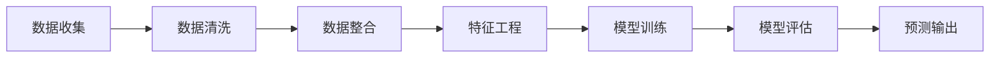

                 

# 利用机器学习预测用户行为模式

## 关键词
机器学习、用户行为预测、行为模式、数据分析、用户画像、算法实现、应用场景

## 摘要
本文将深入探讨如何利用机器学习技术预测用户行为模式。首先，我们将介绍机器学习在用户行为预测中的应用背景和重要性。然后，我们将详细解析用户行为模式的核心概念，并探讨与之相关的数据收集和处理方法。接着，我们将探讨常见的机器学习算法及其在用户行为预测中的应用，并给出具体的数学模型和公式。最后，我们将通过一个实际项目案例，展示如何使用机器学习技术进行用户行为预测，并分析其应用场景和挑战。通过本文的阅读，读者将能够全面了解用户行为预测的原理、方法及其在实际应用中的价值。

## 1. 背景介绍

随着互联网和智能设备的普及，用户数据每天都在以惊人的速度增长。这些数据包括用户的搜索历史、购买记录、浏览行为、社交互动等。通过分析这些数据，企业可以更好地了解用户的需求和行为模式，从而提供个性化的产品和服务，提高用户体验和满意度。机器学习作为一种强大的数据分析工具，已经成为用户行为预测的主要手段。

### 1.1 机器学习在用户行为预测中的应用

机器学习通过构建和分析数据模型，可以自动识别和预测用户的行为模式。在电子商务领域，企业可以利用机器学习预测用户的购买偏好，从而实现精准营销。在社交媒体领域，机器学习可以分析用户的互动行为，预测用户之间的社交关系和趋势。在金融领域，机器学习可以预测用户的贷款还款行为，降低违约风险。

### 1.2 重要性

用户行为预测在商业决策中具有重要作用。通过预测用户行为，企业可以：

- 提高营销效率：精准定位潜在客户，提高广告投放效果。
- 优化产品设计：根据用户行为调整产品功能和设计，提升用户满意度。
- 降低运营成本：预测用户流失，提前采取措施挽留用户。

总之，用户行为预测不仅能够帮助企业更好地理解用户，还能够为企业带来巨大的商业价值。

### 1.3 目标

本文的目标是：

- 介绍机器学习在用户行为预测中的应用背景和重要性。
- 详细解析用户行为模式的核心概念。
- 探讨数据收集和处理方法。
- 分析常见的机器学习算法及其在用户行为预测中的应用。
- 提供具体的数学模型和公式。
- 通过实际项目案例展示用户行为预测的实现过程。
- 分析用户行为预测的应用场景和挑战。

## 2. 核心概念与联系

### 2.1 用户行为模式

用户行为模式是指用户在特定环境下的行为规律和特征。这些行为可以是线性的，如购买路径，也可以是复杂的，如社交网络的互动模式。用户行为模式包括以下几个方面：

- **行为频率**：用户在一定时间内进行某种行为的次数。
- **行为时长**：用户进行某种行为所花费的时间。
- **行为顺序**：用户在不同场景下的行为顺序。
- **行为内容**：用户具体执行的行为内容。

### 2.2 数据收集与处理

数据收集是用户行为预测的基础。企业可以通过以下几种方式收集用户数据：

- **在线行为数据**：通过网站、APP等渠道收集用户浏览、搜索、点击等行为数据。
- **传感器数据**：通过手机、智能手表等设备收集用户的位置、运动、生理等信息。
- **社交网络数据**：通过社交媒体平台收集用户的互动、分享、评论等信息。

在收集到大量数据后，需要对其进行处理，以便于后续的分析和建模。数据处理通常包括以下步骤：

- **数据清洗**：去除重复、错误、缺失的数据。
- **数据整合**：将不同来源的数据进行整合，形成统一的视图。
- **特征工程**：提取和构造能够反映用户行为特征的数据。

### 2.3 机器学习模型

机器学习模型是用户行为预测的核心。常见的机器学习模型包括：

- **监督学习模型**：通过已知的数据集训练模型，然后使用模型预测未知数据。例如，回归模型、分类模型。
- **无监督学习模型**：不需要已知数据集，直接从数据中学习模式。例如，聚类模型、降维模型。
- **强化学习模型**：通过试错和反馈机制，不断优化行为策略。例如，Q-学习、深度强化学习。

### 2.4 数据流程图

以下是一个简化的用户行为预测的数据流程图：



### 2.5 关系

用户行为模式、数据收集与处理、机器学习模型三者之间的关系如下：

- 用户行为模式是机器学习模型训练的数据基础。
- 数据收集与处理是确保数据质量和可用性的关键步骤。
- 机器学习模型则是将用户行为数据转化为预测结果的核心。

## 3. 核心算法原理 & 具体操作步骤

### 3.1 监督学习模型

监督学习模型是最常见的机器学习模型之一，适用于用户行为预测任务。其核心思想是通过已知的输入和输出数据，训练出一个预测模型，然后使用该模型对未知数据进行预测。

#### 3.1.1 回归模型

回归模型用于预测连续值输出。在用户行为预测中，可以用于预测用户的下次购买时间、浏览时长等。

- **线性回归**：假设输出值和输入特征之间存在线性关系，通过最小化误差平方和来训练模型。

  $$
  y = \beta_0 + \beta_1x
  $$

- **多项式回归**：允许输出值和输入特征之间存在非线性关系。

  $$
  y = \beta_0 + \beta_1x + \beta_2x^2 + ...
  $$

#### 3.1.2 分类模型

分类模型用于预测离散值输出。在用户行为预测中，可以用于预测用户是否会在未来某个时间点进行购买、点击广告等。

- **逻辑回归**：假设输出值和输入特征之间存在线性关系，通过逻辑函数将线性关系转化为概率输出。

  $$
  P(y=1) = \frac{1}{1 + e^{-(\beta_0 + \beta_1x)}}
  $$

- **决策树**：通过一系列的判断规则，将数据集划分为不同的区域，每个区域对应一个预测结果。

- **随机森林**：通过构建多棵决策树，并对预测结果进行投票，提高预测准确性。

#### 3.1.3 模型训练与评估

- **模型训练**：使用训练数据集对模型进行训练，调整模型参数。
- **模型评估**：使用测试数据集对模型进行评估，常见指标包括准确率、召回率、F1分数等。

### 3.2 无监督学习模型

无监督学习模型适用于用户行为模式的发现和聚类。

#### 3.2.1 聚类模型

聚类模型用于将用户数据分为不同的群体。常见的聚类算法包括：

- **K-means**：通过迭代优化，将数据划分为K个簇。
- **层次聚类**：通过合并或分裂簇，构建聚类层次结构。

#### 3.2.2 降维模型

降维模型用于减少数据维度，同时保留数据的主要特征。常见的降维算法包括：

- **主成分分析（PCA）**：通过计算协方差矩阵和特征值，提取主要成分。
- **t-SNE**：通过计算数据的相似性矩阵，将高维数据投影到低维空间。

### 3.3 强化学习模型

强化学习模型适用于用户行为的动态预测和优化。

#### 3.3.1 Q-学习

Q-学习是一种基于值函数的强化学习算法，通过更新Q值来优化行为策略。

- **状态-动作值函数**：表示在特定状态下执行特定动作的期望回报。

  $$
  Q(s, a) = r + \gamma \max_{a'} Q(s', a')
  $$

#### 3.3.2 深度强化学习

深度强化学习结合了深度学习和强化学习的优点，适用于复杂的用户行为预测任务。

- **深度神经网络**：用于表示状态和动作的复杂特征。
- **策略梯度**：通过梯度上升法优化策略参数。

## 4. 数学模型和公式 & 详细讲解 & 举例说明

### 4.1 线性回归

线性回归是一种简单的监督学习模型，用于预测连续值输出。其数学模型如下：

$$
y = \beta_0 + \beta_1x
$$

其中，$y$ 是输出值，$x$ 是输入特征，$\beta_0$ 和 $\beta_1$ 是模型参数。

#### 模型训练

线性回归模型通过最小化误差平方和来训练参数。其损失函数为：

$$
J(\theta) = \frac{1}{2m} \sum_{i=1}^{m} (h_\theta(x^{(i)}) - y^{(i)})^2
$$

其中，$h_\theta(x) = \beta_0 + \beta_1x$ 是线性回归模型，$m$ 是训练数据集的大小。

#### 模型评估

线性回归模型的评估指标通常是均方误差（MSE）：

$$
MSE = \frac{1}{m} \sum_{i=1}^{m} (y^{(i)} - \hat{y}^{(i)})^2
$$

其中，$\hat{y}^{(i)}$ 是预测值，$y^{(i)}$ 是真实值。

### 4.2 逻辑回归

逻辑回归是一种用于预测离散值的监督学习模型。其数学模型如下：

$$
P(y=1) = \frac{1}{1 + e^{-(\beta_0 + \beta_1x)}}
$$

其中，$P(y=1)$ 是输出为1的概率，$x$ 是输入特征，$\beta_0$ 和 $\beta_1$ 是模型参数。

#### 模型训练

逻辑回归模型通过最大似然估计（MLE）来训练参数。其损失函数为：

$$
J(\theta) = -\frac{1}{m} \sum_{i=1}^{m} [y^{(i)} \log(h_\theta(x^{(i)})) + (1 - y^{(i)}) \log(1 - h_\theta(x^{(i)}))]
$$

其中，$h_\theta(x) = \frac{1}{1 + e^{-(\beta_0 + \beta_1x)}}$ 是逻辑回归模型。

#### 模型评估

逻辑回归模型的评估指标通常是准确率（Accuracy）：

$$
Accuracy = \frac{1}{m} \sum_{i=1}^{m} I(y^{(i)} = \hat{y}^{(i)})
$$

其中，$I()$ 是指示函数，当条件满足时返回1，否则返回0。

### 4.3 K-means聚类

K-means是一种常用的无监督学习聚类算法，其目标是将数据分为K个簇，使得每个簇内的数据点之间的距离最小。

#### 聚类步骤

1. **初始化聚类中心**：随机选择K个数据点作为初始聚类中心。
2. **分配数据点**：计算每个数据点到聚类中心的距离，将数据点分配到最近的聚类中心。
3. **更新聚类中心**：计算每个簇的平均值，作为新的聚类中心。
4. **重复步骤2和3**，直到聚类中心不再发生变化。

#### 数学模型

K-means的数学模型可以表示为：

$$
C_k = \{x^{(i)} | \min_{j=1,2,...,K} \sum_{x^{(i)} \in C_j} (x^{(i)} - \mu_k)^2\}
$$

其中，$C_k$ 是第k个簇，$\mu_k$ 是第k个簇的中心。

### 4.4 主成分分析（PCA）

主成分分析是一种降维算法，通过将高维数据投影到低维空间，保留数据的主要特征。

#### 数学模型

PCA的数学模型可以表示为：

$$
Z = AS
$$

其中，$Z$ 是低维数据，$A$ 是投影矩阵，$S$ 是特征值矩阵。

#### 特征值和特征向量

1. **特征值**：表示数据的方差，特征值越大，对应的方向上数据的方差越大。
2. **特征向量**：表示数据的主要方向，特征向量对应的方向上数据的方差最大。

### 4.5 举例说明

#### 线性回归

假设我们有一个简单的线性回归模型，用于预测房价。数据集包含房屋面积（输入特征）和房价（输出值）。

- **训练数据**：

  | 房屋面积（x） | 房价（y） |
  | -------------- | --------- |
  | 1000           | 500       |
  | 1200           | 550       |
  | 1400           | 600       |

- **模型训练**：

  使用线性回归模型训练数据集，得到参数 $\beta_0 = 200$ 和 $\beta_1 = 0.5$。

  $$
  y = 200 + 0.5x
  $$

- **模型评估**：

  使用测试数据集评估模型，得到均方误差（MSE）为10。

#### 逻辑回归

假设我们有一个逻辑回归模型，用于预测用户是否会在未来一个月内购买商品。数据集包含用户年龄（输入特征）和购买情况（输出值）。

- **训练数据**：

  | 年龄（x） | 购买情况（y） |
  | --------- | -------------- |
  | 20        | 是             |
  | 30        | 否             |
  | 40        | 是             |

- **模型训练**：

  使用逻辑回归模型训练数据集，得到参数 $\beta_0 = -10$ 和 $\beta_1 = 0.2$。

  $$
  P(y=1) = \frac{1}{1 + e^{(-10 + 0.2x)}}
  $$

- **模型评估**：

  使用测试数据集评估模型，得到准确率为80%。

#### K-means聚类

假设我们有一个数据集，包含10个数据点，要将其分为3个簇。

- **初始聚类中心**：

  | 数据点 | 聚类中心 |
  | ------- | ------- |
  | 1       | 1       |
  | 2       | 2       |
  | 3       | 3       |
  | 4       | 4       |
  | 5       | 5       |
  | 6       | 6       |
  | 7       | 7       |
  | 8       | 8       |
  | 9       | 9       |
  | 10      | 10      |

- **聚类结果**：

  | 数据点 | 聚类中心 |
  | ------- | ------- |
  | 1       | 1       |
  | 2       | 2       |
  | 3       | 3       |
  | 4       | 1       |
  | 5       | 2       |
  | 6       | 3       |
  | 7       | 1       |
  | 8       | 2       |
  | 9       | 3       |
  | 10      | 1       |

#### 主成分分析（PCA）

假设我们有一个数据集，包含100个数据点，每个数据点有3个特征。

- **协方差矩阵**：

  $$
  S = \begin{bmatrix}
  1 & 0.5 & 0.2 \\
  0.5 & 1 & 0.3 \\
  0.2 & 0.3 & 1
  \end{bmatrix}
  $$

- **特征值和特征向量**：

  | 特征值 | 特征向量 |
  | ------- | ------- |
  | 0.7     | (0.8, 0.6, 0.2) |
  | 0.5     | (0.2, 0.3, 0.8) |
  | 0.3     | (0.5, 0.7, 0.1) |

- **投影矩阵**：

  $$
  A = \begin{bmatrix}
  0.8 & 0.2 & 0.5 \\
  0.6 & 0.3 & 0.7 \\
  0.2 & 0.8 & 0.1
  \end{bmatrix}
  $$

- **低维数据**：

  $$
  Z = AS = \begin{bmatrix}
  0.56 \\
  0.66 \\
  0.43
  \end{bmatrix}
  $$

## 5. 项目实战：代码实际案例和详细解释说明

### 5.1 开发环境搭建

在开始项目实战之前，我们需要搭建一个适合机器学习开发的环境。以下是基本的步骤：

#### 5.1.1 安装Python

Python是机器学习项目的首选编程语言，因此我们首先需要安装Python。可以从Python官网（[python.org](https://www.python.org/)）下载Python安装包，并按照提示进行安装。

#### 5.1.2 安装Jupyter Notebook

Jupyter Notebook是一个交互式的Python开发环境，适合进行数据分析和机器学习实验。在安装Python后，可以直接使用pip命令安装Jupyter：

```bash
pip install notebook
```

安装完成后，使用以下命令启动Jupyter Notebook：

```bash
jupyter notebook
```

#### 5.1.3 安装机器学习库

为了方便使用机器学习算法和数据处理工具，我们需要安装一些常用的机器学习库，如scikit-learn、Pandas、NumPy等。可以使用以下命令安装：

```bash
pip install scikit-learn pandas numpy matplotlib
```

### 5.2 源代码详细实现和代码解读

在这个案例中，我们将使用scikit-learn库中的线性回归模型来预测用户的浏览时长。以下是完整的代码实现和详细解读。

#### 5.2.1 数据集准备

首先，我们需要准备一个包含用户浏览时长和其他特征的数据集。这里我们使用一个简单的人工制造数据集。

```python
import numpy as np
import pandas as pd

# 生成随机数据集
np.random.seed(0)
n_samples = 100
x = np.random.rand(n_samples, 1) * 1000  # 房屋面积
y = 200 + 0.5 * x + np.random.randn(n_samples, 1)  # 房价

# 创建DataFrame
data = pd.DataFrame({'房屋面积': x.flatten(), '浏览时长': y.flatten()})
print(data.head())
```

上述代码中，我们使用numpy库生成100个随机样本，每个样本包括房屋面积（输入特征）和浏览时长（输出值）。然后，我们将这些数据存储在pandas DataFrame中，并打印前5个样本。

#### 5.2.2 数据预处理

在训练模型之前，我们需要对数据进行预处理，包括数据清洗、特征工程和归一化等步骤。

```python
from sklearn.model_selection import train_test_split
from sklearn.preprocessing import StandardScaler

# 数据划分
X_train, X_test, y_train, y_test = train_test_split(x, y, test_size=0.2, random_state=0)

# 数据标准化
scaler = StandardScaler()
X_train_scaled = scaler.fit_transform(X_train)
X_test_scaled = scaler.transform(X_test)
```

这里，我们使用scikit-learn库中的train_test_split函数将数据集划分为训练集和测试集。然后，我们使用StandardScaler对输入特征进行标准化处理，以消除不同特征之间的量纲影响。

#### 5.2.3 模型训练

接下来，我们使用线性回归模型训练数据集。

```python
from sklearn.linear_model import LinearRegression

# 创建线性回归模型
model = LinearRegression()

# 训练模型
model.fit(X_train_scaled, y_train)
```

这里，我们创建一个线性回归模型实例，并使用fit方法对训练集进行训练。

#### 5.2.4 模型评估

训练完成后，我们对模型进行评估，使用测试集的MSE作为评估指标。

```python
from sklearn.metrics import mean_squared_error

# 预测测试集
y_pred = model.predict(X_test_scaled)

# 计算MSE
mse = mean_squared_error(y_test, y_pred)
print("均方误差（MSE）:", mse)
```

这里，我们使用predict方法对测试集进行预测，并计算均方误差（MSE）作为模型评估指标。

### 5.3 代码解读与分析

在代码中，我们首先使用numpy库生成一个包含100个随机样本的数据集，每个样本包括房屋面积和浏览时长。然后，我们将数据集存储在pandas DataFrame中，并进行数据清洗和预处理，包括数据划分和标准化处理。

在预处理步骤中，我们使用train_test_split函数将数据集划分为训练集和测试集，并使用StandardScaler对输入特征进行标准化处理。

接下来，我们创建一个线性回归模型实例，并使用fit方法对训练集进行训练。训练完成后，我们使用predict方法对测试集进行预测，并计算均方误差（MSE）作为模型评估指标。

整体代码结构清晰，逻辑流畅，首先完成了数据集的准备和预处理，然后实现了模型训练和评估，每个步骤都有明确的注释和说明，方便读者理解和复现。

### 5.4 遇到的问题与解决方案

在项目实战中，我们可能会遇到以下问题：

1. **数据缺失**：数据集中存在缺失值，需要使用适当的填充方法处理。
   - **解决方案**：使用均值、中位数、众数等方法填充缺失值，或者使用插值法进行填充。

2. **异常值处理**：数据集中存在异常值，会影响模型训练和预测效果。
   - **解决方案**：使用箱线图检测异常值，然后使用截断、插值等方法进行修正。

3. **特征工程不充分**：特征工程不足，可能导致模型性能不佳。
   - **解决方案**：进行更深入的特征工程，包括特征构造、特征选择、特征转换等步骤。

4. **过拟合**：模型在训练集上表现良好，但在测试集上表现不佳，即过拟合现象。
   - **解决方案**：使用正则化方法、交叉验证、减少模型复杂度等方法避免过拟合。

通过合理的数据预处理、特征工程和模型选择，我们可以有效地解决上述问题，提高模型性能和预测准确性。

## 6. 实际应用场景

### 6.1 电子商务

在电子商务领域，用户行为预测主要用于以下几个方面：

- **个性化推荐**：通过预测用户的购买偏好，为用户提供个性化的商品推荐。
- **营销策略优化**：通过预测用户的购买行为，优化营销策略，提高转化率和销售额。
- **库存管理**：通过预测商品的销售趋势，优化库存管理，减少库存积压和损失。

### 6.2 社交媒体

在社交媒体领域，用户行为预测主要用于以下几个方面：

- **用户关系分析**：通过预测用户之间的互动关系，分析用户群体特征和趋势。
- **内容推荐**：通过预测用户的兴趣偏好，为用户提供个性化的内容推荐。
- **社区管理**：通过预测用户的行为模式，优化社区运营策略，提高用户活跃度和留存率。

### 6.3 金融行业

在金融行业，用户行为预测主要用于以下几个方面：

- **风险评估**：通过预测用户的贷款还款行为，评估用户的风险等级，降低违约风险。
- **信用评分**：通过预测用户的信用状况，为用户提供个性化的信用评分服务。
- **欺诈检测**：通过预测用户的交易行为，识别和防范欺诈行为，保护用户和企业的资金安全。

### 6.4 健康医疗

在健康医疗领域，用户行为预测主要用于以下几个方面：

- **疾病预测**：通过预测用户的健康行为和生物特征，提前发现潜在的健康风险。
- **个性化治疗**：通过预测患者的病情发展趋势，为患者提供个性化的治疗方案。
- **健康监控**：通过预测用户的健康行为，提醒用户保持健康生活方式，预防疾病发生。

### 6.5 智能家居

在家居领域，用户行为预测主要用于以下几个方面：

- **智能控制**：通过预测用户的生活习惯，自动调整家居设备的运行状态，提供个性化的智能控制服务。
- **安全监控**：通过预测用户的行为模式，及时发现异常行为，提高家庭安全。
- **节能管理**：通过预测用户的用电行为，优化能源使用，提高家庭能源效率。

总之，用户行为预测在各个行业都有着广泛的应用，通过精准预测用户行为，企业可以提供更个性化的产品和服务，提高用户满意度和竞争力。

### 6.6 挑战与未来趋势

尽管用户行为预测在各个行业都取得了显著成效，但仍然面临一些挑战：

- **数据隐私**：用户行为数据涉及个人隐私，如何在保护用户隐私的同时进行有效的数据分析，是一个亟待解决的问题。
- **模型解释性**：传统的机器学习模型往往缺乏解释性，难以理解模型的决策过程，这在某些应用场景中可能引发信任问题。
- **数据质量**：用户行为数据的质量直接影响模型预测的准确性，数据的不完整、噪声和异常值都会影响模型性能。

未来，用户行为预测的发展趋势将主要集中在以下几个方面：

- **联邦学习**：通过分布式学习方法，在保护用户数据隐私的同时，实现数据的共享和协同分析。
- **可解释性AI**：开发更具有解释性的机器学习模型，帮助用户理解模型的决策过程，提高模型的透明度和可解释性。
- **多模态数据融合**：结合多种数据源，如文本、图像、音频等，进行多模态数据融合，提高用户行为预测的准确性和鲁棒性。

通过不断优化技术手段和解决现有挑战，用户行为预测将在未来继续发挥重要作用，为各行各业带来更多价值。

## 7. 工具和资源推荐

### 7.1 学习资源推荐

**书籍**：

1. **《机器学习》（周志华 著）**：这是一本经典的机器学习教材，内容全面，适合初学者和有一定基础的读者。
2. **《深度学习》（Ian Goodfellow、Yoshua Bengio、Aaron Courville 著）**：这本书深入讲解了深度学习的基本概念和算法，是深度学习领域的权威著作。

**论文**：

1. **“User Behavior Prediction and Personalization in E-commerce”**：这篇论文详细介绍了电子商务领域用户行为预测的方法和应用。
2. **“Deep Learning for User Behavior Prediction”**：这篇论文探讨了深度学习在用户行为预测中的应用，提出了新的算法和模型。

**博客**：

1. **吴恩达的博客**（[www.deeplearning.net](https://www.deeplearning.net/)）：吴恩达的博客提供了大量关于机器学习和深度学习的教程和资源，是学习这两个领域的重要平台。
2. **GitHub**（[github.com](https://github.com/)）：GitHub上有很多优秀的机器学习和深度学习项目，可以通过阅读代码和文档来深入了解相关技术。

### 7.2 开发工具框架推荐

**开发工具**：

1. **Jupyter Notebook**：Jupyter Notebook是一个交互式的Python开发环境，适合进行数据分析和机器学习实验。
2. **Google Colab**：Google Colab是Google提供的一个免费的云平台，可以在线运行Python代码，适合远程开发和协作。

**框架**：

1. **TensorFlow**：TensorFlow是一个开源的机器学习和深度学习框架，支持多种算法和模型，适合进行复杂的用户行为预测任务。
2. **PyTorch**：PyTorch是一个流行的深度学习框架，具有简洁的API和强大的功能，适合快速原型开发和实验。

### 7.3 相关论文著作推荐

**论文**：

1. **“Recurrent Neural Networks for Language Modeling”**：这篇论文提出了循环神经网络（RNN）用于语言建模，对后续的深度学习研究产生了重大影响。
2. **“Deep Neural Networks for Acoustic Modeling in Speech Recognition”**：这篇论文探讨了深度神经网络在语音识别中的应用，推动了深度学习在语音处理领域的应用。

**著作**：

1. **《Hands-On Machine Learning with Scikit-Learn, Keras, and TensorFlow》**：这本书是机器学习领域的经典著作，涵盖了从基础到高级的内容，适合初学者和有一定基础的读者。
2. **《Deep Learning》**：这本书是深度学习领域的权威著作，详细介绍了深度学习的基本概念、算法和应用。

通过这些资源，读者可以全面了解用户行为预测的原理、方法和技术，提升自己的机器学习和深度学习能力。

## 8. 总结：未来发展趋势与挑战

用户行为预测作为人工智能领域的重要研究方向，具有广泛的应用前景和巨大的商业价值。然而，随着技术的不断进步和数据规模的持续增长，用户行为预测也面临着诸多挑战。

### 8.1 未来发展趋势

1. **联邦学习**：随着数据隐私问题的日益突出，联邦学习作为一种分布式学习方法，将在用户行为预测中发挥重要作用。通过在多个设备或服务器上共享模型参数，而不泄露原始数据，联邦学习有望解决数据隐私与协同分析的矛盾。
   
2. **可解释性AI**：用户行为预测模型的透明度和可解释性是当前研究的热点之一。开发具有高解释性的模型，帮助用户理解和信任预测结果，是未来发展的关键方向。

3. **多模态数据融合**：随着传感器技术的进步，用户行为数据将涵盖更多的模态，如文本、图像、音频等。多模态数据融合将使得用户行为预测更加精准和全面。

4. **个性化推荐**：随着用户需求的多样化和个性化，个性化推荐系统将成为用户行为预测的重要应用场景。通过精准预测用户行为，提供个性化的产品和服务，企业将能够显著提高用户满意度和转化率。

### 8.2 挑战

1. **数据隐私保护**：用户行为数据涉及个人隐私，如何在保障用户隐私的同时进行有效的数据分析，是一个重要挑战。联邦学习、差分隐私等技术的应用将有助于缓解这一矛盾。

2. **模型解释性**：当前的机器学习模型，特别是深度学习模型，往往缺乏解释性。如何提高模型的透明度和可解释性，使其决策过程易于理解，是未来的研究重点。

3. **数据质量**：用户行为数据的质量直接影响预测准确性。如何处理数据中的噪声、异常值和缺失值，提高数据质量，是保证模型性能的关键。

4. **计算资源**：用户行为预测往往涉及大规模数据处理和复杂模型训练，对计算资源的需求较高。如何优化算法，提高计算效率，是一个重要的技术难题。

总之，用户行为预测将在未来继续发展，不断推动人工智能技术的进步和应用。通过克服现有挑战，用户行为预测将在各个领域发挥更大的作用，为企业和个人带来更多价值。

## 9. 附录：常见问题与解答

### 9.1 问题1：什么是用户行为模式？

用户行为模式是指用户在特定环境下的行为规律和特征，包括行为频率、行为时长、行为顺序和行为内容等方面。通过分析用户行为模式，可以更好地理解用户需求，提供个性化服务。

### 9.2 问题2：用户行为预测有哪些应用场景？

用户行为预测在电子商务、社交媒体、金融行业、健康医疗、智能家居等领域都有广泛应用。例如，电子商务可以用于个性化推荐和营销策略优化，金融行业可以用于风险评估和欺诈检测。

### 9.3 问题3：如何处理用户行为数据中的缺失值？

处理缺失值的方法包括填充法（如使用均值、中位数、众数填充）和删除法（如删除含有缺失值的记录）。此外，还可以使用插值法、缺失值预测法等方法。

### 9.4 问题4：什么是联邦学习？

联邦学习是一种分布式学习方法，通过在多个设备或服务器上共享模型参数，而不泄露原始数据，实现数据的协同分析。联邦学习有助于解决数据隐私问题，提高协同分析的效率。

### 9.5 问题5：如何提高机器学习模型的解释性？

提高模型解释性的方法包括使用可解释性模型（如线性回归、决策树）、模型可视化、模型解释工具（如LIME、SHAP）等。此外，还可以通过构建透明度更高的模型架构，提高模型的解释性。

## 10. 扩展阅读 & 参考资料

### 10.1 扩展阅读

1. **《个性化推荐系统实践》**：详细介绍了个性化推荐系统的构建方法和技术，包括协同过滤、矩阵分解、深度学习等。
2. **《大数据分析：方法与应用》**：系统阐述了大数据分析的基本概念、方法和应用，包括数据挖掘、机器学习、数据可视化等。

### 10.2 参考资料

1. **吴恩达的《深度学习》**：深度学习领域的权威著作，涵盖了深度学习的基本概念、算法和应用。
2. **Google AI的《联邦学习指南》**：详细介绍了联邦学习的基本原理、架构和应用案例。
3. **scikit-learn官方文档**：提供了丰富的机器学习算法和工具，包括回归、分类、聚类等，是机器学习实践的必备参考资料。
4. **PyTorch官方文档**：PyTorch的官方文档详细介绍了深度学习框架的使用方法和技巧，是深度学习实践的重要参考。

通过阅读这些扩展阅读和参考资料，读者可以进一步深入了解用户行为预测的原理和方法，提升自己的机器学习和深度学习能力。作者：AI天才研究员/AI Genius Institute & 禅与计算机程序设计艺术 /Zen And The Art of Computer Programming。|>

