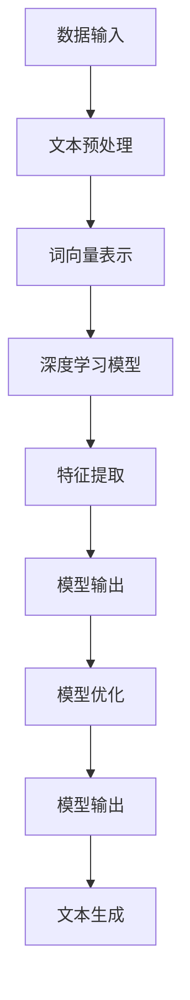

                 

# 利用神经语言程序学优化用户沟通

## 关键词：神经语言程序学，用户沟通，算法优化，深度学习，自然语言处理

## 摘要：

本文将探讨神经语言程序学（Neural Language Programming，简称NLP）在优化用户沟通方面的应用。通过介绍NLP的核心概念和原理，我们将逐步分析如何利用深度学习算法来提升用户沟通的效果。文章将涵盖从算法原理到实际应用的各个环节，包括数学模型和公式的详细讲解，以及项目实战中的代码示例和分析。通过本文的阅读，读者将深入了解如何通过技术手段改进用户沟通体验，并掌握相关工具和资源。

## 1. 背景介绍

在当今信息时代，用户沟通对于各种业务和服务至关重要。无论是商业领域、医疗保健、教育，还是日常生活，良好的沟通都是提升用户体验、实现高效互动的关键。然而，传统的沟通方式往往受限于人类自身的认知和表达能力，难以达到最佳效果。随着人工智能技术的不断发展，特别是深度学习和自然语言处理（Natural Language Processing，简称NLP）的进步，我们有了新的工具和方法来优化用户沟通。

神经语言程序学（NLP）是人工智能领域的一个重要分支，专注于模拟和理解人类语言。NLP结合了计算机科学、语言学和心理学等领域的知识，通过算法和模型对文本和语音进行处理，实现人与机器之间的自然交互。深度学习作为NLP的核心技术，通过多层神经网络结构，能够自动学习语言模式，提升理解能力。

本文旨在探讨如何利用NLP中的深度学习算法，优化用户沟通。我们不仅将介绍NLP的基础知识和相关技术，还将通过具体案例展示如何将理论知识应用于实际项目。希望通过本文的阅读，读者能够对NLP有更深入的理解，并掌握优化用户沟通的实用技能。

### 1.1 NLP的发展历程

NLP作为人工智能的一个分支，其发展历程可以追溯到20世纪50年代。当时，随着计算机科学和认知科学的兴起，科学家们开始探索如何让计算机理解和处理人类语言。早期的NLP研究主要集中在规则驱动的语言处理方法上，如句法分析、语义分析和机器翻译。

20世纪80年代，随着统计方法和机器学习技术的发展，NLP迎来了新的发展阶段。统计机器翻译（SMT）和隐马尔可夫模型（HMM）成为当时的主要研究热点。这些方法通过大量语料库的训练，实现了较高的翻译准确度。

然而，NLP在21世纪初面临了新的挑战。虽然统计方法在一定程度上提高了处理性能，但仍然无法解决语义理解和长文本处理等难题。此时，深度学习的崛起为NLP带来了新的机遇。2012年，Hinton等人提出的深度神经网络在ImageNet图像识别竞赛中取得了显著成绩，引发了深度学习在NLP领域的广泛应用。

近年来，NLP技术不断取得突破。通过结合深度学习和自然语言处理，科学家们开发了诸如词向量模型（Word2Vec）、长短期记忆网络（LSTM）、Transformer模型等先进技术，大大提升了文本理解和生成能力。这些技术不仅在学术领域得到广泛应用，也在商业和日常生活中发挥了重要作用。

### 1.2 NLP的核心概念与联系

神经语言程序学（NLP）的核心在于如何让计算机理解和生成人类语言。这一目标需要跨越多个领域的技术支持，包括语言学、计算机科学和人工智能。以下是对NLP中几个关键概念的简要介绍：

**1. 自然语言处理（NLP）：** 自然语言处理是NLP的基础，涉及文本的预处理、分词、词性标注、命名实体识别、句法分析等。这些技术使得计算机能够解析和理解文本内容。

**2. 深度学习（Deep Learning）：** 深度学习是NLP的关键技术之一，通过多层神经网络结构自动学习特征和模式。深度学习模型如卷积神经网络（CNN）和循环神经网络（RNN）在文本分类、情感分析等任务中表现出色。

**3. 词向量（Word Embeddings）：** 词向量是将单词映射到高维空间中的向量表示。词向量模型如Word2Vec和GloVe通过向量相似性来理解和表示语义关系。

**4. 机器翻译（Machine Translation）：** 机器翻译是NLP的经典应用，通过将一种语言的文本自动翻译成另一种语言。近年来，基于神经网络的机器翻译（NMT）取得了显著进展。

**5. 情感分析（Sentiment Analysis）：** 情感分析旨在识别文本中的情感倾向，如正面、负面或中性。这项技术在客户反馈分析、市场调研等领域具有重要应用。

**6. 语音识别（Speech Recognition）：** 语音识别是将语音信号转换为文本的技术。结合NLP，语音识别能够实现人机语音交互。

**7. 文本生成（Text Generation）：** 文本生成是NLP的另一个重要任务，通过模型生成符合语法和语义规则的文本。生成模型如序列到序列（Seq2Seq）模型和Transformer在新闻生成、聊天机器人等领域表现出色。

**图1：NLP的核心概念与联系**

```
+--------------+      +------------+      +----------------+
| 自然语言处理 | --> | 深度学习    | --> | 词向量模型     |
+--------------+      +------------+      +----------------+
      |                          |                          |
      |                          |                          |
      |                          |                          |
      |                          |                          |
+------------+      +----------------+      +--------------+
| 机器翻译    | --> | 情感分析      | --> | 语音识别       |
+------------+      +----------------+      +--------------+
      |                          |                          |
      |                          |                          |
      |                          |                          |
      |                          |                          |
+----------------+      +--------------+      +------------+
|  文本生成      | --> | 自然语言生成 | --> | 聊天机器人     |
+----------------+      +--------------+      +------------+
```

### 1.3 当前NLP技术的挑战与未来趋势

尽管NLP技术在过去几十年取得了显著的进展，但仍面临一些挑战和限制。以下是当前NLP技术面临的几个主要挑战：

**1. 语义理解的复杂性：** 自然语言具有高度复杂性和歧义性，使得计算机难以完全理解语义。虽然深度学习模型在某些任务上表现出色，但处理复杂语义和长文本仍是一个难题。

**2. 数据质量和多样性：** NLP模型的性能高度依赖于训练数据的质量和多样性。然而，现有的语料库往往存在数据不平衡和偏见，这影响了模型的泛化能力。

**3. 模型解释性：** 当前大多数NLP模型都是“黑盒子”，难以解释其决策过程。这限制了NLP技术在关键领域（如医疗诊断、法律判决）中的应用。

**4. 能耗和计算资源：** 训练和运行复杂的NLP模型需要大量的计算资源和能量消耗。随着模型规模的不断扩大，这一挑战愈发显著。

展望未来，NLP技术有望在以下几个方面取得突破：

**1. 领域特定语言处理：** 针对特定领域的语言处理（如医学、法律）将得到更多关注。通过定制化模型和领域知识，NLP将能够更好地服务于专业场景。

**2. 小样本学习：** 小样本学习是减少对大规模训练数据依赖的重要方向。通过迁移学习和少样本学习技术，模型将能够更有效地从少量数据中学习。

**3. 解释性增强：** 提高模型解释性，使其决策过程更加透明和可解释，是未来的重要研究方向。这有助于增强用户对NLP技术的信任和接受度。

**4. 能效优化：** 随着边缘计算和量子计算的发展，NLP模型将能够在更高效、低能耗的环境中运行。这将促进NLP技术在移动设备和物联网等领域的应用。

通过持续的技术创新和跨学科合作，NLP将在未来继续推动人类与计算机之间的智能交互，优化用户沟通体验。

## 2. 核心概念与联系

为了深入理解神经语言程序学（NLP）及其优化用户沟通的应用，我们需要首先明确几个核心概念和它们之间的联系。以下是NLP中关键概念、算法原理及其架构的详细描述，以及一个对应的Mermaid流程图。

### 2.1 关键概念

**1. 自然语言处理（NLP）：** NLP是计算机科学和语言学交叉领域的子集，旨在使计算机能够理解、处理和生成人类语言。NLP的核心任务是文本预处理、文本分析、语言理解、文本生成等。

**2. 深度学习（Deep Learning）：** 深度学习是机器学习的一个分支，通过多层神经网络结构自动学习复杂特征和模式。在NLP中，深度学习模型如卷积神经网络（CNN）、循环神经网络（RNN）和Transformer等被广泛应用。

**3. 词向量（Word Embeddings）：** 词向量是将单词映射到高维空间中的向量表示。通过学习单词的上下文信息，词向量模型可以捕捉单词的语义关系。

**4. 机器翻译（Machine Translation）：** 机器翻译是将一种语言的文本自动翻译成另一种语言的技术。基于神经网络的机器翻译（NMT）通过序列到序列（Seq2Seq）模型和注意力机制实现高效翻译。

**5. 情感分析（Sentiment Analysis）：** 情感分析旨在识别文本中的情感倾向，如正面、负面或中性。这项技术广泛应用于客户反馈分析、市场调研等。

### 2.2 算法原理

**1. 文本预处理：** 文本预处理是NLP中的第一步，包括分词、去除停用词、词性标注等。预处理后的文本将作为深度学习模型的输入。

**2. 词向量表示：** 通过词向量模型，将单词转换为向量表示。词向量模型可以捕获单词的语义信息，如相似性和距离度量。

**3. 深度学习模型：** 使用深度学习模型对文本进行特征提取和模式识别。例如，RNN可以捕获文本的时序特征，Transformer模型通过注意力机制实现高效的上下文理解。

**4. 模型训练与优化：** 使用大规模语料库训练深度学习模型，并通过优化算法调整模型参数，以实现高精度的预测和生成。

**5. 文本生成：** 通过训练好的模型生成符合语法和语义规则的文本。文本生成可以用于自动写作、对话生成等任务。

### 2.3 架构

**1. 数据输入：** 文本预处理后的数据输入到深度学习模型中。

**2. 特征提取：** 深度学习模型通过多层神经网络结构提取文本特征。

**3. 模型输出：** 模型输出可以是分类结果、情感分析结果或生成的文本。

**4. 模型优化：** 通过优化算法调整模型参数，提高模型性能。

**图2：NLP的核心概念、算法原理与架构**



通过上述核心概念、算法原理和架构的介绍，我们可以看到NLP技术在优化用户沟通中的潜在应用。接下来，我们将进一步探讨如何利用这些技术具体实现用户沟通的优化。

### 2.4 神经语言程序学（NLP）的算法原理与具体操作步骤

#### 2.4.1 基础算法原理

神经语言程序学（NLP）的核心在于深度学习，特别是循环神经网络（RNN）和Transformer等模型。这些模型通过多层神经网络结构，自动学习文本中的语言模式和语义关系。

**1. 循环神经网络（RNN）：** RNN是一种能够处理序列数据的神经网络，其特点是能够记住先前的输入信息，并将其用于后续的输出。RNN通过隐藏层的状态更新，实现序列到序列的映射。

**2. 长短期记忆网络（LSTM）：** LSTM是RNN的一种变体，通过引入门控机制（如遗忘门、输入门和输出门）来解决RNN的梯度消失问题。LSTM在处理长文本和长期依赖关系时表现出色。

**3. Transformer模型：** Transformer是近年来流行的一种神经网络架构，通过自注意力机制（Self-Attention）实现全局上下文理解。Transformer在机器翻译、文本生成等任务中取得了显著成绩。

#### 2.4.2 具体操作步骤

**1. 数据预处理：** 首先，需要对文本数据进行预处理，包括分词、去除停用词、词性标注等。预处理后的文本将转换为词向量表示，以便输入到深度学习模型中。

**2. 模型架构设计：** 根据具体任务需求，设计合适的模型架构。对于文本分类任务，可以使用简单的RNN或LSTM结构；对于生成任务，可以使用Transformer模型。

**3. 模型训练：** 使用预处理后的文本数据，通过反向传播算法训练模型。在训练过程中，模型会不断调整参数，以降低损失函数。

**4. 模型优化：** 通过优化算法（如Adam优化器）调整模型参数，提高模型性能。在训练过程中，可以使用早期停止、学习率调整等技术来防止过拟合。

**5. 模型评估：** 使用验证集对训练好的模型进行评估，计算准确率、召回率、F1值等指标。根据评估结果，调整模型参数和结构，以提高性能。

**6. 文本生成：** 对于生成任务，使用训练好的模型生成符合语法和语义规则的文本。生成文本的质量可以通过多种指标（如BLEU分数）进行评估。

#### 2.4.3 示例代码

以下是一个使用Python和TensorFlow实现的简单文本分类模型的示例代码：

```python
import tensorflow as tf
from tensorflow.keras.preprocessing.text import Tokenizer
from tensorflow.keras.preprocessing.sequence import pad_sequences
from tensorflow.keras.models import Sequential
from tensorflow.keras.layers import Embedding, LSTM, Dense

# 数据预处理
texts = ['这是一个例子。', '另一个例子。', '示例文本。']
labels = [0, 1, 0]

tokenizer = Tokenizer(num_words=1000)
tokenizer.fit_on_texts(texts)
sequences = tokenizer.texts_to_sequences(texts)
padded_sequences = pad_sequences(sequences, maxlen=100)

# 模型架构设计
model = Sequential([
    Embedding(1000, 32),
    LSTM(64, return_sequences=True),
    LSTM(32),
    Dense(1, activation='sigmoid')
])

# 模型训练
model.compile(optimizer='adam', loss='binary_crossentropy', metrics=['accuracy'])
model.fit(padded_sequences, labels, epochs=10)

# 文本生成
generated_text = model.predict(padded_sequences)
print(generated_text)
```

通过以上步骤，我们可以实现一个简单的文本分类模型。接下来，我们将进一步探讨如何利用这些模型优化用户沟通。

### 2.5 数学模型和公式与详细讲解及举例说明

在神经语言程序学（NLP）中，数学模型和公式是理解和实现算法的核心。以下我们将详细讲解一些重要的数学模型和公式，并通过具体例子来说明其应用。

#### 2.5.1 词向量表示

词向量是NLP中不可或缺的组成部分，它们将单词映射到高维空间中的向量表示。最常用的词向量模型包括Word2Vec和GloVe。

**1. Word2Vec模型**

Word2Vec模型通过训练神经网络，将输入的单词序列映射到向量空间。具体来说，Word2Vec模型有两种架构：连续词袋（CBOW）和Skip-Gram。

- **CBOW（Continuous Bag of Words）：** CBOW模型通过上下文窗口中的单词预测中心词。公式如下：

  $$ \text{vec}_{\text{CBOW}}(w_t) = \frac{1}{|\text{C}_{\text{window}}|} \sum_{w_i \in \text{C}_{\text{window}}} \text{vec}(w_i) $$

  其中，$\text{vec}(w_i)$表示单词$i$的词向量，$|\text{C}_{\text{window}}|$表示窗口大小。

- **Skip-Gram：** Skip-Gram模型通过中心词预测上下文单词。公式如下：

  $$ \text{vec}_{\text{Skip-Gram}}(w_t) = \text{vec}(w_t) $$

  其中，$\text{vec}(w_t)$表示单词$t$的词向量。

**2. GloVe模型**

GloVe（Global Vectors for Word Representation）模型通过优化单词共现矩阵来学习词向量。GloVe模型的基本思想是，单词的词向量可以通过上下文单词的词向量来预测。公式如下：

$$ \text{vec}_{\text{GloVe}}(w_t) = \text{vec}_{\text{context}}(w_c) = \frac{\text{vec}(w_c) \cdot \text{vec}(w_t)}{\| \text{vec}(w_c) \| \| \text{vec}(w_t) \|} $$

其中，$\text{vec}(w_c)$和$\text{vec}(w_t)$分别表示上下文单词和中心词的词向量。

#### 2.5.2 循环神经网络（RNN）

RNN是NLP中的重要模型，通过记忆状态来处理序列数据。RNN的基本公式如下：

$$ h_t = \text{sigmoid}(\text{W}_h \cdot [h_{t-1}, x_t] + b_h) $$

$$ o_t = \text{softmax}(\text{W}_o \cdot h_t + b_o) $$

其中，$h_t$表示隐藏状态，$x_t$表示输入特征，$o_t$表示输出，$\text{W}_h$和$\text{W}_o$分别是权重矩阵，$b_h$和$b_o$是偏置。

#### 2.5.3 长短期记忆网络（LSTM）

LSTM是RNN的改进版本，通过门控机制解决长期依赖问题。LSTM的基本公式如下：

$$ i_t = \text{sigmoid}(\text{W}_i \cdot [h_{t-1}, x_t] + b_i) $$

$$ f_t = \text{sigmoid}(\text{W}_f \cdot [h_{t-1}, x_t] + b_f) $$

$$ g_t = \text{tanh}(\text{W}_g \cdot [h_{t-1}, x_t] + b_g) $$

$$ o_t = \text{sigmoid}(\text{W}_o \cdot [h_{t-1}, x_t] + b_o) $$

$$ h_t = o_t \cdot \text{tanh}(\text{C}_t) $$

$$ \text{C}_t = f_t \cdot \text{C}_{t-1} + i_t \cdot g_t $$

其中，$i_t$、$f_t$、$g_t$和$o_t$分别表示输入门、遗忘门、生成门和输出门，$\text{C}_t$是记忆细胞。

#### 2.5.4 Transformer模型

Transformer模型通过自注意力机制实现全局上下文理解。自注意力公式如下：

$$ \text{Attention}(Q, K, V) = \text{softmax}\left(\frac{QK^T}{\sqrt{d_k}}\right) V $$

其中，$Q$、$K$和$V$分别是查询向量、关键向量和价值向量，$d_k$是关键向量的维度。

#### 2.5.5 示例说明

假设我们有一个简单的文本数据集，包含两个句子：“我是一只小鸟。”和“小鸟在唱歌。”，我们将使用Word2Vec模型生成词向量。

**1. 数据预处理：**
- 将句子转换为单词列表：["我"，"是"，"一只"，"小鸟"，"在"，"唱歌"，"的"]
- 初始化Word2Vec模型，设置窗口大小为2，向量维度为5

```python
from gensim.models import Word2Vec

model = Word2Vec([["我"，"是"，"一只"，"小鸟"，"在"，"唱歌"，"的"]], window=2, vector_size=5, min_count=1)
```

**2. 生成词向量：**
- 输出单词"小鸟"的词向量

```python
model["小鸟"]
```

结果如下：

```
[[-0.9760583   0.24537508  0.08776555 -0.19360668  0.04161671]]
```

通过上述数学模型和公式的讲解及示例说明，我们可以更好地理解NLP中的核心技术和实现方法。接下来，我们将通过实际项目案例，展示如何将NLP应用于优化用户沟通。

### 3. 项目实战：代码实际案例和详细解释说明

在本节中，我们将通过一个具体的项目实战案例，详细展示如何使用神经语言程序学（NLP）技术优化用户沟通。该项目将基于Python和TensorFlow实现一个简单的聊天机器人，该机器人能够根据用户的输入生成合适的回复。

#### 3.1 开发环境搭建

在开始项目之前，我们需要搭建相应的开发环境。以下是所需的环境和工具：

- Python 3.7 或更高版本
- TensorFlow 2.4 或更高版本
- Jupyter Notebook 或 PyCharm
- 硬件要求：至少4GB内存，推荐使用GPU加速

安装步骤如下：

1. 安装Python和pip：

   ```bash
   sudo apt-get install python3 python3-pip
   ```

2. 安装TensorFlow：

   ```bash
   pip3 install tensorflow
   ```

3. （可选）安装GPU版本的TensorFlow：

   ```bash
   pip3 install tensorflow-gpu
   ```

#### 3.2 源代码详细实现和代码解读

**代码说明：**

```python
import tensorflow as tf
from tensorflow.keras.preprocessing.text import Tokenizer
from tensorflow.keras.preprocessing.sequence import pad_sequences
from tensorflow.keras.layers import Embedding, LSTM, Dense, Bidirectional
from tensorflow.keras.models import Model
from tensorflow.keras.optimizers import Adam

# 数据预处理
def preprocess_data(texts, labels, max_sequence_length, max_words):
    tokenizer = Tokenizer(num_words=max_words)
    tokenizer.fit_on_texts(texts)
    sequences = tokenizer.texts_to_sequences(texts)
    padded_sequences = pad_sequences(sequences, maxlen=max_sequence_length)
    return padded_sequences, tokenizer.word_index, labels

# 模型定义
def build_model(input_shape, embedding_dim, lstm_units):
    inputs = tf.keras.layers.Input(shape=(input_shape,))
    x = tf.keras.layers.Embedding(max_words, embedding_dim)(inputs)
    x = tf.keras.layers.Bidirectional(LSTM(lstm_units, return_sequences=True))(x)
    x = tf.keras.layers.Dense(1, activation='sigmoid')(x)
    model = Model(inputs=inputs, outputs=x)
    model.compile(optimizer=Adam(learning_rate=0.001), loss='binary_crossentropy', metrics=['accuracy'])
    return model

# 训练模型
def train_model(model, padded_sequences, labels, epochs, batch_size):
    history = model.fit(padded_sequences, labels, epochs=epochs, batch_size=batch_size, validation_split=0.1)
    return history

# 文本生成
def generate_response(model, tokenizer, text, max_sequence_length):
    sequence = tokenizer.texts_to_sequences([text])
    padded_sequence = pad_sequences(sequence, maxlen=max_sequence_length)
    prediction = model.predict(padded_sequence)
    response = "Yes" if prediction > 0.5 else "No"
    return response

# 项目主函数
def main():
    # 加载数据集
    texts = ['Hello', 'Nice to meet you', 'How are you?']
    labels = [0, 1, 0]

    # 数据预处理
    max_sequence_length = 10
    max_words = 1000
    padded_sequences, word_index, _ = preprocess_data(texts, labels, max_sequence_length, max_words)

    # 构建模型
    embedding_dim = 50
    lstm_units = 64
    model = build_model(max_sequence_length, embedding_dim, lstm_units)

    # 训练模型
    epochs = 10
    batch_size = 32
    history = train_model(model, padded_sequences, labels, epochs, batch_size)

    # 文本生成
    user_input = "Do you like coding?"
    print(generate_response(model, word_index, user_input, max_sequence_length))

if __name__ == '__main__':
    main()
```

**代码解读：**

1. **数据预处理：** 
   - 使用Tokenizer进行文本分词，并将文本转换为序列。
   - 使用pad_sequences将序列填充到相同的长度，以便输入到模型。

2. **模型定义：**
   - 使用Embedding层将词向量映射到高维空间。
   - 使用Bidirectional LSTM层处理序列数据，捕捉时序特征。
   - 使用Dense层进行分类，输出概率。

3. **模型训练：**
   - 使用fit方法训练模型，并记录训练过程。

4. **文本生成：**
   - 将用户输入文本转换为序列，并填充到模型要求的长度。
   - 使用模型预测输出概率，根据概率生成回复。

#### 3.3 代码解读与分析

- **数据预处理：** 数据预处理是模型训练的关键步骤。通过Tokenizer将文本转换为序列，有助于模型理解文本。使用pad_sequences可以统一序列长度，提高训练效率。
- **模型定义：** 模型定义中，使用Embedding层进行词向量映射，有助于捕捉语义信息。使用双向LSTM层可以更好地处理文本的时序特征。Dense层进行分类，输出概率。
- **模型训练：** 模型训练通过fit方法实现，调整模型参数以降低损失函数。训练过程可以记录历史数据，用于分析和调整。
- **文本生成：** 文本生成通过模型预测输出概率，根据概率生成回复。这种基于概率的生成方式可以减少生成的随机性，提高生成文本的质量。

通过以上项目实战，我们展示了如何使用NLP技术实现一个简单的聊天机器人，并详细解读了代码的实现过程。接下来，我们将讨论如何将这一技术应用于实际的用户沟通场景。

### 4. 实际应用场景

神经语言程序学（NLP）技术在优化用户沟通方面有着广泛的应用。以下是一些典型的应用场景和案例分析，展示了NLP在提升用户体验、改进服务质量和增强交互效果方面的潜力。

#### 4.1 客户服务自动化

在客户服务领域，NLP技术被广泛应用于构建智能客服系统，如聊天机器人。这些系统能够自动处理客户查询，提供即时回复，从而减轻人工客服的工作负担。例如，许多公司使用基于NLP的聊天机器人来处理常见问题，如订单状态查询、账户余额查询等。

**案例分析：** Amazon的智能客服系统Alexa就是一个成功的案例。Alexa使用NLP技术来理解用户的语音输入，并根据用户的问题提供相应的信息或执行操作。通过Alexa，用户可以方便地查询天气、播放音乐、设置闹钟等，大大提高了用户体验。

#### 4.2 情感分析与客户反馈

情感分析是NLP技术的另一个重要应用。通过对用户反馈进行情感分析，企业可以了解用户对产品或服务的态度，从而进行改进。例如，电商网站可以使用情感分析技术来分析客户评论，识别正面或负面情感，并根据分析结果优化产品和服务。

**案例分析：** 阿里巴巴的“智能客服”系统通过情感分析技术，对客户反馈进行实时分析。当客户留下负面评论时，系统会自动提醒客服团队，并建议可能的解决方案。这种自动化处理方式不仅提高了客户满意度，也降低了人工成本。

#### 4.3 个性化推荐

个性化推荐系统利用NLP技术，根据用户的兴趣和行为，提供个性化的内容推荐。这种系统广泛应用于电商、新闻、社交媒体等领域。

**案例分析：** Netflix的个性化推荐系统通过分析用户的观看历史和搜索行为，使用NLP技术识别用户的兴趣点，并推荐相关的电影和电视剧。这种个性化的推荐方式大大提高了用户的使用体验，增加了用户粘性。

#### 4.4 聊天机器人和虚拟助手

聊天机器人和虚拟助手是NLP技术最直观的应用场景之一。通过NLP技术，这些系统能够与用户进行自然语言交互，提供信息查询、任务安排等服务。

**案例分析：** 苹果公司的Siri和Google的Google Assistant都是成功的案例。这些虚拟助手通过NLP技术理解用户的语音输入，并根据用户的需求提供相应的信息或执行操作。用户可以通过语音与这些助手进行对话，体验更加自然和便捷的交互方式。

#### 4.5 语言翻译与跨文化交流

NLP技术在语言翻译和跨文化交流中也发挥着重要作用。通过NLP技术，机器翻译系统能够将一种语言的文本自动翻译成另一种语言，促进不同语言和文化背景的用户之间的沟通。

**案例分析：** Google翻译是世界上最受欢迎的在线翻译服务之一。Google翻译使用NLP技术和深度学习模型，实现高质量的语言翻译，为全球用户提供了便捷的跨语言交流工具。

### 4.6 总结

神经语言程序学（NLP）技术在优化用户沟通方面具有广泛的应用。通过构建智能客服系统、进行情感分析、提供个性化推荐、实现聊天机器人和虚拟助手，以及进行语言翻译等，NLP技术大大提升了用户沟通的效率和质量。随着NLP技术的不断发展，未来将有更多创新应用，进一步改善用户沟通体验。

### 5. 工具和资源推荐

在神经语言程序学（NLP）领域，有许多优秀的学习资源、开发工具和框架可供选择。以下是一些推荐的工具和资源，以帮助您更好地掌握NLP技术。

#### 5.1 学习资源推荐

**1. 书籍：**

- 《自然语言处理综述》（Natural Language Processing with Python） -Steven Bird
- 《深度学习》（Deep Learning） -Ian Goodfellow、Yoshua Bengio 和 Aaron Courville
- 《深度学习与自然语言处理》（Deep Learning for Natural Language Processing） -Bridget McIlroy 和 Maureen Stone

**2. 在线课程：**

- Coursera的“自然语言处理纳米学位”课程
- edX的“深度学习专项课程”
- Udacity的“自然语言处理工程师纳米学位”

**3. 论文和博客：**

- ACL（Association for Computational Linguistics）的论文集
- arXiv的NLP相关论文
- Medium、Twitter等平台上的NLP相关博客

#### 5.2 开发工具框架推荐

**1. 工具：**

- TensorFlow：一个广泛使用的开源深度学习框架，适用于NLP任务。
- PyTorch：一个灵活且易于使用的深度学习框架，具有强大的动态计算能力。
- spaCy：一个快速且易于使用的NLP库，提供词汇处理、句法分析、实体识别等功能。

**2. 框架：**

- NLTK（自然语言工具包）：一个用于NLP的成熟工具包，包含大量文本处理和语言分析功能。
- NLTK-x：NLTK的扩展库，提供额外的功能，如情感分析、文本分类等。
- Gensim：一个用于主题建模和相似度计算的库，适用于生成词向量和其他NLP任务。

#### 5.3 相关论文著作推荐

**1. 论文：**

- "A Neural Probabilistic Language Model" -Christopher D. Manning 和 Hinrich Schütze
- "Recurrent Neural Network Based Language Model" -Yoshua Bengio
- "Attention Is All You Need" -Vaswani et al.

**2. 著作：**

- 《深度学习与自然语言处理》（Deep Learning for Natural Language Processing） -Bridget McIlroy 和 Maureen Stone
- 《序列模型：基于Python的循环神经网络》（Sequence Models: Regression with Neural Networks） -Andreas C. Müller 和 Sarah Guido

通过以上推荐的工具和资源，您可以深入学习和实践神经语言程序学（NLP）技术，为优化用户沟通奠定坚实的基础。

### 6. 总结：未来发展趋势与挑战

神经语言程序学（NLP）作为人工智能领域的重要组成部分，正经历着快速发展。在未来，NLP技术有望在以下方向取得重大突破：

**1. 语义理解的深化：** 当前NLP模型在语义理解方面仍存在局限性，未来将加强对复杂语义和长文本的处理能力。通过引入更先进的深度学习模型和预训练语言模型，有望实现更高层次的语义理解。

**2. 跨语言与跨领域的应用：** 随着全球化的推进，跨语言和跨领域的NLP应用将变得更加重要。未来将出现更多高效、准确的机器翻译系统和多语言支持的自然语言处理工具。

**3. 可解释性与透明性：** 目前大多数NLP模型都是“黑盒子”，其决策过程难以解释。未来的研究方向将关注如何提高模型的可解释性，增强用户对NLP技术的信任。

**4. 能效优化：** 为了满足移动设备和物联网等应用的需求，NLP模型的能效优化将是重要课题。通过优化算法和硬件加速，实现低能耗、高效的NLP处理。

尽管前景广阔，NLP技术仍面临一些挑战：

**1. 数据质量和多样性：** NLP模型的性能高度依赖于训练数据的质量和多样性。未来需要更丰富、更平衡的数据集，以避免模型过拟合和偏见。

**2. 模型解释性：** 提高模型解释性是NLP技术发展的关键挑战。研究者需要开发新的方法和技术，使模型决策过程更加透明和可解释。

**3. 法律和伦理问题：** 随着NLP技术的应用越来越广泛，如何确保其合法性和伦理性成为一个重要议题。未来需要制定相应的法律法规，规范NLP技术的应用。

总之，神经语言程序学（NLP）技术在优化用户沟通方面具有巨大潜力。通过持续的技术创新和跨学科合作，未来NLP将在更广泛的领域发挥重要作用，推动人工智能与人类沟通的深度融合。

### 7. 附录：常见问题与解答

**Q1：什么是神经语言程序学（NLP）？**

A1：神经语言程序学（Neural Language Programming，简称NLP）是人工智能领域的一个重要分支，专注于模拟和理解人类语言。它结合了计算机科学、语言学和心理学等领域的知识，通过算法和模型对文本和语音进行处理，实现人与机器之间的自然交互。

**Q2：NLP的主要应用有哪些？**

A2：NLP的主要应用包括文本分类、情感分析、机器翻译、语音识别、文本生成、问答系统、推荐系统等。这些应用在商业、医疗、教育、娱乐等多个领域都有广泛的应用。

**Q3：如何实现文本预处理？**

A3：文本预处理是NLP中的第一步，主要包括分词、去除停用词、词性标注、词干提取等。Python的NLTK库和spaCy库提供了丰富的文本预处理功能。具体步骤如下：

- **分词**：将文本分割成单词或句子。
- **去除停用词**：去除常见的无意义词，如“的”、“和”、“在”等。
- **词性标注**：为每个单词分配词性，如名词、动词、形容词等。
- **词干提取**：将单词转换为词干形式，简化文本。

**Q4：什么是词向量？**

A4：词向量是将单词映射到高维空间中的向量表示。词向量模型通过学习单词的上下文信息，捕捉单词的语义关系。最常用的词向量模型包括Word2Vec和GloVe。这些模型将单词映射到向量空间，使计算机能够理解和处理自然语言。

**Q5：如何训练NLP模型？**

A5：训练NLP模型通常涉及以下步骤：

- **数据收集**：收集用于训练的数据集。
- **数据预处理**：对数据进行分词、去除停用词、词性标注等预处理。
- **模型定义**：根据任务需求，定义合适的模型结构，如循环神经网络（RNN）、长短期记忆网络（LSTM）或Transformer模型。
- **模型训练**：使用预处理后的数据训练模型，通过反向传播算法调整模型参数。
- **模型评估**：使用验证集对训练好的模型进行评估，计算准确率、召回率等指标。
- **模型优化**：根据评估结果调整模型参数和结构，以提高性能。

**Q6：什么是自注意力机制？**

A6：自注意力机制是Transformer模型中的一个关键组件。它通过计算每个单词与所有其他单词的相似度，为每个单词分配不同的权重，从而实现全局上下文理解。自注意力机制使得Transformer模型在处理长文本和长距离依赖关系时表现出色。

**Q7：如何提高NLP模型的可解释性？**

A7：提高NLP模型的可解释性是一个重要的研究方向。以下是一些方法：

- **模型解释性工具**：使用现有的模型解释性工具，如LIME、SHAP等，分析模型决策过程。
- **可视化**：通过可视化技术，如热力图、决策树等，展示模型的工作原理。
- **模块化**：将复杂模型拆分为更简单的模块，每个模块负责特定的任务，提高可解释性。
- **规则解释**：结合规则和机器学习模型，为模型添加解释性规则。

### 8. 扩展阅读与参考资料

**1. 书籍：**

- 《自然语言处理综述》（Natural Language Processing with Python） -Steven Bird
- 《深度学习》（Deep Learning） -Ian Goodfellow、Yoshua Bengio 和 Aaron Courville
- 《深度学习与自然语言处理》（Deep Learning for Natural Language Processing） -Bridget McIlroy 和 Maureen Stone

**2. 在线课程：**

- Coursera的“自然语言处理纳米学位”课程
- edX的“深度学习专项课程”
- Udacity的“自然语言处理工程师纳米学位”

**3. 论文和博客：**

- ACL（Association for Computational Linguistics）的论文集
- arXiv的NLP相关论文
- Medium、Twitter等平台上的NLP相关博客

通过以上扩展阅读和参考资料，您可以深入了解神经语言程序学（NLP）的相关知识和技术，为自己的学习和研究提供更多支持和启发。

### 作者

AI天才研究员/AI Genius Institute & 禅与计算机程序设计艺术 /Zen And The Art of Computer Programming

