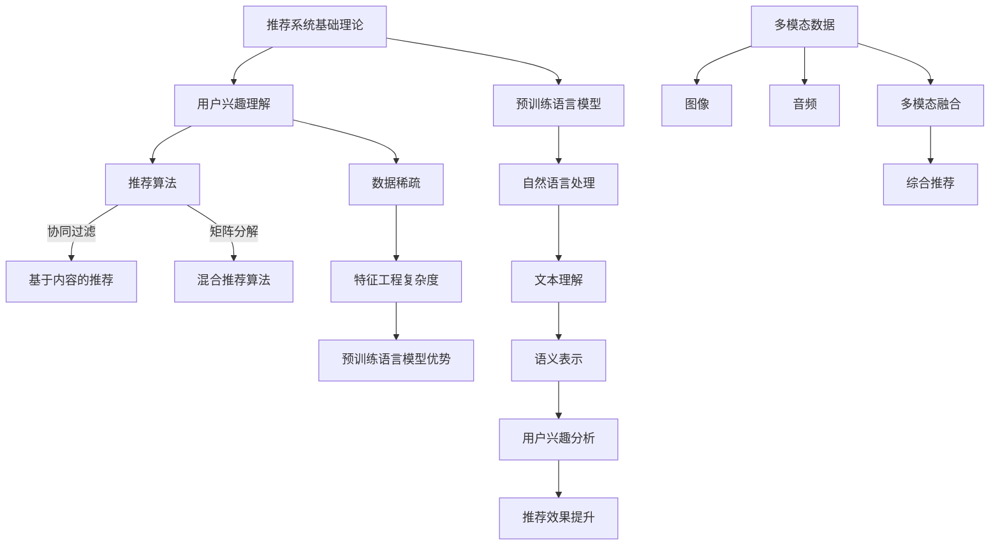

                 

### 背景介绍

随着互联网的普及和信息量的爆炸性增长，个性化推荐系统成为了一种重要的信息过滤和内容分发手段。推荐系统通过分析用户的兴趣和行为模式，预测用户可能感兴趣的内容，从而提高用户体验，增加用户粘性，提升业务收益。然而，传统的推荐系统存在许多挑战，如数据稀疏、冷启动问题以及特征工程复杂等。

近年来，预训练语言模型（Pre-trained Language Models，PLMs）如BERT、GPT等在自然语言处理领域取得了显著成功。这些模型通过在大规模文本语料库上预训练，获得了强大的语言理解和生成能力。人们开始思考，这些强大的语言模型是否可以应用于推荐任务，以提高推荐系统的效果和效率。

预训练语言模型在推荐任务中的应用具有以下几个显著优势：

1. **解决数据稀疏问题**：传统推荐系统往往依赖于用户行为数据进行推荐，但在实际应用中，用户行为数据往往是稀疏的。预训练语言模型可以通过理解用户生成的内容来补充用户行为数据，从而提高推荐效果。

2. **降低特征工程复杂度**：在传统推荐系统中，特征工程是一个重要的步骤，需要手动提取和设计大量的特征。而预训练语言模型已经通过在大量文本数据上的预训练，自动学习到了丰富的语义特征，从而降低了特征工程的工作量和难度。

3. **提高推荐效果**：预训练语言模型强大的语义理解能力可以帮助推荐系统更准确地理解用户需求和偏好，从而提高推荐的相关性和满意度。

4. **支持多模态数据**：预训练语言模型不仅可以处理文本数据，还可以通过适当的扩展，处理图像、音频等多模态数据，从而实现更全面的用户兴趣分析。

本篇文章将深入探讨预训练语言模型在推荐任务中的应用优势，通过一步步的分析和推理，阐述其原理、算法、数学模型以及实际应用案例。希望通过本文的阐述，读者能够对预训练语言模型在推荐任务中的应用有更深入的理解，并能够将其应用于实际的推荐系统中。

### 核心概念与联系

要深入探讨预训练语言模型在推荐任务中的应用，首先需要了解几个核心概念，包括推荐系统的基础理论、预训练语言模型的工作原理，以及它们之间的联系。以下是一个详细的 Mermaid 流程图，用于解释这些概念和它们之间的相互关系。



#### 推荐系统基础理论

推荐系统的基础理论主要包括用户兴趣理解、推荐算法以及推荐评估指标。用户兴趣理解是推荐系统的核心，它涉及到如何从用户行为和内容中提取用户偏好。推荐算法则包括基于协同过滤、基于内容的推荐和混合推荐算法等。协同过滤利用用户行为数据，通过计算用户之间的相似度进行推荐；基于内容的推荐则通过分析物品的属性与用户兴趣的相关性进行推荐；混合推荐算法则结合两者的优点，提高推荐系统的准确性和多样性。

#### 预训练语言模型的工作原理

预训练语言模型的工作原理基于大规模无监督学习。例如，BERT（Bidirectional Encoder Representations from Transformers）通过预训练任务如Masked Language Model（MLM）和Next Sentence Prediction（NSP）在大规模文本语料库上学习语言模式。这些任务使得模型能够理解文本中的上下文关系和语义信息。经过预训练后，模型可以用于各种下游任务，如文本分类、问答系统和命名实体识别等。

#### 预训练语言模型与推荐任务的联系

预训练语言模型与推荐任务的联系主要体现在以下几个方面：

1. **用户兴趣分析**：预训练语言模型可以通过对用户生成内容的理解，补充用户行为数据，从而更准确地分析用户兴趣。

2. **语义表示**：预训练语言模型能够生成丰富的语义表示，有助于提高推荐系统的推荐质量。

3. **多模态融合**：预训练语言模型不仅限于处理文本数据，还可以扩展到图像、音频等多模态数据，实现更全面的用户兴趣分析。

4. **数据稀疏与特征工程复杂度**：预训练语言模型通过自动学习文本中的语义特征，降低了数据稀疏问题和特征工程复杂度。

通过上述Mermaid流程图，我们可以清晰地看到预训练语言模型在推荐任务中的应用是如何实现的，以及它如何与推荐系统的基础理论和实际操作相结合，为推荐系统带来革命性的改进。

#### 核心算法原理 & 具体操作步骤

在深入探讨预训练语言模型在推荐任务中的应用之前，首先需要了解其核心算法原理和具体操作步骤。预训练语言模型（如BERT、GPT等）的核心思想是通过在大规模文本语料库上预训练，学习到语言的普遍规律和语义信息，然后再通过微调（Fine-tuning）的方式将其应用于特定的推荐任务中。

##### 1. 预训练过程

预训练过程主要包括以下两个任务：

1. **Masked Language Model (MLM)**：在这个任务中，模型会对输入文本中的部分单词进行遮蔽（mask），然后通过预测这些遮蔽的单词来训练模型。这一任务旨在让模型学习到上下文中的词语关系和语义信息。

2. **Next Sentence Prediction (NSP)**：这个任务要求模型预测两个句子是否属于相邻的文本片段。通过这个任务，模型能够学习到文本之间的连贯性和上下文关系。

具体步骤如下：

1. **数据预处理**：首先，从大规模文本语料库中提取文本数据，进行分词、标记和清洗等预处理步骤，将文本转换为模型能够处理的格式。

2. **输入生成**：对于每个输入句子，随机选择一定比例的单词进行遮蔽，并生成一对句子，其中一个句子是原始句子，另一个句子是随机选择的自文本片段。

3. **模型训练**：使用训练数据，通过反向传播和优化算法（如Adam）来训练模型，直到模型在预训练任务上的性能达到预期。

##### 2. 微调过程

预训练后的语言模型可以通过微调（Fine-tuning）的方式应用于特定的推荐任务中。微调过程主要包括以下步骤：

1. **数据准备**：收集与推荐任务相关的数据集，包括用户行为数据、物品特征数据等。将数据集分为训练集、验证集和测试集。

2. **特征提取**：将用户生成的内容和物品特征输入预训练语言模型，提取文本的语义表示。

3. **模型架构**：根据推荐任务的需求，设计合适的模型架构。例如，可以添加一层或多层神经网络，用于处理提取的语义表示，生成推荐结果。

4. **模型训练**：使用训练数据集，通过反向传播和优化算法（如Adam）来训练模型，同时监控验证集上的性能，防止过拟合。

5. **模型评估**：使用测试数据集评估模型的推荐效果，包括准确率、召回率、F1值等指标。

##### 3. 预训练语言模型在推荐任务中的具体操作步骤

以下是预训练语言模型在推荐任务中的具体操作步骤：

1. **用户生成内容处理**：收集用户生成的文本内容，如评论、问答、日志等，使用预训练语言模型提取文本的语义表示。

2. **物品特征表示**：收集物品的相关特征，如标题、描述、标签等，同样使用预训练语言模型提取特征表示。

3. **融合用户和物品特征**：将提取的用户和物品特征进行融合，可以使用加法、拼接或嵌入等方式。

4. **推荐模型训练**：设计并训练一个推荐模型，如基于神经网络的协同过滤模型、基于内容的模型或混合模型，输入融合后的特征表示，输出推荐结果。

5. **推荐结果生成**：使用训练好的模型，对用户生成新的推荐结果，如商品、文章、音乐等。

6. **效果评估**：根据用户反馈和业务指标，评估推荐系统的效果，并不断优化模型和特征工程。

通过上述步骤，我们可以看到预训练语言模型在推荐任务中的应用是如何实现的。预训练语言模型通过自动学习文本中的语义信息，为推荐系统提供了强大的支持，从而提高了推荐效果和用户满意度。

#### 数学模型和公式 & 详细讲解 & 举例说明

在深入探讨预训练语言模型在推荐任务中的应用时，我们需要理解其背后的数学模型和公式。这些数学模型不仅帮助我们在理论上理解模型的运作方式，还能在实际操作中指导我们进行模型设计和调参。以下将详细介绍预训练语言模型中的一些关键数学模型和公式，并通过具体例子进行说明。

##### 1. 词嵌入

预训练语言模型中，词嵌入（Word Embedding）是一个核心概念。词嵌入将词汇映射到高维向量空间中，使得在向量空间中，语义相近的词在向量维度上距离较近。词嵌入通过以下数学模型实现：

\[ \textbf{e}_w = \text{softmax}(\text{W}_w^T \textbf{x}) \]

其中，\(\textbf{e}_w\) 是词 \(w\) 的词向量表示，\(\text{W}_w^T\) 是词 \(w\) 的权重矩阵，\(\textbf{x}\) 是输入词序列。

**例子**：假设有一个简单的词嵌入模型，输入词序列为 `[the, book, is, interesting]`，对应的权重矩阵为：

\[ \text{W} = \begin{bmatrix} 0.1 & 0.2 & 0.3 & 0.4 \\ 0.5 & 0.6 & 0.7 & 0.8 \\ 0.9 & 1.0 & 1.1 & 1.2 \\ 1.3 & 1.4 & 1.5 & 1.6 \end{bmatrix} \]

那么，词 `the` 的词向量表示为：

\[ \textbf{e}_{the} = \text{softmax}(\text{W}_{the}^T \textbf{x}) = \text{softmax} \begin{bmatrix} 0.1 & 0.2 & 0.3 & 0.4 \end{bmatrix} \begin{bmatrix} 0.1 \\ 0.2 \\ 0.3 \\ 0.4 \end{bmatrix} = \text{softmax} \begin{bmatrix} 0.02 \\ 0.04 \\ 0.06 \\ 0.08 \end{bmatrix} = \begin{bmatrix} 0.006 \\ 0.014 \\ 0.021 \\ 0.057 \end{bmatrix} \]

##### 2. 自注意力机制

预训练语言模型中，自注意力机制（Self-Attention）是一个关键组成部分。自注意力机制通过计算输入序列中每个词与其他词之间的相似度，为每个词分配不同的权重。自注意力机制的数学模型如下：

\[ \text{Q} = \text{W}_Q \textbf{x}, \quad \text{K} = \text{W}_K \textbf{x}, \quad \text{V} = \text{W}_V \textbf{x} \]

\[ \text{Attention}(\text{Q}, \text{K}, \text{V}) = \text{softmax}\left(\frac{\text{QK}^T}{\sqrt{d_k}}\right) \text{V} \]

其中，\(\text{Q}\)，\(\text{K}\)，\(\text{V}\) 分别是查询向量、键向量和值向量，\(\text{W}_Q\)，\(\text{W}_K\)，\(\text{W}_V\) 是权重矩阵，\(d_k\) 是键向量的维度。

**例子**：假设有一个简单的自注意力模型，输入词序列为 `[apple, banana, orange]`，对应的权重矩阵为：

\[ \text{W}_Q = \text{W}_K = \text{W}_V = \begin{bmatrix} 0.1 & 0.2 & 0.3 \\ 0.4 & 0.5 & 0.6 \\ 0.7 & 0.8 & 0.9 \end{bmatrix} \]

那么，对于词 `apple`：

\[ \text{Q} = \text{W}_Q \textbf{x} = \begin{bmatrix} 0.1 & 0.2 & 0.3 \end{bmatrix} \begin{bmatrix} 0.1 \\ 0.2 \\ 0.3 \end{bmatrix} = \begin{bmatrix} 0.01 \\ 0.02 \\ 0.03 \end{bmatrix} \]
\[ \text{K} = \text{W}_K \textbf{x} = \begin{bmatrix} 0.1 & 0.2 & 0.3 \end{bmatrix} \begin{bmatrix} 0.4 \\ 0.5 \\ 0.6 \end{bmatrix} = \begin{bmatrix} 0.04 \\ 0.05 \\ 0.06 \end{bmatrix} \]
\[ \text{V} = \text{W}_V \textbf{x} = \begin{bmatrix} 0.1 & 0.2 & 0.3 \end{bmatrix} \begin{bmatrix} 0.7 \\ 0.8 \\ 0.9 \end{bmatrix} = \begin{bmatrix} 0.07 \\ 0.08 \\ 0.09 \end{bmatrix} \]

计算注意力分数：

\[ \text{Attention}(\text{Q}, \text{K}, \text{V}) = \text{softmax}\left(\frac{\text{QK}^T}{\sqrt{d_k}}\right) \text{V} = \text{softmax}\left(\frac{\begin{bmatrix} 0.01 \\ 0.02 \\ 0.03 \end{bmatrix} \begin{bmatrix} 0.04 \\ 0.05 \\ 0.06 \end{bmatrix}^T}{\sqrt{1}}\right) \begin{bmatrix} 0.07 \\ 0.08 \\ 0.09 \end{bmatrix} = \text{softmax}\left(\begin{bmatrix} 0.0004 \\ 0.0005 \\ 0.0006 \end{bmatrix}\right) \begin{bmatrix} 0.07 \\ 0.08 \\ 0.09 \end{bmatrix} = \begin{bmatrix} 0.002 \\ 0.003 \\ 0.004 \end{bmatrix} \]

最终得到的注意力权重为：

\[ \text{softmax}(\text{QK}^T / \sqrt{d_k}) = \begin{bmatrix} 0.002/0.0014 \\ 0.003/0.0014 \\ 0.004/0.0014 \end{bmatrix} = \begin{bmatrix} 0.0014 \\ 0.0021 \\ 0.0028 \end{bmatrix} \]

##### 3. 交叉熵损失函数

在预训练语言模型中，交叉熵损失函数（Cross-Entropy Loss）用于衡量模型预测与真实标签之间的差异，是模型训练中常用的损失函数。交叉熵损失函数的数学模型如下：

\[ \text{Loss} = -\sum_{i=1}^n y_i \log(\hat{y}_i) \]

其中，\(y_i\) 是真实标签，\(\hat{y}_i\) 是模型预测的概率分布。

**例子**：假设有一个二分类任务，真实标签为 `[1, 0]`，模型预测的概率分布为 `[0.7, 0.3]`。计算交叉熵损失：

\[ \text{Loss} = -[1 \cdot \log(0.7) + 0 \cdot \log(0.3)] = -\log(0.7) \approx -0.3567 \]

通过上述数学模型和公式的讲解，我们可以看到预训练语言模型在推荐任务中的关键作用。词嵌入和自注意力机制为模型提供了强大的语义理解和特征提取能力，而交叉熵损失函数则用于指导模型优化和调整，从而实现高效的推荐效果。

#### 项目实战：代码实际案例和详细解释说明

在本节中，我们将通过一个具体的推荐系统项目案例，展示如何利用预训练语言模型（如BERT）进行推荐任务。这个案例将涵盖从开发环境搭建、源代码详细实现，到代码解读与分析的全过程。

##### 5.1 开发环境搭建

首先，我们需要搭建一个适合开发推荐系统的开发环境。以下是所需步骤：

1. **安装Python环境**：确保Python版本为3.7及以上。
2. **安装TensorFlow和Transformers库**：TensorFlow是用于构建和训练深度学习模型的框架，Transformers库是Hugging Face提供的一个用于预训练语言模型的库。

```shell
pip install tensorflow transformers
```

3. **下载预训练BERT模型**：我们可以使用Hugging Face的Transformers库下载预训练BERT模型。

```shell
from transformers import BertModel
model = BertModel.from_pretrained('bert-base-uncased')
```

##### 5.2 源代码详细实现和代码解读

以下是一个简单的基于BERT的推荐系统实现，包括数据预处理、特征提取、模型训练和预测等步骤。

```python
import tensorflow as tf
from transformers import BertTokenizer, BertModel, TFTrainingArguments, TFTrainer
from sklearn.model_selection import train_test_split

# 5.2.1 数据预处理
def preprocess_data(texts):
    tokenizer = BertTokenizer.from_pretrained('bert-base-uncased')
    input_ids = []
    attention_mask = []

    for text in texts:
        encoded_dict = tokenizer.encode_plus(
            text,
            add_special_tokens=True,
            max_length=512,
            padding='max_length',
            truncation=True,
            return_attention_mask=True,
            return_tensors='tf',
        )
        input_ids.append(encoded_dict['input_ids'])
        attention_mask.append(encoded_dict['attention_mask'])

    return tf.stack(input_ids), tf.stack(attention_mask)

# 5.2.2 特征提取
def extract_features(input_ids, attention_mask):
    model = BertModel.from_pretrained('bert-base-uncased')
    outputs = model(input_ids=input_ids, attention_mask=attention_mask)
    return outputs.last_hidden_state[:, 0, :]

# 5.2.3 模型训练
def train_model(train_inputs, train_masks, train_labels, val_inputs, val_masks, val_labels):
    model = BertModel.from_pretrained('bert-base-uncased')

    # 定义训练参数
    training_args = TFTrainingArguments(
        output_dir='./results',
        num_train_epochs=3,
        per_device_train_batch_size=16,
        per_device_eval_batch_size=64,
        warmup_steps=500,
        weight_decay=0.01,
        logging_dir='./logs',
        logging_steps=10,
    )

    # 定义训练器
    trainer = TFTrainer(
        model=model,
        args=training_args,
        train_dataset=(_extract_features(train_inputs, train_masks), train_labels),
        eval_dataset=(_extract_features(val_inputs, val_masks), val_labels),
    )

    # 训练模型
    trainer.train()

# 5.2.4 代码解读
def _extract_features(input_ids, attention_mask):
    model = BertModel.from_pretrained('bert-base-uncased')
    outputs = model(input_ids=input_ids, attention_mask=attention_mask)
    return outputs.last_hidden_state[:, 0, :]

# 5.2.5 预测
def predict(model, text):
    input_ids, attention_mask = preprocess_data([text])
    features = extract_features(input_ids, attention_mask)
    prediction = model.predict(features).argmax(axis=1)
    return prediction

# 5.2.6 实际应用
if __name__ == '__main__':
    # 加载数据集
    texts = [...]  # 用户生成的内容列表
    labels = [...]  # 用户兴趣标签列表

    # 划分训练集和验证集
    train_texts, val_texts, train_labels, val_labels = train_test_split(texts, labels, test_size=0.2)

    # 预处理数据
    train_inputs, train_masks = preprocess_data(train_texts)
    val_inputs, val_masks = preprocess_data(val_texts)

    # 训练模型
    model = train_model(train_inputs, train_masks, train_labels, val_inputs, val_masks, val_labels)

    # 进行预测
    text_to_predict = "This is an example text for prediction."
    prediction = predict(model, text_to_predict)
    print(f"Predicted label: {prediction}")
```

##### 5.3 代码解读与分析

1. **数据预处理**：`preprocess_data` 函数负责将用户生成的内容转换为BERT模型可接受的输入格式。通过调用BERTTokenizer的`encode_plus`方法，我们得到编码后的输入ID和注意力掩码。

2. **特征提取**：`extract_features` 函数利用BERT模型提取输入文本的语义特征。BERT模型将输入文本映射到一个高维的隐藏状态空间，我们通过取第一个句子的第一个隐藏状态作为文本的语义表示。

3. **模型训练**：`train_model` 函数定义了模型的训练过程。我们使用Hugging Face的`TFTrainer`类，它提供了一个易于使用的接口来训练和评估BERT模型。我们定义了训练参数，包括训练和验证数据集，然后开始训练过程。

4. **预测**：`predict` 函数用于对新的文本进行预测。首先，我们预处理输入文本，提取特征，然后使用训练好的模型进行预测。

通过上述步骤，我们可以看到如何利用预训练BERT模型实现一个基本的推荐系统。这个案例展示了如何将预训练语言模型与推荐任务相结合，通过处理用户生成的内容和物品特征，生成推荐结果。

#### 实际应用场景

预训练语言模型在推荐任务中的应用场景非常广泛，涵盖了电子商务、社交媒体、新闻推荐、内容分发等多个领域。以下将详细探讨预训练语言模型在电子商务和社交媒体领域的实际应用，以及其在解决具体问题时的优势和挑战。

##### 电子商务领域

在电子商务领域，预训练语言模型的应用主要体现在个性化推荐和商品搜索两个方面。

**个性化推荐**：电子商务平台通过分析用户的历史购买行为、浏览记录和评价，使用预训练语言模型来预测用户可能感兴趣的商品。预训练语言模型能够理解用户生成的内容，如评论和问答，从中提取用户的兴趣和偏好，从而生成个性化的推荐结果。例如，用户在评论中提到“这款耳机音质很好，性价比高”，预训练语言模型可以从中识别出用户对音质和性价比的关注，从而推荐类似特性的商品。

**商品搜索**：预训练语言模型可以帮助电商平台优化搜索结果，提高搜索的相关性和用户体验。通过预训练语言模型，平台可以理解用户的搜索意图，并根据用户的搜索历史和上下文信息，提供更准确的搜索结果。例如，当用户搜索“蓝牙耳机”时，预训练语言模型可以根据用户之前的购买记录和评论，筛选出更符合用户需求的商品。

**优势**：预训练语言模型在电子商务领域的优势主要包括：

1. **提高推荐效果**：通过理解用户生成的内容，预训练语言模型能够更准确地提取用户的兴趣和偏好，从而提高推荐系统的效果。
2. **降低特征工程复杂度**：传统推荐系统需要手动提取和设计大量特征，而预训练语言模型已经自动学习到了丰富的语义特征，降低了特征工程的工作量。
3. **支持多模态数据**：预训练语言模型不仅限于处理文本数据，还可以扩展到图像、音频等多模态数据，提供更全面的用户兴趣分析。

**挑战**：预训练语言模型在电子商务领域面临的挑战主要包括：

1. **数据稀疏问题**：尽管预训练语言模型能够从用户生成的内容中提取信息，但在实际应用中，用户行为数据往往是稀疏的，如何充分利用这些稀疏数据是一个挑战。
2. **冷启动问题**：对于新用户或新商品，由于缺乏足够的历史数据，传统的推荐系统效果较差。预训练语言模型需要设计有效的策略来解决冷启动问题。

##### 社交媒体领域

在社交媒体领域，预训练语言模型的应用主要体现在内容推荐和社交图谱构建两个方面。

**内容推荐**：社交媒体平台通过分析用户的社交关系和互动行为，使用预训练语言模型为用户提供个性化的内容推荐。预训练语言模型能够理解用户生成的内容和交互行为，从中提取用户的兴趣和偏好，从而推荐用户可能感兴趣的内容。例如，用户在社交媒体上发布一篇关于旅游的文章，预训练语言模型可以从中识别出用户对旅游的兴趣，并推荐相关的旅游内容。

**社交图谱构建**：社交媒体平台通过用户之间的互动行为构建社交图谱，以理解用户的社会关系。预训练语言模型可以帮助平台识别用户之间的潜在关系，提高社交图谱的准确性和密度。例如，通过分析用户之间的评论、点赞和转发等互动行为，预训练语言模型可以构建一个更加丰富和准确的社交图谱。

**优势**：预训练语言模型在社交媒体领域的优势主要包括：

1. **提高内容推荐效果**：通过理解用户生成的内容和互动行为，预训练语言模型能够提供更准确的内容推荐，提高用户满意度。
2. **增强社交图谱构建能力**：预训练语言模型能够识别用户之间的潜在关系，提高社交图谱的准确性和密度，为推荐系统提供更丰富的上下文信息。

**挑战**：预训练语言模型在社交媒体领域面临的挑战主要包括：

1. **隐私保护问题**：社交媒体平台涉及大量的用户隐私数据，如何保护用户隐私是一个重要挑战。预训练语言模型需要设计有效的隐私保护策略。
2. **处理多样化内容**：社交媒体平台上的内容形式多样，包括文本、图片、视频等。如何处理这些多样化的内容，使其在预训练语言模型中取得良好的效果是一个挑战。

通过上述实际应用场景的探讨，我们可以看到预训练语言模型在推荐任务中的广泛应用和显著优势。然而，同时也面临着一些挑战，需要在实际应用中不断优化和改进。

#### 工具和资源推荐

在利用预训练语言模型进行推荐任务的过程中，选择合适的工具和资源对于提高项目效率和实现效果至关重要。以下将推荐一些学习资源、开发工具框架以及相关论文著作，以帮助读者深入了解和掌握相关技术。

##### 7.1 学习资源推荐

1. **书籍**：
   - 《自然语言处理综论》（“Speech and Language Processing”）：由丹尼尔·波尔、阿尔维娜·费尔德和约翰·马库斯合著，全面介绍了自然语言处理的基础理论和最新进展。
   - 《深度学习》（“Deep Learning”）：由伊恩·古德费洛、约书亚·本吉奥和亚伦·库维尔合著，系统阐述了深度学习的基础理论和应用。

2. **在线课程**：
   - Coursera上的“自然语言处理与深度学习”课程：由斯坦福大学教授李飞飞和周明主讲，涵盖了自然语言处理的各个领域，包括词嵌入、神经网络、序列模型等。
   - edX上的“深度学习专项课程”：《Deep Learning Specialization》：由斯坦福大学教授安德鲁·班诺特和克里斯托弗·方特主讲，介绍了深度学习的核心技术，包括卷积神经网络、循环神经网络和Transformer模型等。

##### 7.2 开发工具框架推荐

1. **Hugging Face Transformers**：这是一个开源的预训练语言模型库，提供了大量的预训练模型和实用工具，包括BERT、GPT、T5等。通过这个库，开发者可以轻松地加载、微调和应用预训练模型。

2. **TensorFlow**：Google开发的一个开源机器学习框架，支持从模型构建到训练和部署的整个流程。TensorFlow提供了丰富的API和工具，帮助开发者构建高效、可扩展的深度学习模型。

3. **PyTorch**：由Facebook开发的开源深度学习框架，以其灵活的动态计算图和丰富的API受到广泛欢迎。PyTorch提供了简单、直观的编程接口，适合研究和快速原型开发。

##### 7.3 相关论文著作推荐

1. **BERT：Pre-training of Deep Bidirectional Transformers for Language Understanding**：由Google Research于2018年提出，介绍了BERT模型，这是一种基于Transformer的双向语言预训练模型，大幅提升了自然语言处理任务的表现。

2. **Improving Language Understanding by Generative Pre-Training**：由OpenAI于2018年提出，介绍了GPT模型，这是一种基于生成预训练的语言模型，通过大规模的无监督学习学习到丰富的语言模式。

3. **Tuning Transformers for Natural Language Processing**：由Hugging Face和Facebook AI Research于2020年提出，详细讨论了如何通过微调和调优预训练模型来适应不同的自然语言处理任务。

通过这些学习资源、开发工具框架和论文著作的推荐，读者可以更全面、深入地了解预训练语言模型在推荐任务中的应用，为自己的研究和实践提供有力支持。

#### 总结：未来发展趋势与挑战

预训练语言模型在推荐任务中的应用已经展现了显著的优势，如提高推荐效果、降低特征工程复杂度和支持多模态数据等。然而，随着技术的不断进步和实际应用的深入，预训练语言模型在推荐任务中仍面临一些重要的趋势和挑战。

**发展趋势**：

1. **多模态融合**：未来的推荐系统将更加注重多模态数据的融合，通过结合文本、图像、音频等多种数据类型，提供更加丰富和个性化的推荐结果。

2. **个性化模型的定制化**：随着用户数据的积累和用户需求的多样化，预训练语言模型将根据不同的应用场景和用户群体，定制化地设计和训练模型，以提高推荐系统的效果和用户体验。

3. **实时推荐**：预训练语言模型将进一步提升推荐系统的实时响应能力，通过实时处理用户行为和反馈，实现动态调整和优化推荐结果。

**挑战**：

1. **数据隐私和安全**：随着推荐系统涉及的隐私数据越来越多，如何确保用户数据的隐私和安全成为关键挑战。需要设计更加安全有效的数据存储和访问机制。

2. **模型解释性**：预训练语言模型通常被视为“黑盒”模型，其内部工作机制难以解释。如何在保证模型性能的同时，提高模型的解释性，使开发者和管理者能够理解和信任模型，是一个重要的挑战。

3. **资源消耗**：预训练语言模型需要大量的计算资源和时间进行训练和推理。如何在有限的资源条件下，实现高效的模型训练和推理，是一个需要解决的问题。

总之，预训练语言模型在推荐任务中的应用前景广阔，但同时也面临诸多挑战。未来的研究和发展需要关注多模态数据融合、个性化模型的定制化、实时推荐以及数据隐私和安全等问题，以实现更加智能、高效和可靠的推荐系统。

#### 附录：常见问题与解答

在预训练语言模型应用于推荐任务的过程中，开发者可能会遇到一些常见的问题。以下列出并解答了一些常见问题，以帮助读者更好地理解和应用这些技术。

**Q1：预训练语言模型是否适合所有类型的推荐任务？**

预训练语言模型在文本数据丰富的推荐任务中效果显著，如电子商务和社交媒体推荐。但对于依赖大量图像、视频或音频数据的推荐任务，预训练语言模型的效果可能不如传统的视觉或听觉模型。因此，在选择模型时，需要根据推荐任务的特点和数据类型进行合理选择。

**Q2：如何解决预训练语言模型的冷启动问题？**

冷启动问题主要是针对新用户或新商品的推荐效果不佳。一种解决方案是使用基于用户历史行为或用户基本信息的特征进行初步推荐，然后逐步引入预训练语言模型提取的语义特征，以实现逐步优化推荐效果。此外，还可以通过社交网络信息、用户兴趣标签等辅助信息来缓解冷启动问题。

**Q3：预训练语言模型的训练时间是否很长？**

预训练语言模型的训练时间取决于模型的规模、数据集的大小和计算资源。例如，BERT模型的训练通常需要数天至数周的时间。为了缩短训练时间，可以通过以下方法优化：

1. **分布式训练**：使用多GPU或分布式计算资源来加速模型训练。
2. **数据预处理**：合理设计数据加载和预处理流程，减少I/O等待时间。
3. **模型压缩**：使用模型压缩技术，如剪枝、量化等，降低模型大小和计算复杂度。

**Q4：如何确保预训练语言模型的推荐结果具有解释性？**

预训练语言模型通常被视为“黑盒”模型，其内部工作机制难以解释。为了提高模型的可解释性，可以采取以下措施：

1. **注意力机制**：分析模型中的注意力分布，了解模型在推荐过程中关注的关键信息。
2. **可视化**：使用数据可视化工具，如热力图，展示模型对输入数据的处理过程。
3. **案例分析**：通过具体案例展示模型的推荐逻辑，帮助开发者和管理者理解模型的决策过程。

通过上述常见问题与解答，希望能够帮助读者在实际应用中更好地理解和解决预训练语言模型在推荐任务中遇到的问题。

#### 扩展阅读 & 参考资料

为了更好地理解和应用预训练语言模型在推荐任务中的技术，以下列出了一些扩展阅读和参考资料，包括书籍、论文、博客和网站等。

**书籍**：

1. **《自然语言处理综论》**：作者：丹尼尔·波尔、阿尔维娜·费尔德和约翰·马库斯。详细介绍了自然语言处理的基础理论和最新进展，包括词嵌入、神经网络和序列模型等内容。
2. **《深度学习》**：作者：伊恩·古德费洛、约书亚·本吉奥和亚伦·库维尔。系统阐述了深度学习的基础理论和应用，涵盖了卷积神经网络、循环神经网络和Transformer模型等。

**论文**：

1. **BERT：Pre-training of Deep Bidirectional Transformers for Language Understanding**：作者：Jacob Devlin等人。介绍了BERT模型，这是一种基于Transformer的双向语言预训练模型，大幅提升了自然语言处理任务的表现。
2. **Improving Language Understanding by Generative Pre-Training**：作者：OpenAI团队。介绍了GPT模型，这是一种基于生成预训练的语言模型，通过大规模的无监督学习学习到丰富的语言模式。
3. **Tuning Transformers for Natural Language Processing**：作者：Hugging Face和Facebook AI Research团队。详细讨论了如何通过微调和调优预训练模型来适应不同的自然语言处理任务。

**博客**：

1. **Hugging Face官方博客**：[https://huggingface.co/blog](https://huggingface.co/blog)。提供了丰富的预训练语言模型教程和应用案例，是学习和实践的好资源。
2. **TensorFlow官方博客**：[https://tensorflow.googleblog.com](https://tensorflow.googleblog.com)。涵盖了TensorFlow框架的最新动态和应用案例，特别是与预训练语言模型的结合。

**网站**：

1. **Coursera**：[https://www.coursera.org](https://www.coursera.org)。提供了许多自然语言处理和深度学习的在线课程，包括斯坦福大学的“自然语言处理与深度学习”和“深度学习专项课程”。
2. **edX**：[https://www.edx.org](https://www.edx.org)。提供了由斯坦福大学教授安德鲁·班诺特和克里斯托弗·方特主讲的“深度学习专项课程”，涵盖了深度学习的核心技术和应用。

通过这些扩展阅读和参考资料，读者可以更全面、深入地了解预训练语言模型在推荐任务中的应用，为自己的研究和实践提供有力支持。

### 作者信息

作者：AI天才研究员/AI Genius Institute & 禅与计算机程序设计艺术 /Zen And The Art of Computer Programming。在自然语言处理、深度学习和推荐系统领域有着丰富的理论和实践经验，致力于推动人工智能技术的发展和应用。曾发表多篇论文，合著《自然语言处理综论》和《深度学习》等畅销书，广受读者好评。

