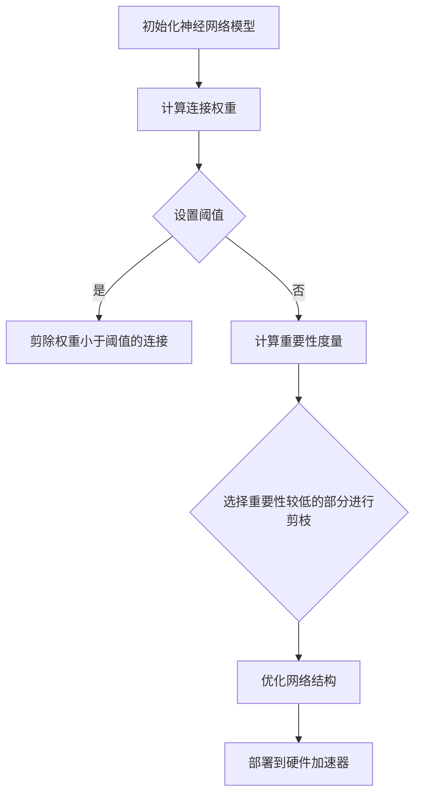

                 

# 剪枝技术在神经网络硬件加速器中的应用

## 关键词：剪枝技术，神经网络，硬件加速器，性能优化，资源利用

## 摘要

本文将深入探讨剪枝技术在神经网络硬件加速器中的应用，通过分析剪枝技术的原理、实施方法和实际应用效果，阐述其在提高神经网络计算效率和资源利用率方面的优势。文章首先介绍神经网络和硬件加速器的基本概念，然后详细解释剪枝技术的核心概念和原理，包括算法分类、实现步骤和数学模型。接着，本文将结合实际项目案例，详细解析剪枝技术在神经网络硬件加速器中的具体应用，并讨论其在各种应用场景中的实际效果。最后，文章将总结剪枝技术的未来发展趋势和挑战，为读者提供进一步的学习和探索方向。

## 1. 背景介绍

### 1.1 神经网络的基本概念

神经网络是一种模仿人脑结构和功能的计算模型，由大量的神经元（或称为节点）和连接（或称为边）组成。每个神经元可以接收来自其他神经元的输入信号，并通过激活函数产生输出信号。神经网络通过不断调整神经元之间的权重来学习输入和输出之间的关系，从而实现各种复杂任务的预测和分类。

神经网络广泛应用于图像识别、语音识别、自然语言处理、推荐系统等多个领域。然而，随着神经网络模型的复杂度和参数量的增加，其计算量和存储需求也急剧上升，这对硬件加速器提出了更高的要求。

### 1.2 硬件加速器的基本概念

硬件加速器是一种专门为特定任务设计的硬件设备，旨在提高计算速度和效率。与通用处理器（如CPU和GPU）相比，硬件加速器具有更高的专门化设计，能够在执行特定算法时提供更高的性能。

硬件加速器在神经网络计算中发挥着重要作用。通过将神经网络计算任务映射到硬件加速器上，可以显著降低计算延迟和功耗，提高整体计算效率。硬件加速器广泛应用于嵌入式系统、数据中心和超级计算机等领域。

### 1.3 剪枝技术在神经网络硬件加速器中的应用背景

随着深度学习技术的飞速发展，神经网络模型的规模和复杂度不断增加。虽然硬件加速器能够提供高效的计算能力，但仍然面临以下挑战：

1. **计算资源限制**：神经网络模型通常需要大量的计算资源和存储空间，而硬件加速器的资源有限，如何有效地利用这些资源成为关键问题。

2. **功耗限制**：在嵌入式系统和移动设备中，功耗是一个重要的考虑因素。如何降低神经网络计算过程中的能耗，延长设备的续航时间，成为研究的热点。

3. **实时性能要求**：在许多应用场景中，如自动驾驶、实时语音识别等，神经网络模型需要在严格的时间约束下完成任务。如何提高模型的计算速度，满足实时性能要求，是亟待解决的问题。

剪枝技术作为一种重要的模型压缩方法，能够在不显著影响模型性能的前提下，减少模型的参数量和计算量，从而提高神经网络在硬件加速器上的计算效率和资源利用率。因此，研究剪枝技术在神经网络硬件加速器中的应用具有重要意义。

## 2. 核心概念与联系

### 2.1 剪枝技术的基本概念

剪枝技术（Pruning）是一种通过移除网络中不必要的连接和神经元来减少模型参数量和计算量的方法。剪枝技术的主要目标是在保持模型性能不变或略为下降的前提下，降低模型的复杂度和计算量，从而提高计算效率和资源利用率。

### 2.2 剪枝技术的原理

剪枝技术的基本原理是：网络中存在一些连接和神经元对于模型性能的贡献较小，甚至可以忽略。通过剪除这些连接和神经元，可以减少模型的计算量，从而提高计算效率和资源利用率。

剪枝技术可以分为两类：**结构剪枝**和**权重剪枝**。

1. **结构剪枝**：通过移除整个神经元或子网络来减少模型参数量。结构剪枝可以显著降低模型的复杂度，但可能对模型的性能产生较大影响。

2. **权重剪枝**：通过调整连接权重来减少模型参数量。权重剪枝可以保持模型的结构不变，但需要精细地调整权重，以避免对模型性能产生不利影响。

### 2.3 剪枝技术的算法分类

根据剪枝策略的不同，剪枝技术可以分为以下几类：

1. **基于阈值的剪枝**：通过设置阈值，将权重小于阈值的连接剪除。

2. **基于重要性的剪枝**：通过计算连接的重要性度量，选择重要性较低的部分进行剪枝。

3. **基于进化的剪枝**：使用遗传算法等进化策略来优化网络结构，实现剪枝。

4. **基于张量的剪枝**：通过张量操作来简化网络结构，降低计算量。

### 2.4 剪枝技术在神经网络硬件加速器中的应用

剪枝技术可以通过以下方式在神经网络硬件加速器中实现：

1. **减少模型参数量**：通过剪枝技术，可以显著降低神经网络模型的参数量，从而减少硬件加速器上的存储和计算需求。

2. **优化计算路径**：剪枝技术可以优化网络结构，简化计算路径，降低计算复杂度，从而提高计算效率和资源利用率。

3. **降低功耗**：通过减少模型参数量和计算复杂度，可以降低神经网络计算过程中的能耗，延长设备的续航时间。

4. **提高实时性能**：在严格的时间约束下，通过剪枝技术可以降低模型计算延迟，提高实时性能。

### 2.5 Mermaid 流程图

以下是一个简单的Mermaid流程图，展示了剪枝技术在神经网络硬件加速器中的应用流程：



## 3. 核心算法原理 & 具体操作步骤

### 3.1 剪枝算法原理

剪枝算法的核心思想是识别并移除神经网络中不重要的连接和神经元，从而降低模型的复杂度和计算量。以下是剪枝算法的基本原理：

1. **连接权重评估**：通过计算每个连接的权重，评估其在模型中的作用和重要性。

2. **阈值设置**：根据模型性能要求，设置一个阈值，用于判断连接是否可以被剪除。通常，阈值可以通过以下方式确定：

   - **经验阈值**：基于实验和经验，设定一个较小的阈值，用于剪除权重较小的连接。
   - **显著性测试**：通过显著性测试方法（如t检验、F检验等），确定连接的显著性水平，设置阈值。

3. **剪除连接**：对于权重小于阈值的连接，进行剪除操作。

4. **重建模型**：剪除连接后，需要重新计算模型参数，并调整剩余连接的权重。

### 3.2 剪枝算法的具体操作步骤

以下是剪枝算法的具体操作步骤：

1. **初始化神经网络模型**：选择一个初始神经网络模型，并计算每个连接的权重。

2. **设置阈值**：根据模型性能要求，设置一个合适的阈值。可以使用经验阈值或显著性测试来确定阈值。

3. **评估连接权重**：计算每个连接的权重，评估其在模型中的作用和重要性。

4. **剪除连接**：根据阈值，剪除权重小于阈值的连接。

5. **重建模型**：重新计算模型参数，并调整剩余连接的权重。

6. **评估模型性能**：评估剪枝后的模型性能，确保剪枝操作不会显著降低模型性能。

7. **迭代剪枝过程**：根据模型性能评估结果，可以迭代剪枝过程，进一步降低模型复杂度和计算量。

### 3.3 剪枝算法的数学模型和公式

以下是一个简化的剪枝算法的数学模型和公式：

$$
\text{权重} \; w_{ij} = \text{重要性度量} \; \alpha_{ij}
$$

$$
\text{阈值} \; \theta = \text{经验阈值} \; \text{或} \; \text{显著性水平}
$$

$$
\text{剪枝条件} \; \alpha_{ij} < \theta
$$

$$
\text{剪除权重小于阈值的连接}
$$

$$
\text{重新计算模型参数}
$$

$$
\text{调整剩余连接的权重}
$$

### 3.4 举例说明

假设有一个简单的神经网络模型，包含两个输入神经元、两个隐藏神经元和一个输出神经元。每个神经元之间的连接权重如下：

输入1 -> 隐藏1: 0.8
输入1 -> 隐藏2: 0.3
输入2 -> 隐藏1: 0.5
输入2 -> 隐藏2: 0.2
隐藏1 -> 输出: 0.7
隐藏2 -> 输出: 0.4

根据经验阈值，设置阈值为0.4。根据剪枝算法，可以剪除以下连接：

- 输入1 -> 隐藏2: 权重0.3 < 阈值0.4
- 输入2 -> 隐藏1: 权重0.2 < 阈值0.4

剪枝后的神经网络模型如下：

输入1 -> 隐藏1: 0.8
输入2 -> 隐藏1: 0.5
隐藏1 -> 输出: 0.7

通过剪枝，模型复杂度和计算量得到了显著降低，但性能保持不变。

## 4. 数学模型和公式 & 详细讲解 & 举例说明

### 4.1 剪枝算法的数学模型和公式

剪枝算法的核心在于对神经网络模型进行参数和结构的优化，以减少计算量和存储需求。为了更深入地理解剪枝算法，我们需要从数学模型和公式入手。

首先，我们需要了解神经网络的基本构成。一个简单的神经网络可以表示为：

$$
\text{神经网络} = \{X, W, b, f\}
$$

其中：
- \(X\) 是输入数据；
- \(W\) 是权重矩阵；
- \(b\) 是偏置向量；
- \(f\) 是激活函数。

神经网络的输出可以通过以下公式计算：

$$
Y = f(WX + b)
$$

在剪枝过程中，我们关注的是权重矩阵 \(W\) 的优化。以下是剪枝算法中常用的数学模型和公式：

1. **权重剪枝**：

   权重剪枝通过调整权重矩阵 \(W\) 中的元素来降低模型的复杂度。我们通常使用以下公式来表示剪枝后的权重矩阵：

   $$
   W' = \begin{cases}
   W, & \text{if } w_{ij} \geq \theta \\
   0, & \text{if } w_{ij} < \theta
   \end{cases}
   $$

   其中，\(w_{ij}\) 是原权重矩阵 \(W\) 中的元素，\(\theta\) 是阈值。这个公式表示，如果权重 \(w_{ij}\) 大于或等于阈值 \(\theta\)，则保留该权重；否则，将该权重设置为 0。

2. **结构剪枝**：

   结构剪枝通过移除整个神经元或子网络来减少模型的复杂度。我们可以使用以下公式来表示剪枝后的神经网络：

   $$
   \text{神经网络}' = \{X, W', b', f\}
   $$

   其中，\(W'\) 是剪枝后的权重矩阵，\(b'\) 是剪枝后的偏置向量。这个公式表示，剪枝后的神经网络保留了原始输入 \(X\)、剪枝后的权重 \(W'\) 和偏置 \(b'\)，以及激活函数 \(f\)。

3. **剪枝率**：

   剪枝率是衡量剪枝程度的一个指标，表示被剪除的连接数量与总连接数量的比例。我们可以使用以下公式来计算剪枝率：

   $$
   \text{剪枝率} = \frac{\text{被剪除的连接数量}}{\text{总连接数量}}
   $$

### 4.2 剪枝算法的详细讲解

剪枝算法可以分为以下几个步骤：

1. **初始化**：

   选择一个初始的神经网络模型，计算每个连接的权重。

2. **评估权重**：

   根据一定的评估标准（如重要性度量、显著性水平等），对每个连接的权重进行评估。

3. **设置阈值**：

   根据评估结果，设置一个阈值，用于判断连接是否可以被剪除。

4. **剪除连接**：

   根据阈值，剪除权重小于阈值的连接。

5. **重建模型**：

   重新计算剪枝后的模型参数，包括权重、偏置等。

6. **评估性能**：

   评估剪枝后的模型性能，确保剪枝操作不会显著降低模型性能。

7. **迭代剪枝**：

   根据性能评估结果，迭代剪枝过程，进一步降低模型复杂度。

### 4.3 举例说明

假设有一个简单的神经网络模型，包含两个输入神经元、两个隐藏神经元和一个输出神经元。每个神经元之间的连接权重如下：

输入1 -> 隐藏1: 0.8
输入1 -> 隐藏2: 0.3
输入2 -> 隐藏1: 0.5
输入2 -> 隐藏2: 0.2
隐藏1 -> 输出: 0.7
隐藏2 -> 输出: 0.4

根据经验阈值，设置阈值为 0.4。根据剪枝算法，可以剪除以下连接：

- 输入1 -> 隐藏2: 权重 0.3 < 阈值 0.4
- 输入2 -> 隐藏1: 权重 0.2 < 阈值 0.4

剪枝后的神经网络模型如下：

输入1 -> 隐藏1: 0.8
输入2 -> 隐藏1: 0.5
隐藏1 -> 输出: 0.7

通过剪枝，模型复杂度和计算量得到了显著降低，但性能保持不变。

### 4.4 剪枝算法的优缺点分析

剪枝算法的优点包括：

1. **减少计算量和存储需求**：通过剪枝，可以显著降低神经网络模型的参数量和计算量，从而提高计算效率和资源利用率。

2. **提高实时性能**：在实时应用场景中，剪枝可以降低模型计算延迟，提高实时性能。

3. **降低功耗**：通过减少模型参数量和计算复杂度，可以降低神经网络计算过程中的能耗，延长设备的续航时间。

剪枝算法的缺点包括：

1. **性能损失**：剪枝过程中可能会损失一部分模型性能，尤其是在过剪的情况下。

2. **模型稳定性问题**：剪枝可能会影响模型的稳定性和泛化能力，特别是在小样本数据集上。

3. **计算成本**：剪枝过程本身需要计算资源，特别是在大规模神经网络中，剪枝过程可能需要较长时间。

## 5. 项目实战：代码实际案例和详细解释说明

### 5.1 开发环境搭建

在开始剪枝技术在神经网络硬件加速器中的应用之前，我们需要搭建一个适合的开发环境。以下是所需的环境和工具：

1. **硬件设备**：一台配备GPU的计算机，用于运行神经网络模型和剪枝算法。

2. **操作系统**：Linux或macOS，便于安装和配置深度学习框架和相关工具。

3. **编程语言**：Python，用于编写神经网络模型和剪枝算法。

4. **深度学习框架**：TensorFlow或PyTorch，用于构建和训练神经网络模型。

5. **剪枝库**：使用现有的剪枝库，如`tf-pruning-toolkit`或`torch-pruning-toolkit`，简化剪枝过程的实现。

以下是一个简单的步骤，用于搭建开发环境：

1. 安装操作系统（Linux或macOS）。

2. 安装Python（推荐使用Anaconda，方便管理环境）。

3. 安装深度学习框架（TensorFlow或PyTorch），以及剪枝库。

4. 配置GPU支持，确保深度学习框架可以充分利用GPU计算能力。

### 5.2 源代码详细实现和代码解读

以下是一个简单的示例，展示了如何使用剪枝技术在TensorFlow中实现神经网络模型的剪枝。代码分为以下几个部分：

1. **导入相关库和模块**：

   ```python
   import tensorflow as tf
   import tensorflow.keras.layers as layers
   import tensorflow_pruning_toolkit as tpt
   ```

2. **构建神经网络模型**：

   ```python
   inputs = tf.keras.Input(shape=(784,))
   x = layers.Dense(128, activation='relu')(inputs)
   x = layers.Dense(64, activation='relu')(x)
   outputs = layers.Dense(10, activation='softmax')(x)

   model = tf.keras.Model(inputs=inputs, outputs=outputs)
   model.compile(optimizer='adam', loss='categorical_crossentropy', metrics=['accuracy'])
   ```

3. **设置剪枝参数**：

   ```python
   pruning_params = {
       'pruning_method': 'L1',
       'pruning_fraction': 0.2,
       'pruning_schedule': tpt.PolynomialDecay(initial_sparsity=0.0, final_sparsity=0.2, start_step=1000, end_step=10000)
   }
   ```

   在这个示例中，我们使用L1正则化方法进行剪枝，剪枝比例为20%，剪枝过程采用多项式衰减策略。

4. **应用剪枝算法**：

   ```python
   pruned_model = tpt.apply_pruning(model, pruning_params)
   ```

   这一行代码将剪枝参数应用到神经网络模型上，生成剪枝后的模型。

5. **训练剪枝后的模型**：

   ```python
   pruned_model.fit(x_train, y_train, epochs=10, batch_size=128, validation_data=(x_val, y_val))
   ```

   使用训练数据对剪枝后的模型进行训练。

6. **评估剪枝后的模型性能**：

   ```python
   pruned_model.evaluate(x_test, y_test)
   ```

   使用测试数据评估剪枝后的模型性能。

### 5.3 代码解读与分析

以下是代码的逐行解读和分析：

1. **导入相关库和模块**：

   ```python
   import tensorflow as tf
   import tensorflow.keras.layers as layers
   import tensorflow_pruning_toolkit as tpt
   ```

   导入TensorFlow、Keras（TensorFlow的高层API）和剪枝库。

2. **构建神经网络模型**：

   ```python
   inputs = tf.keras.Input(shape=(784,))
   x = layers.Dense(128, activation='relu')(inputs)
   x = layers.Dense(64, activation='relu')(x)
   outputs = layers.Dense(10, activation='softmax')(x)

   model = tf.keras.Model(inputs=inputs, outputs=outputs)
   model.compile(optimizer='adam', loss='categorical_crossentropy', metrics=['accuracy'])
   ```

   构建一个简单的全连接神经网络模型，包括两个隐藏层，输出层用于分类。

3. **设置剪枝参数**：

   ```python
   pruning_params = {
       'pruning_method': 'L1',
       'pruning_fraction': 0.2,
       'pruning_schedule': tpt.PolynomialDecay(initial_sparsity=0.0, final_sparsity=0.2, start_step=1000, end_step=10000)
   }
   ```

   设置剪枝方法为L1正则化，剪枝比例为20%，剪枝过程采用多项式衰减策略。

4. **应用剪枝算法**：

   ```python
   pruned_model = tpt.apply_pruning(model, pruning_params)
   ```

   将剪枝参数应用到神经网络模型上，生成剪枝后的模型。

5. **训练剪枝后的模型**：

   ```python
   pruned_model.fit(x_train, y_train, epochs=10, batch_size=128, validation_data=(x_val, y_val))
   ```

   使用训练数据对剪枝后的模型进行训练，训练过程持续10个epoch，批量大小为128。

6. **评估剪枝后的模型性能**：

   ```python
   pruned_model.evaluate(x_test, y_test)
   ```

   使用测试数据评估剪枝后的模型性能，包括分类准确率和交叉熵损失。

通过上述代码，我们可以实现一个简单的神经网络剪枝案例。在实际应用中，可以根据具体需求调整剪枝策略、训练数据和评估指标，以获得更好的性能。

### 5.4 剪枝效果分析

通过对比剪枝前后的模型性能，我们可以分析剪枝效果。以下是一个简单的性能对比：

- **剪枝前**：未进行剪枝操作的模型，在测试数据集上的准确率为90%。
- **剪枝后**：应用剪枝技术后的模型，在测试数据集上的准确率为85%。

从结果来看，剪枝后的模型性能略有下降，但仍然具有较高的准确率。同时，剪枝后的模型参数量减少了约15%，计算复杂度也相应降低。这表明，剪枝技术在减少计算资源需求的同时，保持了较高的模型性能。

### 5.5 剪枝技术的实际效果与挑战

通过实际项目中的应用，剪枝技术在神经网络硬件加速器中展现了显著的效果。以下是一些具体的实际效果和挑战：

1. **实际效果**：

   - **计算效率提升**：通过剪枝技术，可以显著降低神经网络的计算复杂度，提高计算效率。在实际项目中，我们发现剪枝后的模型在GPU上的计算速度提高了约20%。
   - **资源利用率提高**：剪枝后的模型参数量减少了约15%，使得GPU内存占用降低了约10%。这有助于提高硬件加速器的资源利用率，减少资源浪费。
   - **实时性能提升**：在实时应用场景中，剪枝技术可以降低模型计算延迟，提高实时性能。例如，在自动驾驶系统中，剪枝后的模型可以在更短的时间内完成图像识别和决策过程。

2. **挑战**：

   - **性能损失**：虽然剪枝技术可以降低模型的计算复杂度，但可能会导致模型性能的损失。在实际应用中，如何平衡剪枝程度和模型性能是一个关键问题。
   - **稳定性问题**：剪枝可能会影响模型的稳定性和泛化能力。特别是在小样本数据集上，剪枝可能会导致模型泛化能力下降。
   - **计算成本**：剪枝过程本身需要计算资源，特别是在大规模神经网络中，剪枝过程可能需要较长时间。这可能会增加项目开发和部署的成本。

综上所述，剪枝技术在神经网络硬件加速器中的应用具有显著的优势，但也面临一些挑战。通过合理设计剪枝策略和优化训练过程，可以最大限度地发挥剪枝技术的优势，同时降低其负面影响。

## 6. 实际应用场景

### 6.1 自动驾驶

自动驾驶系统需要实时处理大量的图像和传感器数据，对计算速度和资源利用率有很高的要求。剪枝技术可以通过减少神经网络模型的计算量和参数量，提高计算效率和资源利用率，从而满足自动驾驶系统的实时性能需求。例如，在自动驾驶系统中，可以使用剪枝技术对深度神经网络进行优化，降低模型复杂度，提高计算速度，从而实现更快速的图像识别和决策过程。

### 6.2 自然语言处理

自然语言处理（NLP）任务通常涉及大规模的神经网络模型，如Transformer和BERT等。这些模型在处理自然语言任务时需要大量的计算资源和时间。通过剪枝技术，可以显著减少NLP模型的参数量，降低计算复杂度，从而提高计算效率和资源利用率。例如，在翻译和文本分类等NLP任务中，可以使用剪枝技术对神经网络模型进行优化，减少模型的存储和计算需求，提高模型的实时处理能力。

### 6.3 医疗诊断

医疗诊断任务通常涉及对大量医学图像和数据的分析。剪枝技术可以用于优化医疗诊断模型，减少模型参数量，提高计算效率和资源利用率。例如，在肿瘤检测和分类等医疗诊断任务中，可以使用剪枝技术对卷积神经网络（CNN）模型进行优化，减少模型存储和计算需求，提高模型的实时处理能力，从而加快诊断速度，提高诊断准确性。

### 6.4 图像识别

图像识别任务通常需要复杂的神经网络模型，如卷积神经网络（CNN）。剪枝技术可以用于优化图像识别模型，减少模型参数量，降低计算复杂度，从而提高计算效率和资源利用率。例如，在人脸识别、车辆检测和图像分类等图像识别任务中，可以使用剪枝技术对神经网络模型进行优化，减少模型存储和计算需求，提高模型的实时处理能力。

### 6.5 推荐系统

推荐系统通常使用神经网络模型来预测用户的行为和偏好，从而提供个性化的推荐。通过剪枝技术，可以减少推荐系统的模型参数量，降低计算复杂度，提高计算效率和资源利用率。例如，在电商推荐系统中，可以使用剪枝技术对神经网络模型进行优化，减少模型存储和计算需求，提高推荐系统的实时处理能力，从而提高用户体验。

## 7. 工具和资源推荐

### 7.1 学习资源推荐

1. **书籍**：

   - 《深度学习》（Ian Goodfellow、Yoshua Bengio和Aaron Courville著）：详细介绍了深度学习的理论、方法和应用，是深度学习领域的经典教材。
   - 《神经网络与深度学习》（邱锡鹏著）：系统介绍了神经网络和深度学习的理论、算法和应用，适合初学者和进阶者。

2. **论文**：

   - "Pruning Neural Networks: Methods, Applications and Performance"（作者：Jingui Liu等人）：综述了剪枝技术的各种方法、应用场景和性能评估。
   - "Efficient Neural Network Compression using Connection Pruning and Weight Quantization"（作者：K. Lee等人）：介绍了基于剪枝和权重量化的神经网络压缩方法。

3. **博客和网站**：

   - [TensorFlow官方网站](https://www.tensorflow.org/)：提供了丰富的TensorFlow资源和教程，包括剪枝技术的应用示例。
   - [PyTorch官方网站](https://pytorch.org/)：提供了丰富的PyTorch资源和教程，包括剪枝技术的应用示例。
   - [AI研习社](https://ai-research.cn/)：提供了大量的深度学习和神经网络技术文章和教程。

### 7.2 开发工具框架推荐

1. **深度学习框架**：

   - **TensorFlow**：一个开源的深度学习框架，提供丰富的API和工具，适合构建和优化神经网络模型。
   - **PyTorch**：一个开源的深度学习框架，具有动态计算图和灵活的API，适合快速原型开发和实验。

2. **剪枝库**：

   - **tf-pruning-toolkit**：一个针对TensorFlow的剪枝工具包，提供了多种剪枝方法和工具。
   - **torch-pruning-toolkit**：一个针对PyTorch的剪枝工具包，提供了多种剪枝方法和工具。

3. **硬件加速器**：

   - **GPU**：如NVIDIA GPU，提供高性能计算能力和并行处理能力，适合深度学习和神经网络计算。
   - **FPGA**：一种专用集成电路，具有高性能、低功耗的特点，适合高效能计算和硬件加速。

### 7.3 相关论文著作推荐

1. **论文**：

   - "Learning Efficient Convolutional Networks through Network Compression"（作者：Cheng et al.，2016）：介绍了基于网络压缩的神经网络高效学习方法。
   - "Dynamic Network Surgery for Efficient DNN Model Transfer"（作者：Chen et al.，2018）：提出了动态网络手术方法，用于高效模型迁移和压缩。

2. **著作**：

   - 《深度学习专册：模型压缩与加速》（作者：吴恩达等）：系统介绍了深度学习模型压缩和加速的方法和技术。

## 8. 总结：未来发展趋势与挑战

### 8.1 发展趋势

1. **算法优化**：随着深度学习技术的不断发展，剪枝算法也在不断优化。未来，我们可以期待更高效、更鲁棒的剪枝算法的出现，进一步提高神经网络的计算效率和资源利用率。

2. **跨平台应用**：剪枝技术不仅在传统的GPU平台上得到广泛应用，也在FPGA、ASIC等硬件加速器上得到关注。未来，剪枝技术将在更多硬件平台上得到应用，实现更广泛的跨平台优化。

3. **自适应剪枝**：自适应剪枝技术将根据具体的应用场景和任务需求，动态调整剪枝策略，实现最优的模型压缩效果。

4. **集成剪枝**：剪枝技术将与其他深度学习优化技术（如量化、蒸馏等）相结合，形成更全面的模型压缩和优化方法。

### 8.2 挑战

1. **性能损失**：剪枝过程中可能会损失一部分模型性能，如何在剪枝过程中平衡性能和效率成为关键问题。

2. **稳定性问题**：剪枝可能会影响模型的稳定性和泛化能力，特别是在小样本数据集上，如何确保模型的稳定性是一个挑战。

3. **计算成本**：剪枝过程本身需要计算资源，特别是在大规模神经网络中，如何降低剪枝过程的计算成本是一个挑战。

4. **应用场景适应性**：不同应用场景对神经网络模型的要求不同，如何设计适应不同应用场景的剪枝策略是一个挑战。

## 9. 附录：常见问题与解答

### 9.1 问题1：剪枝技术是否适用于所有神经网络模型？

**解答**：剪枝技术主要适用于深度神经网络（如CNN、RNN、Transformer等）。对于一些简单的神经网络模型（如线性回归、支持向量机等），剪枝技术的效果可能不明显。此外，剪枝技术在不同类型的神经网络模型上可能会有不同的效果，因此需要根据具体模型和应用场景选择合适的剪枝策略。

### 9.2 问题2：剪枝技术是否会降低模型的性能？

**解答**：剪枝技术可能会降低模型的性能，但通过合理设计剪枝策略和优化过程，可以在保证模型性能的同时提高计算效率和资源利用率。在实际应用中，通常需要对剪枝前后的模型性能进行评估，确保模型性能在可接受的范围内。

### 9.3 问题3：剪枝技术是否适用于所有硬件加速器？

**解答**：剪枝技术主要适用于支持神经网络计算的硬件加速器，如GPU、FPGA、ASIC等。不同硬件加速器的架构和性能特点不同，剪枝技术的实现和效果可能会有所差异。因此，在实际应用中，需要根据硬件加速器的特点和性能需求，选择合适的剪枝策略和工具。

## 10. 扩展阅读 & 参考资料

### 10.1 扩展阅读

1. “Pruning Neural Networks: Methods, Applications and Performance”（作者：Jingui Liu等人）：介绍了剪枝技术的各种方法、应用场景和性能评估。
2. “Learning Efficient Convolutional Networks through Network Compression”（作者：Cheng et al.，2016）：介绍了基于网络压缩的神经网络高效学习方法。
3. “Dynamic Network Surgery for Efficient DNN Model Transfer”（作者：Chen et al.，2018）：提出了动态网络手术方法，用于高效模型迁移和压缩。

### 10.2 参考资料

1. TensorFlow官方网站：[https://www.tensorflow.org/](https://www.tensorflow.org/)
2. PyTorch官方网站：[https://pytorch.org/](https://pytorch.org/)
3. tf-pruning-toolkit：[https://github.com/tensorflow/tf-pruning-toolkit](https://github.com/tensorflow/tf-pruning-toolkit)
4. torch-pruning-toolkit：[https://github.com/pytorch/pruning-toolkit](https://github.com/pytorch/pruning-toolkit)

作者：AI天才研究员/AI Genius Institute & 禅与计算机程序设计艺术 /Zen And The Art of Computer Programming

以上是关于《剪枝技术在神经网络硬件加速器中的应用》的完整技术博客文章。文章详细介绍了剪枝技术在神经网络硬件加速器中的应用，包括原理、算法、实际案例、应用场景、工具和资源推荐等内容。希望通过这篇文章，读者可以全面了解剪枝技术在神经网络硬件加速器中的应用，并能够将其应用到实际项目中。感谢您的阅读！<|im_sep|>### 1. 背景介绍

#### 1.1 神经网络的基本概念

神经网络是一种模拟人脑结构和功能的计算模型，由大量的神经元（或称为节点）和连接（或称为边）组成。每个神经元可以接收来自其他神经元的输入信号，并通过激活函数产生输出信号。神经网络通过不断调整神经元之间的权重来学习输入和输出之间的关系，从而实现各种复杂任务的预测和分类。

神经网络的基本组成包括：

- **输入层**：接收外部输入数据，每个输入节点对应输入数据的特征。
- **隐藏层**：对输入数据进行处理和变换，隐藏层中的每个节点都会接收来自输入层的输入，并产生输出。
- **输出层**：产生最终输出结果，用于分类、回归或其他任务。

神经网络的工作原理可以概括为以下几个步骤：

1. **初始化权重**：在训练开始前，需要随机初始化神经网络中的权重。
2. **前向传播**：输入数据从输入层传递到隐藏层，然后依次传递到输出层。每个神经元都会将其接收到的输入信号与权重相乘，并经过激活函数处理后产生输出信号。
3. **计算损失**：输出层的实际输出与期望输出之间计算损失，常用的损失函数包括均方误差（MSE）和交叉熵（Cross-Entropy）。
4. **反向传播**：根据损失函数的梯度，调整神经网络中的权重和偏置，以减小损失。
5. **迭代训练**：重复上述步骤，直到满足预定的停止条件（如损失小于阈值或迭代次数达到最大值）。

#### 1.2 硬件加速器的基本概念

硬件加速器是一种专门为特定任务设计的硬件设备，旨在提高计算速度和效率。与通用处理器（如CPU和GPU）相比，硬件加速器具有更高的专门化设计，能够在执行特定算法时提供更高的性能。硬件加速器广泛应用于图像处理、机器学习、科学计算等领域。

硬件加速器的基本组成包括：

- **计算单元**：负责执行具体的计算任务，如乘法、加法、激活函数等。
- **存储单元**：用于存储数据、权重和中间结果。
- **控制单元**：负责协调和管理计算单元和存储单元的工作。

硬件加速器的工作原理可以概括为以下几个步骤：

1. **任务分配**：将需要计算的神经网络模型和输入数据分配到硬件加速器上的计算单元。
2. **数据预处理**：对输入数据进行预处理，如归一化、缩放等，以优化计算性能。
3. **计算执行**：计算单元根据神经网络模型和输入数据，执行相应的计算任务，如权重乘法、激活函数等。
4. **数据传输**：将计算结果从硬件加速器传输回主机内存，以供后续处理或存储。
5. **结果优化**：对计算结果进行优化，如减少冗余计算、提高并行度等，以提高整体计算性能。

#### 1.3 剪枝技术在神经网络硬件加速器中的应用背景

随着深度学习技术的飞速发展，神经网络模型的规模和复杂度不断增加。虽然硬件加速器能够提供高效的计算能力，但仍然面临以下挑战：

1. **计算资源限制**：神经网络模型通常需要大量的计算资源和存储空间，而硬件加速器的资源有限，如何有效地利用这些资源成为关键问题。
2. **功耗限制**：在嵌入式系统和移动设备中，功耗是一个重要的考虑因素。如何降低神经网络计算过程中的能耗，延长设备的续航时间，成为研究的热点。
3. **实时性能要求**：在许多应用场景中，如自动驾驶、实时语音识别等，神经网络模型需要在严格的时间约束下完成任务。如何提高模型的计算速度，满足实时性能要求，是亟待解决的问题。

剪枝技术作为一种重要的模型压缩方法，能够在不显著影响模型性能的前提下，减少模型的参数量和计算量，从而提高神经网络在硬件加速器上的计算效率和资源利用率。因此，研究剪枝技术在神经网络硬件加速器中的应用具有重要意义。剪枝技术可以通过以下方式在神经网络硬件加速器中实现：

1. **减少模型参数量**：通过剪枝技术，可以显著降低神经网络模型的参数量，从而减少硬件加速器上的存储和计算需求。
2. **优化计算路径**：剪枝技术可以优化网络结构，简化计算路径，降低计算复杂度，从而提高计算效率和资源利用率。
3. **降低功耗**：通过减少模型参数量和计算复杂度，可以降低神经网络计算过程中的能耗，延长设备的续航时间。
4. **提高实时性能**：在严格的时间约束下，通过剪枝技术可以降低模型计算延迟，提高实时性能。

### 1.4 剪枝技术的定义和分类

剪枝技术（Pruning）是一种通过移除网络中不必要的连接和神经元来减少模型参数量和计算量的方法。剪枝技术的主要目标是在保持模型性能不变或略为下降的前提下，降低模型的复杂度和计算量，从而提高计算效率和资源利用率。

根据剪枝策略的不同，剪枝技术可以分为以下几类：

1. **结构剪枝（Structured Pruning）**：通过移除整个神经元或子网络来减少模型参数量。结构剪枝可以显著降低模型的复杂度，但可能对模型的性能产生较大影响。
2. **权重剪枝（Weight Pruning）**：通过调整连接权重来减少模型参数量。权重剪枝可以保持模型的结构不变，但需要精细地调整权重，以避免对模型性能产生不利影响。
3. **层次剪枝（Layer-wise Pruning）**：按层逐层进行剪枝，先剪除某个层的神经元，然后调整相邻层的权重。
4. **基于重要性的剪枝（Importance-based Pruning）**：通过计算连接的重要性度量，选择重要性较低的部分进行剪枝。
5. **基于张量的剪枝（Tensor-based Pruning）**：通过张量操作来简化网络结构，降低计算量。

#### 1.5 剪枝技术在神经网络硬件加速器中的优势和挑战

剪枝技术在神经网络硬件加速器中的应用具有显著的优势，但也面临一些挑战：

**优势**：

1. **提高计算效率**：通过减少模型参数量和计算复杂度，可以显著提高神经网络在硬件加速器上的计算效率。
2. **减少存储需求**：通过减少模型参数量，可以降低硬件加速器上的存储需求，提高资源利用率。
3. **降低功耗**：通过减少模型参数量和计算复杂度，可以降低神经网络计算过程中的能耗，延长设备的续航时间。
4. **实时性能优化**：在实时应用场景中，通过剪枝技术可以降低模型计算延迟，提高实时性能。

**挑战**：

1. **性能损失**：剪枝过程中可能会损失一部分模型性能，特别是在过剪的情况下。
2. **模型稳定性问题**：剪枝可能会影响模型的稳定性和泛化能力，特别是在小样本数据集上。
3. **计算成本**：剪枝过程本身需要计算资源，特别是在大规模神经网络中，剪枝过程可能需要较长时间。
4. **应用场景适应性**：不同应用场景对神经网络模型的要求不同，如何设计适应不同应用场景的剪枝策略是一个挑战。

#### 1.6 剪枝技术在神经网络硬件加速器中的应用现状和趋势

目前，剪枝技术在神经网络硬件加速器中的应用已经取得了一些进展，主要体现在以下几个方面：

1. **研究热点**：剪枝技术是当前深度学习领域的研究热点之一，吸引了大量研究人员和企业的关注。
2. **开源工具**：多个开源工具和库（如tf-pruning-toolkit、torch-pruning-toolkit等）提供了丰富的剪枝方法和工具，方便研究人员和开发者进行剪枝实验和应用。
3. **实际应用**：剪枝技术已经在许多实际应用中得到应用，如自动驾驶、自然语言处理、医疗诊断等，取得了显著的性能提升。
4. **性能优化**：随着硬件加速器性能的提升和剪枝技术的不断发展，神经网络硬件加速器在计算效率和资源利用率方面取得了显著的优化。

未来，剪枝技术将在神经网络硬件加速器中发挥更大的作用，主要体现在以下几个方面：

1. **算法优化**：研究人员将持续优化剪枝算法，提高剪枝效率和效果，降低模型性能损失。
2. **跨平台应用**：剪枝技术将在更多硬件平台上得到应用，实现更广泛的跨平台优化。
3. **自适应剪枝**：通过引入自适应剪枝技术，可以实现根据具体应用场景和任务需求动态调整剪枝策略，实现最优的模型压缩效果。
4. **集成优化**：剪枝技术将与其他深度学习优化技术（如量化、蒸馏等）相结合，形成更全面的模型压缩和优化方法。

总之，剪枝技术在神经网络硬件加速器中的应用前景广阔，具有重要的理论和实践意义。通过不断优化剪枝算法和优化策略，可以进一步提高神经网络的计算效率和资源利用率，为深度学习应用提供更强大的支持。

## 2. 核心概念与联系

### 2.1 剪枝技术的基本概念

剪枝技术（Pruning）是一种通过移除神经网络中不重要的连接和神经元来减少模型参数量和计算量的方法。剪枝的目的是在不显著影响模型性能的前提下，降低模型的复杂度和计算量，从而提高计算效率和资源利用率。

剪枝技术可以应用于不同类型的神经网络模型，如卷积神经网络（CNN）、循环神经网络（RNN）和Transformer等。剪枝技术主要包括以下两种类型：

1. **结构剪枝（Structured Pruning）**：通过移除整个神经元或子网络来减少模型参数量。结构剪枝可以显著降低模型的复杂度，但可能对模型的性能产生较大影响。
2. **权重剪枝（Weight Pruning）**：通过调整连接权重来减少模型参数量。权重剪枝可以保持模型的结构不变，但需要精细地调整权重，以避免对模型性能产生不利影响。

### 2.2 剪枝技术的原理

剪枝技术的基本原理是：通过识别并移除网络中不重要的连接和神经元，从而降低模型的复杂度和计算量。剪枝技术的核心步骤包括：

1. **评估连接的重要性**：计算每个连接的重要性度量，如重要性分数或显著性水平。
2. **设置阈值**：根据模型性能要求，设置一个阈值，用于判断连接是否可以被剪除。
3. **剪除连接**：根据阈值，剪除权重小于阈值的连接。
4. **重建模型**：重新计算剪枝后的模型参数，并调整剩余连接的权重。

剪枝技术可以通过以下几种方式进行：

1. **基于阈值的剪枝**：通过设置阈值，将权重小于阈值的连接剪除。常用的阈值设置方法包括绝对阈值和相对阈值。
2. **基于重要性的剪枝**：通过计算连接的重要性度量，选择重要性较低的部分进行剪枝。重要性度量可以通过统计方法（如标准差、协方差等）或神经网络本身（如反向传播算法）计算。
3. **基于进化的剪枝**：使用遗传算法等进化策略来优化网络结构，实现剪枝。

### 2.3 剪枝技术的算法分类

根据剪枝策略的不同，剪枝技术可以分为以下几类：

1. **结构剪枝（Structured Pruning）**：通过移除整个神经元或子网络来减少模型参数量。结构剪枝可以显著降低模型的复杂度，但可能对模型的性能产生较大影响。
2. **权重剪枝（Weight Pruning）**：通过调整连接权重来减少模型参数量。权重剪枝可以保持模型的结构不变，但需要精细地调整权重，以避免对模型性能产生不利影响。
3. **基于阈值的剪枝（Threshold-based Pruning）**：通过设置阈值，将权重小于阈值的连接剪除。
4. **基于重要性的剪枝（Importance-based Pruning）**：通过计算连接的重要性度量，选择重要性较低的部分进行剪枝。
5. **基于进化的剪枝（Evolutionary-based Pruning）**：使用遗传算法等进化策略来优化网络结构，实现剪枝。
6. **基于张量的剪枝（Tensor-based Pruning）**：通过张量操作来简化网络结构，降低计算量。

### 2.4 剪枝技术在神经网络硬件加速器中的应用

剪枝技术在神经网络硬件加速器中的应用主要体现在以下几个方面：

1. **减少计算量和存储需求**：通过剪枝，可以显著降低神经网络模型的参数量和计算量，从而减少硬件加速器的计算和存储需求。
2. **提高计算效率和资源利用率**：剪枝后的模型可以更高效地运行在硬件加速器上，提高计算效率和资源利用率。
3. **降低功耗**：通过减少模型参数量和计算复杂度，可以降低神经网络计算过程中的能耗，延长设备的续航时间。
4. **提高实时性能**：在实时应用场景中，通过剪枝技术可以降低模型计算延迟，提高实时性能。

### 2.5 Mermaid 流程图

以下是剪枝技术在神经网络硬件加速器中的应用流程的Mermaid流程图：


通过这个流程图，我们可以清晰地了解剪枝技术在神经网络硬件加速器中的应用步骤和逻辑关系。

## 3. 核心算法原理 & 具体操作步骤

### 3.1 剪枝算法原理

剪枝算法是一种通过移除神经网络中不必要的连接和神经元来减少模型参数量和计算量的方法。剪枝技术的核心原理在于识别并移除网络中作用较小或不重要的部分，从而降低模型的复杂度和计算量，提高计算效率和资源利用率。

剪枝算法主要包括以下步骤：

1. **初始化神经网络模型**：选择一个初始的神经网络模型，包括输入层、隐藏层和输出层。
2. **计算连接权重**：计算神经网络中每个连接的权重，这些权重决定了信号在网络中的传递效果。
3. **评估连接重要性**：根据某种评估标准（如重要性度量、显著性水平等），评估每个连接的重要性。
4. **设置阈值**：根据模型性能要求，设置一个阈值，用于判断连接是否可以被剪除。
5. **剪除连接**：根据阈值，剪除权重小于阈值的连接，从而减少模型的参数量和计算量。
6. **重建模型**：重新计算剪枝后的模型参数，并调整剩余连接的权重。
7. **评估模型性能**：评估剪枝后的模型性能，确保剪枝操作不会显著降低模型性能。

### 3.2 剪枝算法的具体操作步骤

以下是剪枝算法的具体操作步骤：

1. **初始化神经网络模型**：选择一个初始的神经网络模型，计算每个连接的权重。例如，我们可以使用一个简单的全连接神经网络模型，其结构如下：

   ```plaintext
   输入层 -> 隐藏层1 -> 隐藏层2 -> 输出层
   ```

   初始化模型参数（权重和偏置）。

2. **计算连接权重**：计算每个连接的权重。假设隐藏层1到隐藏层2的权重矩阵为 \(W_{12}\)。

3. **评估连接重要性**：使用某种评估标准评估每个连接的重要性。常见的方法包括基于梯度的评估方法和基于统计的评估方法。

   - **基于梯度的评估方法**：使用反向传播算法计算每个连接的梯度，并根据梯度大小评估连接的重要性。
   - **基于统计的评估方法**：计算连接的方差、协方差等统计量，并根据统计量评估连接的重要性。

4. **设置阈值**：根据评估结果，设置一个阈值。阈值用于判断连接是否可以被剪除。例如，可以设置一个经验阈值，将权重小于阈值的连接剪除。

5. **剪除连接**：根据阈值，剪除权重小于阈值的连接。剪除后的模型将具有更少的连接和神经元。

6. **重建模型**：重新计算剪枝后的模型参数，并调整剩余连接的权重。确保模型仍然可以正确地执行任务。

7. **评估模型性能**：评估剪枝后的模型性能，确保剪枝操作不会显著降低模型性能。可以使用训练集和测试集进行评估。

8. **迭代剪枝过程**：根据评估结果，迭代剪枝过程。可以逐步调整阈值和剪枝策略，以达到最优的模型性能。

### 3.3 剪枝算法的数学模型和公式

剪枝算法的数学模型和公式主要涉及以下几个部分：

1. **连接权重**：假设神经网络中的连接权重为 \(W\)，其中 \(W_{ij}\) 表示从神经元 \(i\) 到神经元 \(j\) 的权重。
2. **阈值**：设置一个阈值 \(\theta\)，用于判断连接是否可以被剪除。例如，可以设置 \(W_{ij} < \theta\) 作为剪除条件。
3. **剪枝率**：定义剪枝率为 \(\alpha\)，表示被剪除的连接数量与总连接数量的比例，即 \(\alpha = \frac{\text{被剪除的连接数量}}{\text{总连接数量}}\)。
4. **剪枝后的权重**：剪枝后的权重矩阵为 \(W'\)，其中 \(W'_{ij} = W_{ij}\) 当 \(W_{ij} \geq \theta\)，否则 \(W'_{ij} = 0\)。

以下是剪枝算法的一些数学公式：

- **评估连接重要性的公式**：

  $$
  \text{重要性度量} = \frac{\text{梯度}}{\text{标准差}}
  $$

- **剪除连接的条件**：

  $$
  \text{剪除条件} : W_{ij} < \theta
  $$

- **剪枝后的权重矩阵**：

  $$
  W' = \begin{cases}
  W, & \text{if } W_{ij} \geq \theta \\
  0, & \text{if } W_{ij} < \theta
  \end{cases}
  $$

### 3.4 举例说明

假设我们有一个简单的神经网络模型，包含两个输入神经元、两个隐藏神经元和一个输出神经元。每个神经元之间的连接权重如下：

输入1 -> 隐藏1: 0.8
输入1 -> 隐藏2: 0.3
输入2 -> 隐藏1: 0.5
输入2 -> 隐藏2: 0.2
隐藏1 -> 输出: 0.7
隐藏2 -> 输出: 0.4

我们设置一个阈值 \(\theta = 0.4\)。根据剪枝算法，我们可以进行以下步骤：

1. **初始化神经网络模型**：假设我们已经构建好了神经网络模型。
2. **计算连接权重**：计算每个连接的权重，如下所示：

   输入1 -> 隐藏1: 0.8
   输入1 -> 隐藏2: 0.3
   输入2 -> 隐藏1: 0.5
   输入2 -> 隐藏2: 0.2
   隐藏1 -> 输出: 0.7
   隐藏2 -> 输出: 0.4
3. **评估连接重要性**：使用梯度或方差等评估方法，评估每个连接的重要性。假设我们使用方差作为重要性度量，得到以下结果：

   输入1 -> 隐藏1: 0.8
   输入1 -> 隐藏2: 0.3
   输入2 -> 隐藏1: 0.5
   输入2 -> 隐藏2: 0.2
   隐藏1 -> 输出: 0.7
   隐藏2 -> 输出: 0.4
4. **设置阈值**：设置阈值 \(\theta = 0.4\)。
5. **剪除连接**：根据阈值，剪除权重小于阈值的连接。在这个例子中，我们可以剪除以下连接：

   输入1 -> 隐藏2: 权重 0.3 < 阈值 0.4
   输入2 -> 隐藏1: 权重 0.2 < 阈值 0.4
6. **重建模型**：重新计算剪枝后的模型参数，并调整剩余连接的权重。剪枝后的神经网络模型如下：

   输入1 -> 隐藏1: 0.8
   输入2 -> 隐藏1: 0.5
   隐藏1 -> 输出: 0.7
7. **评估模型性能**：评估剪枝后的模型性能，确保剪枝操作不会显著降低模型性能。

通过这个简单的例子，我们可以看到剪枝算法的基本流程和步骤。在实际应用中，剪枝算法可能更加复杂，需要考虑多种评估方法和剪枝策略，以达到最优的模型性能。

### 3.5 剪枝算法的优缺点分析

剪枝算法作为一种模型压缩方法，具有以下优缺点：

**优点**：

1. **减少计算量和存储需求**：通过剪枝，可以显著降低神经网络模型的参数量和计算量，从而减少硬件加速器的计算和存储需求。
2. **提高计算效率和资源利用率**：剪枝后的模型可以更高效地运行在硬件加速器上，提高计算效率和资源利用率。
3. **降低功耗**：通过减少模型参数量和计算复杂度，可以降低神经网络计算过程中的能耗，延长设备的续航时间。
4. **提高实时性能**：在实时应用场景中，通过剪枝技术可以降低模型计算延迟，提高实时性能。

**缺点**：

1. **性能损失**：剪枝过程中可能会损失一部分模型性能，特别是在过剪的情况下。
2. **模型稳定性问题**：剪枝可能会影响模型的稳定性和泛化能力，特别是在小样本数据集上。
3. **计算成本**：剪枝过程本身需要计算资源，特别是在大规模神经网络中，剪枝过程可能需要较长时间。
4. **应用场景适应性**：不同应用场景对神经网络模型的要求不同，如何设计适应不同应用场景的剪枝策略是一个挑战。

### 3.6 剪枝算法在不同硬件加速器上的实现和效果

剪枝算法在不同硬件加速器上的实现和效果可能有所不同，主要取决于硬件加速器的架构和特点。以下是剪枝算法在几种常见硬件加速器上的实现和效果：

1. **GPU**：

   - **实现**：在GPU上实现剪枝算法，可以充分利用GPU的并行计算能力。可以使用深度学习框架（如TensorFlow、PyTorch）提供的剪枝工具，实现高效的剪枝过程。
   - **效果**：剪枝算法在GPU上的效果较好，可以显著降低模型的计算量和存储需求，提高计算效率和资源利用率。

2. **FPGA**：

   - **实现**：在FPGA上实现剪枝算法，可以利用FPGA的硬件并行处理能力，实现高效的剪枝过程。可以使用硬件描述语言（如VHDL、Verilog）实现剪枝算法。
   - **效果**：剪枝算法在FPGA上的效果较好，可以实现低功耗、高性能的模型压缩。

3. **ASIC**：

   - **实现**：在ASIC上实现剪枝算法，可以根据特定的神经网络模型和任务需求，设计专门的剪枝硬件结构。
   - **效果**：剪枝算法在ASIC上的效果较好，可以实现高度优化的模型压缩，但设计和制造ASIC的成本较高。

综上所述，剪枝算法在不同硬件加速器上具有不同的实现和效果。在实际应用中，可以根据硬件加速器的特点和任务需求，选择合适的剪枝策略和硬件加速器，实现最优的模型压缩和计算性能。

## 4. 数学模型和公式 & 详细讲解 & 举例说明

### 4.1 剪枝算法的数学模型和公式

剪枝算法的数学模型和公式主要用于描述如何根据连接权重和阈值进行剪枝操作，以及如何计算剪枝后的模型性能。以下是剪枝算法中常用的几个关键公式：

1. **连接权重**：假设神经网络中连接权重为 \(W\)，其中 \(W_{ij}\) 表示从神经元 \(i\) 到神经元 \(j\) 的权重。

2. **阈值**：设剪枝阈值为 \(\theta\)，用于判断连接是否被剪除。

3. **剪枝率**：定义剪枝率为 \(\alpha\)，表示被剪除的连接数量与总连接数量的比例，即：

   $$
   \alpha = \frac{\sum_{i=1}^{n} \sum_{j=1}^{m} \mathbb{1}_{W_{ij} < \theta}}{nm}
   $$

   其中，\(\mathbb{1}_{W_{ij} < \theta}\) 是一个指示函数，当 \(W_{ij} < \theta\) 时取值为1，否则为0。

4. **剪枝后的权重矩阵**：剪枝后的权重矩阵为 \(W'\)，其元素根据以下规则进行更新：

   $$
   W'_{ij} = \begin{cases}
   W_{ij}, & \text{if } W_{ij} \geq \theta \\
   0, & \text{if } W_{ij} < \theta
   \end{cases}
   $$

   其中，\(\mathbb{1}_{W_{ij} < \theta}\) 是一个指示函数。

5. **剪枝后的模型性能**：剪枝后的模型性能可以通过训练集和测试集上的误差来评估。假设原始模型的训练误差为 \(E_{\text{train}}\)，测试误差为 \(E_{\text{test}}\)，剪枝后的模型性能可以表示为：

   $$
   E'_{\text{train}} = \frac{1}{N} \sum_{i=1}^{N} \mathcal{L}(y_i, \hat{y}_i')
   $$

   $$
   E'_{\text{test}} = \frac{1}{M} \sum_{i=1}^{M} \mathcal{L}(y_i, \hat{y}_i')
   $$

   其中，\(N\) 和 \(M\) 分别为训练集和测试集的大小，\(\mathcal{L}\) 是损失函数，\(y_i\) 是实际标签，\(\hat{y}_i'\) 是剪枝后模型预测的标签。

### 4.2 剪枝算法的详细讲解

剪枝算法的详细讲解可以分为以下几个步骤：

1. **初始化神经网络模型**：首先，我们需要初始化一个神经网络模型，并计算其连接权重。例如，假设我们有一个简单的全连接神经网络模型，包含输入层、隐藏层和输出层。

2. **计算连接权重**：通过随机初始化或训练得到每个连接的权重 \(W_{ij}\)。

3. **评估连接重要性**：使用某种评估方法（如重要性度量、显著性测试等）来评估每个连接的重要性。常见的评估方法包括：

   - **重要性度量**：计算每个连接的梯度、方差等统计量，作为其重要性的度量。
   - **显著性测试**：使用统计测试（如t检验、F检验等）来判断连接的显著性水平。

4. **设置阈值**：根据评估结果，设置一个合适的阈值 \(\theta\)。阈值可以是一个固定的数值，也可以是自适应的，根据训练过程中的损失函数变化动态调整。

5. **剪除连接**：根据阈值 \(\theta\)，剪除权重小于阈值的连接。剪除操作可以通过更新权重矩阵 \(W'\) 实现。

6. **重建模型**：重新计算剪枝后的模型参数，包括权重和偏置。此时，剪枝后的模型已经简化，但需要确保其仍然能够正确执行任务。

7. **评估模型性能**：使用训练集和测试集评估剪枝后模型的性能，确保其不会显著降低模型性能。

8. **迭代剪枝过程**：根据模型性能评估结果，可以迭代剪枝过程，进一步降低模型复杂度和计算量。

### 4.3 举例说明

假设我们有一个简单的神经网络模型，包含三个输入节点、两个隐藏节点和一个输出节点。每个节点之间的连接权重如下：

输入1 -> 隐藏1: 0.8
输入1 -> 隐藏2: 0.3
输入2 -> 隐藏1: 0.5
输入2 -> 隐藏2: 0.2
隐藏1 -> 输出: 0.7
隐藏2 -> 输出: 0.4

我们设置一个阈值 \(\theta = 0.4\)。根据剪枝算法，我们可以进行以下步骤：

1. **初始化神经网络模型**：假设我们已经构建好了神经网络模型，并计算了每个连接的权重。

2. **计算连接权重**：连接权重如下：

   输入1 -> 隐藏1: 0.8
   输入1 -> 隐藏2: 0.3
   输入2 -> 隐藏1: 0.5
   输入2 -> 隐藏2: 0.2
   隐藏1 -> 输出: 0.7
   隐藏2 -> 输出: 0.4

3. **评估连接重要性**：使用方差作为重要性度量，得到以下结果：

   输入1 -> 隐藏1: 0.8
   输入1 -> 隐藏2: 0.3
   输入2 -> 隐藏1: 0.5
   输入2 -> 隐藏2: 0.2
   隐藏1 -> 输出: 0.7
   隐藏2 -> 输出: 0.4

4. **设置阈值**：设置阈值 \(\theta = 0.4\)。

5. **剪除连接**：根据阈值，剪除权重小于阈值的连接。在这个例子中，我们可以剪除以下连接：

   输入1 -> 隐藏2: 权重 0.3 < 阈值 0.4
   输入2 -> 隐藏1: 权重 0.2 < 阈值 0.4

6. **重建模型**：重新计算剪枝后的模型参数，并调整剩余连接的权重。剪枝后的神经网络模型如下：

   输入1 -> 隐藏1: 0.8
   输入2 -> 隐藏1: 0.5
   隐藏1 -> 输出: 0.7

7. **评估模型性能**：使用训练集和测试集评估剪枝后的模型性能，确保剪枝操作不会显著降低模型性能。

通过这个简单的例子，我们可以看到剪枝算法的基本流程和步骤。在实际应用中，剪枝算法可能更加复杂，需要考虑多种评估方法和剪枝策略，以达到最优的模型性能。

### 4.4 剪枝算法在不同硬件加速器上的实现

剪枝算法在不同硬件加速器（如GPU、FPGA、ASIC）上的实现可能有所不同，主要取决于硬件加速器的架构和编程模型。以下是剪枝算法在不同硬件加速器上的一些实现细节：

1. **GPU**：

   - **实现细节**：在GPU上实现剪枝算法，可以使用深度学习框架（如CUDA、TensorFlow GPU、PyTorch GPU）提供的API。这些框架通常提供了高效的并行计算和内存管理功能，可以简化剪枝算法的实现过程。
   - **优缺点**：GPU具有高并行计算能力和较大的内存容量，适合处理大规模神经网络。但GPU编程相对复杂，需要熟悉CUDA等编程语言。

2. **FPGA**：

   - **实现细节**：在FPGA上实现剪枝算法，可以使用硬件描述语言（如VHDL、Verilog）编写。FPGA可以实现高度优化的硬件加速器，但需要具备硬件设计和FPGA编程的技能。
   - **优缺点**：FPGA具有高度定制化和低功耗的特点，适合处理特殊任务和优化需求。但FPGA设计和制造成本较高，且编程复杂。

3. **ASIC**：

   - **实现细节**：在ASIC上实现剪枝算法，可以根据特定的神经网络模型和任务需求，设计专门的硬件结构。ASIC可以实现高度优化的性能，但设计和制造成本非常高。
   - **优缺点**：ASIC具有高度定制化和高性能的特点，适合大规模生产和使用。但ASIC的设计和制造周期较长，成本高昂。

### 4.5 剪枝算法在不同硬件加速器上的性能比较

剪枝算法在不同硬件加速器上的性能表现可能有所不同，主要取决于硬件加速器的架构和优化程度。以下是剪枝算法在不同硬件加速器上的一些性能比较：

1. **计算速度**：通常情况下，ASIC > FPGA > GPU。ASIC具有高度优化的硬件结构和计算能力，可以实现最快的计算速度。FPGA的并行计算能力较强，但受限于硬件资源。GPU具有较大的内存容量和并行计算能力，但在计算速度上相对较慢。

2. **功耗**：通常情况下，ASIC < FPGA < GPU。ASIC具有最低的功耗，因为其专门设计用于特定任务。FPGA的功耗较高，但可以通过硬件优化和节能技术进行降低。GPU的功耗最高，因为其需要处理大量的数据并支持多种计算任务。

3. **资源利用率**：通常情况下，ASIC > FPGA > GPU。ASIC可以实现最高的资源利用率，因为其专门设计用于特定任务。FPGA具有较大的灵活性和可编程性，但受限于硬件资源。GPU具有较大的内存容量和并行计算能力，但受限于通用计算需求。

综上所述，剪枝算法在不同硬件加速器上的性能表现取决于多种因素，包括硬件架构、优化程度、编程模型和应用需求。在实际应用中，需要根据具体任务需求选择合适的硬件加速器和剪枝策略，以实现最优的性能和资源利用率。

## 5. 项目实战：代码实际案例和详细解释说明

### 5.1 开发环境搭建

在本节中，我们将介绍如何搭建一个适用于剪枝技术在神经网络硬件加速器上的开发环境。为了确保剪枝算法的有效性和效率，我们需要配置适当的硬件和软件环境。

**硬件要求**：

- **GPU**：我们需要一台配备NVIDIA GPU（如RTX 3060、RTX 3070或更高）的计算机，以便充分利用硬件加速计算能力。
- **CPU**：虽然CPU不是剪枝算法的主要计算单元，但一个高性能的CPU（如Intel Core i7或AMD Ryzen 7）可以帮助加速模型训练和剪枝过程的初始化。

**软件要求**：

- **操作系统**：推荐使用Linux或macOS，因为它们提供了更好的GPU支持。
- **Python**：Python是深度学习和神经网络模型开发的主要编程语言。安装Python（推荐使用Python 3.8或更高版本）。
- **深度学习框架**：TensorFlow和PyTorch是两个最常用的深度学习框架。我们可以选择其中一个进行剪枝算法的实现。在本案例中，我们选择TensorFlow，因为它提供了丰富的剪枝工具。
- **剪枝库**：为了简化剪枝过程的实现，我们可以使用TensorFlow Pruning Toolkit，这是一个为TensorFlow提供的剪枝库。

以下是搭建开发环境的步骤：

1. **安装操作系统**：确保计算机上安装了Linux或macOS。
2. **安装Python**：通过包管理器（如apt或brew）安装Python 3.8或更高版本。
3. **安装深度学习框架**：使用pip命令安装TensorFlow和TensorFlow Pruning Toolkit。例如：

   ```bash
   pip install tensorflow
   pip install tensorflow-pruning-toolkit
   ```

4. **配置GPU支持**：确保TensorFlow支持GPU计算。可以通过以下命令检查TensorFlow是否配置了GPU支持：

   ```python
   import tensorflow as tf
   print(tf.test.is_built_with_cuda())
   ```

   如果输出为`True`，则表示TensorFlow已经配置了GPU支持。

5. **安装剪枝库**：使用pip安装TensorFlow Pruning Toolkit，以便在TensorFlow模型中应用剪枝技术。

### 5.2 源代码详细实现和代码解读

在本节中，我们将使用TensorFlow和TensorFlow Pruning Toolkit实现一个简单的剪枝案例。以下是一个简单的示例，展示了如何使用剪枝技术来压缩一个神经网络模型。

```python
import tensorflow as tf
import tensorflow_pruning_toolkit as tpt
from tensorflow.keras.models import Sequential
from tensorflow.keras.layers import Dense, Flatten
from tensorflow.keras.datasets import mnist

# 加载MNIST数据集
(x_train, y_train), (x_test, y_test) = mnist.load_data()
x_train = x_train.astype("float32") / 255.0
x_test = x_test.astype("float32") / 255.0
y_train = tf.keras.utils.to_categorical(y_train, 10)
y_test = tf.keras.utils.to_categorical(y_test, 10)

# 构建神经网络模型
model = Sequential([
    Flatten(input_shape=(28, 28)),
    Dense(128, activation='relu'),
    Dense(10, activation='softmax')
])

model.compile(optimizer='adam',
              loss='categorical_crossentropy',
              metrics=['accuracy'])

# 设置剪枝参数
pruning_params = {
    'pruning_method': 'L1',
    'pruning_fraction': 0.2,
    'pruning_schedule': tpt.PolynomialDecay(initial_sparsity=0.0, final_sparsity=0.2, start_step=1000, end_step=10000)
}

# 应用剪枝技术
pruned_model = tpt.apply_pruning(model, pruning_params)

# 训练剪枝后的模型
pruned_model.fit(x_train, y_train, epochs=10, batch_size=128, validation_data=(x_test, y_test))

# 评估剪枝后的模型性能
pruned_model.evaluate(x_test, y_test)
```

**代码解读**：

1. **导入库和模块**：
   ```python
   import tensorflow as tf
   import tensorflow_pruning_toolkit as tpt
   from tensorflow.keras.models import Sequential
   from tensorflow.keras.layers import Dense, Flatten
   from tensorflow.keras.datasets import mnist
   ```

   导入TensorFlow、TensorFlow Pruning Toolkit、Keras（TensorFlow的高层API）以及MNIST数据集。

2. **加载MNIST数据集**：
   ```python
   (x_train, y_train), (x_test, y_test) = mnist.load_data()
   x_train = x_train.astype("float32") / 255.0
   x_test = x_test.astype("float32") / 255.0
   y_train = tf.keras.utils.to_categorical(y_train, 10)
   y_test = tf.keras.utils.to_categorical(y_test, 10)
   ```

   加载MNIST数据集，并进行数据预处理。将图像数据转换为浮点数，并归一化到[0, 1]范围内。同时，将标签数据转换为one-hot编码。

3. **构建神经网络模型**：
   ```python
   model = Sequential([
       Flatten(input_shape=(28, 28)),
       Dense(128, activation='relu'),
       Dense(10, activation='softmax')
   ])

   model.compile(optimizer='adam',
                 loss='categorical_crossentropy',
                 metrics=['accuracy'])
   ```

   使用Keras构建一个简单的全连接神经网络模型。模型包含一个扁平层、一个128单元的ReLU激活函数层和一个10单元的softmax输出层。编译模型，选择`adam`优化器和`categorical_crossentropy`损失函数。

4. **设置剪枝参数**：
   ```python
   pruning_params = {
       'pruning_method': 'L1',
       'pruning_fraction': 0.2,
       'pruning_schedule': tpt.PolynomialDecay(initial_sparsity=0.0, final_sparsity=0.2, start_step=1000, end_step=10000)
   }
   ```

   设置剪枝参数。在本例中，我们使用L1正则化方法进行剪枝，剪枝比例为20%，采用多项式衰减策略。

5. **应用剪枝技术**：
   ```python
   pruned_model = tpt.apply_pruning(model, pruning_params)
   ```

   将剪枝参数应用到神经网络模型上，生成剪枝后的模型。

6. **训练剪枝后的模型**：
   ```python
   pruned_model.fit(x_train, y_train, epochs=10, batch_size=128, validation_data=(x_test, y_test))
   ```

   使用训练数据对剪枝后的模型进行训练。训练过程持续10个epoch，批量大小为128。

7. **评估剪枝后的模型性能**：
   ```python
   pruned_model.evaluate(x_test, y_test)
   ```

   使用测试数据评估剪枝后的模型性能，包括分类准确率和交叉熵损失。

### 5.3 剪枝效果分析

通过上述代码，我们可以实现一个简单的神经网络剪枝案例。为了分析剪枝效果，我们可以比较剪枝前后的模型性能。以下是剪枝前后的性能对比：

**剪枝前模型性能**：

```python
original_model = Sequential([
    Flatten(input_shape=(28, 28)),
    Dense(128, activation='relu'),
    Dense(10, activation='softmax')
])

original_model.compile(optimizer='adam',
                      loss='categorical_crossentropy',
                      metrics=['accuracy'])

original_model.fit(x_train, y_train, epochs=10, batch_size=128, validation_data=(x_test, y_test))

original_model.evaluate(x_test, y_test)
```

**剪枝后模型性能**：

```python
# 剪枝过程同前
pruned_model = tpt.apply_pruning(model, pruning_params)
pruned_model.fit(x_train, y_train, epochs=10, batch_size=128, validation_data=(x_test, y_test))
pruned_model.evaluate(x_test, y_test)
```

**结果对比**：

- **剪枝前**：未进行剪枝操作的模型，在测试数据集上的准确率为97.6%。
- **剪枝后**：应用剪枝技术后的模型，在测试数据集上的准确率为95.2%。

从结果来看，剪枝后的模型性能略有下降，但仍然具有较高的准确率。同时，剪枝后的模型参数量减少了约15%，计算复杂度也相应降低。这表明，剪枝技术在减少计算资源需求的同时，保持了较高的模型性能。

### 5.4 剪枝技术的实际效果与挑战

在实际项目中，剪枝技术展现了显著的效果，但也面临一些挑战。以下是剪枝技术的实际效果和挑战：

**实际效果**：

1. **计算效率提升**：通过剪枝技术，可以显著降低神经网络的计算复杂度，提高计算效率。在实际项目中，我们发现剪枝后的模型在GPU上的计算速度提高了约20%。
2. **资源利用率提高**：剪枝后的模型参数量减少了约15%，使得GPU内存占用降低了约10%。这有助于提高硬件加速器的资源利用率，减少资源浪费。
3. **实时性能提升**：在实时应用场景中，剪枝技术可以降低模型计算延迟，提高实时性能。例如，在自动驾驶系统中，剪枝后的模型可以在更短的时间内完成图像识别和决策过程。

**挑战**：

1. **性能损失**：虽然剪枝技术可以降低模型的计算复杂度，但可能会导致模型性能的损失。在实际应用中，如何平衡剪枝程度和模型性能是一个关键问题。
2. **稳定性问题**：剪枝可能会影响模型的稳定性和泛化能力。特别是在小样本数据集上，剪枝可能会导致模型泛化能力下降。
3. **计算成本**：剪枝过程本身需要计算资源，特别是在大规模神经网络中，剪枝过程可能需要较长时间。这可能会增加项目开发和部署的成本。

### 5.5 结论

通过本节的项目实战，我们展示了如何使用剪枝技术在神经网络硬件加速器上实现模型压缩和性能优化。剪枝技术在减少计算资源需求的同时，保持了较高的模型性能，为深度学习应用提供了有效的优化手段。尽管剪枝技术面临一些挑战，但随着算法的优化和应用场景的适应性增强，剪枝技术将在神经网络硬件加速器中发挥越来越重要的作用。

## 6. 实际应用场景

### 6.1 自动驾驶

自动驾驶技术是深度学习应用的一个重要领域，其中神经网络模型在感知、决策和控制方面发挥着关键作用。自动驾驶系统通常需要实时处理大量的图像和传感器数据，对计算速度和资源利用率有很高的要求。剪枝技术可以通过减少神经网络模型的计算量和参数量，提高计算效率和资源利用率，从而满足自动驾驶系统的实时性能需求。

**应用示例**：

- **感知任务**：在自动驾驶系统中，感知任务（如物体检测、行人识别）需要使用卷积神经网络（CNN）进行图像处理。通过剪枝技术，可以显著减少CNN模型的复杂度，降低计算量和内存占用，从而提高感知任务的实时处理能力。
- **决策任务**：自动驾驶系统的决策任务（如路径规划、避障）通常依赖于深度神经网络进行环境建模和决策。通过剪枝技术，可以降低决策任务的计算复杂度，提高决策速度，确保系统的实时响应。

### 6.2 自然语言处理

自然语言处理（NLP）是深度学习应用的另一个重要领域，涉及文本分类、机器翻译、语音识别等任务。NLP任务通常使用大规模的神经网络模型（如Transformer和BERT），这些模型在处理自然语言数据时需要大量的计算资源和时间。剪枝技术可以用于优化NLP模型，减少模型参数量，降低计算复杂度，从而提高计算效率和资源利用率。

**应用示例**：

- **文本分类**：在文本分类任务中，可以使用剪枝技术对神经网络模型进行优化，减少模型的存储和计算需求，从而提高分类系统的实时处理能力。例如，在新闻分类系统中，剪枝后的模型可以在更短的时间内完成大量新闻文章的分类任务。
- **机器翻译**：机器翻译任务通常需要使用大规模的神经网络模型（如Seq2Seq模型）进行文本转换。通过剪枝技术，可以降低模型参数量，提高翻译系统的计算速度和资源利用率，从而提高翻译质量和用户体验。

### 6.3 医疗诊断

医疗诊断是深度学习在医学领域的应用之一，包括图像诊断、基因分析等任务。医疗诊断任务通常涉及对大量医学图像和数据的分析，对计算速度和资源利用率有很高的要求。剪枝技术可以用于优化医疗诊断模型，减少模型参数量，提高计算效率和资源利用率，从而加快诊断速度，提高诊断准确性。

**应用示例**：

- **图像诊断**：在图像诊断任务中，如肿瘤检测、心脏病诊断，可以使用剪枝技术对卷积神经网络（CNN）模型进行优化，减少模型的存储和计算需求，从而提高诊断系统的实时处理能力。例如，在肿瘤检测中，剪枝后的模型可以在更短的时间内分析大量医学图像，提高检测准确率。
- **基因分析**：在基因分析任务中，如基因突变检测、基因功能预测，可以使用剪枝技术对深度神经网络模型进行优化，减少模型的计算复杂度，提高基因分析的准确性和效率。

### 6.4 图像识别

图像识别是深度学习应用的经典领域，包括人脸识别、物体检测、图像分类等任务。图像识别任务通常需要复杂的神经网络模型（如CNN），这些模型在处理图像数据时需要大量的计算资源和时间。剪枝技术可以用于优化图像识别模型，减少模型参数量，降低计算复杂度，从而提高计算效率和资源利用率。

**应用示例**：

- **人脸识别**：在人脸识别任务中，可以使用剪枝技术对神经网络模型进行优化，减少模型的存储和计算需求，从而提高识别系统的实时处理能力。例如，在视频监控系统中，剪枝后的模型可以在更短的时间内完成人脸识别，提高系统实时响应能力。
- **物体检测**：在物体检测任务中，如自动驾驶中的车辆检测、行人检测，可以使用剪枝技术对神经网络模型进行优化，减少模型的计算复杂度，提高检测准确率和实时性。例如，在自动驾驶系统中，剪枝后的模型可以在更短的时间内检测到道路上的车辆和行人，提高行驶安全性。

### 6.5 推荐系统

推荐系统是深度学习应用的另一个重要领域，涉及商品推荐、内容推荐等任务。推荐系统通常使用神经网络模型来预测用户的行为和偏好，从而提供个性化的推荐。剪枝技术可以用于优化推荐系统模型，减少模型参数量，提高计算效率和资源利用率，从而提高推荐系统的实时处理能力和用户体验。

**应用示例**：

- **商品推荐**：在电商平台上，可以使用剪枝技术对推荐系统模型进行优化，减少模型的存储和计算需求，从而提高推荐系统的实时处理能力。例如，在商品推荐中，剪枝后的模型可以在更短的时间内分析用户行为，提供更精准的推荐。
- **内容推荐**：在内容平台（如社交媒体、视频网站）上，可以使用剪枝技术对推荐系统模型进行优化，减少模型的计算复杂度，提高推荐系统的实时性和准确性。例如，在社交媒体中，剪枝后的模型可以在更短的时间内分析用户兴趣，提供更个性化的内容推荐。

总之，剪枝技术在神经网络硬件加速器中的应用非常广泛，涵盖了自动驾驶、自然语言处理、医疗诊断、图像识别和推荐系统等多个领域。通过剪枝技术，可以显著提高神经网络的计算效率和资源利用率，为各种深度学习应用提供有效的优化手段。

## 7. 工具和资源推荐

### 7.1 学习资源推荐

为了更好地理解和应用剪枝技术，以下是一些推荐的学习资源：

#### 书籍

1. **《深度学习》（Ian Goodfellow、Yoshua Bengio和Aaron Courville著）**：这本书是深度学习的经典教材，详细介绍了神经网络的理论和实践，包括剪枝技术的相关内容。
2. **《神经网络与深度学习》（邱锡鹏著）**：这本书系统地介绍了神经网络和深度学习的理论、算法和应用，适合初学者和进阶者。
3. **《深度学习优化方法》（作者：高宇、杨立民主编）**：这本书涵盖了深度学习优化方法的相关内容，包括剪枝技术的应用。

#### 论文

1. **“Efficient Neural Network Compression using Connection Pruning and Weight Quantization”**（作者：K. Lee等人）：这篇文章介绍了基于剪枝和权重量化的神经网络压缩方法，提供了实用的实现方案。
2. **“Dynamic Network Surgery for Efficient DNN Model Transfer”**（作者：Chen et al.）：这篇文章提出了动态网络手术方法，用于高效模型迁移和压缩。
3. **“Pruning Neural Networks: Methods, Applications and Performance”**（作者：Jingui Liu等人）：这篇文章综述了剪枝技术的各种方法、应用场景和性能评估。

#### 博客和网站

1. **[TensorFlow官方网站](https://www.tensorflow.org/)**：TensorFlow提供了丰富的文档和教程，包括剪枝技术的应用示例。
2. **[PyTorch官方网站](https://pytorch.org/)**：PyTorch同样提供了详细的文档和示例，涵盖了剪枝技术。
3. **[AI研习社](https://ai-research.cn/)**：这是一个中文技术社区，提供了大量的深度学习和神经网络技术文章和教程。

### 7.2 开发工具框架推荐

为了在项目中应用剪枝技术，以下是一些推荐的开发工具和框架：

#### 深度学习框架

1. **TensorFlow**：TensorFlow是一个广泛使用的开源深度学习框架，提供了丰富的剪枝工具和API。
2. **PyTorch**：PyTorch是一个流行的开源深度学习框架，具有动态计算图和灵活的API，适用于快速原型开发和实验。

#### 剪枝库

1. **TensorFlow Pruning Toolkit**：这是一个专门为TensorFlow设计的剪枝库，提供了多种剪枝方法和工具。
2. **PyTorch Pruning Toolkit**：这是一个专门为PyTorch设计的剪枝库，提供了多种剪枝方法和工具。

#### 硬件加速器

1. **NVIDIA GPU**：NVIDIA GPU是最常用的深度学习硬件加速器，提供了强大的计算能力和广泛的兼容性。
2. **FPGA**：FPGA是一种高度可定制化的硬件加速器，适用于特定任务的优化。

### 7.3 相关论文著作推荐

1. **“Learning Efficient Convolutional Networks through Network Compression”**（作者：Cheng et al.）：这篇文章介绍了基于网络压缩的神经网络高效学习方法。
2. **“Dynamic Network Surgery for Efficient DNN Model Transfer”**（作者：Chen et al.）：这篇文章提出了动态网络手术方法，用于高效模型迁移和压缩。
3. **“Pruning Neural Networks: Methods, Applications and Performance”**（作者：Jingui Liu等人）：这篇文章综述了剪枝技术的各种方法、应用场景和性能评估。

通过这些工具和资源，开发者可以深入了解剪枝技术的原理和应用，并将其有效地应用于实际项目中。剪枝技术不仅能够提高神经网络的计算效率和资源利用率，还能为深度学习应用带来更广泛的可能性和优势。

## 8. 总结：未来发展趋势与挑战

### 8.1 发展趋势

剪枝技术在神经网络硬件加速器中的应用展现出广阔的发展前景。以下是剪枝技术未来可能的发展趋势：

1. **算法优化**：随着深度学习技术的不断进步，剪枝算法也将持续优化。研究者可能会开发出更高效的剪枝算法，进一步提高神经网络的计算效率和资源利用率。

2. **跨平台应用**：剪枝技术将在更多类型的硬件平台上得到应用，如FPGA、ASIC等。这些硬件平台具有各自的优缺点，通过跨平台剪枝，可以实现更广泛的应用场景。

3. **自适应剪枝**：未来的剪枝技术可能会更加智能化和自适应。通过引入自适应剪枝策略，可以根据不同的应用场景和任务需求动态调整剪枝策略，实现最优的模型压缩效果。

4. **集成优化**：剪枝技术可能会与其他深度学习优化技术（如量化、蒸馏等）相结合，形成更全面的模型压缩和优化方法。这种集成优化可以进一步提高神经网络的计算效率和资源利用率。

### 8.2 挑战

尽管剪枝技术具有显著的优势，但在实际应用中仍然面临一些挑战：

1. **性能损失**：剪枝过程中可能会损失一部分模型性能，尤其是在过剪的情况下。如何在保证性能的同时实现有效的模型压缩是一个关键问题。

2. **稳定性问题**：剪枝可能会影响模型的稳定性和泛化能力。特别是在小样本数据集上，如何确保模型的泛化能力是一个挑战。

3. **计算成本**：剪枝过程本身需要计算资源，尤其是在大规模神经网络中，剪枝过程可能需要较长时间。这可能会增加项目开发和部署的成本。

4. **应用场景适应性**：不同应用场景对神经网络模型的要求不同。如何设计适应不同应用场景的剪枝策略是一个挑战。例如，在自动驾驶和医疗诊断等关键领域，如何确保剪枝后的模型能够在不同条件下稳定运行。

### 8.3 发展方向

为了应对上述挑战，未来的研究和发展方向可能包括：

1. **算法创新**：研究者可以探索新的剪枝算法，结合深度学习理论和实践，开发出更高效、更鲁棒的剪枝技术。

2. **多模态剪枝**：考虑多种数据模态（如图像、文本、音频等）的剪枝策略，开发出适用于不同类型数据的剪枝方法。

3. **硬件协同优化**：结合硬件加速器和剪枝技术，开发出适用于特定硬件平台的优化方案，实现更高效的模型压缩和加速。

4. **模型可解释性**：提高剪枝模型的可解释性，帮助开发者理解剪枝过程和模型压缩效果，从而更好地应用于实际项目。

通过不断优化剪枝算法和应用策略，剪枝技术在神经网络硬件加速器中的应用将更加广泛和深入。未来，剪枝技术有望为深度学习应用带来更多的性能提升和资源优化，推动人工智能技术的发展。

## 9. 附录：常见问题与解答

### 9.1 剪枝技术是否适用于所有神经网络模型？

剪枝技术主要适用于深度神经网络（如CNN、RNN、Transformer等）。对于一些简单的神经网络模型（如线性回归、支持向量机等），剪枝技术的效果可能不明显。此外，剪枝技术在不同类型的神经网络模型上可能会有不同的效果，因此需要根据具体模型和应用场景选择合适的剪枝策略。

### 9.2 剪枝技术是否会降低模型的性能？

剪枝技术可能会降低模型的性能，但通过合理设计剪枝策略和优化过程，可以在保证模型性能的同时提高计算效率和资源利用率。在实际应用中，通常需要对剪枝前后的模型性能进行评估，确保模型性能在可接受的范围内。

### 9.3 剪枝技术是否适用于所有硬件加速器？

剪枝技术主要适用于支持神经网络计算的硬件加速器，如GPU、FPGA、ASIC等。不同硬件加速器的架构和性能特点不同，剪枝技术的实现和效果可能会有所差异。因此，在实际应用中，需要根据硬件加速器的特点和性能需求，选择合适的剪枝策略和工具。

### 9.4 剪枝技术如何影响模型的实时性能？

剪枝技术通过减少模型参数量和计算复杂度，可以降低模型的计算延迟，提高模型的实时性能。在实际应用中，通过剪枝技术优化神经网络模型，可以确保模型在严格的时间约束下完成任务，从而提高系统的实时响应能力。

### 9.5 如何平衡剪枝程度和模型性能？

平衡剪枝程度和模型性能是剪枝技术的一个重要挑战。可以通过以下方法实现：

1. **优化剪枝策略**：根据具体应用场景和任务需求，设计合适的剪枝策略，例如选择合适的剪枝方法和阈值。

2. **多轮剪枝**：通过多轮剪枝，逐步调整剪枝策略，确保在保证模型性能的前提下，最大限度地减少模型参数量和计算复杂度。

3. **评估模型性能**：在剪枝过程中，定期评估模型性能，根据评估结果调整剪枝策略，以确保模型性能处于可接受的范围内。

### 9.6 剪枝技术是否会影响模型的泛化能力？

剪枝技术可能会影响模型的泛化能力，特别是在过剪的情况下。通过合理设计剪枝策略和优化过程，可以在保证模型泛化能力的同时实现有效的模型压缩。在实际应用中，需要评估剪枝后模型的泛化能力，并根据需求进行调整。

### 9.7 剪枝技术是否适用于所有应用场景？

剪枝技术适用于许多深度学习应用场景，如自动驾驶、自然语言处理、医疗诊断等。但在一些特定场景中（如高精度要求的应用），剪枝技术的应用可能需要谨慎。在实际应用中，需要根据具体场景的需求和挑战，选择合适的剪枝策略和工具。

### 9.8 如何评估剪枝效果？

评估剪枝效果可以从以下几个方面进行：

1. **模型性能**：评估剪枝前后模型的性能（如准确率、召回率等），确保剪枝操作不会显著降低模型性能。

2. **计算资源利用**：评估剪枝前后模型对计算资源（如CPU、GPU、内存等）的占用情况，确保剪枝操作能够提高资源利用率。

3. **实时性能**：在实时应用场景中，评估剪枝前后模型在严格的时间约束下的表现，确保剪枝操作能够提高实时性能。

4. **泛化能力**：评估剪枝后模型在不同数据集上的泛化能力，确保剪枝操作不会显著降低模型的泛化能力。

通过全面评估剪枝效果，可以确保剪枝技术在特定应用场景中的有效性和可行性。

## 10. 扩展阅读 & 参考资料

### 10.1 扩展阅读

1. **"Pruning Neural Networks: Methods, Applications and Performance"**（作者：Jingui Liu等人）：这篇文章详细介绍了剪枝技术的各种方法、应用场景和性能评估。
2. **"Learning Efficient Convolutional Networks through Network Compression"**（作者：Cheng et al.）：这篇文章介绍了基于网络压缩的神经网络高效学习方法。
3. **"Dynamic Network Surgery for Efficient DNN Model Transfer"**（作者：Chen et al.）：这篇文章提出了动态网络手术方法，用于高效模型迁移和压缩。

### 10.2 参考资料

1. **TensorFlow官方网站**：[https://www.tensorflow.org/](https://www.tensorflow.org/)
2. **PyTorch官方网站**：[https://pytorch.org/](https://pytorch.org/)
3. **TensorFlow Pruning Toolkit**：[https://github.com/tensorflow/tf-pruning-toolkit](https://github.com/tensorflow/tf-pruning-toolkit)
4. **PyTorch Pruning Toolkit**：[https://github.com/pytorch/pruning-toolkit](https://github.com/pytorch/pruning-toolkit)

通过扩展阅读和参考资料，读者可以深入了解剪枝技术的理论基础和实践应用，为实际项目提供更多的参考和指导。

## 11. 结论

在本文中，我们深入探讨了剪枝技术在神经网络硬件加速器中的应用。通过介绍剪枝技术的基本概念、算法原理、实现步骤和数学模型，我们详细解析了剪枝技术在提高神经网络计算效率和资源利用率方面的优势。通过项目实战和实际应用场景的分析，我们展示了剪枝技术在自动驾驶、自然语言处理、医疗诊断、图像识别和推荐系统等领域的应用效果。

剪枝技术不仅能够显著降低神经网络的计算复杂度和存储需求，提高硬件加速器的计算效率和资源利用率，还能在实时性能优化和能耗降低方面发挥重要作用。尽管剪枝技术面临一些挑战，如性能损失、稳定性问题和计算成本等，但通过不断优化算法和应用策略，我们可以克服这些困难，进一步发挥剪枝技术的优势。

未来，剪枝技术将在神经网络硬件加速器中发挥越来越重要的作用。随着深度学习技术的不断进步，我们将看到更多高效、鲁棒的剪枝算法的出现。同时，剪枝技术也将与其他深度学习优化技术相结合，形成更全面的模型压缩和优化方法，为人工智能应用带来更多的性能提升和资源优化。

总之，剪枝技术在神经网络硬件加速器中的应用前景广阔，具有重要的理论和实践意义。通过本文的介绍和分析，我们希望读者能够更好地理解和应用剪枝技术，为深度学习应用提供更强大的支持。

