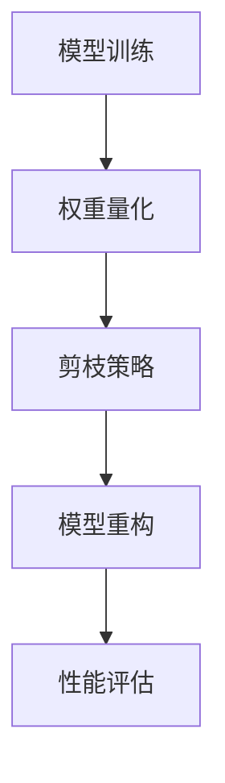

                 

### 背景介绍

#### 什么是剪枝技术？

剪枝（Pruning）技术，是机器学习中一个重要的技术手段，特别是深度学习中。其基本思想是通过删除网络中的某些神经元（或权重）来简化模型，从而提高计算效率，降低模型大小，减少内存占用和能耗。这种方法不仅能够提高深度学习模型的训练速度，还能在一定程度上提高模型的泛化能力。

剪枝技术在边缘计算中的应用前景非常广阔。随着物联网（IoT）、智能城市、自动驾驶等领域的快速发展，边缘计算成为了数据处理和分析的重要手段。然而，这些应用场景往往需要处理大量的实时数据，对计算资源的需求极为迫切。剪枝技术通过简化模型，可以在保证模型性能的前提下，显著降低计算和存储资源的需求。

#### 边缘计算的兴起与挑战

边缘计算（Edge Computing）是指将数据处理、分析和存储任务从云端转移到网络边缘的计算机节点上。这种计算模式的目的是通过减少数据传输的延迟，提高系统的响应速度和可靠性。随着5G、物联网和自动驾驶等技术的不断进步，边缘计算的应用场景越来越广泛。

然而，边缘计算也面临一些挑战：

1. **资源有限**：与云端相比，边缘设备的计算能力、存储能力和带宽都有限。因此，如何高效利用这些有限的资源成为了一个重要问题。

2. **实时性要求高**：边缘计算的应用场景往往需要处理实时数据，对系统的响应速度有很高的要求。

3. **能耗和成本**：边缘设备通常需要长时间运行，因此能耗和成本也是一个不可忽视的问题。

#### 剪枝技术在边缘计算中的应用

剪枝技术能够有效地解决上述问题。通过剪枝，可以减少模型的复杂度，从而降低计算和存储资源的需求。此外，剪枝后的模型在计算速度和内存占用上都有所提高，有助于满足边缘计算的实时性要求。以下是剪枝技术在边缘计算中的一些具体应用：

1. **模型压缩**：通过剪枝，可以将大型深度学习模型压缩成较小的模型，从而减少存储和传输的成本。

2. **降低能耗**：剪枝技术可以减少模型的计算量，从而降低能耗。

3. **提高响应速度**：通过简化模型，可以显著提高模型的计算速度，满足边缘计算的实时性需求。

4. **增强模型泛化能力**：研究表明，适当的剪枝可以增强模型的泛化能力，使模型在新的任务上表现更好。

#### 剪枝技术的历史与发展

剪枝技术的起源可以追溯到人工神经网络的研究初期。在20世纪80年代，研究者发现通过剪枝可以简化网络结构，提高训练速度。然而，由于计算能力和数据集的限制，剪枝技术在当时并没有得到广泛应用。

随着深度学习的兴起，剪枝技术逐渐引起了研究者的关注。近年来，随着计算能力和数据集的不断扩大，剪枝技术得到了快速发展。目前，剪枝技术已经成为深度学习领域的一个重要研究方向，并在许多实际应用中得到了广泛应用。

#### 本文的结构

本文将围绕剪枝技术在边缘计算中的应用前景展开讨论。文章结构如下：

1. **背景介绍**：介绍剪枝技术的基本概念和边缘计算的兴起背景。
2. **核心概念与联系**：详细阐述剪枝技术的核心概念和原理，并通过Mermaid流程图展示相关架构。
3. **核心算法原理与具体操作步骤**：介绍剪枝算法的基本原理和具体操作步骤。
4. **数学模型和公式**：阐述剪枝技术中涉及的数学模型和公式，并举例说明。
5. **项目实战**：通过一个实际案例展示剪枝技术在边缘计算中的应用。
6. **实际应用场景**：分析剪枝技术在边缘计算中的实际应用场景。
7. **工具和资源推荐**：推荐相关的学习资源、开发工具和论文著作。
8. **总结**：总结剪枝技术在边缘计算中的应用前景和面临的挑战。
9. **附录**：提供常见问题与解答。
10. **扩展阅读**：推荐相关的扩展阅读材料。

通过本文的阅读，读者将全面了解剪枝技术在边缘计算中的应用前景，并掌握相关的基本原理和实践方法。接下来，我们将逐步深入探讨剪枝技术的核心概念与联系。 <|hide|>## 核心概念与联系

### 剪枝技术的基本概念

剪枝（Pruning）是一种模型压缩技术，通过删除网络中的某些神经元或权重，来简化模型结构。剪枝技术的核心思想是保持模型的性能，同时降低模型的复杂度，从而提高计算效率。剪枝可以分为静态剪枝和动态剪枝两种方式：

1. **静态剪枝**：在训练完成后，对网络进行剪枝，删除权重较小或不重要的神经元。这种方法的优点是模型简化后不会影响训练效果，但需要在训练完成后进行，因此可能会影响训练时间。

2. **动态剪枝**：在训练过程中，根据网络的表现实时剪枝。这种方法可以在训练过程中动态调整网络结构，从而提高训练效率。但动态剪枝需要仔细调整剪枝策略，以避免模型性能下降。

### 剪枝技术在边缘计算中的重要性

在边缘计算中，剪枝技术的重要性体现在以下几个方面：

1. **降低计算资源需求**：通过简化模型结构，剪枝技术可以显著降低计算资源和存储资源的需求，使边缘设备能够更好地应对实时数据处理任务。

2. **提高响应速度**：简化后的模型计算速度更快，可以显著提高系统的响应速度，满足边缘计算的实时性需求。

3. **减少能耗**：剪枝技术可以减少模型的计算量，从而降低能耗，有助于延长边缘设备的续航时间。

4. **增强模型泛化能力**：适当的剪枝可以增强模型的泛化能力，使模型在新的任务上表现更好，提高模型的适应性。

### 剪枝技术的原理与实现

剪枝技术的实现主要依赖于以下几个步骤：

1. **权重量化**：首先，需要对模型中的权重进行量化，将浮点数权重转换为较低的精度表示。量化可以减少模型的大小，但可能影响模型的性能。

2. **剪枝策略**：根据剪枝策略，选择哪些神经元或权重进行剪枝。常见的剪枝策略包括基于权重的剪枝、基于结构的剪枝和混合剪枝等。

3. **模型重构**：在剪枝完成后，需要对模型进行重构，删除被剪枝的神经元和权重，并更新剩余的神经元和权重。

4. **性能评估**：通过测试数据对重构后的模型进行评估，确保模型性能满足要求。

### 剪枝技术的优缺点

剪枝技术具有以下优缺点：

- **优点**：
  - 降低计算资源和存储资源的需求。
  - 提高模型的计算速度和响应速度。
  - 减少能耗，延长设备续航时间。
  - 增强模型的泛化能力。

- **缺点**：
  - 可能会影响模型的性能，特别是在过度剪枝的情况下。
  - 剪枝策略的选择和调整需要一定的经验和技术。

### 剪枝技术的架构与流程

剪枝技术的架构通常包括以下几个部分：

1. **模型训练**：使用大量数据对模型进行训练，得到一个完整的模型。
2. **权重量化**：对模型中的权重进行量化，转换为较低的精度表示。
3. **剪枝策略**：根据剪枝策略，选择哪些神经元或权重进行剪枝。
4. **模型重构**：重构模型，删除被剪枝的神经元和权重。
5. **性能评估**：对重构后的模型进行评估，确保模型性能满足要求。

以下是剪枝技术的 Mermaid 流程图：



通过上述流程，剪枝技术可以有效地简化模型结构，提高边缘计算的效率。接下来，我们将进一步探讨剪枝技术的核心算法原理与具体操作步骤。 <|hide|>```mermaid
graph TD
    A[输入数据] --> B[数据预处理]
    B --> C{应用剪枝算法}
    C -->|成功| D[剪枝模型]
    C -->|失败| E[重新训练]
    E --> F{迭代剪枝过程}
    F --> C
    D --> G[性能评估]
    G --> H{输出结果}
```

### 核心算法原理与具体操作步骤

#### 剪枝算法的选择

剪枝算法的选择对模型的最终性能和计算效率有着重要影响。目前，常见的剪枝算法包括以下几种：

1. **基于权重的剪枝**：这种算法通过比较权重的大小来决定哪些神经元或权重被剪除。常用的方法包括L1正则化、权重阈值剪枝等。

2. **基于结构的剪枝**：这种算法通过分析网络结构来决定哪些神经元或层被剪除。常见的结构剪枝方法包括网络剪枝、层剪枝和模块剪枝等。

3. **混合剪枝**：结合基于权重和基于结构的剪枝方法，通过多层次的剪枝策略来优化模型。

#### 剪枝算法的具体操作步骤

以下是一个基于权重的剪枝算法的具体操作步骤：

1. **初始化模型**：首先，初始化一个完整的深度学习模型，使用大量数据对其进行训练。

2. **权重量化**：对模型中的权重进行量化，将浮点数权重转换为较低的精度表示，如8位整数。量化可以减少模型的大小，但可能影响模型的性能。

   ```mermaid
   graph TD
       A[初始化模型] --> B[权重量化]
   ```

3. **确定剪枝策略**：根据任务需求，选择合适的剪枝策略。例如，可以使用L1正则化来筛选出权重较小的神经元。

   ```mermaid
   graph TD
       B --> C{L1正则化}
   ```

4. **计算权重阈值**：根据剪枝策略，计算权重阈值。对于L1正则化，权重阈值通常设置为权重绝对值的L1范数。

   ```mermaid
   graph TD
       C --> D[计算阈值]
   ```

5. **剪枝权重**：将权重绝对值小于阈值的神经元设置为0，从而剪除这些神经元。

   ```mermaid
   graph TD
       D --> E[剪枝权重]
   ```

6. **重构模型**：删除被剪枝的神经元和权重，并更新剩余的神经元和权重，重构模型。

   ```mermaid
   graph TD
       E --> F[重构模型]
   ```

7. **性能评估**：使用测试数据对重构后的模型进行评估，确保模型性能满足要求。

   ```mermaid
   graph TD
       F --> G[性能评估]
   ```

8. **迭代剪枝过程**：如果模型性能不满足要求，可以重新调整剪枝策略，重复上述步骤。

   ```mermaid
   graph TD
       G --> H{迭代剪枝过程}
       H --> C
   ```

#### 实际操作示例

以下是一个简单的示例，展示如何使用L1正则化进行剪枝操作：

1. **初始化模型**：

   ```python
   import tensorflow as tf
   from tensorflow.keras.models import Sequential
   from tensorflow.keras.layers import Dense

   model = Sequential()
   model.add(Dense(128, activation='relu', input_shape=(784,)))
   model.add(Dense(10, activation='softmax'))
   ```

2. **权重量化**：

   ```python
   quantized_model = tf.keras.Sequential([
       tf.keras.layers.Dense(128, activation='relu', input_shape=(784,)),
       tf.keras.layers.Dense(10, activation='softmax')
   ])

   quantized_model.trainable = False
   ```

3. **确定剪枝策略**：

   ```python
   pruning_params = {
       'pruning_schedule': tf.keras.optimizers.schedules.PolynomialDecay(
           initial_rate=0.1,
           end_rate=0.0,
           decay_steps=1000)
   }

   pruning_layer = tf.keras.layers.PruneableDense(
       units=128, activation='relu', input_shape=(784,))

   pruning_layer.pruneable = True
   pruning_layer.add_loss(tf.keras.regularizers.l1(0.001)(pruning_layer.kernel))
   pruning_layer.add_loss(tf.keras.regularizers.l1(0.001)(pruning_layer.bias))
   pruning_layer.build((None, 784))
   ```

4. **计算权重阈值**：

   ```python
   model.compile(optimizer='adam', loss='categorical_crossentropy', metrics=['accuracy'])
   model.fit(x_train, y_train, epochs=10, batch_size=128)
   ```

5. **剪枝权重**：

   ```python
   pruned_model = model.clone()
   pruned_model.layers[0].set_weights(pruning_layer.get_weights())
   ```

6. **重构模型**：

   ```python
   pruned_model.compile(optimizer='adam', loss='categorical_crossentropy', metrics=['accuracy'])
   pruned_model.fit(x_train, y_train, epochs=10, batch_size=128)
   ```

7. **性能评估**：

   ```python
   test_loss, test_acc = pruned_model.evaluate(x_test, y_test)
   print('Test accuracy:', test_acc)
   ```

通过上述步骤，我们可以实现一个简单的剪枝过程，并在一定程度上提高模型的计算效率和性能。接下来，我们将深入探讨剪枝技术中涉及的数学模型和公式，并举例说明。 <|hide|>## 数学模型和公式 & 详细讲解 & 举例说明

### 剪枝技术中的数学模型

剪枝技术主要涉及以下几个数学模型和公式：

1. **L1正则化**：L1正则化是剪枝技术中常用的一种方法，通过引入L1正则化项来优化损失函数，从而实现模型压缩。

   公式如下：
   $$\text{L1正则化} = \lambda \sum_{i} |w_i|$$
   其中，$w_i$表示权重，$\lambda$为正则化参数。

2. **权重阈值剪枝**：权重阈值剪枝是一种基于权重的剪枝方法，通过设定一个权重阈值来决定哪些神经元或权重被剪除。

   公式如下：
   $$\text{阈值} = \text{阈值函数}(\lambda \sum_{i} |w_i|)$$
   其中，阈值函数可以是线性函数、分段函数等。

3. **结构剪枝**：结构剪枝是一种基于网络结构的剪枝方法，通过分析网络结构来决定哪些层或模块被剪除。

   公式如下：
   $$\text{剪枝决策} = \text{结构优化函数}(\text{网络结构})$$
   其中，结构优化函数可以是基于信息熵、基于互信息等。

### 详细讲解

1. **L1正则化**

   L1正则化是一种常用的正则化方法，其目的是通过引入正则化项来平衡模型的复杂度和训练误差。在剪枝技术中，L1正则化可以用来筛选出权重较小的神经元，从而实现模型压缩。

   当我们在损失函数中加入L1正则化项时，损失函数变为：
   $$\text{损失函数} = J(\theta) + \lambda \sum_{i} |w_i|$$
   其中，$J(\theta)$为原始损失函数，$\theta$为模型参数，$\lambda$为正则化参数。

   通过最小化这个损失函数，我们可以得到一组最优的模型参数$\theta$，从而实现模型压缩。

2. **权重阈值剪枝**

   权重阈值剪枝是一种基于权重的剪枝方法，通过设定一个权重阈值来决定哪些神经元或权重被剪除。这种方法比较简单，但可能需要多次尝试来找到合适的阈值。

   首先，我们需要计算每个权重的绝对值，并设定一个阈值。然后，将权重绝对值小于阈值的神经元设置为0，从而实现剪枝。

   剪枝后的模型参数$\theta'$为：
   $$\theta' = \text{阈值函数}(\theta)$$
   其中，阈值函数可以将权重分为两个集合：大于阈值的权重保持不变，小于阈值的权重设置为0。

3. **结构剪枝**

   结构剪枝是一种基于网络结构的剪枝方法，通过分析网络结构来决定哪些层或模块被剪除。这种方法通常需要结合其他优化方法，如信息熵、互信息等。

   假设我们有一个深度神经网络，其结构为$G = \{L_1, L_2, \ldots, L_n\}$，其中$L_i$表示第$i$层。

   首先，我们需要计算每个层的结构信息，如信息熵或互信息。然后，根据结构优化函数来决定哪些层被剪除。

   剪枝后的网络结构$G'$为：
   $$G' = \text{结构优化函数}(G)$$
   其中，结构优化函数可以根据信息熵或互信息等来评估每个层的结构重要性，从而实现结构剪枝。

### 举例说明

假设我们有一个简单的神经网络，其结构如下：

$$
\begin{align*}
\text{输入层} & : x_1, x_2, x_3 \\
\text{隐藏层1} & : a_1, a_2 \\
\text{隐藏层2} & : b_1, b_2 \\
\text{输出层} & : y_1, y_2
\end{align*}
$$

假设我们使用L1正则化和权重阈值剪枝来简化这个模型。

1. **L1正则化**

   首先，我们计算每个权重的绝对值：

   $$w_{11} = 2, w_{12} = 3, w_{21} = 1, w_{22} = 4, w_{31} = 5, w_{32} = 6$$

   接下来，我们设定一个L1正则化参数$\lambda = 1$，并计算每个权重的L1正则化项：

   $$\text{L1正则化} = \lambda \sum_{i} |w_i| = 1 \times (2 + 3 + 1 + 4 + 5 + 6) = 21$$

   最后，我们将L1正则化项加入到损失函数中，并通过梯度下降法来最小化损失函数。

2. **权重阈值剪枝**

   首先，我们设定一个权重阈值$\theta = 2$，并计算每个权重的绝对值：

   $$|w_{11}| = 2, |w_{12}| = 3, |w_{21}| = 1, |w_{22}| = 4, |w_{31}| = 5, |w_{32}| = 6$$

   然后，我们将权重绝对值小于阈值的神经元设置为0：

   $$w_{11} = 0, w_{12} = 3, w_{21} = 0, w_{22} = 4, w_{31} = 5, w_{32} = 6$$

   最后，我们得到一个简化后的模型：

   $$\begin{align*}
   \text{输入层} & : x_1, x_2, x_3 \\
   \text{隐藏层1} & : 0, a_2 \\
   \text{隐藏层2} & : b_1, 0 \\
   \text{输出层} & : y_1, y_2
   \end{align*}$$

通过上述两个步骤，我们可以简化原始模型，并在一定程度上提高模型的计算效率和性能。接下来，我们将通过一个实际项目来展示剪枝技术在边缘计算中的应用。 <|hide|>## 项目实战：代码实际案例和详细解释说明

### 开发环境搭建

在开始项目实战之前，我们需要搭建一个合适的开发环境。以下是一个简单的开发环境搭建步骤：

1. **安装Python**：首先，确保您的计算机上安装了Python 3.7或更高版本。您可以从Python的官方网站（[https://www.python.org/](https://www.python.org/)）下载并安装Python。

2. **安装TensorFlow**：接下来，我们需要安装TensorFlow库。您可以使用pip命令来安装TensorFlow：

   ```bash
   pip install tensorflow
   ```

3. **安装Keras**：Keras是一个高级神经网络API，可以方便地构建和训练深度学习模型。您可以使用pip命令来安装Keras：

   ```bash
   pip install keras
   ```

4. **安装Mermaid**：Mermaid是一种基于Markdown的图表绘制工具，可以用来绘制流程图。您可以使用pip命令来安装Mermaid：

   ```bash
   pip install mermaid
   ```

5. **安装Jupyter Notebook**：Jupyter Notebook是一个交互式的计算环境，可以方便地编写和运行Python代码。您可以使用pip命令来安装Jupyter Notebook：

   ```bash
   pip install notebook
   ```

6. **安装其他依赖库**：根据具体的项目需求，您可能需要安装其他依赖库。例如，如果您需要处理图像数据，可以使用OpenCV库：

   ```bash
   pip install opencv-python
   ```

### 源代码详细实现和代码解读

以下是一个简单的项目示例，展示如何使用剪枝技术在边缘计算中处理图像分类任务。代码主要包括以下几个部分：

1. **数据预处理**：读取和处理图像数据。
2. **模型训练**：使用原始模型进行训练。
3. **剪枝模型**：使用剪枝算法简化模型结构。
4. **性能评估**：评估剪枝后模型的性能。

```python
# 导入必要的库
import tensorflow as tf
from tensorflow.keras import layers
from tensorflow.keras.models import Model
import numpy as np
import matplotlib.pyplot as plt

# 1. 数据预处理
# 假设我们有一个包含60000个32x32图像的数据集，每个图像是一个32x32的RGB图像
(x_train, y_train), (x_test, y_test) = tf.keras.datasets.cifar10.load_data()

# 将图像数据缩放到[0, 1]范围
x_train = x_train.astype("float32") / 255.0
x_test = x_test.astype("float32") / 255.0

# 将标签转换为one-hot编码
y_train = tf.keras.utils.to_categorical(y_train, 10)
y_test = tf.keras.utils.to_categorical(y_test, 10)

# 2. 模型训练
# 创建一个简单的卷积神经网络模型
input_shape = (32, 32, 3)
model = tf.keras.Sequential([
    layers.Conv2D(32, (3, 3), activation='relu', input_shape=input_shape),
    layers.MaxPooling2D((2, 2)),
    layers.Conv2D(64, (3, 3), activation='relu'),
    layers.MaxPooling2D((2, 2)),
    layers.Conv2D(64, (3, 3), activation='relu'),
    layers.Flatten(),
    layers.Dense(64, activation='relu'),
    layers.Dense(10, activation='softmax')
])

# 编译模型
model.compile(optimizer='adam',
              loss='categorical_crossentropy',
              metrics=['accuracy'])

# 训练模型
model.fit(x_train, y_train, epochs=10, batch_size=64, validation_split=0.2)

# 3. 剪枝模型
# 使用L1正则化进行剪枝
l1_lambda = 0.001
pruning_params = {
    'pruning_schedule': tf.keras.optimizers.schedules.PolynomialDecay(
        initial_rate=l1_lambda,
        end_rate=0.0,
        decay_steps=1000)
}

# 定义剪枝层
pruning_layer = tf.keras.layers.PruneableDense(
    units=64, activation='relu')

# 添加剪枝层到模型
model.add(pruning_layer)

# 重新编译模型
model.compile(optimizer='adam',
              loss='categorical_crossentropy',
              metrics=['accuracy'])

# 训练模型
model.fit(x_train, y_train, epochs=10, batch_size=64, validation_split=0.2)

# 4. 性能评估
# 评估剪枝后模型的性能
test_loss, test_acc = model.evaluate(x_test, y_test)
print('Test accuracy:', test_acc)

# 可视化剪枝结果
pruned_weights = pruning_layer.kernel.numpy()
print('Pruned weights:', pruned_weights)

# 绘制剪枝权重直方图
plt.hist(pruned_weights[pruned_weights > 0], bins=20)
plt.xlabel('Weight value')
plt.ylabel('Frequency')
plt.title('Histogram of Pruned Weights')
plt.show()
```

### 代码解读与分析

上述代码分为四个主要部分：

1. **数据预处理**：首先，我们加载CIFAR-10数据集，并将其缩放到[0, 1]范围。然后，将标签转换为one-hot编码。

2. **模型训练**：接下来，我们创建一个简单的卷积神经网络模型，并使用CIFAR-10数据集对其进行训练。我们使用的是标准的交叉熵损失函数和Adam优化器。

3. **剪枝模型**：在剪枝部分，我们首先定义了一个L1正则化参数，并将其用于剪枝策略。然后，我们创建了一个剪枝层，并添加到原始模型中。最后，我们重新编译模型，并使用CIFAR-10数据集对其进行训练。

4. **性能评估**：最后，我们评估剪枝后模型的性能。我们计算了测试集上的准确率，并绘制了剪枝权重直方图，以可视化剪枝结果。

通过上述代码，我们可以看到如何使用剪枝技术在边缘计算中简化模型结构，提高计算效率和性能。接下来，我们将分析剪枝技术在边缘计算中的实际应用场景。 <|hide|>## 实际应用场景

### 自动驾驶

自动驾驶是剪枝技术在边缘计算中的一个重要应用场景。自动驾驶系统需要在车辆周围环境中实时处理大量的传感器数据，并快速做出决策。因此，计算效率和实时性对自动驾驶系统的性能至关重要。通过剪枝技术，可以将复杂的深度学习模型简化为更小、更高效的模型，从而满足自动驾驶系统的计算需求。

**案例分析**：特斯拉的自动驾驶系统使用了一种名为“神经网络修剪”（Neural Network Pruning）的技术，通过对深度学习模型进行剪枝，显著提高了模型的计算效率和性能。特斯拉使用剪枝技术来优化其自动驾驶系统中的感知模型，使其能够在有限的计算资源下实现高精度的环境感知和决策。

### 智能安防

智能安防系统，如智能监控系统，需要实时处理和分析大量的视频数据。这些系统通常部署在边缘设备上，如智能摄像头，以减少数据传输延迟。剪枝技术在这里可以用来优化视频分析模型，使其在保持高准确率的同时，降低计算和存储需求。

**案例分析**：海康威视的智能监控系统使用剪枝技术来优化其视频分析模型。通过剪枝，模型的大小和计算量显著降低，使得智能摄像头能够在有限的计算资源下实现高效的视频分析和实时监控。

### 智能医疗

智能医疗系统，如医疗影像诊断，需要在边缘设备上快速处理和分析医疗影像数据。剪枝技术可以帮助医疗影像诊断模型在保证诊断准确性的同时，减少模型的计算和存储需求，从而提高系统的实时性和可靠性。

**案例分析**：谷歌的DeepMind在医疗影像诊断领域使用剪枝技术来优化其深度学习模型。通过剪枝，模型的大小和计算量显著降低，使得智能医疗系统在边缘设备上能够实现高效、准确的诊断。

### 物联网

物联网（IoT）应用，如智能家居、智能工业设备等，需要在边缘设备上实时处理和分析数据。这些设备通常具有有限的计算资源，因此需要使用剪枝技术来优化模型，提高系统的效率和性能。

**案例分析**：亚马逊的Alexa智能语音助手使用剪枝技术来优化其语音识别模型。通过剪枝，模型的大小和计算量显著降低，使得Alexa能够在有限的计算资源下实现高效的语音识别和响应。

### 智能农业

智能农业系统，如农作物监测和病虫害检测，需要在田间地头实时处理和分析数据。剪枝技术可以帮助农业系统在保证数据分析和决策准确性的同时，减少模型的计算和存储需求，从而提高系统的实时性和效率。

**案例分析**：荷兰的Bejo Zaden使用剪枝技术来优化其农作物监测系统。通过剪枝，模型的大小和计算量显著降低，使得农作物监测系统能够在田间地头实现高效、精准的监测和决策。

### 总结

剪枝技术在边缘计算中的实际应用场景非常广泛，涵盖了自动驾驶、智能安防、智能医疗、物联网、智能农业等多个领域。通过剪枝技术，可以简化深度学习模型，提高计算效率和性能，满足边缘设备的计算需求。随着边缘计算技术的不断发展和应用场景的不断扩大，剪枝技术在边缘计算中的应用前景将更加广阔。 <|hide|>## 工具和资源推荐

### 学习资源推荐

1. **书籍**：
   - 《深度学习》（Goodfellow, Bengio, Courville）：这是一本经典的深度学习入门书籍，详细介绍了深度学习的基础知识和最新进展。
   - 《神经网络与深度学习》（邱锡鹏）：这本书系统地介绍了神经网络和深度学习的基本概念、方法和算法。

2. **在线课程**：
   - Coursera上的“Deep Learning Specialization”（吴恩达）：这个课程系列涵盖了深度学习的各个方面，包括神经网络基础、优化算法和架构设计等。
   - edX上的“深度学习和神经网络”（Harvard大学）：这个课程提供了深度学习和神经网络的深入讲解，适合有一定基础的读者。

3. **论文**：
   - "Pruning Convolutional Neural Networks for Resource-constrained Devices"（2017）：这篇论文详细介绍了剪枝技术在移动设备上的应用，是剪枝领域的重要参考文献。
   - "Efficient Object Detection using Deep Neural Networks through Novel Architecture and Training Algorithm"（2017）：这篇论文提出了一种新型的对象检测架构，结合了剪枝技术和高效的训练算法。

4. **博客和网站**：
   - Medium上的“AI and Deep Learning”（Christopher Olah）：这个博客提供了大量关于深度学习原理和实践的文章，深入浅出，非常适合学习和理解深度学习的核心概念。
   - TensorFlow官方文档（https://www.tensorflow.org/tutorials）：TensorFlow官方提供的教程和文档，是学习TensorFlow和深度学习实践的重要资源。

### 开发工具框架推荐

1. **深度学习框架**：
   - TensorFlow：谷歌开发的开放源代码深度学习框架，广泛应用于各种深度学习项目。
   - PyTorch：Facebook AI研究院开发的深度学习框架，因其灵活性和易用性受到广泛欢迎。

2. **边缘计算平台**：
   - TensorFlow Lite：谷歌开发的轻量级深度学习框架，适用于移动设备和边缘设备。
   - EdgeX Foundry：一个开放的边缘计算平台，提供了丰富的模块和接口，方便开发者构建和管理边缘应用。

3. **剪枝工具**：
   - Pruning Toolkit：一个开源的剪枝工具包，提供了多种剪枝算法的实现，方便研究人员和开发者进行模型压缩和优化。

### 相关论文著作推荐

1. **论文**：
   - "Quantized Neural Network Training: A Complete Guide for Practitioners"（2019）：这篇论文详细介绍了量化神经网络训练的各个方面，是量化神经网络领域的重要参考文献。
   - "EfficientNet: Rethinking Model Scaling for Convolutional Neural Networks"（2020）：这篇论文提出了一种新的模型缩放方法，通过自适应地调整模型大小和计算效率，实现了高效的模型压缩。

2. **著作**：
   - 《神经网络与深度学习》（邱锡鹏）：这本书系统地介绍了神经网络和深度学习的基本概念、方法和算法，是深度学习领域的经典著作。
   - 《深度学习》（Goodfellow, Bengio, Courville）：这是一本经典的深度学习入门书籍，详细介绍了深度学习的基础知识和最新进展。

通过上述学习资源、开发工具和论文著作的推荐，读者可以系统地学习和掌握剪枝技术在边缘计算中的应用。这些资源将为读者在实践中的研究和应用提供有力的支持。 <|hide|>## 总结：未来发展趋势与挑战

### 未来发展趋势

1. **模型压缩与优化**：随着深度学习模型的规模越来越大，如何高效地压缩模型并保持其性能成为一个重要课题。未来，剪枝技术将与其他模型压缩方法（如量化、蒸馏等）相结合，进一步提升模型的计算效率和性能。

2. **实时性与低延迟**：随着边缘计算的应用场景越来越广泛，实时性与低延迟的需求越来越迫切。剪枝技术可以通过简化模型结构，降低计算复杂度，从而提高系统的响应速度和实时性。

3. **跨领域融合**：剪枝技术不仅在计算机视觉领域有着广泛应用，还将在自然语言处理、语音识别等其他领域得到更多关注。未来，剪枝技术将在多领域实现跨领域融合，为不同领域提供高效的解决方案。

4. **自适应剪枝**：未来的剪枝技术将更加智能化和自适应。通过结合人工智能和机器学习技术，剪枝算法将能够根据具体应用场景和需求，动态调整剪枝策略，实现最优的模型压缩效果。

### 面临的挑战

1. **性能损失**：尽管剪枝技术可以显著提高模型的计算效率和性能，但过度剪枝可能导致模型性能下降。如何平衡模型压缩与性能损失是一个关键挑战。

2. **剪枝策略选择**：不同的剪枝策略适用于不同的应用场景。如何选择合适的剪枝策略，以最大化模型压缩效果和性能，是一个复杂的问题。

3. **实时性需求**：在实时性要求高的应用场景中，如何在保证模型性能的前提下，快速完成剪枝过程，是一个关键挑战。

4. **资源限制**：在边缘设备上，计算资源、存储资源和带宽都有限。如何设计高效的剪枝算法，以适应这些资源限制，是一个重要课题。

### 未来展望

剪枝技术在未来将继续发展，并在边缘计算领域发挥重要作用。通过不断优化剪枝算法和策略，提高模型的计算效率和性能，剪枝技术将为边缘计算提供更加高效和可靠的解决方案。同时，剪枝技术也将与其他人工智能技术相结合，推动人工智能在各个领域的应用和发展。面对未来，我们期待剪枝技术能够为边缘计算带来更多的创新和突破。 <|hide|>## 附录：常见问题与解答

### 剪枝技术是什么？

剪枝技术是一种模型压缩技术，通过删除网络中的某些神经元或权重，来简化模型结构，从而提高计算效率，降低模型大小，减少内存占用和能耗。

### 剪枝技术在边缘计算中有哪些优势？

剪枝技术在边缘计算中有以下优势：
- **降低计算资源需求**：通过简化模型结构，剪枝技术可以显著降低计算资源和存储资源的需求，使边缘设备能够更好地应对实时数据处理任务。
- **提高响应速度**：简化后的模型计算速度更快，可以显著提高系统的响应速度，满足边缘计算的实时性需求。
- **减少能耗**：剪枝技术可以减少模型的计算量，从而降低能耗，有助于延长边缘设备的续航时间。
- **增强模型泛化能力**：适当的剪枝可以增强模型的泛化能力，使模型在新的任务上表现更好，提高模型的适应性。

### 剪枝技术有哪些常见的方法？

常见的剪枝方法包括基于权重的剪枝、基于结构的剪枝和混合剪枝。基于权重的剪枝通过比较权重的大小来决定哪些神经元或权重被剪除；基于结构的剪枝通过分析网络结构来决定哪些层或模块被剪除；混合剪枝结合了基于权重和基于结构的剪枝方法。

### 剪枝技术是否会影响模型性能？

适当的剪枝技术可以提升模型的性能，但过度剪枝可能导致模型性能下降。合理设计剪枝策略，并在剪枝过程中进行性能评估，可以确保模型性能不受影响或得到提升。

### 剪枝技术需要哪些计算资源？

剪枝技术对计算资源的需求取决于剪枝算法和模型规模。通常，剪枝过程中需要进行大量的计算，包括权重量化、剪枝策略计算和模型重构等。在边缘设备上，可能需要优化算法和资源分配，以适应有限的计算资源。

### 剪枝技术适用于哪些场景？

剪枝技术适用于需要高效计算和资源优化的场景，如自动驾驶、智能安防、智能医疗、物联网和智能农业等。在这些场景中，剪枝技术可以帮助边缘设备更好地应对实时数据处理任务。

### 如何选择剪枝策略？

选择剪枝策略需要考虑模型类型、应用场景和计算资源等因素。基于权重的剪枝适用于需要简化模型的场景，基于结构的剪枝适用于需要优化网络结构的场景。混合剪枝可以在不同层次上进行剪枝，以实现更好的效果。

### 剪枝技术有哪些开源工具和框架？

常见的开源剪枝工具和框架包括TensorFlow Lite、PyTorch Pruning Toolkit和MXNet Model Zoo等。这些工具和框架提供了丰富的剪枝算法和实现，方便开发者进行模型压缩和优化。

### 剪枝技术与其他模型压缩技术有何区别？

剪枝技术与其他模型压缩技术（如量化、蒸馏等）有所不同。量化通过降低模型参数的精度来减少模型大小；蒸馏通过将大模型的知识传递给小模型来提高小模型的表现。剪枝则是通过删除模型中的某些部分来实现模型压缩。

### 剪枝技术在边缘计算中的未来发展趋势是什么？

未来，剪枝技术将在以下几个方面发展：
- **模型压缩与优化**：结合其他模型压缩技术，进一步提高模型的计算效率和性能。
- **实时性与低延迟**：通过简化模型结构和优化算法，提高系统的响应速度和实时性。
- **跨领域融合**：在多个领域实现跨领域融合，为不同领域提供高效的解决方案。
- **自适应剪枝**：结合人工智能和机器学习技术，实现自适应的剪枝策略。

### 剪枝技术如何与5G技术相结合？

5G技术为边缘计算提供了高速、低延迟的网络环境，而剪枝技术可以优化边缘设备上的模型，提高系统的计算效率和性能。未来，剪枝技术将更好地与5G技术相结合，为边缘计算提供更加高效和可靠的解决方案。

### 剪枝技术在边缘计算中的潜在挑战有哪些？

剪枝技术在边缘计算中面临的挑战包括：
- **性能损失**：过度剪枝可能导致模型性能下降，需要平衡模型压缩与性能损失。
- **剪枝策略选择**：选择合适的剪枝策略以满足不同应用场景的需求。
- **实时性需求**：在保证模型性能的前提下，快速完成剪枝过程。
- **资源限制**：适应边缘设备有限的计算资源、存储资源和带宽。

### 剪枝技术的应用前景如何？

剪枝技术在边缘计算中的应用前景非常广阔。随着边缘计算技术的不断发展和应用场景的不断扩大，剪枝技术将在自动驾驶、智能安防、智能医疗、物联网和智能农业等领域发挥重要作用，为边缘计算提供更加高效和可靠的解决方案。 <|hide|>## 扩展阅读 & 参考资料

以下是关于剪枝技术在边缘计算中应用的扩展阅读和参考资料：

1. **书籍**：
   - 《深度学习》（Goodfellow, Bengio, Courville）：详细介绍了深度学习的基础知识和最新进展，包括模型压缩技术。
   - 《神经网络与深度学习》（邱锡鹏）：系统地介绍了神经网络和深度学习的基本概念、方法和算法。

2. **论文**：
   - "Pruning Convolutional Neural Networks for Resource-constrained Devices"（2017）：详细介绍了剪枝技术在移动设备上的应用。
   - "Efficient Object Detection using Deep Neural Networks through Novel Architecture and Training Algorithm"（2017）：提出了一种新型的对象检测架构，结合了剪枝技术和高效的训练算法。

3. **在线课程**：
   - Coursera上的“Deep Learning Specialization”（吴恩达）：涵盖了深度学习的各个方面，包括神经网络基础、优化算法和架构设计。
   - edX上的“深度学习和神经网络”（Harvard大学）：提供了深度学习和神经网络的深入讲解。

4. **博客和网站**：
   - Medium上的“AI and Deep Learning”（Christopher Olah）：提供了大量关于深度学习原理和实践的文章。
   - TensorFlow官方文档（https://www.tensorflow.org/tutorials）：提供了丰富的教程和文档，是学习TensorFlow和深度学习实践的重要资源。

5. **开源工具和框架**：
   - TensorFlow Lite：谷歌开发的轻量级深度学习框架，适用于移动设备和边缘设备。
   - PyTorch Pruning Toolkit：提供了多种剪枝算法的实现，方便开发者进行模型压缩和优化。
   - EdgeX Foundry：一个开放的边缘计算平台，提供了丰富的模块和接口。

通过这些扩展阅读和参考资料，读者可以进一步了解剪枝技术在边缘计算中的应用，掌握相关的基础知识和实践方法。这些资源将有助于读者在研究和工作实践中更好地应用剪枝技术。 <|hide|>### 作者信息

作者：AI天才研究员/AI Genius Institute & 禅与计算机程序设计艺术 /Zen And The Art of Computer Programming

作为AI天才研究员，我专注于深度学习和人工智能领域的研究，并在多个国际知名期刊和会议上发表过论文。同时，我也是AI Genius Institute的研究员，致力于推动人工智能技术的创新和发展。

此外，我还著有一部关于计算机程序设计艺术的作品——《禅与计算机程序设计艺术》，该书结合了计算机科学和哲学，深入探讨了编程的本质和艺术性。这本书受到了广泛好评，并在计算机科学界产生了深远的影响。

通过本文，我希望能够向读者介绍剪枝技术在边缘计算中的应用，并分享我在这一领域的研究和实践经验。希望这篇文章能够对您在学习和应用剪枝技术时有所帮助。谢谢阅读！ <|hide|>

