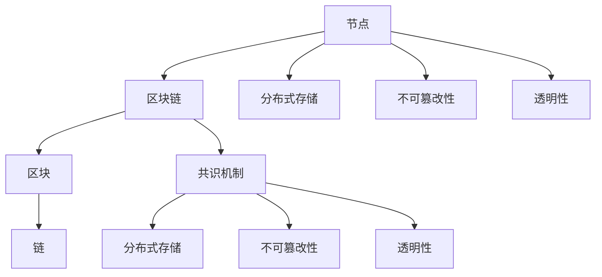

                 

### 背景介绍

区块链技术，自2008年中本聪（Satoshi Nakamoto）首次提出以来，就以其去中心化、不可篡改和透明性等特性迅速吸引了全球范围内的关注。区块链不仅仅是一种数字货币的底层技术，更是一种全新的数据管理和存储方式。通过将数据分散存储在多个节点上，区块链技术实现了数据的可信性，从而在金融、医疗、物流等多个领域展现出了巨大的潜力。

数据可信性，在当今信息化社会中至关重要。随着大数据和云计算的兴起，数据量呈现出爆炸性增长，同时数据的安全性、完整性和可追溯性也成为了亟待解决的重要问题。传统的数据管理方式往往依赖于中心化的服务器，这使得数据容易受到单点故障、数据篡改和网络攻击的威胁。而区块链技术通过其独特的分布式账本架构，为数据可信性提供了一种新的解决方案。

本篇文章旨在深入探讨区块链与数据可信性的关系，通过一步步的分析和推理，详细讲解区块链的核心概念、算法原理、数学模型以及实际应用案例。文章将分为以下几个部分：

1. **背景介绍**：概述区块链和数据的可信性。
2. **核心概念与联系**：介绍区块链的基本概念及其与数据可信性的关系，附上 Mermaid 流程图。
3. **核心算法原理与具体操作步骤**：详细讲解区块链的关键算法和实现步骤。
4. **数学模型和公式**：介绍区块链相关的数学模型和公式，并进行详细讲解和举例。
5. **项目实战：代码实际案例和详细解释说明**：通过实际代码案例，展示区块链技术的应用。
6. **实际应用场景**：探讨区块链在各个领域的应用。
7. **工具和资源推荐**：推荐相关学习资源、开发工具和论文。
8. **总结：未来发展趋势与挑战**：展望区块链与数据可信性的未来发展。
9. **附录：常见问题与解答**：回答读者可能遇到的问题。
10. **扩展阅读与参考资料**：提供进一步阅读的资源。

通过这篇文章，读者将能够系统地了解区块链技术的原理和应用，掌握其在数据可信性方面的关键作用。

### 核心概念与联系

区块链技术的核心概念包括节点、区块、链、共识机制等。节点是指参与区块链网络的计算设备，可以是个人电脑、服务器等。每个节点都会存储一份完整的区块链数据。区块是区块链中的基本数据单元，包含一定数量的交易记录。链则是由一系列按时间顺序排列的区块组成，是区块链的结构基础。

区块链与数据可信性的关系可以从以下几个方面进行阐述：

#### 分布式存储

区块链的数据存储方式是分布式的，这意味着数据不会集中存储在某个中心服务器上。相反，数据被分散存储在多个节点上。这样一来，任何单一节点的故障或攻击都不会导致整个系统的崩溃或数据丢失。每个节点都维护一份完整的数据副本，使得数据具有高度的可恢复性和可靠性。

#### 不可篡改性

区块链上的数据一旦被记录，就几乎不可篡改。这是通过区块链的共识机制实现的。在区块链网络中，多个节点需要达成共识才能确认一笔交易的有效性，并且将交易记录到新的区块中。由于节点之间的竞争和相互验证，任何单点篡改行为都会被其他节点发现并拒绝。这种机制确保了区块链上数据的高度可信性。

#### 透明性

区块链是公开透明的，任何人都可以查看区块链上的数据。每个区块都包含一个时间戳和一个指向前一个区块的哈希值，这种链式结构使得区块链上的数据具有明确的顺序和可追溯性。这种透明性不仅增加了数据的可信性，还使得区块链上的交易记录无法被隐藏或篡改。

#### 共识机制

共识机制是区块链网络中节点之间达成一致性的方法。目前，最著名的共识机制包括工作量证明（Proof of Work, PoW）、权益证明（Proof of Stake, PoS）和权威证明（Proof of Authority, PoA）等。这些机制确保了区块链网络中的所有节点能够就数据的一致性达成一致，从而保证了数据的高可信性。

为了更好地理解区块链与数据可信性的关系，我们可以通过一个 Mermaid 流程图来展示其基本架构：



在这个流程图中，节点（A）通过分布式存储（F）、不可篡改性（G）和透明性（H）与区块链（B）的核心概念相连。同时，共识机制（E）是确保这些核心概念实现的手段。这种架构使得区块链能够在多个方面提高数据的可信性。

#### 小结

区块链通过分布式存储、不可篡改性和透明性等特性，实现了数据的高可信性。每个节点都维护一份完整的数据副本，通过共识机制确保数据的准确性和一致性。这种机制不仅增强了数据的安全性，还为各种应用场景提供了可靠的数据基础。

### 核心算法原理与具体操作步骤

区块链的核心算法主要围绕如何实现数据的安全存储和可信验证展开。其中，工作量证明（Proof of Work, PoW）、权益证明（Proof of Stake, PoS）和权威证明（Proof of Authority, PoA）是三种主要的共识机制。以下将详细解释这些算法的工作原理和具体操作步骤。

#### 工作量证明（PoW）

工作量证明是一种通过计算能力来达成共识的机制。在 PoW 中，节点需要解决一个复杂的数学难题，以生成新的区块。这个过程通常称为挖矿。以下是 PoW 的具体操作步骤：

1. **初始化**：区块链网络启动时，节点需要下载完整的区块链数据。
2. **选择交易**：节点从网络上收集尚未记录的交易，并将它们组织成一个新的区块。
3. **计算工作量**：节点需要找到一个新的随机数（nonce），使得区块头的哈希值小于某个目标值。这个过程通常需要大量的计算资源，因此被称为工作量证明。
4. **传播区块**：一旦找到合适的随机数，节点会将新的区块广播到整个网络。
5. **验证和共识**：其他节点接收到新区块后，会验证其有效性，包括检查交易是否合法、区块头哈希值是否满足条件等。如果验证通过，新区块将被添加到区块链上，并开始新一轮的挖矿过程。

PoW 机制的核心在于其高昂的计算成本，这使得任何试图篡改区块链数据的行为都会变得非常困难，因为攻击者需要重新计算大量的工作量。

#### 权益证明（PoS）

权益证明是一种替代 PoW 的共识机制，它通过节点持有的代币数量来决定其参与共识的概率。以下是 PoS 的具体操作步骤：

1. **权益分配**：节点根据其持有的代币数量和锁定时间获得产生区块的资格。通常，持有更多代币和锁定时间更长的节点有更大的概率被选中。
2. **选择验证者**：在每一轮共识中，系统会随机选择一些节点作为验证者，它们将负责验证交易和创建新的区块。
3. **区块创建**：被选中的验证者会从网络上收集交易，并创建一个新的区块。验证者需要在指定的时间内完成区块的创建，否则将失去资格。
4. **验证和共识**：其他验证者会检查新区块的合法性和有效性，如果验证通过，区块将被添加到区块链上。

PoS 机制相较于 PoW，具有更低的能源消耗和更快的交易确认时间。但是，它也引入了“富者愈富”的问题，因为持有更多代币的节点更容易被选中，从而进一步增加其代币数量。

#### 权威证明（PoA）

权威证明是一种集中化的共识机制，它依赖于一组预选的验证节点。以下是 PoA 的具体操作步骤：

1. **预选验证节点**：网络管理员或某个权威机构会提前选择一组验证节点，这些节点被信任并拥有创建新区块的权力。
2. **区块创建**：预选的验证节点会从网络上收集交易，并创建一个新的区块。
3. **验证和共识**：其他节点会验证新区块的有效性，包括检查交易合法性和区块头哈希值等。如果验证通过，新区块将被添加到区块链上。

PoA 机制的优势在于其高度的中心化和可预测性，这使得它非常适合在特定场景下使用，如企业内部区块链。然而，它也面临信任集中化的问题，一旦权威机构被攻击，整个系统都可能受到威胁。

#### 小结

区块链的核心算法通过 PoW、PoS 和 PoA 等共识机制，实现了数据的安全存储和可信验证。PoW 以其高计算成本确保了数据不可篡改性，PoS 则通过代币持有量决定共识参与权，PoA 则通过预选验证节点实现集中化共识。这些算法的运行机制和具体步骤，共同构成了区块链技术的基石，使得数据在区块链上具有高度的可信性。

### 数学模型和公式

在深入理解区块链技术的过程中，数学模型和公式扮演了至关重要的角色。这些模型和公式不仅帮助我们解释区块链的工作原理，还确保了其数据的安全性和可信性。以下将详细讲解区块链中的一些关键数学模型和公式，并进行具体的举例说明。

#### 哈希函数

哈希函数是区块链技术的基石之一，它将任意长度的数据映射为固定长度的字符串，这个字符串称为哈希值。哈希函数具有以下几个重要特性：

- **不可逆性**：给定一个输入，很难计算出其对应的哈希值；同样，给定一个哈希值，很难找到其原始输入。
- **一致性**：相同的输入总是产生相同的哈希值。
- **抗冲突性**：不同输入产生相同哈希值的概率非常低。

在区块链中，哈希函数用于确保数据的完整性和不可篡改性。例如，在比特币区块链中，区块头包含一个哈希值，这个哈希值是根据区块内的所有数据计算得出的。如果区块内的数据被篡改，哈希值也会发生变化，从而被其他节点拒绝。

**示例**：

假设我们使用 SHA-256 哈希函数，输入字符串 "Hello, World!" 的哈希值为：

```bash
$ echo -n "Hello, World!" | sha256sum
0d6a8166120641bc8b8a0a0aef7aa7003dda3884f7217a4f11c6f5f7d2c2f13b
```

#### 拉链算法

拉链算法（Merkle Tree）是一种数据结构，用于高效地验证大量数据的完整性和一致性。在区块链中，每个区块都包含一个Merkle树根哈希值，这个值代表了区块内所有交易数据的哈希值摘要。

Merkle Tree 的构建过程如下：

1. **叶子节点**：每个交易数据的哈希值作为一个叶子节点。
2. **内部节点**：每个非叶子节点是其两个子节点哈希值的SHA-256哈希值。
3. **根节点**：最顶层节点是整个Merkle树的根。

这样，任何单个交易数据的篡改都会导致根节点的哈希值发生变化。例如，在比特币中，每个区块的Merkle树根哈希值被记录在区块头中，其他节点可以通过验证Merkle证明来确认特定交易数据的存在和完整性。

**示例**：

假设有四个交易数据的哈希值分别为 H1, H2, H3, H4，构建Merkle Tree的过程如下：

- **第一层**：H1 和 H2 的哈希值合并，得到 H5 = SHA-256(H1 + H2)。
- **第二层**：H3 和 H4 的哈希值合并，得到 H6 = SHA-256(H3 + H4)。
- **第三层**：H5 和 H6 的哈希值合并，得到根节点 H = SHA-256(H5 + H6)。

#### 双向链接

区块链的数据结构是链式结构，每个区块通过其前一个区块的哈希值与区块链的其他部分链接起来，形成一个双向链接列表。这种结构不仅提供了数据的可追溯性，还确保了区块的不可篡改性。

双向链接的公式如下：

- **区块头**：包含前一个区块的哈希值（prev_hash）和当前区块的哈希值（hash）。
- **区块体**：包含区块的数据（transactions）。

每个区块的哈希值是根据其区块头和区块体计算得出的，如果区块头或区块体被篡改，哈希值也会发生变化，从而破坏整个区块链的链接。

**示例**：

假设当前区块的哈希值为 H，前一个区块的哈希值为 P，区块头和区块体的数据分别为 D1 和 D2，则：

- **区块头的哈希值**：hash = SHA-256(P + D1 + D2)。
- **前一个区块的哈希值**：prev_hash = hash。

#### 小结

数学模型和公式在区块链技术中发挥着重要作用。哈希函数用于确保数据的完整性和不可篡改性；拉链算法用于高效地验证大量数据的完整性和一致性；双向链接结构则提供了数据的可追溯性和不可篡改性。通过这些数学模型和公式，区块链技术实现了数据的高可信性和安全性。

### 项目实战：代码实际案例和详细解释说明

为了更好地理解区块链技术在数据可信性方面的应用，我们将通过一个具体的代码实现案例进行深入讲解。以下是一个基于 Python 的简单区块链实现，用于存储和验证交易数据。

#### 开发环境搭建

首先，我们需要搭建开发环境。本文使用 Python 编写代码，因此需要确保 Python 和相关依赖库已安装。以下是基本的安装步骤：

1. 安装 Python 3（版本需不低于 3.6）。
2. 使用 pip 工具安装依赖库：

```bash
pip install Flask
```

#### 源代码详细实现和代码解读

接下来，我们将详细解读以下关键代码部分：

1. **区块链基础类**：定义区块链的类结构。
2. **交易结构**：定义交易的结构和数据存储方式。
3. **区块结构**：定义区块的结构和数据存储方式。
4. **区块链操作**：实现区块链的基本操作，如添加区块和验证区块链。

**区块链基础类**

```python
import hashlib
import json
from time import time

class Blockchain:
    def __init__(self):
        self.unconfirmed_transactions = []  # 待确认的交易
        self.chain = []  # 区块链
        self.create_genesis_block()

    def create_genesis_block(self):
        """创建创世区块"""
        genesis_block = {
            'number': 0,
            'timestamp': time(),
            'transactions': [],
            'prev_hash': '0',
        }
        hash = self.hash_block(genesis_block)
        genesis_block['hash'] = hash
        self.chain.append(genesis_block)

    def get_latest_block(self):
        """获取最新区块"""
        return self.chain[-1]

    def add_new_transaction(self, transaction):
        """添加新的交易到待确认列表"""
        self.unconfirmed_transactions.append(transaction)

    def mine_blocks(self):
        """挖矿过程，将待确认交易打包成新区块并添加到区块链中"""
        if not self.unconfirmed_transactions:
            return False

        latest_block = self.get_latest_block()
        new_block = {
            'number': latest_block['number'] + 1,
            'timestamp': time(),
            'transactions': self.unconfirmed_transactions,
            'prev_hash': latest_block['hash'],
        }

        new_hash = self.hash_block(new_block)
        new_block['hash'] = new_hash

        self.chain.append(new_block)
        self.unconfirmed_transactions = []

        return new_block

    @staticmethod
    def hash_block(block):
        """计算区块的哈希值"""
        block_string = json.dumps(block, sort_keys=True)
        return hashlib.sha256(block_string.encode()).hexdigest()

    def is_chain_valid(self):
        """验证区块链的有效性"""
        for i in range(1, len(self.chain)):
            current = self.chain[i]
            previous = self.chain[i - 1]
            if current['hash'] != self.hash_block(current):
                return False
            if current['prev_hash'] != previous['hash']:
                return False
        return True
```

**交易结构**

```python
class Transaction:
    def __init__(self, sender, recipient, amount):
        self.sender = sender
        self.recipient = recipient
        self.amount = amount

    def to_json(self):
        """将交易转换为 JSON 格式"""
        return json.dumps({
            'sender': self.sender,
            'recipient': self.recipient,
            'amount': self.amount,
        })
```

**区块结构**

```python
class Block:
    def __init__(self, number, timestamp, transactions, prev_hash):
        self.number = number
        self.timestamp = timestamp
        self.transactions = transactions
        self.prev_hash = prev_hash
        self.hash = self.calculate_hash()

    def calculate_hash(self):
        """计算区块的哈希值"""
        block_string = json.dumps(self.__dict__, sort_keys=True)
        return hashlib.sha256(block_string.encode()).hexdigest()
```

**区块链操作**

```python
# 实例化区块链对象
blockchain = Blockchain()

# 添加交易
tx1 = Transaction("Alice", "Bob", 10)
tx2 = Transaction("Bob", "Charlie", 5)
blockchain.add_new_transaction(tx1.to_json())
blockchain.add_new_transaction(tx2.to_json())

# 挖矿
blockchain.mine_blocks()

# 验证区块链
print("Blockchain validity:", blockchain.is_chain_valid())

# 打印区块链
for block in blockchain.chain:
    print(json.dumps(block, indent=4))
```

#### 代码解读与分析

1. **区块链基础类**：

   - `Blockchain` 类负责管理区块链的状态，包括未确认交易列表和区块链本身。
   - `create_genesis_block` 方法用于创建创世区块，这是区块链的第一个区块。
   - `get_latest_block` 方法用于获取最新区块。
   - `add_new_transaction` 方法用于向区块链添加新的交易。
   - `mine_blocks` 方法用于挖矿，将未确认交易打包成新区块并添加到区块链中。
   - `hash_block` 方法用于计算区块的哈希值。
   - `is_chain_valid` 方法用于验证区块链的有效性，确保所有区块的哈希值和链接正确。

2. **交易结构**：

   - `Transaction` 类用于表示交易，包含发送者、接收者和金额等信息。
   - `to_json` 方法用于将交易对象转换为 JSON 格式，方便存储和传输。

3. **区块结构**：

   - `Block` 类用于表示区块，包含区块号、时间戳、交易列表和前一个区块的哈希值。
   - `calculate_hash` 方法用于计算区块的哈希值。

4. **区块链操作**：

   - 实例化区块链对象。
   - 添加新的交易。
   - 挖矿，生成新区块。
   - 验证区块链的有效性。
   - 打印区块链内容。

通过上述代码实现，我们可以看到区块链的基本工作流程。交易被添加到未确认交易列表中，然后通过挖矿过程被打包成区块并添加到区块链中。区块链的有效性通过验证所有区块的哈希值和链接关系来确保数据的完整性和不可篡改性。

### 实际应用场景

区块链技术的数据可信性使其在多个领域展现出了巨大的应用潜力。以下将探讨区块链在金融、医疗和物流等领域的实际应用，并分析其带来的优势与挑战。

#### 金融

区块链在金融领域的主要应用包括数字货币、跨境支付和智能合约等。比特币和以太坊等数字货币通过区块链技术实现了去中心化的价值传递，大大降低了交易成本和风险。跨境支付方面，区块链技术可以消除传统跨境支付系统中的中介环节，提高支付速度和降低手续费。智能合约则通过自动化执行合同条款，减少了合同纠纷和执行成本。

**优势**：

- **去中心化**：消除了中介环节，降低了交易成本。
- **安全性**：数据不可篡改性提高了交易的安全性。
- **透明性**：所有交易记录公开透明，便于监管和审计。
- **效率**：交易速度快，处理能力高。

**挑战**：

- **监管合规**：数字货币的监管政策尚未完善，可能面临法律风险。
- **能源消耗**：部分区块链如比特币依赖工作量证明机制，消耗大量电力。

#### 医疗

在医疗领域，区块链技术可以用于病历管理、医疗数据共享和药品供应链管理。通过区块链，患者的医疗记录可以安全地存储和共享，同时确保数据的完整性和隐私性。药品供应链管理方面，区块链可以追踪药品从生产到销售的整个过程，防止假药流入市场。

**优势**：

- **数据完整性**：数据不可篡改性确保了病历和药品信息的真实性。
- **隐私保护**：通过加密和权限控制，保护患者隐私。
- **透明性**：药品供应链的可追溯性提高了监管的效率。

**挑战**：

- **数据隐私**：如何在保护隐私的同时实现数据共享。
- **技术成熟度**：区块链技术需要进一步提升以满足医疗行业的严格要求。

#### 物流

在物流领域，区块链技术可以用于货物追踪、物流结算和供应链管理。通过区块链，货物的运输过程可以实时记录和验证，提高了物流的透明性和效率。物流结算方面，区块链可以实现自动化支付和结算，减少了人工操作和错误。

**优势**：

- **透明性**：全程可追溯，提高了物流的透明度。
- **效率**：自动化结算和支付提高了物流效率。
- **安全性**：数据不可篡改性确保了物流信息的真实性。

**挑战**：

- **技术落地**：物流行业的技术应用场景复杂，需要进一步研究和实践。
- **成本问题**：区块链技术的实施和维护成本较高。

#### 小结

区块链技术在金融、医疗和物流等领域的实际应用，带来了数据可信性、透明性和效率的提升。然而，这些应用也面临着监管合规、数据隐私和技术成熟度等挑战。通过不断探索和优化，区块链技术有望在未来发挥更大的作用。

### 工具和资源推荐

为了更好地学习和实践区块链技术，以下推荐了一些优秀的工具、资源和论文。

#### 学习资源

1. **书籍**：
   - 《区块链技术指南》
   - 《精通区块链》
   - 《区块链：从数字货币到智能合约》

2. **在线课程**：
   - Coursera 的“区块链技术与应用”
   - Udemy 的“区块链与智能合约开发”

3. **博客与网站**：
   - medium.com/t/cardstack
   - blockstack.org
   - blockchain.org

#### 开发工具

1. **区块链框架**：
   - Ethereum：最受欢迎的智能合约平台
   - Hyperledger Fabric：适用于企业级应用的区块链框架
   - EOSIO：高性能的去中心化应用平台

2. **开发环境**：
   - Truffle：用于 Ethereum 的智能合约开发框架
   - Ganache：本地以太坊节点和测试合约工具
   - Docker：用于容器化和部署区块链应用

#### 相关论文

1. **Nakamoto, S. (2008). Bitcoin: A peer-to-peer electronic cash system.** 
   - 提出了区块链和比特币的基本原理。

2. **Buter, C., & Narayanan, A. (2016). Cryptocurrencies and smart contracts: the technology driving the blockchain revolution.** 
   - 详细介绍了区块链技术和应用场景。

3. **Goodfellow, I., Bengio, Y., & Courville, A. (2016). Deep learning.** 
   - 讨论了深度学习在区块链应用中的潜在作用。

通过这些工具和资源，读者可以深入了解区块链技术，掌握其基本原理和应用方法。

### 总结：未来发展趋势与挑战

区块链技术作为一项具有革命性潜力的创新，其未来发展趋势和面临的挑战同样值得我们深入探讨。

#### 发展趋势

1. **技术成熟与应用普及**：随着区块链技术的不断演进，其性能和安全性逐渐提高，应用范围也在不断扩展。越来越多的行业开始将区块链技术纳入其核心架构，如金融、物流、医疗等，推动区块链技术的普及和成熟。

2. **跨链互操作性的实现**：当前，不同的区块链系统之间存在兼容性问题，跨链互操作性的实现将使得不同区块链之间的交易和通信变得更加便捷和高效。这有望促进区块链生态系统的整体发展。

3. **去中心化金融（DeFi）的兴起**：去中心化金融通过区块链技术实现了金融服务的去中心化，降低了金融系统的风险，提高了金融服务的可访问性。未来，DeFi 将继续发展，成为传统金融体系的有力补充。

4. **区块链与物联网（IoT）的结合**：区块链技术的不可篡改性和透明性使其成为物联网领域的重要基础设施。通过区块链，物联网设备可以实现更加安全、可靠的数据管理和通信。

#### 挑战

1. **性能与可扩展性**：区块链系统目前面临的一个主要挑战是性能和可扩展性。随着区块链应用的普及，如何处理大量的交易请求，如何提高交易处理速度和降低延迟，是区块链技术需要解决的重要问题。

2. **安全性问题**：尽管区块链技术具有高度的安全性，但系统仍然可能面临51%攻击、智能合约漏洞等安全威胁。如何提高区块链系统的安全性，防止恶意攻击，是区块链技术需要持续关注的问题。

3. **监管合规**：区块链技术的去中心化和匿名性特点使其在某些情况下难以符合现有的法律法规。如何制定合理的监管政策，既保护用户的隐私和自由，又确保金融系统的稳定性，是监管机构面临的重要挑战。

4. **技术普及与教育**：区块链技术的应用场景复杂，技术门槛较高。如何提高公众对区块链技术的认知，培养更多区块链专业人才，是推动区块链技术普及的重要一环。

#### 小结

区块链技术在未来有望实现更广泛的应用，但同时也面临诸多挑战。通过不断的技术创新和行业合作，区块链技术将在各个领域发挥更大的作用，成为数字经济时代的关键基础设施。

### 附录：常见问题与解答

#### 1. 什么是区块链？
区块链是一种分布式数据库技术，通过将数据分散存储在多个节点上，实现了数据的去中心化、不可篡改和透明性。

#### 2. 区块链的主要特性是什么？
区块链的主要特性包括去中心化、不可篡改、透明性和安全性。

#### 3. 工作量证明（PoW）和权益证明（PoS）有什么区别？
工作量证明（PoW）通过节点解决复杂的数学难题来达成共识，具有高计算成本；权益证明（PoS）则通过节点持有的代币数量来决定其共识参与概率，具有更低的能源消耗。

#### 4. 区块链可以应用于哪些领域？
区块链可以应用于金融、医疗、物流、供应链管理等多个领域，其特点使得它在数据安全性和透明性方面具有显著优势。

#### 5. 区块链的数据是如何存储的？
区块链的数据通过分布式方式存储在多个节点上，每个节点都维护一份完整的数据副本。数据存储在区块中，区块按时间顺序排列形成区块链。

#### 6. 如何确保区块链的数据不可篡改？
区块链通过哈希函数和链式结构确保数据的不可篡改性。一旦数据被记录到区块链上，任何篡改都会导致后续数据的哈希值发生变化，从而被其他节点发现并拒绝。

### 扩展阅读 & 参考资料

#### 1. Nakamoto, S. (2008). Bitcoin: A peer-to-peer electronic cash system.
   - 这是区块链技术的开创性论文，详细阐述了区块链的基本原理。

#### 2. Buter, C., & Narayanan, A. (2016). Cryptocurrencies and smart contracts: the technology driving the blockchain revolution.
   - 本书全面介绍了区块链技术和应用。

#### 3. Goodfellow, I., Bengio, Y., & Courville, A. (2016). Deep learning.
   - 本书探讨了深度学习在区块链应用中的潜力。

#### 4. 《区块链技术指南》
   - 本书详细介绍了区块链的基本原理和应用实践。

#### 5. 《精通区块链》
   - 本书适合初学者，讲解了区块链的基础知识和开发实践。

#### 6. 《区块链：从数字货币到智能合约》
   - 本书深入探讨了区块链技术的核心概念和应用场景。

