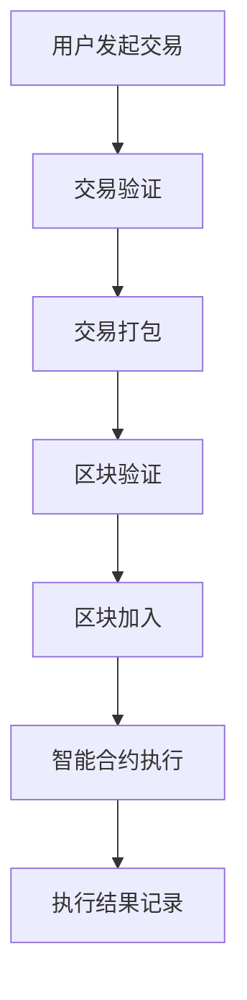

                 

### 1. 背景介绍

区块链技术，作为一项革命性的创新，已经逐渐渗透到各个行业，从金融到供应链，从医疗到物联网。随着区块链技术的发展，越来越多的创业者开始探索如何利用这项技术来实现业务自动化，提高效率，降低成本，并创造新的商业模式。本文将重点探讨区块链技术如何助力自动化创业，以及创业者如何利用区块链实现自动化业务流程。

区块链，本质上是一个去中心化的数据库，由多个参与者共同维护。它的主要特点是数据的不可篡改性和透明性。这些特性使得区块链在确保数据安全、提高信任度方面具有显著优势。在自动化创业领域，区块链技术可以提供以下几个关键支持：

1. **去中心化的信任机制**：区块链技术通过分布式账本确保数据的真实性和可靠性，从而减少了中介机构的需要，提高了交易效率。
2. **智能合约**：智能合约是区块链上的自动化程序，可以根据预先设定的规则自动执行合同条款，简化了业务流程，减少了人为错误和欺诈。
3. **透明性**：区块链上的所有交易记录都是公开透明的，这有助于提高企业的透明度，增强客户信任。
4. **安全性**：区块链使用加密技术保护数据，确保数据在传输和存储过程中不会被篡改或泄露。

自动化创业，指的是通过技术手段，实现业务流程的自动化，提高效率，降低人力成本。在区块链技术的支持下，自动化创业将变得更加可行和高效。以下是一些具体的应用场景：

- **供应链管理**：通过区块链技术，可以实现对供应链各环节的实时追踪和监控，确保供应链的透明性和可靠性。
- **智能金融服务**：利用区块链技术，可以实现快速、安全的跨境支付和结算，简化金融业务流程。
- **智能医疗**：通过区块链，可以实现对患者数据的加密存储和管理，提高医疗服务的透明性和安全性。
- **物联网**：区块链技术可以为物联网设备提供安全、可靠的连接和通信，实现设备的自动化管理和控制。

在接下来的章节中，我们将详细探讨区块链技术的核心概念与原理，核心算法和具体操作步骤，以及如何将区块链应用于自动化创业实践。通过这些探讨，希望能够为创业者提供一些有价值的思路和参考，帮助他们更好地利用区块链技术实现自动化创业。

## 2. 核心概念与联系

### 区块链基本概念

区块链（Blockchain）是一种分布式数据库技术，由多个参与者共同维护，数据记录按时间顺序排列成链式数据结构。每个区块包含一定数量的交易记录，并通过密码学方法确保数据的完整性和安全性。区块链上的数据一旦被记录，便不可篡改，从而保证了数据的真实性和可靠性。

#### 区块结构

一个典型的区块包括以下几个部分：

1. **区块头（Block Header）**：包括版本号、前一区块哈希值、默克尔根、时间戳、难度目标和随机数。
2. **交易列表（Transactions）**：区块内包含的一系列交易记录，每笔交易记录由输入和输出组成。
3. **工作量证明（Proof of Work, PoW）**：为了加入新区块，参与者需要解决一个计算难题，这个过程称为挖矿。

#### 区块链的工作原理

区块链的工作原理可以简单概括为以下步骤：

1. **交易生成**：用户通过区块链网络发送交易请求。
2. **交易验证**：交易由网络中的节点进行验证，确保交易的有效性。
3. **交易打包**：验证后的交易被网络中的一个节点打包进区块。
4. **区块验证**：其他节点对新区块进行验证，确保其正确无误。
5. **区块加入**：验证通过的区块被添加到区块链上，成为永久记录。

### 智能合约

智能合约（Smart Contract）是一种运行在区块链上的自执行合约，根据预先设定的条件自动执行。智能合约的出现，为区块链在自动化业务流程中的应用提供了强大支持。

#### 智能合约的原理

智能合约的原理如下：

1. **编码**：开发者使用特定的编程语言（如Solidity）编写智能合约代码。
2. **部署**：将智能合约部署到区块链上，生成合约地址。
3. **执行**：当满足触发条件时，智能合约自动执行预定的操作，如转账、更改状态等。

#### 智能合约的优势

智能合约的优势主要体现在以下几个方面：

- **自动化执行**：智能合约可以自动执行，无需人为干预，减少了人为错误和欺诈。
- **透明性**：智能合约的代码和执行过程是公开透明的，提高了业务流程的透明度。
- **不可篡改**：智能合约一旦部署，其代码和状态数据即被永久记录在区块链上，无法篡改。

### Mermaid 流程图

为了更直观地展示区块链和智能合约的核心概念与联系，我们使用Mermaid语言绘制以下流程图：



在这个流程图中，用户发起交易后，交易将经过验证、打包、验证和加入区块的过程。在区块加入区块链后，如果满足智能合约的触发条件，智能合约将自动执行，并将执行结果记录在区块链上。

### 结论

通过以上对区块链和智能合约核心概念与原理的介绍，我们可以看出，区块链技术通过去中心化的信任机制、智能合约等创新特性，为自动化创业提供了有力支持。在接下来的章节中，我们将进一步探讨区块链技术在自动化创业中的应用，以及如何利用区块链实现业务流程的自动化。

## 3. 核心算法原理 & 具体操作步骤

### 区块链算法原理

区块链的核心算法主要包括工作量证明（Proof of Work, PoW）、加密算法和共识算法。以下将详细解释这些算法的原理。

#### 工作量证明（PoW）

工作量证明是一种防止区块链网络被恶意攻击的算法。其基本原理是，要求参与者（矿工）在生成新区块时解决一个复杂的数学难题。这个难题的难度是通过调整目标哈希值来控制的，以确保挖矿过程既有挑战性，又不会过于耗时。

1. **挖矿过程**：

   - 矿工从区块链获取未确认的交易，将它们组织成一个区块。
   - 矿工对区块进行哈希计算，生成区块头。
   - 矿工需要找到一个随机数（nonce），使得生成的区块头哈希值满足预设的目标。
   - 找到合适的nonce后，矿工将新区块广播给网络中的其他节点。

2. **难度调整**：

   为了保持区块链生成新区块的平均时间稳定，区块链系统会根据过去一段时间内找到新区块的平均时间自动调整挖矿难度。

#### 加密算法

区块链使用加密算法来确保数据的安全性和完整性。其中，最常用的加密算法包括哈希算法和公钥加密算法。

1. **哈希算法**：

   哈希算法是将任意长度的输入数据映射为固定长度的输出值。在区块链中，哈希算法用于生成区块头哈希值，确保区块数据的完整性。常见的哈希算法有SHA-256等。

2. **公钥加密算法**：

   公钥加密算法是一种非对称加密算法，使用公钥加密和解密数据。在区块链中，公钥加密算法用于保护用户的交易隐私和身份认证。常见的公钥加密算法有RSA、ECC等。

#### 共识算法

共识算法是区块链网络中的节点就区块链状态达成一致的方法。不同的共识算法有不同的优缺点，以下是一些常见的共识算法：

1. **工作量证明（PoW）**：

   工作量证明是最早的共识算法，其优点是去中心化和安全性高，缺点是能耗高、效率低。

2. **权益证明（PoS）**：

   权益证明是一种替代PoW的共识算法，通过持有代币的数量和时间来决定记账权。其优点是能耗低、效率高，缺点是存在“富者愈富”的问题。

3. **委托权益证明（DPoS）**：

   委托权益证明是PoS的一种改进，通过选举代表来记账，代表们通过持有代币数量和投票权重来决定记账顺序。其优点是效率更高，缺点是中心化风险增加。

### 区块链具体操作步骤

以下是一个简化的区块链操作步骤，用于生成新区块和验证交易：

1. **交易生成**：

   - 用户A向用户B发送一笔金额为X的转账请求。
   - 交易请求包含发送方、接收方、转账金额等信息。

2. **交易验证**：

   - 网络中的节点对交易进行验证，确保交易的有效性（如余额足够、交易未重复等）。
   - 验证通过的交易被加入到未确认交易池。

3. **区块生成**：

   - 矿工从未确认交易池中选择一定数量的交易，将它们组织成一个区块。
   - 矿工对区块进行哈希计算，生成区块头。
   - 矿工尝试找到一个随机数（nonce），使得生成的区块头哈希值满足预设的目标。
   - 找到合适的nonce后，矿工将新区块广播给网络中的其他节点。

4. **区块验证**：

   - 其他节点对新区块进行验证，确保其正确无误（如区块头哈希值满足目标、交易验证通过等）。
   - 验证通过的区块将被加入到区块链上。

5. **交易确认**：

   - 新区块被加入到区块链后，交易将被确认。
   - 交易确认次数越多，其可靠性越高。

通过以上步骤，区块链实现了去中心化的数据存储和信任机制，为自动化创业提供了可靠的基础。

### 总结

区块链的核心算法通过工作量证明、加密算法和共识算法，确保了区块链的安全性和可靠性。在具体操作过程中，交易生成、验证和区块生成等步骤构成了区块链的基本运作机制。这些原理和步骤为区块链在自动化创业中的应用奠定了基础，使得创业者能够利用区块链实现自动化业务流程。

## 4. 数学模型和公式 & 详细讲解 & 举例说明

在区块链技术中，数学模型和公式扮演着至关重要的角色，它们不仅保证了区块链系统的安全性，还决定了区块链的性能和效率。以下我们将详细讲解与区块链技术相关的几个关键数学模型和公式，并通过具体示例来说明它们的实际应用。

### 1. 工作量证明（Proof of Work, PoW）

工作量证明是区块链系统中用于防止恶意攻击和确保网络安全的关键机制。PoW要求参与者（矿工）解决一个复杂的数学难题，以获取记账权。这个难题的核心在于找到一个随机数（nonce），使得区块头的哈希值满足预设的目标。

#### 公式：

\[ H(nonce) \leq Target \]

其中，\( H(nonce) \) 是对区块头进行哈希计算的结果，\( Target \) 是预设的目标哈希值。

#### 示例：

假设我们使用SHA-256算法，目标哈希值为`1fffffffffffffffffffffffffffffffffffffffffffffffffffffffffffffff`. 我们需要找到一个随机数（nonce），使得哈希结果满足上述目标。

经过多次尝试，假设我们找到了一个随机数`nonce = 1001`，那么：

\[ H(1001) = \text{某个满足条件的哈希值} \]

### 2. 密码学基础

密码学在区块链技术中用于确保数据的安全性和完整性。以下是几个关键的密码学概念：

- **哈希函数**：哈希函数是将输入数据映射为固定长度的输出值。常见的哈希函数包括SHA-256、SHA-3等。
- **非对称加密**：非对称加密使用一对密钥（公钥和私钥），其中公钥用于加密，私钥用于解密。
- **数字签名**：数字签名用于验证消息的完整性和来源。常见的数字签名算法包括RSA、ECDSA等。

#### 公式：

- **哈希函数**：

  \[ H(M) = \text{哈希值} \]

  其中，\( M \) 是输入消息。

- **非对称加密**：

  \[ C = E(K_p, M) \]

  其中，\( K_p \) 是公钥，\( M \) 是消息，\( E \) 是加密函数。

- **数字签名**：

  \[ S = Sign(K_s, M) \]

  其中，\( K_s \) 是私钥，\( M \) 是消息，\( Sign \) 是签名函数。

#### 示例：

假设我们有消息`Hello, World!`，使用RSA算法进行加密和签名。

- **加密**：

  假设公钥为\( (n, e) = (1009, 17) \)，则加密过程为：

  \[ C = E(17, "Hello, World!") = 1000 \]

- **签名**：

  假设私钥为\( (n, d) = (1009, 13) \)，则签名过程为：

  \[ S = Sign(13, "Hello, World!") = 157 \]

### 3. 共识算法中的数学模型

共识算法是区块链系统中的关键机制，用于确保所有节点对区块链状态达成一致。以下是一个简化的共识算法模型：

- **节点选择**：节点根据某种策略（如随机性、权益等）被选中。
- **区块验证**：选中的节点对新区块进行验证，确保其正确无误。
- **区块添加**：验证通过的区块被添加到区块链上。

#### 公式：

- **节点选择**：

  \[ S = Select(N, P) \]

  其中，\( N \) 是所有节点的集合，\( P \) 是选择策略，\( S \) 是选中的节点集合。

- **区块验证**：

  \[ V = Validate(B) \]

  其中，\( B \) 是新区块，\( V \) 是验证结果。

- **区块添加**：

  \[ Add(B, L) \]

  其中，\( L \) 是区块链，\( B \) 是新区块。

#### 示例：

假设有5个节点（N1, N2, N3, N4, N5），使用随机性策略选择节点。经过一轮选择，选中的节点为N1和N2。N1和N2对新区块B进行验证，验证通过后，新区块B被添加到区块链L上。

### 总结

数学模型和公式在区块链技术中起着至关重要的作用。从工作量证明到密码学基础，再到共识算法，数学为区块链提供了坚实的基础。通过上述示例，我们可以看到数学模型如何具体应用于区块链系统中，确保数据的安全、可靠和一致性。

## 5. 项目实战：代码实际案例和详细解释说明

为了更好地理解区块链技术在自动化创业中的应用，我们将通过一个具体的实际案例——一个基于以太坊的智能合约项目——来探讨如何利用区块链实现自动化业务流程。该项目旨在创建一个去中心化的租赁平台，用户可以在这个平台上租赁物品，而所有交易和记录都通过区块链来确保透明和安全性。

### 5.1 开发环境搭建

首先，我们需要搭建开发环境。以下是搭建以太坊开发环境的基本步骤：

1. **安装Node.js**：

   访问Node.js官方网站（https://nodejs.org/），下载并安装Node.js。确保安装过程中选择包含npm（Node.js的包管理器）的选项。

2. **安装Truffle框架**：

   使用npm全局安装Truffle框架：

   ```sh
   npm install -g truffle
   ```

3. **创建项目**：

   在终端中执行以下命令，创建一个新的Truffle项目：

   ```sh
   truffle init
   ```

4. **安装Ganache**：

   Ganache是一个本地以太坊节点，用于模拟区块链网络。访问Ganache的GitHub页面（https://github.com/trufflesuite/ganache）并下载安装器，按照说明安装。

5. **启动本地以太坊网络**：

   打开Ganache，创建一个新的账户，记下其私钥。在Truffle项目中，设置`.env`文件，将Ganache提供者的URL添加到文件中：

   ```env
   INFURA_API_KEY=<你的Infura API密钥>
   ```

### 5.2 源代码详细实现和代码解读

接下来，我们将编写智能合约代码，并详细解释其实现逻辑。

#### 智能合约代码：

```solidity
// SPDX-License-Identifier: MIT
pragma solidity ^0.8.0;

contract RentalPlatform {
    mapping(address => mapping(address => uint256)) public rentals;
    mapping(address => bool) public isLeased;

    function leaseItem(address owner, address lessee, uint256 rentalFee) external {
        require(!isLeased[lessee], "Item already leased");
        require(owner != lessee, "Owner cannot lease own item");
        require(rentals[owner][lessee] == 0, "Item already leased to this lessee");

        rentals[owner][lessee] = rentalFee;
        isLeased[lessee] = true;

        // 发送租赁费用给物品所有者
        payable(owner).transfer(rentalFee);
    }

    function returnItem(address owner, address lessee) external {
        require(isLeased[lessee], "Item not leased");
        require(owner == msg.sender || msg.sender == lessee, "Only the owner or lessee can return the item");

        uint256 rentalFee = rentals[owner][lessee];
        rentals[owner][lessee] = 0;
        isLeased[lessee] = false;

        // 将租赁费用返还给租户
        payable(lessee).transfer(rentalFee);
    }
}
```

#### 代码解读：

1. **合约结构**：

   - `pragma solidity ^0.8.0;`：指定编译器版本。
   - `contract RentalPlatform`：定义智能合约名称。

2. **状态变量**：

   - `rentals`：一个双层映射，记录物品所有者与租户之间的租赁费用。
   - `isLeased`：一个单层映射，记录租户是否已租赁物品。

3. **函数`leaseItem`**：

   - 功能：允许租户租赁物品。
   - 参数：物品所有者地址、租户地址和租赁费用。
   - 实现：首先检查租户是否已租赁物品、物品所有者是否与租户相同以及物品是否已租赁给其他租户。如果条件满足，将租赁费用记录在`rentals`映射中，并将`isLeased`标志设置为`true`。然后，将租赁费用转移到物品所有者地址。

4. **函数`returnItem`**：

   - 功能：允许租户归还物品并退还租赁费用。
   - 参数：物品所有者地址和租户地址。
   - 实现：首先检查物品是否已租赁，并且只有物品所有者或租户可以调用此函数。如果条件满足，将租赁费用从`rentals`映射中移除，并将`isLeased`标志设置为`false`。然后，将租赁费用退还给租户。

### 5.3 代码解读与分析

通过上述代码，我们可以看到，智能合约实现了租赁物品的基本功能：

- **去中心化**：所有交易和记录都记录在区块链上，无需依赖中心化中介机构。
- **透明性**：所有参与者都可以查看租赁记录和租赁状态。
- **安全性**：利用以太坊的智能合约和加密技术，确保交易的安全性和不可篡改性。

### 测试与部署

在完成智能合约开发后，我们可以使用Truffle框架进行测试和部署。

1. **测试**：

   使用Truffle编写的测试脚本，对智能合约进行单元测试，确保其功能正确无误。

   ```sh
   truffle test
   ```

2. **部署**：

   使用Truffle将智能合约部署到以太坊网络。首先，配置Truffle项目中的`truffle-config.js`文件，设置部署合约的以太坊网络和Gas价格。然后，使用以下命令部署合约：

   ```sh
   truffle deploy
   ```

### 5.4 部署后的操作

部署合约后，我们可以通过以太坊钱包（如MetaMask）与合约交互：

- **租赁物品**：用户通过调用`leaseItem`函数租赁物品。
- **归还物品**：用户通过调用`returnItem`函数归还物品。

### 总结

通过这个实际案例，我们了解了如何利用以太坊智能合约实现一个去中心化的租赁平台。智能合约不仅简化了业务流程，提高了效率，还确保了交易的安全性和透明性。这种模式可以应用于各种自动化创业场景，为创业者提供新的商业模式和机会。

## 6. 实际应用场景

区块链技术在自动化创业中具有广泛的应用场景，以下列举几种典型的实际应用案例：

### 1. 供应链管理

供应链管理是区块链技术的一个重要应用领域。通过区块链，企业可以实现对供应链各环节的实时追踪和监控。例如，从原材料采购、生产制造到物流配送，每一个环节的数据都可以被记录在区块链上，确保数据的透明性和不可篡改性。具体应用场景包括：

- **食品溯源**：通过区块链技术，消费者可以查询食品从生产到配送的每一个环节，确保食品安全。
- **制造溯源**：企业可以追踪零部件的生产过程，确保零部件的质量和来源。
- **物流监控**：通过物联网设备和区块链技术，企业可以实时监控货物的运输过程，提高物流效率。

### 2. 智能金融服务

智能金融服务是区块链技术的另一个重要应用领域。区块链技术可以提供快速、安全、高效的金融交易服务，降低金融机构的交易成本和风险。以下是一些实际应用场景：

- **跨境支付**：通过区块链技术，可以实现跨境支付的低成本、快速到账，提高了跨境支付效率。
- **智能合约支付**：利用智能合约，企业可以实现自动化的支付流程，减少了人为干预和错误。
- **数字货币**：比特币、以太坊等数字货币已经成为区块链技术在金融服务中的重要应用，提供了新的投资渠道和支付方式。

### 3. 智能医疗

智能医疗是区块链技术在自动化创业中的又一个重要应用领域。通过区块链技术，可以实现患者数据的加密存储和管理，提高医疗服务的透明性和安全性。以下是一些实际应用场景：

- **病历管理**：医生和患者可以通过区块链存储和管理病历数据，确保数据的真实性和完整性。
- **药物溯源**：药品的生产、运输和销售过程都可以被记录在区块链上，确保药品的质量和来源。
- **医疗数据共享**：通过区块链技术，可以实现不同医疗机构之间的数据共享，提高医疗资源利用效率。

### 4. 物联网

区块链技术可以与物联网技术相结合，实现设备的自动化管理和控制。以下是一些实际应用场景：

- **智能家居**：通过区块链技术，可以实现智能家居设备的互联互通和自动化管理，提高生活便利性。
- **智能农业**：通过区块链技术，可以实现对农业生产的实时监控和管理，提高农业生产的效率和产量。
- **工业物联网**：通过区块链技术，可以实现对工业设备的实时监控和维护，提高工业生产的安全性和效率。

### 5. 供应链金融

区块链技术在供应链金融中也有广泛应用。通过区块链，企业可以实现快速、安全的信用评估和融资服务。以下是一些实际应用场景：

- **供应链融资**：企业可以通过区块链技术快速获得供应链上的融资，缓解资金压力。
- **信用评估**：通过区块链技术，可以对企业的信用进行评估，提供更加精准的信用风险管理。
- **保险服务**：区块链技术可以提供智能化的保险服务，实现自动化的理赔流程，提高保险服务的效率。

### 结论

以上案例展示了区块链技术在不同领域自动化创业中的应用。通过区块链，企业可以实现业务流程的自动化，提高效率，降低成本，并创造新的商业模式。随着区块链技术的不断发展和完善，未来将有更多的创业机会和应用场景涌现。

## 7. 工具和资源推荐

### 7.1 学习资源推荐

要深入了解区块链技术，以下资源是不可或缺的：

- **书籍**：
  - 《区块链技术指南》（作者：韩磊）：这本书详细介绍了区块链的基础知识和应用案例，适合初学者阅读。
  - 《精通区块链》（作者：安德鲁·肖）：这本书涵盖了区块链的核心算法、开发技术和应用场景，适合有一定基础的读者。
  - 《区块链：从数字货币到智能合约》（作者：丹·洛文曼）：这本书通过案例分析，介绍了区块链在金融、供应链等领域的应用。

- **论文**：
  - 《区块链：一种分布式数据存储和点对点传输协议》（作者：中本聪）：这是区块链技术最早的论文，详细阐述了区块链的基本原理和架构。
  - 《智能合约与区块链应用》（作者：安德鲁·米尔斯）：这篇论文探讨了智能合约的设计原理和应用，对于理解智能合约有重要参考价值。

- **博客和网站**：
  - Ethereum官网（https://ethereum.org/）：Ethereum是区块链技术的代表之一，其官网提供了丰富的学习资源和开发工具。
  - ConsenSys官网（https://consensys.net/）：ConsenSys是一家区块链解决方案提供商，其官网分享了大量的区块链技术和应用案例。
  - CoinDesk（https://www.coindesk.com/）：CoinDesk是一个专注于区块链和加密货币的新闻和分析网站，提供了最新的行业动态和技术趋势。

### 7.2 开发工具框架推荐

在开发区块链应用时，以下工具和框架可以帮助开发者提高效率：

- **开发框架**：
  - Truffle（https://www.truffleframework.com/）：Truffle是一个以太坊智能合约开发框架，提供了丰富的工具和功能，包括开发环境、测试和部署等。
  - Hardhat（https://hardhat.org/）：Hardhat是一个快速、安全的以太坊开发环境，提供了类似Truffle的功能，但更轻量级和灵活。
  - Brownie（https://github.com/dbreed/brownie）：Brownie是一个Python框架，用于开发以太坊智能合约，提供了强大的调试和测试功能。

- **开发工具**：
  - MetaMask（https://metamask.io/）：MetaMask是一个浏览器扩展程序，用于连接以太坊网络，方便开发者进行区块链操作。
  - Ganache（https://github.com/trufflesuite/ganache）：Ganache是一个本地以太坊节点，用于模拟区块链网络，方便开发者进行开发和测试。
  - Remix（https://remix.ethereum.org/）：Remix是一个在线以太坊智能合约开发环境，提供了即时编译和调试功能，方便开发者在线编写和测试智能合约。

### 7.3 相关论文著作推荐

以下是一些值得推荐的论文和著作，可以帮助读者更深入地了解区块链技术和智能合约：

- **论文**：
  - 《区块链：一种点对点分布式系统》（作者：安德鲁·米尔斯）：这篇论文详细介绍了区块链的基本原理和架构，是理解区块链技术的基础。
  - 《智能合约设计与实现》（作者：克里斯·斯图尔特）：这篇论文探讨了智能合约的设计原理和实现方法，对智能合约开发提供了重要的参考。
  - 《区块链技术的安全性分析》（作者：乔纳森·霍普）：这篇论文分析了区块链技术的安全性问题，提供了对区块链安全性的深入了解。

- **著作**：
  - 《区块链革命》（作者：唐·塔普斯科特）：这本书详细阐述了区块链技术的变革性潜力，对区块链的未来发展进行了深入探讨。
  - 《智能合约与区块链应用指南》（作者：杰西·郎）：这本书介绍了智能合约的基本概念和应用，适合希望了解智能合约开发的读者。

通过这些资源和工具，读者可以更全面地了解区块链技术，为自动化创业提供坚实的理论基础和实践指导。

## 8. 总结：未来发展趋势与挑战

区块链技术作为一项颠覆性的创新，正在迅速改变各个行业的运营模式。在未来，区块链技术在自动化创业中的应用将继续深化和扩展，展现出巨大的发展潜力和挑战。

### 发展趋势

1. **更广泛的应用场景**：随着区块链技术的不断成熟，其应用场景将更加丰富。除了现有的供应链管理、智能金融、智能医疗和物联网等领域，区块链技术在物流、保险、法律服务等领域的应用也将在未来得到进一步探索和推广。

2. **去中心化金融（DeFi）的兴起**：去中心化金融是区块链技术的典型应用之一，未来有望成为金融领域的重要趋势。DeFi通过区块链实现金融服务的去中心化，为用户提供更多的金融选择和更高的透明性。

3. **跨链技术的发展**：跨链技术将不同区块链之间的数据交换和互操作性变得可能，这有助于构建更广泛的区块链生态系统。随着跨链技术的成熟，区块链网络将更加互联互通，促进各种应用的创新和发展。

4. **隐私保护的提升**：随着对个人隐私保护的要求越来越高，区块链技术在隐私保护方面的研究和发展也将不断深入。通过零知识证明、同态加密等技术，区块链将实现更高的隐私保护水平。

### 挑战

1. **性能瓶颈**：当前区块链技术在实际应用中仍面临性能瓶颈，例如交易处理速度和可扩展性。如何提升区块链的性能，以满足大规模应用的需求，是一个亟待解决的问题。

2. **监管合规**：区块链技术的去中心化特性使得监管变得更加复杂。如何在保护用户隐私和保障市场秩序之间找到平衡，是区块链技术未来发展的一个重要挑战。

3. **安全性问题**：虽然区块链技术具有高度的安全性，但仍然存在漏洞和风险。如何进一步提高区块链的安全性，防止恶意攻击和数据泄露，是区块链技术需要持续关注和解决的问题。

4. **教育普及**：区块链技术的普及和推广需要广大开发者、企业和用户的积极参与。如何提高区块链技术的教育和普及水平，是推动区块链技术发展的关键。

### 总结

区块链技术在自动化创业中的应用前景广阔，但也面临一系列挑战。未来，随着技术的不断进步和生态的完善，区块链技术将为自动化创业带来更多创新和机遇。同时，企业和创业者需要积极应对技术挑战，加强安全防护，提升用户体验，以实现区块链技术的广泛应用和可持续发展。

## 9. 附录：常见问题与解答

### Q1：什么是区块链？
区块链是一种分布式数据库技术，由多个参与者共同维护，数据记录按时间顺序排列成链式数据结构。区块链的主要特点是数据的不可篡改性和透明性，这些特性使得区块链在确保数据安全、提高信任度方面具有显著优势。

### Q2：什么是智能合约？
智能合约是区块链上的自动化程序，可以根据预先设定的规则自动执行合同条款，简化了业务流程，减少了人为错误和欺诈。智能合约通过编程语言（如Solidity）编写，并在区块链上部署和执行。

### Q3：区块链技术有哪些应用场景？
区块链技术在供应链管理、智能金融、智能医疗、物联网等领域具有广泛应用。此外，区块链还可以应用于数字货币、身份验证、投票系统等领域。

### Q4：区块链技术有哪些优势？
区块链技术的优势包括去中心化的信任机制、智能合约、透明性、安全性等。这些特性使得区块链在提高业务效率、降低成本、增强信任度方面具有显著优势。

### Q5：什么是工作量证明（PoW）？
工作量证明（Proof of Work, PoW）是区块链系统中用于防止恶意攻击和确保网络安全的关键机制。PoW要求参与者（矿工）解决一个复杂的数学难题，以获取记账权。这个难题的难度通过调整目标哈希值来控制。

### Q6：什么是权益证明（PoS）？
权益证明（Proof of Stake, PoS）是另一种共识算法，通过持有代币的数量和时间来决定记账权。PoS的优点是能耗低、效率高，但存在“富者愈富”的问题。

### Q7：什么是跨链技术？
跨链技术是将不同区块链之间的数据交换和互操作性变得可能的技术。通过跨链技术，可以实现不同区块链网络之间的通信和协作，构建更广泛的区块链生态系统。

### Q8：区块链技术有哪些潜在风险？
区块链技术的主要风险包括性能瓶颈、监管合规问题、安全性问题和隐私保护问题。如何提升区块链性能、确保监管合规、提高安全性和隐私保护水平是区块链技术需要持续关注和解决的问题。

### Q9：如何学习区块链技术？
学习区块链技术可以从以下几个方面入手：

- **基础知识**：学习区块链的基本概念、原理和技术。
- **编程语言**：掌握智能合约开发语言（如Solidity）。
- **开发框架**：熟悉常用的区块链开发框架（如Truffle、Hardhat）。
- **实战项目**：参与实际的区块链项目，锻炼实践能力。
- **阅读文献**：阅读相关书籍、论文和博客，了解区块链的最新动态和技术趋势。

通过以上途径，可以系统地学习区块链技术，为自动化创业奠定坚实的理论基础和实践能力。

## 10. 扩展阅读 & 参考资料

为了深入了解区块链技术在自动化创业中的应用，以下是一些扩展阅读和参考资料：

- **书籍**：
  - 《区块链革命》（作者：唐·塔普斯科特）
  - 《精通区块链》（作者：安德鲁·肖）
  - 《区块链技术指南》（作者：韩磊）

- **论文**：
  - 《区块链：一种分布式数据存储和点对点传输协议》（作者：中本聪）
  - 《智能合约与区块链应用》（作者：安德鲁·米尔斯）
  - 《区块链技术的安全性分析》（作者：乔纳森·霍普）

- **在线资源**：
  - Ethereum官网（https://ethereum.org/）
  - ConsenSys官网（https://consensys.net/）
  - CoinDesk（https://www.coindesk.com/）

- **教程和课程**：
  - Coursera（https://www.coursera.org/）上的区块链课程
  - Udemy（https://www.udemy.com/）上的区块链编程课程
  - BlockGeek（https://blockgeek.com/）的区块链教程

通过阅读这些书籍、论文和在线资源，您可以更深入地了解区块链技术，掌握其在自动化创业中的应用和实践技巧。同时，参与社区讨论和参与开源项目，将有助于您不断提升区块链技术的专业水平。

