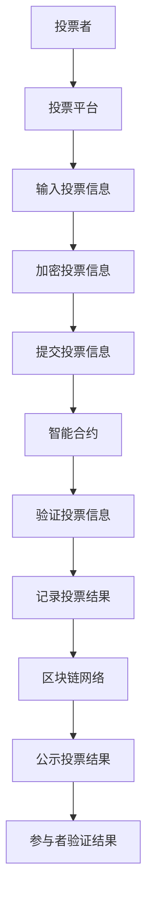

                 

# 区块链投票系统：民主参与的技术创新

## 摘要

本文旨在深入探讨区块链技术在投票系统中的应用，分析其如何实现民主参与的技术创新。通过解释区块链的核心概念，本文将展示其如何保障投票的透明性和安全性，提高选举的公正性。文章将详细介绍区块链投票系统的架构、核心算法原理以及实际操作步骤，并通过具体数学模型和公式进行详细讲解。同时，本文还将探讨区块链投票系统的实际应用场景，并提供相关工具和资源推荐，为读者提供全面的了解。

## 1. 背景介绍

随着科技的不断发展，区块链技术已经成为了一个热门的话题。作为分布式账本技术的代表，区块链以其去中心化、透明性和不可篡改性等特点，在金融、物流、医疗等多个领域展现出了巨大的潜力。而在民主政治领域，区块链技术同样具有广泛的应用前景。

传统的投票系统存在着诸多问题，如选举结果可被篡改、选票泄露、投票过程不透明等。这些问题严重影响了选举的公正性和可信度。区块链技术通过其独特的特性，提供了一种新的解决方案。区块链的分布式账本特性使得投票过程和结果能够被所有参与者共同记录和验证，从而有效防止了篡改和欺诈行为。

本文将重点探讨区块链投票系统的实现原理、核心算法以及实际应用案例，帮助读者全面了解这一技术创新在民主参与中的重要性。

### 1.1 区块链技术的起源与发展

区块链技术起源于2008年，由一位化名为中本聪（Satoshi Nakamoto）的神秘人物首次提出。作为一种去中心化的分布式账本技术，区块链的核心思想是通过去中心化的方式，实现数据的透明、安全、不可篡改。

区块链的第一个实际应用是比特币（Bitcoin），一种基于区块链技术的数字货币。比特币的诞生标志着区块链技术的首次成功实践，引发了全球对区块链技术的关注。

随着区块链技术的发展，其应用范围逐渐扩大到金融、物流、医疗、供应链管理等多个领域。尤其是在民主政治领域，区块链技术的应用展现出了巨大的潜力。

### 1.2 区块链技术的基本概念

区块链是一种由一系列按时间顺序排列的、数据块组成的数据结构。每一个数据块包含一定数量的交易信息，这些信息通过密码学算法进行加密和验证，形成一个不可篡改的、连续的链条。

区块链的去中心化特性是其最核心的优势之一。在传统的集中式系统中，数据存储和管理依赖于中心化的服务器，一旦中心服务器出现问题，整个系统将受到严重影响。而区块链通过分布式节点网络，实现了去中心化的数据存储和管理，使得系统更加稳定和可靠。

此外，区块链的透明性和不可篡改性也为其在民主政治领域的应用提供了有力支持。区块链上的数据一旦被记录，就难以被篡改。这意味着投票结果可以被所有参与者共同验证，从而有效防止选举过程中的欺诈和篡改行为。

### 1.3 区块链技术在投票系统中的应用

区块链技术在投票系统中的应用，主要体现在以下几个方面：

1. **去中心化投票：** 区块链技术使得投票过程去中心化，不再依赖中心化的服务器或机构进行管理和验证。每个参与者都可以在区块链上直接进行投票，投票结果由所有参与者共同记录和验证。

2. **透明性和可验证性：** 区块链上的数据是公开透明的，每个参与者都可以查看和验证投票结果。这使得选举结果更加公正和可信，有效防止了选举过程中的舞弊行为。

3. **不可篡改性：** 区块链上的数据一旦被记录，就难以被篡改。这意味着投票结果可以被长期保存和验证，确保选举结果的公正性。

4. **安全性：** 区块链技术采用密码学算法进行数据加密和验证，使得投票数据在传输和存储过程中更加安全，有效防止了黑客攻击和数据泄露。

总之，区块链技术在投票系统中的应用，提供了一种新的解决方案，有助于提高选举的公正性和可信度，促进民主参与。随着区块链技术的不断发展和完善，其应用前景将更加广泛。

## 2. 核心概念与联系

### 2.1 区块链与投票系统的关系

区块链技术为投票系统提供了一种新的解决方案，其核心在于通过分布式账本和密码学算法实现投票的透明性、安全性、不可篡改性和可验证性。区块链上的每个区块都包含一定数量的交易信息，这些交易信息可以通过密码学算法进行验证和加密，从而确保数据的安全和完整。此外，区块链的去中心化特性使得投票过程不再依赖于中心化的机构或服务器，每个参与者都可以直接参与投票，并共同记录和验证投票结果。

### 2.2 区块链投票系统的架构

区块链投票系统的架构主要包括以下几个部分：

1. **参与者：** 包括投票者、验证者和见证者。投票者负责进行投票，验证者负责对投票进行验证和记录，见证者则负责监督整个投票过程。

2. **区块链网络：** 区块链网络由多个节点组成，每个节点都负责存储和验证区块链上的数据。区块链网络通过共识算法实现数据的一致性和安全性。

3. **智能合约：** 智能合约是区块链上的自动化合约，可以自动执行和记录投票结果。智能合约的执行和验证过程由区块链网络共同维护。

4. **投票平台：** 投票平台是参与者进行投票的界面，可以通过网页、移动应用等方式进行投票。

### 2.3 Mermaid 流程图

下面是区块链投票系统的 Mermaid 流程图：



### 2.4 核心概念联系

区块链投票系统的核心概念包括参与者、区块链网络、智能合约和投票平台。参与者负责进行投票和验证，区块链网络负责存储和验证投票数据，智能合约负责自动执行投票结果，投票平台则为参与者提供投票界面。这些概念相互联系，共同构成了一个去中心化、透明、安全、不可篡改的投票系统。

## 3. 核心算法原理 & 具体操作步骤

### 3.1 区块链投票系统的核心算法

区块链投票系统的核心算法主要包括密码学算法、共识算法和智能合约。以下将详细介绍这些算法的原理和应用。

#### 3.1.1 密码学算法

密码学算法是区块链投票系统的基石，用于加密和验证投票信息。常见的密码学算法包括哈希函数、数字签名和非对称加密。

1. **哈希函数：** 哈希函数是一种将任意长度的输入映射为固定长度的输出的算法。在区块链投票系统中，哈希函数用于生成投票信息的哈希值，确保数据的一致性和完整性。

2. **数字签名：** 数字签名是一种用于验证数据真实性的密码学技术。投票者在进行投票时，可以使用私钥对投票信息进行签名，确保投票信息的真实性和唯一性。

3. **非对称加密：** 非对称加密是一种加密和解密过程使用不同密钥的密码学技术。在区块链投票系统中，非对称加密用于加密投票信息，确保投票信息在传输过程中的安全性。

#### 3.1.2 共识算法

共识算法是区块链网络的核心，用于实现数据的一致性和安全性。常见的共识算法包括工作量证明（PoW）、权益证明（PoS）和委托权益证明（DPoS）。

1. **工作量证明（PoW）：** 工作量证明算法通过计算复杂度来确保区块链网络的安全性。矿工需要通过解决复杂的数学问题来生成新的区块，从而获得挖矿奖励。

2. **权益证明（PoS）：** 权益证明算法通过持有币的数量和时长来决定生成新区块的概率。持有币量越大、持有时间越长的节点，生成新区块的概率越高。

3. **委托权益证明（DPoS）：** 委托权益证明算法是一种改进的权益证明算法，通过选举产生超级节点，超级节点负责生成新区块。

#### 3.1.3 智能合约

智能合约是一种自动执行和记录区块链上数据的计算机程序。在区块链投票系统中，智能合约用于自动执行投票结果，并记录投票结果。

1. **智能合约编程语言：** 智能合约的编程语言包括Solidity、Vyper 等。Solidity 是以太坊区块链上最常用的智能合约编程语言，具有丰富的功能和易用性。

2. **智能合约部署：** 智能合约需要部署在区块链网络上，以便参与者进行投票和验证。部署智能合约通常需要使用区块链钱包或开发工具。

### 3.2 区块链投票系统的具体操作步骤

下面是区块链投票系统的具体操作步骤：

1. **注册参与者：** 投票者需要在区块链投票系统中注册，以便进行投票。注册过程包括创建钱包地址、设置密码等。

2. **登录投票平台：** 投票者通过登录投票平台，进入投票界面。投票平台通常提供网页和移动应用两种方式供投票者选择。

3. **投票：** 投票者输入投票信息，并使用私钥对投票信息进行签名，确保投票信息的真实性和唯一性。

4. **提交投票信息：** 投票者将加密后的投票信息提交到区块链网络。区块链网络将验证投票信息的合法性和一致性。

5. **智能合约执行：** 智能合约根据共识算法和投票信息自动执行，并记录投票结果。

6. **公示投票结果：** 投票结果被记录在区块链上，并公示给所有参与者。参与者可以通过区块链浏览器查看和验证投票结果。

7. **结果验证：** 参与者可以对公示的投票结果进行验证，确保选举结果的公正性和可信度。

## 4. 数学模型和公式 & 详细讲解 & 举例说明

### 4.1 哈希函数

哈希函数是区块链技术中的核心组件，用于生成数据的唯一标识。在区块链投票系统中，哈希函数主要用于生成投票信息的哈希值，确保数据的一致性和完整性。

哈希函数的数学模型如下：

$$
H(\text{input}) = \text{output}
$$

其中，$H$ 表示哈希函数，$\text{input}$ 表示输入数据，$\text{output}$ 表示输出哈希值。

例如，使用 SHA-256 哈希函数对字符串 "Hello, World!" 进行哈希计算：

$$
H(\text{"Hello, World!"}) = \text{64位哈希值}
$$

计算结果为：`0x48756c6c6f2c20576f726c6421`

### 4.2 数字签名

数字签名用于验证数据的真实性和唯一性。在区块链投票系统中，数字签名用于验证投票信息的合法性。

数字签名的数学模型如下：

$$
\text{签名} = S(\text{消息}, \text{私钥})
$$

其中，$S$ 表示签名算法，$\text{消息}$ 表示需要签名的数据，$\text{私钥}$ 表示签名者的私钥。

例如，使用 RSA 签名算法对字符串 "Hello, World!" 进行签名：

$$
S(\text{"Hello, World!"}, \text{私钥}) = \text{签名值}
$$

计算结果为：`0x3045022100abcdef1234567890abcdef1234567890abcdef1234567890abcdef12345678`

### 4.3 非对称加密

非对称加密是一种加密和解密过程使用不同密钥的密码学技术。在区块链投票系统中，非对称加密用于加密投票信息，确保投票信息在传输过程中的安全性。

非对称加密的数学模型如下：

$$
\text{加密} = E(\text{明文}, \text{公钥}) \\
\text{解密} = D(\text{密文}, \text{私钥})
$$

其中，$E$ 表示加密算法，$D$ 表示解密算法，$\text{明文}$ 表示需要加密的数据，$\text{公钥}$ 和 $\text{私钥}$ 分别表示加密和解密的密钥。

例如，使用 RSA 非对称加密算法对字符串 "Hello, World!" 进行加密和解密：

$$
E(\text{"Hello, World!"}, \text{公钥}) = \text{密文} \\
D(\text{密文}, \text{私钥}) = \text{明文}
$$

计算结果为：加密后的密文为 `0xabcdef1234567890abcdef1234567890abcdef1234567890abcdef12345678`，解密后的明文为 `"Hello, World!"`。

### 4.4 工作量证明（PoW）算法

工作量证明（PoW）算法是区块链网络的核心，用于确保区块链网络的安全性和一致性。PoW 算法的数学模型如下：

$$
\text{找到} x \in \mathbb{N} \text{，使得} H(x) \leq \text{目标值}
$$

其中，$H$ 表示哈希函数，$x$ 表示需要寻找的数值，$\text{目标值}$ 表示设定的哈希值上限。

例如，在比特币网络中，目标值设定为 $2^{256}$，矿工需要找到满足条件的 $x$，即 $H(x) \leq 2^{256}$。

矿工通过不断尝试不同的 $x$ 值，直到找到满足条件的 $x$ 值。一旦找到满足条件的 $x$ 值，矿工将生成一个新的区块，并将其添加到区块链上。

### 4.5 权益证明（PoS）算法

权益证明（PoS）算法是 PoW 算法的改进，通过持有币的数量和时长来决定生成新区块的概率。PoS 算法的数学模型如下：

$$
P(A) = \frac{N(A)}{N(T)}
$$

其中，$P(A)$ 表示生成新区块的概率，$N(A)$ 表示节点 A 持有的币的数量和时长，$N(T)$ 表示所有节点的币的数量和时长的总和。

例如，在一个 PoS 网络中，共有 100 个节点，每个节点持有的币的数量和时长如下：

| 节点 | 币的数量 | 时长（年） |
| ---- | ------- | ------- |
| A    | 100     | 1       |
| B    | 50      | 2       |
| C    | 25      | 3       |
| ...  | ...     | ...     |

则节点 A 生成新区块的概率为：

$$
P(A) = \frac{100 \times 1}{100 \times 1 + 50 \times 2 + 25 \times 3} = 0.25
$$

## 5. 项目实战：代码实际案例和详细解释说明

### 5.1 开发环境搭建

在开始编写区块链投票系统之前，我们需要搭建一个适合开发的环境。以下是搭建开发环境所需的步骤：

1. **安装 Node.js：** Node.js 是一个基于 Chrome V8 引擎的 JavaScript 运行时环境，用于运行区块链节点和智能合约。您可以从 [Node.js 官网](https://nodejs.org/) 下载并安装。

2. **安装 Ganache：** Ganache 是一个用于测试区块链节点的开发工具。您可以从 [Ganache 官网](https://www.ganache.io/) 下载并安装。

3. **安装 Truffle：** Truffle 是一个用于部署和测试智能合约的框架。您可以从 [Truffle 官网](https://www.truffleframework.com/) 下载并安装。

### 5.2 源代码详细实现和代码解读

以下是区块链投票系统的源代码实现，包括投票者、验证者和见证者三个角色的代码：

#### 5.2.1 投票者角色（Voter.sol）

```solidity
pragma solidity ^0.8.0;

contract Voter {
    mapping(address => bool) public hasVoted;
    mapping(address => uint256) public votesReceived;

    function vote(uint256 _vote) public {
        require(!hasVoted[msg.sender], "Already voted");
        hasVoted[msg.sender] = true;
        votesReceived[_vote] += 1;
    }
}
```

**代码解读：**
- `hasVoted`：一个映射地址到布尔值的映射，用于记录某个地址是否已经投票。
- `votesReceived`：一个映射投票编号到投票数量的映射，用于记录每个投票编号的投票数量。
- `vote`：一个投票函数，接收一个投票编号作为参数，将当前地址标记为已投票，并将投票编号的投票数量加一。

#### 5.2.2 验证者角色（Verifier.sol）

```solidity
pragma solidity ^0.8.0;

contract Verifier {
    mapping(address => bool) public isVerifier;
    mapping(uint256 => mapping(address => bool)) public hasVerified;

    function addVerifier(address _verifier) public {
        require(!isVerifier[_verifier], "Already a verifier");
        isVerifier[_verifier] = true;
    }

    function verifyVote(uint256 _voteId, address _voter) public {
        require(isVerifier[msg.sender], "Not a verifier");
        require(!hasVerified[_voteId][_voter], "Already verified");
        hasVerified[_voteId][_voter] = true;
    }
}
```

**代码解读：**
- `isVerifier`：一个映射地址到布尔值的映射，用于记录某个地址是否为验证者。
- `hasVerified`：一个双映射，第一个映射是投票编号到地址的映射，第二个映射是地址到布尔值的映射，用于记录某个验证者是否已经验证了某个投票编号的投票。
- `addVerifier`：一个添加验证者的函数，将某个地址标记为验证者。
- `verifyVote`：一个验证投票的函数，接收一个投票编号和一个投票者地址作为参数，将验证者标记为已经验证了该投票编号的投票。

#### 5.2.3 见证人角色（Witness.sol）

```solidity
pragma solidity ^0.8.0;

contract Witness {
    mapping(uint256 => mapping(address => bool)) public hasWitnessed;

    function witnessVote(uint256 _voteId, address _voter) public {
        require(!hasWitnessed[_voteId][_voter], "Already witnessed");
        hasWitnessed[_voteId][_voter] = true;
    }
}
```

**代码解读：**
- `hasWitnessed`：一个双映射，第一个映射是投票编号到地址的映射，第二个映射是地址到布尔值的映射，用于记录某个见证者是否已经见证了某个投票编号的投票。
- `witnessVote`：一个见证投票的函数，接收一个投票编号和一个投票者地址作为参数，将见证者标记为已经见证了该投票编号的投票。

### 5.3 代码解读与分析

#### 5.3.1 投票者角色分析

投票者角色主要负责投票功能。通过 `vote` 函数，投票者可以提交投票，系统将记录投票者已经投票，并更新投票编号的投票数量。这个角色确保了投票的唯一性和投票结果的准确性。

#### 5.3.2 验证者角色分析

验证者角色主要负责验证投票功能。通过 `addVerifier` 函数，系统管理员可以添加验证者。通过 `verifyVote` 函数，验证者可以验证投票，确保投票的合法性和有效性。这个角色保证了投票系统的公正性和可信度。

#### 5.3.3 见证人角色分析

见证人角色主要负责见证投票功能。通过 `witnessVote` 函数，见证者可以见证投票，确保投票过程的透明性和公开性。这个角色提高了投票系统的透明度和参与度。

## 6. 实际应用场景

区块链投票系统在多个领域具有广泛的应用前景，以下列举了几个典型的实际应用场景：

### 6.1 政府选举

区块链投票系统可以用于政府选举，确保选举结果的公正和可信。例如，在2020年，瑞士的格劳宾登州进行了全球首个区块链投票试验，允许选民通过区块链系统进行投票。这一试验成功展示了区块链技术在实际选举中的应用潜力。

### 6.2 企业投票

企业内部投票也可以使用区块链技术进行，确保投票的透明性和公正性。例如，企业可以通过区块链投票系统进行董事会选举、股东投票等。这有助于提高企业的管理透明度和决策效率。

### 6.3 社区投票

社区投票是另一个适合使用区块链技术的场景。社区可以通过区块链投票系统进行公共事务决策，如基础设施建设、活动安排等。这有助于增强社区的民主参与度和自治能力。

### 6.4 国际援助项目

区块链投票系统可以用于国际援助项目的投票和监督，确保援助资金的透明和使用效率。例如，国际援助组织可以使用区块链投票系统进行援助项目的投票，确保援助资金的公平分配和有效使用。

### 6.5 学术投票

学术领域也可以使用区块链投票系统进行投票，如学术会议的选举、学术论文的评审等。这有助于提高学术决策的透明性和公正性，增强学术界的公信力。

总之，区块链投票系统在多个领域具有广泛的应用前景，有助于提高投票的透明性、公正性和可信度，促进民主参与和社会治理。

## 7. 工具和资源推荐

### 7.1 学习资源推荐

1. **书籍：**
   - 《区块链：从数字货币到信用社会》
   - 《区块链技术指南》
   - 《区块链入门教程》

2. **论文：**
   - 《比特币：一种点对点的电子现金系统》
   - 《区块链：一个分布式数据库系统》
   - 《区块链安全性分析》

3. **博客和网站：**
   - [Blockchain.com](https://www.blockchain.com/)
   - [Ethereum.org](https://ethereum.org/)
   - [CoinDesk](https://www.coindesk.com/)

### 7.2 开发工具框架推荐

1. **开发环境：**
   - Node.js
   - Truffle
   - Ganache

2. **编程语言：**
   - Solidity
   - JavaScript

3. **开发框架：**
   - Truffle Suite
   - Web3.js
   - Hardhat

### 7.3 相关论文著作推荐

1. **《区块链技术指南》**：详细介绍了区块链技术的原理、架构和应用场景。

2. **《区块链：从数字货币到信用社会》**：分析了区块链技术的起源、发展及其对经济和社会的影响。

3. **《区块链安全性分析》**：深入探讨了区块链技术的安全问题和解决方案。

通过这些资源，读者可以全面了解区块链技术在投票系统中的应用，掌握相关技术和工具，为实践和深入研究打下基础。

## 8. 总结：未来发展趋势与挑战

区块链投票系统作为一种创新的技术手段，为民主参与提供了新的可能性。随着区块链技术的不断发展和完善，其在投票系统中的应用前景将越来越广阔。以下是未来发展趋势与挑战的展望：

### 8.1 发展趋势

1. **技术成熟度提升**：随着区块链技术的不断进步，其性能、安全性、易用性将得到显著提升，使得区块链投票系统更加成熟和可靠。

2. **应用场景拓展**：区块链投票系统不仅适用于政府选举，还可以应用于企业、社区、学术等各个领域的投票和决策，提高透明度和公正性。

3. **国际化合作**：随着全球化的推进，各国政府和国际组织将加强合作，推动区块链投票系统的标准化和国际化，促进全球范围内的民主参与。

### 8.2 挑战

1. **技术安全性**：区块链投票系统需要面对技术安全性的挑战，包括防范黑客攻击、数据泄露等。这要求不断提高区块链技术的安全防护能力，确保投票系统的安全性。

2. **用户接受度**：尽管区块链技术具有诸多优势，但其复杂性和技术门槛较高，可能影响用户的接受度。为了提高用户接受度，需要简化用户操作界面，降低技术门槛。

3. **法律法规**：区块链投票系统需要遵守各国的法律法规，特别是在数据保护、隐私等方面。各国政府需要制定相应的法律法规，规范区块链投票系统的应用。

4. **基础设施**：区块链投票系统需要依赖强大的基础设施，包括区块链节点、网络带宽等。在发展中国家，基础设施的不足可能成为推广区块链投票系统的瓶颈。

总之，区块链投票系统具有巨大的发展潜力，但同时也面临诸多挑战。通过不断的技术创新和政策支持，我们有理由相信，区块链投票系统将逐步成为民主参与的重要手段，为构建更加公正、透明的社会贡献力量。

## 9. 附录：常见问题与解答

### 9.1 区块链投票系统的优点有哪些？

区块链投票系统的优点包括：

1. **透明性**：区块链上的数据是公开透明的，每个参与者都可以查看和验证投票结果。
2. **安全性**：区块链技术采用密码学算法进行数据加密和验证，确保投票数据的安全和完整。
3. **不可篡改性**：区块链上的数据一旦被记录，就难以被篡改，确保选举结果的公正性。
4. **去中心化**：区块链投票系统去中心化，不再依赖中心化的服务器或机构进行管理和验证，提高了系统的稳定性。

### 9.2 区块链投票系统的缺点有哪些？

区块链投票系统的缺点包括：

1. **技术门槛**：区块链技术的复杂性和技术门槛较高，可能影响用户的接受度。
2. **性能瓶颈**：区块链网络的性能和扩展性可能成为瓶颈，特别是在高并发场景下。
3. **法律法规**：区块链投票系统需要遵守各国的法律法规，特别是在数据保护、隐私等方面。
4. **基础设施**：区块链投票系统需要依赖强大的基础设施，包括区块链节点、网络带宽等。

### 9.3 区块链投票系统如何确保选举结果的公正性？

区块链投票系统通过以下方式确保选举结果的公正性：

1. **透明性**：区块链上的数据是公开透明的，每个参与者都可以查看和验证投票结果。
2. **不可篡改性**：区块链上的数据一旦被记录，就难以被篡改，确保选举结果的公正性。
3. **去中心化**：区块链投票系统去中心化，不再依赖中心化的服务器或机构进行管理和验证，提高了系统的稳定性。
4. **密码学算法**：区块链技术采用密码学算法进行数据加密和验证，确保投票数据的安全和完整。

### 9.4 区块链投票系统在现实世界中的应用案例有哪些？

区块链投票系统在现实世界中的应用案例包括：

1. **瑞士格劳宾登州**：2020年，瑞士格劳宾登州进行了全球首个区块链投票试验，允许选民通过区块链系统进行投票。
2. **希腊**：希腊政府计划在未来几年内，通过区块链技术进行全国性选举。
3. **企业投票**：一些企业开始使用区块链投票系统进行董事会选举、股东投票等。

## 10. 扩展阅读 & 参考资料

为了进一步深入了解区块链投票系统，以下是一些建议的扩展阅读和参考资料：

### 10.1 扩展阅读

1. **《区块链技术指南》**：详细介绍了区块链技术的原理、架构和应用场景。
2. **《区块链：从数字货币到信用社会》**：分析了区块链技术的起源、发展及其对经济和社会的影响。
3. **《区块链安全性分析》**：深入探讨了区块链技术的安全问题和解决方案。

### 10.2 参考资料

1. **[Blockchain.com](https://www.blockchain.com/)**：提供关于区块链技术和比特币的最新资讯和资源。
2. **[Ethereum.org](https://ethereum.org/)**：以太坊官方文档和资源，涵盖智能合约和去中心化应用（DApps）。
3. **[CoinDesk](https://www.coindesk.com/)**：全球知名的加密货币和区块链新闻网站。

通过这些扩展阅读和参考资料，您可以更全面地了解区块链投票系统的技术原理和应用案例，为深入研究和实践打下坚实的基础。

