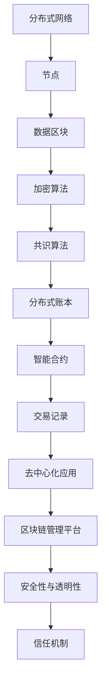

                 

# 区块链管理：探索分布式技术的商业应用

> **关键词：** 区块链、分布式技术、商业应用、安全性、透明性、去中心化、智能合约

> **摘要：** 本文深入探讨了区块链管理及其在商业领域的应用，包括核心概念、算法原理、实际案例、应用场景、工具和资源推荐等方面。通过逐步分析，我们旨在揭示区块链技术的巨大潜力和未来发展趋势。

## 1. 背景介绍

区块链技术自2008年比特币的诞生以来，逐渐成为全球关注的焦点。作为一种分布式数据库技术，区块链通过去中心化的方式实现了数据的存储和传输，具有高度的安全性和透明性。随着区块链技术的不断发展和完善，越来越多的行业开始探索其商业应用。

### 1.1 区块链的起源

区块链的起源可以追溯到2008年，当时一个名为中本聪的匿名人士发表了《比特币：一种点对点的电子现金系统》的白皮书。该白皮书首次提出了区块链的概念，并将其应用于数字货币——比特币的系统中。区块链的核心理念是去中心化，通过分布式网络实现数据的存储和传输，避免了传统中心化系统中的单点故障和信任问题。

### 1.2 区块链的发展

随着比特币的成功，区块链技术引起了全球的关注。越来越多的国家和地区开始研究区块链技术，并尝试将其应用于各种场景。2015年，区块链技术首次被写入中国政府五年规划，标志着区块链技术在中国的发展进入了快车道。此外，全球各地的企业、科研机构和政府部门也纷纷投入到区块链技术的研发和应用中。

## 2. 核心概念与联系

区块链管理涉及多个核心概念，包括分布式网络、加密算法、智能合约等。为了更好地理解这些概念，我们将使用Mermaid流程图来展示区块链的基本架构和各组成部分之间的联系。



### 2.1 分布式网络

分布式网络是区块链的基础，它由多个节点组成，每个节点都存储完整的数据副本。通过分布式网络，区块链实现了去中心化的数据存储和传输。分布式网络的优点在于提高了系统的容错性和安全性，避免了单点故障和中心化风险。

### 2.2 加密算法

加密算法是区块链技术的重要组成部分，用于保护数据的安全性和隐私。常见的加密算法包括SHA-256、RSA等。加密算法确保了区块链上的数据无法被篡改和伪造，同时保障了交易的隐私性。

### 2.3 智能合约

智能合约是区块链技术的一项创新，它是一种自动执行的合约，能够在满足特定条件时自动执行。智能合约的执行过程由代码定义，无需人工干预。智能合约的引入，使得区块链在金融、供应链、版权保护等领域具有广泛的应用前景。

### 2.4 共识算法

共识算法是区块链网络中节点达成一致的方式。常见的共识算法包括工作量证明（PoW）、权益证明（PoS）等。共识算法的目的是确保区块链网络的安全性和一致性，防止恶意节点攻击和篡改数据。

## 3. 核心算法原理 & 具体操作步骤

区块链的核心算法主要包括加密算法、共识算法和智能合约。下面我们将详细讲解这些算法的原理和具体操作步骤。

### 3.1 加密算法

加密算法是区块链技术的重要组成部分，用于保护数据的安全性和隐私。常见的加密算法包括SHA-256、RSA等。SHA-256是一种哈希算法，用于将数据转换为固定长度的字符串。RSA算法是一种非对称加密算法，用于数据的加密和解密。

#### 3.1.1 SHA-256算法

SHA-256算法的输入是一个任意长度的数据，输出是一个固定长度的哈希值。SHA-256算法的具体步骤如下：

1. 将输入数据分成若干个512位的数据块。
2. 对每个数据块进行一系列的变换，包括填充、压缩等。
3. 生成最终的哈希值。

#### 3.1.2 RSA算法

RSA算法是一种非对称加密算法，包括公钥和私钥两部分。公钥用于加密数据，私钥用于解密数据。RSA算法的具体步骤如下：

1. 选择两个大素数p和q，计算n=p*q。
2. 计算欧拉函数φ(n)=(p-1)*(q-1)。
3. 选择一个与φ(n)互质的整数e，计算d，满足e*d ≡ 1 (mod φ(n))。
4. 公钥为(n,e)，私钥为(n,d)。

### 3.2 共识算法

共识算法是区块链网络中节点达成一致的方式。常见的共识算法包括工作量证明（PoW）、权益证明（PoS）等。下面我们将详细讲解这些算法的原理和具体操作步骤。

#### 3.2.1 工作量证明（PoW）

工作量证明算法要求节点通过计算大量的哈希值来找到满足特定条件的区块。具体步骤如下：

1. 节点接收到一个交易列表，并将其封装成一个区块。
2. 节点开始计算区块的哈希值，直到找到一个满足特定条件的哈希值。
3. 满足条件的区块将被添加到区块链中，节点获得一定的奖励。

#### 3.2.2 权益证明（PoS）

权益证明算法要求节点根据其在区块链中的权益参与共识。具体步骤如下：

1. 节点根据其在区块链中的权益获得生成区块的资格。
2. 节点生成一个包含交易列表的区块。
3. 区块被添加到区块链中，节点获得一定的奖励。

### 3.3 智能合约

智能合约是区块链技术的一项创新，它是一种自动执行的合约，能够在满足特定条件时自动执行。智能合约的执行过程由代码定义，无需人工干预。智能合约的具体步骤如下：

1. 节点编写智能合约代码。
2. 智能合约代码经过编译和部署，成为区块链上的一个合约。
3. 合约调用智能合约，执行相应的操作。

## 4. 数学模型和公式 & 详细讲解 & 举例说明

区块链技术涉及到多个数学模型和公式，包括哈希函数、加密算法、共识算法等。下面我们将详细讲解这些数学模型和公式，并通过具体例子进行说明。

### 4.1 哈希函数

哈希函数是将任意长度的输入数据映射为固定长度的字符串。常见的哈希函数包括SHA-256、MD5等。哈希函数具有以下几个特点：

1. 单向性：无法通过哈希值反推出原始数据。
2. 抗碰撞性：不同的输入数据生成相同的哈希值的概率极低。
3. 抗修改性：对哈希值进行任何修改，都会导致原始数据的哈希值发生巨大变化。

#### 4.1.1 SHA-256算法

SHA-256算法的具体公式如下：

$$
H = \text{SHA-256}(M)
$$

其中，$H$表示哈希值，$M$表示输入数据。

#### 4.1.2 MD5算法

MD5算法的具体公式如下：

$$
H = \text{MD5}(M)
$$

其中，$H$表示哈希值，$M$表示输入数据。

### 4.2 加密算法

加密算法是将明文数据转换为密文的一种方法。常见的加密算法包括RSA、AES等。加密算法的具体步骤如下：

1. 选择密钥：加密算法需要一对密钥，包括公钥和私钥。
2. 加密：使用公钥将明文数据加密为密文。
3. 解密：使用私钥将密文解密为明文。

#### 4.2.1 RSA算法

RSA算法的具体公式如下：

$$
C = \text{RSA}_e(M)
$$

其中，$C$表示密文，$M$表示明文，$e$表示公钥。

#### 4.2.2 AES算法

AES算法的具体公式如下：

$$
C = \text{AES}_k(M)
$$

其中，$C$表示密文，$M$表示明文，$k$表示密钥。

### 4.3 共识算法

共识算法是区块链网络中节点达成一致的方式。常见的共识算法包括PoW、PoS等。共识算法的具体步骤如下：

1. 节点接收交易列表。
2. 节点生成区块。
3. 节点通过共识算法达成一致，将区块添加到区块链中。

#### 4.3.1 PoW算法

PoW算法的具体公式如下：

$$
\text{区块} = \text{PoW}(\text{交易列表})
$$

其中，$\text{区块}$表示生成的区块，$\text{交易列表}$表示接收到的交易列表。

#### 4.3.2 PoS算法

PoS算法的具体公式如下：

$$
\text{区块} = \text{PoS}(\text{交易列表}, \text{权益})
$$

其中，$\text{区块}$表示生成的区块，$\text{交易列表}$表示接收到的交易列表，$\text{权益}$表示节点在区块链中的权益。

## 5. 项目实战：代码实际案例和详细解释说明

为了更好地理解区块链技术的应用，我们将通过一个实际项目案例来介绍区块链管理。本案例将使用以太坊平台开发一个简单的智能合约，实现一个去中心化的投票系统。

### 5.1 开发环境搭建

在开始编写智能合约之前，我们需要搭建开发环境。以下是搭建以太坊开发环境的步骤：

1. 安装Node.js：从官方网站下载并安装Node.js。
2. 安装Truffle：在命令行中执行以下命令：
   ```
   npm install -g truffle
   ```
3. 创建一个新的Truffle项目：
   ```
   truffle init
   ```
4. 进入项目目录：
   ```
   cd my-truffle-project
   ```
5. 安装以太坊客户端：根据操作系统选择合适版本的以太坊客户端，如Geth、Parity等。安装完成后，启动以太坊客户端。

### 5.2 源代码详细实现和代码解读

以下是本案例的智能合约代码：

```solidity
pragma solidity ^0.8.0;

contract Voting {
    mapping(address => bool) public voters;
    mapping(string => mapping(address => bool)) public candidates;

    function addCandidate(string memory name) public {
        require(!isCandidate(name), "Candidate already exists");
        candidates[name][msg.sender] = true;
    }

    function vote(string memory name) public {
        require(!voters[msg.sender], "Already voted");
        require(isCandidate(name), "Invalid candidate");
        voters[msg.sender] = true;
        candidates[name][msg.sender] = true;
    }

    function isCandidate(string memory name) public view returns (bool) {
        return candidates[name][msg.sender];
    }
}
```

#### 5.2.1 代码解读

1. **pragma solidity ^0.8.0;**：指定智能合约的版本，确保兼容性和安全性。
2. **mapping(address => bool) public voters;**：创建一个存储投票者地址的映射，用于记录已投票的地址。
3. **mapping(string => mapping(address => bool)) public candidates;**：创建一个存储候选人名称和投票者地址的映射，用于记录候选人和已投票的地址。
4. **function addCandidate(string memory name) public**：添加候选人。通过将候选人的名称存储在`candidates`映射中，同时记录候选人的地址。
5. **function vote(string memory name) public**：投票。首先检查投票者是否已投票，然后检查候选人是否存在，最后将投票者标记为已投票。
6. **function isCandidate(string memory name) public view returns (bool)**：检查候选人是否存在。

### 5.3 代码解读与分析

1. **pragma solidity ^0.8.0;**：指定智能合约的版本，确保兼容性和安全性。 solidity 是以太坊智能合约的编程语言。pragma 指令用于指定编译器的行为。
2. **mapping(address => bool) public voters;**：使用映射（mapping）类型存储投票者地址和投票状态。地址是智能合约中的唯一标识符，用于记录已投票的地址。
3. **mapping(string => mapping(address => bool)) public candidates;**：使用嵌套映射类型存储候选人的名称和投票者地址。这种数据结构可以方便地查询某个候选人是否被某个地址投票。
4. **function addCandidate(string memory name) public**：添加候选人。该函数通过将候选人的名称存储在`candidates`映射中，同时记录候选人的地址。`require`语句用于检查候选人是否已存在。
5. **function vote(string memory name) public**：投票。该函数首先检查投票者是否已投票，然后检查候选人是否存在，最后将投票者标记为已投票。`require`语句用于确保输入的有效性。
6. **function isCandidate(string memory name) public view returns (bool)**：检查候选人是否存在。`view`关键字表示该函数仅读取状态，不修改状态。

## 6. 实际应用场景

区块链技术具有广泛的应用场景，以下列举了一些典型的应用领域：

### 6.1 金融领域

区块链技术在金融领域具有巨大的潜力，可以应用于支付、结算、金融交易等场景。通过区块链技术，可以实现去中心化的支付系统，提高交易效率和降低成本。例如，比特币和以太坊等加密货币就是区块链技术在金融领域的重要应用。

### 6.2 物流领域

区块链技术可以用于物流领域的供应链管理，实现全程追踪和溯源。通过区块链技术，可以记录物流过程中的每一个环节，确保数据的真实性和完整性。例如，沃尔玛等大型零售企业已开始尝试使用区块链技术进行食品供应链管理。

### 6.3 智能合约

智能合约是一种自动执行的合约，可以用于自动化执行合同条款。通过智能合约，可以减少人工干预，降低交易成本，提高交易效率。例如，房地产交易、版权保护等领域已经开始使用智能合约。

### 6.4 医疗领域

区块链技术可以用于医疗领域的病历管理、药物供应链管理等方面。通过区块链技术，可以实现病历的全程追踪和溯源，确保数据的真实性和安全性。例如，一些医疗机构已经开始尝试使用区块链技术进行病历管理。

### 6.5 法律领域

区块链技术可以用于法律领域的文件存储、证据链构建等。通过区块链技术，可以实现证据的全程记录和不可篡改，提高司法效率和公正性。例如，一些法律服务平台已经开始使用区块链技术进行证据链构建。

## 7. 工具和资源推荐

### 7.1 学习资源推荐

- **书籍：** 
  - 《区块链技术指南》
  - 《智能合约：原理与实践》
  - 《区块链：从入门到实战》

- **论文：** 
  - 《比特币：一种点对点的电子现金系统》
  - 《以太坊：一种去中心化应用平台》
  - 《区块链：一种分布式数据存储方案》

- **博客：** 
  - 区块链技术博客（https://www.blockchain.com/）
  - 智能合约技术博客（https://medium.com/ethereum）
  - 区块链新闻（https://www.coindesk.com/）

### 7.2 开发工具框架推荐

- **区块链开发框架：** 
  - Ethereum：以太坊开发框架
  - Hyperledger：超级账本开发框架
  - Corda：R3开发框架

- **智能合约开发工具：** 
  - Truffle：以太坊智能合约开发工具
  - Hardhat：以太坊智能合约开发工具
  - Remix：在线智能合约开发环境

### 7.3 相关论文著作推荐

- **《区块链：从理论到实践》**：本书详细介绍了区块链技术的基本原理、应用场景和开发方法。
- **《智能合约设计与实现》**：本书深入探讨了智能合约的设计原理、开发技术和应用场景。
- **《区块链技术指南》**：本书全面介绍了区块链技术的核心概念、应用案例和发展趋势。

## 8. 总结：未来发展趋势与挑战

区块链技术作为一种分布式技术，具有巨大的商业应用潜力。在未来，区块链技术将继续在金融、物流、智能合约、医疗等领域得到广泛应用。然而，区块链技术也面临一些挑战，如安全性、可扩展性、共识算法优化等。为了推动区块链技术的发展，我们需要不断优化现有算法，开发新型共识算法，并加强跨行业、跨领域的技术合作。

## 9. 附录：常见问题与解答

### 9.1 区块链与数据库的区别是什么？

区块链与数据库的主要区别在于数据存储方式、数据一致性、安全性等方面。区块链采用分布式存储方式，数据不可篡改，具有高度安全性。而数据库通常采用中心化存储方式，数据易受攻击和篡改。此外，区块链通过共识算法实现数据一致性，而数据库通常依靠事务管理实现数据一致性。

### 9.2 区块链是否能够完全取代中心化系统？

区块链技术作为一种分布式技术，在某些场景下可以替代中心化系统，但在其他场景下则无法完全取代。例如，在金融领域，区块链可以用于去中心化的支付和结算，但在涉及国家监管、法律法规等方面，中心化系统仍然具有重要意义。因此，区块链与中心化系统可以相互补充，共同推动社会进步。

### 9.3 智能合约的安全性问题如何解决？

智能合约的安全性问题是当前区块链技术的重要挑战之一。为了解决智能合约的安全性问题，可以从以下几个方面入手：

1. 代码审计：对智能合约代码进行严格审计，确保代码符合安全规范。
2. 安全测试：对智能合约进行自动化测试，发现潜在的安全漏洞。
3. 安全漏洞奖励计划：鼓励社区成员对智能合约进行漏洞挖掘，并给予奖励。
4. 智能合约安全框架：开发智能合约安全框架，提高智能合约的安全性。

## 10. 扩展阅读 & 参考资料

- **《区块链技术指南》**：深入介绍区块链技术的基本原理、应用案例和发展趋势。
- **《智能合约设计与实现》**：详细讲解智能合约的设计原理、开发技术和应用场景。
- **《区块链：从理论到实践》**：全面介绍区块链技术的理论知识和实际应用。
- **《超级账本技术白皮书》**：详细介绍超级账本（Hyperledger）的技术架构和应用场景。

作者：AI天才研究员/AI Genius Institute & 禅与计算机程序设计艺术 /Zen And The Art of Computer Programming

