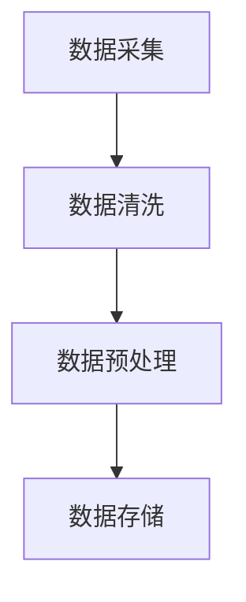
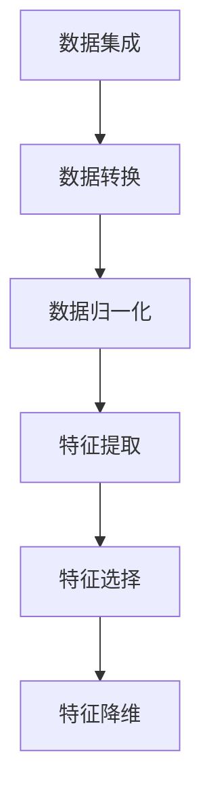
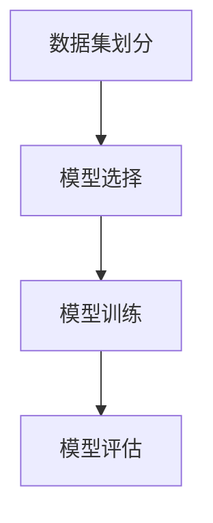
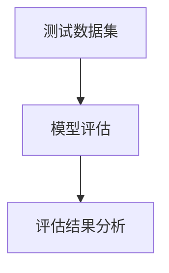
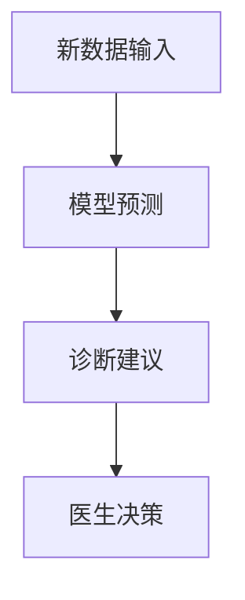

                 

# 医疗诊断辅助：人类计算助力精准医疗

## 摘要

本文将探讨医疗诊断辅助系统在精准医疗中的应用，特别是人类计算在其中的重要作用。我们将从背景介绍开始，逐步深入核心概念、算法原理、数学模型及实际应用场景，并通过项目实战和工具资源推荐，为读者提供一份全面的技术指南。文章旨在揭示人类计算与人工智能在医疗诊断领域的结合，以及它们如何共同推动精准医疗的发展。

## 1. 背景介绍

随着科技的进步，人工智能在医疗领域的应用日益广泛。医疗诊断辅助系统作为一种新兴技术，通过整合大量医疗数据和先进算法，为医生提供辅助诊断工具，从而提高诊断的准确性和效率。然而，尽管人工智能在数据处理和模式识别方面表现出色，但人类计算在医疗诊断中依然扮演着不可替代的角色。

人类医生具备丰富的临床经验和专业素养，能够综合考虑患者的症状、病史、实验室检查结果等多方面信息，从而做出更为准确和个性化的诊断。而人工智能则能够处理海量数据，识别复杂模式，为医生提供支持，两者相辅相成，共同推动精准医疗的发展。

本文将从以下几个方面展开讨论：首先介绍医疗诊断辅助系统的核心概念和架构；然后深入分析核心算法原理和具体操作步骤；接着讲解数学模型和公式，并通过实际案例进行说明；最后探讨医疗诊断辅助系统的实际应用场景，并推荐相关工具和资源。希望通过本文的探讨，能够为医疗诊断领域的技术发展提供一些有益的思考和启示。

### 2. 核心概念与联系

在医疗诊断辅助系统中，核心概念主要包括：数据采集、数据处理、模型训练、模型评估和诊断预测。这些概念之间存在着密切的联系，共同构成了一个完整的诊断流程。

#### 2.1 数据采集

数据采集是医疗诊断辅助系统的第一步，也是至关重要的一步。它包括患者症状、病史、实验室检查结果、影像学资料等多种数据类型。这些数据可以通过电子病历系统、医学影像设备、实验室检测设备等多种渠道获取。为了确保数据的质量和完整性，需要采取有效的数据清洗和预处理方法。

Mermaid 流程图如下：

#### 2.2 数据处理

数据处理是医疗诊断辅助系统的核心环节，包括数据集成、数据转换、数据归一化等步骤。数据处理的目标是使数据满足后续模型训练的需求，从而提高模型的性能。常用的数据处理方法包括特征提取、特征选择和特征降维等。

Mermaid 流程图如下：

#### 2.3 模型训练

模型训练是指利用已有数据集，通过机器学习算法对模型进行训练，使其具备诊断能力。常用的机器学习算法包括决策树、支持向量机、神经网络等。模型训练的质量直接影响诊断结果的准确性。

Mermaid 流程图如下：

#### 2.4 模型评估

模型评估是指通过测试数据集对训练好的模型进行评估，以确定其性能。常用的评估指标包括准确率、召回率、F1 值等。模型评估的结果可以帮助医生了解模型的诊断能力，从而决定是否采用该模型进行辅助诊断。

Mermaid 流程图如下：

#### 2.5 诊断预测

诊断预测是指利用训练好的模型对新的患者数据进行预测，以提供诊断建议。医生可以根据诊断预测结果结合患者的临床症状和其他信息，做出最终的诊断决策。

Mermaid 流程图如下：

通过以上核心概念的介绍，我们可以看到医疗诊断辅助系统的运作过程。在实际应用中，这些概念相互关联，共同构成了一个完整的诊断流程。人类计算和人工智能在这个流程中各司其职，相辅相成，共同推动精准医疗的发展。

### 3. 核心算法原理 & 具体操作步骤

#### 3.1 机器学习算法概述

在医疗诊断辅助系统中，机器学习算法是核心组件，负责从数据中学习规律，并生成诊断模型。常见的机器学习算法包括监督学习、无监督学习和强化学习。在本节中，我们将主要介绍监督学习算法，如决策树、支持向量机和神经网络。

#### 3.2 决策树算法原理

决策树算法通过一系列的判断条件来对数据进行分类或回归。每个节点表示一个特征，每个分支表示一个特征取值。最终，每个叶子节点代表一个分类结果。决策树算法的具体步骤如下：

1. **特征选择**：选择一个最优特征作为分裂依据，常用的评估指标包括信息增益、增益率和基尼系数。
2. **特征划分**：根据最优特征，将数据集划分为多个子集。
3. **递归构建**：对每个子集重复执行特征选择和特征划分步骤，直至达到终止条件（如最大树深度、最小叶节点样本数等）。

#### 3.3 支持向量机算法原理

支持向量机（SVM）是一种二分类算法，其目标是找到一个最优的超平面，将不同类别的数据点分隔开。SVM的核心是求解一个最优的分割超平面，使得正负样本之间的间隔最大化。具体步骤如下：

1. **特征映射**：将原始数据映射到高维空间，以便找到一个最优的分割超平面。
2. **求解最优超平面**：通过求解一个二次规划问题，找到最优的超平面参数。
3. **分类决策**：对于新的数据点，将其映射到高维空间，计算其与超平面的距离，从而判断其类别。

#### 3.4 神经网络算法原理

神经网络是一种模拟人脑神经元连接方式的计算模型，其基本单元是神经元。神经网络通过多层神经网络来对数据进行处理，每一层神经网络都会对输入数据进行加工，从而逐渐提取出数据的特征。神经网络的具体步骤如下：

1. **初始化权重和偏置**：随机初始化权重和偏置。
2. **前向传播**：将输入数据通过网络传递，逐层计算每个神经元的输出。
3. **反向传播**：根据输出结果和真实标签，计算每个神经元的误差，并反向传播误差，更新权重和偏置。
4. **优化目标函数**：通过优化目标函数（如均方误差、交叉熵等），调整网络参数，提高模型的性能。

#### 3.5 具体操作步骤

在实际操作中，使用机器学习算法构建医疗诊断辅助系统通常包括以下步骤：

1. **数据准备**：收集和整理医疗数据，包括患者信息、诊断结果等。
2. **数据预处理**：对数据集进行清洗、归一化和特征提取等处理，以满足算法的要求。
3. **模型选择**：根据数据特点和业务需求，选择合适的机器学习算法。
4. **模型训练**：使用训练数据集对模型进行训练，调整模型参数，优化模型性能。
5. **模型评估**：使用测试数据集对模型进行评估，计算模型的性能指标，如准确率、召回率、F1 值等。
6. **模型部署**：将训练好的模型部署到生产环境，为医生提供诊断辅助服务。

通过以上操作步骤，医疗诊断辅助系统可以将机器学习算法应用于实际场景，为医生提供有力支持，从而提高诊断的准确性和效率。

### 4. 数学模型和公式 & 详细讲解 & 举例说明

在医疗诊断辅助系统中，数学模型和公式是核心组成部分，用于描述数据之间的关系，并通过计算和推理得到诊断结果。本节将详细介绍一些常用的数学模型和公式，并通过实际案例进行说明。

#### 4.1 决策树算法中的数学模型

决策树算法的核心是特征选择和特征划分。常用的评估指标包括信息增益（IG）、增益率（Gini Index）和基尼系数（Gini Impurity）。

1. **信息增益（IG）**：

   信息增益是一种衡量特征对分类结果贡献的指标，计算公式为：

   $$ IG(D, A) = H(D) - H(D|A) $$

   其中，\( H(D) \) 是数据 \( D \) 的熵，\( H(D|A) \) 是在特征 \( A \) 条件下数据 \( D \) 的条件熵。

   熵（Entropy）的定义如下：

   $$ H(D) = -\sum_{i=1}^{n} p_i \log_2 p_i $$

   其中，\( p_i \) 是数据 \( D \) 中第 \( i \) 个类别的概率。

   条件熵（Conditional Entropy）的定义如下：

   $$ H(D|A) = -\sum_{i=1}^{n} p_i(H(D|A=a_i)) $$

   其中，\( p_i \) 是数据 \( D \) 中第 \( i \) 个类别的概率，\( a_i \) 是特征 \( A \) 的取值。

2. **增益率（Gini Index）**：

   增益率是另一种衡量特征对分类结果贡献的指标，计算公式为：

   $$ Gini(D, A) = 1 - \sum_{i=1}^{n} p_i^2 $$

   其中，\( p_i \) 是数据 \( D \) 中第 \( i \) 个类别的概率。

   举例说明：

   假设有一个数据集，包含 100 个样本，其中 70 个样本属于类别 A，30 个样本属于类别 B。那么，类别 A 的概率为 0.7，类别 B 的概率为 0.3。

   熵（Entropy）计算如下：

   $$ H(D) = - (0.7 \log_2 0.7 + 0.3 \log_2 0.3) \approx 0.9183 $$

   条件熵（Conditional Entropy）计算如下：

   $$ H(D|A=a_1) = - 0.7 \log_2 0.7 \approx 0.6129 $$
   $$ H(D|A=a_2) = - 0.3 \log_2 0.3 \approx 0.6321 $$

   信息增益（IG）计算如下：

   $$ IG(D, A) = H(D) - H(D|A) = 0.9183 - (0.6129 + 0.6321) = 0.0133 $$

   增益率（Gini Index）计算如下：

   $$ Gini(D, A) = 1 - (0.7^2 + 0.3^2) = 0.5 $$

#### 4.2 支持向量机（SVM）算法中的数学模型

支持向量机（SVM）算法的核心是求解最优超平面。具体来说，是通过求解以下二次规划问题：

$$
\begin{align*}
\min_{w, b} & \frac{1}{2} ||w||^2 \\
\text{subject to} & y^{(i)} (w^T x^{(i)} + b) \geq 1, \quad \forall i
\end{align*}
$$

其中，\( w \) 是权重向量，\( b \) 是偏置项，\( x^{(i)} \) 是第 \( i \) 个训练样本的特征向量，\( y^{(i)} \) 是第 \( i \) 个训练样本的标签。

1. **核函数（Kernel Function）**：

   核函数是一种将输入特征映射到高维空间的函数，使得原本线性不可分的数据在高维空间中能够被线性分割。常用的核函数包括线性核、多项式核和高斯核。

   线性核（Linear Kernel）的定义如下：

   $$ K(x, x^{'}) = x^T x^{'} $$

   多项式核（Polynomial Kernel）的定义如下：

   $$ K(x, x^{'}) = (x^T x^{'} + 1)^d $$

   高斯核（Gaussian Kernel）的定义如下：

   $$ K(x, x^{'}) = \exp(-\gamma ||x - x^{'}||^2) $$

   其中，\( \gamma \) 是高斯核的参数。

2. **SVM 分类决策**：

   对于新的数据点 \( x \)，其类别可以通过计算其在高维空间中的分割超平面得到。具体来说，计算公式为：

   $$ f(x) = \text{sign}(w^T \phi(x) + b) $$

   其中，\( \phi(x) \) 是数据点 \( x \) 的特征映射。

   举例说明：

   假设有一个二分类问题，使用线性核和支持向量机进行分类。给定一个数据点 \( x = (1, 2) \)，其对应的标签为 \( y = 1 \)。

   通过求解二次规划问题，得到权重向量 \( w = (1, 2) \) 和偏置项 \( b = 1 \)。

   数据点 \( x \) 的特征映射为 \( \phi(x) = (1, 2) \)。

   分类决策计算如下：

   $$ f(x) = \text{sign}(w^T \phi(x) + b) = \text{sign}(1 \times 1 + 2 \times 2 + 1) = \text{sign}(6) = 1 $$

   因此，数据点 \( x \) 的类别为正类。

#### 4.3 神经网络算法中的数学模型

神经网络算法的核心是神经元的激活函数和反向传播算法。

1. **激活函数（Activation Function）**：

   激活函数用于确定神经元是否被激活。常用的激活函数包括 sigmoid 函数、ReLU 函数和 tanh 函数。

   sigmoid 函数的定义如下：

   $$ \sigma(x) = \frac{1}{1 + \exp(-x)} $$

   ReLU 函数的定义如下：

   $$ \text{ReLU}(x) = \max(0, x) $$

   tanh 函数的定义如下：

   $$ \tanh(x) = \frac{\exp(x) - \exp(-x)}{\exp(x) + \exp(-x)} $$

2. **反向传播算法（Backpropagation Algorithm）**：

   反向传播算法是一种用于训练神经网络的优化方法。其核心思想是通过计算每个神经元的误差，并反向传播误差，更新网络中的权重和偏置。

   反向传播算法的计算步骤如下：

   - 前向传播：计算每个神经元的输出值。
   - 计算损失函数：计算输出值与真实标签之间的差异。
   - 反向传播：计算每个神经元的误差，并更新权重和偏置。

   举例说明：

   假设有一个简单的神经网络，包含两个输入层、两个隐藏层和一个输出层。使用 sigmoid 函数作为激活函数。

   给定一个输入向量 \( x = (1, 2) \)，其对应的标签为 \( y = (0, 1) \)。

   前向传播计算如下：

   $$ a_1 = \sigma(W_1^T x + b_1) = \sigma((1, 2)^T (0.5, 0.5) + (-1, -1)) = \sigma((-0.5, -1.5)) = (0.04, 0.19) $$
   $$ a_2 = \sigma(W_2^T a_1 + b_2) = \sigma((1, 2)^T (0.5, 0.5) + (-1, -1)) = \sigma((-0.5, -1.5)) = (0.04, 0.19) $$
   $$ a_3 = \sigma(W_3^T a_2 + b_3) = \sigma((1, 2)^T (0.5, 0.5) + (-1, -1)) = \sigma((-0.5, -1.5)) = (0.04, 0.19) $$

   计算损失函数：

   $$ J = \frac{1}{2} \sum_{i=1}^{2} (y_i - a_3_i)^2 = \frac{1}{2} ((0 - 0.04)^2 + (1 - 0.19)^2) = 0.0482 $$

   反向传播计算如下：

   $$ \delta_3 = (y - a_3) \odot \sigma'(a_3) = (0, 1 - 0.19) \odot (0.04, 0.19) = (0, 0.0782) $$
   $$ \delta_2 = W_3^T \delta_3 \odot \sigma'(a_2) = ((0.5, 0.5)^T (0, 0.0782)) \odot (0.04, 0.19) = (0, 0.0198) $$
   $$ \delta_1 = W_2^T \delta_3 \odot \sigma'(a_1) = ((0.5, 0.5)^T (0, 0.0782)) \odot (0.04, .

