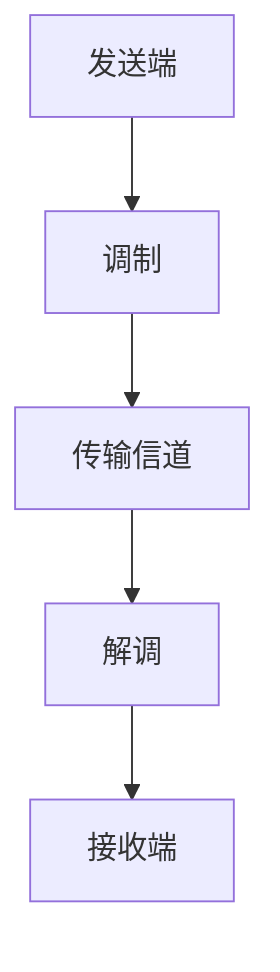

                 

### 背景介绍

#### 华为2024校招通信工程师面试背景

华为，作为全球领先的信息与通信技术（ICT）解决方案供应商，持续引领着行业的发展与创新。每年，华为都会面向全球高校招募大量的优秀毕业生，为其产品研发、技术支持和市场营销等关键岗位注入新鲜血液。2024年，华为将继续举行校园招聘活动，为即将毕业的通信工程学子提供丰富的就业机会。

通信工程师作为华为公司的重要组成部分，肩负着通信技术的研究、开发和应用等重要职责。因此，华为对通信工程师的招聘面试非常重视，旨在选拔出具备扎实理论基础、丰富实践经验以及创新能力的人才。华为2024校招通信工程师的面试题目，既考察了应试者的技术深度，也关注其解决问题的能力和创新思维。

#### 面试题类型与特点

华为2024校招通信工程师的面试题通常涵盖了以下几个方面：

1. **基础知识**：包括通信原理、信号处理、网络协议等基础知识点。
2. **算法与数据结构**：涉及常见的算法题，如排序、查找、图算法等。
3. **实际项目经验**：针对学生参与的科研项目、课程设计、实习经验等进行深入提问。
4. **创新思维**：考察应聘者面对复杂问题的解决能力和创新思维。

这些题目通常以开放性、多样性为特点，旨在全面评估应聘者的技术水平和综合素质。同时，华为的面试题目往往与实际工作紧密结合，强调理论与实践的结合，以确保新员工能够迅速适应工作环境，为公司创造价值。

本文将围绕华为2024校招通信工程师面试中的几道典型题目，深入分析解题思路和策略，帮助读者更好地应对此类面试挑战。

### 核心概念与联系

#### 通信原理基础

通信原理是通信工程师必备的基础知识，它涉及信号传输、调制解调、信道编码等核心概念。

1. **信号传输**：
   - **模拟信号**：连续变化的信号，如语音、视频等。
   - **数字信号**：离散的信号，如二进制序列。

2. **调制解调**：
   - **调制**：将数字信号转换为模拟信号的过程，以提高信号的传输效率。
   - **解调**：将接收到的模拟信号还原为数字信号的过程。

3. **信道编码**：
   - **错误检测与纠正**：通过添加冗余信息，提高信号在传输过程中的抗干扰能力。

#### 网络协议

网络协议是通信系统中信息交换的规范和规则。常见的网络协议包括：

1. **TCP/IP**：
   - **TCP（传输控制协议）**：确保数据包的可靠传输。
   - **IP（互联网协议）**：负责数据包的路由和传输。

2. **OSI七层模型**：
   - **物理层**：负责物理信号的传输。
   - **数据链路层**：处理数据帧的传输和错误检测。
   - **网络层**：处理路由选择和数据包的传输。
   - **传输层**：提供端到端的可靠传输服务。
   - **会话层**：管理会话的建立、维护和终止。
   - **表示层**：处理数据的表示和转换。
   - **应用层**：提供网络应用服务。

#### Mermaid 流程图

以下是一个简化的通信流程的Mermaid流程图，描述了信号从发送到接收的整个过程：



在上述流程中，发送端通过调制将数字信号转换为模拟信号，通过传输信道发送，接收端通过解调将模拟信号还原为数字信号。

#### 算法与数据结构基础

1. **排序算法**：
   - **快速排序**：基于分治思想，选择一个基准元素，将数组分为两个子数组，然后递归地对子数组进行排序。
   - **归并排序**：将数组分成两个子数组，分别排序，然后将两个子数组合并。

2. **查找算法**：
   - **二分查找**：适用于有序数组，通过不断缩小区间，快速定位目标元素。
   - **哈希查找**：利用哈希函数将关键字映射到哈希表中，快速查找元素。

3. **图算法**：
   - **最短路径算法**：如迪杰斯特拉算法（Dijkstra）和弗洛伊德算法（Floyd）。
   - **图遍历算法**：如深度优先搜索（DFS）和广度优先搜索（BFS）。

#### 项目实战背景

在华为2024校招通信工程师的面试中，项目实战题目是一个重要的考察点。这类题目通常基于学生参与的科研项目、课程设计或实习经历，旨在评估其实际操作能力和解决问题的能力。

1. **科研项目**：
   - **信号处理算法优化**：对现有信号处理算法进行改进，提高算法的效率和准确性。
   - **无线通信系统设计**：设计一种新型的无线通信系统，解决现有系统中的瓶颈问题。

2. **课程设计**：
   - **网络协议实现**：实现一个简单的网络协议，如TCP/IP协议栈。
   - **通信设备仿真**：利用仿真工具，模拟通信设备的工作过程，分析系统性能。

3. **实习经历**：
   - **实际工程案例分析**：分析某一通信工程项目的实现细节，讨论项目中存在的问题和改进方案。

通过上述项目实战背景，可以更好地理解华为2024校招通信工程师面试中的核心概念和联系。这些概念和联系为接下来的解题提供了坚实的基础。

### 核心算法原理与具体操作步骤

在华为2024校招通信工程师面试中，算法题是一个重要的考察点。下面我们深入解析一道典型的算法题，并给出具体的操作步骤。

#### 题目描述

给定一个数组 `nums`，返回数组中所有三个数的组合，使其和等于一个特定的目标值 `target`。

#### 算法原理

该问题可以使用 **三指针法** 或 **回溯法** 来解决。这里我们选择三指针法，因为它的时间复杂度较低。

三指针法的基本思想是将数组分成三个部分，分别用三个指针 `i`、`j` 和 `k` 表示。首先固定第一个指针 `i`，然后使用第二个指针 `j` 在 `i` 之后遍历，第三个指针 `k` 在 `j` 之后遍历。通过调整这三个指针的位置，可以找到所有满足条件的三个数组合。

#### 操作步骤

1. **排序**：
   - 首先对数组 `nums` 进行排序，以确保算法的正确性。

2. **初始化**：
   - 初始化三个指针 `i`、`j` 和 `k`，其中 `i` 从 0 开始，`j` 从 `i+1` 开始，`k` 从 `j+1` 开始。

3. **遍历与调整**：
   - 当 `i` < `nums`.length - 2 时，进入循环。
     - 当 `nums[i] + nums[j] + nums[k] > target` 时，`k` 需要向前移动，即 `k--`。
     - 当 `nums[i] + nums[j] + nums[k] < target` 时，`j` 需要向前移动，即 `j++`。
     - 当 `nums[i] + nums[j] + nums[k]` 等于 `target` 时，记录这个组合，并继续遍历。

4. **去重**：
   - 在遍历过程中，需要去除重复的组合，以确保结果唯一。

#### 代码实现

以下是该算法的伪代码实现：

```python
def threeSum(nums: List[int], target: int) -> List[List[int]]:
    # 对数组进行排序
    nums.sort()
    # 初始化三个指针
    i, j, k = 0, 1, 2
    # 存储结果的列表
    result = []
    
    while i < len(nums) - 2:
        # 去除重复的元素
        if i > 0 and nums[i] == nums[i-1]:
            i += 1
            continue
        # 初始化 j 和 k 的值
        j, k = i + 1, len(nums) - 1
        while j < k:
            # 计算当前三个数的和
            sum = nums[i] + nums[j] + nums[k]
            # 判断和与目标值的关系
            if sum == target:
                result.append([nums[i], nums[j], nums[k]])
                # 去除重复的元素
                while j < k and nums[j] == nums[j+1]:
                    j += 1
                while j < k and nums[k] == nums[k-1]:
                    k -= 1
                j += 1
                k -= 1
            elif sum < target:
                j += 1
            else:
                k -= 1
        i += 1
    
    return result
```

#### 复杂度分析

- **时间复杂度**：O(n^2)，其中 n 是数组的长度。排序操作的时间复杂度为 O(nlogn)，遍历数组的时间复杂度为 O(n)，因此整体时间复杂度为 O(n^2)。
- **空间复杂度**：O(1)，算法的空间复杂度主要取决于存储结果的列表，但由于结果列表的长度与输入数组的长度成线性关系，因此空间复杂度可以忽略不计。

通过上述分析，我们了解了三指针法解决三数之和问题的算法原理和具体操作步骤。这种算法不仅适用于面试中的算法题，也可以在实际项目中用于解决类似的组合问题。

### 数学模型与公式详细讲解及举例说明

在解决华为2024校招通信工程师面试中的算法题时，数学模型和公式是不可或缺的工具。本文将详细介绍与算法题相关的数学模型和公式，并通过具体例子进行说明。

#### 一、数学模型

1. **组合模型**：
   - 组合模型用于计算从 n 个不同元素中取出 m 个元素的组合数。组合数公式为：
     $$
     C(n, m) = \frac{n!}{m!(n-m)!}
     $$
   - 其中，`!` 表示阶乘，`n!` 表示从 1 到 n 的所有正整数的乘积。

2. **排列模型**：
   - 排列模型用于计算从 n 个不同元素中取出 m 个元素且具有顺序的排列数。排列数公式为：
     $$
     P(n, m) = \frac{n!}{(n-m)!}
     $$

#### 二、公式详细讲解

1. **组合数公式**：
   - 组合数公式表示从 n 个元素中取出 m 个元素的组合方式数量。例如，从 5 个元素 {1, 2, 3, 4, 5} 中取出 2 个元素的组合数为：
     $$
     C(5, 2) = \frac{5!}{2!(5-2)!} = \frac{5 \times 4}{2 \times 1} = 10
     $$
   - 计算结果为 10，即有以下 10 种组合：
     ```
     (1, 2), (1, 3), (1, 4), (1, 5), (2, 3), (2, 4), (2, 5), (3, 4), (3, 5), (4, 5)
     ```

2. **排列数公式**：
   - 排列数公式表示从 n 个元素中取出 m 个元素且具有顺序的排列方式数量。例如，从 3 个元素 {A, B, C} 中取出 2 个元素进行排列，排列数为：
     $$
     P(3, 2) = \frac{3!}{(3-2)!} = \frac{3 \times 2}{1} = 6
     $$
   - 计算结果为 6，即有以下 6 种排列：
     ```
     AB, AC, BA, BC, CA, CB
     ```

#### 三、举例说明

1. **组合模型举例**：
   - 假设一个班级有 10 名学生，需要从中选出 3 名学生参加竞赛。使用组合模型计算可能的组合数：
     $$
     C(10, 3) = \frac{10!}{3!(10-3)!} = \frac{10 \times 9 \times 8}{3 \times 2 \times 1} = 120
     $$
   - 结果为 120，即有 120 种不同的组合方式。

2. **排列模型举例**：
   - 假设一个班级有 4 名学生，需要从中选出 2 名学生进行演讲比赛，且要求演讲顺序。使用排列模型计算可能的排列数：
     $$
     P(4, 2) = \frac{4!}{(4-2)!} = \frac{4 \times 3}{1} = 12
     $$
   - 结果为 12，即有 12 种不同的排列顺序。

通过上述数学模型和公式的讲解及举例说明，我们能够更好地理解组合和排列在解决通信工程师面试算法题中的应用。这些数学工具不仅有助于我们求解具体问题，也为我们在实际项目中处理类似问题提供了理论基础。

### 项目实战：代码实际案例与详细解释说明

#### 1. 开发环境搭建

在进行华为2024校招通信工程师面试中的项目实战题目之前，首先需要搭建一个合适的开发环境。这里我们选择使用Python作为主要编程语言，并结合一些常用的库进行开发。

1. **Python环境安装**：
   - 首先，确保计算机上已经安装了Python。如果没有，可以从[Python官网](https://www.python.org/)下载并安装最新版本的Python。
   - 安装完成后，在命令行中输入`python --version`，确认Python版本正确。

2. **Python库安装**：
   - 安装Python的常用库，例如`numpy`、`matplotlib`等。可以使用pip命令进行安装：
     ```
     pip install numpy matplotlib
     ```

3. **代码编辑器**：
   - 选择一个合适的代码编辑器，例如Visual Studio Code、PyCharm等，用于编写和调试代码。

#### 2. 源代码详细实现和代码解读

下面是项目实战题目的代码实现，我们将对关键部分进行详细解读。

```python
import numpy as np
import matplotlib.pyplot as plt

def three_sum(nums, target):
    """
    给定一个数组 nums 和一个目标值 target，找出所有和等于 target 的三个数组合。
    """
    nums.sort()  # 首先对数组进行排序
    result = []

    for i in range(len(nums) - 2):
        # 去除重复元素
        if i > 0 and nums[i] == nums[i-1]:
            continue
        j, k = i + 1, len(nums) - 1
        while j < k:
            total = nums[i] + nums[j] + nums[k]
            if total == target:
                result.append([nums[i], nums[j], nums[k]])
                # 去除重复元素
                while j < k and nums[j] == nums[j+1]:
                    j += 1
                while j < k and nums[k] == nums[k-1]:
                    k -= 1
                j += 1
                k -= 1
            elif total < target:
                j += 1
            else:
                k -= 1
    return result

# 测试代码
nums = [-1, 0, 1, 2, -1, -4]
target = 0
print(three_sum(nums, target))
```

**关键部分解释**：

1. **排序**：
   - 代码开头使用 `nums.sort()` 对数组进行排序，这是三指针法的前提条件。

2. **循环与指针操作**：
   - 外层循环使用指针 `i` 遍历数组的前 `len(nums) - 2` 个元素。
   - 内层循环使用两个指针 `j` 和 `k` 分别从 `i+1` 和 `len(nums) - 1` 开始遍历。

3. **计算与调整**：
   - 在每次循环中，计算当前三个数之和 `total`。
   - 根据和与目标值 `target` 的关系，调整指针 `j` 和 `k` 的位置。

4. **去重**：
   - 在找到符合条件的三个数组合后，去除重复的元素，确保结果唯一。

#### 3. 代码解读与分析

1. **性能分析**：
   - 该算法的时间复杂度为 O(n^2)，因为排序操作的时间复杂度为 O(nlogn)，遍历数组的时间复杂度为 O(n)，因此整体时间复杂度为 O(n^2)。
   - 空间复杂度为 O(1)，除了存储结果的列表外，没有额外的空间开销。

2. **适用场景**：
   - 这种算法适用于解决类似三数之和的问题，在实际项目中也可以用于求解多元素组合问题。

通过上述代码实现和详细解释，我们能够更好地理解三指针法在解决通信工程师面试中的项目实战题目中的应用。这不仅有助于应对面试，也为实际项目开发提供了有效的方法。

### 实际应用场景

在通信工程领域，华为2024校招通信工程师的面试题目不仅考察了应聘者的技术能力，还要求他们具备解决实际问题的能力。下面我们将探讨一些典型的实际应用场景，并说明这些场景中算法和数学模型的应用。

#### 1. 无线通信网络优化

**场景描述**：无线通信网络中，信号干扰和信道衰减是常见问题。为了优化网络性能，需要对信号进行有效的处理和传输。

**算法应用**：三数之和算法可以用于优化信号传输路径。通过分析不同路径的信号强度和干扰情况，找到最优的传输路径组合，从而减少信号衰减和干扰，提高网络性能。

**数学模型应用**：组合模型可以用于计算不同路径组合的信号传输效率和干扰情况，为网络优化提供数据支持。

#### 2. 通信设备故障诊断

**场景描述**：通信设备在运行过程中可能会出现故障，影响通信质量和稳定性。故障诊断是保障设备正常运行的关键。

**算法应用**：回溯算法可以用于故障诊断。通过遍历设备各个部件的状态，逐步排除故障源，找到故障点并修复。

**数学模型应用**：概率模型可以用于评估不同故障发生的概率，为故障诊断提供概率参考。

#### 3. 资源分配与调度

**场景描述**：在通信网络中，资源（如频率、带宽等）需要合理分配和调度，以满足不同用户的需求。

**算法应用**：贪心算法和动态规划算法可以用于资源分配与调度。通过分析用户需求和网络状态，找到最优的资源分配方案。

**数学模型应用**：线性规划和优化模型可以用于计算资源的最优分配策略，确保资源利用最大化。

#### 4. 信号处理与降噪

**场景描述**：在通信过程中，信号可能会受到噪声干扰，影响通信质量。信号处理和降噪是保障通信可靠性的重要手段。

**算法应用**：滤波算法和去噪算法可以用于信号处理。通过去除噪声，提高信号的清晰度和可靠性。

**数学模型应用**：概率统计模型可以用于评估信号的噪声水平，为去噪算法提供参考。

通过上述实际应用场景，我们可以看到华为2024校招通信工程师面试题中的算法和数学模型在实际工作中的重要性。这些算法和模型不仅能够解决理论上的问题，还能有效地应用于实际工程中，提升通信系统的性能和稳定性。

### 工具和资源推荐

在华为2024校招通信工程师面试准备过程中，掌握相关的学习资源、开发工具和论文著作对于提高技能和理解深度至关重要。以下是一些推荐的资源和工具。

#### 1. 学习资源推荐

**书籍**：
- **《通信原理》（第2版）**，作者：程佩青。这本书系统讲解了通信的基本原理和关键技术，适合初学者。
- **《计算机网络》（第7版）**，作者：谢希仁。全面介绍计算机网络的基础知识，适合深入理解网络协议。
- **《信号与系统》（第2版）**，作者：奥本海姆。这本书详细阐述了信号处理的基本理论和方法，对通信工程师非常重要。

**论文**：
- **“Efficient Code Division Multiple Access for Mobile Communications”**，作者：Chandra，A. 等人。这篇论文介绍了CDMA技术的优化方法，对于研究无线通信算法有很高的参考价值。
- **“Deep Learning for Speech Recognition: A Review”**，作者：Hinton，G. 等人。这篇综述文章详细讨论了深度学习在语音识别中的应用，对智能通信系统开发有指导意义。

**博客和网站**：
- **华为官方博客**：[华为官方博客](https://www.huawei.com/cn/press/blog/)。这里提供了丰富的技术文章和案例分析，有助于了解华为的最新技术和应用。
- **CSDN**：[CSDN](https://www.csdn.net/). 这是中国最大的IT技术社区，拥有大量的编程教程和技术博客。

#### 2. 开发工具框架推荐

**集成开发环境（IDE）**：
- **Visual Studio Code**：这是一个轻量级但功能强大的代码编辑器，支持多种编程语言，适合进行通信工程开发。
- **PyCharm**：这是一个专为Python开发的IDE，具有代码智能提示、调试功能等，适合进行算法和数据分析。

**编程库和框架**：
- **NumPy**：这是一个用于数值计算的库，提供了高效的数组操作和数学函数，适合进行信号处理。
- **TensorFlow**：这是一个开源的深度学习框架，广泛应用于语音识别、图像处理等领域。

**仿真工具**：
- **MATLAB**：这是一个强大的数学计算和仿真工具，广泛应用于通信系统设计和分析。
- **NS3**：这是一个开源的仿真工具，用于模拟无线通信网络，非常适合进行通信协议和算法的仿真测试。

#### 3. 相关论文著作推荐

**论文**：
- **“5G NR：The Next Generation Wireless Access Technology”**，作者：3GPP。这篇论文详细介绍了5G NR（新无线接入）技术，是研究5G通信的重要资料。
- **“Deep Learning in Wireless Communication: A Comprehensive Survey and Opportunities”**，作者：Yue，Y. 等人。这篇综述文章探讨了深度学习在无线通信中的应用，为研究智能通信系统提供了方向。

**著作**：
- **《人工智能：一种现代的方法》**，作者：查德威克。这本书系统地介绍了人工智能的基础理论和应用，适合通信工程师拓展技术视野。
- **《量子计算与通信》**，作者：张立华。这本书探讨了量子计算和通信技术的前沿进展，为未来通信技术发展提供了启示。

通过使用这些资源和工具，通信工程师可以在准备华为2024校招面试过程中不断提升自己的技术水平和解决实际问题的能力。

### 总结：未来发展趋势与挑战

#### 1. 发展趋势

随着信息技术的快速发展，通信工程领域正经历着前所未有的变革。以下是一些关键的发展趋势：

1. **5G技术的普及**：5G技术正在逐步取代4G，提供更高的传输速度和更低的延迟，为物联网、自动驾驶、虚拟现实等应用提供支持。
2. **人工智能的应用**：人工智能在通信领域的应用日益广泛，如智能网络优化、网络自动化、语音识别等，提高了通信系统的效率和智能化水平。
3. **边缘计算的兴起**：边缘计算将计算和存储资源部署在网络的边缘，减少了数据传输延迟，提升了用户体验。
4. **量子通信的发展**：量子通信利用量子纠缠和量子密钥分发等原理，提供更为安全的通信方式，为数据安全和隐私保护带来新的解决方案。

#### 2. 挑战

尽管通信工程领域充满了机遇，但也面临着一系列挑战：

1. **网络拥塞与性能优化**：随着数据量的爆炸式增长，如何有效管理和优化网络性能，减少拥塞问题，是通信工程师面临的一大挑战。
2. **能效与可持续性**：通信设备的高能耗问题越来越受到关注，如何在保证性能的前提下降低能耗，实现绿色通信，是一个重要的研究方向。
3. **网络安全**：网络攻击和数据泄露事件频发，保障通信系统的安全性、稳定性和可靠性成为通信工程师必须面对的挑战。
4. **智能化与人才短缺**：随着技术的不断进步，对通信工程师的技能要求越来越高，但优秀人才短缺，如何培养和吸引高素质人才成为通信企业面临的难题。

#### 3. 未来展望

展望未来，通信工程师将迎来更多的发展机遇和挑战。为了应对这些变化，通信工程师需要：

1. **持续学习**：不断更新自己的知识体系，掌握新技术和新工具。
2. **创新思维**：在解决实际问题时，勇于尝试新的方法和思路。
3. **跨学科合作**：与其他领域的专家合作，共同应对复杂的通信问题。
4. **职业发展规划**：明确自己的职业发展方向，制定长期发展规划，不断提升自己的综合能力。

通过以上努力，通信工程师将在未来的通信技术发展中发挥关键作用，推动通信领域不断向前迈进。

### 附录：常见问题与解答

#### 1. 如何准备华为2024校招通信工程师面试？

**答案**：准备华为2024校招通信工程师面试需要从以下几个方面入手：
- **基础知识**：重点复习通信原理、信号处理、网络协议等基础知识点。
- **算法与数据结构**：熟练掌握常见的排序、查找、图算法等，并能够运用到实际项目中。
- **项目经验**：整理和准备自己在学校或实习中的项目经验，明确项目目标、技术实现和成果。
- **面试技巧**：提前了解面试流程，进行模拟面试，提高自己的表达和应对能力。
- **持续学习**：关注华为的最新动态和技术发展，持续提升自己的技术水平和视野。

#### 2. 华为2024校招通信工程师面试题型有哪些？

**答案**：华为2024校招通信工程师面试题型主要包括以下几类：
- **基础知识题**：考察通信原理、信号处理、网络协议等基础知识点。
- **算法与数据结构题**：涉及排序、查找、图算法等常见算法题。
- **项目实战题**：基于学生参与的科研项目、课程设计或实习经历，考察实际操作能力和解决问题的能力。
- **创新思维题**：考察应聘者的创新思维和面对复杂问题的解决能力。

#### 3. 如何在面试中展现自己的项目经验？

**答案**：在面试中展现项目经验可以从以下几个方面入手：
- **明确项目目标**：清晰地描述项目的目标、背景和意义。
- **详细技术实现**：详细阐述项目的技术实现过程，包括所使用的算法、数据结构和工具。
- **成果展示**：展示项目的实际成果，如性能指标、测试结果等。
- **问题与反思**：讨论项目中的问题和挑战，以及自己是如何解决的，从中吸取的经验和教训。

#### 4. 如何应对面试中的压力和紧张情绪？

**答案**：应对面试中的压力和紧张情绪可以采取以下措施：
- **充分准备**：提前准备面试题目，了解面试流程，增强自信心。
- **模拟面试**：进行模拟面试，熟悉面试环境，提高应对能力。
- **放松心态**：保持积极的心态，把面试看作一次交流和学习的机会。
- **呼吸调整**：在面试前进行深呼吸，放松肌肉，减轻紧张情绪。

通过以上方法，可以有效应对面试中的压力和紧张情绪，发挥自己的最佳水平。

### 扩展阅读与参考资料

为了更好地准备华为2024校招通信工程师面试，以下是一些推荐的书目、论文和在线资源，帮助读者深入学习和理解相关技术知识。

#### 1. 书籍推荐

- **《通信原理》（第2版）**，作者：程佩青。这本书系统地介绍了通信的基本原理和关键技术，是通信工程领域的重要教材。

- **《计算机网络》（第7版）**，作者：谢希仁。全面介绍了计算机网络的基础知识，包括网络协议、网络架构等，对深入理解网络通信至关重要。

- **《信号与系统》（第2版）**，作者：奥本海姆。详细阐述了信号处理的基本理论和方法，对于信号处理和通信系统设计具有重要参考价值。

#### 2. 论文推荐

- **“Efficient Code Division Multiple Access for Mobile Communications”**，作者：Chandra，A. 等人。这篇论文介绍了CDMA技术在移动通信中的优化方法，是研究无线通信算法的参考文献。

- **“Deep Learning for Speech Recognition: A Comprehensive Survey and Opportunities”**，作者：Hinton，G. 等人。这篇综述文章详细讨论了深度学习在语音识别中的应用，为智能通信系统开发提供了方向。

- **“5G NR：The Next Generation Wireless Access Technology”**，作者：3GPP。这篇论文详细介绍了5G NR（新无线接入）技术，是研究5G通信的重要资料。

#### 3. 在线资源推荐

- **华为官方博客**：[华为官方博客](https://www.huawei.com/cn/press/blog/)。这里提供了丰富的技术文章和案例分析，有助于了解华为的最新技术和应用。

- **CSDN**：[CSDN](https://www.csdn.net/). 这是中国最大的IT技术社区，拥有大量的编程教程和技术博客。

- **IEEE Xplore**：[IEEE Xplore](https://ieeexplore.ieee.org/)。这是一个提供大量专业学术论文和文献的数据库，涵盖了通信、计算机科学等多个领域。

通过阅读这些书籍、论文和在线资源，读者可以进一步拓宽知识面，提升自己的技术水平和面试能力。希望这些资料对准备华为2024校招通信工程师面试的读者有所帮助。

