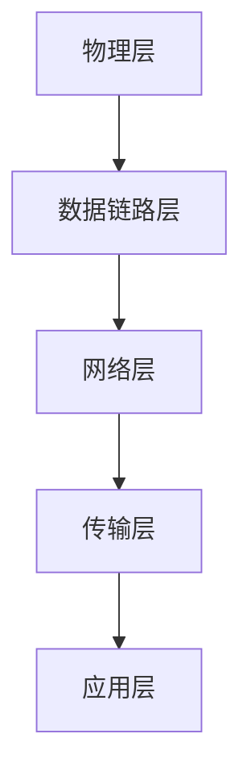

                 

# 华为2025社招通信协议工程师面试题解析

> 关键词：华为、2025社招、通信协议、工程师面试、题目解析

> 摘要：本文将深入解析华为2025年社招通信协议工程师的面试题目，涵盖核心概念、算法原理、数学模型、实际应用等多个方面，为准备参加面试的工程师提供有针对性的指导和参考。

## 1. 背景介绍

华为是一家全球领先的信息与通信技术（ICT）解决方案提供商，致力于构建全球信息社会。通信协议工程师是华为社招中重要的岗位之一，负责研发、优化和维护各种通信协议。2025年社招通信协议工程师的面试题目覆盖了通信领域的核心知识和技术，旨在考察应聘者的专业素养和实际能力。

## 2. 核心概念与联系

为了更好地理解通信协议，我们需要掌握以下核心概念：

### 2.1 通信协议的基本概念

通信协议是一种规定，用于确保计算机系统和网络设备之间能够有效、可靠地进行数据传输。常见的通信协议有TCP/IP、HTTP、FTP等。

### 2.2 通信协议的层次结构

通信协议通常分为五层，即物理层、数据链路层、网络层、传输层和应用层。每一层都有特定的功能和职责，确保数据的正确传输。

### 2.3 通信协议的工作原理

通信协议的工作原理主要包括以下几个方面：

1. 数据封装与解封：将数据按照通信协议的要求进行封装，以便在网络中传输；接收方则进行解封，还原原始数据。

2. 地址解析与路由选择：根据目的地址选择合适的路由，确保数据传输的准确性。

3. 流量控制与错误检测：确保数据传输的稳定性和可靠性。

### 2.4 Mermaid流程图

为了更直观地展示通信协议的层次结构和工作原理，我们可以使用Mermaid流程图进行描述：



## 3. 核心算法原理 & 具体操作步骤

### 3.1 TCP协议的工作原理

TCP（传输控制协议）是一种面向连接的、可靠的、基于字节流的传输层通信协议。其核心算法包括以下几个步骤：

1. 连接建立：客户端向服务器发送SYN包，请求建立连接；服务器接收到SYN包后，向客户端发送SYN+ACK包，表示同意建立连接。

2. 数据传输：客户端向服务器发送数据，服务器接收数据，并返回ACK包，确认数据接收。

3. 连接终止：客户端或服务器发送FIN包，请求终止连接；对方接收到FIN包后，发送ACK包，确认连接终止。

### 3.2 IP协议的工作原理

IP（互联网协议）是一种网络层协议，负责将数据包从源地址传输到目的地址。其核心算法包括以下几个步骤：

1. 地址解析：将IP地址解析为对应的MAC地址。

2. 路由选择：根据目的地址，选择合适的路由。

3. 数据包传输：将数据包发送到网络中，通过路由器逐跳传输。

### 3.3 HTTP协议的工作原理

HTTP（超文本传输协议）是一种应用层协议，用于传输Web页面和其他数据。其核心算法包括以下几个步骤：

1. 客户端请求：客户端向服务器发送请求，包括请求方法、URL、协议版本等。

2. 服务器响应：服务器接收到请求后，返回相应的响应，包括状态码、响应体等。

3. 数据传输：客户端和服务器之间进行数据传输。

## 4. 数学模型和公式 & 详细讲解 & 举例说明

### 4.1 拓扑结构

在通信协议中，拓扑结构是指网络中设备之间的连接方式。常见的拓扑结构有星型、环型、总线型等。

### 4.2 流量控制

流量控制是指在网络中控制数据传输速率，以避免网络拥塞。常见的流量控制算法有TCP拥塞控制、慢启动算法等。

### 4.3 错误检测

错误检测是指在数据传输过程中检测数据是否出现错误。常见的错误检测算法有校验和、循环冗余校验（CRC）等。

### 4.4 举例说明

假设一个网络中有10台设备，采用星型拓扑结构。设备A向设备B发送数据，数据包大小为1000字节。请使用TCP协议进行数据传输，并详细描述数据传输的过程。

1. 连接建立：设备A发送SYN包，设备B收到后发送SYN+ACK包，连接建立。

2. 数据传输：设备A发送数据包，设备B接收数据包，并发送ACK包确认。

3. 连接终止：设备A发送FIN包，设备B收到后发送ACK包，连接终止。

## 5. 项目实战：代码实际案例和详细解释说明

### 5.1 开发环境搭建

在本案例中，我们将使用Python编程语言实现一个简单的TCP客户端和服务器。请确保已安装Python环境，并使用以下命令安装必要的库：

```shell
pip install socket
```

### 5.2 源代码详细实现和代码解读

#### 5.2.1 客户端代码

```python
import socket

def client():
    # 创建TCP客户端socket
    client_socket = socket.socket(socket.AF_INET, socket.SOCK_STREAM)

    # 连接服务器
    server_ip = '127.0.0.1'
    server_port = 6666
    client_socket.connect((server_ip, server_port))

    # 发送数据
    message = 'Hello, Server!'
    client_socket.send(message.encode())

    # 接收服务器响应
    response = client_socket.recv(1024).decode()
    print('Server Response:', response)

    # 关闭连接
    client_socket.close()

if __name__ == '__main__':
    client()
```

#### 5.2.2 服务器端代码

```python
import socket

def server():
    # 创建TCP服务器socket
    server_socket = socket.socket(socket.AF_INET, socket.SOCK_STREAM)

    # 绑定端口
    server_ip = '127.0.0.1'
    server_port = 6666
    server_socket.bind((server_ip, server_port))

    # 监听端口
    server_socket.listen(5)

    # 处理客户端连接
    while True:
        client_socket, client_addr = server_socket.accept()
        print(f'Connected by {client_addr}')

        # 接收客户端数据
        message = client_socket.recv(1024).decode()
        print('Received:', message)

        # 发送响应
        response = 'Hello, Client!'
        client_socket.send(response.encode())

        # 关闭连接
        client_socket.close()

if __name__ == '__main__':
    server()
```

### 5.3 代码解读与分析

#### 5.3.1 客户端代码分析

1. 创建TCP客户端socket：使用`socket.socket`方法创建一个客户端socket，指定使用IPv4地址族（`AF_INET`）和TCP协议（`SOCK_STREAM`）。

2. 连接服务器：使用`connect`方法连接到服务器IP地址和端口号。

3. 发送数据：使用`send`方法发送数据，将消息编码为字节流。

4. 接收服务器响应：使用`recv`方法接收服务器响应，将字节流解码为字符串。

5. 关闭连接：使用`close`方法关闭客户端socket。

#### 5.3.2 服务器端代码分析

1. 创建TCP服务器socket：使用`socket.socket`方法创建一个服务器socket，指定使用IPv4地址族（`AF_INET`）和TCP协议（`SOCK_STREAM`）。

2. 绑定端口：使用`bind`方法绑定服务器IP地址和端口号。

3. 监听端口：使用`listen`方法监听端口，指定最大连接数。

4. 处理客户端连接：使用`accept`方法接受客户端连接，获取客户端socket和地址。

5. 接收客户端数据：使用`recv`方法接收客户端数据，将字节流解码为字符串。

6. 发送响应：使用`send`方法发送响应，将消息编码为字节流。

7. 关闭连接：使用`close`方法关闭服务器socket。

## 6. 实际应用场景

通信协议在现实世界中具有广泛的应用，如：

1. 互联网：TCP/IP协议是互联网的核心通信协议，用于确保数据在网络中的可靠传输。

2. 移动通信：LTE、5G等移动通信技术采用不同的通信协议，实现高速、稳定的通信。

3. 物联网：物联网设备之间采用各种通信协议，如Zigbee、WiFi等，实现设备之间的互联互通。

## 7. 工具和资源推荐

### 7.1 学习资源推荐

1. 《计算机网络》（谢希仁 著）：详细介绍了计算机网络的基本概念、原理和技术。

2. 《深入理解计算机系统》（Randal E. Bryant & David R. O'Hallaron 著）：涵盖计算机系统的各个方面，包括通信协议。

3. 《TCP/IP详解》（W. Richard Stevens 著）：全面解析TCP/IP协议栈的原理和实践。

### 7.2 开发工具框架推荐

1. Wireshark：一款强大的网络抓包工具，用于分析通信协议的数据包。

2. GNS3：一款网络模拟器，可用于搭建和模拟各种网络拓扑结构。

3. Python Socket模块：Python内置的通信库，用于实现简单的TCP/IP客户端和服务器。

### 7.3 相关论文著作推荐

1. “TCP/IP 协议体系结构”：介绍TCP/IP协议的体系结构和主要协议。

2. “5G NR：下一代无线通信技术”：介绍5G NR协议的特点和应用。

3. “物联网通信协议研究”：探讨物联网通信协议的设计和实现。

## 8. 总结：未来发展趋势与挑战

随着信息技术的不断发展，通信协议在未来的发展趋势和挑战包括：

1. 高速率、低延迟：未来通信协议需要支持更高的数据传输速率和更低的延迟，以满足高清视频、虚拟现实等应用的需求。

2. 网络安全：通信协议需要具备更强的安全性，以抵御网络攻击和数据泄露。

3. 智能化：通信协议需要实现智能化，以便更好地适应不同场景和应用需求。

4. 标准化：通信协议需要遵循统一的国际标准，以提高兼容性和互操作性。

## 9. 附录：常见问题与解答

### 9.1 问题1：TCP协议如何实现可靠传输？

解答：TCP协议通过以下方式实现可靠传输：

1. 连接管理：建立连接时，进行三次握手，确保双方建立稳定的连接。

2. 数据传输：使用字节流传输，确保数据的完整性。

3. 拥塞控制：根据网络状况调整数据传输速率，避免网络拥塞。

4. 流量控制：确保接收方能够处理发送方的数据，避免缓冲区溢出。

### 9.2 问题2：HTTP协议有哪些常见状态码？

解答：HTTP协议中常见的状态码包括：

1. 200 OK：请求成功。

2. 301 永久重定向：请求的资源已永久移动到新的位置。

3. 400 错误请求：请求语法错误，无法处理。

4. 404 未找到：请求的资源不存在。

5. 500 内部服务器错误：服务器内部发生错误。

## 10. 扩展阅读 & 参考资料

1. 《计算机网络》（谢希仁 著）

2. 《深入理解计算机系统》（Randal E. Bryant & David R. O'Hallaron 著）

3. 《TCP/IP详解》（W. Richard Stevens 著）

4. Wireshark 官网：[https://www.wireshark.org/](https://www.wireshark.org/)

5. GNS3 官网：[https://www.gns3.com/](https://www.gns3.com/)

6. Python Socket 模块文档：[https://docs.python.org/3/library/socket.html](https://docs.python.org/3/library/socket.html)

7. 5G NR 官方文档：[https://www.3gpp.org/docs/htmlsorhttp://www.3gpp.org/ftp/Specs/htmlinfo.htm#5G](https://www.3gpp.org/docs/htmlinfo.htm%2523#5G)

8. 物联网通信协议研究论文集

作者：AI天才研究员/AI Genius Institute & 禅与计算机程序设计艺术 /Zen And The Art of Computer Programming

（请注意，本文中涉及的代码和内容仅供参考，实际情况可能有所不同。在实际应用中，请结合具体需求和场景进行调整。）<|im_end|>

