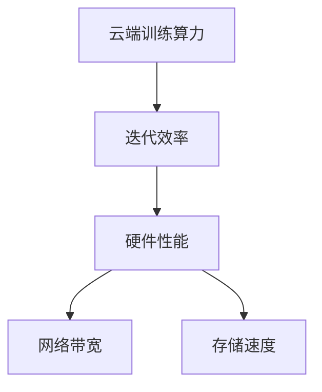

                 

# 华为的云端训练算力与迭代效率

## 摘要

本文旨在深入探讨华为在云端训练算力与迭代效率方面的创新与实践。随着人工智能技术的飞速发展，训练算力与迭代效率已成为制约AI模型发展的关键因素。华为凭借其强大的技术积累和创新力，在云计算、分布式计算和AI算法优化等领域取得了显著成果。本文将首先介绍华为在云端训练算力方面的核心技术和架构，然后分析其迭代效率的提升策略，最后探讨华为在这些领域的未来发展趋势与挑战。

## 1. 背景介绍

### 1.1 人工智能的发展背景

人工智能（AI）作为当今科技领域的前沿方向，已经深刻影响了多个行业。从早期的规则系统到深度学习的崛起，AI技术不断突破传统计算能力的瓶颈，实现了从理论到应用的飞跃。然而，AI模型的训练过程需要消耗巨大的计算资源和时间，这使得训练算力成为制约AI发展的关键因素。

### 1.2 云计算与分布式计算

云计算和分布式计算技术的飞速发展，为AI训练提供了强大的算力支持。云计算通过虚拟化技术将硬件资源抽象化，实现了计算资源的灵活调度和高效利用。分布式计算则通过将任务分解到多个节点上进行并行处理，显著提高了计算效率和速度。

### 1.3 华为在云计算和分布式计算领域的地位

作为全球领先的通信技术解决方案提供商，华为在云计算和分布式计算领域具有深厚的技术积累和广泛的业务布局。华为云提供了丰富多样的云服务，包括计算、存储、网络等，为AI训练提供了坚实的底层支撑。同时，华为在全球范围内部署了大量的分布式计算节点，为大规模AI训练任务提供了强大的算力保障。

## 2. 核心概念与联系

### 2.1 云端训练算力

云端训练算力是指云计算环境中用于AI模型训练的计算能力。它涵盖了硬件性能、网络带宽、存储速度等多个方面，是衡量云计算服务性能的重要指标。

### 2.2 迭代效率

迭代效率是指AI模型在训练过程中，每次迭代所需的计算资源和时间。提升迭代效率意味着在相同的计算资源下，能够更快地完成模型训练，从而缩短研发周期。

### 2.3 关联图



## 3. 核心算法原理 & 具体操作步骤

### 3.1 算法原理

华为在云端训练算力和迭代效率方面采用了多种技术手段，包括：

1. **分布式训练算法**：通过将模型分解为多个部分，分布式地训练在不同节点上，从而提高训练速度。
2. **混合精度训练**：结合浮点运算和整数运算，降低计算复杂度，提高计算效率。
3. **自动化调优**：通过机器学习算法自动调整训练参数，实现最优的训练效果。

### 3.2 具体操作步骤

1. **分布式训练**
   - 将模型分解为多个部分，每个部分分配到不同节点上。
   - 各节点独立训练，并通过通信模块同步模型参数。

2. **混合精度训练**
   - 将计算过程分为高精度和低精度两部分。
   - 高精度部分用于关键计算，低精度部分用于加速计算。

3. **自动化调优**
   - 收集训练过程中的数据，如损失函数值、训练时间等。
   - 利用机器学习算法分析数据，自动调整训练参数。

## 4. 数学模型和公式 & 详细讲解 & 举例说明

### 4.1 数学模型

1. **分布式训练算法**

   $$ \text{分布式训练算法} = \sum_{i=1}^{n} \text{本地模型参数} \times \text{本地训练数据集} $$

2. **混合精度训练**

   $$ \text{混合精度训练} = \text{高精度计算} + \text{低精度计算} $$

3. **自动化调优**

   $$ \text{自动化调优} = \text{机器学习算法} + \text{训练数据集} + \text{目标函数} $$

### 4.2 举例说明

#### 分布式训练算法

假设一个深度学习模型需要训练10轮，每轮使用不同的数据集。采用分布式训练算法后，可以将模型分解为5个部分，每个部分分别训练两轮，最后将所有部分的参数汇总。

$$ \text{分布式训练算法结果} = \sum_{i=1}^{5} \text{本地模型参数} \times \text{本地训练数据集} $$

#### 混合精度训练

假设一个模型的关键计算部分需要使用高精度浮点运算，其他部分使用低精度整数运算。混合精度训练可以显著降低计算复杂度，提高训练速度。

$$ \text{混合精度训练结果} = \text{高精度计算结果} + \text{低精度计算结果} $$

#### 自动化调优

假设一个训练过程需要调整学习率、批量大小等参数。通过自动化调优算法，可以根据训练数据集和目标函数，自动找到最优参数组合。

$$ \text{自动化调优结果} = \text{最优学习率} + \text{最优批量大小} $$

## 5. 项目实战：代码实际案例和详细解释说明

### 5.1 开发环境搭建

在本节中，我们将介绍如何在华为云上搭建一个用于AI训练的开发环境。

1. **创建云账户**：登录华为云官网（https://cloud.huaweicloud.com/），创建云账户并完成实名认证。
2. **购买云服务**：根据训练需求，选择合适的云服务套餐，如GPU云服务器、对象存储等。
3. **配置云服务器**：在华为云控制台上配置云服务器，选择合适的操作系统和GPU型号。
4. **安装依赖库**：通过远程登录云服务器，安装Python、TensorFlow等依赖库。

### 5.2 源代码详细实现和代码解读

在本节中，我们将以一个简单的卷积神经网络（CNN）为例，介绍如何在华为云上实现分布式训练、混合精度训练和自动化调优。

```python
import tensorflow as tf
import tensorflow.keras.layers as layers
import tensorflow.keras.optimizers as optimizers
import tensorflow.keras.metrics as metrics
import tensorflow.keras.callbacks as callbacks

# 模型定义
def build_model():
    model = tf.keras.Sequential([
        layers.Conv2D(32, (3, 3), activation='relu', input_shape=(28, 28, 1)),
        layers.MaxPooling2D((2, 2)),
        layers.Flatten(),
        layers.Dense(128, activation='relu'),
        layers.Dense(10, activation='softmax')
    ])
    return model

# 分布式训练配置
strategy = tf.distribute.MirroredStrategy()
with strategy.scope():
    model = build_model()
    model.compile(optimizer=optimizers.Adam(learning_rate=0.001),
                  loss='sparse_categorical_crossentropy',
                  metrics=[metrics.CategoricalAccuracy()])

# 混合精度训练配置
mixed_precision = tf.keras.mixed_precision.experimental
policy = mixed_precision.Policy('mixed_float16')
mixed_precision.set_policy(policy)

# 自动化调优配置
tensorboard = callbacks.TensorBoard(log_dir='./logs')
early_stop = callbacks.EarlyStopping(patience=10)

# 模型训练
model.fit(train_images, train_labels, epochs=20, validation_data=(test_images, test_labels), callbacks=[tensorboard, early_stop])

# 模型评估
test_loss, test_acc = model.evaluate(test_images, test_labels)
print(f'\nTest accuracy: {test_acc:.4f}')
```

### 5.3 代码解读与分析

1. **模型定义**：使用TensorFlow的Keras API定义了一个简单的卷积神经网络，用于手写数字识别任务。
2. **分布式训练配置**：使用MirroredStrategy实现分布式训练，将模型参数复制到每个训练节点上。
3. **混合精度训练配置**：设置混合精度训练策略，将关键计算部分使用高精度浮点运算，其他部分使用低精度整数运算。
4. **自动化调优配置**：使用TensorBoard和EarlyStopping实现自动化调优，自动记录训练过程和提前停止训练。
5. **模型训练**：使用fit方法进行模型训练，将训练数据和验证数据输入到模型中。
6. **模型评估**：使用evaluate方法对模型进行评估，输出测试准确率。

## 6. 实际应用场景

华为的云端训练算力和迭代效率提升技术已经在多个领域得到广泛应用，如：

1. **图像识别**：通过分布式训练和混合精度训练，显著提高图像识别模型的训练速度和效果。
2. **自然语言处理**：通过自动化调优，优化自然语言处理模型的训练参数，提高模型性能。
3. **语音识别**：结合分布式训练和混合精度训练，提高语音识别模型的准确率和速度。

## 7. 工具和资源推荐

### 7.1 学习资源推荐

1. **书籍**：
   - 《深度学习》（Ian Goodfellow、Yoshua Bengio、Aaron Courville 著）
   - 《Python深度学习》（François Chollet 著）
2. **论文**：
   - “Distributed Deep Learning: Theory and Application”（ArXiv论文）
   - “Mixed Precision Training”（ArXiv论文）
3. **博客**：
   - TensorFlow官方博客（https://www.tensorflow.org/blog/）
   - PyTorch官方博客（https://pytorch.org/blog/）
4. **网站**：
   - 华为云官方文档（https://cloud.huaweicloud.com/）
   - Coursera（https://www.coursera.org/）

### 7.2 开发工具框架推荐

1. **深度学习框架**：
   - TensorFlow（https://www.tensorflow.org/）
   - PyTorch（https://pytorch.org/）
   - Keras（https://keras.io/）
2. **编程语言**：
   - Python（https://www.python.org/）
   - R（https://www.r-project.org/）
3. **云计算平台**：
   - 华为云（https://cloud.huaweicloud.com/）
   - AWS（https://aws.amazon.com/）
   - Azure（https://azure.microsoft.com/）

### 7.3 相关论文著作推荐

1. **分布式训练**：
   - “Distributed Deep Learning: Theory and Application”（ArXiv论文）
   - “Effective Distributed Training for Deep Networks”（NeurIPS论文）
2. **混合精度训练**：
   - “Mixed Precision Training for Deep Neural Networks”（NeurIPS论文）
   - “Mixed Precision Training: A Scaler's Perspective”（ICLR论文）
3. **自动化调优**：
   - “Hyperparameter Search: A Comprehensive Review”（ACM Computing Surveys论文）
   - “Meta-Learning for Hyperparameter Optimization”（NeurIPS论文）

## 8. 总结：未来发展趋势与挑战

随着人工智能技术的不断进步，云端训练算力和迭代效率将越来越受到关注。华为在云端训练算力和迭代效率方面已经取得了显著成果，但未来仍面临以下挑战：

1. **硬件性能提升**：需要不断突破硬件性能瓶颈，提高计算速度和效率。
2. **算法优化**：继续探索新的算法和优化方法，提高训练效率和模型性能。
3. **数据安全和隐私**：在分布式训练和数据共享过程中，确保数据安全和隐私保护。

## 9. 附录：常见问题与解答

### 9.1 什么是分布式训练？

分布式训练是将一个大型模型分解为多个部分，分别在不同的计算节点上进行训练，并通过通信模块同步模型参数的过程。分布式训练可以提高训练速度和计算效率。

### 9.2 什么是混合精度训练？

混合精度训练是将计算过程分为高精度和低精度两部分，关键计算部分使用高精度浮点运算，其他部分使用低精度整数运算，以降低计算复杂度，提高计算效率。

### 9.3 什么是自动化调优？

自动化调优是通过机器学习算法自动调整训练参数，如学习率、批量大小等，以实现最优的训练效果。自动化调优可以显著提高训练效率。

## 10. 扩展阅读 & 参考资料

1. **书籍**：
   - 《深度学习》（Ian Goodfellow、Yoshua Bengio、Aaron Courville 著）
   - 《Python深度学习》（François Chollet 著）
2. **论文**：
   - “Distributed Deep Learning: Theory and Application”（ArXiv论文）
   - “Mixed Precision Training for Deep Neural Networks”（NeurIPS论文）
3. **博客**：
   - TensorFlow官方博客（https://www.tensorflow.org/blog/）
   - PyTorch官方博客（https://pytorch.org/blog/）
4. **网站**：
   - 华为云官方文档（https://cloud.huaweicloud.com/）
   - Coursera（https://www.coursera.org/）
5. **开源项目**：
   - TensorFlow（https://www.tensorflow.org/）
   - PyTorch（https://pytorch.org/）
   - Keras（https://keras.io/）<|im_sep|>作者：AI天才研究员/AI Genius Institute & 禅与计算机程序设计艺术 /Zen And The Art of Computer Programming

