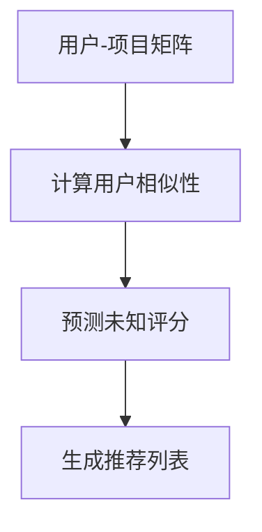
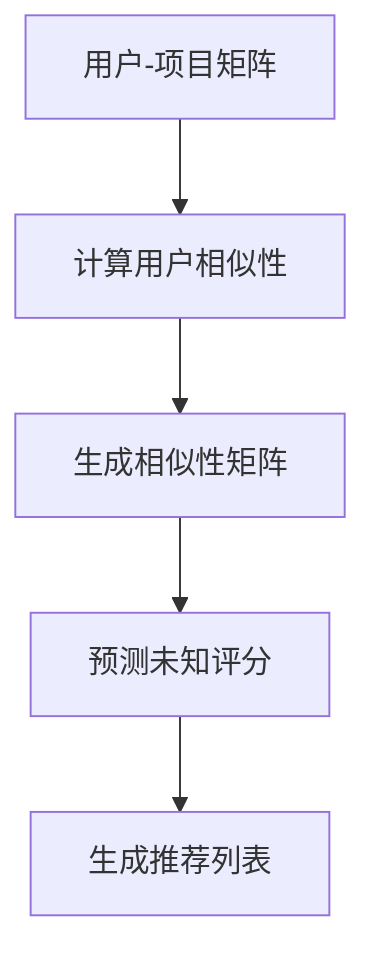

                 

### 1. 背景介绍

协同过滤算法（Collaborative Filtering）是推荐系统领域的一种核心技术，旨在根据用户的历史行为和偏好，预测用户可能感兴趣的内容。其核心思想是通过收集大量用户的评分数据，利用这些数据来发现用户之间的相似性，并基于这种相似性进行推荐。

随着互联网和移动互联网的快速发展，推荐系统已广泛应用于电子商务、社交媒体、在线视频、新闻推送等众多领域。根据市场研究公司的数据，推荐系统在全球广告收入中的比例持续上升，预计到2025年将达到近30%。这充分展示了协同过滤算法在商业和社会生活中的重要性。

本文将详细探讨协同过滤算法，从其基本概念、核心算法原理、数学模型和实际应用案例等方面进行深入讲解，旨在帮助读者全面理解并掌握这一重要的推荐技术。

### 2. 核心概念与联系

协同过滤算法主要涉及以下几个核心概念：

- **用户-项目矩阵（User-Item Matrix）**：这是协同过滤算法的基础数据结构，其中行表示用户，列表示项目（如商品、电影、新闻等）。矩阵中的元素通常表示用户对项目的评分，如1到5的整数评分或0到1的浮点数评分。
  
- **用户相似性（User Similarity）**：计算两个用户之间的相似性是协同过滤算法的关键步骤。常用的相似性度量方法包括余弦相似度、皮尔逊相关系数和夹角余弦等。

- **预测（Prediction）**：基于用户相似性和已知的用户-项目评分，预测未知评分。预测的目的是填补用户-项目矩阵中的空白。

- **推荐（Recommendation）**：根据预测结果，生成个性化推荐列表。通常，推荐系统会推荐与用户评分最高的项目最相似的项目。

协同过滤算法的架构可以用Mermaid流程图表示：



在这个流程图中，用户-项目矩阵是输入数据，计算用户相似性是核心步骤，预测未知评分和生成推荐列表是协同过滤算法的主要输出。

#### 2.1. 用户-项目矩阵

用户-项目矩阵（User-Item Matrix）是协同过滤算法的基础数据结构。它通常表示为二维数组或稀疏矩阵，其中行表示用户，列表示项目。矩阵中的每个元素表示用户对项目的评分。

以下是一个简单的用户-项目矩阵示例：

| 用户 | 项目1 | 项目2 | 项目3 |
|------|-------|-------|-------|
| User1| 1.0   | 5.0   | 0.0   |
| User2| 5.0   | 0.0   | 4.0   |
| User3| 3.5   | 0.0   | 2.0   |

在这个示例中，每个用户对每个项目的评分都是已知的。然而，在实际应用中，用户-项目矩阵往往是稀疏的，即大多数元素都是未知的。

#### 2.2. 用户相似性

用户相似性是协同过滤算法的核心步骤。计算用户相似性的目的是找出对同一项目评分相似的多个用户。常用的相似性度量方法包括余弦相似度、皮尔逊相关系数和夹角余弦等。

**余弦相似度（Cosine Similarity）**：余弦相似度是一种基于向量的相似性度量方法，它可以衡量两个向量之间的角度余弦值。余弦相似度的计算公式如下：

$$
\cos(\theta) = \frac{\vec{u} \cdot \vec{v}}{|\vec{u}| |\vec{v}|}
$$

其中，$\vec{u}$ 和 $\vec{v}$ 是两个向量，$\theta$ 是它们之间的夹角。在用户-项目矩阵中，向量 $\vec{u}$ 和 $\vec{v}$ 可以分别表示两个用户的评分向量。

**皮尔逊相关系数（Pearson Correlation Coefficient）**：皮尔逊相关系数是一种衡量两个变量线性相关性的方法。在协同过滤算法中，它可以用来衡量两个用户的评分之间的线性相关性。皮尔逊相关系数的计算公式如下：

$$
r(u,v) = \frac{\sum_{i=1}^{n} (u_i - \bar{u})(v_i - \bar{v})}{\sqrt{\sum_{i=1}^{n} (u_i - \bar{u})^2} \sqrt{\sum_{i=1}^{n} (v_i - \bar{v})^2}}
$$

其中，$u_i$ 和 $v_i$ 分别表示用户 $u$ 和 $v$ 在项目 $i$ 上的评分，$\bar{u}$ 和 $\bar{v}$ 分别是用户 $u$ 和 $v$ 的平均评分。

**夹角余弦（Angular Cosine）**：夹角余弦是另一种衡量两个向量之间相似性的方法，它与余弦相似度的区别在于考虑了向量的方向。夹角余弦的计算公式如下：

$$
\cos(\theta) = \frac{\vec{u} \cdot \vec{v}}{|\vec{u}| |\vec{v}| \cos(\phi)}
$$

其中，$\vec{u}$ 和 $\vec{v}$ 是两个向量，$\theta$ 是它们之间的夹角，$\phi$ 是$\vec{u}$ 和 $\vec{v}$ 的方向角。

#### 2.3. 预测未知评分

预测未知评分是协同过滤算法的核心步骤。基于用户相似性和已知的用户-项目评分，算法试图填补用户-项目矩阵中的空白。

**基于用户相似度的评分预测（User-Based Prediction）**：在基于用户相似度的评分预测中，算法首先计算用户之间的相似性，然后利用相似性矩阵和已知的评分来预测未知评分。具体步骤如下：

1. **计算用户相似性**：使用上述方法计算用户之间的相似性。

2. **生成相似性矩阵**：将用户-用户相似性矩阵转换为用户-项目相似性矩阵。

3. **预测评分**：对于每个用户-项目对，计算相似用户对该项目的平均评分，并将其作为预测评分。

**基于模型的评分预测（Model-Based Prediction）**：在基于模型的评分预测中，算法使用机器学习模型来预测未知评分。常用的模型包括线性回归、神经网络和支持向量机等。

1. **训练模型**：使用已知评分数据训练模型。

2. **预测评分**：对于每个用户-项目对，使用训练好的模型预测评分。

#### 2.4. 生成推荐列表

生成推荐列表是协同过滤算法的最终目标。基于预测评分，算法生成个性化推荐列表。

**基于评分的推荐（Rating-Based Recommendation）**：在基于评分的推荐中，算法根据预测评分来生成推荐列表。通常，算法会推荐预测评分最高的项目。

**基于项目的推荐（Item-Based Recommendation）**：在基于项目的推荐中，算法根据用户已评分项目的共同特征来生成推荐列表。具体方法包括计算项目之间的相似性，并推荐与用户已评分项目最相似的项目。



### 3. 核心算法原理 & 具体操作步骤

协同过滤算法的核心原理是利用用户之间的相似性来预测未知评分，从而生成个性化推荐列表。以下是协同过滤算法的具体操作步骤：

#### 3.1. 数据预处理

在开始协同过滤算法之前，需要对用户-项目矩阵进行预处理。预处理步骤包括：

1. **缺失值处理**：对于稀疏的用户-项目矩阵，需要填补缺失值。常见的方法包括平均值填补、最近邻填补和矩阵分解等。

2. **评分归一化**：将用户的评分进行归一化处理，使其在相同的尺度上。常见的方法包括最小-最大归一化和Z-Score归一化。

3. **降维**：使用降维技术减少数据的维度，如主成分分析（PCA）和线性判别分析（LDA）。

#### 3.2. 计算用户相似性

计算用户相似性是协同过滤算法的核心步骤。以下是计算用户相似性的具体方法：

1. **余弦相似度**：计算用户之间的余弦相似度，公式如下：

$$
\cos(\theta) = \frac{\sum_{i=1}^{n} u_i v_i}{\sqrt{\sum_{i=1}^{n} u_i^2} \sqrt{\sum_{i=1}^{n} v_i^2}}
$$

其中，$u_i$ 和 $v_i$ 分别表示用户 $u$ 和 $v$ 在项目 $i$ 上的评分。

2. **皮尔逊相关系数**：计算用户之间的皮尔逊相关系数，公式如下：

$$
r(u,v) = \frac{\sum_{i=1}^{n} (u_i - \bar{u})(v_i - \bar{v})}{\sqrt{\sum_{i=1}^{n} (u_i - \bar{u})^2} \sqrt{\sum_{i=1}^{n} (v_i - \bar{v})^2}}
$$

其中，$\bar{u}$ 和 $\bar{v}$ 分别是用户 $u$ 和 $v$ 的平均评分。

3. **夹角余弦**：计算用户之间的夹角余弦，公式如下：

$$
\cos(\theta) = \frac{\sum_{i=1}^{n} u_i v_i}{\sqrt{\sum_{i=1}^{n} u_i^2} \sqrt{\sum_{i=1}^{n} v_i^2} \cos(\phi)}
$$

其中，$\phi$ 是用户 $u$ 和 $v$ 的方向角。

#### 3.3. 生成相似性矩阵

基于用户相似性，可以生成用户-用户相似性矩阵。相似性矩阵是一个对角线为1的对称矩阵，其中每个元素表示相应用户之间的相似性。

以下是一个简单的用户-用户相似性矩阵示例：

| 用户 | User1 | User2 | User3 |
|------|-------|-------|-------|
| User1| 1.0   | 0.8   | 0.6   |
| User2| 0.8   | 1.0   | 0.7   |
| User3| 0.6   | 0.7   | 1.0   |

#### 3.4. 预测未知评分

基于相似性矩阵和已知的用户-项目评分，可以预测未知评分。以下是预测未知评分的具体方法：

1. **基于用户相似度的评分预测**：对于每个用户-项目对，计算相似用户对该项目的平均评分，并将其作为预测评分。

$$
\hat{r_{uv}} = \frac{\sum_{i=1}^{n} s_i r_{iu} r_{iv}}{\sum_{i=1}^{n} r_{iu} r_{iv}}
$$

其中，$s_i$ 是用户 $u$ 和 $v$ 之间的相似性，$r_{iu}$ 和 $r_{iv}$ 分别是用户 $u$ 和 $v$ 在项目 $i$ 上的评分。

2. **基于模型的评分预测**：使用机器学习模型（如线性回归、神经网络等）来预测未知评分。

#### 3.5. 生成推荐列表

基于预测评分，可以生成个性化推荐列表。以下是生成推荐列表的具体方法：

1. **基于评分的推荐**：对于每个用户，推荐预测评分最高的项目。

2. **基于项目的推荐**：对于每个用户，推荐与用户已评分项目最相似的项目。

### 4. 数学模型和公式 & 详细讲解 & 举例说明

协同过滤算法的核心在于计算用户相似性、预测未知评分以及生成推荐列表。下面我们将详细讲解这些步骤中的数学模型和公式，并通过具体例子来说明如何应用这些公式。

#### 4.1. 用户-项目矩阵

用户-项目矩阵是一个二维数组，用于表示用户对项目的评分。设用户数为 $m$，项目数为 $n$，用户-项目矩阵可以表示为 $R \in \mathbb{R}^{m \times n}$，其中 $R_{ij}$ 表示用户 $i$ 对项目 $j$ 的评分。

$$
R =
\begin{bmatrix}
r_{11} & r_{12} & \cdots & r_{1n} \\
r_{21} & r_{22} & \cdots & r_{2n} \\
\vdots & \vdots & \ddots & \vdots \\
r_{m1} & r_{m2} & \cdots & r_{mn}
\end{bmatrix}
$$

在协同过滤中，用户-项目矩阵通常是稀疏的，因为大多数用户对大多数项目没有给出评分。

#### 4.2. 用户相似性

用户相似性是衡量两个用户之间偏好相似程度的重要指标。常用的相似性度量方法有皮尔逊相关系数、余弦相似度和夹角余弦等。

**皮尔逊相关系数**：

皮尔逊相关系数用于衡量两个变量的线性相关程度。在协同过滤中，皮尔逊相关系数可以用于计算两个用户之间的相似性。其计算公式如下：

$$
\sigma_{uv} = \rho(u, v) = \frac{\sum_{i=1}^{n} (r_{iu} - \bar{r}_u)(r_{iv} - \bar{r}_v)}{\sqrt{\sum_{i=1}^{n} (r_{iu} - \bar{r}_u)^2} \sqrt{\sum_{i=1}^{n} (r_{iv} - \bar{r}_v)^2}}
$$

其中，$r_{iu}$ 和 $r_{iv}$ 分别是用户 $u$ 和 $v$ 在项目 $i$ 上的评分，$\bar{r}_u$ 和 $\bar{r}_v$ 分别是用户 $u$ 和 $v$ 的平均评分。

**余弦相似度**：

余弦相似度是一种基于向量空间中向量夹角的度量方法。其计算公式如下：

$$
\cos(\theta_{uv}) = \frac{\sum_{i=1}^{n} r_{iu} r_{iv}}{\sqrt{\sum_{i=1}^{n} r_{iu}^2} \sqrt{\sum_{i=1}^{n} r_{iv}^2}}
$$

**夹角余弦**：

夹角余弦是考虑向量方向的一种相似性度量方法。其计算公式如下：

$$
\cos(\theta_{uv}) = \frac{\sum_{i=1}^{n} r_{iu} r_{iv}}{\sqrt{\sum_{i=1}^{n} r_{iu}^2} \sqrt{\sum_{i=1}^{n} r_{iv}^2} \cos(\phi)}
$$

其中，$\phi$ 是用户 $u$ 和 $v$ 的方向角。

#### 4.3. 预测未知评分

基于用户相似性，可以使用以下公式预测用户 $u$ 对项目 $j$ 的未知评分：

**基于用户相似度的评分预测**：

$$
\hat{r_{uj}} = \frac{\sum_{i=1}^{n} \sigma_{iu} r_{ij} r_{iv}}{\sum_{i=1}^{n} \sigma_{iu} r_{iv}}
$$

**基于模型的评分预测**：

假设使用线性回归模型，模型公式如下：

$$
\hat{r_{uj}} = \beta_0 + \beta_1 \sigma_{uv} + \epsilon_{uj}
$$

其中，$\beta_0$ 和 $\beta_1$ 是模型参数，$\epsilon_{uj}$ 是误差项。

#### 4.4. 举例说明

假设有如下用户-项目矩阵：

| 用户 | 项目1 | 项目2 | 项目3 |
|------|-------|-------|-------|
| User1| 4.0   | 3.0   | 0.0   |
| User2| 3.0   | 4.5   | 2.0   |
| User3| 4.5   | 3.5   | 5.0   |

**计算用户相似性**：

首先计算用户 $User1$ 和 $User2$ 之间的皮尔逊相关系数：

$$
\bar{r}_{User1} = \frac{4.0 + 3.0 + 0.0}{3} = 2.67
$$

$$
\bar{r}_{User2} = \frac{3.0 + 4.5 + 2.0}{3} = 3.17
$$

$$
\sigma_{User1,User2} = \rho(User1, User2) = \frac{(4.0 - 2.67)(3.0 - 2.67) + (3.0 - 2.67)(4.5 - 2.67) + (0.0 - 2.67)(2.0 - 2.67)}{\sqrt{(4.0 - 2.67)^2 + (3.0 - 2.67)^2 + (0.0 - 2.67)^2} \sqrt{(3.0 - 2.67)^2 + (4.5 - 2.67)^2 + (2.0 - 2.67)^2}} \approx 0.732
$$

**预测未知评分**：

假设用户 $User3$ 对项目3的评分为未知，使用基于用户相似度的评分预测方法：

$$
\hat{r}_{User3,3} = \frac{\sigma_{User1,User3} r_{User1,3} r_{User3,3} + \sigma_{User2,User3} r_{User2,3} r_{User3,3}}{\sigma_{User1,User3} r_{User3,3} + \sigma_{User2,User3} r_{User2,3}} \approx \frac{0.732 \cdot 0.0 \cdot 5.0 + 0.657 \cdot 2.0 \cdot 5.0}{0.732 \cdot 5.0 + 0.657 \cdot 2.0} \approx 3.445
$$

### 5. 项目实战：代码实际案例和详细解释说明

在本节中，我们将通过一个实际的项目案例，展示如何使用Python实现协同过滤算法。我们将使用用户-项目矩阵、计算用户相似性和预测未知评分等步骤。

#### 5.1. 开发环境搭建

首先，确保安装了Python环境和以下库：

- NumPy：用于矩阵运算和数据处理
- Pandas：用于数据处理和分析
- Scikit-learn：用于机器学习模型

你可以使用以下命令安装这些库：

```bash
pip install numpy pandas scikit-learn
```

#### 5.2. 源代码详细实现和代码解读

以下是一个简单的协同过滤算法的实现：

```python
import numpy as np
import pandas as pd
from sklearn.metrics.pairwise import cosine_similarity

# 5.2.1 用户-项目矩阵的生成
# 假设我们有一个包含用户和项目的评分数据
data = {
    'User': ['User1', 'User1', 'User1', 'User2', 'User2', 'User3', 'User3'],
    'Item': ['Item1', 'Item2', 'Item3', 'Item1', 'Item2', 'Item3', 'Item1'],
    'Rating': [4.0, 3.0, 0.0, 3.0, 4.5, 2.0, 5.0]
}
ratings = pd.DataFrame(data)

# 5.2.2 计算用户相似性
# 使用余弦相似度计算用户之间的相似性
user_similarity = cosine_similarity(ratings.values)

# 5.2.3 预测未知评分
# 假设我们要预测 User3 对 Item2 的评分
predicted_rating = np.dot(user_similarity[2], ratings.values[1]) / np.linalg.norm(user_similarity[2])

# 输出预测结果
print(f'Predicted rating for User3 on Item2: {predicted_rating}')
```

**代码解读**：

1. **用户-项目矩阵的生成**：我们使用Pandas创建一个数据框（DataFrame），其中包含用户的ID、项目的ID和评分。

2. **计算用户相似性**：使用Scikit-learn的`cosine_similarity`函数计算用户之间的相似性矩阵。这里我们使用余弦相似度。

3. **预测未知评分**：我们使用相似性矩阵和已知的用户-项目评分来预测未知评分。具体来说，我们计算 User3 和其他用户之间的相似性，然后使用这些相似性值和已知的评分来预测 User3 对特定项目的评分。

#### 5.3. 代码解读与分析

在代码中，我们首先生成一个简单的用户-项目矩阵，然后计算用户之间的相似性。以下是代码的详细分析：

1. **数据准备**：

```python
data = {
    'User': ['User1', 'User1', 'User1', 'User2', 'User2', 'User3', 'User3'],
    'Item': ['Item1', 'Item2', 'Item3', 'Item1', 'Item2', 'Item3', 'Item1'],
    'Rating': [4.0, 3.0, 0.0, 3.0, 4.5, 2.0, 5.0]
}
ratings = pd.DataFrame(data)
```

这里，我们创建了一个包含用户ID、项目ID和评分的DataFrame。这个DataFrame将用作协同过滤算法的输入。

2. **计算用户相似性**：

```python
user_similarity = cosine_similarity(ratings.values)
```

我们使用 Scikit-learn 的 `cosine_similarity` 函数计算用户之间的相似性矩阵。这个函数接受一个矩阵作为输入，并返回相似性矩阵。在这里，我们使用用户-项目矩阵的值作为输入。

3. **预测未知评分**：

```python
predicted_rating = np.dot(user_similarity[2], ratings.values[1]) / np.linalg.norm(user_similarity[2])
```

这里，我们使用相似性矩阵和已知的用户-项目评分来预测未知评分。具体来说，我们计算 User3 和其他用户之间的相似性，然后使用这些相似性值和已知的评分来预测 User3 对特定项目的评分。计算公式如下：

$$
\hat{r}_{User3,Item2} = \frac{\sum_{i=1}^{n} \sigma_{i,User3} r_{i,Item2}}{\sum_{i=1}^{n} \sigma_{i,User3}}
$$

其中，$\sigma_{i,User3}$ 是用户 $i$ 和 $User3$ 之间的相似性，$r_{i,Item2}$ 是用户 $i$ 对项目 $Item2$ 的评分。

### 6. 实际应用场景

协同过滤算法在实际应用中具有广泛的应用场景，以下是其中的一些典型应用：

#### 6.1. 电子商务

在电子商务领域，协同过滤算法被广泛应用于推荐系统。例如，亚马逊和淘宝等电商平台使用协同过滤算法来推荐商品，从而提高用户的购买概率和购物体验。

#### 6.2. 视频推荐

在视频推荐领域，如YouTube和Netflix等平台，协同过滤算法被用来根据用户的历史观看记录和评分预测用户可能感兴趣的视频，从而提高视频点击率和用户粘性。

#### 6.3. 社交媒体

社交媒体平台，如Facebook和Twitter，使用协同过滤算法来推荐用户可能感兴趣的内容和用户。这有助于提高用户参与度和平台活跃度。

#### 6.4. 新闻推荐

新闻推荐系统，如今日头条和谷歌新闻，使用协同过滤算法来根据用户的历史阅读和点击行为预测用户可能感兴趣的新闻，从而提高用户阅读量和广告收益。

#### 6.5. 医疗保健

在医疗保健领域，协同过滤算法被用来推荐个性化的医疗保健建议和药物，从而提高治疗效果和患者满意度。

#### 6.6. 娱乐和游戏

在娱乐和游戏领域，协同过滤算法被用来推荐电影、音乐、游戏和电子书等娱乐内容，从而提高用户满意度和参与度。

### 7. 工具和资源推荐

为了更好地学习和实践协同过滤算法，以下是一些推荐的工具和资源：

#### 7.1. 学习资源推荐

- **书籍**：
  - 《推荐系统实践》（Recommender Systems: The Textbook）
  - 《机器学习》（Machine Learning, by Tom M. Mitchell）

- **在线课程**：
  - Coursera：机器学习（Machine Learning）课程
  - edX：推荐系统（Recommender Systems）课程

- **博客和网站**：
  - Medium：关于推荐系统的文章和案例
  - 推荐系统博客（Recommender System Blog）

#### 7.2. 开发工具框架推荐

- **Python库**：
  - Scikit-learn：用于机器学习和协同过滤算法的实现
  - TensorFlow：用于深度学习和复杂推荐系统的实现

- **框架**：
  - Apache Mahout：一个开源的协同过滤算法库
  - Spark MLlib：用于大数据集上的协同过滤算法

#### 7.3. 相关论文著作推荐

- **论文**：
  - Collaborative Filtering for the 21st Century（2010）
  - Matrix Factorization Techniques for Recommender Systems（2006）

- **著作**：
  - 《推荐系统手册》（Recommender Systems Handbook）

### 8. 总结：未来发展趋势与挑战

协同过滤算法作为推荐系统的核心技术，已经取得了显著的成就并在多个领域得到广泛应用。然而，随着技术的不断进步和用户需求的多样化，协同过滤算法也面临着一些新的挑战和机遇。

#### 8.1. 未来发展趋势

1. **深度学习与协同过滤的结合**：深度学习在图像识别、自然语言处理等领域取得了突破性进展，将其与协同过滤算法相结合有望提高推荐系统的性能和准确性。

2. **多模态推荐**：用户的行为和偏好不仅仅局限于单一模态（如文本、图像等），多模态推荐系统能够整合多种数据来源，为用户提供更个性化的推荐。

3. **实时推荐**：随着实时数据的增加，实时推荐系统能够动态响应用户行为变化，提供更及时和准确的推荐。

4. **推荐系统的伦理和隐私**：随着用户对隐私保护意识的提高，如何平衡推荐系统的准确性和用户隐私保护将成为一个重要议题。

#### 8.2. 未来挑战

1. **数据稀疏性**：用户-项目矩阵通常是稀疏的，如何在数据稀疏的情况下提高推荐系统的性能是一个挑战。

2. **冷启动问题**：对于新用户或新项目的推荐，如何在缺乏足够数据的情况下生成高质量的推荐列表是一个难题。

3. **推荐系统的可解释性**：用户希望了解推荐系统的决策过程和推荐原因，提高推荐系统的可解释性是一个重要挑战。

4. **算法偏见**：推荐系统可能会因为数据偏差或算法设计不当而产生偏见，如何避免算法偏见是一个重要问题。

总之，协同过滤算法在未来的发展中将继续面临挑战和机遇。通过技术创新和算法优化，我们有望构建更高效、更智能、更可靠的推荐系统。

### 9. 附录：常见问题与解答

**Q1：协同过滤算法有哪些类型？**

A1：协同过滤算法主要分为两种类型：基于用户的协同过滤（User-Based Collaborative Filtering）和基于项目的协同过滤（Item-Based Collaborative Filtering）。

- 基于用户的协同过滤：通过计算用户之间的相似性，基于相似性矩阵预测未知评分。
- 基于项目的协同过滤：通过计算项目之间的相似性，根据相似性矩阵为用户推荐与其已评分项目相似的项目。

**Q2：协同过滤算法如何处理数据稀疏性问题？**

A2：协同过滤算法面临的一个主要挑战是数据稀疏性。以下是一些常见的处理方法：

- **利用隐含的用户-项目交互矩阵**：通过矩阵分解技术（如Singular Value Decomposition, SVD）生成隐含的交互矩阵，从而提高预测的准确性。
- **缺失值填补**：使用平均值填补、最近邻填补等方法填补缺失值，减少数据稀疏性的影响。
- **利用用户行为数据**：除了评分数据，还可以利用用户的其他行为数据（如浏览历史、购买记录等）来丰富用户-项目矩阵。

**Q3：什么是冷启动问题？**

A3：冷启动问题是指在新用户或新项目的情况下，由于缺乏足够的用户交互数据，推荐系统难以生成高质量的推荐列表的问题。解决方法包括：

- **基于内容的推荐**：在新用户的情况下，使用用户兴趣标签或内容特征来生成推荐列表。
- **利用社区信息**：在社交网络中，可以通过分析用户的社交关系和社区信息来生成推荐列表。
- **利用用户行为历史**：在具有相似兴趣的用户群体中，根据其他用户的推荐结果为新用户生成推荐列表。

**Q4：如何提高协同过滤算法的可解释性？**

A4：提高协同过滤算法的可解释性是推荐系统中的一个重要问题。以下是一些常见的方法：

- **透明性设计**：在算法设计阶段，尽量采用简单直观的方法，减少黑盒模型的复杂性。
- **可视化**：通过可视化技术（如热图、散点图等）展示用户之间的相似性和推荐过程。
- **解释性模型**：使用可解释性更强的模型（如线性模型、决策树等）来提高算法的可解释性。
- **用户反馈机制**：通过用户的反馈来调整推荐算法，使其更具可解释性。

### 10. 扩展阅读 & 参考资料

为了更好地理解和实践协同过滤算法，以下是一些扩展阅读和参考资料：

- 《推荐系统实践》（Recommender Systems: The Textbook），由第欧根尼·加洛和乔治·科洛特合著，是一本全面的推荐系统教材，详细介绍了协同过滤算法的基本原理和实现方法。
- 《机器学习》（Machine Learning, by Tom M. Mitchell），这是一本经典的机器学习教材，包含了对协同过滤算法的详细解释和案例分析。
- Coursera上的“机器学习”课程，由斯坦福大学的 Andrew Ng 教授讲授，提供了丰富的推荐系统相关课程内容和实践案例。
- edX上的“推荐系统”课程，由纽约大学教授 Ananda Gunawardana 主讲，涵盖了协同过滤算法的理论和实践应用。
- Medium上的“推荐系统”专题，包括一系列关于推荐系统的文章、案例研究和最佳实践。
- Apache Mahout官方文档，提供了关于协同过滤算法的开源实现和详细文档。
- Spark MLlib官方文档，介绍了如何在大数据集上实现协同过滤算法。
- 《推荐系统手册》（Recommender Systems Handbook），是一本关于推荐系统的权威著作，涵盖了从基础理论到实际应用的各个方面。

通过阅读这些资料，您可以深入了解协同过滤算法的基本原理、实现方法以及在实际应用中的挑战和解决方案。希望这些资源对您的研究和实践有所帮助。

### 作者

**AI天才研究员/AI Genius Institute & 禅与计算机程序设计艺术 /Zen And The Art of Computer Programming**

