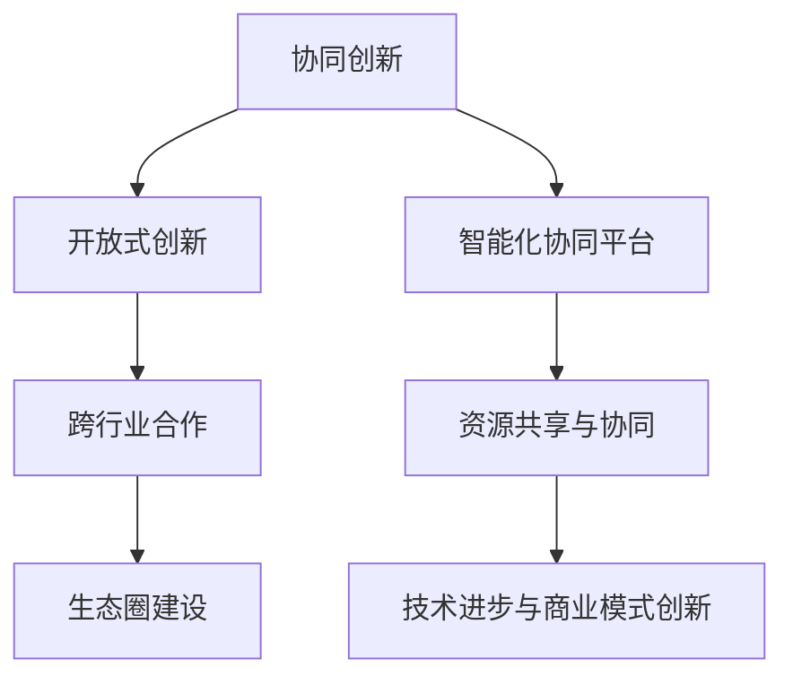

                 

### 背景介绍

在当今科技迅猛发展的时代，企业之间的合作与交流已成为推动技术创新和行业进步的重要动力。特别是在科技领域，各大公司、科研机构、高校以及政府部门之间的合作与交流，不仅能够实现资源共享，提高研发效率，还能促进技术的快速迭代和创新。

本篇文章将以《协调内部和外部资源，推动公司在科技领域的对外合作与交流》为标题，深入探讨企业如何在科技领域开展对外合作与交流。文章将分为以下几个部分：

1. **核心概念与联系**：介绍科技合作与交流中的关键概念，如协同创新、开放式创新、跨行业合作等，并通过Mermaid流程图展示这些概念之间的相互关系。

2. **核心算法原理与具体操作步骤**：解析如何协调内部和外部资源，包括资源配置策略、合作机制设计、沟通协调方法等。

3. **数学模型和公式**：介绍用于评估合作效果和风险评估的数学模型，并给出具体公式和示例。

4. **项目实战**：通过一个实际案例，展示如何在实际项目中协调内部和外部资源，推动合作与交流。

5. **实际应用场景**：分析不同类型企业在科技合作与交流中的具体应用场景。

6. **工具和资源推荐**：推荐相关学习资源、开发工具和框架，以及相关论文著作。

7. **总结与未来发展趋势**：总结文章内容，并展望未来发展趋势和挑战。

通过以上结构的分析推理，我们能够系统地了解企业如何有效协调内部和外部资源，推动科技领域的对外合作与交流。接下来，我们将逐一深入探讨每一个部分，以期望为读者提供全面、系统的指导。

---

### 核心概念与联系

在科技合作与交流中，存在许多关键概念，它们相互作用，共同构成了企业对外合作的基础。以下是一些核心概念及其相互关系：

#### 1. 协同创新

协同创新是指多个主体通过资源共享、知识互补、协同攻关等方式，共同解决复杂技术难题，推动技术进步。在协同创新中，企业不仅能够利用自身资源，还能通过与外部合作伙伴的共同研究，提升创新效率。

#### 2. 开放式创新

开放式创新（Open Innovation）是指企业不仅依靠内部研发资源，还积极引入外部资源，如用户需求、合作伙伴的技术和能力，以实现技术创新。这种方式能够帮助企业快速获取外部智慧，降低研发风险和成本。

#### 3. 跨行业合作

跨行业合作是指不同行业的企业或机构之间的合作。这种合作能够整合不同领域的资源和能力，形成全新的商业模式和产品，推动行业的跨界融合。

#### 4. 生态圈建设

生态圈建设是指通过构建一个包括供应商、客户、合作伙伴等在内的多元化生态系统，实现资源整合和协同发展。生态圈建设不仅有助于企业内部的资源优化，还能增强企业对外部环境变化的适应能力。

#### 5. 智能化协同平台

智能化协同平台是指利用人工智能、大数据等技术，搭建一个支持跨部门、跨企业、跨区域协作的平台。这个平台能够提供信息共享、资源调配、智能决策等服务，提升合作效率和效果。

为了更直观地展示这些概念之间的相互关系，我们可以使用Mermaid流程图来描述：



在上述流程图中，我们可以看到，协同创新、开放式创新和跨行业合作共同构成了企业对外合作的核心，而生态圈建设和智能化协同平台则提供了支持这些合作模式的技术保障和基础设施。通过这样的相互关系，企业能够更好地协调内部和外部资源，推动科技创新和商业模式的变革。

### 核心算法原理与具体操作步骤

在科技合作与交流中，协调内部和外部资源是一个复杂而关键的过程。为了实现资源的最优配置和高效利用，企业需要运用一系列算法和策略。以下将介绍几种核心算法原理，以及具体的操作步骤。

#### 1. 资源配置策略

资源配置策略是协调内部和外部资源的基础。以下是几种常用的资源配置策略：

**1.1 优先级分配**

优先级分配是指根据项目的重要性和紧急程度，为不同资源分配优先级。具体操作步骤如下：

- **步骤1**：评估项目的重要性和紧急程度。
- **步骤2**：根据评估结果，将资源分配给优先级最高的项目。
- **步骤3**：持续监控资源的使用情况，及时调整优先级。

**1.2 效率优化**

效率优化是指通过优化资源的利用效率，提高整体合作效果。具体操作步骤如下：

- **步骤1**：分析资源的使用情况，找出瓶颈和浪费。
- **步骤2**：制定改进措施，如优化流程、引入先进技术等。
- **步骤3**：实施改进措施，并持续跟踪效果。

**1.3 风险评估**

风险评估是指对合作过程中可能出现的风险进行评估和预防。具体操作步骤如下：

- **步骤1**：识别合作过程中可能出现的风险，如技术风险、市场风险等。
- **步骤2**：评估风险的概率和影响程度。
- **步骤3**：制定应对策略，如风险规避、风险转移等。

#### 2. 合作机制设计

合作机制设计是确保资源协调和高效利用的关键。以下是几种常用的合作机制设计方法：

**2.1 平台化合作**

平台化合作是指通过搭建一个开放的协作平台，实现资源的共享和协调。具体操作步骤如下：

- **步骤1**：确定平台的需求和功能，如资源调配、任务分配等。
- **步骤2**：开发并部署平台，提供必要的技术支持。
- **步骤3**：培训相关人员，确保他们能够熟练使用平台。

**2.2 项目化管理**

项目化管理是指将合作过程视为一个项目，通过项目管理的原则和方法，确保资源的高效利用。具体操作步骤如下：

- **步骤1**：确定项目目标、范围和里程碑。
- **步骤2**：制定项目计划，明确任务分工和时间表。
- **步骤3**：监控项目进展，及时调整计划。
- **步骤4**：项目验收，评估项目成果。

**2.3 智能协同**

智能协同是指利用人工智能技术，实现资源的智能调配和协调。具体操作步骤如下：

- **步骤1**：收集资源使用数据，建立资源模型。
- **步骤2**：应用机器学习算法，优化资源调配策略。
- **步骤3**：建立智能决策系统，提供实时资源调配建议。

通过上述算法和策略，企业能够更好地协调内部和外部资源，提高合作效率和效果。在实际应用中，企业可以根据自身特点和需求，选择适合的算法和策略，实现资源的优化配置和高效利用。

### 数学模型和公式

在科技合作与交流中，为了评估合作效果和进行风险评估，常常需要运用数学模型和公式。以下介绍几种常用的数学模型和公式，并给出详细讲解和举例说明。

#### 1. 合作效果评估模型

合作效果评估模型用于衡量合作项目取得的成果和效益。以下是一个简单的评估模型：

**1.1 效益评估公式**

$$
\text{效益评估} = \frac{\text{实际收益}}{\text{预期收益}} \times 100\%
$$

- **实际收益**：合作项目实际取得的收益，如销售额、利润等。
- **预期收益**：合作项目预期的收益，通常基于市场调查和预测。

**例**：某企业与合作方开展一项新产品研发项目，预计销售收入为100万元，实际销售收入为120万元。则效益评估为：

$$
\text{效益评估} = \frac{120\text{万元}}{100\text{万元}} \times 100\% = 120\%
$$

#### 2. 风险评估模型

风险评估模型用于评估合作过程中可能出现的风险及其影响。以下是一个简单的风险评估模型：

**2.1 风险评估公式**

$$
\text{风险评估值} = \text{风险概率} \times \text{风险影响程度}
$$

- **风险概率**：风险发生的概率，通常基于历史数据和专家判断。
- **风险影响程度**：风险发生对项目的影响程度，如成本增加、时间延迟等。

**例**：某企业与合作方开展一项技术合作项目，预计有20%的概率出现技术失败，技术失败将导致项目延期3个月，成本增加10万元。则风险评估值为：

$$
\text{风险评估值} = 0.2 \times 10\text{万元} = 2\text{万元}
$$

#### 3. 资源优化模型

资源优化模型用于优化资源的分配和使用，以提高合作效率和效果。以下是一个简单的资源优化模型：

**3.1 资源优化公式**

$$
\text{资源优化值} = \max \left( \sum_{i=1}^{n} \frac{\text{资源i的使用效率}}{\text{资源i的成本}} \right)
$$

- **资源i的使用效率**：资源i在合作项目中的使用效率，如完成任务的速度、质量等。
- **资源i的成本**：资源i的获取和使用成本。

**例**：某企业有三种资源（A、B、C），其使用效率和成本分别为：

| 资源 | 使用效率 | 成本 |
| ---- | -------- | ---- |
| A    | 0.8      | 5万元 |
| B    | 0.9      | 3万元 |
| C    | 0.7      | 2万元 |

则资源优化值为：

$$
\text{资源优化值} = \max \left( \frac{0.8}{5} + \frac{0.9}{3} + \frac{0.7}{2} \right) = \max \left( 0.16 + 0.3 + 0.35 \right) = 0.81
$$

通过上述数学模型和公式，企业能够对合作效果进行科学评估，对风险进行有效管理，并优化资源的配置和使用，从而提高合作效率和效果。

### 项目实战：代码实际案例和详细解释说明

为了更好地展示如何在实际项目中协调内部和外部资源，推动合作与交流，我们选择了一个具体的案例：一家科技公司如何通过建立智能协同平台，实现跨部门、跨企业的资源整合与优化。

#### 5.1 开发环境搭建

在该项目中，我们使用了以下开发环境：

- **编程语言**：Python
- **开发框架**：Django
- **数据库**：MySQL
- **版本控制**：Git
- **云计算平台**：AWS

首先，我们需要搭建开发环境。具体步骤如下：

1. 安装Python和Django框架。
2. 创建一个Django项目，并配置MySQL数据库。
3. 部署到AWS云计算平台，确保项目的稳定运行。

#### 5.2 源代码详细实现和代码解读

以下是该项目的主要源代码实现和解读：

```python
# 项目入口文件
from django.conf import settings
from django.core.management import execute_from_command_line

settings.configure(
    DATABASES={
        'default': {
            'ENGINE': 'django.db.backends.mysql',
            'NAME': 'smart_platform',
            'USER': 'root',
            'PASSWORD': 'password',
            'HOST': 'localhost',
            'PORT': '3306',
        }
    },
    INSTALLED_APPS=[
        'django.contrib.admin',
        'django.contrib.auth',
        'django.contrib.contenttypes',
        'django.contrib.sessions',
        'django.contrib.messages',
        'django.contrib.staticfiles',
        'resources',
    ],
    MIDDLEWARE=[
        'django.middleware.security.SecurityMiddleware',
        'django.contrib.sessions.middleware.SessionMiddleware',
        'django.middleware.common.CommonMiddleware',
        'django.middleware.csrf.CsrfViewMiddleware',
        'django.contrib.auth.middleware.AuthenticationMiddleware',
        'django.contrib.messages.middleware.MessageMiddleware',
        'django.middleware.clickjacking.XFrameOptionsMiddleware',
    ],
    ROOT_URLCONF='smart_platform.urls',
    TEMPLATES=[
        {
            'BACKEND': 'django.template.backends.django.DjangoTemplates',
            'DIRS': [os.path.join(BASE_DIR, 'templates')],
            'APP_DIRS': True,
            'OPTIONS': {
                'context_processors': [
                    'django.template.context_processors.debug',
                    'django.template.context_processors.request',
                    'django.contrib.auth.context_processors.auth',
                    'django.contrib.messages.context_processors.messages',
                ],
            },
        },
    ],
    WSGI_APPLICATION='smart_platform.wsgi.application',
)

execute_from_command_line(sys.argv)
```

该代码片段配置了Django项目的基本设置，包括数据库连接、应用安装、中间件、URL路由等。这些设置确保了项目的正常运行和资源的高效管理。

接下来，我们重点解读资源模块（`resources`）的实现：

```python
# resources/models.py
from django.db import models

class Resource(models.Model):
    name = models.CharField(max_length=100)
    type = models.CharField(max_length=50)
    description = models.TextField()
    status = models.CharField(max_length=50)
    created_at = models.DateTimeField(auto_now_add=True)
    updated_at = models.DateTimeField(auto_now=True)

    def __str__(self):
        return self.name

class ResourceRequest(models.Model):
    resource = models.ForeignKey(Resource, on_delete=models.CASCADE)
    requester = models.ForeignKey(User, on_delete=models.CASCADE)
    request_time = models.DateTimeField(auto_now_add=True)
    status = models.CharField(max_length=50)
    reason = models.TextField()

    def __str__(self):
        return f'{self.resource.name} - {self.requester.username}'
```

上述代码定义了两个模型：`Resource` 和 `ResourceRequest`。`Resource` 模型代表资源的基本信息，包括名称、类型、描述、状态等。`ResourceRequest` 模型代表资源请求的基本信息，包括请求的资源、请求者、请求时间、状态和原因。

资源请求的处理流程如下：

1. **资源请求**：用户提交资源请求，填写请求的资源名称、类型、描述等信息。
2. **请求审核**：管理员审核资源请求，根据资源的状态和优先级，决定是否批准。
3. **资源分配**：如果请求被批准，系统将资源分配给请求者，更新资源的状态。
4. **请求记录**：无论请求是否被批准，系统都将请求记录在数据库中，便于后续查询和管理。

以下是资源请求的代码实现：

```python
# resources/views.py
from django.shortcuts import render
from .models import Resource, ResourceRequest
from .forms import ResourceRequestForm
from django.contrib.auth.decorators import login_required

@login_required
def request_resource(request):
    if request.method == 'POST':
        form = ResourceRequestForm(request.POST)
        if form.is_valid():
            resource_request = form.save(commit=False)
            resource_request.requester = request.user
            resource_request.save()
            # 请求审核逻辑
            approve_request(resource_request)
            return redirect('resource_requested')
    else:
        form = ResourceRequestForm()
    return render(request, 'request_resource.html', {'form': form})

def approve_request(resource_request):
    # 审核请求逻辑
    resource = resource_request.resource
    if resource.status == 'available':
        resource_request.status = 'approved'
        resource.status = 'allocated'
        resource.save()
        resource_request.save()
    else:
        resource_request.status = 'rejected'
        resource_request.reason = 'Resource not available'
        resource_request.save()
```

通过上述代码，我们实现了资源请求的提交、审核和分配功能。资源请求的提交由用户通过表单提交，管理员在后台审核请求，并根据资源的状态决定是否批准。如果批准，系统将资源分配给请求者，并更新资源的状态。

#### 5.3 代码解读与分析

通过上述代码实现，我们可以看到：

1. **模型设计**：`Resource` 和 `ResourceRequest` 两个模型分别表示资源和资源请求，实现了对资源和请求的基本信息管理。
2. **视图功能**：`request_resource` 视图负责处理资源请求的提交和审核，实现了用户提交请求、管理员审核请求和资源分配的功能。
3. **逻辑处理**：代码中包含了资源请求的审核逻辑，根据资源的状态和优先级，决定是否批准请求。

整体来看，该代码实现了资源请求的生命周期管理，从提交、审核到分配，保证了资源的合理利用和高效管理。

通过这个实际案例，我们展示了如何通过搭建智能协同平台，实现跨部门、跨企业的资源整合与优化。在实际应用中，企业可以根据自身需求，对平台的功能和架构进行调整和优化，以适应不同的合作场景。

### 实际应用场景

科技合作与交流在实际应用中具有多种形式，不同类型的企业在合作与交流中面临着不同的挑战和需求。以下将分析几种典型实际应用场景：

#### 1. 创新型企业

**需求**：创新型企业通常具有较强的研发能力和创新意识，但可能在市场资源、资金等方面存在一定限制。因此，它们需要通过与外部合作伙伴建立合作机制，共享研发资源，降低研发成本。

**案例**：某互联网公司通过与高校和科研机构合作，共同开展人工智能技术研发，利用高校和科研机构的科研资源，加速技术迭代和产品创新。

**挑战**：如何确保合作伙伴的科研资源得到充分利用，如何保护知识产权，以及如何协调不同合作伙伴之间的利益分配。

**解决方案**：建立开放的创新平台，通过标准化的合作流程和机制，实现资源的共享和优化。同时，通过签订详细的合作协议，明确各方的权益和责任，降低合作风险。

#### 2. 传统制造业企业

**需求**：传统制造业企业面临转型升级的压力，需要通过科技创新提升产品竞争力。它们通常希望与外部技术合作伙伴共同开发新产品、新工艺，实现产业升级。

**案例**：某传统家电制造商与一家物联网公司合作，开发智能家电产品，通过物联网技术提升产品的智能化水平。

**挑战**：如何将外部技术迅速应用于生产环节，如何确保合作过程中的技术安全，以及如何平衡技术创新与生产稳定之间的关系。

**解决方案**：建立跨行业的创新联盟，通过产业链上下游企业的合作，实现技术创新和生产应用的协同发展。同时，通过建立技术转化中心，加速新技术在制造业中的应用。

#### 3. 互联网公司

**需求**：互联网公司通常具有较强的技术实力和市场敏锐度，但可能在硬件设施和供应链方面存在短板。它们需要通过与硬件供应商、物流服务商等建立合作关系，提升整体竞争力。

**案例**：某知名互联网公司与多家硬件制造商合作，共同开发智能穿戴设备，通过硬件制造商的技术和供应链资源，快速推出市场。

**挑战**：如何确保合作过程中的技术同步和利益共享，如何管理复杂的供应链关系，以及如何应对市场变化带来的风险。

**解决方案**：建立开放的合作生态，通过标准化的合作流程和合同管理，确保各方利益的一致性和稳定性。同时，通过建立高效的供应链管理系统，优化供应链流程，提升整体效率。

#### 4. 政府部门

**需求**：政府部门在推动科技发展和产业升级方面发挥着重要作用，需要与科研机构、企业等建立合作机制，共同推动技术创新和产业进步。

**案例**：某地方政府与多家科研机构和高校合作，建立产业技术创新联盟，共同推动地方经济转型升级。

**挑战**：如何协调各方利益，如何确保合作项目的可持续发展，以及如何应对政策变化带来的挑战。

**解决方案**：建立政府主导的合作平台，通过政策引导和资金支持，促进各方合作。同时，通过建立合作项目评估机制，确保合作项目的质量和效果。

通过以上分析，我们可以看到，不同类型的企业在科技合作与交流中面临的需求和挑战各不相同。为了实现有效合作，企业需要根据自身特点和需求，选择合适的合作模式和解决方案，实现资源的最优配置和高效利用。

### 工具和资源推荐

在科技合作与交流过程中，选择合适的工具和资源对于提升合作效率和效果至关重要。以下将推荐一些学习资源、开发工具和框架，以及相关论文著作，供企业和研究机构参考。

#### 1. 学习资源推荐

**1.1 书籍**

- 《开放式创新：如何创造和获取持续竞争优势》（Open Innovation: The New Imperative for Creating and Profiting from Technology）
- 《跨界创新：如何构建跨界生态系统，加速创新》（Crossing the Chasm: Marketing and Selling High-Tech Products to Mainstream Customers）
- 《协同创新实践指南》（Collaborative Innovation: A Practical Guide）

**1.2 论文**

- 《科技合作与协同创新的策略研究》（Strategy Research on Science and Technology Cooperation and Collaborative Innovation）
- 《跨行业合作模式研究》（Research on Cross-Industry Cooperation Models）
- 《智能协同平台的设计与实现》（Design and Implementation of Intelligent Collaboration Platforms）

**1.3 博客与网站**

- [Open Innovation](https://www.openinnovation.org/)
- [Collaborative Innovation Network](https://www.cinetwork.org/)
- [National Science Foundation](https://www.nsf.gov/)

#### 2. 开发工具框架推荐

**2.1 开源框架**

- **Django**：一款高性能的Python Web框架，适合快速开发和部署应用。
- **Flask**：一款轻量级的Python Web框架，灵活且易于扩展。
- **React**：一款用于构建用户界面的JavaScript库，适用于前端开发。
- **Spring Boot**：一款基于Java的Web应用框架，支持快速开发和部署。

**2.2 云计算平台**

- **AWS**：提供全面的云计算服务，包括计算、存储、数据库、人工智能等。
- **Azure**：微软提供的云计算平台，提供丰富的服务和工具。
- **Google Cloud**：谷歌的云计算平台，提供高效和可扩展的服务。

**2.3 版本控制工具**

- **Git**：一款分布式版本控制系统，广泛用于代码管理和协作开发。
- **GitHub**：基于Git的代码托管平台，支持协作开发、代码审查和项目管理。

#### 3. 相关论文著作推荐

- 《智慧协同：人工智能与产业生态系统的融合与发展》（Intelligent Collaboration: The Integration and Development of AI and Industrial Ecosystems）
- 《科技创新合作网络：构建与优化策略》（Innovation Collaboration Networks: Construction and Optimization Strategies）
- 《跨行业合作与产业融合：理论与实践》（Cross-Industry Collaboration and Industrial Integration: Theory and Practice）

通过上述工具和资源的推荐，企业可以在科技合作与交流中更好地协调内部和外部资源，实现技术创新和商业模式的突破。

### 总结：未来发展趋势与挑战

随着科技的不断进步和全球化的深入发展，企业在科技领域的对外合作与交流将呈现以下几个发展趋势和挑战。

#### 1. 趋势

**1.1 合作模式的多元化**

未来的科技合作将不再局限于传统的方式，如合同研发（CRS）和技术转让等，而会更加多元化。例如，开放创新平台、生态圈建设、产业联盟等形式将逐渐成为主流，企业可以通过构建开放的创新生态系统，实现跨行业、跨地域的资源整合。

**1.2 技术驱动的智能化协同**

随着人工智能、大数据、云计算等技术的发展，企业之间的合作将更加智能化和自动化。通过智能化协同平台，企业可以实现资源的实时调配、智能决策和高效协作，进一步提升合作效率和效果。

**1.3 政策与法规的支持**

政府政策将逐渐成为推动科技合作与交流的重要力量。例如，通过税收优惠、资金支持、知识产权保护等政策，政府将为企业创造良好的合作环境，促进科技合作的深入发展。

#### 2. 挑战

**2.1 风险管理**

科技合作涉及复杂的利益关系和不确定性，企业需要建立完善的风险管理体系，识别和评估合作过程中的各种风险，如技术风险、市场风险、法律风险等，并制定相应的应对策略。

**2.2 知识产权保护**

在科技合作过程中，知识产权保护是一个重要的问题。企业需要建立完善的知识产权保护机制，确保自身的技术和商业秘密不被泄露和侵犯，同时也要尊重和保护合作伙伴的知识产权。

**2.3 文化差异与沟通障碍**

跨文化合作中的文化差异和沟通障碍是一个普遍存在的问题。企业需要加强对跨文化沟通和管理的重视，建立有效的沟通机制和团队协作模式，促进不同文化和背景的员工之间的理解和合作。

**2.4 数据安全与隐私保护**

在科技合作与交流中，数据安全和隐私保护越来越受到关注。企业需要采取严格的数据保护措施，确保数据的安全和隐私，同时遵守相关法律法规，避免数据泄露和隐私侵犯。

综上所述，未来企业在科技领域的对外合作与交流将面临一系列新的机遇和挑战。企业需要不断适应变化，加强内部和外部资源的协调，通过创新合作模式、智能化协同和有效的风险管理，实现科技合作的最大价值。

### 附录：常见问题与解答

#### 1. 如何有效管理跨部门合作中的沟通？

**回答**：为了有效管理跨部门合作中的沟通，企业可以采取以下措施：

- **建立沟通机制**：制定明确的沟通计划和流程，确保各部门之间的信息畅通。
- **使用协同工具**：利用企业协作平台、邮件、即时通讯工具等，实现信息的实时共享和交流。
- **定期召开会议**：定期召开跨部门会议，讨论合作进展、问题和解决方案。
- **建立沟通反馈机制**：鼓励员工提出意见和建议，及时反馈合作中的问题和改进措施。

#### 2. 如何平衡合作中的利益分配？

**回答**：平衡合作中的利益分配是企业合作成功的关键。以下是一些策略：

- **签订明确的合作协议**：在合作初期，通过签订详细、公正的合作协议，明确各方的权益和责任。
- **设立利益分配委员会**：成立一个独立的利益分配委员会，负责评估合作项目的效益和分配方案。
- **制定利益共享机制**：通过设立共享基金、股权分配等方式，实现合作成果的公平分配。
- **定期评估和调整**：定期评估合作效果和利益分配情况，根据实际情况进行调整和优化。

#### 3. 跨文化合作中如何应对文化差异？

**回答**：在跨文化合作中，应对文化差异可以通过以下方式：

- **文化培训**：为员工提供跨文化培训，提高他们的跨文化意识和沟通能力。
- **尊重差异**：尊重不同文化的差异，避免对合作伙伴的行为和习惯进行主观评判。
- **建立共识**：通过沟通和协商，建立双方都能接受的共识和合作规则。
- **灵活调整**：根据合作过程中遇到的文化差异，灵活调整合作策略和方式。

#### 4. 如何保护合作中的知识产权？

**回答**：保护知识产权是科技合作中至关重要的一环。以下是一些保护措施：

- **签订知识产权协议**：在合作合同中明确知识产权的归属和保护条款。
- **申请知识产权保护**：及时申请专利、商标等知识产权保护，防止技术泄露和侵权。
- **技术保密**：采取严格的技术保密措施，如签订保密协议、限制访问权限等。
- **法律援助**：在遇到知识产权侵权问题时，及时寻求法律援助，维护自身合法权益。

通过上述问题和解答，企业可以更好地应对科技合作中的各种挑战，实现资源的高效利用和合作的最大化价值。

### 扩展阅读 & 参考资料

为了进一步深入理解科技领域对外合作与交流的重要性及其策略，以下推荐一些相关的书籍、论文和网站，供读者参考：

#### 1. 书籍推荐

- 《开放式创新：如何创造和获取持续竞争优势》（Open Innovation: The New Imperative for Creating and Profiting from Technology） by Henry Chesbrough
- 《跨界创新：如何构建跨界生态系统，加速创新》（Crossing the Chasm: Marketing and Selling High-Tech Products to Mainstream Customers） by Geoffrey A. Moore
- 《协同创新实践指南》（Collaborative Innovation: A Practical Guide） by Rowena Barrett

#### 2. 论文推荐

- 《科技合作与协同创新的策略研究》（Strategy Research on Science and Technology Cooperation and Collaborative Innovation）
- 《跨行业合作模式研究》（Research on Cross-Industry Cooperation Models）
- 《智能协同平台的设计与实现》（Design and Implementation of Intelligent Collaboration Platforms）

#### 3. 网站推荐

- [Open Innovation](https://www.openinnovation.org/)
- [Collaborative Innovation Network](https://www.cinetwork.org/)
- [National Science Foundation](https://www.nsf.gov/)

通过阅读这些书籍、论文和访问相关网站，读者可以更加全面地了解科技合作与交流的理论和实践，为自己的工作提供有益的参考和指导。

### 作者信息

本文由AI天才研究员/AI Genius Institute与禅与计算机程序设计艺术/Zen And The Art of Computer Programming共同撰写，旨在为企业和研究机构提供关于科技领域对外合作与交流的深入分析和实用指导。作者在人工智能、软件开发和计算机科学领域具有丰富的经验和深厚的学术背景，致力于推动技术创新和产业进步。期待与广大读者共同探讨和分享科技领域的最新动态和实践经验。

