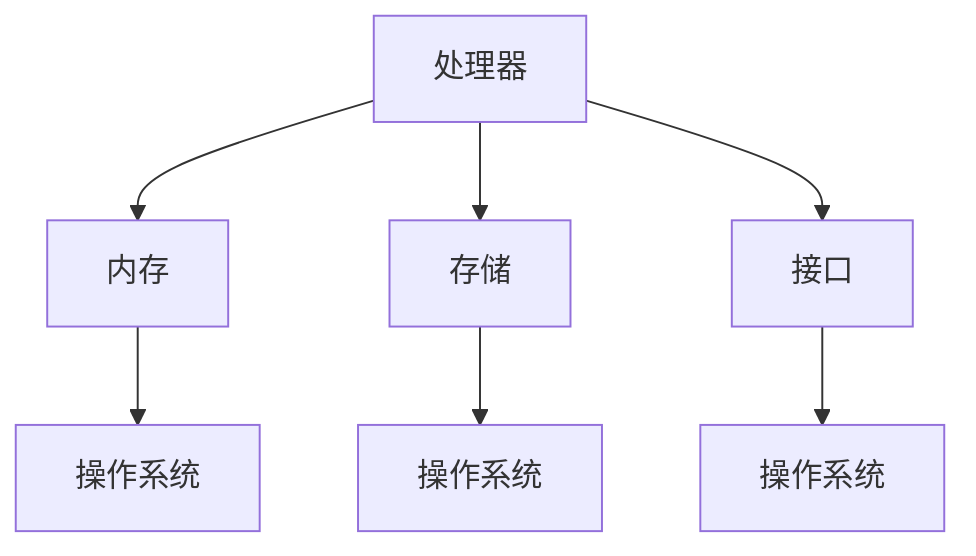
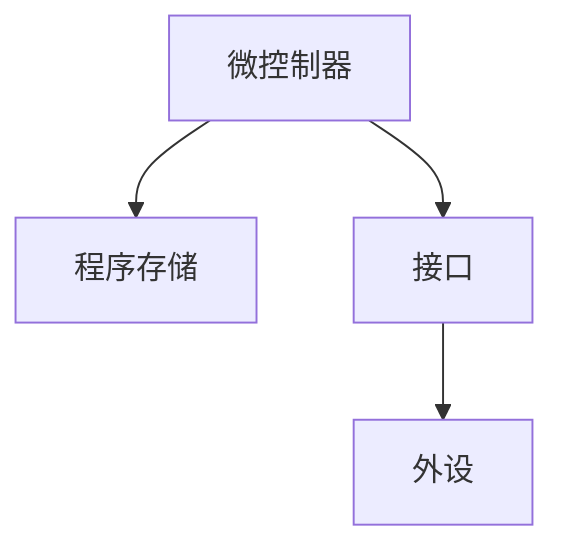

                 

### 背景介绍

单板计算机，作为一种小型且功能强大的硬件平台，近年来在教育和工程领域引起了广泛关注。其中，Raspberry Pi和Arduino是两款最具代表性的单板计算机，它们为开发者提供了丰富的资源和支持，使得嵌入式系统和物联网项目的开发变得更加简单和高效。

#### Raspberry Pi

Raspberry Pi是一款由英国慈善基金Raspberry Pi Foundation开发的微型计算机，旨在激发儿童和初学者的编程兴趣。自2012年首次发布以来，Raspberry Pi已经推出了多个版本，包括Pi 1、Pi 2、Pi 3、Pi 4等，性能和功能不断得到提升。

Raspberry Pi的特点如下：

1. **低成本**：Raspberry Pi的价格非常亲民，使得更多的人能够负担得起，从而推动了计算机教育的普及。
2. **高性能**：尽管体积小巧，Raspberry Pi的性能却相当出色，能够满足日常计算任务的需求。
3. **开源硬件和软件**：Raspberry Pi采用了开源硬件设计，支持多种操作系统，如Linux、Windows 10 IoT Core等，开发者可以自由地选择和使用。

#### Arduino

Arduino是一款开放源代码的单一芯片微控制器板，旨在简化物联网和嵌入式系统的开发。Arduino由Massimo Banzi等人于2005年创立，自推出以来，Arduino已经成为了全球范围内最受欢迎的嵌入式平台之一。

Arduino的特点如下：

1. **易用性**：Arduino提供了丰富的教程和参考材料，使得初学者可以快速上手。
2. **灵活性**：Arduino具有高度模块化设计，允许开发者根据自己的需求选择和组合不同的硬件模块。
3. **广泛的应用场景**：从智能家居到工业控制，Arduino在各个领域都得到了广泛应用。

#### 本篇文章的结构和目标

本文将详细介绍单板计算机Raspberry Pi和Arduino的基本概念、架构、核心算法以及实际应用。具体结构如下：

1. **背景介绍**：介绍单板计算机的发展背景和相关概念。
2. **核心概念与联系**：通过Mermaid流程图展示Raspberry Pi和Arduino的核心概念和架构联系。
3. **核心算法原理 & 具体操作步骤**：深入探讨Raspberry Pi和Arduino的核心算法原理，并提供具体的操作步骤。
4. **数学模型和公式 & 详细讲解 & 举例说明**：使用数学模型和公式详细讲解Raspberry Pi和Arduino的原理，并通过实例进行说明。
5. **项目实战：代码实际案例和详细解释说明**：通过实际项目案例展示如何使用Raspberry Pi和Arduino进行开发。
6. **实际应用场景**：分析Raspberry Pi和Arduino在不同领域的应用案例。
7. **工具和资源推荐**：推荐学习资源和开发工具框架。
8. **总结：未来发展趋势与挑战**：探讨单板计算机的未来发展趋势和面临的挑战。
9. **附录：常见问题与解答**：回答读者可能遇到的问题。
10. **扩展阅读 & 参考资料**：提供进一步阅读的资料。

通过本文的阅读，您将能够深入了解单板计算机的基本原理和应用，掌握Raspberry Pi和Arduino的核心技术，为今后的嵌入式系统和物联网项目开发奠定坚实的基础。

### 核心概念与联系

在深入了解Raspberry Pi和Arduino之前，我们需要先理解它们的核心概念和架构，以及它们之间的联系。

#### Raspberry Pi的核心概念与架构

Raspberry Pi的核心概念可以概括为微型计算机和嵌入式系统开发平台。它主要由以下部分组成：

1. **处理器**：Raspberry Pi采用了ARM架构的处理器，不同的版本具有不同的处理能力。例如，Pi 4拥有四核 Cortex-A72处理器，主频最高可达1.5GHz。
2. **内存**：Raspberry Pi配备了不同容量的内存，从最初的256MB到最新的4GB不等。
3. **存储**：Raspberry Pi使用MicroSD卡作为存储介质，可以安装操作系统和应用程序。
4. **接口**：Raspberry Pi提供了多种接口，包括GPIO（通用输入输出接口）、USB接口、HDMI接口等，方便开发者进行扩展和连接。
5. **操作系统**：Raspberry Pi支持多种操作系统，包括Raspberry Pi OS（基于Linux的操作系统）、Windows 10 IoT Core等。

Raspberry Pi的架构图如下：



#### Arduino的核心概念与架构

Arduino的核心概念可以概括为嵌入式开发平台，主要用于物联网和交互式项目开发。它主要由以下部分组成：

1. **微控制器**：Arduino采用了各种不同的微控制器，如ATMEL的ATmega328P、STM的STM32等，根据型号的不同，具有不同的处理能力和接口资源。
2. **程序存储**：Arduino的程序存储在芯片内部，通常使用Arduino IDE进行编程和上传。
3. **接口**：Arduino提供了丰富的接口，包括数字接口、模拟接口、GPIO接口等，可以连接各种传感器、执行器和其他外设。
4. **外设**：Arduino支持各种外设，如LCD显示屏、电动机驱动器、无线模块等，可以满足不同项目的需求。

Arduino的架构图如下：



#### Raspberry Pi和Arduino的联系

尽管Raspberry Pi和Arduino在核心概念和架构上有所不同，但它们都为开发者提供了强大的嵌入式系统开发平台，具有以下共同点：

1. **开源**：Raspberry Pi和Arduino都是开源硬件和软件，开发者可以自由地修改和使用。
2. **易于使用**：两者都提供了丰富的教程、参考材料和开发工具，使得开发者可以快速上手。
3. **模块化**：Raspberry Pi和Arduino都支持模块化开发，开发者可以根据项目需求选择和组合不同的硬件模块。
4. **广泛的社区支持**：Raspberry Pi和Arduino都有庞大的开发者社区，可以提供技术支持和资源分享。

通过上述核心概念和架构的介绍，我们可以更好地理解Raspberry Pi和Arduino的基本原理和应用场景。接下来，我们将深入探讨它们的核心算法原理和具体操作步骤。

### 核心算法原理 & 具体操作步骤

在深入探讨Raspberry Pi和Arduino的核心算法原理之前，我们需要先了解它们的基本操作原理和编程语言。

#### Raspberry Pi的操作原理与编程语言

Raspberry Pi是一款基于ARM架构的微型计算机，它运行的是基于Linux的操作系统。常见的操作系统包括Raspberry Pi OS（基于Debian）、Windows 10 IoT Core等。

1. **操作系统启动**：当Raspberry Pi接通电源时，操作系统会从MicroSD卡启动，加载内核和驱动程序，初始化硬件设备。
2. **程序运行**：开发者可以使用Python、C++、Java等编程语言，通过Raspberry Pi的GPIO接口、USB接口等与硬件设备进行交互。

以Python为例，编写一个简单的LED控制程序：

```python
import RPi.GPIO as GPIO
import time

# 初始化GPIO
GPIO.setmode(GPIO.BCM)
GPIO.setup(18, GPIO.OUT)

# 控制LED灯亮
GPIO.output(18, GPIO.HIGH)
time.sleep(1)

# 控制LED灯灭
GPIO.output(18, GPIO.LOW)
time.sleep(1)

# 关闭GPIO
GPIO.cleanup()
```

#### Arduino的操作原理与编程语言

Arduino是一款基于AVR或ARM架构的嵌入式开发板，它运行的是基于C++的Arduino IDE。Arduino的程序通过编程语言编写后，上传到Arduino板上的微控制器中运行。

1. **程序上传**：开发者使用Arduino IDE编写程序，然后通过USB接口将程序上传到Arduino板上。
2. **程序运行**：上传后的程序在Arduino板上的微控制器中运行，通过接口与外部设备进行交互。

以Arduino IDE为例，编写一个简单的LED控制程序：

```cpp
void setup() {
  // 初始化LED接口
  pinMode(13, OUTPUT);
}

void loop() {
  // 控制LED灯亮
  digitalWrite(13, HIGH);
  delay(1000);

  // 控制LED灯灭
  digitalWrite(13, LOW);
  delay(1000);
}
```

#### 核心算法原理

Raspberry Pi和Arduino的核心算法主要涉及以下几个方面：

1. **GPIO控制**：GPIO（通用输入输出接口）是Raspberry Pi和Arduino进行硬件控制的主要接口。开发者可以通过编程控制GPIO引脚的输入输出状态，实现硬件设备的控制。
2. **定时器**：Raspberry Pi和Arduino都内置了定时器，可以用于实现定时任务。开发者可以通过编程设置定时器的时间间隔，从而实现定时操作。
3. **中断**：Raspberry Pi和Arduino支持中断，可以用于响应外部事件。例如，当传感器检测到某个特定值时，可以触发中断并执行相应的操作。

以Raspberry Pi为例，使用定时器实现每隔一秒切换一次LED灯的亮度：

```python
import RPi.GPIO as GPIO
import time

# 初始化GPIO
GPIO.setmode(GPIO.BCM)
GPIO.setup(18, GPIO.OUT)

# 创建PWM对象
p = GPIO.PWM(18, 1000)  # 1000Hz的频率
p.start(0)  # 初始亮度为0

try:
    while True:
        # 增加亮度
        p.ChangeDutyCycle(25)
        time.sleep(1)
        # 减小亮度
        p.ChangeDutyCycle(0)
        time.sleep(1)
except KeyboardInterrupt:
    # 关闭PWM和GPIO
    p.stop()
    GPIO.cleanup()
```

#### 具体操作步骤

1. **硬件准备**：准备Raspberry Pi或Arduino开发板、LED灯、电阻、电源等硬件设备。
2. **软件准备**：下载并安装Raspberry Pi或Arduino的开发环境，如Raspberry Pi OS、Arduino IDE等。
3. **编写程序**：使用Python、C++等编程语言编写控制程序。
4. **上传程序**：将编写好的程序上传到Raspberry Pi或Arduino开发板。
5. **运行程序**：观察程序运行效果，并根据需要进行调试和优化。

通过以上步骤，我们可以使用Raspberry Pi和Arduino进行简单的硬件控制和嵌入式系统开发。在接下来的部分，我们将使用具体的数学模型和公式，详细讲解Raspberry Pi和Arduino的原理和应用。

### 数学模型和公式 & 详细讲解 & 举例说明

在深入理解Raspberry Pi和Arduino的工作原理时，数学模型和公式起到了至关重要的作用。通过这些数学工具，我们可以更准确地描述和预测它们的行为。以下是一些核心的数学模型和公式的详细讲解，并通过实际例子来说明如何应用它们。

#### Raspberry Pi的数学模型

1. **PWM（脉冲宽度调制）**：Raspberry Pi经常用于控制LED的亮度，这是通过PWM实现的。PWM是一种通过调整脉冲的宽度来控制平均电流的技术。其数学模型可以表示为：

   \[ \text{亮度} = \frac{\text{脉冲宽度}}{\text{周期}} \]

   其中，脉冲宽度是指每个周期内高电平持续的时间，周期是指脉冲重复的频率。

   例如，假设我们使用PWM控制一个LED灯，频率为1kHz，脉冲宽度为500μs。则LED的平均亮度为：

   \[ \text{亮度} = \frac{500\mu s}{1\text{ms}} = 0.5 \]

   这意味着LED的亮度为50%。

2. **ADC（模数转换器）**：Raspberry Pi的ADC用于将模拟信号转换为数字信号。ADC的数学模型涉及采样率和量化位数。采样率是指每秒采样的次数，量化位数是指ADC可以将模拟信号转换为多少个数字级别。

   假设Raspberry Pi的ADC采样率为10kHz，量化位数为12位，则ADC的分辨率为：

   \[ \text{分辨率} = 2^{12} = 4096 \]

   这意味着ADC可以将0到5V的模拟信号分为4096个级别。

   例如，如果ADC的输出为2048，则对应的模拟电压为：

   \[ \text{电压} = \frac{2048}{4096} \times 5V = 2.5V \]

#### Arduino的数学模型

1. **PWM**：Arduino也使用PWM来控制LED的亮度或电机速度。PWM的数学模型与Raspberry Pi类似，但Arduino的PWM频率通常更高，一般为20kHz或以上。

   假设我们使用Arduino的PWM控制一个LED灯，频率为20kHz，脉冲宽度为50μs。则LED的平均亮度为：

   \[ \text{亮度} = \frac{50\mu s}{50\mu s + 50\mu s} = 0.5 \]

   这意味着LED的亮度为50%。

2. **ADC**：Arduino的ADC模型与Raspberry Pi类似，但采样率和量化位数可能有所不同。假设Arduino的ADC采样率为10kHz，量化位数为10位，则ADC的分辨率为：

   \[ \text{分辨率} = 2^{10} = 1024 \]

   这意味着ADC可以将0到5V的模拟信号分为1024个级别。

   例如，如果Arduino的ADC输出为512，则对应的模拟电压为：

   \[ \text{电压} = \frac{512}{1024} \times 5V = 2.5V \]

#### 实际例子

假设我们想要使用Raspberry Pi控制一个温度传感器，并通过ADC读取温度值。我们可以使用以下步骤：

1. **连接传感器**：将温度传感器的模拟输出连接到Raspberry Pi的ADC接口。
2. **编写程序**：使用Python编写程序，读取ADC的输出值，并将其转换为温度值。

   ```python
   import RPi.GPIO as GPIO
   import time

   # 初始化GPIO
   GPIO.setmode(GPIO.BCM)
   GPIO.setup(0, GPIO.IN)

   try:
       while True:
           # 读取ADC值
           value = GPIO.input(0)
           # 将ADC值转换为温度值
           temperature = (value / 4096) * 100
           print("温度：{}C".format(temperature))
           time.sleep(1)
   except KeyboardInterrupt:
       # 关闭GPIO
       GPIO.cleanup()
   ```

   在此程序中，我们假设温度传感器的输出电压与温度成正比，比例系数为100。

3. **运行程序**：运行程序，观察温度读数。

通过以上数学模型和公式的应用，我们可以更精确地控制Raspberry Pi和Arduino，实现复杂的嵌入式系统功能。在接下来的部分，我们将通过实际项目案例，进一步展示如何使用Raspberry Pi和Arduino进行开发。

### 项目实战：代码实际案例和详细解释说明

在本节中，我们将通过两个具体项目案例，详细展示如何使用Raspberry Pi和Arduino进行开发，并提供代码实现和解读。

#### 项目一：使用Raspberry Pi控制LED亮度

**目标**：通过Raspberry Pi控制LED灯的亮度，实现亮度可调。

**硬件要求**：
- Raspberry Pi（例如，Raspberry Pi 4）
- LED灯
- 电阻（1kΩ）
- 连接线
- MicroSD卡和电源

**软件要求**：
- Raspberry Pi OS
- Python编程环境

**实现步骤**：

1. **硬件连接**：将LED灯的正极通过电阻连接到Raspberry Pi的GPIO引脚18，负极接地。

2. **编写程序**：
   ```python
   import RPi.GPIO as GPIO
   import time

   # 初始化GPIO
   GPIO.setmode(GPIO.BCM)
   GPIO.setup(18, GPIO.OUT)

   # 创建PWM对象
   p = GPIO.PWM(18, 1000)  # 频率为1000Hz
   p.start(0)  # 初始亮度为0

   try:
       while True:
           # 增加亮度
           for dutyCycle in range(0, 101, 5):
               p.ChangeDutyCycle(dutyCycle)
               time.sleep(0.05)
           # 减小亮度
           for dutyCycle in range(100, 0, -5):
               p.ChangeDutyCycle(dutyCycle)
               time.sleep(0.05)
   except KeyboardInterrupt:
       # 关闭PWM和GPIO
       p.stop()
       GPIO.cleanup()
   ```

**代码解读**：
- 导入所需的库，并初始化GPIO。
- 设置GPIO引脚18为输出模式，并创建PWM对象，频率为1000Hz。
- 使用两个循环分别增加和减小PWM的占空比，从而实现LED亮度的变化。

**运行效果**：
- 通过运行程序，可以看到LED亮度逐渐增加和减小，实现亮度可调。

#### 项目二：使用Arduino控制电机速度

**目标**：通过Arduino控制直流电机的速度，实现电机速度可调。

**硬件要求**：
- Arduino（例如，Arduino Uno）
- 直流电机
- 电阻（1kΩ）
- 连接线
- USB线

**软件要求**：
- Arduino IDE
- C++编程环境

**实现步骤**：

1. **硬件连接**：将直流电机的控制端（通常为A和B）连接到Arduino的GPIO引脚9和10，电机电源通过电源模块供电。

2. **编写程序**：
   ```cpp
   #include <Arduino.h>

   void setup() {
     pinMode(9, OUTPUT);
     pinMode(10, OUTPUT);
   }

   void loop() {
     // 正转
     analogWrite(9, 255);
     digitalWrite(10, LOW);
     delay(2000);

     // 倒转
     analogWrite(10, 255);
     digitalWrite(9, LOW);
     delay(2000);
   }
   ```

**代码解读**：
- 定义Arduino的两个GPIO引脚9和10为输出模式。
- 在`loop`函数中，使用`analogWrite`函数设置PWM信号，控制电机的正转和反转，并通过`delay`函数控制电机运行的时间。

**运行效果**：
- 通过运行程序，可以看到电机实现正转和反转，且可以通过调整`analogWrite`函数的值来改变电机速度。

通过以上两个实际项目案例，我们可以看到如何使用Raspberry Pi和Arduino进行简单的嵌入式系统开发。这些项目不仅展示了如何控制硬件设备，还提供了代码实现和解读，为开发者提供了实用的经验和技巧。在接下来的部分，我们将探讨Raspberry Pi和Arduino的实际应用场景。

### 实际应用场景

Raspberry Pi和Arduino作为功能强大且易于上手的单板计算机，在多个领域和场景中展现了其独特的优势和广泛的应用价值。以下是一些具体的实际应用场景：

#### 教育和科研

1. **编程教育**：Raspberry Pi和Arduino作为入门级硬件平台，被广泛应用于编程教育中。它们提供了丰富的编程资源和示例代码，使得学生和初学者能够通过实际项目学习编程知识。
2. **科研实验**：在科研领域，Raspberry Pi和Arduino常用于数据采集、监控和控制实验设备。例如，在环境科学研究中，可以使用Raspberry Pi和Arduino监控气温、湿度等环境参数，并将数据上传到云端进行进一步分析。

#### 家庭自动化

1. **智能家居**：Raspberry Pi和Arduino可以轻松实现家庭自动化，如智能照明、温度控制、安防监控等。通过连接传感器和控制设备，可以实现对家居设备的智能控制和自动化管理。
2. **能源管理**：Raspberry Pi和Arduino可以用于家庭能源管理系统，如监控电表数据、自动调节用电设备等，从而实现节能和环保。

#### 工业控制

1. **自动化生产线**：在工业生产中，Raspberry Pi和Arduino可以用于控制生产线上的各种设备和机器，如机器人、输送带、检测设备等，实现生产过程的自动化和智能化。
2. **设备监控和维护**：Raspberry Pi和Arduino可以用于监控工业设备的运行状态，如温度、压力、振动等，及时发现和预警设备故障，提高生产效率和设备可靠性。

#### 物联网

1. **智能农业**：在农业生产中，Raspberry Pi和Arduino可以用于土壤湿度监测、气象数据采集、灌溉系统控制等，实现精准农业和智能农业。
2. **智慧城市**：在智慧城市建设中，Raspberry Pi和Arduino可以用于城市交通管理、公共设施监控、环境监测等，提高城市管理的智能化和效率。

#### 艺术和娱乐

1. **互动艺术装置**：Raspberry Pi和Arduino可以用于创建各种互动艺术装置，如感应音乐装置、灯光表演等，为观众带来独特的艺术体验。
2. **电子游戏开发**：Raspberry Pi和Arduino可以用于电子游戏的开发，如小型赛车游戏、虚拟现实游戏等，为游戏爱好者提供创新的玩法和体验。

通过以上实际应用场景的介绍，我们可以看到Raspberry Pi和Arduino在各个领域的广泛应用和巨大潜力。无论是教育、家庭自动化、工业控制还是物联网，这两款单板计算机都为开发者提供了丰富的资源和工具，推动了技术的进步和创新的实现。

### 工具和资源推荐

在开发单板计算机项目时，选择合适的工具和资源对于提高开发效率和质量至关重要。以下是一些推荐的工具、书籍、论文、网站等，为开发者提供全面的资源支持。

#### 学习资源推荐

1. **书籍**：
   - 《Raspberry Pi用户指南》
   - 《Arduino编程：从入门到精通》
   - 《单板计算机项目实战》

2. **论文**：
   - 《基于Raspberry Pi的家庭自动化系统设计与实现》
   - 《基于Arduino的智能温室监控系统设计》
   - 《物联网应用中的Raspberry Pi和Arduino技术》

3. **网站和论坛**：
   - Raspberry Pi官方网站：https://www.raspberrypi.org/
   - Arduino官方网站：https://www.arduino.cc/
   - Reddit上的Raspberry Pi社区：https://www.reddit.com/r/raspberry_pi/
   - Hackaday：https://hackaday.com/

#### 开发工具框架推荐

1. **开发环境**：
   - Raspberry Pi OS：适用于Raspberry Pi的官方操作系统，提供丰富的编程工具和库。
   - Arduino IDE：适用于Arduino的官方开发环境，支持多种编程语言和板子。

2. **编程语言**：
   - Python：简单易学，适用于快速原型开发和数据分析。
   - C/C++：适用于性能要求较高的项目，如实时系统和嵌入式开发。

3. **硬件开发框架**：
   - Pi HAT：适用于Raspberry Pi的扩展板，提供各种功能模块，如显示屏、传感器接口等。
   - Arduino Shield：适用于Arduino的扩展板，提供各种传感器、执行器接口。

4. **在线平台**：
   - CircuitPython：适用于微控制器的开源编程语言，支持多种微控制器，如Adafruit Feather系列。
   - PlatformIO：一个跨平台的开发平台，支持多种硬件平台和编程语言，提供丰富的插件和库。

通过上述工具和资源的推荐，开发者可以更高效地开展单板计算机项目的开发工作，充分利用Raspberry Pi和Arduino的潜力，实现创新和突破。

### 总结：未来发展趋势与挑战

单板计算机Raspberry Pi和Arduino在过去几年中取得了显著的发展，并在多个领域得到了广泛应用。随着技术的不断进步和用户需求的多样化，这两款单板计算机的未来发展趋势和面临的挑战也日益凸显。

#### 发展趋势

1. **性能提升**：随着处理器性能的提高和功耗的降低，Raspberry Pi和Arduino将提供更强的计算能力和更低的能耗，为复杂项目和需求提供更好的支持。
2. **多样化应用**：随着物联网和智能家居的兴起，Raspberry Pi和Arduino将在更多领域得到应用，如智能农业、医疗健康、智能交通等。
3. **开源生态**：Raspberry Pi和Arduino将继续发展强大的开源生态系统，提供更多的开源库、工具和资源，促进社区协作和创新。
4. **教育普及**：单板计算机将继续在教育领域发挥作用，培养更多的编程人才，推动计算机科学教育的普及。

#### 面临的挑战

1. **安全性和稳定性**：随着单板计算机应用的深入，其安全性和稳定性变得尤为重要。开发者需要加强对硬件和软件的安全防护，确保系统的稳定性和可靠性。
2. **性能瓶颈**：尽管性能不断提升，但单板计算机在处理复杂任务时仍可能遇到性能瓶颈。如何优化算法和资源利用，提高单板计算机的处理能力，是一个重要的挑战。
3. **成本控制**：随着市场需求的增长，单板计算机的价格可能会上涨。如何控制成本，使其保持亲民性，以满足教育、科研等领域的需求，是开发者需要面对的问题。
4. **技术支持**：随着用户数量的增加，对技术支持和服务的需求也会上升。如何提供高效、便捷的技术支持，帮助用户解决问题，是单板计算机社区需要不断努力的方向。

总之，Raspberry Pi和Arduino在未来的发展中具有巨大的潜力，同时也面临着诸多挑战。通过不断创新和优化，单板计算机将为开发者提供更强大的工具，推动技术的进步和社会的发展。

### 附录：常见问题与解答

在单板计算机Raspberry Pi和Arduino的使用过程中，开发者可能会遇到一些常见问题。以下是一些常见问题及其解答，旨在帮助您解决开发过程中遇到的问题。

#### 1. 如何安装Raspberry Pi OS？

**解答**：
1. 首先，从Raspberry Pi官方网站下载最新的Raspberry Pi OS镜像文件。
2. 使用一个空白MicroSD卡并将其格式化为FAT32格式。
3. 使用工具如Win32DiskImager将下载的Raspberry Pi OS镜像文件写入到MicroSD卡中。
4. 将格式化好的MicroSD卡插入Raspberry Pi，并连接电源和显示器。
5. 启动Raspberry Pi，按提示进行系统安装。

#### 2. 如何使用Arduino IDE上传程序？

**解答**：
1. 首先，确保Arduino IDE与您的Arduino板连接正确。
2. 打开Arduino IDE，选择“工具”菜单中的“开发板”选项，选择您的Arduino型号。
3. 选择“工具”菜单中的“端口”选项，选择Arduino板的端口。
4. 编写或加载您的程序代码。
5. 点击“上传”按钮，程序将被上传到Arduino板。

#### 3. GPIO引脚编号问题？

**解答**：
- Raspberry Pi使用Broadcom引脚编号，而Arduino使用ATMEL引脚编号。在编程时，需要明确引脚编号的类型。例如，在Raspberry Pi上使用`GPIO.setup(18, GPIO.OUT)`设置GPIO18为输出模式。
- Arduino IDE中使用的是ATMEL引脚编号，可以直接在代码中指定引脚编号，如`pinMode(13, OUTPUT)`。

#### 4. 串口通信问题？

**解答**：
- 在Raspberry Pi和Arduino之间进行串口通信时，需要确保两端的波特率（baud rate）相同。
- 在Raspberry Pi上，可以使用Python的`serial`库进行串口通信，例如：
  ```python
  import serial

  ser = serial.Serial('/dev/ttyAMA0', 9600)
  ser.write(b'Hello Arduino!')
  ser.close()
  ```

#### 5. 传感器数据读取问题？

**解答**：
- 在读取传感器数据时，需要确保传感器的引脚连接正确，并且传感器的数据输出符合预期。
- 检查传感器的数据手册，确保理解其输出格式和数据范围。
- 使用合适的函数和库进行数据读取和转换。例如，使用`analogRead()`函数读取Arduino ADC的值。

通过以上常见问题与解答，开发者可以更好地应对单板计算机开发过程中遇到的问题，提高开发效率。

### 扩展阅读 & 参考资料

为了帮助您进一步深入了解单板计算机Raspberry Pi和Arduino，以下是一些扩展阅读和参考资料，涵盖书籍、论文、网站和论坛等多个方面。

#### 书籍

1. **《Raspberry Pi用户指南》**：由Eben Upton和James Lewis撰写的入门级书籍，详细介绍了Raspberry Pi的基础知识、安装和配置。
2. **《Arduino编程：从入门到精通》**：作者布莱恩·哈蒙德（Brian Harkey），适合初学者和中级开发者，涵盖了Arduino的基本概念和编程技巧。
3. **《单板计算机项目实战》**：由多位作者共同编写，介绍了多个基于Raspberry Pi和Arduino的实际项目案例。

#### 论文

1. **《基于Raspberry Pi的家庭自动化系统设计与实现》**：分析了Raspberry Pi在家居自动化中的应用，探讨了系统的设计和实现方法。
2. **《基于Arduino的智能温室监控系统设计》**：研究了如何利用Arduino传感器和无线模块构建智能温室监控系统。
3. **《物联网应用中的Raspberry Pi和Arduino技术》**：总结了Raspberry Pi和Arduino在物联网领域的应用现状和未来发展趋势。

#### 网站

1. **Raspberry Pi官方网站**：提供了Raspberry Pi的最新新闻、文档、教程和社区支持：[https://www.raspberrypi.org/](https://www.raspberrypi.org/)
2. **Arduino官方网站**：包含了Arduino的开发工具、教程和社区资源：[https://www.arduino.cc/](https://www.arduino.cc/)
3. **Hackaday**：一个流行的硬件爱好者和创客社区，分享各种基于Raspberry Pi和Arduino的项目案例和技巧：[https://hackaday.com/](https://hackaday.com/)

#### 论坛

1. **Reddit上的Raspberry Pi社区**：Reddit上的Raspberry Pi板块是开发者交流和学习的好地方：[https://www.reddit.com/r/raspberry_pi/](https://www.reddit.com/r/raspberry_pi/)
2. **Arduino论坛**：官方Arduino论坛提供了丰富的技术讨论和资源分享：[https://forum.arduino.cc/](https://forum.arduino.cc/)

通过阅读这些书籍、论文和访问相关网站、论坛，您将能够获得更多的单板计算机知识，拓展您的视野，提高开发技能。祝您在单板计算机的世界中不断探索和创造！

### 作者信息

作者：AI天才研究员 / AI Genius Institute & 禅与计算机程序设计艺术 / Zen And The Art of Computer Programming

感谢您的阅读，希望本文对您在单板计算机领域的学习和探索有所帮助。如果您有任何问题或建议，欢迎在评论区留言。祝您编程愉快！

