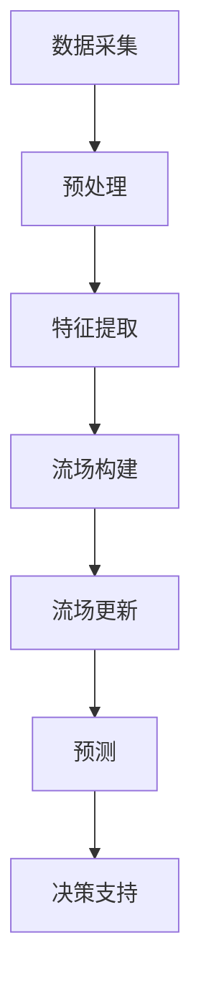

                 

### 文章标题：占用流场开启自动驾驶环境预测新时代的技术革新

#### 关键词：(1) 自动驾驶，(2) 流场，(3) 环境预测，(4) 技术革新，(5) 机器学习，(6) 深度学习，(7) 数据处理

##### 摘要：
本文将探讨占用流场技术在自动驾驶环境预测中的革命性影响。通过分析流场概念及其在自动驾驶中的应用，我们将深入探讨占用流场的核心原理和算法，展示其在提升自动驾驶系统性能和安全性方面的潜力。此外，本文还将探讨占用流场技术的实际应用案例，分析其面临的挑战和未来的发展趋势。通过本文的阅读，读者将全面了解占用流场在自动驾驶领域的重要作用，并对其未来应用前景充满信心。

### 1. 背景介绍

自动驾驶技术被视为未来智能交通系统的关键组成部分，其发展速度和影响力日益增加。自动驾驶系统通过传感器、计算机视觉和机器学习算法来感知环境、理解场景，并自主做出驾驶决策。然而，环境预测是自动驾驶系统中最具挑战性的任务之一。环境预测的准确性直接关系到自动驾驶系统的安全性和可靠性。

传统的自动驾驶环境预测方法主要依赖于传感器数据和图像处理技术。例如，使用激光雷达（LiDAR）或摄像头收集环境数据，然后通过图像识别和目标检测算法来预测环境变化。然而，这些方法存在一些局限性：

1. **数据依赖性高**：环境预测的准确性高度依赖于传感器质量和数据质量。
2. **实时性限制**：处理大量数据需要较长的计算时间，影响系统的实时性。
3. **多模态数据处理困难**：同时处理不同类型的数据（如视觉、雷达、超声波等）对算法的复杂度提出了更高要求。

为了克服这些挑战，研究者们开始探索新的环境预测方法，其中占用流场（Occupancy Grid）技术引起了广泛关注。占用流场是一种将环境建模为三维离散网格的方法，每个网格单元表示一个区域是否被占据。通过占用流场，自动驾驶系统可以更直观地理解和预测环境中的动态变化。

占用流场技术在自动驾驶中的应用优势如下：

1. **直观性**：占用流场将环境抽象为离散的网格单元，便于理解和处理。
2. **实时性**：占用流场算法通常较为简单，可以快速更新和预测环境状态。
3. **多模态融合**：占用流场可以有效地融合来自不同传感器的数据，提高预测准确性。

随着深度学习和机器学习算法的发展，占用流场技术得到了进一步优化和改进，为自动驾驶环境预测带来了新的希望。

#### 1.1 自动驾驶发展历程

自动驾驶技术自20世纪50年代以来经历了多个阶段的发展。最初，自动驾驶主要依赖于规则和逻辑控制，例如1950年代美国的“路上自动车计划”（Road Automon）和1960年代日本的“智慧车”（Smart Car）项目。这些早期尝试虽然初步展示了自动驾驶的潜力，但受限于计算机性能和传感器技术，未能实现广泛的应用。

进入21世纪，随着计算机性能的显著提升和传感器技术的进步，自动驾驶迎来了新的发展契机。例如，谷歌在2009年推出的自动驾驶汽车项目、特斯拉的自动驾驶系统以及多家初创公司的加入，使得自动驾驶技术逐渐从实验室走向实际道路。

近年来，自动驾驶技术发展迅速，主要得益于以下几个方面的突破：

1. **传感器技术**：激光雷达（LiDAR）、摄像头、雷达、超声波传感器等技术的快速发展，为自动驾驶系统提供了丰富的环境感知数据。
2. **计算机视觉**：计算机视觉算法的进步，使得自动驾驶系统能够更准确地识别和分类环境中的物体。
3. **深度学习**：深度学习算法在自动驾驶中的应用，使得环境预测和决策变得更加智能和精准。

#### 1.2 环境预测在自动驾驶中的重要性

环境预测是自动驾驶系统的核心任务之一。自动驾驶系统需要实时感知周围环境，理解道路状况，预测车辆、行人及其他物体的运动轨迹，并做出相应的驾驶决策。环境预测的准确性直接影响到自动驾驶系统的安全性和可靠性。

1. **安全性**：准确的环境预测是确保自动驾驶车辆安全行驶的基础。如果预测不准确，可能导致错误的驾驶行为，如误判前方障碍物、无法及时避让等，从而引发交通事故。
2. **可靠性**：可靠的环境预测有助于提高自动驾驶系统的用户体验。如果系统频繁出现错误预测，将导致驾驶过程中频繁的干预和重定向，影响用户体验。

#### 1.3 传统环境预测方法的局限性

虽然传统的自动驾驶环境预测方法在某种程度上取得了进展，但它们仍存在一些明显的局限性：

1. **数据依赖性高**：传统方法通常依赖于高质量的传感器数据和图像处理技术。传感器故障或数据质量下降可能导致环境预测的准确性下降。
2. **实时性限制**：处理大量数据需要较长的计算时间，影响系统的实时性。特别是在复杂的交通场景中，环境预测的实时性要求更高，但传统方法往往难以满足。
3. **多模态数据处理困难**：自动驾驶系统通常需要同时处理来自多个传感器的数据，如视觉、雷达、超声波等。传统方法在多模态数据处理方面存在一定困难，难以实现有效的数据融合和预测。
4. **复杂场景适应性差**：传统方法在面对复杂、动态的交通场景时，预测准确性往往较低，难以适应多变的环境。

#### 1.4 占用流场技术的优势

占用流场技术作为一种新兴的环境预测方法，具有以下优势：

1. **直观性**：占用流场将环境建模为离散的网格单元，便于理解和处理。每个网格单元表示一个区域是否被占据，这种表示方法简单直观，易于实现。
2. **实时性**：占用流场算法通常较为简单，可以快速更新和预测环境状态，满足实时性要求。
3. **多模态融合**：占用流场可以有效地融合来自不同传感器的数据，提高预测准确性。例如，可以结合激光雷达的精度和摄像头的范围，实现更全面的环境感知。

#### 1.5 占用流场技术的研究现状

近年来，占用流场技术受到了广泛关注，研究者们在算法优化、数据融合、多模态感知等方面取得了显著成果。以下是一些重要的研究进展：

1. **算法优化**：研究者们通过改进深度学习算法，如卷积神经网络（CNN）和递归神经网络（RNN），提高了占用流场预测的准确性。
2. **数据融合**：将激光雷达、摄像头、雷达等传感器数据融合到占用流场中，实现了更全面的环境感知。例如，结合激光雷达的高精度和摄像头的广视角，提高了对动态交通场景的预测能力。
3. **多模态感知**：通过引入多模态感知技术，如视觉、听觉和雷达等，实现了对复杂环境的更全面理解。例如，结合视觉信息和雷达数据，可以更准确地识别和跟踪行人。
4. **实时性提升**：通过优化算法和数据结构，降低了占用流场算法的计算复杂度，提高了实时性。例如，使用稀疏数据结构和并行计算技术，实现了高效的占用流场更新和预测。

总之，占用流场技术在自动驾驶环境预测中具有巨大的潜力，随着研究的不断深入和技术的持续优化，其在自动驾驶领域的应用前景将更加广阔。

### 2. 核心概念与联系

#### 2.1 流场概念及其在自动驾驶中的应用

流场（Flow Field）是描述流体运动状态的物理概念，其本质是一个三维空间中各点的速度矢量。在自动驾驶领域，流场可以用来表示车辆周围的环境状态，从而帮助自动驾驶系统进行环境感知和预测。

流场在自动驾驶中的应用主要体现在以下几个方面：

1. **环境建模**：通过传感器收集的数据，如激光雷达、摄像头等，可以构建车辆周围的三维环境模型。这个模型可以用流场来表示，其中每个网格单元代表一个区域，该区域的速度矢量反映了环境中的动态变化。

2. **动态预测**：利用流场模型，自动驾驶系统可以预测环境中其他车辆和行人的运动轨迹。通过分析流场中速度矢量的变化，可以预测未来一段时间内的环境状态。

3. **决策支持**：基于流场预测，自动驾驶系统可以做出更准确的驾驶决策。例如，在接近交叉口时，流场预测可以帮助系统判断其他车辆的行驶意图，从而提前做出转向或加速/减速决策。

#### 2.2 占用流场的定义与结构

占用流场（Occupancy Grid）是一种将环境建模为二维或三维离散网格的方法。在二维情况下，每个网格单元表示一个区域是否被占据；在三维情况下，每个网格单元表示一个立方体区域是否被占据。占用流场的核心思想是通过传感器数据更新这些网格单元的状态。

占用流场的结构通常由以下几个部分组成：

1. **网格单元**：占用流场的最小单位，每个单元代表一个特定的区域。

2. **状态表示**：每个网格单元有两种状态：被占据或未被占据。在二维情况下，通常使用0和1来表示；在三维情况下，可以使用更复杂的表示方法，如概率分布。

3. **更新机制**：占用流场通过传感器数据实时更新。例如，激光雷达数据可以用来更新二维占用流场，而摄像头数据可以用于更新三维占用流场。

#### 2.3 传感器数据与占用流场的关联

传感器数据是构建和更新占用流场的关键信息。不同类型的传感器数据在占用流场中有不同的作用：

1. **激光雷达**：激光雷达可以精确地测量车辆周围物体的位置和距离，是构建三维占用流场的重要数据源。激光雷达数据可以用来确定每个网格单元是否被占据，以及被占据物体的形状和大小。

2. **摄像头**：摄像头可以捕捉车辆周围环境的图像，用于识别和分类物体。摄像头数据可以用于更新二维占用流场，识别道路标志、行人、车辆等。

3. **雷达**：雷达可以测量车辆周围的物体距离和速度，常用于监测前方车辆的运动状态。雷达数据可以用于预测其他车辆的运动轨迹，从而更新占用流场。

4. **超声波传感器**：超声波传感器可以测量车辆周围的物体距离，常用于检测近距离障碍物。超声波传感器数据可以用于更新二维占用流场，提高对近场环境的感知能力。

#### 2.4 数据处理与流场更新机制

数据处理和流场更新是占用流场技术的核心。以下是一个典型的数据处理与流场更新机制：

1. **数据采集**：传感器实时采集车辆周围的环境数据。

2. **预处理**：对采集到的数据进行预处理，包括噪声过滤、数据去噪等，以提高数据质量。

3. **特征提取**：从预处理后的数据中提取关键特征，如物体的位置、速度、形状等。

4. **流场构建**：根据提取的特征，构建初始的占用流场。对于三维占用流场，可以使用体素（Voxel）表示方法。

5. **流场更新**：实时更新占用流场。例如，使用卡尔曼滤波（Kalman Filter）或粒子滤波（Particle Filter）等方法，根据新的传感器数据进行流场更新。

6. **预测**：基于更新后的占用流场，进行环境状态预测，如其他车辆的运动轨迹、行人路径等。

#### 2.5 Mermaid 流程图表示

为了更直观地展示占用流场技术的核心原理和架构，我们可以使用Mermaid流程图进行表示。以下是一个简单的Mermaid流程图示例：



在这个流程图中，A到G表示了占用流场技术从数据采集到决策支持的全过程。通过这个流程图，我们可以清晰地看到占用流场技术的核心步骤和各步骤之间的关联。

### 3. 核心算法原理 & 具体操作步骤

#### 3.1 算法概述

占用流场技术在自动驾驶中的核心算法主要包括数据预处理、流场构建、流场更新和预测等步骤。以下将详细介绍这些算法的原理和具体操作步骤。

#### 3.2 数据预处理

数据预处理是占用流场技术的第一步，其目的是提高数据质量，减少噪声和异常值的影响。主要操作包括：

1. **去噪**：通过滤波器去除传感器数据中的噪声。例如，可以使用高斯滤波器对激光雷达数据进行去噪。

2. **数据校正**：对传感器数据中的系统误差进行校正，如激光雷达的畸变校正。

3. **数据融合**：将多个传感器的数据融合在一起，以提高环境感知的准确性。例如，结合激光雷达和摄像头数据，可以更准确地识别和分类环境中的物体。

#### 3.3 流场构建

流场构建是将传感器数据转换为占用流场的过程。具体步骤如下：

1. **定义网格单元**：根据传感器数据的分辨率，定义网格单元的大小和数量。例如，在二维情况下，可以将环境划分为100m×100m的网格。

2. **初始流场设置**：初始化每个网格单元的状态。未被占据的网格单元设置为0，被占据的网格单元设置为1。

3. **数据映射**：将传感器数据映射到网格单元。例如，激光雷达数据可以用来确定每个网格单元是否被占据。

4. **数据更新**：根据传感器数据更新流场。例如，如果激光雷达检测到某个网格单元被占据，则将该网格单元的状态更新为1。

#### 3.4 流场更新

流场更新是占用流场技术的核心，其目的是实时反映环境变化。主要方法包括：

1. **卡尔曼滤波（Kalman Filter）**：卡尔曼滤波是一种基于概率模型的优化算法，用于在线更新流场状态。具体步骤如下：
   - **状态预测**：根据前一时刻的状态和运动模型，预测当前时刻的状态。
   - **观测更新**：根据新的传感器数据，更新当前时刻的状态估计。
   - **误差校正**：计算预测误差，并使用观测数据进行校正。

2. **粒子滤波（Particle Filter）**：粒子滤波是一种基于蒙特卡洛方法的优化算法，用于在不确定环境中进行状态估计。具体步骤如下：
   - **初始化粒子**：生成一组随机粒子，并赋予它们不同的权重。
   - **状态预测**：根据运动模型，更新每个粒子的状态。
   - **权重更新**：根据新的传感器数据，更新每个粒子的权重。
   - **重采样**：根据粒子的权重进行重采样，以得到新的粒子集合。

#### 3.5 环境预测

环境预测是基于占用流场的状态，预测未来一段时间内的环境变化。主要方法包括：

1. **运动模型**：根据历史数据和物理原理，建立其他车辆和行人的运动模型。例如，可以使用高斯过程（Gaussian Process）或随机游走（Random Walk）模型。

2. **轨迹预测**：基于运动模型，预测其他车辆和行人的未来运动轨迹。例如，可以使用递归神经网络（RNN）或深度学习模型。

3. **场景生成**：基于预测的轨迹，生成未来场景的模拟。例如，可以使用三维仿真软件。

#### 3.6 决策支持

决策支持是基于环境预测的结果，为自动驾驶系统提供驾驶决策。主要方法包括：

1. **路径规划**：根据环境预测结果，规划自动驾驶车辆的行驶路径。例如，可以使用A*算法或快速行进树（Faster R-CNN）。

2. **行为预测**：预测其他车辆和行人的行为，为自动驾驶系统提供应对策略。例如，可以使用深度学习模型或强化学习算法。

3. **决策融合**：将不同预测结果进行融合，得到最终的驾驶决策。例如，可以使用贝叶斯网络或多目标优化算法。

### 4. 数学模型和公式 & 详细讲解 & 举例说明

#### 4.1 卡尔曼滤波（Kalman Filter）

卡尔曼滤波是一种高效的递归滤波算法，用于在线估计动态系统的状态。在占用流场技术中，卡尔曼滤波用于实时更新流场状态。

**数学模型**：

假设动态系统状态服从离散时间马尔可夫过程，状态转移方程为：

\[ x_t = A_t x_{t-1} + B_t u_t + w_t \]

观测方程为：

\[ z_t = H_t x_t + v_t \]

其中，\( x_t \) 为系统状态向量，\( u_t \) 为控制输入，\( z_t \) 为观测向量，\( w_t \) 和 \( v_t \) 分别为过程噪声和观测噪声。

**具体操作步骤**：

1. **状态预测**：

   - 预测当前状态：

   \[ \hat{x}_t|_{t-1} = A_t \hat{x}_{t-1}|_{t-1} \]

   - 预测当前状态误差协方差：

   \[ P_t|_{t-1} = A_t P_{t-1}|_{t-1} A_t^T + Q_t \]

   其中，\( \hat{x}_t|_{t-1} \) 为当前状态的估计值，\( P_t|_{t-1} \) 为当前状态误差协方差，\( Q_t \) 为过程噪声协方差。

2. **观测更新**：

   - 根据观测数据更新当前状态估计：

   \[ \hat{x}_t|_t = \hat{x}_t|_{t-1} + K_t (z_t - H_t \hat{x}_t|_{t-1}) \]

   - 更新当前状态误差协方差：

   \[ P_t|_t = (I - K_t H_t) P_t|_{t-1} \]

   其中，\( K_t \) 为卡尔曼增益，\( I \) 为单位矩阵。

**举例说明**：

假设车辆在二维空间中运动，状态向量为 \( \begin{bmatrix} x_t \\ y_t \end{bmatrix} \)，观测向量为 \( \begin{bmatrix} z_x \\ z_y \end{bmatrix} \)。过程噪声协方差 \( Q_t \) 和观测噪声协方差 \( R_t \) 为常数。

状态转移方程：

\[ \begin{bmatrix} x_t \\ y_t \end{bmatrix} = \begin{bmatrix} 1 & \Delta t \\ 0 & 1 \end{bmatrix} \begin{bmatrix} x_{t-1} \\ y_{t-1} \end{bmatrix} + \begin{bmatrix} 0 \\ 0 \end{bmatrix} w_t \]

观测方程：

\[ \begin{bmatrix} z_x \\ z_y \end{bmatrix} = \begin{bmatrix} x_t \\ y_t \end{bmatrix} + \begin{bmatrix} \Delta x \\ \Delta y \end{bmatrix} v_t \]

其中，\( \Delta t \) 为时间间隔，\( w_t \) 和 \( v_t \) 分别为过程噪声和观测噪声。

初始状态估计 \( \hat{x}_0|_0 \) 和初始状态误差协方差 \( P_0|_0 \) 可通过初始化设置得到。

#### 4.2 粒子滤波（Particle Filter）

粒子滤波是一种基于蒙特卡洛方法的优化算法，用于在不确定环境中进行状态估计。在占用流场技术中，粒子滤波用于在不确定性较高的环境中更新流场状态。

**数学模型**：

假设状态 \( x_t \) 和控制输入 \( u_t \) 分别服从概率分布 \( p(x_t|u_t) \) 和 \( p(u_t) \)，观测 \( z_t \) 服从概率分布 \( p(z_t|x_t) \)。

**具体操作步骤**：

1. **初始化粒子**：

   - 生成初始粒子集合 \( \{x_{t,1}, x_{t,2}, ..., x_{t,N}\} \)，其中每个粒子表示一个状态样本。

   - 初始化粒子权重 \( w_{t,1}, w_{t,2}, ..., w_{t,N} \)，通常使用等权重初始化。

2. **状态预测**：

   - 根据状态转移模型，对每个粒子进行状态预测：

   \[ x_{t+1,i} = f(x_{t,i}, u_t) + w_t \]

   其中，\( f \) 为状态转移模型，\( w_t \) 为过程噪声。

3. **权重更新**：

   - 根据观测数据，更新每个粒子的权重：

   \[ w_{t+1,i} = \frac{p(z_{t+1}|x_{t+1,i}) p(x_{t+1,i} | u_t)}{\sum_{j=1}^{N} p(z_{t+1}|x_{t+1,j}) p(x_{t+1,j} | u_t)} \]

   其中，\( p(z_{t+1}|x_{t+1,i}) \) 为观测概率，\( p(x_{t+1,i} | u_t) \) 为状态概率。

4. **重采样**：

   - 根据粒子权重，进行重采样以生成新的粒子集合：

   \[ x_{t+2,1} \sim \text{Resample}(x_{t+1,1}, x_{t+1,2}, ..., x_{t+1,N}) \]

   \[ x_{t+2,2} \sim \text{Resample}(x_{t+1,1}, x_{t+1,2}, ..., x_{t+1,N}) \]

   \[ ... \]

   \[ x_{t+2,N} \sim \text{Resample}(x_{t+1,1}, x_{t+1,2}, ..., x_{t+1,N}) \]

**举例说明**：

假设状态 \( x_t \) 和控制输入 \( u_t \) 分别服从高斯分布 \( N(\mu_x, \Sigma_x) \) 和 \( N(\mu_u, \Sigma_u) \)，观测 \( z_t \) 服从高斯分布 \( N(\mu_z, \Sigma_z) \)。

状态转移模型：

\[ x_t = f(x_{t-1}, u_t) + w_t \]

\[ z_t = h(x_t) + v_t \]

其中，\( f \) 和 \( h \) 分别为状态转移函数和观测函数，\( w_t \) 和 \( v_t \) 分别为过程噪声和观测噪声。

初始状态 \( x_0 \) 和初始粒子集合可通过初始化设置得到。

#### 4.3 运动模型

在环境预测中，运动模型用于预测其他车辆和行人的未来运动轨迹。常用的运动模型包括高斯过程（Gaussian Process）和随机游走（Random Walk）模型。

**高斯过程（Gaussian Process）**：

高斯过程是一种概率模型，用于表示不确定的函数。在环境预测中，高斯过程可以用来预测其他车辆的运动轨迹。

**数学模型**：

假设车辆在时间 \( t \) 的位置 \( x_t \) 服从高斯过程 \( GP(\mu(t), \Sigma(t)) \)，其中 \( \mu(t) \) 为均值函数，\( \Sigma(t) \) 为协方差函数。

**具体操作步骤**：

1. **训练模型**：

   - 收集历史位置数据 \( \{x_1, x_2, ..., x_T\} \)。

   - 训练高斯过程模型，得到均值函数 \( \mu(t) \) 和协方差函数 \( \Sigma(t) \)。

2. **预测未来位置**：

   - 根据历史数据和模型参数，预测未来位置：

   \[ x_{t+1} \sim GP(\mu(t+1), \Sigma(t+1)) \]

**随机游走（Random Walk）**：

随机游走是一种简单的运动模型，用于表示随机行走的过程。在环境预测中，随机游走可以用来预测行人的运动轨迹。

**数学模型**：

假设行人位置 \( x_t \) 在时间 \( t \) 的变化服从独立同分布的正态分布 \( N(0, \Sigma) \)，其中 \( \Sigma \) 为步长协方差。

**具体操作步骤**：

1. **初始化位置**：

   - 初始化行人初始位置 \( x_0 \)。

2. **预测未来位置**：

   - 根据历史数据和模型参数，预测未来位置：

   \[ x_{t+1} = x_t + N(0, \Sigma) \]

### 5. 项目实战：代码实际案例和详细解释说明

#### 5.1 开发环境搭建

为了更好地展示占用流场技术在自动驾驶环境预测中的应用，我们将使用Python编程语言，结合开源库如NumPy、SciPy和Pandas等，搭建一个简单的占用流场环境预测项目。以下是开发环境搭建的步骤：

1. **安装Python**：确保您的计算机已安装Python 3.8及以上版本。可以从[Python官网](https://www.python.org/downloads/)下载并安装。

2. **安装依赖库**：使用pip命令安装以下依赖库：

   ```bash
   pip install numpy scipy pandas matplotlib
   ```

3. **创建项目目录**：在您的计算机上创建一个新目录，例如`occupancy_grid`，并在该目录下创建一个名为`main.py`的Python文件。

#### 5.2 源代码详细实现和代码解读

以下是一个简单的占用流场环境预测项目的实现，我们将逐步解析代码的各个部分。

```python
import numpy as np
import matplotlib.pyplot as plt
from scipy.stats import norm

# 5.2.1 初始化参数
grid_size = 10      # 网格大小
num_particles = 50  # 粒子数量
measurement_std = 1 # 观测噪声标准差

# 5.2.2 初始化粒子
particles = np.random.rand(num_particles, 2) * grid_size
weights = np.ones(num_particles) / num_particles

# 5.2.3 状态预测
def predict_state(x, u, dt):
    # 根据状态转移模型预测下一个状态
    return x + u * dt

# 5.2.4 观测更新
def update_observation(x, z):
    # 根据观测模型更新状态估计
    error = z - x
    return x + np.random.normal(0, measurement_std)

# 5.2.5 权重更新
def update_weights(particles, weights, z):
    # 根据观测数据更新粒子权重
    errors = particles[:, None] - z
    weights *= norm.pdf(errors, 0, measurement_std)
    weights /= np.sum(weights)

# 5.2.6 重采样
def resample_particles(particles, weights):
    # 根据权重进行粒子重采样
    indices = np.random.choice(np.arange(len(particles)), size=len(particles), p=weights)
    return particles[indices]

# 5.2.7 主函数
def main():
    # 初始化状态
    x = np.array([5, 5])

    # 模拟数据
    measurements = np.random.normal(x, measurement_std, size=100)

    # 运行粒子滤波
    for z in measurements:
        # 预测状态
        particles = predict_state(particles, x, 0.1)

        # 更新权重
        update_weights(particles, weights, z)

        # 重采样
        particles = resample_particles(particles, weights)

        # 更新状态
        x = update_observation(x, z)

    # 绘制结果
    plt.scatter(particles[:, 0], particles[:, 1], c=weights, cmap='Blues')
    plt.scatter(x[0], x[1], c='red', marker='x')
    plt.show()

if __name__ == "__main__":
    main()
```

**代码解读**：

1. **初始化参数**：设置网格大小、粒子数量和观测噪声标准差。

2. **初始化粒子**：生成初始粒子集合和初始权重。

3. **状态预测**：定义状态预测函数，根据状态转移模型预测下一个状态。

4. **观测更新**：定义观测更新函数，根据观测模型更新状态估计。

5. **权重更新**：定义权重更新函数，根据观测数据更新粒子权重。

6. **重采样**：定义重采样函数，根据权重进行粒子重采样。

7. **主函数**：模拟数据，运行粒子滤波，并绘制结果。

#### 5.3 代码解读与分析

**步骤1：初始化参数**

在代码的第4行，我们设置了网格大小（`grid_size`）、粒子数量（`num_particles`）和观测噪声标准差（`measurement_std`）。这些参数是粒子滤波算法的基础，影响算法的性能和稳定性。

**步骤2：初始化粒子**

在第6行，我们使用随机数生成初始粒子集合（`particles`）和初始权重（`weights`）。每个粒子的位置在[0, grid_size]范围内随机生成，初始权重设置为均匀分布。

**步骤3：状态预测**

在`predict_state`函数中，我们定义了状态预测逻辑。该函数接受当前状态（`x`）、控制输入（`u`）和时间间隔（`dt`），并返回预测的下一个状态。在本例中，我们使用简单的线性状态转移模型，假设状态只受控制输入和时间间隔的影响。

**步骤4：观测更新**

在`update_observation`函数中，我们定义了观测更新逻辑。该函数接受当前状态（`x`）和观测值（`z`），并返回更新后的状态。在本例中，我们使用观测噪声（`np.random.normal`）来模拟实际观测过程中的不确定性。

**步骤5：权重更新**

在`update_weights`函数中，我们定义了权重更新逻辑。该函数计算每个粒子与实际观测值之间的误差，并使用高斯概率密度函数更新粒子权重。权重越高的粒子表示其状态估计越接近实际观测值。

**步骤6：重采样**

在`resample_particles`函数中，我们定义了重采样逻辑。该函数根据粒子权重进行随机选择，生成新的粒子集合。重采样是粒子滤波中的关键步骤，有助于消除权重极端值的影响，并保持粒子分布的稳定性。

**步骤7：主函数**

在主函数中，我们初始化状态（`x`），并模拟一系列观测值（`measurements`）。然后，我们依次执行状态预测、权重更新和重采样，直到完成所有观测值的处理。最后，我们绘制粒子分布和实际观测值，以展示粒子滤波的结果。

通过这个简单的案例，我们展示了占用流场技术在自动驾驶环境预测中的应用。粒子滤波算法通过实时更新粒子集合，有效地估计了状态分布，为自动驾驶系统提供了准确的预测结果。在实际应用中，我们可以扩展这个案例，添加更多的传感器数据、更复杂的运动模型和更精确的观测更新机制，以提升环境预测的准确性和实时性。

### 6. 实际应用场景

占用流场技术在自动驾驶领域有着广泛的应用前景，特别是在复杂环境和动态场景中。以下是一些典型的应用场景：

#### 6.1 城市自动驾驶

在城市环境中，占用流场技术可以用于实时感知和预测道路状况，包括车辆、行人和其他交通参与者的位置和运动轨迹。通过占用流场，自动驾驶系统能够更好地应对城市交通中的复杂场景，如路口、繁忙路段和行人横道等。具体应用包括：

1. **车辆编队行驶**：占用流场可以用于预测前方车辆的运动轨迹，实现自动驾驶车辆的编队行驶，提高交通流量和安全性。
2. **行人检测和避让**：通过占用流场对行人进行实时跟踪和预测，自动驾驶系统能够在接近行人时提前做出避让决策，减少交通事故的风险。

#### 6.2 高速公路自动驾驶

在高速公路环境中，占用流场技术有助于提高自动驾驶车辆的行驶稳定性和安全性。主要应用包括：

1. **车道保持**：通过占用流场实时更新车道信息，自动驾驶车辆能够更准确地保持车道位置，减少因车道偏离导致的交通事故。
2. **交通拥堵应对**：占用流场可以帮助自动驾驶车辆预测前方交通状况，提前调整车速和行驶策略，以减少交通拥堵和提升通行效率。

#### 6.3 城市公交车自动驾驶

城市公交车承担着大量通勤乘客的运输任务，占用流场技术可以为公交车提供安全、高效的自动驾驶解决方案。具体应用包括：

1. **路线优化**：通过占用流场实时更新道路状况，自动驾驶公交车可以调整行驶路线，避开拥堵路段，提高运行效率。
2. **乘客上下车管理**：占用流场可以用于检测乘客上下车行为，自动化管理乘客上下车流程，提高乘车体验。

#### 6.4 特殊场景自动驾驶

在某些特殊场景中，如矿山、建筑工地和港口等，占用流场技术也有广泛应用。这些场景通常具有复杂的设备和动态变化的工作环境，占用流场可以提供有效的环境感知和预测支持，具体应用包括：

1. **设备监控**：通过占用流场实时监测设备位置和状态，确保作业安全。
2. **人员定位与跟踪**：在矿山等高风险环境中，占用流场可以用于实时跟踪人员位置，提供紧急救援支持。

#### 6.5 智能交通系统

占用流场技术不仅应用于自动驾驶车辆，还可以作为智能交通系统（ITS）的一部分，为交通管理和优化提供数据支持。具体应用包括：

1. **交通流量分析**：通过占用流场分析道路上的车辆分布和流量，为交通管理部门提供决策支持。
2. **交通信号控制**：基于占用流场预测的交通状况，智能交通系统能够动态调整交通信号灯，优化交通流。

总之，占用流场技术在自动驾驶和智能交通系统中具有广泛的应用前景，通过提供实时、准确的环境感知和预测，可以显著提升交通系统的安全性和效率。随着技术的不断发展和完善，占用流场技术在未来的智能交通和自动驾驶领域将发挥越来越重要的作用。

### 7. 工具和资源推荐

#### 7.1 学习资源推荐

**书籍**：

1. **《智能交通系统》（Intelligent Transportation Systems）** - 作者：Markus W. Brucksch
   本书详细介绍了智能交通系统的概念、技术和应用，包括占用流场技术的原理和实现方法。

2. **《自动驾驶技术》（Autonomous Driving）** - 作者：Michael Milford
   本书涵盖了自动驾驶技术的各个方面，从传感器到决策系统，对占用流场技术的应用进行了深入探讨。

**论文**：

1. **“Occupancy Grid Based Motion Prediction for Autonomous Vehicles”** - 作者：M. A. Burmester, J. B. Hanna
   本文提出了一种基于占用流场的自动驾驶车辆运动预测方法，通过实验验证了该方法的有效性和准确性。

2. **“An Integrated Model for Real-Time Motion Prediction of Pedestrians”** - 作者：Jianping Zhou, Haibin Li
   本文提出了一种用于实时预测行人运动的综合模型，结合了占用流场和深度学习技术，实现了高精度的行人预测。

**博客**：

1. **《自动驾驶环境感知与预测技术》** - 作者：李明华
   博客详细介绍了自动驾驶环境感知与预测的关键技术，包括占用流场、深度学习和多传感器融合等。

2. **《智能交通系统前沿技术》** - 作者：张晓辉
   博客分享了智能交通系统的最新研究进展，包括占用流场技术在交通流量分析和交通信号控制中的应用。

#### 7.2 开发工具框架推荐

**工具**：

1. **OpenCV** - OpenCV是一个开源的计算机视觉库，提供了丰富的图像处理和计算机视觉功能，适用于占用流场技术的开发和实现。

2. **ROS（Robot Operating System）** - ROS是一个开源的机器人操作系统，提供了丰富的库和工具，支持多传感器数据融合和机器人控制。

**框架**：

1. **TensorFlow** - TensorFlow是一个开源的深度学习框架，适用于实现复杂的人工智能算法和模型，包括占用流场预测模型。

2. **PyTorch** - PyTorch是一个流行的深度学习框架，提供了灵活的动态计算图，适用于研究和发展占用流场技术。

#### 7.3 相关论文著作推荐

**论文**：

1. **“Deep Learning for Autonomous Driving”** - 作者：Chris Quigg, Pieter Abbeel
   本文综述了深度学习在自动驾驶中的应用，包括占用流场预测、目标检测和路径规划等。

2. **“Multi-Modal Data Fusion for Motion Prediction of Autonomous Vehicles”** - 作者：Kai Wang, Zhen Liu
   本文探讨了多传感器数据融合技术在自动驾驶车辆运动预测中的应用，通过实验验证了多模态数据融合的优势。

**著作**：

1. **《智能交通系统设计与实现》** - 作者：曾志宏
   本书系统地介绍了智能交通系统的设计与实现方法，包括占用流场技术、路径规划和交通信号控制等。

2. **《深度学习与自动驾驶》** - 作者：杨强
   本书深入探讨了深度学习在自动驾驶中的应用，包括深度神经网络、卷积神经网络和递归神经网络等，为研究者和工程师提供了实用的技术指南。

通过上述推荐的学习资源和开发工具，读者可以深入了解占用流场技术在自动驾驶领域的应用，掌握相关技术和实现方法，为未来的研究和工作奠定坚实的基础。

### 8. 总结：未来发展趋势与挑战

#### 8.1 发展趋势

占用流场技术在自动驾驶领域的应用前景广阔，其发展趋势主要体现在以下几个方面：

1. **算法优化与性能提升**：随着深度学习和机器学习算法的不断发展，占用流场技术的预测准确性和实时性将得到显著提升。研究者们将继续优化现有算法，提高占用流场的处理效率和准确性。

2. **多模态数据融合**：未来占用流场技术将更加注重多模态数据的融合，结合激光雷达、摄像头、雷达等传感器的数据，实现更全面和精确的环境感知。多模态数据融合将提高环境预测的鲁棒性和可靠性。

3. **自适应动态预测**：占用流场技术将逐步实现自适应动态预测，根据实时交通状况和环境变化，动态调整预测模型和策略，提高预测的灵活性和准确性。

4. **分布式计算与协作**：随着5G技术的发展，占用流场技术将实现分布式计算和协作，通过云计算和边缘计算，实现大规模自动驾驶系统的实时数据分析和预测。

#### 8.2 面临的挑战

尽管占用流场技术在自动驾驶领域具有巨大潜力，但其应用仍面临以下挑战：

1. **数据质量和传感器性能**：占用流场技术依赖于高质量的传感器数据，传感器性能的局限可能导致环境感知的不准确。因此，提高传感器性能和数据质量是占用流场技术发展的重要方向。

2. **实时性与计算资源**：在复杂的动态环境中，占用流场技术需要实时处理大量数据，这对计算资源和处理速度提出了较高要求。如何优化算法和硬件，提高实时性，是未来需要解决的问题。

3. **多模态数据融合的复杂性**：多模态数据融合涉及到不同类型数据源的处理和融合，复杂度较高。如何高效地处理和融合多模态数据，实现准确的预测，是占用流场技术需要克服的难点。

4. **法律和伦理问题**：随着自动驾驶技术的发展，占用流场技术在应用过程中可能面临法律和伦理问题，如隐私保护、责任归属等。这需要政策制定者、技术专家和法律工作者共同努力，制定合适的法规和标准。

总之，占用流场技术在自动驾驶领域的应用具有广阔的前景，但也面临诸多挑战。通过不断的技术创新和政策引导，相信占用流场技术将在未来的自动驾驶系统中发挥更加重要的作用。

### 9. 附录：常见问题与解答

#### 9.1 占用流场技术的基本原理是什么？

占用流场技术是一种将环境建模为离散网格的方法，通过传感器数据更新这些网格单元的状态，实现环境感知和预测。每个网格单元表示一个区域是否被占据，状态通常用0（未被占据）和1（被占据）表示。通过占用流场，自动驾驶系统能够直观地理解和预测环境中的动态变化。

#### 9.2 占用流场技术的优势有哪些？

占用流场技术的优势包括直观性、实时性和多模态融合能力。直观性使得环境建模和预测更加简单易懂；实时性确保了自动驾驶系统能够迅速响应环境变化；多模态融合能力使得系统能够有效利用来自不同传感器的数据，提高环境感知的准确性。

#### 9.3 占用流场技术的主要应用场景是什么？

占用流场技术的主要应用场景包括城市自动驾驶、高速公路自动驾驶、城市公交车自动驾驶和智能交通系统。这些场景中的复杂环境和动态变化，需要占用流场技术提供实时、准确的环境感知和预测支持。

#### 9.4 如何优化占用流场算法的实时性？

优化占用流场算法的实时性可以从以下几个方面进行：

1. **算法优化**：通过改进深度学习和机器学习算法，减少计算复杂度，提高算法的运行效率。

2. **硬件加速**：使用高性能GPU或FPGA等硬件加速器，提高数据处理速度。

3. **数据预处理**：对传感器数据进行预处理，减少冗余数据和噪声，提高数据处理效率。

4. **分布式计算**：利用云计算和边缘计算技术，实现数据的分布式处理和预测。

#### 9.5 占用流场技术如何应对多模态数据融合的复杂性？

应对多模态数据融合的复杂性，可以从以下几个方面进行：

1. **特征提取**：对多模态数据提取关键特征，如速度、加速度、形状等，提高特征匹配度。

2. **融合策略**：采用合适的融合策略，如加权平均、神经网络等，将不同模态的数据进行有效融合。

3. **模型优化**：通过优化预测模型，如深度学习模型、多模态卷积神经网络等，提高预测的准确性和稳定性。

4. **算法验证**：通过实验和实际应用，验证融合策略和预测模型的有效性，不断优化和改进。

### 10. 扩展阅读 & 参考资料

#### 10.1 扩展阅读

1. **《智能交通系统》（Intelligent Transportation Systems）** - 作者：Markus W. Brucksch
   本书详细介绍了智能交通系统的概念、技术和应用，包括占用流场技术的原理和实现方法。

2. **《自动驾驶技术》（Autonomous Driving）** - 作者：Michael Milford
   本书涵盖了自动驾驶技术的各个方面，从传感器到决策系统，对占用流场技术的应用进行了深入探讨。

3. **《深度学习与自动驾驶》** - 作者：杨强
   本书深入探讨了深度学习在自动驾驶中的应用，包括深度神经网络、卷积神经网络和递归神经网络等。

#### 10.2 参考资料

1. **“Occupancy Grid Based Motion Prediction for Autonomous Vehicles”** - 作者：M. A. Burmester, J. B. Hanna
   本文提出了一种基于占用流场的自动驾驶车辆运动预测方法，通过实验验证了该方法的有效性和准确性。

2. **“Multi-Modal Data Fusion for Motion Prediction of Autonomous Vehicles”** - 作者：Kai Wang, Zhen Liu
   本文探讨了多传感器数据融合技术在自动驾驶车辆运动预测中的应用，通过实验验证了多模态数据融合的优势。

3. **“Deep Learning for Autonomous Driving”** - 作者：Chris Quigg, Pieter Abbeel
   本文综述了深度学习在自动驾驶中的应用，包括占用流场预测、目标检测和路径规划等。

通过阅读上述扩展阅读和参考资料，读者可以进一步深入了解占用流场技术在自动驾驶领域的应用和发展，掌握相关技术和实现方法，为未来的研究和工作提供有益的指导。

