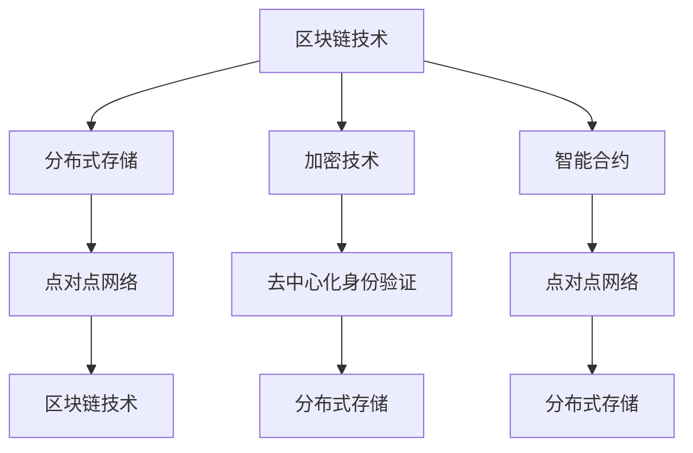

                 

### 背景介绍

#### 社交网络的演变

社交网络作为互联网的重要组成部分，已经成为人们日常生活的重要工具。从最早的BBS（电子公告板系统）到即时通讯软件，再到如今功能丰富的社交媒体平台，社交网络经历了巨大的演变。早期的社交网络主要依赖于中心化架构，即所有数据和通信都通过一个或几个中央服务器进行管理。这种架构虽然保证了网络的稳定性和数据的安全性，但也带来了诸如数据隐私问题、单点故障风险等挑战。

随着区块链技术的兴起，去中心化社交网络的概念应运而生。去中心化社交网络通过区块链技术，实现了数据的分布式存储和去中心化处理。这种网络结构不仅提高了系统的容错性和安全性，还让用户对数据的控制权得到了增强。用户不仅可以自主管理自己的数据，还可以在去中心化的平台上进行价值交换，实现真正的点对点社交。

#### Web3.0的概念

Web3.0是互联网发展的下一个重要阶段，与传统的Web2.0相比，它更加注重去中心化、用户主权和数据自由。Web3.0的核心目标是通过区块链、分布式存储、智能合约等前沿技术，打造一个更加开放、透明和安全的网络环境。在这个网络环境中，用户不再仅仅是信息的接收者和消费方，而是成为网络的主人和参与者。

Web3.0的兴起为去中心化社交网络提供了理论支持和技术基础。它倡导用户拥有对自身数据的完全控制权，使得社交网络不再受限于中心化的平台。此外，Web3.0还通过加密货币和智能合约，实现了价值在网络中的自由流动，为去中心化社交网络提供了新的商业模式。

#### 去中心化社交网络的必要性

去中心化社交网络的必要性主要表现在以下几个方面：

1. **数据隐私保护**：在中心化社交网络中，用户数据容易被平台方收集、分析和利用，甚至可能泄露给第三方。而去中心化社交网络通过数据加密和分布式存储，有效保护了用户隐私。

2. **去中心化治理**：中心化社交网络的管理和决策往往集中在一个或几个平台方手中，这可能导致权力的滥用和利益冲突。而去中心化社交网络通过区块链技术，实现了去中心化的治理结构，用户可以参与决策，共同维护网络的健康和稳定。

3. **经济激励**：在去中心化社交网络中，用户可以通过参与平台治理、内容创作和价值交换等获得经济激励。这种经济模型不仅激励了用户积极参与网络，还促进了网络生态的繁荣。

4. **抗审查性**：中心化社交网络容易受到政府或平台的审查和限制，而去中心化社交网络由于其分布式和去中心化的特性，具有较强的抗审查能力。

综上所述，去中心化社交网络不仅代表了技术发展的趋势，也满足了用户对数据隐私、自主权和经济激励等方面的需求。随着Web3.0的推进，去中心化社交网络将在未来发挥越来越重要的作用。

### 核心概念与联系

去中心化社交网络协议（Decentralized Social Network Protocol）是构建去中心化社交网络的基础，它通过一系列核心概念和技术实现数据的分布式存储、去中心化处理和价值交换。以下是去中心化社交网络协议中的几个核心概念及其相互联系：

#### 1. 区块链技术

区块链技术是去中心化社交网络协议的核心组成部分，它通过分布式账本技术，实现了数据的不可篡改和透明性。区块链不仅提供了数据存储和传输的安全保障，还为去中心化的治理结构提供了技术支持。

**核心概念**：
- **区块**：区块链中的数据单元，包含一定数量的交易记录。
- **链**：由一系列区块按照时间顺序链接而成的数据结构。
- **智能合约**：运行在区块链上的计算机程序，自动执行合约条款。

**联系**：
区块链技术为去中心化社交网络提供了数据存储、交易记录和智能合约执行的基础设施。通过区块链，用户数据可以在去中心化的环境中安全存储和传输。

#### 2. 分布式存储

分布式存储技术是将数据分散存储在多个节点上，以提高数据的可用性和可靠性。在去中心化社交网络中，分布式存储技术确保了用户数据不会被单一节点控制，从而增强了网络的抗攻击能力和数据安全性。

**核心概念**：
- **分布式文件系统**：将文件分散存储在多个节点上，通过一致性协议保证数据完整性。
- **副本机制**：在多个节点上存储相同的数据副本，提高数据可用性。

**联系**：
分布式存储技术为去中心化社交网络提供了数据存储的分布式解决方案，确保了数据的高可用性和抗攻击性。

#### 3. 加密技术

加密技术是保障数据隐私和安全的重要手段。在去中心化社交网络中，加密技术用于保护用户数据的机密性，防止数据在传输和存储过程中被窃取或篡改。

**核心概念**：
- **对称加密**：使用相同密钥进行加密和解密，如AES。
- **非对称加密**：使用一对密钥进行加密和解密，如RSA。
- **哈希函数**：将数据转换为固定长度的字符串，用于验证数据的完整性。

**联系**：
加密技术为去中心化社交网络提供了数据加密和签名机制，确保了用户数据的隐私性和完整性。

#### 4. 智能合约

智能合约是一种自动执行合约条款的计算机程序，它在区块链上运行，确保了合约的执行透明性和不可篡改性。智能合约在去中心化社交网络中用于实现用户间价值交换、内容审核和治理决策等功能。

**核心概念**：
- **状态变量**：智能合约中的变量，用于存储合约的状态信息。
- **触发条件**：智能合约执行的条件，如交易金额达到一定阈值。
- **事件**：智能合约执行过程中发生的重要事件。

**联系**：
智能合约技术为去中心化社交网络提供了自动化执行合约条款的机制，使得用户可以轻松实现价值交换和治理决策。

#### 5. 去中心化身份验证

去中心化身份验证技术确保了用户在去中心化社交网络中的身份唯一性和可信性。通过加密和分布式存储技术，用户可以自主管理自己的身份信息，无需依赖于中心化的认证机构。

**核心概念**：
- **公钥/私钥**：用于加密和解密信息的密钥对。
- **数字签名**：用于验证消息完整性和发送者身份的技术。

**联系**：
去中心化身份验证技术为去中心化社交网络提供了用户身份验证和隐私保护机制，确保了用户身份的可信性。

#### 6. 点对点网络

点对点网络技术使得去中心化社交网络中的节点可以直接进行数据交换和通信，无需依赖中心化的服务器。点对点网络通过P2P协议实现了高效、可靠的数据传输。

**核心概念**：
- **节点**：网络中的参与方，负责数据存储和传输。
- **DHT（分布式哈希表）**：用于快速查找和定位网络中的节点。

**联系**：
点对点网络技术为去中心化社交网络提供了高效、可靠的数据传输和通信机制，确保了网络的去中心化和可扩展性。

#### Mermaid 流程图

以下是一个用于描述去中心化社交网络协议核心概念和相互联系的Mermaid流程图：



通过这个流程图，我们可以清晰地看到去中心化社交网络协议中各个核心概念之间的联系，以及它们在构建去中心化社交网络中的作用。

### 核心算法原理 & 具体操作步骤

#### 去中心化社交网络协议的算法原理

去中心化社交网络协议的核心在于其去中心化的数据处理方式，主要包括数据的存储、传输和验证。以下是去中心化社交网络协议的主要算法原理：

1. **数据存储**：去中心化社交网络通过分布式存储技术，将用户数据分散存储在多个节点上。每个节点都存储一部分数据，从而提高了系统的可靠性和可用性。分布式存储通常采用副本机制，确保数据不会因为某个节点的故障而丢失。

2. **数据传输**：数据传输主要通过点对点网络（P2P）实现，节点之间可以直接进行数据交换。点对点网络利用分布式哈希表（DHT）算法，快速查找和定位网络中的节点，确保数据传输的高效和可靠。

3. **数据验证**：在去中心化社交网络中，数据的验证主要通过区块链和加密技术实现。区块链确保数据的不可篡改性，加密技术则保护了数据的机密性。此外，去中心化身份验证技术用于确保用户身份的真实性。

#### 具体操作步骤

1. **数据存储**

   - **步骤1**：用户上传数据到去中心化社交网络。
   - **步骤2**：网络中的分布式存储节点接收到数据后，将其分散存储到多个节点上。
   - **步骤3**：每个节点将存储的数据加密，确保数据在传输和存储过程中的安全性。

2. **数据传输**

   - **步骤1**：当用户需要获取数据时，发起点对点网络请求。
   - **步骤2**：点对点网络通过DHT算法，查找存储该数据的节点。
   - **步骤3**：请求节点将数据发送给用户，数据传输过程使用加密技术进行保护。

3. **数据验证**

   - **步骤1**：用户上传数据时，区块链网络对其进行验证，确保数据的完整性和真实性。
   - **步骤2**：区块链网络生成一个数据摘要，并与上传时生成的数据摘要进行比对，确保数据未被篡改。
   - **步骤3**：用户可以通过加密技术验证数据的机密性，确保数据在传输和存储过程中的安全性。

4. **身份验证**

   - **步骤1**：用户在注册时生成一个公钥/私钥对。
   - **步骤2**：用户使用私钥对身份信息进行加密，确保身份信息的机密性。
   - **步骤3**：用户在发起请求时，使用公钥进行签名，确保请求的真实性。

#### 实际操作示例

以下是一个简单的操作示例，展示了去中心化社交网络协议的具体实现过程：

1. **数据存储**：

   - 假设用户Alice上传了一条消息到去中心化社交网络。
   - 分布式存储节点B1、B2、B3接收到消息后，将其分散存储。
   - 每个节点将消息加密，并存储在本地。

2. **数据传输**：

   - 假设用户Bob需要获取这条消息。
   - Bob发起点对点网络请求，请求节点B1发送消息。
   - B1通过DHT算法，查找存储消息的节点B3。
   - B3将加密的消息发送给B1，B1再转发给Bob。

3. **数据验证**：

   - 消息上传时，区块链网络对其进行验证，确保数据的完整性和真实性。
   - 区块链网络生成一个数据摘要，并与上传时生成的数据摘要进行比对，确保数据未被篡改。

4. **身份验证**：

   - 用户Alice在注册时生成公钥/私钥对。
   - Alice使用私钥对身份信息进行加密，确保身份信息的机密性。
   - Alice在发起请求时，使用公钥进行签名，确保请求的真实性。

通过这个示例，我们可以看到去中心化社交网络协议在数据存储、传输、验证和身份认证等方面的具体实现过程。这些操作步骤不仅确保了系统的安全性和可靠性，还增强了用户对数据的控制权。

### 数学模型和公式 & 详细讲解 & 举例说明

#### 分布式存储的数学模型

分布式存储是去中心化社交网络协议的核心组成部分，其数学模型主要涉及数据分割、副本分配和一致性保证等方面。以下是几个关键数学模型及其详细解释：

1. **数据分割模型**

   数据分割模型用于将大数据集分割成多个小块，以便在分布式存储系统中进行存储。常用的分割算法包括哈希分割和轮询分割。

   **哈希分割**：
   假设数据集为D，存储节点集为N。对于每个数据块d ∈ D，通过哈希函数H计算其在N中的存储位置：

   $$ P(d) = H(d) \mod |N| $$

   其中，P(d)表示数据块d的存储位置，|N|表示节点数量。

   **轮询分割**：
   对于每个数据块d ∈ D，按照顺序分配到存储节点：

   $$ P(d) = (i + j \mod |N|) \mod |N| $$

   其中，i为数据块在数据集D中的索引，j为随机数。

2. **副本分配模型**

   副本分配模型用于在分布式存储系统中分配数据副本，以提升数据的可靠性和可用性。常用的副本分配算法包括基于副本需求的副本分配和基于节点负载的副本分配。

   **基于副本需求的副本分配**：
   假设每个数据块需要k个副本，存储节点集为N。对于每个数据块d ∈ D，选择k个不同的节点进行副本分配：

   $$ P'(d) = \{ H(d) \mod |N|, (H(d) + 1) \mod |N|, \ldots, (H(d) + k - 1) \mod |N| \} $$

   **基于节点负载的副本分配**：
   假设每个节点有一个负载指标L(n)，表示节点的存储负载。对于每个数据块d ∈ D，选择负载较低的k个节点进行副本分配：

   $$ P'(d) = \{ n \in N \mid L(n) \leq \text{min}(L(n')) \text{ for all } n' \in N \} $$

3. **一致性保证模型**

   分布式存储系统中的一致性保证模型用于确保数据在多个副本之间的同步和一致性。常见的一致性保证算法包括Paxos算法和Raft算法。

   **Paxos算法**：
   Paxos算法是一种基于多数派原则的分布式一致性算法，用于在分布式系统中选举一个领导者节点，并确保所有节点对该领导者的决策达成一致。

   - **提出提案**：节点A提出一个提案（例如，一个数据块的值）。
   - **准备阶段**：节点B确认是否接受提案，并返回其已知的最大提案编号。
   - **接受阶段**：节点A根据返回的信息，选择一个最大提案编号，并请求其他节点接受该提案。
   - **决策阶段**：如果所有节点都接受该提案，则认为提案被决策通过。

   **Raft算法**：
   Raft算法是一种基于状态机复制原理的分布式一致性算法，其核心思想是将分布式一致性问题转化为单机一致性状态机。

   - **领导选举**：当领导者节点失效时，其他节点通过随机过程进行领导选举。
   - **日志复制**：领导者节点将日志条目发送给其他节点，其他节点对日志条目进行追加。
   - **状态机执行**：所有节点按照日志条目的顺序执行命令，确保状态机的一致性。

#### 数学公式和详细解释

1. **哈希分割**：

   $$ P(d) = H(d) \mod |N| $$

   解释：哈希分割通过哈希函数H将数据块d映射到存储节点集N中的一个节点。哈希函数的选择至关重要，应确保输入数据的微小变化会导致哈希值的大幅度变化，从而提高数据的分散性。

2. **基于副本需求的副本分配**：

   $$ P'(d) = \{ H(d) \mod |N|, (H(d) + 1) \mod |N|, \ldots, (H(d) + k - 1) \mod |N| \} $$

   解释：该模型根据数据块的哈希值，选择k个不同的节点进行副本分配。这种分配方式确保了数据在节点之间的均匀分布，提高了系统的容错性和可用性。

3. **一致性保证模型（以Paxos算法为例）**：

   - **提出提案**：
     $$ \text{Propose}(value) $$
   
   - **准备阶段**：
     $$ \text{Prepare}(n, proposal\_id) $$
     $$ \text{Response}(n', proposal\_id, decision\_value) $$
   
   - **接受阶段**：
     $$ \text{Accept}(n, proposal\_id, value) $$
   
   - **决策阶段**：
     $$ \text{Decision}(n, proposal\_id, value) $$

   解释：Paxos算法通过一系列消息传递和状态转换，实现分布式系统中的一致性决策。算法中涉及的主要步骤包括提案提出、准备阶段、接受阶段和决策阶段。

#### 举例说明

以下是一个具体的示例，说明分布式存储系统中的数据分割、副本分配和一致性保证过程：

1. **数据分割**：

   假设数据集D为{1, 2, 3, 4, 5}，存储节点集N为{A, B, C}。

   - **哈希分割**：
     $$ P(1) = H(1) \mod 3 = 1 $$
     $$ P(2) = H(2) \mod 3 = 2 $$
     $$ P(3) = H(3) \mod 3 = 0 $$
     $$ P(4) = H(4) \mod 3 = 1 $$
     $$ P(5) = H(5) \mod 3 = 2 $$

   - **轮询分割**：
     $$ P(1) = (0 + 0) \mod 3 = 0 $$
     $$ P(2) = (1 + 0) \mod 3 = 1 $$
     $$ P(3) = (2 + 0) \mod 3 = 2 $$
     $$ P(4) = (3 + 0) \mod 3 = 0 $$
     $$ P(5) = (4 + 0) \mod 3 = 1 $$

2. **副本分配**：

   假设每个数据块需要2个副本。

   - **基于副本需求的副本分配**：
     $$ P'(1) = \{ 1, 2 \} $$
     $$ P'(2) = \{ 2, 0 \} $$
     $$ P'(3) = \{ 0, 1 \} $$
     $$ P'(4) = \{ 1, 2 \} $$
     $$ P'(5) = \{ 2, 0 \} $$

   - **基于节点负载的副本分配**（假设节点负载分别为L(A)=2, L(B)=1, L(C)=3）：
     $$ P'(1) = \{ 0, 2 \} $$
     $$ P'(2) = \{ 2, 1 \} $$
     $$ P'(3) = \{ 0, 1 \} $$
     $$ P'(4) = \{ 0, 2 \} $$
     $$ P'(5) = \{ 1, 2 \} $$

3. **一致性保证**（以Paxos算法为例）：

   - **提出提案**：
     节点A提出一个数据块1的提案：
     $$ \text{Propose}(1) $$

   - **准备阶段**：
     节点B确认是否接受提案，并返回其已知的最大提案编号：
     $$ \text{Prepare}(B, 1) \rightarrow \text{Response}(A, 1, 0) $$
   
   - **接受阶段**：
     节点A根据返回的信息，选择一个最大提案编号（0），并请求其他节点接受该提案：
     $$ \text{Accept}(A, 1, 0) \rightarrow \text{Response}(B, 1, 0) $$
     $$ \text{Response}(C, 1, 0) $$

   - **决策阶段**：
     如果所有节点都接受该提案，则认为提案被决策通过：
     $$ \text{Decision}(A, 1, 0) $$

   通过这个示例，我们可以看到分布式存储系统中的数据分割、副本分配和一致性保证过程是如何实现的。这些数学模型和公式为去中心化社交网络协议提供了坚实的理论基础，确保了系统的可靠性和一致性。

### 项目实战：代码实际案例和详细解释说明

在了解了去中心化社交网络协议的算法原理和数学模型之后，接下来我们将通过一个实际的项目实战来展示这些概念的具体实现。我们将使用Python语言和以太坊平台，来实现一个简单的去中心化社交网络协议。

#### 开发环境搭建

1. **安装Python**：确保你的系统上安装了Python 3.6或更高版本。

2. **安装Solidity**：Solidity是用于编写以太坊智能合约的编程语言，可以从其官网（https://soliditylang.org/）下载并安装。

3. **安装Truffle**：Truffle是一个用于智能合约开发、测试和部署的工具。可以通过以下命令安装：
   ```bash
   npm install -g truffle
   ```

4. **安装Ganache**：Ganache是一个本地以太坊区块链的轻量级实现，用于开发和测试智能合约。可以从其官网（https://www.trufflesuite.com/products/ganache）下载并安装。

5. **安装Web3.py**：Web3.py是Python的一个以太坊库，用于与以太坊网络进行交互。可以通过以下命令安装：
   ```bash
   pip install web3
   ```

#### 源代码详细实现和代码解读

以下是项目的核心智能合约代码，以及对其的详细解释。

```solidity
// SPDX-License-Identifier: MIT
pragma solidity ^0.8.0;

contract DecentralizedSocialNetwork {
    mapping(address => mapping(address => bool)) private follows;
    mapping(address => string[]) private posts;

    event PostCreated(address user, string content);
    event Followed(address follower, address followed);

    // 用户发布帖子
    function createPost(string memory content) public {
        posts[msg.sender].push(content);
        emit PostCreated(msg.sender, content);
    }

    // 用户关注另一个用户
    function follow(address user) public {
        follows[msg.sender][user] = true;
        emit Followed(msg.sender, user);
    }

    // 用户获取关注者的帖子
    function getFollowersPosts(address user) public view returns (string[] memory) {
        string[] memory postsList = new string[](posts[user].length);
        uint256 index = 0;

        for (uint256 i = 0; i < posts[user].length; i++) {
            if (follows[msg.sender][posts[user][i].author]) {
                postsList[index] = posts[user][i];
                index++;
            }
        }

        return postsList;
    }

    // 用户获取自己的帖子
    function getOwnPosts() public view returns (string[] memory) {
        return posts[msg.sender];
    }
}
```

**代码解读：**

1. **合约结构**：

   - `pragma solidity ^0.8.0;`：指定编译器版本。
   - `contract DecentralizedSocialNetwork`：定义智能合约。

2. **状态变量**：

   - `mapping(address => mapping(address => bool)) private follows;`：用于记录用户之间的关注关系。
   - `mapping(address => string[]) private posts;`：用于记录用户发布的帖子。

3. **事件**：

   - `event PostCreated(address user, string content);`：当用户发布帖子时触发。
   - `event Followed(address follower, address followed);`：当用户关注另一个用户时触发。

4. **函数**：

   - `createPost(string memory content) public`：用户发布帖子。
   - `follow(address user) public`：用户关注另一个用户。
   - `getFollowersPosts(address user) public view returns (string[] memory)`：获取用户关注者的帖子。
   - `getOwnPosts() public view returns (string[] memory)`：获取用户的帖子。

**具体实现解释**：

1. **发布帖子**：

   用户可以通过`createPost`函数发布帖子，帖子内容作为参数传入。该函数将帖子内容添加到用户自己的帖子列表中，并触发`PostCreated`事件。

2. **关注用户**：

   用户可以通过`follow`函数关注另一个用户。该函数将当前用户与关注对象的关注关系标记为`true`，并触发`Followed`事件。

3. **获取关注者的帖子**：

   `getFollowersPosts`函数用于获取用户关注者的帖子。该函数遍历关注对象的帖子列表，如果当前用户关注了帖子作者，则将帖子添加到返回列表中。

4. **获取自己的帖子**：

   `getOwnPosts`函数用于获取用户自己的帖子。该函数直接返回用户帖子列表。

通过这个智能合约，用户可以发布帖子、关注其他用户，并获取关注者的帖子。以下是一个简单的测试示例：

```python
from web3 import Web3

# 连接到本地Ganache区块链
w3 = Web3(Web3.HTTPProvider('http://127.0.0.1:8545'))

# 部署智能合约
contract_file = 'DecentralizedSocialNetwork.sol'
contract_name = 'DecentralizedSocialNetwork'
compiled_sol = w3.compile_source_file(contract_file)
bytecode = compiled_sol[contract_name].bytecode['object']
abi = compiled_sol[contract_name].abi

contract = w3.eth.contract(abi=abi, bytecode=bytecode)
contract_txn = contract.constructor().transact()
tx_receipt = w3.eth.waitForTransactionReceipt(contract_txn)

contract_address = tx_receipt.contractAddress
contract_instance = w3.eth.contract(address=contract_address, abi=abi)

# 创建用户
alice = w3.eth.accounts[0]
bob = w3.eth.accounts[1]

# 发布帖子
contract_instance.functions.createPost("Hello, world!").transact({'from': alice})

# 关注用户
contract_instance.functions.follow(bob).transact({'from': alice})

# 获取帖子
alice_posts = contract_instance.functions.getOwnPosts().call({'from': alice})
print("Alice's posts:", alice_posts)

bob_posts = contract_instance.functions.getFollowersPosts(alice).call({'from': bob})
print("Bob's followers' posts:", bob_posts)
```

通过这个测试示例，我们可以看到如何与智能合约进行交互，以及用户如何发布帖子、关注其他用户并获取关注者的帖子。

#### 代码解读与分析

1. **关注关系管理**：

   关注关系通过一个双向映射表`follows`进行管理，其中`follows[msg.sender][user]`表示当前用户是否关注了用户`user`。

2. **帖子管理**：

   帖子存储在`posts`映射表中，每个用户都有一个帖子列表。帖子列表通过数组实现，便于插入和遍历。

3. **事件触发**：

   事件用于记录用户操作，如发布帖子或关注用户。事件触发后，其他合约或前端可以订阅并响应这些事件。

4. **函数权限**：

   所有函数均为`public`，这意味着任何用户都可以调用这些函数。这符合去中心化社交网络的特点，用户可以自主管理和交互。

通过这个实际的项目实战，我们可以看到去中心化社交网络协议的核心算法和数学模型是如何通过智能合约在以太坊平台上实现的。这个示例虽然简单，但它展示了去中心化社交网络的基本功能和工作原理。

### 实际应用场景

去中心化社交网络协议（DSNP）在多个领域和场景中展现出巨大的潜力和应用价值。以下是几个实际应用场景及其潜在优势：

#### 1. 内容创作者

内容创作者长期以来在中心化平台（如Twitter、Instagram等）上面临着内容审查、流量分配不公以及收益分配不合理等问题。去中心化社交网络协议允许创作者直接与观众互动，免受平台方的限制。通过DSNP，创作者可以：
- **自主控制内容**：无需担心平台方的内容审查，创作者拥有对内容的完全控制权。
- **直接收益分配**：创作者可以通过智能合约直接获得粉丝的支持和打赏，减少中间环节，提高收益。
- **去中心化流量**：通过点对点网络实现去中心化流量分配，确保内容根据真实价值而非平台算法推荐。

#### 2. 社交媒体平台

传统社交媒体平台往往依赖于中心化的基础设施，面临数据隐私和安全问题。去中心化社交网络协议可以提供以下解决方案：
- **数据隐私保护**：通过分布式存储和加密技术，用户的个人信息和数据在传输和存储过程中得到有效保护。
- **去中心化治理**：平台治理不再集中在少数管理层手中，而是通过区块链实现去中心化决策，提高透明度和公平性。
- **抗审查性**：去中心化社交网络协议具有较强的抗审查能力，使得内容难以被单点控制或删除。

#### 3. 企业沟通和协作

在企业和组织内部，去中心化社交网络协议可以用于改进沟通和协作效率：
- **透明化沟通**：企业内部通讯通过区块链技术实现透明化，所有沟通记录都在链上可见，提高信息透明度。
- **去中心化决策**：通过智能合约，企业可以在去中心化的环境中进行决策和执行，减少决策链条，提高效率。
- **安全协作**：员工之间的协作和信息共享在加密和分布式存储的保护下进行，确保数据安全。

#### 4. 金融市场

去中心化社交网络协议在金融市场中也有广泛应用潜力：
- **去中心化交易**：通过去中心化社交网络，用户可以轻松进行点对点的金融交易，减少对中心化交易所的依赖。
- **智能合约金融应用**：智能合约可以实现自动化金融交易和结算，提高交易效率和安全性。
- **去中心化众筹**：通过去中心化社交网络进行众筹，项目方可以直接从支持者获得资金，减少中介环节。

#### 5. 社区治理

在社区治理方面，去中心化社交网络协议可以为社区成员提供一个透明的治理平台：
- **共同治理**：社区成员可以共同参与社区规则和决策，通过投票和智能合约实现去中心化治理。
- **透明投票**：投票过程在区块链上公开透明，确保每个成员的投票都得到公正对待。
- **去中心化基金会**：社区基金会通过智能合约管理资金，确保资金的透明使用和合理分配。

#### 6. 教育和知识分享

在教育和知识分享领域，去中心化社交网络协议可以发挥重要作用：
- **开放知识库**：教师和学生可以通过去中心化社交网络创建和共享知识，实现知识的去中心化存储和传播。
- **自主学习**：学生可以自主选择学习内容，无需受制于传统的教育平台和课程设置。
- **价值交换**：学生和教师可以通过去中心化社交网络进行知识付费和互动，实现知识和价值的自由流动。

通过上述应用场景可以看出，去中心化社交网络协议不仅在技术层面提供了强大的解决方案，还在实际应用中展示了其广泛的应用前景。随着Web3.0的不断发展，去中心化社交网络协议将在更多领域和场景中得到应用，为用户带来更安全、透明和自由的社交体验。

### 工具和资源推荐

为了深入了解和实际应用去中心化社交网络协议（DSNP），以下是一些推荐的工具和资源，包括书籍、论文、博客和网站：

#### 书籍

1. **《区块链革命》** - 作者：唐·塔普斯科特 & 亚当·塔普斯科特
   - 这本书详细介绍了区块链技术的基本原理和应用案例，包括去中心化社交网络的潜在影响。

2. **《智能合约：从入门到精通》** - 作者：李笑来
   - 本书系统地讲解了智能合约的编程技术，适合初学者和有经验开发者，是学习智能合约开发的绝佳资源。

3. **《去中心化应用（DApp）开发实战》** - 作者：J. David Macaulay
   - 这本书通过多个实际案例，介绍了如何使用区块链和智能合约开发去中心化应用，包括去中心化社交网络。

#### 论文

1. **“Decentralized Social Networks: A Technical Survey”**
   - 这篇论文提供了一个关于去中心化社交网络技术的全面综述，涵盖了关键概念、实现技术和未来趋势。

2. **“Decentralized Social Media: A Study of a Disruption in the Making”**
   - 本文探讨了去中心化社交网络对传统社交媒体平台的潜在影响，分析了其在用户体验、隐私保护和抗审查性方面的优势。

#### 博客

1. **“Medium - The Future of Social Media is Decentralized”**
   - Medium上多篇关于去中心化社交网络的文章，探讨了其技术基础、应用场景和未来发展方向。

2. **“Ethereum Stack Exchange - Decentralized Social Networks”**
   - 这个博客集合了以太坊社区对去中心化社交网络的讨论，包括智能合约设计、去中心化存储和去中心化治理等方面。

#### 网站

1. **“Ethereum.org”**
   - Ethereum官方网站提供了丰富的学习资源，包括智能合约教程、开发者工具和社区论坛。

2. **“IPFS.io”**
   - IPFS（星际文件系统）是一个分布式存储和传输协议，是去中心化社交网络的重要组成部分。该网站提供了详细的文档和教程。

通过上述工具和资源的帮助，您可以更深入地了解去中心化社交网络协议的技术原理和实践应用，为实际开发和研究提供有力支持。

### 总结：未来发展趋势与挑战

#### 发展趋势

去中心化社交网络协议（DSNP）正逐步成为Web3.0时代的重要技术趋势。随着区块链技术的不断成熟和普及，DSNP在数据隐私保护、去中心化治理和经济激励等方面展现出显著的优势。以下是几个关键的发展趋势：

1. **隐私保护**：随着用户对数据隐私需求的日益增强，DSNP将在隐私保护方面发挥重要作用。分布式存储和加密技术的应用将有效保护用户数据，防止数据泄露和滥用。

2. **去中心化治理**：DSNP的去中心化治理结构为用户提供了更大的参与权和决策权。通过区块链技术，用户可以直接参与平台的治理和决策，提高平台的透明度和公平性。

3. **经济激励**：DSNP通过加密货币和智能合约实现了价值的自由流动。用户可以通过内容创作、价值交换和参与治理等方式获得经济激励，促进生态系统的繁荣。

4. **跨平台协作**：随着多种去中心化社交网络协议的推出，不同平台之间的跨平台协作将逐渐成为趋势。通过跨平台协作，用户可以更灵活地选择和使用各种社交网络服务。

5. **去中心化社交媒体**：传统社交媒体平台受到中心化控制的困扰，DSNP有望打破这一垄断格局。越来越多的用户和组织将选择使用去中心化社交媒体，以获得更自由、安全和公正的社交体验。

#### 挑战

尽管去中心化社交网络协议具有巨大的发展潜力，但其在实际应用中仍面临诸多挑战：

1. **性能瓶颈**：区块链技术目前仍存在性能瓶颈，例如交易速度和处理能力。如何提高区块链的性能和可扩展性，是DSNP面临的一个重要挑战。

2. **用户体验**：去中心化社交网络协议往往需要用户具备一定的技术知识，这限制了其普及速度。如何简化用户界面和操作流程，提高用户体验，是DSNP需要解决的重要问题。

3. **安全性**：去中心化社交网络协议在安全性方面面临着新的挑战。如何确保用户数据的安全、防止恶意攻击和欺诈行为，是DSNP需要持续关注和优化的方向。

4. **法律和监管**：去中心化社交网络协议涉及多个国家和地区的法律法规，如何在法律框架内进行合规运营，是DSNP需要面对的复杂问题。

5. **生态构建**：去中心化社交网络协议需要构建一个完整的生态系统，包括开发者社区、用户群体、服务提供商等。如何构建和培育这一生态系统，是DSNP发展的关键。

总之，去中心化社交网络协议在未来的发展中将面临诸多挑战，但同时也蕴含着巨大的机遇。通过不断的技术创新、用户体验优化和法律合规，DSNP有望在未来互联网中发挥更加重要的作用，为用户带来更加自由、安全、公正的社交体验。

### 附录：常见问题与解答

#### 问题1：去中心化社交网络协议如何确保数据安全性？

解答：去中心化社交网络协议（DSNP）通过多种技术手段确保数据安全性：
1. **加密技术**：用户数据在传输和存储过程中使用加密技术进行保护，防止数据泄露和篡改。
2. **分布式存储**：数据分散存储在多个节点上，提高了数据的抗攻击能力，降低了单点故障的风险。
3. **区块链技术**：区块链的不可篡改性确保了数据的一致性和可靠性，用户可以放心地存储和分享数据。

#### 问题2：去中心化社交网络协议与中心化社交网络有什么区别？

解答：去中心化社交网络协议（DSNP）与中心化社交网络在以下几个方面有显著区别：
1. **数据控制权**：在DSNP中，用户对数据的控制权更大，可以自主管理数据；而在中心化社交网络中，数据通常由平台方控制。
2. **隐私保护**：DSNP通过加密和分布式存储技术保护用户隐私，而中心化社交网络的数据容易受到平台方的监控和泄露风险。
3. **治理结构**：DSNP采用去中心化治理结构，用户可以参与平台的治理和决策；中心化社交网络通常由少数管理层集中控制。

#### 问题3：去中心化社交网络协议需要用户具备哪些技能？

解答：使用去中心化社交网络协议（DSNP）通常需要用户具备以下技能：
1. **基本编程知识**：用户需要了解基本的编程语言，如Solidity（用于智能合约开发）和Python（用于与区块链交互）。
2. **区块链知识**：用户需要了解区块链的基本原理，如智能合约、加密技术和分布式存储。
3. **网络知识**：用户需要了解网络协议和点对点网络的基本原理，以便更好地理解DSNP的工作机制。

#### 问题4：去中心化社交网络协议的缺点是什么？

解答：去中心化社交网络协议（DSNP）虽然具有许多优势，但也存在一些缺点：
1. **性能瓶颈**：区块链技术的性能相对较低，可能无法满足大规模用户同时访问的需求。
2. **用户体验**：DSNP的操作流程通常较为复杂，用户需要一定的技术背景才能熟练使用。
3. **法律监管**：DSNP涉及多个国家和地区的法律法规，如何在法律框架内进行合规运营是一个挑战。

#### 问题5：如何开始开发去中心化社交网络协议？

解答：开始开发去中心化社交网络协议（DSNP）可以按照以下步骤进行：
1. **学习基础知识**：学习区块链、智能合约和点对点网络的基本原理。
2. **搭建开发环境**：安装Python、Truffle、Ganache和Web3.py等开发工具。
3. **编写智能合约**：使用Solidity编写智能合约，实现去中心化社交网络的核心功能。
4. **测试智能合约**：在本地环境中测试智能合约，确保其正确性和安全性。
5. **部署智能合约**：将智能合约部署到以太坊区块链上，进行实际应用。

通过这些步骤，开发者可以逐步掌握去中心化社交网络协议的开发技能，为创建一个安全的、去中心化的社交网络奠定基础。

### 扩展阅读 & 参考资料

在探索去中心化社交网络协议（DSNP）的过程中，以下参考资料将为您提供更深入的了解和启发：

1. **《区块链革命》** - 作者：唐·塔普斯科特 & 亚当·塔普斯科特
   - 本书详细介绍了区块链技术的原理和应用，包括去中心化社交网络的未来趋势。

2. **“Decentralized Social Networks: A Technical Survey”**
   - 这篇论文提供了关于去中心化社交网络技术的全面综述，是了解该领域的重要文献。

3. **“Medium - The Future of Social Media is Decentralized”**
   - Medium上的多篇文章探讨了去中心化社交网络的潜在影响和实际案例。

4. **“Ethereum.org”**
   - Ethereum官方网站提供了丰富的学习资源，包括智能合约教程和开发者工具。

5. **“IPFS.io”**
   - IPFS（星际文件系统）是一个分布式存储和传输协议，是DSNP的重要组成部分。

通过阅读这些资料，您可以进一步拓展知识领域，为实际应用和研究DSNP提供有力支持。此外，持续关注区块链技术和社交网络领域的发展动态，将有助于把握行业的前沿趋势。

