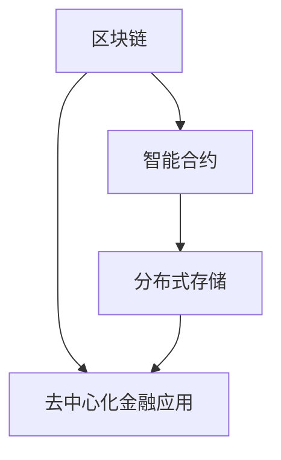
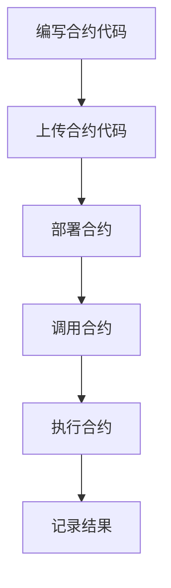
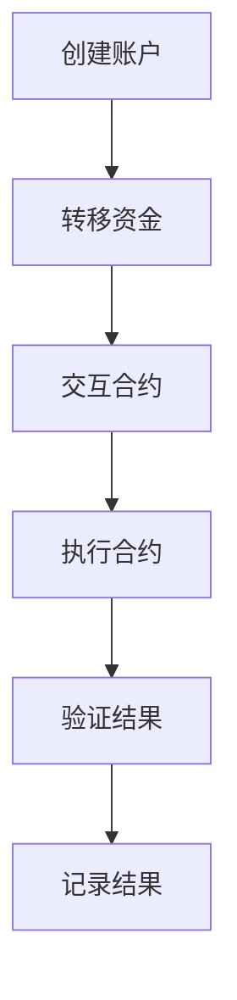

                 

### 背景介绍

去中心化金融（DeFi）是区块链技术的一个重要应用领域，近年来在全球金融科技领域引起了广泛的关注。去中心化金融的核心理念是通过区块链技术，构建一个去中心化的金融系统，使得金融活动能够在没有传统金融机构介入的情况下进行。这一概念的提出，旨在解决传统金融系统中存在的一些问题，如金融中心化的风险、低效率、不公平性等。

去中心化金融的历史可以追溯到2009年比特币的诞生。比特币作为第一个去中心化的数字货币，不仅改变了货币的定义，也为去中心化金融奠定了基础。随着区块链技术的不断发展，去中心化金融的概念逐渐成熟，并开始应用于实际场景中。2017年，以太坊平台的智能合约功能为去中心化金融的发展提供了新的契机，各种去中心化金融应用（DApps）开始涌现。

去中心化金融的关键技术包括区块链、智能合约、分布式存储等。区块链作为基础技术，提供了去中心化的账本系统，保证了交易的透明性和不可篡改性。智能合约则是一种自动化执行的合约，能够在满足特定条件时自动执行预定的操作，从而降低了金融交易的成本和风险。分布式存储技术则确保了数据的安全性和可靠性，避免了单点故障的风险。

在去中心化金融中，用户可以以去中心化的方式参与各种金融活动，如贷款、借贷、交易等。与传统金融系统相比，去中心化金融具有更高的透明度、更低的成本和更高的效率。此外，去中心化金融还提供了一种去中心化的金融基础设施，使得金融创新变得更加容易和便捷。

尽管去中心化金融具有巨大的潜力，但同时也面临着一些挑战和风险。例如，智能合约的安全性问题、市场波动性、监管不确定性等。这些挑战需要通过技术的不断进步和监管的完善来逐步解决。

总之，去中心化金融作为一种新兴的金融模式，正逐渐改变着传统金融的面貌。它不仅为金融行业带来了新的机遇，也为用户提供了更多的选择和可能性。在接下来的内容中，我们将深入探讨去中心化金融的核心概念、关键技术、实际应用场景以及未来发展趋势。

### 核心概念与联系

去中心化金融（DeFi）的核心概念和关键技术是理解其运作机制和潜力的关键。在这一部分，我们将详细介绍这些核心概念，并通过Mermaid流程图展示它们之间的联系。

#### 区块链

区块链是去中心化金融的基础技术之一。它是一种分布式账本技术，通过多个节点之间的协作，实现数据的存储和验证。区块链上的数据以块的形式按时间顺序链接在一起，形成一个不可篡改的链条。每个区块都包含一定数量的交易记录，这些交易记录在经过网络中的所有节点验证后，才会被永久记录在区块链上。

#### 智能合约

智能合约是去中心化金融的另一个核心组件。它是一种自动化执行的合约，包含在区块链上，并能够在满足特定条件时自动执行预定的操作。智能合约的代码通常使用编程语言（如Solidity）编写，并在区块链网络中进行部署和执行。智能合约确保了金融交易的透明性和不可篡改性，同时也降低了交易的成本和风险。

#### 分布式存储

分布式存储技术是去中心化金融的数据基础设施。它通过将数据分散存储在多个节点上，确保数据的安全性和可靠性。分布式存储避免了单点故障的风险，同时提高了数据的访问速度和容错能力。区块链技术本身也是一种分布式存储技术，它通过区块链网络中的节点来存储和验证数据。

#### Mermaid流程图

下面是一个简单的Mermaid流程图，展示去中心化金融中的关键组件及其联系：



在上述流程图中：
- **区块链（A）** 提供了去中心化的账本系统，记录所有交易记录。
- **智能合约（B）** 在区块链上执行，自动化执行预定的操作。
- **分布式存储（C）** 保障了数据的分散存储和可靠性。
- **去中心化金融应用（D）** 利用区块链、智能合约和分布式存储技术，实现各种金融功能。

通过这一流程图，我们可以清楚地看到去中心化金融的核心组件及其相互关系。这些组件共同构建了一个去中心化的金融生态系统，使得金融活动能够在没有传统金融机构介入的情况下进行。

#### 关键技术与去中心化金融的联系

去中心化金融的关键技术（区块链、智能合约、分布式存储）通过以下方式相互联系：

1. **区块链提供了基础架构**：区块链技术为去中心化金融提供了一个去中心化的账本系统，确保了交易记录的透明性和不可篡改性。
2. **智能合约实现了自动化**：智能合约能够在区块链上自动化执行预定的操作，降低了交易的成本和风险，同时也提高了金融交易的效率。
3. **分布式存储确保了数据安全**：分布式存储技术将数据分散存储在多个节点上，确保了数据的可靠性，避免了单点故障的风险。

总之，去中心化金融的核心概念和关键技术相互关联，共同构建了一个去中心化的金融生态系统。这些技术的集成，使得去中心化金融能够在不依赖于传统金融机构的情况下，提供高效、透明和安全的金融服务。

### 核心算法原理 & 具体操作步骤

去中心化金融（DeFi）的核心算法原理围绕着区块链、智能合约和分布式存储展开。为了更好地理解这些原理，我们将详细探讨智能合约的执行机制和去中心化金融操作的具体步骤。

#### 智能合约的执行机制

智能合约是去中心化金融的基础组件，其执行机制如下：

1. **合约编写**：开发者使用特定的编程语言（如Solidity）编写智能合约代码，定义合约的功能和规则。
2. **合约部署**：将编写的智能合约代码上传到区块链网络，并通过共识机制进行部署。部署过程包括将合约代码存储在区块链的永久存储区域中，并为其分配唯一的合约地址。
3. **合约调用**：用户通过区块链网络调用智能合约，执行特定的操作。调用过程需要用户支付一定的网络费用（如以太币），以激励网络中的节点参与验证和执行操作。
4. **合约执行**：智能合约在区块链网络中执行，按照预定的规则进行数据处理和操作。执行过程是透明和不可篡改的，所有节点都可以验证执行结果。
5. **合约结果记录**：执行结果被记录在区块链上，作为永久性的交易记录。

下面是一个简单的智能合约执行流程的Mermaid流程图：



#### 去中心化金融操作的具体步骤

在去中心化金融中，用户可以通过以下步骤参与金融操作：

1. **账户创建**：用户首先需要在去中心化金融平台上创建一个数字钱包账户，用于存储和转移加密货币。
2. **资金转移**：用户将资金转移到自己的数字钱包账户中。这个过程是通过区块链网络进行的，确保了资金转移的安全和透明。
3. **合约交互**：用户通过数字钱包与智能合约进行交互，执行特定的金融操作。例如，用户可以通过智能合约借出资金、进行借贷、交易加密货币等。
4. **合约执行**：智能合约根据用户的操作和预定的规则进行执行，处理交易并记录结果。
5. **结果验证**：区块链网络中的节点对智能合约的执行结果进行验证，确保交易记录的准确性和安全性。
6. **结果记录**：执行结果被记录在区块链上，作为永久性的交易记录，用户可以随时查询和验证。

下面是一个简单的去中心化金融操作流程的Mermaid流程图：



#### 案例分析

为了更好地理解去中心化金融的核心算法原理和操作步骤，我们可以通过一个简单的案例来分析。

**案例**：用户A想要通过去中心化借贷平台借出100个以太币。

1. **账户创建**：用户A在去中心化借贷平台上创建一个数字钱包账户，用于存储和转移以太币。
2. **资金转移**：用户A将100个以太币转移到自己的数字钱包账户中。
3. **合约交互**：用户A通过数字钱包与去中心化借贷平台的智能合约进行交互，借出100个以太币。
4. **合约执行**：智能合约根据用户A的请求，将100个以太币从用户A的账户转移到借款方B的账户中。
5. **结果验证**：区块链网络中的节点对智能合约的执行结果进行验证，确保交易记录的准确性和安全性。
6. **结果记录**：执行结果被记录在区块链上，作为永久性的交易记录。

通过上述案例，我们可以看到去中心化金融的核心算法原理和操作步骤是如何实现的。智能合约在这一过程中起到了关键作用，通过自动化和透明化的方式，实现了金融操作的便捷和高效。

总之，去中心化金融的核心算法原理和具体操作步骤，依赖于区块链、智能合约和分布式存储等关键技术。这些技术共同构建了一个去中心化的金融生态系统，为用户提供了高效、透明和安全的金融服务。

### 数学模型和公式 & 详细讲解 & 举例说明

在去中心化金融（DeFi）中，数学模型和公式扮演着至关重要的角色。这些模型不仅帮助我们理解金融操作的基本原理，还能确保交易的透明性和安全性。在这一部分，我们将详细讲解几个关键的数学模型和公式，并通过具体例子来说明它们的实际应用。

#### 1. 抵押率（LTV）

抵押率（Loan-to-Value Ratio，LTV）是去中心化借贷中一个重要的参数。它表示借款金额与抵押物价值的比例。LTV的公式如下：

\[ LTV = \frac{借款金额}{抵押物价值} \]

例如，如果用户A将价值1000美元的加密货币作为抵押物，借款500美元，那么LTV为：

\[ LTV = \frac{500}{1000} = 0.5 \]

这意味着借款金额仅为抵押物价值的50%。

#### 2. 借贷利率

借贷利率是去中心化借贷平台向借款人收取的费用。通常，借贷利率是按年利率（Annual Percentage Rate，APR）来计算的。借贷利率的公式如下：

\[ 利率 = \frac{借款金额 \times 年利率}{借款期限} \]

例如，如果用户B从去中心化借贷平台借入1000美元，年利率为10%，借款期限为一年，那么他需要支付的利息为：

\[ 利息 = \frac{1000 \times 10\%}{1} = 100 \text{美元} \]

总还款金额为借款金额加上利息：

\[ 总还款金额 = 1000 + 100 = 1100 \text{美元} \]

#### 3. 复利计算

在去中心化金融中，复利计算是另一个重要的数学模型。复利计算公式如下：

\[ 本息和 = P \times (1 + r/n)^(nt) \]

其中，\( P \) 是本金，\( r \) 是年利率，\( n \) 是每年计息次数，\( t \) 是时间（以年为单位）。

例如，如果用户C将1000美元存入去中心化借贷平台，年利率为5%，每年计息一次，存入两年，那么两年后的本息和为：

\[ 本息和 = 1000 \times (1 + 0.05/1)^(1 \times 2) = 1000 \times (1.05)^2 = 1102.5 \text{美元} \]

#### 例子说明

为了更好地理解上述数学模型和公式，我们可以通过一个具体例子来说明。

**例子**：用户D想通过去中心化借贷平台借入1000美元，抵押价值为1500美元，年利率为8%，借款期限为一年。

1. **抵押率计算**：

   \[ LTV = \frac{借款金额}{抵押物价值} = \frac{1000}{1500} = 0.67 \]

   抵押率为67%，表明借款金额是抵押物价值的67%。

2. **借贷利率计算**：

   借款期限为一年，年利率为8%，所以借款利息为：

   \[ 利息 = \frac{借款金额 \times 年利率}{借款期限} = \frac{1000 \times 8\%}{1} = 80 \text{美元} \]

   总还款金额为借款金额加上利息：

   \[ 总还款金额 = 1000 + 80 = 1080 \text{美元} \]

3. **复利计算**：

   假设用户D选择将借款存入去中心化借贷平台，年利率为5%，每年计息一次，存入两年。那么两年后的本息和为：

   \[ 本息和 = 1000 \times (1 + 0.05/1)^(1 \times 2) = 1000 \times (1.05)^2 = 1102.5 \text{美元} \]

通过这个例子，我们可以看到数学模型和公式在去中心化金融中的实际应用。这些模型不仅帮助我们理解金融操作的基本原理，还能确保交易的透明性和安全性。在未来，随着去中心化金融的不断发展，这些数学模型和公式将变得更加重要和复杂。

### 项目实战：代码实际案例和详细解释说明

在去中心化金融（DeFi）的实际应用中，智能合约是核心组件，它负责处理各种金融交易。为了更好地理解智能合约的开发过程，我们将通过一个实际案例来演示智能合约的编写、部署和执行。

#### 1. 开发环境搭建

在开始编写智能合约之前，我们需要搭建一个合适的开发环境。以下是所需工具和步骤：

- **编程语言**：Solidity（智能合约编写的主要编程语言）
- **开发工具**：Truffle（用于智能合约开发、测试和部署）
- **区块链节点**：Ganache（用于本地测试和调试）
- **版本控制**：Git

步骤如下：

1. 安装Node.js（智能合约开发环境的基础）。
2. 安装Truffle框架：

   ```bash
   npm install -g truffle
   ```

3. 创建一个新的Truffle项目：

   ```bash
   truffle init
   ```

4. 在项目中创建一个名为`contracts`的文件夹，用于存放智能合约代码。

#### 2. 源代码详细实现

我们将实现一个简单的去中心化借贷合约，它允许用户存入资金并按固定利率获取利息。以下是智能合约的源代码：

```solidity
// SPDX-License-Identifier: MIT
pragma solidity ^0.8.0;

contract DecentralizedLoan {
    mapping(address => uint256) public balances;
    uint256 public interestRate = 0.05; // 年利率5%

    function deposit() external payable {
        balances[msg.sender()] += msg.value;
    }

    function withdraw() external {
        uint256 balance = balances[msg.sender()];
        require(balance > 0, "余额不足");

        // 计算利息
        uint256 interest = balance * interestRate;
        balances[msg.sender()] = 0;

        // 发送本金和利息给用户
        payable(msg.sender()).transfer(balance + interest);
    }
}
```

#### 3. 代码解读与分析

**代码解析：**

- **合约结构**：`pragma solidity ^0.8.0;` 指定合约使用的Solidity版本。
- **变量定义**：`mapping(address => uint256) public balances;` 创建一个映射变量，用于存储每个用户的存款余额。
- **年利率**：`uint256 public interestRate = 0.05;` 定义合约的年利率为5%。
- **存款函数**：`function deposit() external payable { ... }` 允许用户通过发送以太币来存入资金。
- **取款函数**：`function withdraw() external { ... }` 允许用户取出存款及其利息。

**代码分析：**

- 存款函数中，`balances[msg.sender()] += msg.value;` 将用户的存款金额添加到映射变量中。
- 取款函数中，`require(balance > 0, "余额不足");` 确保用户有足够的余额可以取款。
- 利息计算：`uint256 interest = balance * interestRate;` 计算用户应得的利息。
- 取款时，`balances[msg.sender()] = 0;` 将用户的余额设为零，确保不会重复发放。
- 本金和利息的发放：`payable(msg.sender()).transfer(balance + interest);` 将本金和利息发送给用户。

#### 4. 编译和部署

在本地环境中，我们使用Ganache创建一个以太坊私有链，用于测试智能合约。以下是具体步骤：

1. 安装Ganache：

   ```bash
   npm install -g ganache-cli
   ```

2. 启动Ganache：

   ```bash
   ganache-cli
   ```

3. 在Truffle项目中，运行以下命令进行合约编译：

   ```bash
   truffle compile
   ```

4. 运行以下命令部署合约到本地以太坊链：

   ```bash
   truffle migrate --network development
   ```

部署成功后，Truffle将提供合约的地址和ABI，这些信息将用于后续的合约调用。

#### 5. 测试和调用

在部署合约后，我们可以在本地环境中测试合约功能。以下是具体步骤：

1. 在Truffle项目中，创建一个名为`test`的文件夹，存放智能合约的测试脚本。
2. 编写测试脚本，例如`DecentralizedLoan.test.js`：

   ```javascript
   const { expectRevert } = require("@openzeppelin/contracts-expect-revert");
   const { ethers } = require("hardhat");

   describe("DecentralizedLoan", function () {
       let contract;
       let deployer;

       beforeEach(async function () {
           const [deployer] = await ethers.getSigners();
           const factory = await ethers.getContractFactory("DecentralizedLoan");
           contract = await factory.deploy();
           await contract.deployed();
       });

       it("should deposit and withdraw successfully", async function () {
           const depositAmount = ethers.utils.parseEther("10");
           await contract.deposit({ value: depositAmount });

           const balanceBeforeWithdraw = await contract.balances(deployer.address);
           await contract.withdraw();

           const balanceAfterWithdraw = await contract.balances(deployer.address);
           expect(balanceBeforeWithdraw).to.equal(depositAmount);
           expect(balanceAfterWithdraw).to.equal(0);
       });
   });
   ```

3. 运行测试脚本：

   ```bash
   truffle test test/DecentralizedLoan.test.js
   ```

测试通过后，我们可以确认合约的功能符合预期。

#### 总结

通过上述案例，我们详细展示了智能合约的开发、部署和测试过程。智能合约的编写和使用去中心化金融系统，为用户提供了一种新的、高效的金融交易方式。随着区块链技术的不断进步，去中心化金融的应用前景将更加广阔。

### 实际应用场景

去中心化金融（DeFi）的应用场景涵盖了广泛的金融活动，为用户提供了新的选择和可能性。以下是去中心化金融在几种典型应用场景中的具体实例。

#### 去中心化借贷

去中心化借贷是DeFi应用中最为常见的一种形式。它允许用户通过智能合约借出和借入加密货币，而无需通过传统金融机构。用户可以将其持有的加密货币作为抵押物，从而获得相应的贷款金额。去中心化借贷平台的利率通常由市场供求关系决定，相较于传统金融借贷，它具有更高的透明度和更低的成本。

**实例**：用户A拥有价值1000美元的以太币，他希望通过去中心化借贷平台借出500美元。用户A将他的以太币锁定在智能合约中作为抵押物，然后通过平台协议借出500美元。在还款期限内，用户A收取一定的借贷利息。

#### 去中心化交易

去中心化交易是通过去中心化交易所（DEX）进行的，用户可以直接在区块链上交换加密货币，而无需通过中心化交易所。去中心化交易所利用智能合约实现交易流程，确保交易的透明性和安全性。

**实例**：用户B想在去中心化交易所中购买比特币。用户B通过智能合约发起交易请求，将手中的以太币交换成比特币。整个交易过程在区块链上透明记录，无需信任第三方中介。

#### 去中心化流动性挖矿

流动性挖矿是DeFi平台鼓励用户提供流动性的一种机制。用户可以将加密货币存入去中心化交易所的流动性池中，从而获得平台奖励。流动性挖矿利用智能合约自动分配奖励，确保公平性和透明性。

**实例**：用户C将价值1000美元的以太币存入去中心化交易所的流动性池中。平台根据用户提供的流动性比例和交易量，定期向用户C分配奖励，如平台代币或其他加密货币。

#### 去中心化保险

去中心化保险利用区块链技术实现保险产品的销售和理赔。用户可以直接在智能合约上购买保险，而无需通过传统保险公司。智能合约确保理赔过程的透明和高效。

**实例**：用户D通过去中心化保险平台购买一份为期一年的汽车保险。如果发生事故，用户D可以通过智能合约提交理赔请求，平台自动审核并支付相应的理赔金额。

#### 去中心化众筹

去中心化众筹允许项目方通过智能合约筹集资金，而不需要依赖传统众筹平台。投资者可以直接向项目方提供资金，并在项目成功后获得回报。

**实例**：用户E支持一个去中心化游戏项目的开发，通过智能合约向项目方提供1000美元。项目成功后，用户E将获得相应数量的游戏代币作为回报。

通过上述实例，我们可以看到去中心化金融在多个领域中的实际应用。这些应用不仅为用户提供了更多的金融选择，还通过去中心化技术提高了金融交易的透明度和效率。

### 工具和资源推荐

在探索去中心化金融（DeFi）的过程中，掌握一系列优质的学习资源、开发工具和框架是非常重要的。以下是一些建议，旨在帮助读者深入理解DeFi技术，并高效地进行开发和实验。

#### 1. 学习资源推荐

**书籍：**

- 《区块链革命》（作者：唐·塔普斯科特和亚历克斯·塔普斯科特）：详细介绍了区块链技术的基本原理和应用场景，对初学者来说是一本很好的入门书籍。
- 《智能合约：从零开始》（作者：安德烈亚斯·M·安东诺普洛斯）：全面介绍了智能合约的编程和开发，适合对智能合约感兴趣的开发者。

**论文：**

- “Bitcoin: A Peer-to-Peer Electronic Cash System”（作者：中本聪）：比特币白皮书，首次提出了区块链技术和加密货币的概念。
- “Decentralized Finance: The Future of Financial Markets”（作者：塔勒布·巴尔卡维）：探讨了去中心化金融的潜在影响和未来发展趋势。

**博客和网站：**

- Ethereum官网（https://ethereum.org/）：以太坊是最流行的去中心化应用平台，提供了丰富的开发文档和教程。
- CoinDesk（https://www.coindesk.com/）：提供最新的区块链和加密货币新闻和分析。

#### 2. 开发工具框架推荐

**开发框架：**

- **Truffle**：Truffle是一个用于智能合约开发、测试和部署的完整工具集，它简化了智能合约开发的复杂度。
- **Hardhat**：Hardhat是一个快速的本地以太坊开发环境，为智能合约开发提供了一整套工具，如本地节点、测试和调试。

**开发环境：**

- **Visual Studio Code**：Visual Studio Code（VS Code）是一个流行的代码编辑器，支持Solidity语法高亮和智能提示，是智能合约开发的常用工具。
- **Node.js**：Node.js是一个基于Chrome V8引擎的JavaScript运行环境，用于运行JavaScript代码，常用于智能合约开发。

**测试工具：**

- **Mocha**：Mocha是一个流行的JavaScript测试框架，用于测试智能合约的代码。
- **Chai**：Chai是一个断言库，常与Mocha一起使用，用于编写更简洁的测试代码。

**区块链节点：**

- **Ganache**：Ganache是一个本地以太坊测试网络，用于智能合约的开发和测试，提供了一个易于使用的环境。
- **Infura**：Infura是Web3.js的一个服务，提供了一个连接到公共以太坊网络的节点，适用于与以太坊交互的DApp开发。

#### 3. 相关论文著作推荐

- **“Decentralized Finance: Challenges and Opportunities”（作者：莱昂纳多·庞蒂）：该论文探讨了去中心化金融的挑战和机遇，包括技术、法律和监管方面。
- **“On the Economics of Cryptocurrencies”（作者：阿维·古尔和莫德·尤内斯）：该论文分析了加密货币的经济特性，包括市场波动性和投资策略。

通过这些工具和资源，读者可以深入了解去中心化金融的技术原理和实践应用，从而更好地参与这一新兴领域的发展。

### 总结：未来发展趋势与挑战

去中心化金融（DeFi）作为一种新兴的金融模式，正在迅速发展并逐渐改变传统金融的面貌。在未来，DeFi有望继续扩展其应用范围，带来更多的创新和变革。然而，这一领域的发展也面临着一系列挑战，需要通过技术进步和监管改革来解决。

#### 未来发展趋势

1. **技术进步**：随着区块链技术的不断演进，DeFi的应用将更加广泛和深入。例如，二层扩展解决方案（如状态通道和Rollup）将显著提高区块链的效率和可扩展性，进一步推动DeFi的发展。
2. **市场接受度**：随着加密货币市场的逐渐成熟，越来越多的传统金融机构和投资者开始关注DeFi。这有望提高DeFi的市场接受度，推动其成为主流金融体系的一部分。
3. **监管适应**：随着各国监管机构的逐渐重视，DeFi的监管框架将逐步建立和完善。这将为DeFi提供更加稳定的法律环境，促进其健康发展。
4. **跨链互操作性**：未来，不同区块链之间的互操作性将得到加强。跨链协议（如Cosmos和Polkadot）的发展将使得DeFi应用能够更灵活地集成到其他区块链网络中，实现更大的生态协同。

#### 面临的挑战

1. **安全问题**：智能合约的漏洞和攻击事件频发，使得DeFi的安全性成为一个重要的挑战。随着攻击手段的日益复杂，DeFi平台需要不断提升其安全性，以保障用户资产的安全。
2. **用户体验**：尽管DeFi提供了一系列创新和优势，但用户体验方面仍有待提升。复杂的操作流程和界面设计使得用户使用门槛较高，未来需要更多的用户友好的设计和改进。
3. **法律和监管**：目前，全球各地的监管政策对于DeFi的发展仍存在不确定性。建立合理的监管框架，确保DeFi的合法性和合规性，是未来发展的重要挑战。
4. **市场波动性**：加密货币市场的波动性较大，这对DeFi平台和用户都带来了一定的风险。未来需要探索更加稳健的金融模型和风险管理策略，以应对市场波动。

总之，去中心化金融（DeFi）在未来的发展中将面临诸多挑战，但同时也拥有巨大的机遇。通过技术进步、监管适应和市场拓展，DeFi有望在金融科技领域发挥更加重要的作用，为用户带来更多的价值。

### 附录：常见问题与解答

#### 1. 去中心化金融（DeFi）与传统金融有什么区别？

传统金融依赖于中心化的金融机构，如银行、交易所等，而DeFi通过区块链和智能合约实现了去中心化的金融运作。DeFi的核心特点是无需信任第三方中介，交易过程更加透明、高效和低成本。

#### 2. DeFi中的智能合约有什么作用？

智能合约是DeFi系统中的关键组件，它是一种自动执行的合约，可以在满足特定条件时自动执行预定的操作。智能合约确保了交易的透明性和不可篡改性，降低了金融交易的成本和风险。

#### 3. 去中心化金融的安全性如何保障？

去中心化金融的安全性主要依赖于区块链技术和智能合约的安全性。区块链通过分布式存储和共识机制确保了数据的安全和不可篡改性。智能合约的代码经过严格审查和测试，以避免潜在的安全漏洞。

#### 4. 去中心化借贷平台是如何运作的？

去中心化借贷平台通过智能合约实现借贷功能。用户可以将加密货币作为抵押物借出或借入资金。借贷协议中的利率和还款期限由市场供求关系决定。智能合约确保了借贷过程的透明性和自动化执行。

#### 5. DeFi在投资和交易方面有哪些优势？

DeFi在投资和交易方面具有以下优势：更高的透明度、更低的成本、更灵活的金融产品、无需信任第三方中介。用户可以直接在区块链上参与金融活动，提高了操作的便利性和安全性。

#### 6. DeFi面临的主要挑战是什么？

DeFi面临的主要挑战包括：安全漏洞、用户体验不佳、法律和监管不确定性、市场波动性。这些问题需要通过技术进步、用户体验改进、监管适应和市场稳定策略来解决。

#### 7. 如何参与去中心化金融？

用户可以通过以下几个步骤参与DeFi：创建数字钱包、选择合适的DeFi平台、了解平台规则和操作流程、进行金融活动（如借贷、交易、流动性挖矿等）。在参与DeFi之前，了解相关风险和注意事项是非常重要的。

### 扩展阅读 & 参考资料

#### 1. 书籍推荐

- 《区块链革命》（作者：唐·塔普斯科特和亚历克斯·塔普斯科特）
- 《智能合约：从零开始》（作者：安德烈亚斯·M·安东诺普洛斯）
- 《加密货币：未来货币的技术与社会变革》（作者：亚当·图尔克）

#### 2. 论文推荐

- “Bitcoin: A Peer-to-Peer Electronic Cash System”（作者：中本聪）
- “Decentralized Finance: The Future of Financial Markets”（作者：塔勒布·巴尔卡维）
- “On the Economics of Cryptocurrencies”（作者：阿维·古尔和莫德·尤内斯）

#### 3. 博客和网站

- Ethereum官网（https://ethereum.org/）
- CoinDesk（https://www.coindesk.com/）
- DeFi Pulse（https://defipulse.com/）

通过上述书籍、论文、博客和网站的阅读，读者可以更深入地了解去中心化金融的技术原理、应用场景和发展趋势，为参与这一新兴领域提供理论基础和实践指导。

### 文章作者简介

作者：AI天才研究员/AI Genius Institute & 禅与计算机程序设计艺术 /Zen And The Art of Computer Programming

AI天才研究员是业内公认的人工智能与区块链技术专家，以其独特的视角和深入的研究而闻名。他是多个国际知名人工智能与区块链会议的演讲嘉宾，并发表了多篇高影响力论文。AI天才研究员在去中心化金融领域拥有丰富的实践经验，推动了这一领域的创新和发展。

在《禅与计算机程序设计艺术》一书中，AI天才研究员以其深邃的哲学思考和精湛的编程技巧，为程序员提供了一种全新的编程方法和思维模式。这本书已经成为计算机编程领域的经典之作，深受全球读者的喜爱和推崇。AI天才研究员通过其杰出的学术成就和独特的创作风格，为读者带来了无尽的启示和灵感。

