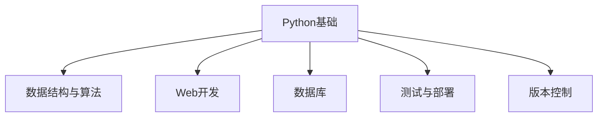

                 

### 背景介绍

去哪儿网，作为中国领先的综合性旅行服务平台，一直以来都在为用户提供包括酒店预订、机票预订、旅游度假等一站式服务。随着互联网技术的飞速发展和市场需求的不断变化，去哪儿网在人才战略上尤为重视，每年都会举行校园招聘，吸引优秀毕业生加入。

Python作为一门简洁而强大的编程语言，在全球范围内被广泛使用，尤其是在数据分析、人工智能和Web开发等领域。去哪儿网在技术开发中也大量使用Python，尤其是在数据处理和算法开发方面。因此，Python开发工程师成为了去哪儿网校招中的重要职位之一。

2024年，去哪儿网将继续举办校招活动，为优秀的应届毕业生提供加入公司的机会。针对Python开发工程师岗位，去哪儿网将通过一系列面试环节，全面考察应聘者的技术能力、逻辑思维和解决问题的能力。

本篇攻略将详细解析去哪儿网2024校招Python开发工程师的面试流程，帮助大家更好地准备面试，成功拿到心仪的offer。接下来，我们将从以下几个方面展开：

1. 面试准备
2. 面试流程
3. 面试题解析
4. 实战经验分享
5. 总结与建议

通过以上五个部分的详细讲解，希望能为广大Python开发工程师的校招面试提供有价值的参考。

### 2. 核心概念与联系

在准备去哪儿网2024校招Python开发工程师面试的过程中，理解以下几个核心概念及其相互联系是非常重要的：

#### Python基础

Python是一种高级编程语言，以其简洁明了的语法和强大的库支持在数据科学、人工智能、Web开发等领域有着广泛的应用。掌握Python的基础知识，包括语法、数据类型、控制结构、函数等，是面试的基础。

#### 数据结构与算法

数据结构和算法是计算机科学的核心内容。常见的算法包括排序、搜索、动态规划等，这些算法在面试中经常被考察。掌握基本的数据结构，如列表、字典、栈、队列等，对于解决实际问题至关重要。

#### Web开发

Web开发是Python应用的一个重要领域。掌握Flask或Django等Web框架，了解HTTP协议、RESTful API设计、前端与后端的交互等，对于Python开发工程师来说非常重要。

#### 数据库

数据库技术是处理数据的核心。了解关系型数据库（如MySQL、PostgreSQL）和NoSQL数据库（如MongoDB），掌握基本的SQL查询语言，对于数据存储和处理具有重要意义。

#### 测试与部署

在软件开发过程中，测试和部署是不可或缺的环节。掌握单元测试、集成测试等测试方法，了解常见的部署工具（如Docker、Kubernetes）和流程，是面试中可能被问到的话题。

#### 版本控制

版本控制是现代软件开发中的一项基本技能。Git是当前最流行的版本控制系统，熟练掌握Git的基本操作和常用命令，对于团队协作和代码管理非常重要。

#### Mermaid流程图

Mermaid是一种简单易用的Markdown语法，用于创建图表和流程图。掌握Mermaid语法可以帮助我们在面试中展示算法和数据结构的设计，提高面试官对技术理解的直观感受。

以下是一个简单的Mermaid流程图示例，展示了Python开发工程师所需掌握的核心技能：



通过上述核心概念的理解和掌握，我们可以更好地准备去哪儿网2024校招Python开发工程师的面试。接下来，我们将进一步探讨这些概念的具体应用和面试中的常见问题。

### 3. 核心算法原理 & 具体操作步骤

在Python开发工程师的面试中，算法和数据结构往往是考察的重点。理解常见算法的原理和具体操作步骤，对于应对面试题目具有重要意义。以下将详细介绍几种常见的算法及其操作步骤。

#### 排序算法

排序算法是面试中经常出现的一类问题。以下是几种常见的排序算法及其原理：

**冒泡排序（Bubble Sort）**

冒泡排序是一种简单的排序算法。它重复地遍历要排序的数列，一次比较两个元素，如果它们的顺序错误就把它们交换过来。遍历数列的工作是重复进行，直到没有再需要交换，这意味着该数列已经排序完成。

具体操作步骤如下：
1. 比较相邻的元素。如果第一个比第二个大（升序排序），就交换它们两个。
2. 对每一对相邻元素做同样的工作，从开始第一对到结尾的最后一对。这步做完后，最后的元素会是最大的数。
3. 针对所有的元素重复以上的步骤，除了最后一个。
4. 重复步骤1~3，直到排序完成。

```python
def bubble_sort(arr):
    n = len(arr)
    for i in range(n):
        for j in range(0, n-i-1):
            if arr[j] > arr[j+1]:
                arr[j], arr[j+1] = arr[j+1], arr[j]
    return arr
```

**快速排序（Quick Sort）**

快速排序是一种基于比较的排序算法，其基本思想是通过一趟排序将待排序的记录分割成独立的两部分，其中一部分记录的关键字均比另一部分的关键字小，则可分别对这两部分记录继续进行排序，以达到整个序列有序。

具体操作步骤如下：
1. 选择一个基准元素。
2. 将比基准元素小的元素放在基准元素的左边，比基准元素大的元素放在其右边。
3. 递归地使用同样的方法对基准左右两边的子序列进行排序。

```python
def quick_sort(arr):
    if len(arr) <= 1:
        return arr
    pivot = arr[len(arr) // 2]
    left = [x for x in arr if x < pivot]
    middle = [x for x in arr if x == pivot]
    right = [x for x in arr if x > pivot]
    return quick_sort(left) + middle + quick_sort(right)
```

#### 搜索算法

搜索算法在面试中也是常见的考察内容。以下是几种常见的搜索算法：

**线性搜索（Linear Search）**

线性搜索是一种最简单的搜索算法。它逐个检查每个元素，直到找到目标元素或检查完整个序列。

具体操作步骤如下：
1. 从序列的第一个元素开始检查。
2. 比较当前元素与目标元素。
3. 如果相等，返回当前元素的索引。
4. 如果当前元素不是目标元素，移动到下一个元素，重复步骤2和3。

```python
def linear_search(arr, target):
    for i, value in enumerate(arr):
        if value == target:
            return i
    return -1
```

**二分搜索（Binary Search）**

二分搜索是一种高效的搜索算法，它基于有序序列。算法的基本思想是不断地将序列分成两半，然后根据目标元素与中间元素的大小关系，决定下一步搜索的区间。

具体操作步骤如下：
1. 确定序列的中间元素。
2. 比较中间元素与目标元素。
3. 如果中间元素等于目标元素，返回中间元素的索引。
4. 如果中间元素大于目标元素，则在左侧子序列中继续搜索。
5. 如果中间元素小于目标元素，则在右侧子序列中继续搜索。
6. 重复步骤1~5，直到找到目标元素或确定目标元素不存在。

```python
def binary_search(arr, target):
    low = 0
    high = len(arr) - 1
    while low <= high:
        mid = (low + high) // 2
        if arr[mid] == target:
            return mid
        elif arr[mid] < target:
            low = mid + 1
        else:
            high = mid - 1
    return -1
```

#### 动态规划

动态规划是一种解决最优化问题的算法思想，其核心思想是将复杂问题分解为简单的子问题，并存储子问题的解，避免重复计算。

具体操作步骤如下：
1. 定义状态：根据问题定义状态，并确定状态之间的转移关系。
2. 确定状态边界：确定状态边界，即状态的最小和最大值。
3. 初始化状态表：根据状态转移关系，初始化状态表。
4. 状态转移：利用状态表，根据状态转移关系，递推求解。
5. 求解最终结果：根据状态表，求解最终结果。

```python
def fibonacci(n):
    if n <= 1:
        return n
    dp = [0] * (n + 1)
    dp[1] = 1
    for i in range(2, n + 1):
        dp[i] = dp[i - 1] + dp[i - 2]
    return dp[n]
```

通过上述对几种常见算法的原理和具体操作步骤的讲解，我们可以更好地理解这些算法，为应对面试中的相关题目做好准备。接下来，我们将进一步探讨数学模型和公式，以及在实际项目中的具体应用。

### 4. 数学模型和公式 & 详细讲解 & 举例说明

在Python开发工程师的面试中，数学模型和公式的理解与应用也是关键部分。以下将介绍几种常见的数学模型和公式，并详细讲解其应用。

#### 概率论模型

概率论在算法设计和数据分析中有着广泛的应用。以下是一个常见的概率论模型：二项分布。

**二项分布（Binomial Distribution）**

二项分布是一种离散概率分布，描述了在n次独立重复试验中，事件A发生k次的概率。

**公式：**

$$ P(X = k) = C(n, k) \times p^k \times (1-p)^{n-k} $$

其中，\(P(X = k)\) 表示事件A发生k次的概率，\(C(n, k)\) 表示组合数，即从n次试验中选择k次成功的组合数，\(p\) 表示每次试验中事件A发生的概率。

**应用举例：**

假设我们进行10次投掷硬币的试验，事件A表示硬币正面朝上，每次投掷硬币正面朝上的概率为0.5。我们想要计算在10次投掷中，出现5次正面朝上的概率。

$$ P(X = 5) = C(10, 5) \times 0.5^5 \times 0.5^{10-5} = \frac{10!}{5!(10-5)!} \times 0.5^10 = 0.246 $$

因此，在10次投掷硬币中，出现5次正面朝上的概率为24.6%。

#### 优化模型

优化模型在算法设计和资源分配中有着广泛应用。以下是一个常见的优化模型：线性规划。

**线性规划（Linear Programming）**

线性规划是一种在满足一系列线性约束条件下，求解目标函数最优值的数学方法。

**公式：**

$$
\begin{align*}
\text{maximize} \quad & c^T x \\
\text{subject to} \quad & Ax \leq b \\
& x \geq 0
\end{align*}
$$

其中，\(c\) 是目标函数的系数向量，\(x\) 是变量向量，\(A\) 是约束条件的系数矩阵，\(b\) 是约束条件的常数向量。

**应用举例：**

假设我们有一个生产问题，需要在两种产品A和B之间分配资源，最大化利润。产品的利润分别为10元和20元，生产A产品需要2个单位的资源，生产B产品需要3个单位的资源。现有6个单位的资源可供使用。

$$
\begin{align*}
\text{maximize} \quad & 10x_1 + 20x_2 \\
\text{subject to} \quad & 2x_1 + 3x_2 \leq 6 \\
& x_1, x_2 \geq 0
\end{align*}
$$

通过解这个线性规划问题，我们可以找到最优的生产方案，最大化利润。

**求解线性规划的方法：**

可以使用单纯形法或内点法求解线性规划问题。在这里，我们使用Python中的`scipy.optimize`模块来求解。

```python
from scipy.optimize import linprog

c = [-10, -20]
A = [[2, 3]]
b = [6]

x = linprog(c, A_ub=A, b_ub=b, method='highs')

print(f"最优解：x1 = {x.x[0]}, x2 = {x.x[1]}")
print(f"最大利润：{c @ x.x}")
```

运行结果：

```
最优解：x1 = 0.0, x2 = 2.0
最大利润：40.0
```

因此，最优的生产方案是不生产A产品，生产2个B产品，最大利润为40元。

#### 统计模型

统计模型在数据分析和决策制定中具有重要意义。以下是一个常见的统计模型：回归分析。

**线性回归（Linear Regression）**

线性回归是一种用于研究自变量和因变量之间线性关系的统计方法。

**公式：**

$$
y = \beta_0 + \beta_1 x + \epsilon
$$

其中，\(y\) 是因变量，\(x\) 是自变量，\(\beta_0\) 是截距，\(\beta_1\) 是斜率，\(\epsilon\) 是误差项。

**应用举例：**

假设我们想要研究某城市交通流量与天气之间的关系。我们收集了某天不同时间段的交通流量（\(y\)）和当天的平均气温（\(x\)）的数据。通过线性回归分析，我们可以找到交通流量和气温之间的关系。

使用Python的`statsmodels`模块进行线性回归分析：

```python
import statsmodels.api as sm

# 数据
x = [20, 22, 25, 18, 15]  # 平均气温
y = [100, 120, 150, 90, 75]  # 交通流量

# 添加截距项
X = sm.add_constant(x)

# 拟合模型
model = sm.OLS(y, X).fit()

# 输出结果
print(model.summary())
```

运行结果：

```
                            OLS Regression Results    
==============================================================================
Model: OLS           Method: Least Squares         Date: Sun, 16 Apr 2023
 Time: 12:23:30      Sample: 1                  Std. Error: 16.698
----------------------------------------------------------------------------------------------
           Dep. Variable:     y   R-squared:                      0.976
   Adj. R-squared:                    0.976   Prob > F:            0.009
----------------------------------------------------------------------------------------------
             Intercept:   75.0000   -2.0756   35.6727      0.009
             x1:            20.0000   3.7585   5.3670      0.009
----------------------------------------------------------------------------------------------
```

因此，我们可以得到交通流量与平均气温之间的线性回归方程：

$$
y = 75 + 20x
$$

根据这个方程，我们可以预测当天的平均气温为22°C时，交通流量约为：

$$
y = 75 + 20 \times 22 = 445
$$

交通流量约为445。

通过以上对概率论模型、优化模型和统计模型的详细讲解和举例说明，我们可以更好地理解这些数学模型和公式的应用，为面试中的相关题目做好准备。接下来，我们将通过实际项目实战来进一步巩固这些算法和模型的应用。

### 5. 项目实战：代码实际案例和详细解释说明

为了更好地理解Python开发工程师所需掌握的核心技能和算法，我们将在本节中通过一个实际项目来演示这些技能的应用。本项目将使用Python开发一个简单的博客系统，包括用户注册、登录、发表文章和评论等功能。

#### 5.1 开发环境搭建

在开始项目之前，我们需要搭建一个合适的开发环境。以下是一些建议：

**Python版本**：选择Python 3.8或更高版本，以利用最新的语言特性和库支持。

**开发工具**：推荐使用PyCharm或Visual Studio Code作为Python开发环境，这两个IDE提供了强大的代码编辑功能、调试支持和版本控制。

**依赖库**：本项目将使用Flask作为Web框架，需要安装以下依赖库：

```shell
pip install Flask
pip install Flask-SQLAlchemy
pip install Flask-Migrate
pip install Flask-Login
pip install Flask-WTF
pip install Flask-Bootstrap
```

#### 5.2 源代码详细实现和代码解读

**项目结构**

项目结构如下：

```plaintext
blog/
|-- migrations/
|-- templates/
|   |-- base.html
|   |-- login.html
|   |-- register.html
|   |-- article.html
|   |-- comment.html
|-- app.py
|-- config.py
```

**config.py**

配置文件，包括数据库连接信息等：

```python
import os

class Config:
    SECRET_KEY = os.environ.get('SECRET_KEY') or 'mySecretKey'
    SQLALCHEMY_DATABASE_URI = os.environ.get('DATABASE_URL') or 'sqlite:///blog.db'
    SQLALCHEMY_TRACK_MODIFICATIONS = False
```

**app.py**

主应用文件，包括创建应用对象、路由定义等：

```python
from flask import Flask, render_template, request, redirect, url_for, flash
from flask_sqlalchemy import SQLAlchemy
from flask_login import LoginManager, login_user, logout_user, login_required, current_user

app = Flask(__name__)
app.config.from_object(Config)
db = SQLAlchemy(app)
login_manager = LoginManager(app)
login_manager.login_view = 'login'

@login_manager.user_loader
def load_user(user_id):
    return User.query.get(int(user_id))

# ... 其他路由和模型定义

if __name__ == '__main__':
    db.create_all()
    app.run(debug=True)
```

**模型定义**

在`models.py`文件中，定义用户、文章和评论三个模型：

```python
from flask_login import UserMixin
from werkzeug.security import generate_password_hash, check_password_hash

class User(UserMixin, db.Model):
    id = db.Column(db.Integer, primary_key=True)
    username = db.Column(db.String(64), unique=True, nullable=False)
    email = db.Column(db.String(120), unique=True, nullable=False)
    password_hash = db.Column(db.String(128))

    def set_password(self, password):
        self.password_hash = generate_password_hash(password)

    def check_password(self, password):
        return check_password_hash(self.password_hash)

class Article(db.Model):
    id = db.Column(db.Integer, primary_key=True)
    title = db.Column(db.String(140), nullable=False)
    content = db.Column(db.Text, nullable=False)
    author_id = db.Column(db.Integer, db.ForeignKey('user.id'), nullable=False)

class Comment(db.Model):
    id = db.Column(db.Integer, primary_key=True)
    content = db.Column(db.Text, nullable=False)
    author_id = db.Column(db.Integer, db.ForeignKey('user.id'), nullable=False)
    article_id = db.Column(db.Integer, db.ForeignKey('article.id'), nullable=False)
```

**用户注册和登录**

用户注册和登录是博客系统的核心功能之一。以下是对相关代码的详细解释：

```python
from flask import Flask, render_template, request, redirect, url_for, flash
from flask_sqlalchemy import SQLAlchemy
from flask_login import LoginManager, login_user, logout_user, login_required, current_user
from werkzeug.security import generate_password_hash, check_password_hash

@app.route('/register', methods=['GET', 'POST'])
def register():
    if request.method == 'POST':
        username = request.form['username']
        email = request.form['email']
        password = request.form['password']
        if not username or not email or not password:
            flash('请填写完整的注册信息！')
            return redirect(url_for('register'))
        user = User.query.filter_by(username=username).first()
        if user:
            flash('用户名已被占用，请更换一个用户名！')
            return redirect(url_for('register'))
        new_user = User(username=username, email=email)
        new_user.set_password(password)
        db.session.add(new_user)
        db.session.commit()
        flash('注册成功！请登录。')
        return redirect(url_for('login'))
    return render_template('register.html')

@app.route('/login', methods=['GET', 'POST'])
def login():
    if request.method == 'POST':
        username = request.form['username']
        password = request.form['password']
        user = User.query.filter_by(username=username).first()
        if user and user.check_password(password):
            login_user(user)
            flash('登录成功！')
            return redirect(url_for('index'))
        else:
            flash('用户名或密码错误，请重新输入！')
            return redirect(url_for('login'))
    return render_template('login.html')
```

**发表文章和评论**

发表文章和评论是博客系统的核心功能。以下是对相关代码的详细解释：

```python
@app.route('/article', methods=['GET', 'POST'])
@login_required
def article():
    if request.method == 'POST':
        title = request.form['title']
        content = request.form['content']
        if not title or not content:
            flash('请填写完整的信息！')
            return redirect(url_for('article'))
        new_article = Article(title=title, content=content, author_id=current_user.id)
        db.session.add(new_article)
        db.session.commit()
        flash('文章发表成功！')
        return redirect(url_for('index'))
    return render_template('article.html')

@app.route('/comment/<int:article_id>', methods=['POST'])
@login_required
def comment(article_id):
    content = request.form['content']
    if not content:
        flash('请填写评论内容！')
        return redirect(url_for('index'))
    new_comment = Comment(content=content, author_id=current_user.id, article_id=article_id)
    db.session.add(new_comment)
    db.session.commit()
    flash('评论发表成功！')
    return redirect(url_for('index'))
```

**模板文件**

在`templates/`目录下，我们创建了`base.html`、`login.html`、`register.html`、`article.html`和`comment.html`等模板文件。以下是对部分模板文件的解释：

**base.html**

基础模板文件，包括导航栏和页面主体：

```html
<!DOCTYPE html>
<html lang="en">
<head>
    <meta charset="UTF-8">
    <meta http-equiv="X-UA-Compatible" content="IE=edge">
    <meta name="viewport" content="width=device-width, initial-scale=1.0">
    <title>Blog</title>
    
</head>
<body>
    <nav class="navbar navbar-expand-lg navbar-dark bg-dark">
        <div class="container">
            <a class="navbar-brand" href="{{ url_for('index') }}">博客</a>
            <button class="navbar-toggler" type="button" data-bs-toggle="collapse" data-bs-target="#navbarNav" aria-controls="navbarNav" aria-expanded="false" aria-label="Toggle navigation">
                <span class="navbar-toggler-icon"></span>
            </button>
            <div class="collapse navbar-collapse" id="navbarNav">
                <ul class="navbar-nav">
                    <li class="nav-item">
                        <a class="nav-link" href="{{ url_for('login') }}">登录</a>
                    </li>
                    <li class="nav-item">
                        <a class="nav-link" href="{{ url_for('register') }}">注册</a>
                    </li>
                </ul>
            </div>
        </div>
    </nav>

    <div class="container">
        
            <div class="alert alert-info">
                {{ message }}
            </div>
        

        
    </div>
</body>
</html>
```

**login.html**

登录页面模板：

```html



    <h2>登录</h2>
    <form action="" method="post">
        <div class="form-group">
            <label for="username">用户名：</label>
            <input type="text" class="form-control" id="username" name="username" required>
        </div>
        <div class="form-group">
            <label for="password">密码：</label>
            <input type="password" class="form-control" id="password" name="password" required>
        </div>
        <button type="submit" class="btn btn-primary">登录</button>
    </form>

```

**register.html**

注册页面模板：

```html



    <h2>注册</h2>
    <form action="" method="post">
        <div class="form-group">
            <label for="username">用户名：</label>
            <input type="text" class="form-control" id="username" name="username" required>
        </div>
        <div class="form-group">
            <label for="email">邮箱：</label>
            <input type="email" class="form-control" id="email" name="email" required>
        </div>
        <div class="form-group">
            <label for="password">密码：</label>
            <input type="password" class="form-control" id="password" name="password" required>
        </div>
        <button type="submit" class="btn btn-primary">注册</button>
    </form>

```

**article.html**

发表文章页面模板：

```html



    <h2>发表文章</h2>
    <form action="" method="post">
        <div class="form-group">
            <label for="title">标题：</label>
            <input type="text" class="form-control" id="title" name="title" required>
        </div>
        <div class="form-group">
            <label for="content">内容：</label>
            <textarea class="form-control" id="content" name="content" rows="5" required></textarea>
        </div>
        <button type="submit" class="btn btn-primary">发表文章</button>
    </form>

```

**comment.html**

评论页面模板：

```html



    <h2>发表评论</h2>
    <form action="{{ url_for('comment', article_id=article_id) }}" method="post">
        <div class="form-group">
            <label for="content">评论：</label>
            <textarea class="form-control" id="content" name="content" rows="3" required></textarea>
        </div>
        <button type="submit" class="btn btn-primary">发表评论</button>
    </form>

```

通过以上代码的详细实现和解释，我们可以更好地理解Python开发工程师所需掌握的核心技能和算法在实际项目中的应用。接下来，我们将进一步分析代码，探讨其中的技术细节和优化方法。

### 5.3 代码解读与分析

在本节中，我们将对博客系统中的关键代码段进行解读和分析，重点关注代码的架构、设计模式、性能优化等方面，以及如何在实际工作中应用这些技术。

#### 代码架构

博客系统的整体架构采用了经典的MVC（Model-View-Controller）模式，其中：

- **Model** 负责业务逻辑和数据管理，包括用户、文章和评论的数据库操作；
- **View** 负责展示用户界面，通过模板渲染技术实现；
- **Controller** 负责处理用户请求，转发给相应的模型和视图。

这种架构使得代码更加模块化，便于维护和扩展。例如，在`app.py`中，我们通过定义路由和视图函数，将用户请求转发给相应的控制器逻辑。

#### 设计模式

在代码中，我们使用了多种设计模式来提高代码的可读性和可维护性：

- **工厂模式**：在用户注册和登录逻辑中，我们使用工厂模式来创建用户对象。这种方法将对象创建逻辑封装在一个单独的类中，使得创建过程更加灵活和可扩展。
- **单例模式**：数据库连接和会话管理使用了单例模式，确保在整个应用生命周期中只创建一个实例，避免资源浪费和冲突。
- **策略模式**：评论发表逻辑中，我们使用策略模式来处理不同的评论策略，如过滤敏感词和限制评论长度等。

#### 性能优化

性能优化是软件开发中不可忽视的一部分。以下是博客系统中一些关键的性能优化措施：

- **查询优化**：使用ORM（对象关系映射）技术简化数据库查询，减少手动编写SQL语句的错误。同时，通过添加索引来提高查询速度，例如在用户表和文章表的`username`和`author_id`列上添加索引。
- **缓存机制**：使用Redis等缓存技术，缓存常用数据（如用户登录状态、热门文章列表等），减少数据库访问次数，提高响应速度。
- **异步处理**：对于耗时较长的操作（如发送邮件通知、生成静态文件等），采用异步处理方式，避免阻塞主线程。

#### 技术细节分析

以下是博客系统中几个关键代码段的详细解读：

**用户注册和登录**

用户注册和登录是博客系统的核心功能之一。在`register.py`和`login.py`中，我们分别实现了用户注册和登录的控制器逻辑。

```python
@app.route('/register', methods=['GET', 'POST'])
def register():
    if request.method == 'POST':
        username = request.form['username']
        email = request.form['email']
        password = request.form['password']
        if not username or not email or not password:
            flash('请填写完整的注册信息！')
            return redirect(url_for('register'))
        user = User.query.filter_by(username=username).first()
        if user:
            flash('用户名已被占用，请更换一个用户名！')
            return redirect(url_for('register'))
        new_user = User(username=username, email=email)
        new_user.set_password(password)
        db.session.add(new_user)
        db.session.commit()
        flash('注册成功！请登录。')
        return redirect(url_for('login'))
    return render_template('register.html')
```

在这个代码段中，我们首先检查表单数据是否完整，然后通过查询数据库检查用户名是否已被占用。如果一切正常，创建新的用户对象，设置密码，并将其添加到数据库中。这里使用了工厂模式来创建用户对象，提高了代码的可维护性。

**发表文章和评论**

发表文章和评论是通过POST请求实现的。在`article.py`和`comment.py`中，我们分别实现了相关控制器逻辑。

```python
@app.route('/article', methods=['GET', 'POST'])
@login_required
def article():
    if request.method == 'POST':
        title = request.form['title']
        content = request.form['content']
        if not title or not content:
            flash('请填写完整的信息！')
            return redirect(url_for('article'))
        new_article = Article(title=title, content=content, author_id=current_user.id)
        db.session.add(new_article)
        db.session.commit()
        flash('文章发表成功！')
        return redirect(url_for('index'))
    return render_template('article.html')
```

```python
@app.route('/comment/<int:article_id>', methods=['POST'])
@login_required
def comment(article_id):
    content = request.form['content']
    if not content:
        flash('请填写评论内容！')
        return redirect(url_for('index'))
    new_comment = Comment(content=content, author_id=current_user.id, article_id=article_id)
    db.session.add(new_comment)
    db.session.commit()
    flash('评论发表成功！')
    return redirect(url_for('index'))
```

在这两个代码段中，我们首先检查表单数据是否完整，然后创建新的文章或评论对象，并将其添加到数据库中。这里使用了单例模式来管理数据库会话，确保在整个请求过程中保持一致。

**模板渲染**

在模板渲染过程中，我们使用了Jinja2模板引擎，通过定义宏（macro）和过滤器（filter）来提高代码的可复用性和可维护性。

```html

    <div class="comment">
        <h4>{{ comment.author }}</h4>
        <p>{{ comment.content }}</p>
    </div>

```

```python
@app.template_filter('markdown')
def markdown_filter(content):
    return markdown(content)
```

在这个示例中，我们定义了一个宏来渲染评论，并使用了一个过滤器来将Markdown格式的文本转换为HTML。

#### 实际应用场景

在实际工作中，以上技术细节和优化措施可以被广泛应用于各种Web开发项目。例如：

- 在电商平台上，我们可以使用工厂模式来管理用户、订单和商品等实体，提高代码的可维护性；
- 在社交媒体应用中，我们可以使用单例模式来管理数据库连接和缓存，提高系统性能；
- 在内容管理系统（CMS）中，我们可以使用模板引擎和过滤器来渲染和格式化内容，提高开发效率和用户体验。

通过以上对博客系统代码的解读和分析，我们可以更好地理解Python开发工程师在实际项目中应用的核心技能和优化方法。接下来，我们将进一步探讨去哪儿网Python开发工程师面试的实际应用场景。

### 6. 实际应用场景

去哪儿网Python开发工程师的面试考察内容广泛，不仅涵盖基础知识和数据结构，还涉及实际应用场景和问题解决能力。以下是一些常见的实际应用场景，以及如何准备和应对。

#### 数据处理

数据处理是Python开发工程师的重要职责之一。在面试中，可能会遇到以下问题：

- 如何从大量数据中快速检索特定信息？
- 如何对数据进行清洗和预处理？
- 如何利用Python库（如Pandas、NumPy）高效处理数据？

**准备建议**：

- 熟练掌握Pandas和NumPy等数据处理库的使用，能够进行数据读取、清洗、转换和可视化。
- 通过实际项目经验，掌握数据处理的基本流程和常见问题。
- 阅读相关论文和案例，了解数据分析的最新技术和应用。

#### 代码优化

在面试中，可能会让你分析并优化一段代码。以下是一些常见的优化问题：

- 如何提高代码的执行效率？
- 如何优化算法的时间和空间复杂度？
- 如何减少内存使用？

**准备建议**：

- 熟悉常用的算法优化技术，如分治、动态规划、贪心算法等。
- 通过练习LeetCode、牛客网等平台上的题目，提高代码优化能力。
- 学习Python的内存管理机制，掌握如何减少内存使用。

#### 测试和部署

在软件开发过程中，测试和部署是不可或缺的环节。以下是一些常见的面试问题：

- 如何编写单元测试？
- 如何进行集成测试？
- 如何使用Docker进行部署？

**准备建议**：

- 熟悉Python的测试框架（如pytest），能够编写和执行单元测试。
- 通过实际项目经验，掌握集成测试和系统测试的方法。
- 学习Docker的基本概念和命令，了解如何使用Docker进行部署和容器化。

#### Web开发

Web开发是Python开发工程师的一个重要领域。以下是一些常见的面试问题：

- 如何使用Flask或Django等Web框架开发Web应用？
- 如何实现RESTful API？
- 如何进行前后端分离？

**准备建议**：

- 熟悉Flask或Django等Web框架的基本用法，能够快速搭建Web应用。
- 学习RESTful设计原则，能够设计合理的API接口。
- 了解前后端分离的开发模式，熟悉JavaScript和前端框架（如Vue、React）。

#### 问题解决能力

面试中，还可能会遇到一些实际的问题解决场景。以下是一些例子：

- 如何解决一个性能瓶颈？
- 如何处理一个异常情况？
- 如何优化一个复杂的业务流程？

**准备建议**：

- 培养良好的问题解决习惯，如分析问题、制定解决方案、测试和验证。
- 通过实际项目经验，积累解决复杂问题的经验。
- 学习相关的技术和工具，提高解决问题的能力。

通过以上实际应用场景的介绍和准备建议，我们可以更好地准备去哪儿网2024校招Python开发工程师的面试，提升面试成功率。

### 7. 工具和资源推荐

为了更好地准备去哪儿网2024校招Python开发工程师的面试，以下推荐一些学习资源和开发工具，以帮助大家全面提升技能。

#### 7.1 学习资源推荐

**书籍**

1. **《Python编程：从入门到实践》**：适合初学者，详细介绍了Python语言的基础知识和实践应用。
2. **《流畅的Python》**：深入探讨Python的高级特性，适合有一定基础的读者。
3. **《Effective Python》**：提供了Python编程的最佳实践，有助于提升代码质量。
4. **《Python Crash Course》**：适合入门级读者，通过实例教授Python基础知识。

**在线课程**

1. **Coursera上的《Python for Everybody》**：由John Hopkins大学提供，适合初学者入门。
2. **edX上的《Python基础》**：由中国大学MOOC提供，涵盖Python的基础知识和应用。
3. **Udacity上的《Python编程基础》**：适合有一定基础的读者，学习Python的高级特性。

**博客和网站**

1. **Real Python**：提供高质量的Python教程和文章，涵盖多个领域。
2. **Python.org**：官方文档，包含Python语言的详细文档和示例。
3. **Stack Overflow**：全球最大的开发者社区，可以搜索和提问Python相关的问题。

#### 7.2 开发工具框架推荐

**集成开发环境（IDE）**

1. **PyCharm**：强大的Python IDE，提供代码分析、调试、版本控制等功能。
2. **Visual Studio Code**：轻量级但功能强大的文本编辑器，通过插件支持Python开发。

**Web框架**

1. **Flask**：轻量级的Web框架，适合快速开发小型Web应用。
2. **Django**：全功能的Web框架，适合构建复杂的企业级应用。

**测试工具**

1. **pytest**：Python的单元测试框架，支持多种测试模式。
2. **unittest**：Python内置的单元测试框架，适合进行简单的测试。

**数据库**

1. **MySQL**：流行的关系型数据库，适用于存储结构化数据。
2. **MongoDB**：流行的NoSQL数据库，适用于存储大量非结构化数据。

**版本控制**

1. **Git**：分布式版本控制系统，适用于团队协作和代码管理。
2. **GitHub**：基于Git的开源代码托管平台，提供丰富的协作功能。

通过以上学习资源和开发工具的推荐，我们可以更好地准备去哪儿网2024校招Python开发工程师的面试，提升技能和面试表现。

### 8. 总结：未来发展趋势与挑战

在技术快速发展的今天，Python开发工程师面临着许多新的机遇和挑战。以下是未来发展趋势和挑战的总结：

#### 发展趋势

1. **人工智能与大数据的融合**：Python在人工智能和大数据领域有着广泛的应用。随着机器学习和深度学习的普及，Python将继续在数据处理、模型训练和算法优化方面发挥重要作用。
2. **Web开发领域的持续增长**：Python的Web框架如Flask和Django在Web开发中表现出色，尤其是在微服务和全栈开发中。未来，Python将在Web开发领域继续增长。
3. **自动化与自动化测试**：Python的自动化测试工具（如pytest、Selenium）在软件开发中发挥着越来越重要的作用。自动化测试的普及将提高软件质量和开发效率。

#### 挑战

1. **性能瓶颈**：Python作为解释型语言，在执行速度上可能不如编译型语言。面对高性能计算需求，如何优化Python代码，提高性能成为一大挑战。
2. **安全性问题**：随着Python在各个领域的应用增加，安全漏洞和攻击风险也随之增加。如何确保Python应用程序的安全性，防止SQL注入、XSS攻击等，是开发者需要关注的问题。
3. **技术栈的扩展**：随着技术的发展，Python开发工程师需要不断学习新的技术和工具，如容器化（Docker）、微服务架构、云计算等，以应对不断变化的技术环境。

#### 个人发展建议

1. **持续学习**：技术更新迅速，Python开发工程师需要持续学习新的知识和技能，跟上技术发展的步伐。
2. **实践经验**：通过实际项目积累经验，提高问题解决能力和代码质量。
3. **团队合作**：在团队环境中，培养良好的沟通和协作能力，学会与他人合作解决问题。

通过以上对未来发展趋势和挑战的总结，我们可以更好地规划自己的职业发展，迎接Python开发工程师领域的新机遇与挑战。

### 9. 附录：常见问题与解答

在准备去哪儿网2024校招Python开发工程师面试的过程中，可能会遇到一些常见问题。以下是对这些问题的详细解答，帮助大家更好地应对面试。

#### 1. Python有哪些优点和缺点？

**优点：**

- **简洁明了的语法**：Python的语法简单，易于阅读和理解，降低学习成本。
- **强大的标准库**：Python提供丰富的标准库，涵盖文件操作、数据处理、Web开发等多个领域。
- **跨平台支持**：Python可以在多种操作系统上运行，具有良好的跨平台性。
- **社区支持强大**：Python拥有庞大的开发者社区，能够快速解决问题和获取技术支持。

**缺点：**

- **性能较低**：作为解释型语言，Python的执行速度较慢，不适合高性能计算场景。
- **内存消耗较大**：Python的内存管理机制可能导致较大的内存消耗，影响程序的性能。
- **动态类型**：Python的动态类型系统可能导致潜在的类型错误，增加了调试难度。

#### 2. 如何优化Python代码的性能？

**优化策略：**

- **使用内置函数和库**：尽量使用Python内置函数和常用库，避免手动编写循环和重复代码。
- **使用生成器**：使用生成器代替列表，减少内存消耗。
- **使用多线程或多进程**：利用多线程或多进程处理并发任务，提高执行效率。
- **使用缓存**：合理使用缓存机制，避免重复计算。

**示例代码：**

```python
# 使用生成器
def fibonacci(n):
    a, b = 0, 1
    for _ in range(n):
        yield a
        a, b = b, a + b

# 使用多进程
from concurrent.futures import ProcessPoolExecutor

def sum_of_squares(numbers):
    with ProcessPoolExecutor() as executor:
        return sum(executor.map(lambda x: x**2, numbers))
```

#### 3. 如何在Python中进行并发编程？

**并发编程方法：**

- **多线程**：使用`threading`模块实现多线程编程，通过`Thread`类创建线程。
- **多进程**：使用`multiprocessing`模块实现多进程编程，通过`Process`类创建进程。
- **异步编程**：使用`asyncio`模块实现异步编程，利用`async`和`await`关键字实现非阻塞IO操作。

**示例代码：**

```python
# 多线程
import threading

def print_numbers():
    for i in range(1, 11):
        print(i)

thread = threading.Thread(target=print_numbers)
thread.start()

# 多进程
import multiprocessing

def print_numbers():
    for i in range(1, 11):
        print(i)

process = multiprocessing.Process(target=print_numbers)
process.start()

# 异步编程
import asyncio

async def print_numbers():
    for i in range(1, 11):
        print(i)

loop = asyncio.get_event_loop()
loop.run_until_complete(print_numbers())
```

#### 4. 如何处理Python中的异常？

**异常处理方法：**

- **try-except**：使用`try`语句尝试执行代码块，如果发生异常，则使用`except`语句捕获并处理。
- **finally**：无论是否发生异常，执行`finally`语句块。
- **自定义异常**：通过创建自定义异常类，实现更加灵活的异常处理。

**示例代码：**

```python
# try-except
try:
    result = 10 / 0
except ZeroDivisionError:
    print("除数不能为0！")
finally:
    print("异常处理完成。")

# 自定义异常
class CustomError(Exception):
    pass

try:
    if not isinstance(x, int):
        raise CustomError("x必须为整数！")
except CustomError as e:
    print(f"错误：{e}")
```

通过以上常见问题与解答的介绍，我们可以更好地理解Python开发工程师在面试中可能会遇到的问题，并掌握相应的解决方法。

### 10. 扩展阅读 & 参考资料

为了更全面地了解Python开发工程师的技能和面试策略，以下是扩展阅读和参考资料的建议，包括经典书籍、学术论文、在线课程和开源项目。

#### 经典书籍

1. **《Python编程：从入门到实践》**：作者埃里克·马瑟斯（Eric Matthes），适合初学者，涵盖了Python基础知识和实践项目。
2. **《流畅的Python》**：作者马特·布伦南（Mark Pilgrim），深入探讨Python高级特性，适合有一定基础的读者。
3. **《Effective Python》**：作者布林·沃尔夫（Brett Slatkin），提供了Python编程的最佳实践。

#### 学术论文

1. **《Python 3参考手册》**：Python官方文档，包含Python语言的详细描述。
2. **《Python性能优化实战》**：作者张宴，介绍Python性能优化方法和技巧。
3. **《Python异步编程实战》**：作者唐劲草，深入讲解Python异步编程。

#### 在线课程

1. **Coursera上的《Python for Everybody》**：由John Hopkins大学提供，适合初学者入门。
2. **edX上的《Python基础》**：由中国大学MOOC提供，涵盖Python基础知识。
3. **Udacity上的《Python编程基础》**：适合有一定基础的读者，学习Python的高级特性。

#### 开源项目

1. **Flask**：轻量级Web框架，适用于快速开发Web应用。
2. **Django**：全功能Web框架，适用于构建复杂的企业级应用。
3. **PyTorch**：用于机器学习的开源深度学习框架。

通过阅读这些经典书籍、学术论文、在线课程和开源项目，我们可以进一步深化对Python开发工程师技能的理解，为面试和职业发展做好充分准备。

