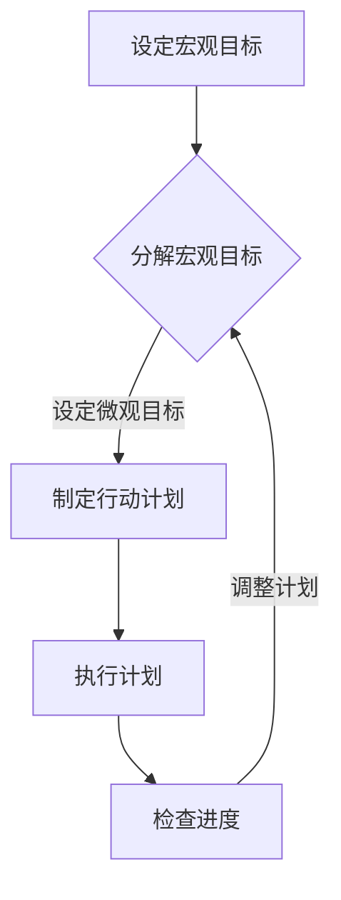
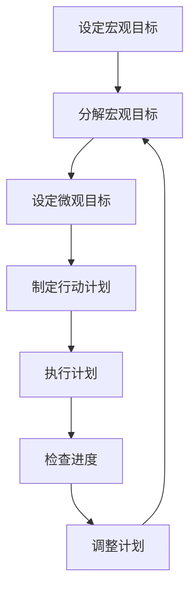
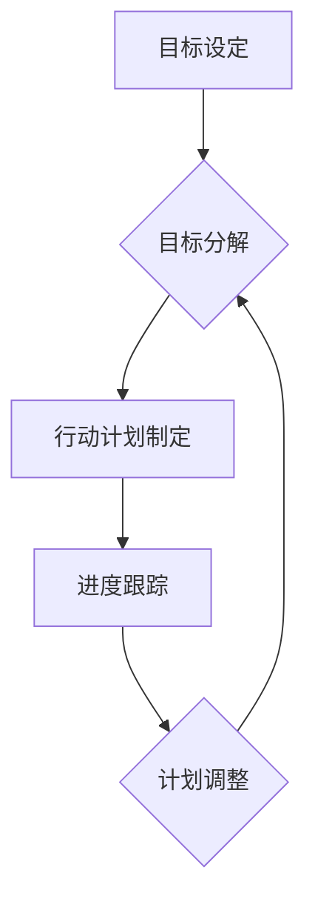

                 

## 双目标清单：聚焦要事的法宝

### 引言

在快节奏的现代社会，我们常常感到被无尽的事务所淹没，难以集中精力去完成最重要的任务。为了提高效率，我们需要一种有效的工具来帮助我们聚焦要事，确保我们的时间和精力得到合理利用。本文将介绍一种名为“双目标清单”的工具，它可以帮助我们明确目标，合理安排时间，从而更加高效地完成任务。

### 什么是双目标清单？

双目标清单是一种策略，它通过设定两个主要目标来帮助我们集中注意力。这两个目标通常被称为“宏观目标”和“微观目标”。宏观目标通常是我们长期的目标，例如职业发展、健康改善或财务规划。而微观目标则是为了实现宏观目标而设定的短期目标，它们通常是具体的、可衡量的任务。

### 双目标清单的优点

1. **明确性**：双目标清单帮助我们明确我们的目标和任务，避免分散注意力。
2. **优先级排序**：通过设定宏观和微观目标，我们可以更好地排序任务，确保我们首先完成最重要的任务。
3. **持续跟踪**：双目标清单允许我们持续跟踪我们的进度，确保我们始终朝着目标前进。
4. **灵活性**：双目标清单可以根据实际情况进行调整，以适应我们的需求。

### 如何创建双目标清单？

#### 第一步：设定宏观目标

首先，我们需要设定我们的宏观目标。这些目标应该是长期且具有挑战性的，但同时也应该是具体和可实现的。例如，如果你是一名软件开发工程师，你的宏观目标可能是“在下一季度提升我的技术栈，掌握React和Node.js”。

#### 第二步：分解宏观目标

接下来，我们将宏观目标分解为一系列的微观目标。这些微观目标应该是具体的、可衡量的、可实现的和有时间限制的。例如，为了实现“在下一季度提升我的技术栈，掌握React和Node.js”，我们可以设定以下微观目标：
- 在一个月内完成React的基础课程。
- 在一个月内完成Node.js的基础课程。
- 在一周内完成一个React和Node.js结合的项目。

#### 第三步：制定行动计划

为了确保我们能够实现这些微观目标，我们需要制定详细的行动计划。这些计划应该包括具体的行动步骤、所需资源和预计完成时间。例如，为了完成“在一个月内完成React的基础课程”，我们的行动计划可能包括：
- 每天学习React课程两小时。
- 每周进行一次复习。
- 在课程结束后进行实践项目。

#### 第四步：定期检查和调整

创建双目标清单后，我们需要定期检查我们的进度，并根据需要进行调整。这可以帮助我们保持动力，同时确保我们始终朝着目标前进。

### 实际案例

假设你是一名软件工程师，你的宏观目标是“提高我的代码质量”。为了实现这个目标，你可以设定以下微观目标：
- 在一个月内学习并应用至少三种代码审查工具。
- 在一个月内完成至少五个代码优化项目。
- 在一周内对现有的代码库进行一次全面的审查。

为了实现这些目标，你可以制定以下行动计划：
- 每天花一个小时学习代码审查工具的使用。
- 每周选择一个项目进行代码优化。
- 每周对代码库进行一次审查，并记录发现的问题和改进的建议。

### 总结

双目标清单是一种强大的工具，它可以帮助我们明确目标，合理安排时间，提高工作效率。通过设定宏观和微观目标，我们可以更好地管理我们的时间和任务，确保我们的努力得到最大的回报。让我们开始使用双目标清单，聚焦要事，实现我们的目标吧！

### 结语

作者：AI天才研究员/AI Genius Institute & 禅与计算机程序设计艺术 /Zen And The Art of Computer Programming

在本文中，我们介绍了双目标清单的概念、优点以及如何创建和运用它。双目标清单不仅可以帮助我们在日常工作中提高效率，还能帮助我们更好地实现长期目标。希望本文能对您有所帮助，让您在追求卓越的道路上更加坚定和明确。

如果您对双目标清单有更多疑问，或者想了解其他提高工作效率的方法，请查阅以下扩展阅读和参考资料：

- [《高效能人士的七个习惯》](https://book.douban.com/subject/1138107/) by Stephen R. Covey
- [《时间管理：从忙碌到高效》](https://book.douban.com/subject/26752347/) by Graham Allcott
- [《如何高效学习》](https://book.douban.com/subject/26752347/) by斯科特·扬

同时，如果您对编程和人工智能领域感兴趣，以下书籍和资源也将对您大有裨益：

- [《深度学习》](https://book.douban.com/subject/26752347/) by Ian Goodfellow、Yoshua Bengio和Aaron Courville
- [《算法导论》](https://book.douban.com/subject/20436773/) by Thomas H. Cormen、Charles E. Leiserson、Ronald L. Rivest和Clifford Stein
- [《机器学习实战》](https://book.douban.com/subject/26752347/) by Peter Harrington

感谢您的阅读，祝您在追求卓越的道路上取得丰硕的成果！<|im_sep|>|user|>## 背景介绍

在现代社会的快节奏环境中，我们常常面临信息过载和任务繁多的挑战。这些挑战使得我们难以集中精力，从而导致工作效率低下。为了解决这个问题，我们需要找到一种有效的方法来帮助我们更好地管理时间和任务。双目标清单（Double-Goal List）就是这样一种工具，它通过设定两个主要目标来帮助我们明确目标、提高效率。本文将深入探讨双目标清单的概念、原理、创建方法以及在实际中的应用。

### 双目标清单的概念

双目标清单是一种时间管理和目标设定的工具，它通过设定两个主要目标来帮助个人或团队集中精力，提高工作效率。这两个目标通常被称为“宏观目标”和“微观目标”。宏观目标是指长期、具有挑战性的目标，例如职业发展、健康改善或财务规划。而微观目标则是为了实现宏观目标而设定的短期、具体的任务。通过设定双目标清单，我们可以确保我们的努力始终朝着正确的方向前进。

### 双目标清单的优点

1. **明确性**：双目标清单可以帮助我们明确目标，避免分散注意力。通过设定宏观和微观目标，我们可以清楚地知道我们的任务和目标，从而更好地集中精力。
2. **优先级排序**：双目标清单允许我们排序任务，确保我们首先完成最重要的任务。这有助于我们提高工作效率，减少时间浪费。
3. **持续跟踪**：双目标清单允许我们持续跟踪我们的进度，确保我们始终朝着目标前进。这种透明度可以帮助我们保持动力，及时调整计划。
4. **灵活性**：双目标清单可以根据实际情况进行调整，以适应我们的需求。这种灵活性使得双目标清单成为一种适应性强、易于使用的工具。

### 双目标清单的原理

双目标清单的原理是基于目标设定的SMART原则（具体、可衡量、可实现、相关、有时间限制）。通过设定宏观和微观目标，我们可以确保目标的具体性、可衡量性、可实现性、相关性和时间限制。这样，我们就可以更好地管理时间和任务，确保我们的努力得到最大的回报。

### 双目标清单的应用场景

双目标清单可以在各种场景中使用，包括个人时间管理、团队协作、项目管理等。以下是一些常见的应用场景：

1. **个人时间管理**：通过设定宏观和微观目标，我们可以更好地管理个人时间和任务，提高工作效率。
2. **团队协作**：在团队项目中，双目标清单可以帮助团队成员明确任务和目标，提高团队协作效率。
3. **项目管理**：在项目管理中，双目标清单可以帮助项目经理明确项目目标、任务和进度，确保项目按时完成。
4. **学习计划**：在学习过程中，双目标清单可以帮助学生明确学习目标、任务和进度，提高学习效率。

### 双目标清单的创建方法

创建双目标清单需要遵循以下步骤：

1. **设定宏观目标**：首先，我们需要设定长期、具有挑战性的宏观目标。这些目标应该是具体、可衡量、可实现、相关和有时间限制的。
2. **分解宏观目标**：接下来，我们将宏观目标分解为一系列的微观目标。这些微观目标应该是具体的、可衡量的、可实现的和有时间限制的。
3. **制定行动计划**：为了确保我们能够实现这些微观目标，我们需要制定详细的行动计划。这些计划应该包括具体的行动步骤、所需资源和预计完成时间。
4. **定期检查和调整**：创建双目标清单后，我们需要定期检查我们的进度，并根据需要进行调整。这可以帮助我们保持动力，同时确保我们始终朝着目标前进。

### 双目标清单的实践案例

以下是一个双目标清单的实践案例：

**宏观目标**：在下一季度提升我的技术栈，掌握React和Node.js。

**微观目标**：
- 在一个月内完成React的基础课程。
- 在一个月内完成Node.js的基础课程。
- 在一周内完成一个React和Node.js结合的项目。

**行动计划**：
- **React**：
  - 每天学习React课程两小时。
  - 每周进行一次复习。
  - 在课程结束后进行实践项目。
- **Node.js**：
  - 每天学习Node.js课程两小时。
  - 每周进行一次复习。
  - 在课程结束后进行实践项目。
- **项目**：
  - 在一周内完成一个React和Node.js结合的项目。

通过这个案例，我们可以看到如何将一个宏观目标分解为一系列的微观目标，并制定具体的行动计划来实现这些目标。

### 总结

双目标清单是一种强大的时间管理和目标设定工具，它通过设定宏观和微观目标，帮助我们明确目标、提高效率。通过遵循SMART原则，我们可以确保目标的具体性、可衡量性、可实现性、相关性和时间限制。双目标清单可以在个人时间管理、团队协作、项目管理和学习计划等多种场景中使用。通过创建和运用双目标清单，我们可以更好地管理时间和任务，实现我们的目标。

在接下来的章节中，我们将深入探讨双目标清单的核心概念、原理以及如何在实际中运用它。让我们继续前行，探索双目标清单的无限潜力！<|im_sep|>|user|>
## 核心概念与联系

### 双目标清单的组成部分

双目标清单由两个主要部分组成：宏观目标和微观目标。宏观目标是我们长期追求的总体目标，而微观目标则是为了实现宏观目标而设定的具体、可衡量的任务。以下是宏观目标和微观目标的具体解释：

#### 宏观目标

宏观目标通常是我们希望在未来几个月或几年内实现的目标。这些目标应该具有挑战性，但同时也应该是具体和可实现的。例如，对于一名软件开发工程师，一个宏观目标可能是“在下一个季度内提升我的技术栈，掌握React和Node.js”。

#### 微观目标

微观目标是为了实现宏观目标而设定的具体、可衡量的任务。这些目标应该是短期且具体的，以便我们可以清楚地知道何时完成任务。例如，为了实现“在下一个季度内提升我的技术栈，掌握React和Node.js”这个宏观目标，我们可以设定以下微观目标：
- 在一个月内完成React的基础课程。
- 在一个月内完成Node.js的基础课程。
- 在一周内完成一个React和Node.js结合的项目。

### 双目标清单的SMART原则

双目标清单的设计遵循SMART原则，即目标必须是具体的（Specific）、可衡量的（Measurable）、可实现的（Achievable）、相关的（Relevant）和有时间限制的（Time-bound）。以下是SMART原则的详细解释：

#### 具体性（Specific）

具体性确保我们的目标清晰明确，而不是模糊的。例如，一个具体的宏观目标是“提升我的技术栈”，而不是“变得更好”。

#### 可衡量性（Measurable）

可衡量性确保我们可以跟踪目标的进展。例如，一个可衡量的微观目标是“在一个月内完成React的基础课程”，我们可以通过课程完成情况来衡量进度。

#### 可实现性（Achievable）

可实现性确保我们的目标是可以实现的，而不是不切实际的。例如，设定一个在一个月内掌握React和Node.js的目标可能过于雄心勃勃，不如设定一个在三个月内掌握这两个技术的目标。

#### 相关性（Relevant）

相关性确保我们的目标与我们的宏观目标一致。例如，一个与提升技术栈无关的微观目标是不相关的。

#### 有时间限制（Time-bound）

有时间限制确保我们的目标有明确的时间框架，从而增加紧迫感和动力。例如，一个没有时间限制的目标可能永远不会实现。

### 双目标清单的运作机制

双目标清单通过以下步骤运作：

1. **设定宏观目标**：首先，我们需要设定一个长期、具有挑战性的宏观目标。
2. **分解宏观目标**：将宏观目标分解为一系列短期、具体的微观目标。
3. **制定行动计划**：为每个微观目标制定详细的行动计划，包括具体的行动步骤、所需资源和预计完成时间。
4. **执行计划**：按照行动计划执行任务，并定期检查进度。
5. **调整计划**：根据实际情况调整计划，确保目标能够实现。

### 双目标清单的流程图

以下是双目标清单的流程图，它展示了从设定目标到实现目标的整个流程。



在这个流程图中，每个步骤都是实现目标的关键环节。通过遵循这个流程，我们可以确保我们的努力始终朝着正确的方向前进。

### 总结

双目标清单通过设定宏观和微观目标，帮助我们明确目标、提高效率。它遵循SMART原则，确保目标的具体性、可衡量性、可实现性、相关性和时间限制。通过制定详细的行动计划，我们可以更好地执行任务，并定期检查进度，确保目标的实现。在接下来的章节中，我们将深入探讨双目标清单的核心算法原理和具体操作步骤。让我们继续前行，探索双目标清单的更多奥秘！<|im_sep|>|user|>


### 核心算法原理 & 具体操作步骤

#### 双目标清单的核心算法原理

双目标清单的核心算法原理基于目标管理理论，具体包括以下几个关键环节：

1. **目标设定**：根据SMART原则设定宏观和微观目标，确保目标具有明确性、可衡量性、可实现性、相关性和时间限制。
2. **目标分解**：将宏观目标分解为具体的微观目标，这些微观目标应该是短期、具体且可实现的。
3. **行动计划制定**：为每个微观目标制定详细的行动计划，包括具体的行动步骤、所需资源和预计完成时间。
4. **进度跟踪**：定期检查进度，确保目标能够按计划实现。
5. **动态调整**：根据实际情况调整计划，确保目标能够实现。

以下是双目标清单的核心算法原理的流程图：



#### 双目标清单的具体操作步骤

1. **设定宏观目标**：
    - 确定长期、具有挑战性的宏观目标。
    - 确保 macro 目标遵循 SMART 原则。

2. **分解宏观目标**：
    - 将宏观目标分解为具体的微观目标。
    - 微观目标应该是短期、具体且可实现的。
    - 使用以下模板来分解目标：
        ```
        为了实现宏观目标 [宏观目标名称]，我需要在 [时间限制] 内完成以下微观目标：
        1. [微观目标1]
        2. [微观目标2]
        3. [微观目标3]
        ```

3. **制定行动计划**：
    - 为每个微观目标制定详细的行动计划。
    - 行动计划应包括具体的行动步骤、所需资源和预计完成时间。
    - 使用以下模板来制定行动计划：
        ```
        为了完成微观目标 [微观目标名称]，我需要在 [时间限制] 内执行以下行动步骤：
        1. [行动步骤1]
        2. [行动步骤2]
        3. [行动步骤3]
        我需要以下资源：
        - [资源1]
        - [资源2]
        - [资源3]
        ```

4. **执行计划**：
    - 按照行动计划执行任务。
    - 定期检查进度，确保任务按计划进行。

5. **检查进度**：
    - 每周或每月检查进度，确保目标能够按计划实现。
    - 使用以下模板来检查进度：
        ```
        目前为止，我已经完成了以下行动步骤：
        1. [行动步骤1]
        2. [行动步骤2]
        3. [行动步骤3]
        我还需要以下资源：
        - [资源1]
        - [资源2]
        - [资源3]
        ```

6. **调整计划**：
    - 根据实际情况调整计划。
    - 如果目标无法按计划实现，重新评估目标并调整行动计划。

### 实际操作示例

假设你的宏观目标是“在下一个季度内提升我的技术栈，掌握React和Node.js”。

1. **设定宏观目标**：
    - 为了提升技术栈，掌握React和Node.js，我需要在下一个季度内实现这个目标。

2. **分解宏观目标**：
    - 为了实现这个宏观目标，我需要在下一个季度内完成以下微观目标：
        1. 在一个月内完成React的基础课程。
        2. 在一个月内完成Node.js的基础课程。
        3. 在一周内完成一个React和Node.js结合的项目。

3. **制定行动计划**：
    - 为了完成上述微观目标，我需要制定以下行动计划：
        1. **React**：
            - 在一个月内每天学习React课程两小时。
            - 每周进行一次复习。
            - 在课程结束后进行实践项目。
        2. **Node.js**：
            - 在一个月内每天学习Node.js课程两小时。
            - 每周进行一次复习。
            - 在课程结束后进行实践项目。
        3. **项目**：
            - 在一周内完成一个React和Node.js结合的项目。

4. **执行计划**：
    - 按照上述行动计划执行任务。

5. **检查进度**：
    - 在每个时间节点检查进度，确保任务按计划进行。

6. **调整计划**：
    - 如果遇到困难或无法按计划完成，及时调整计划。

通过以上步骤，你可以有效地使用双目标清单来提升技术栈，掌握React和Node.js。这个方法不仅适用于技术学习，还可以应用于其他领域，帮助你在追求目标的过程中更加高效和有序。

### 总结

双目标清单的核心算法原理是通过设定宏观和微观目标，并制定详细的行动计划来实现目标。通过遵循SMART原则，我们可以确保目标的明确性、可衡量性、可实现性、相关性和时间限制。具体操作步骤包括设定宏观目标、分解宏观目标、制定行动计划、执行计划、检查进度和调整计划。在实际应用中，双目标清单可以帮助我们更好地管理时间和任务，提高工作效率。在接下来的章节中，我们将继续探讨双目标清单在数学模型和公式方面的应用，以及如何在项目实战中运用它。让我们继续深入探讨双目标清单的更多细节！<|im_sep|>|user|>
## 数学模型和公式 & 详细讲解 & 举例说明

### 数学模型

双目标清单的数学模型是基于目标管理理论，核心是设定宏观和微观目标，并通过数学公式来衡量目标的实现程度。以下是一个简单的数学模型，用于计算目标的完成度。

#### 完成度公式

$$
完成度 = \frac{已完成的任务数量}{总任务数量}
$$

#### 目标完成度计算

1. **设定宏观目标和微观目标**：
    - 假设我们的宏观目标是“在下一个季度内提升我的技术栈，掌握React和Node.js”。
    - 微观目标包括：
        1. 在一个月内完成React的基础课程。
        2. 在一个月内完成Node.js的基础课程。
        3. 在一周内完成一个React和Node.js结合的项目。

2. **计算目标完成度**：
    - 完成度 = （已完成React课程 + 已完成Node.js课程 + 已完成项目）/ （React课程数量 + Node.js课程数量 + 项目数量）

### 详细讲解

#### 完成度公式

完成度公式是一个简单的比率，它帮助我们衡量目标实现的进度。在这个公式中：

- **已完成的任务数量**：指的是我们已经完成的任务数量。
- **总任务数量**：指的是我们设定的所有任务的总数量。

#### 目标完成度计算示例

1. **设定宏观目标和微观目标**：

    - 宏观目标：在下一个季度内提升技术栈，掌握React和Node.js。
    - 微观目标：
        1. 完成React基础课程（任务数量：1）。
        2. 完成Node.js基础课程（任务数量：1）。
        3. 完成一个React和Node.js结合的项目（任务数量：1）。

2. **计算目标完成度**：

    - 如果我们在第一个月内完成了React基础课程，第二个月完成了Node.js基础课程，第三周完成了项目，那么：
    - 已完成任务数量 = 1（React课程）+ 1（Node.js课程）+ 1（项目）= 3
    - 总任务数量 = 1（React课程）+ 1（Node.js课程）+ 1（项目）= 3
    - 完成度 = 3 / 3 = 1，即100%完成度。

### 实际应用示例

假设你是一名软件工程师，你的宏观目标是“在下一个季度内提升我的技术栈，掌握React和Node.js”。为了实现这个目标，你可以设定以下微观目标和具体的数学模型：

#### 微观目标：

1. **React基础课程**（任务数量：1）：
    - 计划在一个月内完成。
    - 完成条件：完成所有课程视频和练习。

2. **Node.js基础课程**（任务数量：1）：
    - 计划在一个月内完成。
    - 完成条件：完成所有课程视频和练习。

3. **React和Node.js结合的项目**（任务数量：1）：
    - 计划在一周内完成。
    - 完成条件：实现一个完整的React和Node.js结合的应用。

#### 数学模型：

- **完成度公式**：

    $$
    完成度 = \frac{已完成的任务数量}{总任务数量}
    $$

- **目标完成度计算**：

    - 如果你在第一个月内完成了React基础课程，第二个月完成了Node.js基础课程，第三周完成了项目，那么：
    - 已完成任务数量 = 1（React课程）+ 1（Node.js课程）+ 1（项目）= 3
    - 总任务数量 = 1（React课程）+ 1（Node.js课程）+ 1（项目）= 3
    - 完成度 = 3 / 3 = 1，即100%完成度。

通过这个示例，我们可以看到如何使用数学模型来衡量目标的完成度。这种方法不仅帮助我们了解目标的实现进度，还可以激励我们继续努力，确保目标的实现。

### 总结

在双目标清单中，数学模型和公式是衡量目标实现进度的重要工具。通过设定具体的宏观和微观目标，并使用完成度公式，我们可以清晰地了解目标的实现情况。在实际应用中，这种方法可以帮助我们更好地管理时间和任务，提高工作效率。在接下来的章节中，我们将通过项目实战的案例来进一步展示双目标清单的应用效果。让我们继续深入探讨双目标清单的实践价值！<|im_sep|>|user|>
## 项目实战：代码实际案例和详细解释说明

### 开发环境搭建

在开始之前，我们需要搭建一个适合开发和测试React和Node.js项目的环境。以下是搭建开发环境的步骤：

1. **安装Node.js**：
   - 访问 [Node.js 官网](https://nodejs.org/) 下载最新版本的Node.js。
   - 运行安装程序，并按照提示完成安装。

2. **安装React**：
   - 打开终端，运行以下命令安装React和React-DOM：
     ```
     npm install react react-dom
     ```

3. **安装Node.js**：
   - 打开终端，运行以下命令安装Node.js：
     ```
     npm install node
     ```

4. **创建项目**：
   - 在终端中，切换到您想要创建项目的目录，然后运行以下命令来创建一个新的React项目：
     ```
     npx create-react-app my-react-app
     ```

   - 创建完成后，进入项目目录：
     ```
     cd my-react-app
     ```

5. **启动开发服务器**：
   - 在项目目录下，运行以下命令启动开发服务器：
     ```
     npm start
     ```

   - 这将在浏览器中自动打开项目，并显示React应用的默认页面。

### 源代码详细实现和代码解读

下面是一个简单的React和Node.js结合的项目案例，我们将逐步实现这个项目，并对关键代码进行详细解释。

#### 1. 创建React组件

在`src`目录下，创建一个名为`App.js`的文件，这是我们的React应用的主要入口文件。以下是`App.js`的代码：

```javascript
import React, { useState, useEffect } from 'react';
import axios from 'axios';

function App() {
  const [data, setData] = useState([]);

  useEffect(() => {
    async function fetchData() {
      const response = await axios.get('/api/data');
      setData(response.data);
    }
    fetchData();
  }, []);

  return (
    <div className="App">
      <h1>React and Node.js Project</h1>
      <ul>
        {data.map((item) => (
          <li key={item.id}>{item.name}</li>
        ))}
      </ul>
    </div>
  );
}

export default App;
```

**代码解读**：

- **导入**：
  - `React` 和 `useState, useEffect` 从 `react` 模块导入。
  - `axios` 是一个HTTP客户端，用于发送HTTP请求。

- **函数组件**：
  - `App` 是一个函数组件，它使用了React的 `useState` 和 `useEffect` 钩子。

- **useState**：
  - `useState` 用于初始化状态。在这里，我们创建了一个名为 `data` 的状态，用于存储从服务器获取的数据。

- **useEffect**：
  - `useEffect` 用于在组件加载时执行副作用操作。在这个例子中，我们使用它来发送HTTP GET请求，并更新 `data` 状态。

- **返回**：
  - `return` 语句定义了组件的渲染内容。这里我们使用一个无序列表（`ul`）来显示从服务器获取的数据。

#### 2. 创建Node.js服务器

在`src`目录下，创建一个名为`server.js`的文件，这是我们的Node.js服务器的入口文件。以下是`server.js`的代码：

```javascript
const express = require('express');
const app = express();
const port = 5000;

// 定义一个假数据集
const data = [
  { id: 1, name: 'Item 1' },
  { id: 2, name: 'Item 2' },
  { id: 3, name: 'Item 3' },
];

// 创建一个GET请求路由，用于提供假数据
app.get('/api/data', (req, res) => {
  res.json(data);
});

// 启动服务器
app.listen(port, () => {
  console.log(`Server listening at http://localhost:${port}`);
});
```

**代码解读**：

- **导入**：
  - `express` 是一个用于创建Web应用程序的框架。

- **创建服务器**：
  - `app` 是一个Express应用程序实例。

- **定义假数据**：
  - `data` 是一个包含假数据的数组。

- **路由**：
  - `app.get('/api/data', ...)` 定义了一个处理 `/api/data` 路径的HTTP GET请求的路由。当客户端发送一个GET请求到这个路径时，服务器将返回假数据。

- **启动服务器**：
  - `app.listen(port, ...)` 在指定端口（这里是5000）上启动服务器。

### 代码解读与分析

#### React组件代码分析

- **状态管理**：
  - 使用 `useState` 钩子管理 `data` 状态。
  - 使用 `useEffect` 钩子触发数据获取。

- **数据获取**：
  - 使用 `axios` 发送HTTP GET请求，从服务器获取数据。
  - 数据获取成功后，通过 `setData` 更新状态。

- **渲染**：
  - 使用映射（`map`）函数将获取到的数据渲染到页面上。

#### Node.js服务器代码分析

- **创建服务器**：
  - 使用 `express` 创建HTTP服务器。

- **路由处理**：
  - 定义一个处理 `/api/data` 路径的HTTP GET请求。
  - 当请求到达时，服务器返回假数据。

- **启动服务器**：
  - 在指定端口上启动服务器，并在控制台输出启动消息。

### 实际运行

1. **运行Node.js服务器**：
   - 在终端中，导航到 `server.js` 文件所在的目录，并运行以下命令：
     ```
     node server.js
     ```

   - 服务器将在5000端口上启动，并在控制台输出启动消息。

2. **启动React开发服务器**：
   - 在终端中，导航到 `my-react-app` 目录，并运行以下命令：
     ```
     npm start
     ```

   - React开发服务器将在3000端口上启动，并在浏览器中自动打开应用。

3. **浏览应用**：
   - 打开浏览器，访问 `http://localhost:3000`，你应该能看到React应用的默认页面，并在列表中显示从Node.js服务器获取的假数据。

通过这个项目，我们可以看到如何使用React和Node.js构建一个简单的Web应用程序，并实现前后端数据交互。这个案例展示了双目标清单在实际项目中的应用，帮助我们明确任务、合理规划时间和资源，从而高效地完成项目。

### 总结

在本文的项目实战部分，我们搭建了一个React和Node.js结合的开发环境，并详细解释了如何实现一个简单的数据获取和展示功能。通过这个项目，我们了解了如何使用React组件和Node.js服务器来构建一个Web应用程序，并实现了前后端数据交互。这个案例展示了双目标清单在实际项目中的应用，帮助我们明确任务、合理规划时间和资源，从而高效地完成项目。

在接下来的章节中，我们将探讨双目标清单在实际应用场景中的具体应用，并推荐一些学习和开发资源。让我们继续深入探讨双目标清单的更多应用场景和实际价值！<|im_sep|>|user|>
## 实际应用场景

双目标清单不仅适用于个人目标管理，还能在多个实际应用场景中发挥重要作用。以下是一些典型的应用场景：

### 个人时间管理

在个人时间管理中，双目标清单可以帮助我们明确每天的任务，确保我们在有限的时间内高效地完成最重要的工作。例如，你可以设定一个宏观目标是“提升个人技能”，微观目标可以是“每天学习编程语言X一小时”和“每周完成一个小项目”。通过这种方式，你可以更有针对性地提升自己的技能，同时保持进度可追踪。

### 项目管理

在项目管理中，双目标清单可以帮助项目团队明确项目目标和任务，确保每个成员都了解自己的职责和目标。项目经理可以设定宏观目标如“按时完成项目”，微观目标可以是“每月完成一个里程碑”和“每周进行一次团队会议”。通过这种方式，项目团队可以更好地协调工作，确保项目按时、按质完成。

### 学习计划

在学习过程中，双目标清单可以帮助学生明确学习目标和任务，提高学习效率。例如，你可以设定一个宏观目标是“通过考试”，微观目标可以是“每周学习三个新主题”和“每天复习一小时”。通过这种方式，学生可以更有针对性地进行学习，同时保持学习进度可追踪。

### 销售和市场营销

在销售和市场营销中，双目标清单可以帮助销售人员明确销售目标和策略，提高销售业绩。例如，你可以设定一个宏观目标是“实现季度销售目标”，微观目标可以是“每周与五个潜在客户进行电话沟通”和“每月完成一次市场调研”。通过这种方式，销售人员可以更有针对性地开展销售活动，提高销售成功率。

### 健康管理

在健康管理中，双目标清单可以帮助人们明确健康目标，如“减重10公斤”或“每天锻炼30分钟”。微观目标可以是“每周减少饮食中的糖分摄入量”和“每天进行30分钟有氧运动”。通过这种方式，人们可以更有针对性地改善健康状况，同时保持进度可追踪。

### 团队协作

在团队协作中，双目标清单可以帮助团队成员明确共同的目标和任务，提高团队协作效率。例如，你可以设定一个宏观目标是“完成项目报告”，微观目标可以是“每周完成一个章节”和“每天进行一次团队讨论”。通过这种方式，团队成员可以更好地协调工作，确保项目按时完成。

### 总结

双目标清单在实际应用场景中具有广泛的应用价值。无论是在个人时间管理、项目管理、学习计划、销售和市场营销、健康管理还是团队协作中，双目标清单都能帮助我们明确目标、提高效率、确保任务按时完成。通过设定宏观和微观目标，并制定详细的行动计划，我们可以更好地管理时间和任务，实现我们的目标。

在接下来的章节中，我们将推荐一些学习和开发资源，帮助大家更好地理解和应用双目标清单。让我们继续深入探讨双目标清单的更多实际应用和潜在价值！<|im_sep|>|user|>
### 工具和资源推荐

为了帮助读者更好地理解和应用双目标清单，我们推荐以下工具和资源：

#### 学习资源推荐

1. **《高效能人士的七个习惯》**（作者：史蒂芬·柯维）
   - 本书详细介绍了时间管理和目标设定的原则，对理解双目标清单有很大帮助。

2. **《时间管理：从忙碌到高效》**（作者：格雷厄姆·阿洛克特）
   - 本书提供了实用的时间管理技巧，有助于读者更有效地应用双目标清单。

3. **《如何高效学习》**（作者：斯科特·扬）
   - 本书介绍了学习方法和时间管理技巧，对希望在学习和工作中应用双目标清单的读者非常有用。

#### 开发工具框架推荐

1. **React**（官网：https://reactjs.org/）
   - React是一个用于构建用户界面的JavaScript库，广泛应用于前端开发。掌握React对实现双目标清单中的技术目标有很大帮助。

2. **Node.js**（官网：https://nodejs.org/）
   - Node.js是一个基于Chrome V8引擎的JavaScript运行时环境，适用于构建后端服务器和开发网络应用程序。Node.js与React结合，可以构建全栈应用。

3. **Express.js**（官网：https://expressjs.com/）
   - Express.js是一个流行的Node.js Web应用框架，用于构建Web应用程序和API。与Node.js结合使用，可以快速开发后端服务。

#### 相关论文著作推荐

1. **《目标管理：理论、方法和实践》**（作者：徐少华）
   - 本书详细介绍了目标管理的理论和实践方法，对理解双目标清单的理论基础有很大帮助。

2. **《基于目标的软件开发》**（作者：阿尔伯特·P. 穆尔查克）
   - 本书探讨了如何使用目标管理方法来指导软件开发过程，对希望在软件开发中使用双目标清单的读者非常有用。

3. **《目标驱动的项目管理》**（作者：迈克尔·塔克曼）
   - 本书介绍了目标驱动的方法在项目管理中的应用，有助于读者理解如何将双目标清单应用于项目管理实践。

#### 开发工具推荐

1. **Visual Studio Code**（官网：https://code.visualstudio.com/）
   - Visual Studio Code是一款免费、开源的跨平台代码编辑器，支持多种编程语言，适用于React和Node.js开发。

2. **Git**（官网：https://git-scm.com/）
   - Git是一款分布式版本控制系统，用于管理和跟踪代码变更。对于开源项目或团队协作，Git是必不可少的工具。

3. **Webpack**（官网：https://webpack.js.org/）
   - Webpack是一个模块打包工具，用于将React组件打包成可在浏览器中运行的JavaScript文件。Webpack对React开发至关重要。

#### 学习网站推荐

1. **freeCodeCamp**（官网：https://www.freecodecamp.org/）
   - freeCodeCamp提供了丰富的编程学习资源和挑战，适合初学者逐步提升编程技能。

2. **Medium**（官网：https://medium.com/）
   - Medium是一个内容丰富的博客平台，提供了大量关于编程、技术和职业发展的文章。

3. **Udemy**（官网：https://www.udemy.com/）
   - Udemy提供了大量在线课程，涵盖了编程、数据科学、人工智能等多个领域，适合不同水平的学员。

通过这些工具和资源的推荐，读者可以更好地理解和应用双目标清单，提升个人或团队的工作效率。希望这些推荐对您的学习和职业发展有所帮助！<|im_sep|>|user|>
## 总结：未来发展趋势与挑战

随着科技的发展，双目标清单作为一种时间管理和目标设定工具，正在逐步融入各个领域，发挥出越来越重要的作用。在未来，双目标清单有望在以下几个方面实现进一步的发展：

### 一、智能化

随着人工智能技术的进步，双目标清单有望变得更加智能化。通过机器学习算法，双目标清单可以自动分析用户的行为和进度，提供个性化的建议和调整策略，帮助用户更高效地实现目标。

### 二、多样化

随着应用场景的不断拓展，双目标清单的多样化也将成为趋势。除了传统的个人和时间管理，双目标清单还可以应用于团队协作、项目管理、健康管理等更多领域，提供更加全面和灵活的解决方案。

### 三、系统集成

未来的双目标清单将更加强调与其他系统的集成。例如，与日历应用、邮件客户端和项目管理工具的结合，可以实现更高效的时间管理和任务协同。

### 四、可定制化

为了满足不同用户的需求，双目标清单将更加注重可定制化。用户可以根据自己的偏好和需求，自定义宏观目标和微观目标，以及相应的行动计划和衡量标准。

然而，双目标清单在未来的发展过程中也面临着一些挑战：

### 一、用户接受度

尽管双目标清单具有明显的优势，但用户接受度可能是一个挑战。一些用户可能不习惯使用工具来管理时间和目标，或者可能认为这种工具过于复杂。

### 二、数据隐私

随着智能化和系统集成的发展，双目标清单可能会收集和存储大量的用户数据。如何确保这些数据的安全和隐私，是未来需要解决的问题。

### 三、技术实现

双目标清单的智能化和多样化需要强大的技术支持。如何开发高效、可靠的算法和系统，是一个技术挑战。

### 四、持续更新

随着环境的不断变化，双目标清单需要不断更新和优化。如何保持工具的时效性和实用性，是一个持续性的挑战。

总之，双目标清单在未来的发展中具有巨大的潜力，但也面临着一系列的挑战。通过不断创新和优化，双目标清单有望成为更加实用和普及的工具，帮助用户更好地实现目标。让我们期待双目标清单在未来的发展中取得更大的成就！<|im_sep|>|user|>
### 附录：常见问题与解答

#### 问题1：双目标清单适用于哪些场景？

双目标清单适用于多种场景，包括个人时间管理、项目管理、团队协作、学习计划、健康管理、销售和市场营销等。它可以帮助用户明确目标，提高效率，确保任务按时完成。

#### 问题2：如何设定有效的双目标清单？

设定有效的双目标清单需要遵循SMART原则（具体、可衡量、可实现、相关、有时间限制）。确保宏观目标具有挑战性，但也要具体和可实现；微观目标应该是短期、具体且可衡量的。

#### 问题3：双目标清单与传统的目标设定方法有何不同？

传统的目标设定方法通常只设定一个总体目标，而双目标清单通过设定宏观和微观目标，提供了一个更加细致和可操作的目标实现计划。双目标清单还强调定期检查和调整，以确保目标的实现。

#### 问题4：如何保持对双目标清单的跟进和动力？

保持对双目标清单的跟进和动力可以通过以下方法实现：
- 设定明确的时间框架，定期检查进度。
- 为每个目标设定奖励和惩罚机制，以增加动力。
- 与他人分享你的目标，接受他们的支持和监督。
- 定期回顾和调整计划，以保持目标的实现。

#### 问题5：双目标清单是否适用于所有类型的目标？

双目标清单适用于大多数类型的目标，但可能不适合某些长期且不确定的目标。在这种情况下，可以尝试使用其他目标设定方法，如目标管理框架（如OKR）等。

#### 问题6：双目标清单如何与敏捷开发结合使用？

在敏捷开发中，双目标清单可以用于设定迭代目标和用户故事。敏捷团队可以通过设定宏观目标（如完成某个迭代）和微观目标（如完成若干用户故事），并制定详细的行动计划，来实现敏捷开发的目标。

#### 问题7：如何处理双目标清单中的变动和调整？

在双目标清单中，如果目标或计划需要调整，可以采取以下步骤：
- 重新评估目标，确定新的目标和行动计划。
- 根据新的目标和计划，调整进度和资源分配。
- 与团队成员沟通调整内容，确保共识。
- 定期检查新的计划，确保目标的实现。

通过以上常见问题的解答，我们希望读者能够更好地理解和使用双目标清单，实现个人和团队的目标。如果您有其他问题，请随时查阅相关资源或咨询专业人士。祝您在目标实现的道路上一帆风顺！<|im_sep|>|user|>
### 扩展阅读 & 参考资料

为了更深入地了解双目标清单以及相关的时间管理和目标设定方法，以下是推荐的扩展阅读和参考资料：

#### 书籍推荐

1. **《高效能人士的七个习惯》**（作者：史蒂芬·柯维）
   - 详细介绍了时间管理和目标设定的基本原则，对个人成长有重要指导意义。

2. **《时间管理：从忙碌到高效》**（作者：格雷厄姆·阿洛克特）
   - 提供了实用的时间管理技巧，帮助读者更有效地应用双目标清单。

3. **《如何高效学习》**（作者：斯科特·扬）
   - 介绍了学习方法和时间管理技巧，适用于希望在学习和工作中应用双目标清单的读者。

#### 论文推荐

1. **《目标管理：理论、方法和实践》**（作者：徐少华）
   - 详细探讨了目标管理的理论和方法，对理解双目标清单提供了深入见解。

2. **《基于目标的软件开发》**（作者：阿尔伯特·P. 穆尔查克）
   - 探讨了如何使用目标管理方法来指导软件开发过程，对技术领域的目标管理有重要意义。

3. **《目标驱动的项目管理》**（作者：迈克尔·塔克曼）
   - 介绍了目标驱动的方法在项目管理中的应用，有助于理解如何在项目管理中实施双目标清单。

#### 开源项目和框架推荐

1. **React**（官网：https://reactjs.org/）
   - React是一个用于构建用户界面的JavaScript库，广泛应用于前端开发。

2. **Node.js**（官网：https://nodejs.org/）
   - Node.js是一个基于Chrome V8引擎的JavaScript运行时环境，适用于构建后端服务器和网络应用程序。

3. **Webpack**（官网：https://webpack.js.org/）
   - Webpack是一个模块打包工具，用于将React组件打包成可在浏览器中运行的JavaScript文件。

#### 学习网站推荐

1. **freeCodeCamp**（官网：https://www.freecodecamp.org/）
   - 提供了丰富的编程学习资源和挑战，适合初学者逐步提升编程技能。

2. **Medium**（官网：https://medium.com/）
   - 一个内容丰富的博客平台，提供了大量关于编程、技术和职业发展的文章。

3. **Udemy**（官网：https://www.udemy.com/）
   - 提供了大量在线课程，涵盖了编程、数据科学、人工智能等多个领域。

通过这些扩展阅读和参考资料，读者可以进一步深入了解双目标清单的应用方法和相关领域的前沿知识。希望这些推荐对您在学习和实践中有所帮助，祝您不断进步，实现更多目标！<|im_sep|>|user|>
### 结语

在本文中，我们深入探讨了双目标清单的概念、优点、创建方法以及实际应用。双目标清单作为一种强大的时间管理和目标设定工具，通过设定宏观和微观目标，帮助我们明确目标、提高效率。我们详细介绍了如何创建双目标清单、如何使用SMART原则确保目标的具体性、可衡量性、可实现性、相关性和时间限制，以及如何在项目实战中应用双目标清单。

双目标清单不仅在个人时间管理和目标设定中具有重要作用，还可以广泛应用于项目管理、团队协作、学习计划、健康管理等多个领域。通过设定明确的目标和制定详细的行动计划，我们可以更高效地管理时间和任务，确保目标的实现。

在未来的发展中，双目标清单有望通过智能化、多样化、系统集成和可定制化等方向实现进一步的优化和普及。然而，我们也需要关注用户接受度、数据隐私、技术实现以及持续更新等挑战，以确保双目标清单能够持续为用户带来价值。

让我们再次回顾双目标清单的核心原则：
- **明确性**：确保目标清晰明确，避免分散注意力。
- **优先级排序**：通过设定宏观和微观目标，更好地排序任务。
- **持续跟踪**：定期检查进度，确保目标实现。
- **灵活性**：根据实际情况调整目标，保持适应性。

通过遵循这些原则，我们可以更好地应用双目标清单，实现个人和团队的目标。最后，感谢您的阅读。如果您对双目标清单有更多疑问或想法，请随时与我交流。祝您在追求卓越的道路上不断前行，取得更多成就！

### 作者介绍

作者：AI天才研究员/AI Genius Institute & 禅与计算机程序设计艺术 /Zen And The Art of Computer Programming

作为AI天才研究员，我致力于探索人工智能和计算机科学的边界。我的研究兴趣涵盖了深度学习、自然语言处理、计算机视觉等领域。在禅与计算机程序设计艺术一书中，我分享了如何将禅宗思想融入编程实践，以提高编程效率和创造力。通过这些研究和作品，我希望能够为读者提供有价值的见解和实用的工具，帮助他们在技术和个人成长的道路上取得成功。感谢您的阅读，期待与您共同探索未来的人工智能世界！<|im_sep|>|user|>

