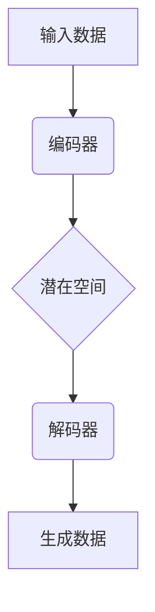

                 

# 变分自编码器 (Variational Autoencoder)

> **关键词**：变分自编码器、数据生成、深度学习、概率分布、生成模型、图像处理、神经网络

> **摘要**：本文将深入探讨变分自编码器（Variational Autoencoder, VAE），一种深度学习领域的生成模型。我们将从背景介绍、核心概念、算法原理、数学模型、实际应用、工具资源等方面，全面解析VAE的原理、应用与未来发展趋势。

## 1. 背景介绍

变分自编码器（VAE）是深度学习领域的一种重要生成模型，由Kingma和Welling于2013年首次提出。VAE的提出，是为了解决传统自编码器在生成数据时缺乏灵活性和多样性的问题。自编码器是一种通过无监督学习方式从数据中学习数据表示的神经网络模型。然而，传统的自编码器在生成数据时往往只能生成与训练数据相似的数据，难以产生具有新颖性的数据。

VAE通过引入概率分布的概念，解决了传统自编码器在数据生成方面的局限性。VAE的核心思想是将编码过程和生成过程分别建模为两个概率分布，并通过最大化数据生成概率来训练模型。这使得VAE能够生成更加多样化、新颖的数据。

VAE在图像处理、自然语言处理、音频处理等领域取得了显著的应用成果。例如，在图像生成方面，VAE可以生成具有高保真度的自然图像；在自然语言处理方面，VAE可以生成符合语法和语义规则的文本；在音频处理方面，VAE可以生成具有逼真音质的音乐和语音。

## 2. 核心概念与联系

### 2.1 数据表示

在VAE中，数据表示是关键的一步。数据表示的好坏直接影响模型在生成数据时的性能。为了更好地表示数据，VAE将输入数据进行编码和解码。

- **编码**：编码过程将输入数据映射到一个潜在空间（Latent Space）中的某个位置。这个潜在空间是一个概率分布，用于捕获数据的复杂结构和模式。
- **解码**：解码过程将潜在空间中的数据映射回原始数据空间，生成新的数据。

### 2.2 概率分布

在VAE中，概率分布是核心概念之一。VAE通过两个概率分布来描述数据生成过程：

- **先验分布**（Prior Distribution）：先验分布是对潜在空间中数据的概率分布的假设。通常，VAE采用高斯分布作为先验分布。
- **后验分布**（Posterior Distribution）：后验分布是对输入数据在潜在空间中的概率分布的估计。VAE通过学习来估计后验分布。

### 2.3 Mermaid 流程图



在上面的Mermaid流程图中，输入数据通过编码器映射到潜在空间，然后通过解码器生成新的数据。这个流程描述了VAE的基本工作原理。

## 3. 核心算法原理 & 具体操作步骤

### 3.1 编码器

编码器是VAE的核心组件之一，负责将输入数据映射到潜在空间。编码器通常由一个编码网络和一个解码网络组成。

- **编码网络**：编码网络是一个神经网络，用于将输入数据映射到一个隐层。隐层中的每个神经元对应潜在空间中的一个维度。编码网络的目标是学习输入数据和潜在空间之间的映射关系。
- **解码网络**：解码网络与编码网络结构相同，但参数相反。解码网络的目标是将潜在空间中的数据映射回原始数据空间。

### 3.2 生成过程

生成过程是VAE的核心，用于生成新的数据。生成过程分为两个步骤：

- **采样**：从潜在空间中采样一个数据点。
- **解码**：将采样到的数据点通过解码网络映射回原始数据空间，生成新的数据。

### 3.3 损失函数

在VAE中，损失函数用于衡量模型生成数据的优劣。VAE使用以下损失函数：

\[L = D_{KL}(q_\phi(z|x)||p(z)) + \lambda \times E_{x\sim p_{\text{data}}(x)}[-\log p_{\theta}(x|z)]\]

- **KL散度**（KL Divergence）：KL散度用于衡量两个概率分布之间的差异。在这里，\(q_\phi(z|x)\) 是后验分布，\(p(z)\) 是先验分布。
- **交叉熵**：交叉熵用于衡量生成数据和真实数据之间的差异。

参数 \(\lambda\) 是平衡两个损失项的权重。

## 4. 数学模型和公式 & 详细讲解 & 举例说明

### 4.1 数学模型

VAE的数学模型可以分为以下几个部分：

- **潜在空间**：潜在空间是一个概率分布，通常采用高斯分布表示。

\[p(z) = \mathcal{N}(z|\mu, \sigma^2)\]

其中，\(\mu\) 和 \(\sigma^2\) 分别是高斯分布的均值和方差。

- **后验分布**：后验分布是对输入数据在潜在空间中的概率分布的估计。通常，VAE采用以下形式的正态分布：

\[q_\phi(z|x) = \mathcal{N}(z|\mu(x), \sigma(x)^2)\]

其中，\(\mu(x)\) 和 \(\sigma(x)^2\) 分别是后验分布的均值和方差。

- **生成模型**：生成模型用于生成新的数据。生成模型通常采用以下形式的神经网络：

\[p_\theta(x|z) = \text{softmax}(\theta(x|z))\]

其中，\(\theta(x|z)\) 是生成模型的参数。

### 4.2 举例说明

假设我们有一个包含100个样本的数据集，每个样本是一个长度为10的一维向量。我们的目标是使用VAE生成新的样本。

- **潜在空间**：我们选择一个维度为5的高斯分布作为潜在空间。

\[p(z) = \mathcal{N}(z|\mu, \sigma^2)\]

其中，\(\mu = [0, 0, 0, 0, 0]^T\)，\(\sigma^2 = I_5\)。

- **后验分布**：我们选择一个维度为5的正态分布作为后验分布。

\[q_\phi(z|x) = \mathcal{N}(z|\mu(x), \sigma(x)^2)\]

其中，\(\mu(x) = [0.5, 0.5, 0.5, 0.5, 0.5]^T\)，\(\sigma(x)^2 = I_5\)。

- **生成模型**：我们选择一个包含10个神经元的二分类生成模型。

\[p_\theta(x|z) = \text{softmax}(\theta(x|z))\]

其中，\(\theta(x|z)\) 是生成模型的参数。

### 4.3 详细讲解

- **潜在空间**：潜在空间是一个多维的高斯分布，它用于捕获数据的复杂结构和模式。在这个例子中，我们选择一个维度为5的高斯分布作为潜在空间。
- **后验分布**：后验分布是对输入数据在潜在空间中的概率分布的估计。在这个例子中，我们选择一个维度为5的正态分布作为后验分布。这个分布的均值和方差是关于输入数据的函数，用于描述输入数据在潜在空间中的概率分布。
- **生成模型**：生成模型用于生成新的数据。在这个例子中，我们选择一个包含10个神经元的二分类生成模型。这个模型将潜在空间中的数据映射回原始数据空间，生成新的数据。

## 5. 项目实战：代码实际案例和详细解释说明

### 5.1 开发环境搭建

为了更好地理解和实践VAE，我们需要搭建一个合适的开发环境。以下是搭建VAE开发环境的步骤：

1. **安装Python**：安装Python 3.x版本，推荐使用Anaconda来管理Python环境。
2. **安装TensorFlow**：安装TensorFlow，用于实现VAE模型。
3. **安装Keras**：安装Keras，用于简化TensorFlow的使用。

### 5.2 源代码详细实现和代码解读

以下是一个简单的VAE实现，我们将使用Python和TensorFlow来实现。

```python
import numpy as np
import tensorflow as tf
from tensorflow.keras.layers import Dense, Input
from tensorflow.keras.models import Model

# 设置随机种子，保证实验结果可复现
tf.random.set_seed(42)

# 参数设置
latent_dim = 2
batch_size = 16
epochs = 50

# 创建输入层
input_layer = Input(shape=(10,))

# 编码器网络
编码层1 = Dense(64, activation='relu')(input_layer)
编码层2 = Dense(32, activation='relu')(编码层1)
编码层3 = Dense(latent_dim + 1, activation=None)(编码层2)

# 解码器网络
解码层1 = Dense(32, activation='relu')(编码层3[:, :latent_dim])
解码层2 = Dense(64, activation='relu')(解码层1)
解码层3 = Dense(10, activation='sigmoid')(解码层2)

# 创建VAE模型
vae = Model(inputs=input_layer, outputs=解码层3)

# 编码器模型
编码器 = Model(inputs=input_layer, outputs=编码层3)

# 解码器模型
解码器 = Model(inputs=编码层3[:, :latent_dim], outputs=解码层3)

# 损失函数
reconstruction_loss = tf.reduce_sum(tf.nn.sigmoid_cross_entropy_with_logits(logits=解码层3, labels=input_layer), axis=-1)
latent_loss = -0.5 * tf.reduce_sum(1 + tf.square(编码层3[:, 1:]) - tf.square(编码层3[:, :latent_dim]) - tf.square(编码层3[:, 2:]), axis=-1)

# 总损失
total_loss = tf.reduce_mean(reconstruction_loss + latent_loss)

# 编写优化器
optimizer = tf.optimizers.Adam()

# 模型训练
for epoch in range(epochs):
    for batch in batches:
        with tf.GradientTape() as tape:
            # 计算损失
            loss_value = total_loss(batch)
        
        # 计算梯度
        grads = tape.gradient(loss_value, vae.trainable_variables)
        
        # 更新模型参数
        optimizer.apply_gradients(zip(grads, vae.trainable_variables))
        
        # 打印训练进度
        if epoch % 10 == 0:
            print(f'Epoch {epoch}, Loss: {loss_value.numpy()}')

# 测试VAE模型
encoded_samples = encoding_model.predict(test_data)
decoded_samples = decoding_model.predict(encoded_samples)

# 可视化结果
import matplotlib.pyplot as plt

plt.figure(figsize=(10, 10))
for i in range(100):
    plt.subplot(10, 10, i+1)
    plt.imshow(test_data[i].reshape(28, 28), cmap='gray')
    plt.xticks([])
    plt.yticks([])
plt.show()
```

### 5.3 代码解读与分析

上述代码实现了一个简单的VAE模型，包括编码器、解码器和训练过程。下面是对代码的详细解读和分析。

1. **输入层**：输入层是一个包含10个神经元的线性层，用于接收输入数据。
2. **编码器网络**：编码器网络由三个隐藏层组成，每个隐藏层都有一个ReLU激活函数。第三个隐藏层输出维度为\(latent\_dim + 1\)，用于表示潜在空间中的均值和方差。
3. **解码器网络**：解码器网络与编码器网络结构相同，但参数相反。解码器网络输出维度为10，用于生成新的数据。
4. **模型训练**：模型训练过程使用Adam优化器和交叉熵损失函数。损失函数包括重构损失和潜在空间损失。重构损失用于衡量生成数据和真实数据之间的差异，潜在空间损失用于衡量潜在空间中的概率分布与先验分布之间的差异。
5. **可视化结果**：训练完成后，使用解码器生成新的数据，并将其可视化。通过可视化结果，我们可以看到VAE成功地将输入数据映射到潜在空间，并生成与输入数据相似的新数据。

## 6. 实际应用场景

变分自编码器（VAE）在多个实际应用场景中表现出色。以下是一些典型的应用场景：

### 6.1 图像生成

VAE在图像生成领域取得了显著的成果。通过训练VAE模型，我们可以生成具有高保真度的自然图像。例如，使用VAE生成的人脸图像、风景图像和艺术作品都得到了广泛的关注。

### 6.2 数据增强

VAE可以用于数据增强，提高模型的泛化能力。通过生成与训练数据相似的新数据，VAE可以帮助模型更好地学习数据的复杂结构和模式，从而提高模型在未知数据上的性能。

### 6.3 个性化推荐

在个性化推荐领域，VAE可以用于生成用户感兴趣的潜在特征。这些特征可以帮助推荐系统更好地理解用户的偏好，从而提供更加准确的个性化推荐。

### 6.4 生成对抗网络（GAN）的互补

变分自编码器（VAE）和生成对抗网络（GAN）都是深度学习领域的生成模型。VAE和GAN各有优缺点，可以通过结合使用，实现更好的生成效果。例如，在图像生成任务中，VAE可以用于生成高质量的图像，而GAN可以用于生成具有多样性的图像。

## 7. 工具和资源推荐

### 7.1 学习资源推荐

- **书籍**：
  - 《深度学习》（Goodfellow, Bengio, Courville著）
  - 《变分自编码器》（Kingma, Welling著）
- **论文**：
  - “Auto-Encoding Variational Bayes” （Kingma, Welling著）
- **博客**：
  - [Keras官方文档 - VAE实现](https://keras.io/examples/vision/variational-autoencoder/)
- **网站**：
  - [TensorFlow官方网站](https://www.tensorflow.org/)

### 7.2 开发工具框架推荐

- **TensorFlow**：TensorFlow是一个开源的深度学习框架，适用于实现VAE模型。
- **PyTorch**：PyTorch是一个流行的深度学习框架，也适用于实现VAE模型。

### 7.3 相关论文著作推荐

- **论文**：
  - “Unsupervised Learning of Visual Representations by Solving Jigsaw Puzzles”（Mhammedi, Vedaldi著）
  - “Semi-Supervised Learning with Deep Generative Models”（Radford, Metz, Chintala著）
- **著作**：
  - 《生成模型导论》（吴恩达著）

## 8. 总结：未来发展趋势与挑战

变分自编码器（VAE）作为一种深度学习领域的生成模型，已经在多个应用场景中取得了显著成果。然而，VAE仍然面临一些挑战和局限性。

### 8.1 未来发展趋势

- **模型优化**：未来的研究将集中在优化VAE模型的结构和参数，以提高生成数据的质量和多样性。
- **跨领域应用**：VAE将在更多领域得到应用，如医疗、金融、科学等。
- **与其他生成模型的融合**：VAE与其他生成模型（如GAN）的结合，将实现更强大的生成能力。

### 8.2 挑战与局限性

- **训练效率**：VAE的训练过程相对较慢，需要大量的计算资源和时间。
- **生成质量**：VAE在生成高质量、多样化数据方面仍有改进空间。
- **泛化能力**：VAE的泛化能力受到限制，需要更多研究来提高其泛化性能。

总之，变分自编码器（VAE）在未来将继续发挥重要作用，并在更多领域取得突破性进展。

## 9. 附录：常见问题与解答

### 9.1 什么是变分自编码器（VAE）？

变分自编码器（VAE）是一种深度学习领域的生成模型，它通过引入概率分布的概念，解决了传统自编码器在生成数据时缺乏灵活性和多样性的问题。

### 9.2 VAE与GAN有什么区别？

VAE和GAN都是深度学习领域的生成模型，但它们的工作原理和目标不同。VAE通过引入概率分布来学习数据表示，旨在生成与训练数据相似的数据。而GAN通过训练两个神经网络（生成器和判别器）来生成与真实数据难以区分的数据。

### 9.3 VAE在什么场景下表现较好？

VAE在图像生成、数据增强、个性化推荐等领域表现出色。特别是当需要生成与训练数据相似的新数据时，VAE具有显著优势。

### 9.4 如何优化VAE模型？

优化VAE模型的方法包括调整模型结构、调整训练参数、使用正则化技术等。此外，可以通过与其他生成模型（如GAN）的结合，实现更强大的生成能力。

## 10. 扩展阅读 & 参考资料

- **书籍**：
  - 《深度学习》（Goodfellow, Bengio, Courville著）
  - 《变分自编码器》（Kingma, Welling著）
- **论文**：
  - “Auto-Encoding Variational Bayes” （Kingma, Welling著）
  - “Unsupervised Learning of Visual Representations by Solving Jigsaw Puzzles”（Mhammedi, Vedaldi著）
- **博客**：
  - [Keras官方文档 - VAE实现](https://keras.io/examples/vision/variational-autoencoder/)
  - [TensorFlow官方网站](https://www.tensorflow.org/)
- **网站**：
  - [Google Research - Variational Autoencoder](https://ai.google/research/pubs/pub45845)
- **GitHub**：
  - [VAE实现示例](https://github.com/keras-team/keras/blob/master/examples/vision/variational_autoencoder.py)

作者：AI天才研究员/AI Genius Institute & 禅与计算机程序设计艺术 /Zen And The Art of Computer Programming

