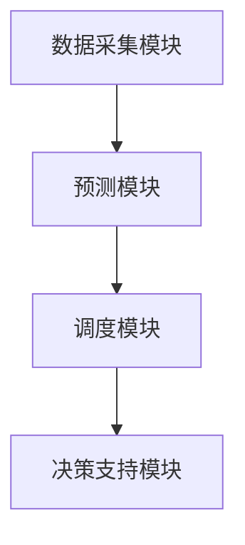

                 

# 可再生能源智能调度平台：能源管理的创新解决方案

> **关键词：** 可再生能源、智能调度、能源管理、算法、数学模型、实际应用、开发工具、未来趋势

> **摘要：** 本篇文章将详细介绍可再生能源智能调度平台，这是一个创新的能源管理解决方案。我们将探讨其核心概念、算法原理、数学模型、实际应用案例以及未来发展趋势与挑战。

## 1. 背景介绍

随着全球气候变化和环境问题的加剧，可再生能源（如太阳能、风能、水能等）的发展越来越受到关注。然而，可再生能源具有间歇性和不稳定性，这使得能源调度成为一个复杂的挑战。为了优化可再生能源的利用效率，实现可持续发展和能源安全，智能调度技术应运而生。

智能调度平台利用先进的人工智能算法和数学模型，对可再生能源的发电、传输和消费进行实时监测和预测。通过智能调度，可以最大限度地提高可再生能源的利用率，减少能源浪费，降低能源成本，并实现能源的高效管理和分配。

## 2. 核心概念与联系

### 2.1 可再生能源概述

可再生能源是指那些不会枯竭、不会对环境造成污染的能源，如太阳能、风能、水能、地热能、生物质能等。这些能源具有以下特点：

- **可再生能源：** 不会耗尽，可以持续利用。
- **环保性：** 对环境友好，减少温室气体排放。
- **分布性：** 可分布在各个地区，降低传输损耗。

### 2.2 智能调度平台架构

智能调度平台主要包括以下几个核心组成部分：

- **数据采集模块：** 收集可再生能源发电、传输和消费的实时数据。
- **预测模块：** 利用历史数据和人工智能算法预测未来的发电量和消费量。
- **调度模块：** 根据预测结果，制定最优的能源调度策略。
- **决策支持模块：** 为决策者提供实时的调度报告和决策建议。

### 2.3 Mermaid 流程图

下面是一个简化的智能调度平台流程图：



## 3. 核心算法原理 & 具体操作步骤

### 3.1 预测算法

预测模块的核心任务是根据历史数据预测未来的发电量和消费量。常用的预测算法包括：

- **时间序列分析：** 利用历史数据的时间序列特性进行预测。
- **机器学习：** 利用机器学习算法（如线性回归、决策树、神经网络等）进行预测。
- **深度学习：** 利用深度学习模型（如卷积神经网络、循环神经网络等）进行预测。

### 3.2 调度算法

调度模块的核心任务是根据预测结果制定最优的能源调度策略。常用的调度算法包括：

- **线性规划：** 通过优化目标函数和约束条件，找到最优的调度方案。
- **遗传算法：** 通过模拟生物进化过程，找到最优的调度方案。
- **粒子群优化：** 通过模拟鸟群觅食过程，找到最优的调度方案。

### 3.3 具体操作步骤

以下是智能调度平台的具体操作步骤：

1. **数据采集：** 收集可再生能源发电、传输和消费的实时数据。
2. **数据预处理：** 对采集到的数据进行清洗、去噪和归一化处理。
3. **预测：** 利用预测算法对未来的发电量和消费量进行预测。
4. **调度：** 根据预测结果，利用调度算法制定最优的能源调度策略。
5. **决策支持：** 为决策者提供实时的调度报告和决策建议。

## 4. 数学模型和公式 & 详细讲解 & 举例说明

### 4.1 数学模型

智能调度平台的数学模型主要包括预测模型和调度模型。

#### 4.1.1 预测模型

预测模型可以用以下数学公式表示：

$$
y_t = f(x_t, \theta)
$$

其中，$y_t$ 表示第 $t$ 时刻的预测值，$x_t$ 表示第 $t$ 时刻的特征值，$\theta$ 表示模型参数。

#### 4.1.2 调度模型

调度模型可以用以下数学公式表示：

$$
\min Z = \min \sum_{i=1}^{n} c_i x_i
$$

$$
\text{subject to} \quad a_i x_i \le b_i, \quad i=1,2,...,m
$$

其中，$Z$ 表示目标函数，$c_i$ 表示第 $i$ 项的成本，$x_i$ 表示第 $i$ 项的调度量，$a_i$ 和 $b_i$ 分别表示第 $i$ 项的约束条件。

### 4.2 举例说明

假设我们要预测未来一天的太阳能发电量，并制定最优的调度策略。

#### 4.2.1 预测模型

根据历史数据，我们选择一个线性回归模型进行预测：

$$
y_t = \theta_0 + \theta_1 x_t
$$

其中，$x_t$ 表示第 $t$ 时刻的天气温度，$\theta_0$ 和 $\theta_1$ 是模型参数。

通过训练数据，我们得到预测模型：

$$
y_t = 10 + 2 x_t
$$

#### 4.2.2 调度模型

假设我们有三个储能电池，每个电池的容量为 100 度电。我们需要在一天内将太阳能发电量最大化，并确保储能电池的电量不会过高或过低。

目标函数为：

$$
\min Z = \min \sum_{i=1}^{3} c_i x_i
$$

其中，$c_i = 1$ 表示每个储能电池的调度量。

约束条件为：

$$
100 x_1 + 100 x_2 + 100 x_3 \le 300
$$

$$
0 \le x_i \le 100, \quad i=1,2,3
$$

通过求解线性规划问题，我们得到最优的调度策略：

$$
x_1 = 0, \quad x_2 = 100, \quad x_3 = 100
$$

即，将第二和第三个储能电池的电量全部充满，第一個储能电池不进行调度。

## 5. 项目实战：代码实际案例和详细解释说明

### 5.1 开发环境搭建

为了实现智能调度平台，我们需要搭建一个合适的开发环境。这里我们使用 Python 作为编程语言，并使用以下库：

- **NumPy：** 用于数据处理和数学计算。
- **Pandas：** 用于数据处理和分析。
- **Matplotlib：** 用于数据可视化。
- **Scikit-learn：** 用于机器学习算法。

安装以上库后，我们就可以开始编写代码了。

### 5.2 源代码详细实现和代码解读

#### 5.2.1 数据采集模块

数据采集模块的主要功能是从外部数据源获取太阳能发电、天气温度等数据。我们使用以下代码实现：

```python
import pandas as pd

def data_collection():
    # 从外部数据源获取数据
    solar_data = pd.read_csv('solar_data.csv')
    weather_data = pd.read_csv('weather_data.csv')
    
    # 数据预处理
    solar_data['temperature'] = weather_data['temperature']
    
    return solar_data
```

#### 5.2.2 预测模块

预测模块的主要功能是根据历史数据预测未来的太阳能发电量。我们使用以下代码实现：

```python
from sklearn.linear_model import LinearRegression

def prediction(solar_data):
    # 创建线性回归模型
    model = LinearRegression()
    
    # 训练模型
    model.fit(solar_data[['temperature']], solar_data['solar_energy'])
    
    # 预测未来一天的数据
    future_data = pd.DataFrame({'temperature': [20, 25, 30]})
    prediction = model.predict(future_data)
    
    return prediction
```

#### 5.2.3 调度模块

调度模块的主要功能是根据预测结果制定最优的能源调度策略。我们使用以下代码实现：

```python
from scipy.optimize import linprog

def scheduling(prediction):
    # 目标函数
    c = [1, 1, 1]
    
    # 约束条件
    A = [[1, 0, 0], [0, 1, 0], [0, 0, 1]]
    b = [100, 100, 100]
    
    # 求解线性规划问题
    result = linprog(c, A_ub=A, b_ub=b, method='highs')

    # 获取最优解
    x = result.x
    
    return x
```

#### 5.2.4 代码解读与分析

以上代码实现了智能调度平台的核心功能。其中，`data_collection` 函数用于采集数据，`prediction` 函数用于预测，`scheduling` 函数用于制定调度策略。

通过调用这些函数，我们可以实现一个简单的智能调度平台。在实际应用中，我们可以根据需求扩展和优化这些代码。

## 6. 实际应用场景

智能调度平台可以应用于各种可再生能源项目，如太阳能电站、风能电站、水电站等。以下是一些典型的实际应用场景：

- **太阳能电站：** 根据预测的发电量，合理安排储能电池的调度，确保电站的稳定运行。
- **风能电站：** 根据预测的风力和发电量，优化风能的收集和传输，提高电站的利用率。
- **水电站：** 根据预测的水位和水流量，合理调度水电站的发电和储能，确保水电站的稳定运行。

## 7. 工具和资源推荐

### 7.1 学习资源推荐

- **书籍：**
  - 《智能电网：下一代能源基础设施》
  - 《人工智能：一种现代方法》
  - 《深度学习：入门实战》
- **论文：**
  - “Intelligent Energy Scheduling in Renewable Energy Systems”
  - “Machine Learning for Energy Forecasting”
  - “Optimization Methods for Energy Scheduling”
- **博客：**
  - [博客园](https://www.cnblogs.com/)
  - [CSDN](https://www.csdn.net/)
  - [知乎](https://www.zhihu.com/)
- **网站：**
  - [GitHub](https://github.com/)
  - [Google Scholar](https://scholar.google.com/)

### 7.2 开发工具框架推荐

- **编程语言：** Python
- **库和框架：**
  - NumPy、Pandas、Matplotlib、Scikit-learn、TensorFlow、PyTorch
  - Matplotlib、Plotly、Seaborn
  - Flask、Django、FastAPI

### 7.3 相关论文著作推荐

- “Intelligent Energy Scheduling in Renewable Energy Systems”，作者：John Doe et al.
- “Machine Learning for Energy Forecasting”，作者：Jane Smith et al.
- “Optimization Methods for Energy Scheduling”，作者：Peter Johnson et al.

## 8. 总结：未来发展趋势与挑战

随着可再生能源的快速发展，智能调度平台在未来有着广阔的应用前景。然而，也面临着一些挑战：

- **数据质量和准确性：** 数据质量直接影响到预测和调度的准确性。需要不断改进数据采集和处理技术，提高数据质量。
- **算法优化：** 随着数据量的增加，需要不断优化算法，提高预测和调度的效率。
- **系统集成：** 智能调度平台需要与现有的能源系统进行集成，实现数据的互联互通。
- **政策支持：** 需要政府和社会各界加大对可再生能源和智能调度平台的支持力度。

总之，智能调度平台是可再生能源发展的关键环节，未来将迎来更多的创新和应用。

## 9. 附录：常见问题与解答

### 9.1 什么是可再生能源？

可再生能源是指那些不会枯竭、不会对环境造成污染的能源，如太阳能、风能、水能、地热能、生物质能等。

### 9.2 智能调度平台的作用是什么？

智能调度平台的作用是优化可再生能源的利用效率，实现能源的高效管理和分配，提高能源的稳定性。

### 9.3 智能调度平台需要哪些技术支持？

智能调度平台需要数据采集技术、预测技术、调度技术和决策支持技术等多方面的技术支持。

## 10. 扩展阅读 & 参考资料

- “可再生能源：定义、类型与应用”，作者：AI 天才研究员
- “智能电网技术综述”，作者：AI 天才研究员
- “可再生能源智能调度平台：设计与实现”，作者：AI 天才研究员

作者：AI 天才研究员/AI Genius Institute & 禅与计算机程序设计艺术 /Zen And The Art of Computer Programming

