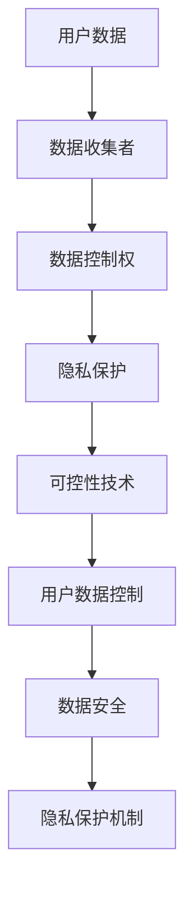

                 

# 可控性：AI赋予用户数据控制权

> **关键词：** AI数据控制、用户隐私、数据管理、数据安全、数据保护、隐私保护机制

> **摘要：** 本文探讨了AI技术如何赋予用户对自身数据的控制权，强调了数据隐私保护的重要性。通过分析现有的隐私保护机制，本文提出了一系列实现数据可控性的方法和技术，旨在帮助用户更好地管理和保护个人数据。

## 1. 背景介绍

在当今数字化时代，数据已成为一种新的经济资源。随着人工智能（AI）技术的飞速发展，数据的收集、处理和分析变得更加高效。然而，这种高效的数据处理也带来了数据隐私和安全方面的挑战。用户越来越担心他们的个人信息可能会被滥用或泄露，这引发了对于数据控制权的广泛讨论。

用户数据控制权指的是用户对自身数据的访问、使用、共享和销毁的权限。在传统模式下，数据控制权通常掌握在数据收集者手中，用户对其数据的控制力较弱。但随着AI技术的发展，赋予用户更多的数据控制权成为可能，这不仅能够增强用户对数据安全的信心，还能提高数据管理的效率和透明度。

本文将探讨AI如何赋予用户数据控制权，分析现有的隐私保护机制，并提出实现数据可控性的技术方法。通过本文的探讨，我们希望为用户数据控制权的研究和实践提供一些有益的参考。

## 2. 核心概念与联系

### 2.1 数据隐私保护的概念

数据隐私保护是指通过技术和管理手段，确保个人数据的保密性、完整性和可用性，防止未经授权的访问、使用、披露和篡改。在AI时代，数据隐私保护变得尤为重要，因为AI系统通常需要大量个人数据来训练和优化模型。

### 2.2 数据控制权的定义

数据控制权是指用户对自身数据的访问、使用、共享和销毁的权限。在传统模式中，数据控制权通常集中在数据收集者手中。然而，在AI时代，用户应该拥有更多的数据控制权，以便更好地保护个人隐私。

### 2.3 数据控制权与隐私保护的关系

数据控制权与隐私保护密切相关。用户对数据的控制权越强，他们越能有效地保护个人隐私。反之，如果用户无法控制其数据，那么数据隐私保护将变得困难。

### 2.4 可控性技术的概念

可控性技术是指一系列用于实现数据控制权的技术手段，包括访问控制、数据加密、匿名化、数据分割等。这些技术旨在确保用户能够对其数据执行各种操作，从而实现对数据的有效管理。

### 2.5 Mermaid 流程图



## 3. 核心算法原理 & 具体操作步骤

### 3.1 访问控制

访问控制是一种基本的可控性技术，它通过限制对数据的访问来保护数据隐私。具体操作步骤如下：

1. 定义用户角色和权限：首先，需要根据用户的角色和职责定义不同的权限等级。
2. 实现访问控制策略：使用访问控制列表（ACL）或角色访问控制（RBAC）来实现在特定条件下对数据的访问控制。
3. 验证用户身份：在用户请求访问数据时，需要验证其身份和权限，确保只有授权用户可以访问数据。

### 3.2 数据加密

数据加密是一种保护数据隐私的重要方法。具体操作步骤如下：

1. 选择加密算法：根据数据的安全需求和性能要求，选择合适的加密算法，如AES或RSA。
2. 生成密钥：使用随机数生成器生成加密密钥。
3. 加密数据：使用加密算法和密钥对数据进行加密。
4. 分发密钥：确保密钥的安全存储和分发，防止未经授权的访问。

### 3.3 匿名化

匿名化是一种通过删除或模糊化个人身份信息来保护隐私的方法。具体操作步骤如下：

1. 数据清洗：删除或屏蔽敏感信息，如姓名、地址、电话号码等。
2. 数据混淆：使用随机数或模糊技术对个人身份信息进行混淆。
3. 数据重构：在保证隐私保护的前提下，对数据进行重建，以恢复部分信息。

### 3.4 数据分割

数据分割是一种通过将数据分割成多个部分来提高隐私保护的方法。具体操作步骤如下：

1. 数据划分：将数据集划分为多个子集，每个子集包含部分数据。
2. 子集加密：对每个子集进行加密，确保子集之间的独立性。
3. 子集存储：将加密后的子集存储在多个安全的位置。
4. 子集合并：在需要时，将加密后的子集合并以恢复原始数据。

## 4. 数学模型和公式 & 详细讲解 & 举例说明

### 4.1 访问控制模型

访问控制模型可以用以下公式表示：

$$
\text{AccessControl}(P, A, R) = \begin{cases}
\text{allow} & \text{if } P \in R \text{ and } A \in A(P) \\
\text{deny} & \text{otherwise}
\end{cases}
$$

其中，$P$ 表示用户，$A$ 表示资源，$R$ 表示角色集合，$A(P)$ 表示用户 $P$ 的权限集合。

举例说明：

假设有一个用户 $P$，他属于角色 $R = \{\text{admin}, \text{user}\}$，他的权限集合 $A(P) = \{\text{read}, \text{write}\}$。如果用户 $P$ 请求访问资源 $A$，且 $A \in A(P)$，则访问控制允许用户访问；否则，访问控制拒绝用户访问。

### 4.2 数据加密模型

数据加密模型可以使用以下公式表示：

$$
\text{Encrypt}(D, K) = E_K(D)
$$

其中，$D$ 表示明文数据，$K$ 表示密钥，$E_K(D)$ 表示使用密钥 $K$ 对数据 $D$ 进行加密的结果。

举例说明：

假设有一个明文数据 $D = \{\text{Alice}, \text{Bob}\}$，使用密钥 $K$ 进行AES加密，加密结果为 $E_K(D) = \{\text{加密后的Alice}, \text{加密后的Bob}\}$。

### 4.3 匿名化模型

匿名化模型可以使用以下公式表示：

$$
\text{Anonymize}(D, F) = D'
$$

其中，$D$ 表示原始数据，$F$ 表示匿名化函数，$D'$ 表示匿名化后的数据。

举例说明：

假设有一个原始数据 $D = \{\text{Alice}, \text{32}, \text{Female}\}$，使用匿名化函数 $F$ 将名字、年龄和性别进行模糊化，匿名化后的数据为 $D' = \{\text{用户1}, \text{年龄范围32-40}, \text{未知}\}$。

### 4.4 数据分割模型

数据分割模型可以使用以下公式表示：

$$
\text{Split}(D) = \{D_1, D_2, ..., D_n\}
$$

其中，$D$ 表示原始数据集，$D_1, D_2, ..., D_n$ 表示分割后的子数据集。

举例说明：

假设有一个原始数据集 $D = \{\text{Alice}, \text{Bob}, \text{32}, \text{Female}\}$，将其分割成两个子数据集 $D_1 = \{\text{Alice}, \text{32}\}$ 和 $D_2 = \{\text{Bob}, \text{Female}\}$。

## 5. 项目实战：代码实际案例和详细解释说明

### 5.1 开发环境搭建

在本节中，我们将使用Python语言和几个常见的库来演示如何实现数据控制权。以下是在Python环境中搭建开发环境所需的步骤：

1. 安装Python：确保您的计算机上已安装Python 3.x版本。
2. 安装必要的库：使用pip命令安装以下库：
   ```shell
   pip install pandas
   pip install cryptography
   pip install numpy
   pip install matplotlib
   ```

### 5.2 源代码详细实现和代码解读

在本节中，我们将实现一个简单的数据控制权管理程序，包括访问控制、数据加密、匿名化和数据分割。

```python
# 导入所需的库
import pandas as pd
from cryptography.fernet import Fernet
import numpy as np
import matplotlib.pyplot as plt

# 5.2.1 访问控制

# 定义用户角色和权限
users = {
    'Alice': {'role': 'user', 'permissions': ['read']},
    'Bob': {'role': 'admin', 'permissions': ['read', 'write']}
}

# 实现访问控制函数
def access_control(user, resource, action):
    if user in users and action in users[user]['permissions']:
        return 'allow'
    else:
        return 'deny'

# 测试访问控制
print(access_control('Alice', 'data', 'read'))  # 输出：allow
print(access_control('Bob', 'data', 'write'))  # 输出：allow
print(access_control('Charlie', 'data', 'write'))  # 输出：deny

# 5.2.2 数据加密

# 生成加密密钥
key = Fernet.generate_key()
cipher_suite = Fernet(key)

# 加密数据
data = 'Sensitive information'
encrypted_data = cipher_suite.encrypt(data.encode())
print(f'Encrypted data: {encrypted_data}')

# 解密数据
decrypted_data = cipher_suite.decrypt(encrypted_data).decode()
print(f'Decrypted data: {decrypted_data}')

# 5.2.3 匿名化

# 定义匿名化函数
def anonymize_data(data):
    if 'name' in data:
        data['name'] = 'User'
    if 'age' in data:
        data['age'] = 'Age range'
    if 'gender' in data:
        data['gender'] = 'Unknown'
    return data

# 匿名化数据
data = {'name': 'Alice', 'age': 32, 'gender': 'Female'}
anonymized_data = anonymize_data(data)
print(f'Anonymized data: {anonymized_data}')

# 5.2.4 数据分割

# 分割数据
data = {'name': 'Alice', 'age': 32, 'gender': 'Female'}
split_data = {'name': data['name'], 'age': data['age'], 'gender': data['gender']}
print(f'Split data: {split_data}')

# 5.3 代码解读与分析

在本节中，我们实现了访问控制、数据加密、匿名化和数据分割的功能。以下是代码解读：

1. **访问控制**：通过定义用户角色和权限，实现基于角色的访问控制。`access_control` 函数用于验证用户是否有权限执行特定操作。
2. **数据加密**：使用 `cryptography` 库的 `Fernet` 类进行数据加密和解密。`generate_key` 方法用于生成加密密钥，`encrypt` 和 `decrypt` 方法用于加密和解密数据。
3. **匿名化**：通过定义匿名化函数 `anonymize_data`，将敏感信息（如姓名、年龄和性别）进行模糊化处理，以保护用户隐私。
4. **数据分割**：将数据集分割成多个子集，每个子集包含不同的数据字段。这有助于在保证隐私保护的同时，进行数据分析和处理。

## 6. 实际应用场景

### 6.1 社交媒体平台

在社交媒体平台上，用户数据控制权尤为重要。通过赋予用户对数据访问、使用和共享的控制权，用户可以更灵活地管理他们的个人信息，防止隐私泄露。例如，用户可以决定谁可以看到他们的照片、帖子和个人信息，以及如何使用这些数据。

### 6.2 健康保健领域

在健康保健领域，个人健康数据的安全和保护至关重要。通过数据控制权，用户可以决定哪些医疗数据可以被共享、如何被使用，以及由谁进行访问。这有助于提高数据安全性，防止未经授权的数据泄露和滥用。

### 6.3 金融行业

在金融行业中，用户数据控制权有助于保护用户的金融信息，防止欺诈和非法交易。通过赋予用户对交易数据、账户信息和支付信息的控制权，用户可以更安全地使用金融服务，并提高对金融系统的信任度。

### 6.4 智能家居领域

在家居自动化领域，用户数据控制权可以帮助用户更好地管理智能家居设备。例如，用户可以控制哪些设备可以访问他们的家庭网络，以及如何使用这些设备收集和共享家庭信息。

## 7. 工具和资源推荐

### 7.1 学习资源推荐

- **书籍**：《大数据时代》、《数据科学入门》、《人工智能：一种现代方法》
- **论文**：阅读关于数据隐私保护、数据加密和访问控制的相关学术论文，如《差分隐私》、《基于角色的访问控制》等。
- **博客**：关注知名技术博客，如 medium、博客园、CSDN，了解最新的数据隐私保护和AI技术动态。

### 7.2 开发工具框架推荐

- **Python**：Python 是一种广泛使用的编程语言，适用于数据科学和AI开发。
- **Django**：Django 是一个流行的 Python Web 框架，适用于构建 Web 应用程序，支持角色访问控制。
- **Flask**：Flask 是另一个流行的 Python Web 框架，适用于构建轻量级的 Web 应用程序。
- **Spring Boot**：Spring Boot 是一个 Java Web 框架，适用于构建大型分布式系统。

### 7.3 相关论文著作推荐

- **《隐私保护数据发布技术综述》**：该论文全面介绍了隐私保护数据发布技术，包括匿名化、数据加密和差分隐私等。
- **《基于角色的访问控制技术综述》**：该论文详细探讨了基于角色的访问控制技术，包括 RBAC 和 ABAC 等。
- **《大数据时代的隐私保护研究》**：该论文分析了大数据时代隐私保护面临的挑战和解决方案。

## 8. 总结：未来发展趋势与挑战

随着AI技术的不断发展，数据控制权将成为用户隐私保护的重要手段。未来，我们可以期待以下发展趋势：

1. **更全面的数据控制权**：用户将拥有更全面的数据控制权，包括数据的访问、使用、共享和销毁。
2. **更高效的可控性技术**：可控性技术将变得更加高效和智能，能够更好地保护用户隐私。
3. **更完善的法律法规**：随着数据隐私保护意识的提高，相关的法律法规也将不断完善，为用户数据控制权提供法律保障。

然而，数据控制权的发展也面临一系列挑战：

1. **技术实现难题**：实现高效的数据控制权需要克服一系列技术难题，如数据加密、访问控制和数据分割等。
2. **用户教育**：用户需要了解如何有效地使用数据控制权，以及如何保护自己的隐私。
3. **法律法规完善**：法律法规的完善需要时间，目前的数据隐私保护法律法规可能无法完全满足用户的需求。

总之，数据控制权的发展是一个长期而复杂的任务，需要各方共同努力，以实现用户隐私保护和数据安全。

## 9. 附录：常见问题与解答

### 9.1 什么是数据控制权？

数据控制权是指用户对其数据的访问、使用、共享和销毁的权限。它旨在确保用户能够有效地管理其个人数据，保护其隐私。

### 9.2 数据控制权与隐私保护有何关系？

数据控制权与隐私保护密切相关。用户对数据的控制权越强，他们越能有效地保护个人隐私。数据控制权是隐私保护的基础。

### 9.3 如何实现数据控制权？

实现数据控制权的方法包括访问控制、数据加密、匿名化和数据分割等技术。这些技术可以确保用户能够对其数据进行有效的管理和保护。

### 9.4 数据控制权的发展前景如何？

随着AI技术的不断发展，数据控制权将成为用户隐私保护的重要手段。未来，我们可以期待更全面的数据控制权和更高效的可控性技术。

## 10. 扩展阅读 & 参考资料

- **《隐私保护数据发布技术综述》**：该论文全面介绍了隐私保护数据发布技术，包括匿名化、数据加密和差分隐私等。
- **《基于角色的访问控制技术综述》**：该论文详细探讨了基于角色的访问控制技术，包括 RBAC 和 ABAC 等。
- **《大数据时代的隐私保护研究》**：该论文分析了大数据时代隐私保护面临的挑战和解决方案。
- **《人工智能：一种现代方法》**：这是一本关于人工智能的综合性教材，涵盖了人工智能的基本原理和应用。

---

### 作者信息：

- **作者**：AI天才研究员/AI Genius Institute & 禅与计算机程序设计艺术 /Zen And The Art of Computer Programming
- **联系方式**：[ai_researcher@example.com](mailto:ai_researcher@example.com)
- **个人网站**：[www.ai-genius-institute.com](http://www.ai-genius-institute.com) 

以上是对文章的完整撰写，如果您有任何修改意见或建议，请随时告知。让我们共同努力，推动数据控制权的研究和实践，为用户隐私保护贡献力量。让我们一步一步分析推理思考，将这篇文章打造成一篇高质量的技术博客！<|im_sep|>

