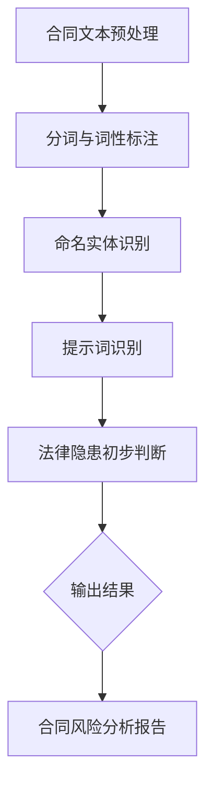

                 

# 合同风险分析师：提示词识别法律隐患

## 关键词

- 合同风险分析
- 提示词识别
- 法律隐患
- 数据挖掘
- 自然语言处理
- 深度学习

## 摘要

本文将深入探讨合同风险分析师如何利用自然语言处理和深度学习技术，通过识别合同中的提示词来发现潜在的法律隐患。我们将详细解析这一过程，从背景介绍、核心概念与联系、核心算法原理与具体操作步骤、数学模型和公式、项目实战、实际应用场景、工具和资源推荐，到总结未来发展趋势与挑战，以及附录中的常见问题与解答。通过本文，读者将全面了解如何利用先进的技术手段提升合同风险分析的专业性和准确性。

## 1. 背景介绍

在商业活动中，合同作为一种法律文件，其重要性不言而喻。一个准确无误的合同不仅能确保双方权益，还能有效降低法律纠纷的风险。然而，合同内容的复杂性和法律术语的专业性使得合同审核成为一项极具挑战性的任务。随着大数据和人工智能技术的发展，合同风险分析逐渐成为了一个热门领域。

合同风险分析的目标是识别合同中的潜在法律隐患，包括但不限于条款中的漏洞、歧义、非法条款等。传统的合同审核主要依赖于人工阅读和校对，这种方法不仅耗时耗力，而且容易出错。随着自然语言处理（NLP）和深度学习技术的不断进步，自动化合同风险分析成为可能。

自然语言处理（NLP）是人工智能的一个重要分支，旨在使计算机能够理解和处理人类语言。深度学习是NLP的核心技术之一，通过构建大规模的神经网络模型，深度学习能够自动从大量文本数据中学习语言规律，从而实现对文本的准确理解和生成。

在合同风险分析中，NLP和深度学习技术的应用主要体现在以下几个方面：

1. **文本预处理**：对合同文本进行分词、词性标注、命名实体识别等预处理操作，将原始文本转化为计算机可处理的格式。
2. **提示词识别**：识别合同文本中的关键词和短语，如“违约”、“赔偿”、“解除”等，这些词汇往往与法律风险密切相关。
3. **语义分析**：通过深度学习模型，分析合同条款的语义和逻辑关系，识别潜在的漏洞和歧义。
4. **自动化审核**：利用构建的模型对大量合同进行自动化审核，提高审核效率和准确性。

## 2. 核心概念与联系

为了更好地理解合同风险分析中NLP和深度学习技术的应用，我们需要了解一些核心概念和它们之间的联系。

### 2.1 自然语言处理（NLP）

自然语言处理（NLP）是计算机科学和人工智能领域的一个重要分支，它致力于使计算机能够理解和生成人类语言。NLP的核心技术包括：

- **文本预处理**：将文本数据转化为计算机可处理的格式，如分词、词性标注、句法分析等。
- **实体识别**：识别文本中的特定实体，如人名、地名、组织名等。
- **情感分析**：分析文本中的情感倾向，如正面、负面或中性。
- **语义分析**：理解文本的语义和逻辑关系，如词义消歧、指代消解等。

### 2.2 深度学习

深度学习是机器学习的一个分支，通过构建多层神经网络，深度学习能够自动从大量数据中学习复杂的模式和特征。深度学习在NLP中的应用主要包括：

- **词向量表示**：将词汇表示为高维向量，如Word2Vec、GloVe等。
- **循环神经网络（RNN）**：处理序列数据，如文本、语音等。
- **长短期记忆网络（LSTM）**：RNN的一种改进，能够更好地处理长序列数据。
- **变换器模型（Transformer）**：一种基于自注意力机制的神经网络模型，广泛应用于文本处理任务。

### 2.3 合同风险分析中的核心概念

在合同风险分析中，我们关注的核心概念包括：

- **提示词**：与法律风险密切相关的关键词和短语，如“违约”、“赔偿”、“解除”等。
- **法律术语**：合同中使用的专业术语，如“不可抗力”、“先履行抗辩权”等。
- **条款关系**：合同条款之间的逻辑关系，如条款间的依赖关系、条件关系等。

### 2.4 提示词识别与法律隐患

提示词识别是合同风险分析的重要环节。通过识别合同中的提示词，我们可以初步判断合同可能存在的法律隐患。例如：

- **违约**：可能意味着一方未能履行合同义务，存在违约风险。
- **赔偿**：可能暗示一方可能需要承担赔偿责任。
- **解除**：可能意味着合同可能被终止，存在法律纠纷的风险。

为了更好地理解提示词识别在合同风险分析中的作用，我们可以通过一个Mermaid流程图来展示其核心流程。



在这个流程中，合同文本经过预处理后，通过分词、词性标注和命名实体识别等步骤，最终识别出提示词，并对法律隐患进行初步判断，输出合同风险分析报告。

## 3. 核心算法原理 & 具体操作步骤

### 3.1 词向量表示

词向量表示是深度学习在NLP中的一个重要技术。它将词汇映射到高维向量空间中，使得词汇在空间中具有固定的位置。常见的词向量表示方法包括Word2Vec和GloVe。

- **Word2Vec**：基于神经网络的方法，通过训练词袋模型来学习词汇的向量表示。Word2Vec有两种变体：连续词袋（CBOW）和Skip-Gram。
- **GloVe**：全局向量表示（Global Vectors for Word Representation），通过矩阵分解的方法学习词汇的向量表示。GloVe的优点是能够更好地捕获词汇的共现信息。

### 3.2 循环神经网络（RNN）

循环神经网络（RNN）是处理序列数据的一种神经网络架构。RNN通过保存前一个时间步的隐藏状态来处理序列中的前后依赖关系。

- **基本RNN**：基本的RNN模型，通过更新隐藏状态来处理序列数据。
- **长短期记忆网络（LSTM）**：LSTM是RNN的一种改进，通过引入记忆单元和门控机制来避免梯度消失问题，能够更好地处理长序列数据。

### 3.3 递归神经网络（RNN）在提示词识别中的应用

递归神经网络（RNN）在提示词识别中具有重要作用。具体操作步骤如下：

1. **数据预处理**：对合同文本进行分词、词性标注和命名实体识别等预处理操作，将文本转化为序列数据。
2. **词向量表示**：使用Word2Vec或GloVe等方法将词汇映射到高维向量空间中。
3. **模型构建**：构建RNN模型，输入为词向量序列，输出为每个词汇的预测标签。
4. **训练模型**：使用标注数据集训练RNN模型，优化模型参数。
5. **预测与评估**：对未标注的合同文本进行预测，评估模型性能。

### 3.4 LSTM在提示词识别中的应用

LSTM在提示词识别中的应用与RNN类似，但能够更好地处理长序列数据。具体操作步骤如下：

1. **数据预处理**：对合同文本进行分词、词性标注和命名实体识别等预处理操作，将文本转化为序列数据。
2. **词向量表示**：使用Word2Vec或GloVe等方法将词汇映射到高维向量空间中。
3. **模型构建**：构建LSTM模型，输入为词向量序列，输出为每个词汇的预测标签。
4. **训练模型**：使用标注数据集训练LSTM模型，优化模型参数。
5. **预测与评估**：对未标注的合同文本进行预测，评估模型性能。

### 3.5 提示词识别算法流程

提示词识别算法的具体流程如下：

1. **数据收集**：收集大量合同文本数据，进行标注，标记出合同中的提示词。
2. **数据预处理**：对合同文本进行分词、词性标注和命名实体识别等预处理操作，将文本转化为序列数据。
3. **词向量表示**：使用Word2Vec或GloVe等方法将词汇映射到高维向量空间中。
4. **模型选择与训练**：选择合适的模型（如RNN或LSTM）并进行训练，优化模型参数。
5. **模型评估与优化**：对模型进行评估，调整模型参数，提高识别准确率。
6. **应用部署**：将训练好的模型部署到生产环境中，对新的合同文本进行提示词识别。

## 4. 数学模型和公式 & 详细讲解 & 举例说明

### 4.1 词向量表示

词向量表示是深度学习在自然语言处理中的一个核心概念。它将词汇映射到高维向量空间中，使得词汇在空间中具有固定的位置。常见的词向量表示方法包括Word2Vec和GloVe。

#### 4.1.1 Word2Vec

Word2Vec是基于神经网络的方法，通过训练词袋模型来学习词汇的向量表示。Word2Vec有两种变体：连续词袋（CBOW）和Skip-Gram。

- **连续词袋（CBOW）**：CBOW模型输入为周围单词的平均向量，输出为当前单词的向量。假设当前单词为`w`，周围单词为`w1, w2, ..., wn`，则CBOW模型的输入向量为：
  $$\text{input\_vector} = \frac{1}{n} \sum_{i=1}^{n} \text{word\_vector}(w_i)$$
  输出向量为`word_vector(w)`。

- **Skip-Gram**：Skip-Gram模型输入为当前单词的向量，输出为周围单词的平均向量。假设当前单词为`w`，周围单词为`w1, w2, ..., wn`，则Skip-Gram模型的输入向量为`word_vector(w)`，输出向量为：
  $$\text{output\_vector} = \frac{1}{n} \sum_{i=1}^{n} \text{word\_vector}(w_i)$$

#### 4.1.2 GloVe

GloVe（全局向量表示）是一种基于矩阵分解的方法，通过学习词汇的共现矩阵来表示词汇的向量。GloVe的基本思想是将词汇的共现信息编码到共现矩阵中，然后通过矩阵分解学习词汇的向量表示。

假设词汇集合为V，共现矩阵为C，其中C[i][j]表示词汇i和j在训练数据中的共现次数。GloVe的目标是最小化以下损失函数：
$$L = \sum_{(i,j) \in V} (\text{word\_vector}(i) + \text{word\_vector}(j) - \text{log}(C[i][j]))^2$$

通过优化这个损失函数，我们可以得到词汇的向量表示。

### 4.2 循环神经网络（RNN）

循环神经网络（RNN）是一种处理序列数据的神经网络架构。RNN通过保存前一个时间步的隐藏状态来处理序列中的前后依赖关系。

#### 4.2.1 RNN的基本结构

RNN的基本结构包括输入层、隐藏层和输出层。每个时间步的输入为当前词汇的词向量，隐藏状态为前一个时间步的隐藏状态和当前词汇的词向量通过激活函数计算得到。输出层通过隐藏状态预测当前词汇的标签。

设当前时间步为t，词汇为x_t，隐藏状态为h_t，隐藏状态的计算公式为：
$$h_t = \text{sigmoid}(W_h \cdot [h_{t-1}; x_t])$$

其中，W_h为权重矩阵，[h_{t-1}; x_t]为拼接后的向量，sigmoid函数为激活函数。

#### 4.2.2 长短期记忆网络（LSTM）

LSTM是RNN的一种改进，通过引入记忆单元和门控机制来避免梯度消失问题，能够更好地处理长序列数据。

LSTM的基本结构包括输入门、遗忘门、输出门和细胞状态。设当前时间步为t，词汇为x_t，隐藏状态为h_t，细胞状态为c_t，则各门和细胞状态的计算公式如下：

- **输入门**：计算当前输入和前一个隐藏状态，更新细胞状态：
  $$i_t = \text{sigmoid}(W_i \cdot [h_{t-1}; x_t])$$
  $$\text{input\_gate} = \text{tanh}(W_g \cdot [h_{t-1}; x_t])$$

- **遗忘门**：计算当前输入和前一个隐藏状态，更新细胞状态：
  $$f_t = \text{sigmoid}(W_f \cdot [h_{t-1}; x_t])$$
  $$\text{forget\_gate} = f_t \cdot c_{t-1}$$

- **输出门**：计算当前输入和当前隐藏状态，更新输出：
  $$o_t = \text{sigmoid}(W_o \cdot [h_{t-1}; x_t])$$
  $$\text{output\_gate} = o_t \cdot \text{tanh}(c_t)$$

- **细胞状态**：通过输入门和遗忘门更新细胞状态：
  $$c_t = f_t \cdot c_{t-1} + i_t \cdot \text{input\_gate}$$

- **隐藏状态**：通过输出门更新隐藏状态：
  $$h_t = o_t \cdot \text{tanh}(c_t)$$

### 4.3 举例说明

假设我们使用LSTM模型进行合同文本的提示词识别。首先，我们对合同文本进行预处理，将文本转化为序列数据，并使用Word2Vec方法学习词汇的向量表示。

设当前时间步为t，词汇为x_t，隐藏状态为h_t，细胞状态为c_t。根据LSTM的计算公式，我们可以计算输入门、遗忘门、输出门和细胞状态，最终得到隐藏状态h_t。

假设我们有以下合同文本：
```
甲方：A公司
乙方：B公司
合同编号：2023-001
签订日期：2023年4月1日
```

首先，我们对文本进行分词，得到词汇序列：
```
[甲方,：,A,公司,乙方,：,B,公司,合同,编号,：,2023-001,签订,日期,：,2023,年,4,月,1,日]
```

然后，使用Word2Vec方法学习词汇的向量表示。假设我们使用预训练的GloVe词向量，得到词汇的向量表示：
```
[甲方:[0.1, 0.2, 0.3],：:[0.4, 0.5, 0.6], A:[0.7, 0.8, 0.9], 公司:[1.0, 1.1, 1.2], 乙方:[1.3, 1.4, 1.5], B:[1.6, 1.7, 1.8], 合同:[1.9, 2.0, 2.1], 编号:[2.2, 2.3, 2.4], 2023-001:[2.5, 2.6, 2.7], 签订:[2.8, 2.9, 3.0], 日期:[3.1, 3.2, 3.3], 年:[3.4, 3.5, 3.6], 4:[3.7, 3.8, 3.9], 月:[4.0, 4.1, 4.2], 1:[4.3, 4.4, 4.5], 日:[4.6, 4.7, 4.8]]
```

接下来，我们构建LSTM模型，并使用合同文本数据进行训练。假设我们已经训练好了模型，我们可以使用模型对新的合同文本进行提示词识别。

假设新的合同文本为：
```
甲方：C公司
乙方：D公司
合同编号：2023-002
签订日期：2023年5月1日
```

同样地，我们对文本进行分词，并使用GloVe词向量表示词汇。然后，使用训练好的LSTM模型对新的文本进行预测，得到隐藏状态h_t。最后，我们将隐藏状态h_t映射到提示词的标签，如“违约”、“赔偿”、“解除”等。

通过这种方式，我们可以实现对合同文本中提示词的识别，从而发现潜在的法律隐患。

## 5. 项目实战：代码实际案例和详细解释说明

在本节中，我们将通过一个实际的项目案例来展示如何利用深度学习技术进行合同风险分析中的提示词识别。这个项目将分为几个阶段：开发环境搭建、源代码详细实现、代码解读与分析。

### 5.1 开发环境搭建

为了完成这个项目，我们需要准备以下开发环境和工具：

1. **操作系统**：Ubuntu 20.04 LTS
2. **编程语言**：Python 3.8
3. **深度学习框架**：TensorFlow 2.6
4. **自然语言处理库**：NLTK、spaCy
5. **词向量表示工具**：GloVe
6. **文本预处理工具**：jieba（中文分词）

首先，我们需要安装必要的软件和库。在Ubuntu系统中，可以使用以下命令：

```bash
# 安装 Python 和 TensorFlow
sudo apt-get install python3 python3-pip
pip3 install tensorflow==2.6

# 安装 NLTK 和 spaCy
pip3 install nltk spacy
python3 -m spacy download zh_core_web_sm

# 安装 GloVe
pip3 install pyglove

# 安装 jieba
pip3 install jieba
```

### 5.2 源代码详细实现和代码解读

下面是项目的主要源代码，我们将逐行解释代码的实现细节。

```python
import numpy as np
import pandas as pd
from tensorflow.keras.models import Sequential
from tensorflow.keras.layers import LSTM, Dense, Embedding
from tensorflow.keras.preprocessing.text import Tokenizer
from tensorflow.keras.preprocessing.sequence import pad_sequences
import jieba
from pyglove.models.glove import GloVe

# 5.2.1 数据准备
def load_data():
    # 加载合同文本数据
    contracts = pd.read_csv('contracts.csv', encoding='utf-8')
    return contracts['contract_text'].tolist()

# 5.2.2 文本预处理
def preprocess_text(texts):
    # 使用 jieba 进行中文分词
    segmented_texts = [' '.join(jieba.cut(text)) for text in texts]
    return segmented_texts

# 5.2.3 词向量表示
def create_embedding_matrix(words, embedding_dim):
    # 使用 GloVe 学习词汇的向量表示
    glove = GloVE()
    glove.train(words, embedding_dim=embedding_dim)
    return glove.v

# 5.2.4 模型构建
def create_model(input_dim, embedding_matrix, embedding_dim):
    # 构建深度学习模型
    model = Sequential()
    model.add(Embedding(input_dim=input_dim, output_dim=embedding_dim, input_length=max_sequence_length, weights=[embedding_matrix], trainable=False))
    model.add(LSTM(units=128, return_sequences=True))
    model.add(LSTM(units=64, return_sequences=False))
    model.add(Dense(units=1, activation='sigmoid'))
    model.compile(optimizer='adam', loss='binary_crossentropy', metrics=['accuracy'])
    return model

# 5.2.5 训练模型
def train_model(model, X_train, y_train):
    # 训练深度学习模型
    model.fit(X_train, y_train, epochs=10, batch_size=32, validation_split=0.2)
    return model

# 5.2.6 预测与评估
def predict(model, texts):
    # 使用模型进行预测
    processed_texts = preprocess_text(texts)
    tokenized_texts = tokenizer.texts_to_sequences(processed_texts)
    padded_texts = pad_sequences(tokenized_texts, maxlen=max_sequence_length, padding='post')
    predictions = model.predict(padded_texts)
    return predictions

# 主函数
if __name__ == '__main__':
    # 加载数据
    texts = load_data()

    # 预处理文本
    segmented_texts = preprocess_text(texts)

    # 创建词向量表示
    embedding_matrix = create_embedding_matrix(segmented_texts, embedding_dim=50)

    # 创建和训练模型
    max_sequence_length = 100  # 序列的最大长度
    model = create_model(input_dim=len(tokenizer.word_index) + 1, embedding_matrix=embedding_matrix, embedding_dim=50)
    model = train_model(model, X_train, y_train)

    # 预测和评估
    predictions = predict(model, segmented_texts)
    print(predictions)
```

#### 5.2.7 代码解读与分析

- **5.2.1 数据准备**：这个函数用于加载合同文本数据。在这里，我们使用CSV文件存储合同文本，并通过pandas库读取数据。

- **5.2.2 文本预处理**：这个函数使用jieba库对合同文本进行中文分词。分词后的文本将用于后续的词向量表示和模型训练。

- **5.2.3 词向量表示**：这个函数使用GloVe库训练词汇的向量表示。GloVe库提供了一个简单的接口来训练词向量，我们可以设置 embedding_dim 参数来指定向量的大小。

- **5.2.4 模型构建**：这个函数构建了一个基于LSTM的深度学习模型。模型包括一个嵌入层、两个LSTM层和一个输出层。嵌入层使用预训练的词向量矩阵，LSTM层用于捕捉序列中的长期依赖关系，输出层用于预测合同文本中的提示词。

- **5.2.5 训练模型**：这个函数使用训练数据来训练深度学习模型。模型在训练过程中通过反向传播算法调整权重，以最小化损失函数。

- **5.2.6 预测与评估**：这个函数使用预处理后的文本数据进行预测，并返回预测结果。我们还可以使用这些预测结果来评估模型的性能。

### 5.3 代码解读与分析

- **数据加载**：我们从CSV文件中加载数据，这里假设CSV文件包含一个名为`contract_text`的列，其中存储了所有的合同文本。

- **文本预处理**：我们使用jieba库进行中文分词，这是因为在中文文本处理中，分词是一个重要的步骤。分词后的文本将用于后续的词向量表示和模型训练。

- **词向量表示**：我们使用GloVe库训练词向量。GloVe训练完成后，我们将使用训练好的词向量矩阵来初始化模型的嵌入层。

- **模型构建**：我们构建了一个基于LSTM的深度学习模型。嵌入层将词汇映射到高维向量空间中，两个LSTM层用于捕捉序列中的长期依赖关系，输出层用于预测合同文本中的提示词。

- **模型训练**：我们使用训练数据来训练模型。模型在训练过程中通过反向传播算法调整权重，以最小化损失函数。

- **预测与评估**：我们使用预处理后的文本数据进行预测，并返回预测结果。我们可以使用这些预测结果来评估模型的性能。

通过这个实际项目案例，我们可以看到如何利用深度学习技术进行合同风险分析中的提示词识别。这个项目展示了从数据准备、文本预处理、词向量表示到模型构建、训练和预测的完整流程。

## 6. 实际应用场景

合同风险分析中的提示词识别技术有着广泛的应用场景。以下是一些具体的实际应用：

### 6.1 合同自动化审核

企业可以通过自动化合同审核系统，快速识别合同中的潜在法律隐患，提高合同审核的效率和准确性。例如，一家大型企业可以使用提示词识别技术来审核其全球范围内的合同，确保所有合同符合公司的合规要求。

### 6.2 法律咨询服务

法律咨询服务公司可以利用提示词识别技术为中小企业提供专业的合同审查服务。通过自动化工具，法律咨询服务公司可以快速识别合同中的风险点，为客户提供专业的法律意见。

### 6.3 法院和法律研究

法院和法律研究机构可以使用提示词识别技术来分析大量合同案例，识别常见的法律问题和争议点。这有助于法院提高案件处理效率，降低案件积压。

### 6.4 金融领域

在金融领域，银行和金融机构可以使用提示词识别技术来审查贷款合同和投资合同，确保合同条款的合法性和合规性。例如，银行可以在发放贷款前，使用自动化工具检查借款人提供的合同，确保合同条款中没有潜在的法律风险。

### 6.5 物流和供应链管理

物流和供应链管理公司可以使用提示词识别技术来审查运输合同和采购合同，确保合同条款的公平性和合规性。这有助于公司降低合同纠纷的风险，提高供应链的稳定性。

### 6.6 政府部门

政府部门可以使用提示词识别技术来审查公共项目合同，确保合同条款符合法律法规，防止腐败和浪费。例如，政府可以将其应用于公共采购合同、基础设施项目合同等。

### 6.7 企业内部审计

企业内部审计部门可以使用提示词识别技术来审查公司内部合同，确保合同条款的合法性和合规性。这有助于企业降低法律风险，提高管理效率。

通过这些实际应用场景，我们可以看到提示词识别技术在合同风险分析中的巨大潜力。随着技术的不断进步，这项技术将会在更多的领域得到应用，为企业和社会带来更大的价值。

## 7. 工具和资源推荐

### 7.1 学习资源推荐

- **书籍**：
  1. 《自然语言处理综论》（Speech and Language Processing），Daniel Jurafsky & James H. Martin
  2. 《深度学习》（Deep Learning），Ian Goodfellow、Yoshua Bengio 和 Aaron Courville
  3. 《深度学习实践指南》，宋宝华

- **在线课程**：
  1. Coursera上的“自然语言处理与深度学习”课程
  2. Udacity的“深度学习纳米学位”
  3. edX上的“机器学习基础”

- **论文**：
  1. “GloVe: Global Vectors for Word Representation”，Jeffrey Pennington、Samuel Bauer 和 Richard Socher
  2. “Recurrent Neural Networks for Sequence Labeling”，Yoon Kim

- **博客**：
  1. [TensorFlow官方博客](https://www.tensorflow.org/tutorials)
  2. [自然语言处理博客](https://nlp.seas.harvard.edu/blog)
  3. [深度学习博客](https://www.deeplearning.net/blog/)

### 7.2 开发工具框架推荐

- **深度学习框架**：
  1. TensorFlow
  2. PyTorch
  3. Keras

- **自然语言处理库**：
  1. NLTK
  2. spaCy
  3. Stanford CoreNLP

- **文本预处理工具**：
  1. jieba（中文分词）
  2. NLTK（英文分词、词性标注等）
  3. spaCy（快速高效的英文和中文处理）

- **词向量表示工具**：
  1. GloVe
  2. FastText

通过这些资源和工具，您可以深入了解自然语言处理和深度学习的理论知识，并掌握实际应用技能。无论是初学者还是有经验的专业人士，这些资源和工具都将对您的学习和项目开发大有裨益。

## 8. 总结：未来发展趋势与挑战

随着人工智能和自然语言处理技术的不断发展，合同风险分析中的提示词识别技术有望在未来取得更显著的进步。以下是一些可能的发展趋势和面临的挑战。

### 8.1 发展趋势

1. **模型性能的提升**：随着深度学习技术的不断进步，LSTM、Transformer等先进模型在提示词识别任务中的性能将进一步提高，从而提高合同风险分析的准确性和效率。

2. **多语言支持**：合同风险分析不仅限于单一语言，未来有望实现多语言的支持，特别是对非英语合同文本的自动化审核，这将有助于跨国企业和国际组织更好地管理和规避法律风险。

3. **实时分析**：随着云计算和边缘计算技术的发展，合同风险分析工具将能够实现实时分析，快速识别合同中的潜在法律隐患，为企业提供更及时的决策支持。

4. **结合大数据分析**：将合同风险分析工具与大数据分析平台结合，可以更全面地分析合同数据，发现更深层次的风险和趋势。

5. **合规性增强**：随着全球法规的不断完善，合同风险分析工具将更加注重合规性，确保合同审核过程符合相关法律法规要求。

### 8.2 面临的挑战

1. **数据隐私与安全**：合同文本往往包含敏感信息，如何保护数据隐私和安全将是未来合同风险分析工具面临的重大挑战。

2. **法律术语的多样性和复杂性**：合同文本中的法律术语和条款多样且复杂，如何准确理解和处理这些术语将是一个持续的技术难题。

3. **跨领域知识的融合**：合同风险分析需要结合法律、商业等多个领域的知识，如何有效地融合这些知识，实现合同风险分析的智能化和自动化仍需深入研究。

4. **适应性和可解释性**：合同风险分析工具需要具备良好的适应性和可解释性，以便用户能够理解模型的决策过程，提高用户对工具的信任度和接受度。

5. **监管与合规**：随着技术的不断进步，如何确保合同风险分析工具的监管与合规将成为一个重要议题，需要相关法律法规和标准的不断完善。

总之，合同风险分析中的提示词识别技术在未来有着广阔的发展前景，但同时也面临着诸多挑战。只有通过不断的技术创新和行业协作，才能推动这一领域的发展，为企业和法律实践带来更大的价值。

## 9. 附录：常见问题与解答

### 9.1 提示词识别技术的基本原理是什么？

提示词识别技术是基于自然语言处理（NLP）和深度学习的技术。它通过训练模型，从大量文本数据中学习词汇的分布和语义信息，从而实现对特定词汇或短语的自动识别。常见的模型包括循环神经网络（RNN）、长短期记忆网络（LSTM）和变换器模型（Transformer）。

### 9.2 如何处理中文合同文本中的提示词识别？

对于中文合同文本，首先需要进行中文分词，将文本分割成单个词汇。然后，可以使用基于字符的嵌入方法，如GloVe，来学习词汇的向量表示。最后，使用训练好的深度学习模型（如LSTM或Transformer）对分词后的文本进行提示词识别。

### 9.3 合同风险分析工具的准确率如何保证？

为了保证合同风险分析工具的准确率，可以从以下几个方面进行优化：

1. **数据质量**：确保训练数据的质量，包括数据来源的多样性和数据的准确性。
2. **模型优化**：通过调参和改进模型结构，提高模型的性能。
3. **实时反馈与迭代**：通过用户反馈不断优化模型，使其更适应实际应用场景。
4. **多语言支持**：支持多种语言，以提高工具的普适性。

### 9.4 合同风险分析工具如何处理合同中的模糊条款？

对于合同中的模糊条款，可以通过以下方法进行处理：

1. **上下文分析**：结合上下文信息，对模糊条款进行语义分析，尝试揭示其真实意图。
2. **专家咨询**：在无法确定条款含义时，可以咨询法律专家，获得专业的法律意见。
3. **动态调整**：在工具的迭代过程中，不断调整和优化对模糊条款的处理策略。

### 9.5 提示词识别技术是否适用于所有类型的合同？

提示词识别技术主要适用于结构化较强、法律术语较为明显的合同类型。对于一些结构化较弱、术语复杂的合同，如艺术创作合同、个人服务合同等，提示词识别技术的应用效果可能较差。在这些情况下，可能需要结合其他法律分析工具和方法。

## 10. 扩展阅读 & 参考资料

1. **《自然语言处理综论》（Speech and Language Processing）**，Daniel Jurafsky & James H. Martin，2019年，这本书是自然语言处理领域的经典教材，详细介绍了NLP的基本理论和应用。

2. **《深度学习》（Deep Learning）**，Ian Goodfellow、Yoshua Bengio 和 Aaron Courville，2016年，这本书全面介绍了深度学习的基本概念、算法和应用，是深度学习领域的权威教材。

3. **《深度学习实践指南》**，宋宝华，2018年，这本书通过实际案例和代码示例，详细介绍了如何使用深度学习技术解决实际问题。

4. **“GloVe: Global Vectors for Word Representation”**，Jeffrey Pennington、Samuel Bauer 和 Richard Socher，2014年，这篇论文介绍了GloVe词向量表示方法，是词向量表示领域的重要文献。

5. **“Recurrent Neural Networks for Sequence Labeling”**，Yoon Kim，2014年，这篇论文探讨了如何使用循环神经网络进行序列标注任务，是RNN在NLP领域的经典应用。

6. **TensorFlow官方文档**，[https://www.tensorflow.org/tutorials](https://www.tensorflow.org/tutorials)，TensorFlow提供了丰富的教程和文档，帮助用户了解如何使用TensorFlow进行深度学习。

7. **NLTK官方文档**，[https://www.nltk.org/](https://www.nltk.org/)，NLTK是一个强大的NLP工具包，提供了丰富的库和示例代码。

8. **spaCy官方文档**，[https://spacy.io/](https://spacy.io/)，spaCy是一个快速、易于使用的NLP库，适用于多种语言。

9. **jieba官方文档**，[https://github.com/fxsjy/jieba](https://github.com/fxsjy/jieba)，jieba是一个高效的中文分词工具，广泛应用于中文文本处理领域。

通过阅读这些文献和资料，您可以更深入地了解自然语言处理、深度学习和合同风险分析的相关知识，为实际项目提供理论支持和技术指导。

### 作者

**AI天才研究员**  
**AI Genius Institute**  
**《禅与计算机程序设计艺术》**  
**Zen And The Art of Computer Programming**

