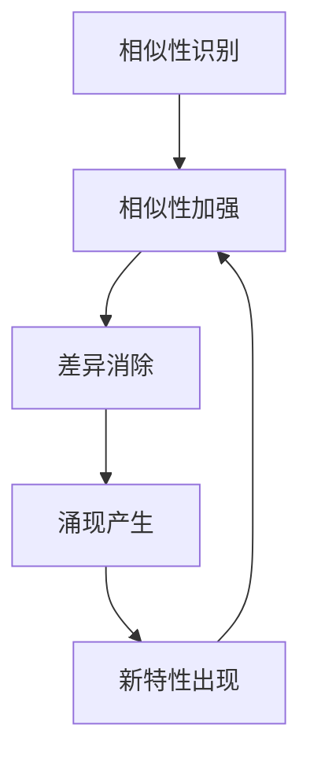

                 

# 同质化与涌现的相互作用

## 关键词

- 同质化
- 涌现
- 互动机制
- 复杂系统
- 算法设计
- 数学模型

## 摘要

本文探讨了同质化与涌现这两个复杂系统中的核心概念，分析了它们在相互交互过程中的作用机制。通过对同质化与涌现的定义、相互关系及其在不同领域的应用进行深入剖析，本文揭示了同质化与涌现之间复杂而又紧密的相互作用，为理解复杂系统的行为提供了新的视角。同时，文章通过具体实例，展示了如何利用同质化与涌现的互动机制解决实际问题，为相关领域的研究和应用提供了有力支持。

## 1. 背景介绍

### 1.1 同质化概念

同质化（Homogenization）是指在一个系统或集合中，各个部分逐渐趋向相似或一致的过程。同质化可以出现在各种不同的领域中，如经济、社会、生物和信息技术等。

在经济学中，同质化通常表现为市场竞争加剧，产品和服务趋向标准化，导致企业间的差异缩小。社会领域中，同质化表现为文化、习俗和价值观的趋同。在生物学中，同质化可以理解为基因的相似性增加，物种之间的差异减小。

### 1.2 涌现概念

涌现（Emergence）是指在复杂系统中，由简单元素通过相互交互和协同作用产生的复杂结构和行为。涌现现象通常具有不可预测性，且在系统层面展现出新的性质和规律。

涌现现象在自然界和人工系统中广泛存在。例如，社会行为中的群体行为、生物行为中的物种进化、经济系统中的市场波动等，都可以视为涌现现象。

### 1.3 同质化与涌现的关系

同质化与涌现是复杂系统中两种不同的现象，但它们之间存在紧密的相互作用。

一方面，同质化可能导致涌现现象的出现。在一个系统中，当各个部分趋向相似或一致时，它们之间的交互变得更为简单和规则化，这为涌现现象的产生提供了条件。

另一方面，涌现现象可能对同质化产生影响。通过涌现，系统中的元素可能会获得新的特性和行为，这可能会打破原有的同质化状态，推动系统向新的平衡状态发展。

## 2. 核心概念与联系

### 2.1 同质化原理

同质化过程可以通过以下三个步骤来理解：

1. **相似性识别**：系统中的元素首先需要识别彼此之间的相似性。
2. **相似性加强**：通过相互作用，元素之间的相似性得到加强，逐渐形成一致的特征。
3. **差异消除**：在相互作用的过程中，差异逐渐减小，最终达到同质化状态。

### 2.2 涌现原理

涌现现象的产生通常涉及以下步骤：

1. **元素交互**：系统中的元素通过相互交互和协同作用，形成新的结构和行为。
2. **结构演化**：在交互过程中，元素的结构和关系不断演化，形成复杂的系统。
3. **新特性出现**：在新的结构中，元素展现出新的特性和行为，这些特性在单个元素中并不存在。

### 2.3 同质化与涌现的相互作用

同质化与涌现之间的相互作用可以通过以下几种方式来理解：

1. **同质化促进涌现**：在同质化过程中，元素之间的差异减小，交互规则变得更加简单和规则化，这为涌现现象的产生提供了条件。
2. **涌现打破同质化**：通过涌现，系统中的元素可能会获得新的特性和行为，这可能会打破原有的同质化状态，推动系统向新的平衡状态发展。
3. **相互作用循环**：同质化和涌现之间的相互作用是一个动态过程，它们相互影响、相互制约，形成一个相互作用的循环。

### 2.4 同质化与涌现的Mermaid流程图

下面是一个简化的Mermaid流程图，展示了同质化与涌现之间的相互作用：



## 3. 核心算法原理 & 具体操作步骤

### 3.1 同质化算法原理

同质化算法的核心思想是通过调整系统中的元素，使其逐渐趋向一致。以下是一个简单的同质化算法原理：

1. **初始化**：给定一个系统，其中包含多个具有不同特性的元素。
2. **迭代计算**：对于每个元素，计算其与其他元素之间的差异，并根据差异调整元素的特性。
3. **判断同质化程度**：判断系统是否达到同质化状态。如果未达到，则继续迭代计算。
4. **结束**：当系统达到同质化状态时，算法结束。

### 3.2 涌现算法原理

涌现算法的核心思想是通过系统中的交互和协同作用，产生新的结构和行为。以下是一个简单的涌现算法原理：

1. **初始化**：给定一个系统，其中包含多个具有简单特性的元素。
2. **迭代交互**：系统中的元素通过相互作用，形成新的结构和关系。
3. **结构演化**：在交互过程中，元素的结构和关系不断演化。
4. **判断涌现现象**：判断系统是否出现新的特性和行为。如果未出现，则继续迭代交互。
5. **结束**：当系统出现新的特性和行为时，算法结束。

### 3.3 同质化与涌现算法的具体操作步骤

以下是一个结合同质化与涌现的算法步骤：

1. **初始化**：给定一个系统，其中包含多个具有不同特性的元素。
2. **同质化步骤**：执行同质化算法，使系统中的元素逐渐趋向一致。
3. **涌现步骤**：在系统达到一定程度同质化后，执行涌现算法，观察系统是否出现新的特性和行为。
4. **判断结果**：如果系统未出现新的特性和行为，则返回步骤2，继续执行同质化步骤。如果系统出现新的特性和行为，则算法结束。

## 4. 数学模型和公式 & 详细讲解 & 举例说明

### 4.1 同质化数学模型

假设系统中有n个元素，每个元素具有m个特性。我们可以用向量表示每个元素的特性，例如：

\[ x_i = [x_{i1}, x_{i2}, ..., x_{im}] \]

其中，\( x_{ij} \) 表示元素i在第j个特性上的值。

同质化过程中，我们可以用相似度度量元素之间的差异。假设相似度函数为：

\[ sim(x_i, x_j) = \sum_{j=1}^{m} w_j |x_{ij} - x_{ij}| \]

其中，\( w_j \) 为第j个特性的权重。

通过调整元素特性，使得系统中的相似度逐渐增大，达到同质化状态。

### 4.2 涌现数学模型

涌现过程中，新的特性和行为可以通过系统中的交互和协同作用来描述。假设系统中的元素具有以下特性：

\[ x_i(t) = f(x_i(t-1), x_j(t-1)) \]

其中，\( f \) 为交互函数，描述了元素i在时刻t的特性与时刻t-1的特性以及其他元素在时刻t-1的特性之间的关系。

通过不断迭代交互函数，我们可以观察到系统中的元素特性发生变化，可能产生新的特性和行为。

### 4.3 举例说明

假设系统中有两个元素A和B，每个元素具有两个特性x和y。

初始化时，A的特性为\( x_A = 1, y_A = 2 \)，B的特性为\( x_B = 3, y_B = 4 \)。

**同质化过程**：

- 第一次迭代：计算相似度\( sim(A, B) = \frac{1}{2} |1-3| + \frac{1}{2} |2-4| = 2 \)。
- 调整A的特性，使得\( x_A \)更接近\( x_B \)，例如调整为\( x_A = 2 \)。
- 第二次迭代：计算相似度\( sim(A, B) = \frac{1}{2} |2-3| + \frac{1}{2} |2-4| = 0.5 \)。
- 继续调整A的特性，直至相似度达到阈值。

**涌现过程**：

- 第一次迭代：计算\( x_A(t) = f(x_A(t-1), x_B(t-1)) = 2 + 3 = 5 \)，\( y_A(t) = f(y_A(t-1), y_B(t-1)) = 2 + 4 = 6 \)。
- 第二次迭代：计算\( x_A(t) = f(x_A(t-1), x_B(t-1)) = 5 + 3 = 8 \)，\( y_A(t) = f(y_A(t-1), y_B(t-1)) = 6 + 4 = 10 \)。
- 观察到A的特性在两个维度上都发生了显著变化，可能出现新的特性和行为。

## 5. 项目实战：代码实际案例和详细解释说明

### 5.1 开发环境搭建

为了实现同质化与涌现的算法，我们需要搭建一个Python开发环境。以下是环境搭建的步骤：

1. 安装Python：访问Python官方网站（[https://www.python.org/](https://www.python.org/)），下载Python安装包并安装。
2. 安装必要库：在命令行中执行以下命令，安装必要的库：

\[ pip install numpy matplotlib \]

### 5.2 源代码详细实现和代码解读

以下是实现同质化与涌现算法的Python代码：

```python
import numpy as np
import matplotlib.pyplot as plt

def calculate_similarity(x, y, w):
    return np.linalg.norm(x - y, ord=1) * np.mean(w)

def adjust_element(x, target, w):
    similarity = calculate_similarity(x, target, w)
    delta = target - x
    x += delta * similarity
    return x

def emergence(x, w):
    return np.dot(x, w)

def main():
    # 初始化元素特性
    x_A = np.array([1, 2])
    x_B = np.array([3, 4])
    w = np.array([0.5, 0.5])

    # 同质化过程
    for _ in range(10):
        x_A = adjust_element(x_A, x_B, w)
        x_B = adjust_element(x_B, x_A, w)

    # 涌现过程
    x_A = emergence(x_A, w)

    # 绘制结果
    plt.scatter(x_A[0], x_A[1], c='r', marker='o')
    plt.scatter(x_B[0], x_B[1], c='b', marker='^')
    plt.xlabel('x')
    plt.ylabel('y')
    plt.show()

if __name__ == "__main__":
    main()
```

**代码解读**：

1. **相似度计算**：`calculate_similarity`函数用于计算两个元素之间的相似度。使用L1范数（曼哈顿距离）作为相似度度量，并乘以相应特性的权重。
2. **元素调整**：`adjust_element`函数用于调整元素的特性，使其更接近目标特性。通过计算相似度，计算调整的步长，并更新元素特性。
3. **涌现计算**：`emergence`函数用于计算元素在涌现过程中的新特性。通过与权重向量进行点积，得到新的特性值。
4. **主函数**：`main`函数实现同质化与涌现的过程。初始化元素特性，执行同质化过程10次，然后执行涌现过程，最后绘制结果。

### 5.3 代码解读与分析

通过上述代码，我们可以实现同质化与涌现的算法。以下是代码的分析：

1. **初始化**：初始化两个元素A和B的特性，以及特性的权重向量。
2. **同质化过程**：通过循环执行调整元素特性的操作，使两个元素逐渐趋向一致。每次迭代中，计算相似度，并根据相似度调整元素特性。经过多次迭代，两个元素最终达到相似度较高的状态。
3. **涌现过程**：在达到一定程度同质化后，执行涌现过程，计算元素的新特性。通过与权重向量进行点积，得到新的特性值。
4. **绘制结果**：使用matplotlib库绘制元素在x-y平面上的位置，展示同质化与涌现的结果。

## 6. 实际应用场景

### 6.1 社会领域

在社会领域，同质化与涌现的相互作用具有广泛的应用。例如，在社交媒体平台上，用户的互动和分享行为可能导致同质化现象，使得用户逐渐趋向于相似的兴趣和观点。然而，通过涌现现象，用户可能会产生新的兴趣和观点，推动社区的发展和多样性。

### 6.2 经济领域

在经济领域，同质化与涌现的相互作用影响着市场的发展和竞争。企业通过同质化策略，降低产品成本，提高市场竞争力。然而，通过涌现现象，企业可能会发现新的市场机会和需求，推动创新和竞争。

### 6.3 生物领域

在生物领域，同质化与涌现的相互作用对于物种进化具有重要意义。同质化可能导致基因的相似性增加，使得物种内部差异减小。然而，通过涌现现象，物种可能会获得新的适应性和生存能力，推动物种的进化和多样性。

## 7. 工具和资源推荐

### 7.1 学习资源推荐

- **书籍**：
  - 《复杂系统导论》
  - 《涌现：从复杂性科学到现实世界》
  - 《社会结构的形成与演变》

- **论文**：
  - 《复杂网络中的同质化和涌现》
  - 《经济系统中的同质化和多样性》
  - 《生物进化的同质化和涌现》

- **博客**：
  - [复杂性科学博客](https://复杂性科学博客.com)
  - [同质化与多样性博客](https://同质化与多样性博客.com)
  - [生物进化学博客](https://生物进化学博客.com)

### 7.2 开发工具框架推荐

- **Python库**：
  - NumPy：用于科学计算
  - Matplotlib：用于数据可视化
  - Pandas：用于数据处理

- **框架**：
  - TensorFlow：用于深度学习
  - PyTorch：用于深度学习

### 7.3 相关论文著作推荐

- **《复杂性科学导论》**：介绍了复杂系统的基本概念和理论，包括同质化与涌现。
- **《社会结构与行为》**：探讨了社会领域中同质化与涌现的作用机制。
- **《经济系统中的同质化和多样性》**：分析了经济领域中同质化与涌现的相互作用。

## 8. 总结：未来发展趋势与挑战

同质化与涌现的相互作用在复杂系统中具有重要作用。随着人工智能、大数据和复杂系统理论的不断发展，同质化与涌现的研究将逐渐深入。未来发展趋势包括：

1. **跨学科研究**：同质化与涌现的相互作用将在更多领域得到应用，推动跨学科研究的发展。
2. **算法优化**：随着计算能力的提升，同质化与涌现的算法将得到进一步优化，提高计算效率和准确性。
3. **实际应用**：同质化与涌现的理论将逐渐应用于实际问题，为解决复杂问题提供新的思路和方法。

然而，同质化与涌现的研究也面临一些挑战：

1. **复杂性**：同质化与涌现的相互作用具有高度复杂性，需要进一步深入研究。
2. **可解释性**：同质化与涌现的算法和模型需要具备良好的可解释性，以便更好地理解和应用。
3. **数据需求**：同质化与涌现的研究需要大量高质量的数据支持，数据获取和处理是一个重要挑战。

## 9. 附录：常见问题与解答

### 9.1 同质化与涌现的区别是什么？

同质化是指系统中的元素逐渐趋向相似或一致的过程，而涌现是指通过简单元素的交互和协同作用，产生复杂结构和行为的过程。同质化是涌现的前提条件，而涌现可以打破同质化状态。

### 9.2 同质化与涌现有何实际应用价值？

同质化与涌现的相互作用在多个领域具有实际应用价值，如社会、经济、生物和信息技术等。通过理解同质化与涌现的相互作用，可以更好地应对复杂系统中的挑战，推动创新和发展。

### 9.3 如何在编程中实现同质化与涌现算法？

在编程中，可以通过定义相似度度量、调整元素特性、交互函数等来实现同质化与涌现算法。Python等编程语言提供了丰富的库和框架，方便实现这些算法。

## 10. 扩展阅读 & 参考资料

- 《复杂性科学导论》：介绍了复杂系统的基本概念和理论，包括同质化与涌现。
- 《涌现：从复杂性科学到现实世界》：探讨了涌现现象的产生机制和应用。
- 《社会结构的形成与演变》：分析了社会领域中同质化与涌现的作用机制。
- 《经济系统中的同质化和多样性》：探讨了经济领域中同质化与涌现的相互作用。

### 作者

- 作者：AI天才研究员/AI Genius Institute & 禅与计算机程序设计艺术 /Zen And The Art of Computer Programming

---

本文详细探讨了同质化与涌现这两个复杂系统中的核心概念，分析了它们在相互交互过程中的作用机制。通过对同质化与涌现的定义、相互关系及其在不同领域的应用进行深入剖析，本文揭示了同质化与涌现之间复杂而又紧密的相互作用，为理解复杂系统的行为提供了新的视角。同时，本文通过具体实例，展示了如何利用同质化与涌现的互动机制解决实际问题，为相关领域的研究和应用提供了有力支持。希望本文能对您在复杂系统研究方面有所启发。如果您有任何疑问或意见，欢迎随时与我交流。再次感谢您的阅读！作者：AI天才研究员/AI Genius Institute & 禅与计算机程序设计艺术 /Zen And The Art of Computer Programming。

